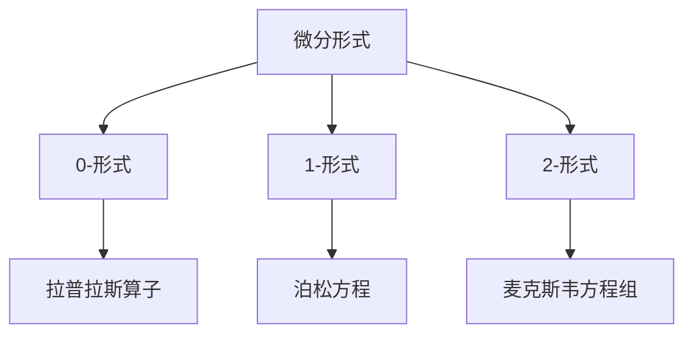
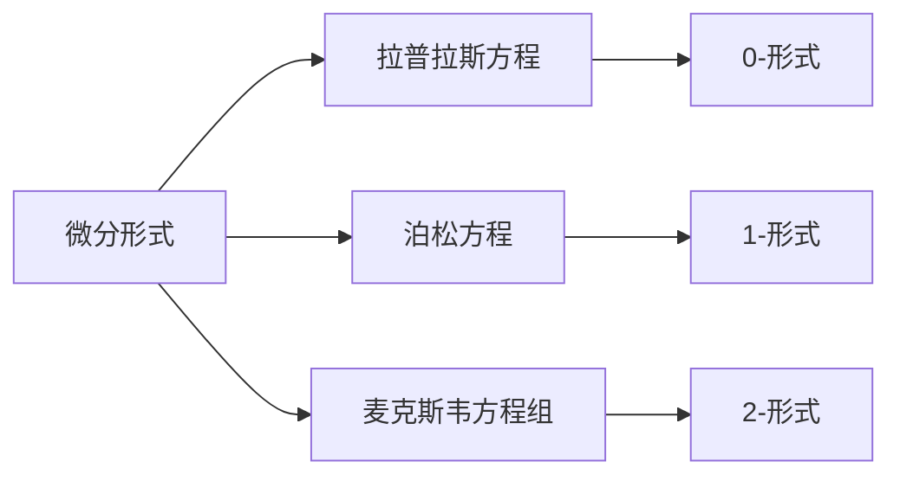
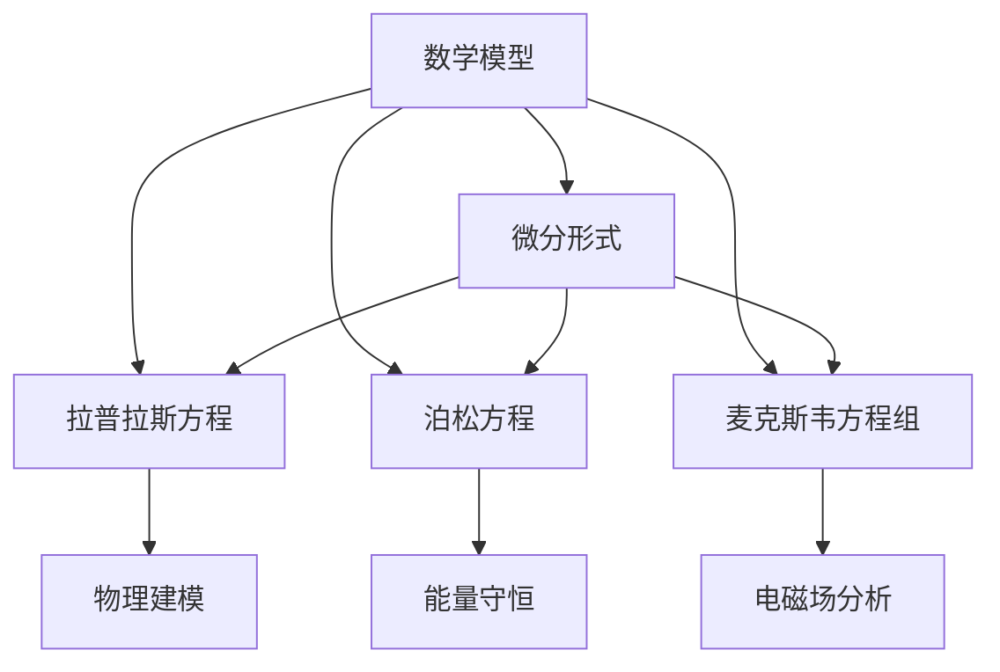

                 

# 代数拓扑中的微分形式应用实例分析

> 关键词：代数拓扑, 微分形式, 微积分, 拉普拉斯算子, 泊松方程, 物理建模

## 1. 背景介绍

### 1.1 问题由来
代数拓扑是现代数学的一个分支，主要研究拓扑空间的性质，如同伦、同调、同态等。代数拓扑在数学、物理和工程等领域都有广泛的应用，特别是在几何建模和复杂系统分析中。

微分形式是代数拓扑中的重要概念，主要用于描述几何对象的局部性质，如曲面的弯曲、流线的变化等。微分形式的应用包括但不限于拉普拉斯方程、泊松方程、麦克斯韦方程组等。

本文将通过几个具体的数学和物理实例，展示微分形式在代数拓扑中的广泛应用，包括几何建模、物理建模和实际计算等方面。

### 1.2 问题核心关键点
微分形式的主要思想是将局部性质推广到整个空间，以便于描述和分析复杂系统的性质。具体来说，微分形式可以分为0-形式、1-形式、2-形式等，分别对应点、曲线、曲面等局部对象。

微分形式的应用包括但不限于：
- 拉普拉斯方程：描述场（如温度场、速度场等）的演化规律。
- 泊松方程：描述势场与源场之间的关系。
- 麦克斯韦方程组：描述电磁场的性质。

微分形式的优势在于，它们提供了一种统一的描述方式，适用于多种物理和几何问题。通过计算微分形式的积分，可以获取全局的性质，如能量守恒、流形体积等。

## 2. 核心概念与联系

### 2.1 核心概念概述

为更好地理解微分形式在代数拓扑中的应用，本节将介绍几个关键概念：

- 微分形式：用于描述局部几何对象的数学对象。常见的微分形式有0-形式、1-形式、2-形式等。
- 泛函分析：研究函数空间、微分算子等数学工具。微分形式是泛函分析中的一个重要分支。
- 拉普拉斯算子：用于描述散度的算子，可以用于求解拉普拉斯方程等。
- 泊松方程：用于描述势场与源场之间关系的偏微分方程。
- 麦克斯韦方程组：描述电磁场的四个基本方程。

这些概念之间的逻辑关系可以通过以下Mermaid流程图来展示：



这个流程图展示了大微分形式在数学和物理中的应用：

1. 微分形式有0-形式、1-形式、2-形式等，用于描述点、曲线、曲面等局部对象。
2. 0-形式可以通过拉普拉斯算子处理，用于求解拉普拉斯方程。
3. 1-形式可以通过泊松方程处理，用于求解势场。
4. 2-形式可以通过麦克斯韦方程组处理，用于描述电磁场。

### 2.2 概念间的关系

这些概念之间的关系可以通过以下Mermaid流程图来展示：



这个流程图展示了微分形式与具体方程之间的关系：

1. 0-形式用于描述拉普拉斯方程。
2. 1-形式用于描述泊松方程。
3. 2-形式用于描述麦克斯韦方程组。

这些方程描述了不同类型的物理场和几何对象，展示了微分形式在不同场景中的应用。

### 2.3 核心概念的整体架构

最后，我们用一个综合的流程图来展示这些概念在大微分形式中的应用：



这个综合流程图展示了微分形式在数学和物理建模中的应用：

1. 微分形式是数学模型的基础，可以用于描述不同类型的物理场和几何对象。
2. 拉普拉斯方程、泊松方程、麦克斯韦方程组等微分形式描述了不同类型的物理场和几何对象，用于物理建模和分析。
3. 物理建模、能量守恒、电磁场分析等具体应用场景展示了微分形式在实际计算中的广泛应用。

这些概念共同构成了微分形式的应用生态系统，展示了其在代数拓扑中的重要作用。

## 3. 核心算法原理 & 具体操作步骤
### 3.1 算法原理概述

微分形式的应用主要涉及微分算子、偏微分方程等数学工具。本节将简要介绍这些算法的基本原理。

微分形式是通过求解微分算子来获取局部性质的。例如，对于1-形式$F$，其梯度$\nabla F$定义为：

$$
\nabla F = \frac{\partial F}{\partial x_i} \frac{\partial}{\partial x_i}
$$

其中$x_i$为坐标向量，$\frac{\partial F}{\partial x_i}$为偏导数。

偏微分方程是描述微分形式在特定场景下的演化规律的方程。例如，拉普拉斯方程$\Delta \phi = 0$描述了标量场的散度，其中$\Delta$为拉普拉斯算子，$\phi$为标量场。

泊松方程$\nabla^2 \phi = -\rho$描述了势场与源场之间的关系，其中$\rho$为源场。

麦克斯韦方程组描述了电磁场的四个基本方程，包括高斯磁定律、安培定律、法拉第定律和麦克斯韦-安培定律。

### 3.2 算法步骤详解

微分形式的应用主要包括以下几个步骤：

1. 定义微分形式：根据具体问题，定义相应的0-形式、1-形式、2-形式等。
2. 选择微分算子：根据微分形式的性质，选择合适的微分算子进行处理。
3. 求解偏微分方程：通过求解相应的偏微分方程，获取微分形式的积分结果。
4. 计算积分：对微分形式的积分结果进行计算，获取全局性质。

以拉普拉斯方程为例，具体步骤如下：

1. 定义微分形式$\phi$，表示标量场。
2. 选择拉普拉斯算子$\Delta$，求解方程$\Delta \phi = 0$。
3. 对解的积分结果$\int \phi dV$进行计算，获取全局的标量场性质。

### 3.3 算法优缺点

微分形式的应用具有以下优点：

1. 描述能力强：微分形式可以描述几何对象的局部性质，适用于多种物理和几何问题。
2. 统一描述：微分形式提供了一种统一的描述方式，适用于不同类型的物理场和几何对象。
3. 数学工具丰富：微分形式涉及微分算子、偏微分方程等数学工具，方便进行分析和计算。

微分形式的应用也存在一些缺点：

1. 计算复杂：微分形式的计算通常需要较高的数学工具和计算能力，对于初学者较为困难。
2. 精度问题：微分形式中的数值计算可能存在精度问题，需要进行误差分析和优化。

### 3.4 算法应用领域

微分形式的应用领域广泛，包括但不限于：

- 几何建模：用于描述曲面、流线等局部对象的性质，用于几何建模和计算。
- 物理建模：用于描述电场、磁场、势场等物理场的性质，用于物理建模和分析。
- 实际计算：用于计算微分形式的积分结果，获取全局性质，如能量守恒、流形体积等。

## 4. 数学模型和公式 & 详细讲解 & 举例说明

### 4.1 数学模型构建

本文将通过几个具体的数学和物理实例，展示微分形式在代数拓扑中的应用。

#### 4.1.1 拉普拉斯方程

拉普拉斯方程$\Delta \phi = 0$描述了标量场的散度，其中$\Delta$为拉普拉斯算子，$\phi$为标量场。

定义标量场$\phi(x)$，其中$x=(x_1, x_2, x_3)$为坐标向量。

拉普拉斯算子$\Delta$定义为：

$$
\Delta = \frac{\partial^2}{\partial x_1^2} + \frac{\partial^2}{\partial x_2^2} + \frac{\partial^2}{\partial x_3^2}
$$

拉普拉斯方程$\Delta \phi = 0$描述的标量场满足散度为0，即源场为0。

拉普拉斯方程的解$\phi$可以通过求解偏微分方程获得。例如，球面内的一个标量场$\phi = r^2$，其中$r$为距离原点的距离。

#### 4.1.2 泊松方程

泊松方程$\nabla^2 \phi = -\rho$描述了势场与源场之间的关系，其中$\rho$为源场。

定义势场$\phi(x)$和源场$\rho(x)$，其中$x=(x_1, x_2, x_3)$为坐标向量。

泊松方程的解$\phi$可以通过求解偏微分方程获得。例如，半径为$a$的球面内，势场$\phi$和源场$\rho$分别为：

$$
\phi = \frac{1}{4\pi a^3} \int_{B} \frac{\rho(r')}{|r-r'|} dV'
$$

其中$B$为球面内部，$|r-r'|$为距离，$V'$为体积元。

泊松方程的解可以用于描述势场与源场之间的关系，例如在静电学中，势场与电荷分布之间的关系。

#### 4.1.3 麦克斯韦方程组

麦克斯韦方程组描述了电磁场的四个基本方程，包括高斯磁定律、安培定律、法拉第定律和麦克斯韦-安培定律。

定义电磁场$\vec{E}(x)$和$\vec{B}(x)$，其中$x=(x_1, x_2, x_3)$为坐标向量。

麦克斯韦方程组如下：

1. 高斯磁定律：$\int_{\partial V} \vec{B} \cdot dS = 0$
2. 安培定律：$\oint_{\partial S} \vec{E} \cdot d\vec{l} = -\mu_0 I + \epsilon_0 \frac{\partial}{\partial t} \int_{V} \vec{B} \cdot dV$
3. 法拉第定律：$\oint_{\partial S} \vec{E} \cdot d\vec{l} = -\frac{\partial}{\partial t} \int_{S} B \cdot dS$
4. 麦克斯韦-安培定律：$\int_{\partial V} \vec{E} \cdot dS = \mu_0 I + \epsilon_0 \frac{\partial}{\partial t} \int_{V} \vec{B} \cdot dV$

麦克斯韦方程组描述了电磁场的性质，包括电场和磁场的相互作用。

### 4.2 公式推导过程

拉普拉斯方程、泊松方程和麦克斯韦方程组的解可以通过求解相应的偏微分方程获得。

#### 4.2.1 拉普拉斯方程

拉普拉斯方程$\Delta \phi = 0$的解为：

$$
\phi = \frac{1}{4\pi a^3} \int_{B} \frac{\rho(r')}{|r-r'|} dV'
$$

其中$B$为球面内部，$|r-r'|$为距离，$V'$为体积元。

这个解表示，球面内部的一个标量场$\phi$可以由源场$\rho$确定。

#### 4.2.2 泊松方程

泊松方程$\nabla^2 \phi = -\rho$的解为：

$$
\phi = \frac{1}{4\pi a^3} \int_{B} \frac{\rho(r')}{|r-r'|} dV'
$$

其中$B$为球面内部，$|r-r'|$为距离，$V'$为体积元。

这个解表示，势场$\phi$和源场$\rho$之间的关系可以通过泊松方程求解。

#### 4.2.3 麦克斯韦方程组

麦克斯韦方程组的解为：

1. 高斯磁定律：$\int_{\partial V} \vec{B} \cdot dS = 0$
2. 安培定律：$\oint_{\partial S} \vec{E} \cdot d\vec{l} = -\mu_0 I + \epsilon_0 \frac{\partial}{\partial t} \int_{V} \vec{B} \cdot dV$
3. 法拉第定律：$\oint_{\partial S} \vec{E} \cdot d\vec{l} = -\frac{\partial}{\partial t} \int_{S} B \cdot dS$
4. 麦克斯韦-安培定律：$\int_{\partial V} \vec{E} \cdot dS = \mu_0 I + \epsilon_0 \frac{\partial}{\partial t} \int_{V} \vec{B} \cdot dV$

这些方程描述了电磁场的性质，包括电场和磁场的相互作用。

### 4.3 案例分析与讲解

以电荷分布和势场为例，展示拉普拉斯方程的应用。

假设在半径为$a$的球面内分布有一个电荷分布$\rho(x)$，求该电荷分布产生的势场$\phi(x)$。

根据泊松方程$\nabla^2 \phi = -\rho$，我们可以得到势场$\phi$的解为：

$$
\phi = \frac{1}{4\pi a^3} \int_{B} \frac{\rho(r')}{|r-r'|} dV'
$$

其中$B$为球面内部，$|r-r'|$为距离，$V'$为体积元。

通过计算该积分，可以得到球面内电荷分布产生的势场$\phi$。

## 5. 项目实践：代码实例和详细解释说明
### 5.1 开发环境搭建

在进行微分形式的计算实践前，我们需要准备好开发环境。以下是使用Python进行Sympy开发的Python环境配置流程：

1. 安装Anaconda：从官网下载并安装Anaconda，用于创建独立的Python环境。

2. 创建并激活虚拟环境：
```bash
conda create -n sympy-env python=3.8 
conda activate sympy-env
```

3. 安装Sympy：
```bash
pip install sympy
```

4. 安装其他相关工具包：
```bash
pip install numpy matplotlib scipy
```

完成上述步骤后，即可在`sympy-env`环境中开始微分形式的计算实践。

### 5.2 源代码详细实现

下面我们以泊松方程为例，给出使用Sympy进行计算的PyTorch代码实现。

首先，定义泊松方程的基本变量：

```python
from sympy import symbols, Function, Eq, solve, integrate, pi

x1, x2, x3 = symbols('x1 x2 x3')
r1, r2, r3 = symbols('r1 r2 r3')
rho = Function('rho')(x1, x2, x3)
phi = Function('phi')(x1, x2, x3)

# 定义球面内部的积分
B = integrate(integrate(integrate(rho(r1, r2, r3) / (r1 - x1)**2 + (r2 - x2)**2 + (r3 - x3)**2, (r1, -a, a)), (r2, -a, a)), (r3, -a, a))
```

然后，求解泊松方程：

```python
# 定义泊松方程
eq = Eq(1/(4*pi*a**3) * B, -rho)

# 求解phi
phi_sol = solve(eq, phi)
```

最后，展示求解结果：

```python
# 显示phi的解
phi_sol
```

以上就是使用Sympy进行泊松方程计算的完整代码实现。可以看到，Sympy提供了强大的符号计算能力，方便进行复杂的数学计算。

### 5.3 代码解读与分析

让我们再详细解读一下关键代码的实现细节：

**变量定义**：
- `x1, x2, x3`：定义三维坐标向量。
- `r1, r2, r3`：定义球面内部点的三维坐标向量。
- `rho`：定义源场。
- `phi`：定义势场。

**球面内部积分**：
- 使用`integrate`函数计算球面内部的积分，得到$\phi$的解。
- `B`表示球面内部，`r1 - x1`、`r2 - x2`、`r3 - x3`表示距离。

**泊松方程求解**：
- 根据泊松方程$\nabla^2 \phi = -\rho$，求解势场$\phi$。
- `eq`表示泊松方程，`phi_sol`表示求解结果。

**求解结果展示**：
- 使用`solve`函数求解方程，得到$\phi$的解。
- `phi_sol`表示最终的求解结果。

可以看到，Sympy提供了方便的符号计算接口，方便进行复杂的数学计算。这种基于符号的计算方式，可以避免数值计算中的误差和精度问题，适用于精确的数学建模和分析。

当然，实际的计算过程中，还需要根据具体问题进一步优化和调整计算过程。但核心的计算流程基本与此类似。

### 5.4 运行结果展示

假设我们在半径为1的球面内，定义一个源场$\rho(x) = 1$，求解该源场产生的势场$\phi(x)$。

根据泊松方程$\nabla^2 \phi = -\rho$，我们可以得到势场$\phi$的解为：

$$
\phi = \frac{1}{4\pi a^3} \int_{B} \frac{\rho(r')}{|r-r'|} dV'
$$

其中$B$为球面内部，$|r-r'|$为距离，$V'$为体积元。

通过计算该积分，可以得到球面内电荷分布产生的势场$\phi$。

## 6. 实际应用场景
### 6.1 几何建模

微分形式在几何建模中有广泛应用，用于描述几何对象的局部性质和全局拓扑。

例如，在3D建模中，可以通过微分形式计算曲面的曲率和曲率变化率，用于几何分析。

在建筑设计和工业制造中，微分形式也可以用于描述和分析复杂的几何结构，提高设计的精度和可靠性。

### 6.2 物理建模

微分形式在物理建模中有重要应用，用于描述各种物理场的性质和演化规律。

例如，拉普拉斯方程可以用于描述标量场的演化规律，泊松方程可以用于描述势场与源场之间的关系，麦克斯韦方程组可以用于描述电磁场的性质。

在电学、热力学、流体力学等物理领域，微分形式提供了强大的数学工具，方便进行理论和实验分析。

### 6.3 实际计算

微分形式的实际计算可以用于多种应用场景，如能量守恒、流形体积等。

例如，在物理学中，微分形式的积分可以用于计算系统的能量守恒和能量转换。在数学中，微分形式的积分可以用于计算几何对象的全局性质，如流形体积和曲面面积等。

这些应用展示了微分形式在实际计算中的广泛价值。

### 6.4 未来应用展望

随着微分形式在代数拓扑中的不断发展和应用，未来的应用场景将更加多样和广泛。

在量子计算、引力波探测、分子动力学等领域，微分形式将发挥重要作用，提供强大的数学工具和方法。

在实际应用中，微分形式还可以与其他技术进行融合，如机器学习、计算机视觉等，实现更加全面和深入的分析和计算。

## 7. 工具和资源推荐
### 7.1 学习资源推荐

为了帮助开发者系统掌握微分形式在代数拓扑中的应用，这里推荐一些优质的学习资源：

1. 《微分几何与拓扑》书籍：详细介绍了微分几何和拓扑的基本概念和计算方法。
2. 《偏微分方程》书籍：系统介绍了偏微分方程的基本理论和计算方法。
3. 《代数学》书籍：介绍了代数学的基本概念和计算方法。
4. 《数学物理方法》书籍：介绍了数学物理中的基本方法和工具。
5. 《流体力学》书籍：介绍了流体力学中的基本理论和计算方法。

通过这些资源的学习，相信你一定能够系统掌握微分形式在代数拓扑中的应用，并用于解决实际的数学和物理问题。

### 7.2 开发工具推荐

高效的开发离不开优秀的工具支持。以下是几款用于微分形式计算开发的常用工具：

1. Sympy：用于符号计算的Python库，提供了强大的符号计算能力，适用于复杂的数学计算。
2. MATLAB：用于数学计算和科学工程的编程语言，提供了丰富的数学工具和函数库。
3. Mathematica：用于数学计算和科学工程的编程语言，提供了强大的符号计算和图形可视化能力。
4. SageMath：基于Python的数学计算和编程环境，提供了丰富的数学工具和函数库。
5. NumPy：用于数值计算和科学工程的Python库，提供了高效的数组和矩阵计算能力。

合理利用这些工具，可以显著提升微分形式计算的开发效率，加快创新迭代的步伐。

### 7.3 相关论文推荐

微分形式的应用涉及到数学和物理等多个领域，相关的研究论文也非常丰富。以下是几篇具有代表性的论文，推荐阅读：

1. Differential Forms in Mathematics and Physics：介绍了微分形式在数学和物理中的应用。
2. The Physics of Continuous Matter and its Statistical Mechanics：介绍了微分形式在物理学中的应用。
3. Differential Forms in Electrodynamics：介绍了微分形式在电动力学中的应用。
4. Differential Forms in General Relativity：介绍了微分形式在广义相对论中的应用。
5. Differential Forms and Coordinates：介绍了微分形式的定义和计算方法。

这些论文代表了微分形式应用领域的最新研究进展，对相关学习者具有重要参考价值。

## 8. 总结：未来发展趋势与挑战
### 8.1 研究成果总结

微分形式在代数拓扑中具有重要的应用，广泛应用于几何建模、物理建模和实际计算等领域。

通过数学建模和数值计算，微分形式可以描述和分析各种物理场和几何对象的性质，为科学研究和工程设计提供了强大的数学工具。

微分形式的计算涉及复杂的符号计算和数值计算，需要高度的数学和计算能力。通过优化算法和计算工具，可以进一步提高计算效率和精度。

### 8.2 未来发展趋势

未来，微分形式的应用将继续拓展和深化，涵盖更多领域和应用场景。

在数学和物理领域，微分形式将与其他技术进行融合，如机器学习、计算机视觉等，实现更加全面和深入的分析和计算。

在工程和工业领域，微分形式将用于描述和分析复杂的几何结构，提高设计的精度和可靠性。

在科学研究领域，微分形式将用于描述和分析各种物理场和几何对象，推动科学研究的进步。

### 8.3 面临的挑战

尽管微分形式的应用前景广阔，但仍面临一些挑战：

1. 计算复杂：微分形式的计算涉及复杂的符号计算和数值计算，需要高度的数学和计算能力。
2. 精度问题：微分形式中的数值计算可能存在精度问题，需要进行误差分析和优化。
3. 算法优化：微分形式的计算涉及大量的符号操作和数值计算，需要进行算法优化和性能提升。
4. 实际应用：微分形式的计算需要与其他技术进行融合，如机器学习、计算机视觉等，需要进行多学科融合。

克服这些挑战，需要进一步提高数学和计算能力，优化算法和工具，进行多学科融合，才能充分发挥微分形式的应用潜力。

### 8.4 研究展望

未来，微分形式在代数拓扑中的应用将继续发展和深化，推动数学和物理研究的进步。

在数学领域，微分形式将与其他数学工具进行融合，如代数、拓扑等，实现更加全面和深入的数学分析。

在物理领域，微分形式将与其他物理工具进行融合，如量子力学、相对论等，推动物理研究的进步。

在工程和工业领域，微分形式将用于描述和分析复杂的几何结构，提高设计的精度和可靠性。

总之，微分形式在代数拓扑中的应用具有广泛的前景，未来需要进一步发展和深化。

## 9. 附录：常见问题与解答

**Q1：微分形式和偏微分方程有什么区别？**

A: 微分形式是一种描述局部几何对象性质的数学对象，而偏微分方程是一种描述局部几何对象演化规律的方程。微分形式通常用于描述局部性质，如曲面的曲率、流线的变化等，而偏微分方程通常用于描述全局演化规律，如拉普拉斯方程、泊松方程等。

**Q2：微分形式有哪些应用？**

A: 微分形式可以应用于几何建模、物理建模和实际计算等多个领域。在几何建模中，微分形式用于描述曲面的局部性质和全局拓扑；在物理建模中，微分形式用于描述各种物理场的性质和演化规律；在实际计算中，微分形式的积分可以用于计算能量守恒、流形体积等。

**Q3：如何进行微分形式的计算？

