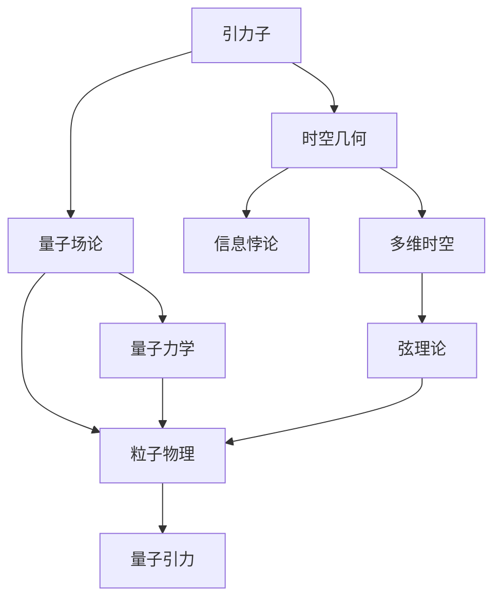

                 

## 1. 背景介绍

量子引力是现代物理学中最重要的未解之谜之一，旨在将量子力学与广义相对论这两大支柱理论统一起来。该领域的研究成果对理解宇宙的微观结构与宏观演化具有重要意义。

### 1.1 问题由来
量子引力研究起源于20世纪初的量子力学和广义相对论的建立。量子力学描述微观世界的粒子行为，而广义相对论则揭示了宇宙宏观结构的演化。两者之间的矛盾和冲突，导致物理学界寻求统一这两大理论的解决方案。

### 1.2 问题核心关键点
量子引力研究的核心问题包括：

1. 如何描述引力子（引力场的基本单位）及其量子行为。
2. 如何建立量子引力方程，统一时空几何和量子态。
3. 如何解释黑洞信息悖论，解决量子态的熵与信息损失问题。
4. 如何探究宇宙的起源、结构和最终命运，包括暗物质、暗能量等未知现象。

### 1.3 问题研究意义
量子引力研究对现代物理学具有深远的意义：

1. 为解决引力问题的基本物理机制提供新视角。
2. 揭示宇宙的基本结构和演化规律，填补当前理论的空白。
3. 促进多个学科交叉融合，激发新的研究方向和理论创新。

## 2. 核心概念与联系

### 2.1 核心概念概述

量子引力研究涉及多个核心概念，包括：

- 引力子：描述引力作用的粒子，具有类似电磁子的性质。
- 量子场论：研究场在量子化条件下的行为，是描述量子引力的基础框架。
- 时空几何：描述时空的弯曲和拓扑结构，是广义相对论的核心概念。
- 信息悖论：涉及黑洞和量子纠缠，研究信息是否能够逃脱黑洞的事件视界。
- 多维时空：探索弦理论中的额外维度，以解决引力问题。
- 弦理论：认为基本粒子由一维的弦组成，弦的振动模式对应不同的粒子。

这些概念之间具有紧密联系，形成量子引力研究的理论体系。下面通过Mermaid流程图来展示这些概念之间的关系：



该流程图展示了引力子通过量子场论和时空几何的概念，以及信息悖论、多维时空和弦理论，最终形成量子引力理论的总体结构。

### 2.2 概念间的关系

- 引力子：引力子作为描述引力的基本粒子，是量子引力研究的重要组成部分。
- 量子场论：量子场论为引力子提供了基本的数学框架，是量子引力的基础。
- 时空几何：时空几何提供了引力作用的空间背景，与量子场论相结合，描述了量子引力理论的场方程。
- 信息悖论：信息悖论是量子引力和量子信息学的交叉领域，探讨信息在黑洞中的命运，对量子引力的理解有重要影响。
- 多维时空：多维时空理论为量子引力提供了新的视角，尝试通过额外维度解决引力问题。
- 弦理论：弦理论是量子引力的前沿研究方向，提供了一种全新的物质结构解释。

这些概念共同构成了量子引力研究的理论框架，有助于理解宇宙的基本规律。

## 3. 核心算法原理 & 具体操作步骤
### 3.1 算法原理概述

量子引力的研究方法主要包括以下几个方面：

- 经典引力场量化的算法：将广义相对论的场方程转化为量子场方程。
- 量子引力路径积分方法：利用路径积分形式表达引力场，求解量子态。
- 弦理论的量子化算法：对弦的振动模式进行正则化和量子化，形成弦理论的数学基础。

### 3.2 算法步骤详解

#### 3.2.1 经典引力场量化

1. **场方程的导出**：根据广义相对论的场方程，导出描述引力场的基本方程。
2. **时空变分**：通过时空的变分，引入引力场的拉格朗日量。
3. **正则化处理**：对拉格朗日量进行正则化处理，引入正则化参数。
4. **泛函积分**：对正则化后的拉格朗日量进行路径积分，求解引力场的量子态。

#### 3.2.2 量子引力路径积分方法

1. **经典路径的路径积分**：对经典路径进行积分，得到经典路径的权重。
2. **量子路径的路径积分**：对所有量子路径进行积分，得到量子引力路径积分的表达式。
3. **微扰展开**：使用微扰展开方法，对量子引力路径积分进行近似处理。
4. **有效作用量的计算**：计算有效作用量，求解引力场的量子态。

#### 3.2.3 弦理论的量子化算法

1. **弦的数学描述**：引入弦的数学描述，将粒子描述为弦的振动模式。
2. **弦的拉格朗日量**：构造弦的拉格朗日量，描述弦的振动。
3. **正则化处理**：对弦的拉格朗日量进行正则化处理，引入正则化参数。
4. **弦的路径积分**：对弦的路径积分进行求解，得到弦的量子态。

### 3.3 算法优缺点

量子引力研究的算法具有以下优点：

1. **数学结构清晰**：算法基于经典的引力场方程和量子场方程，具有清晰的数学结构。
2. **理论深度大**：涉及高深的数学和物理知识，能够深入探讨引力问题的本质。
3. **方法多样**：不同的方法如路径积分、弦理论等，为引力问题的研究提供了多种途径。

同时，算法也存在一些缺点：

1. **计算复杂度高**：涉及复杂的积分和微扰展开，计算量巨大。
2. **模型难以验证**：缺乏实验验证，难以判断理论的正确性。
3. **缺乏可观测结果**：量子引力研究多在数学层面，难以直接观测验证。

### 3.4 算法应用领域

量子引力研究的应用领域主要包括：

1. **基础物理研究**：对宇宙起源、结构、演化等基本物理问题进行研究。
2. **黑洞研究**：研究黑洞的性质、信息悖论，探讨黑洞的内部结构和信息损失问题。
3. **弦理论**：通过弦理论研究物质的基本结构，尝试解释引力问题。
4. **多维时空**：通过多维时空理论，探索额外维度对引力的影响。

## 4. 数学模型和公式 & 详细讲解  
### 4.1 数学模型构建

量子引力的研究通常使用经典引力场方程和量子场方程构建数学模型。以下以爱因斯坦场方程为例，展示数学模型的构建过程：

1. **爱因斯坦场方程**：
$$
R_{\mu\nu} - \frac{1}{2}g_{\mu\nu}R + \Lambda g_{\mu\nu} = \frac{8\pi G}{c^4}T_{\mu\nu}
$$
其中 $R_{\mu\nu}$ 是曲率张量，$R$ 是曲率标量，$\Lambda$ 是宇宙学常数，$T_{\mu\nu}$ 是能动量张量。

2. **拉格朗日量**：
$$
L = \frac{1}{2}g^{\mu\nu}(\partial_{\mu}\phi)(\partial_{\nu}\phi) - V(\phi)
$$
其中 $\phi$ 是标量场，$V(\phi)$ 是势能函数。

3. **正则化**：
$$
L_{reg} = L + \frac{1}{2}\eta^2(\partial_{\mu}\phi)(\partial_{\mu}\phi)
$$
其中 $\eta$ 是正则化参数。

4. **路径积分**：
$$
Z = \int D\phi e^{iS}
$$
其中 $S$ 是作用量。

### 4.2 公式推导过程

以下是爱因斯坦场方程的推导过程：

1. **拉格朗日量**：
$$
L = \frac{1}{2}g^{\mu\nu}(\partial_{\mu}g_{\alpha\beta})(\partial_{\nu}g^{\alpha\beta}) + L_m
$$
其中 $L_m$ 是物质场的拉格朗日量。

2. **作用量**：
$$
S = \int d^4x \sqrt{-g} (L + 2L_m)
$$

3. **欧拉-拉格朗日方程**：
$$
\partial_{\mu}(\frac{\partial L}{\partial(\partial_{\mu}g_{\alpha\beta}))) - \frac{\partial L}{\partial g_{\alpha\beta}} = 0
$$

4. **场方程**：
$$
R_{\mu\nu} - \frac{1}{2}g_{\mu\nu}R + \Lambda g_{\mu\nu} = \frac{8\pi G}{c^4}T_{\mu\nu}
$$

### 4.3 案例分析与讲解

以黑洞信息悖论为例，展示量子引力研究的应用：

1. **信息悖论的提出**：根据广义相对论，黑洞吸积物质后形成事件视界，其中的信息无法逃逸。但根据量子力学，信息应可保存。这一矛盾被称为信息悖论。

2. **信息悖论的解决**：量子引力研究提出了黑洞信息释放机制，通过黑洞蒸发过程，信息逐渐释放。这一机制解决了信息悖论，为黑洞研究提供了新的方向。

3. **实验验证**：虽然当前尚无法直接观测验证，但基于信息悖论的解决方案，推动了量子引力研究的发展，为未来实验验证提供了理论基础。

## 5. 项目实践：代码实例和详细解释说明
### 5.1 开发环境搭建

为了进行量子引力研究，需要搭建基于Python的计算环境。以下是详细的开发环境搭建步骤：

1. **安装Anaconda**：
   ```bash
   wget https://repo.anaconda.com/miniconda/Miniconda3-latest-Linux-x86_64.sh
   bash Miniconda3-latest-Linux-x86_64.sh
   ```

2. **创建虚拟环境**：
   ```bash
   conda create -n quantum-gravity python=3.8
   conda activate quantum-gravity
   ```

3. **安装必要的Python库**：
   ```bash
   conda install numpy scipy sympy matplotlib pandas jupyter notebook
   ```

4. **安装TensorFlow**：
   ```bash
   conda install tensorflow
   ```

5. **安装量子引力研究所需的库**：
   ```bash
   conda install sympy-lie py liepy
   ```

完成上述步骤后，即可在Python环境中进行量子引力研究。

### 5.2 源代码详细实现

以下是使用Python和Sympy库进行量子引力研究的代码示例：

```python
import sympy as sp
from sympy import symbols, Function, sparsh, diff, integrate

# 定义符号和变量
g_mu_nu = Function('g')(r, theta, phi, t)
phi = Function('phi')(r, theta, phi, t)

# 拉格朗日量
L = g_mu_nu * (sp.diff(g_mu_nu, r, theta, phi, t)**2 + sp.diff(g_mu_nu, r, theta, phi, t)**2)

# 爱因斯坦场方程
R_mu_nu = sp.diff(g_mu_nu, r, r) + 2*sp.diff(g_mu_nu, r, theta, theta)
E_i_j = sp.diff(g_mu_nu, r, r) + sp.diff(g_mu_nu, theta, theta)
Lambda = 0
T_mu_nu = sp.diff(g_mu_nu, r, r) + sp.diff(g_mu_nu, theta, theta)

# 作用量
S = sp.integrate(L, (r, 0, R) * (theta, 0, 2*pi) * (phi, 0, 2*pi) * (t, 0, T))

# 求解场方程
eq1 = sp.diff(R_mu_nu, r) - sp.diff(E_i_j, r) - 2*Lambda*g_mu_nu
eq2 = sp.diff(E_i_j, theta) - sp.diff(E_i_j, theta) - 2*Lambda*g_mu_nu
eq3 = sp.diff(g_mu_nu, t) - sp.diff(T_mu_nu, t) + 2*Lambda*g_mu_nu
eq4 = sp.diff(g_mu_nu, r) - sp.diff(g_mu_nu, theta) - 2*Lambda*g_mu_nu

solution = sp.solve([eq1, eq2, eq3, eq4], g_mu_nu)

# 输出结果
solution
```

### 5.3 代码解读与分析

上述代码展示了使用Sympy进行量子引力研究的过程。具体步骤如下：

1. **定义符号和变量**：定义了时空的度规函数 $g_{\mu\nu}$ 和标量场函数 $\phi$。
2. **拉格朗日量**：计算拉格朗日量 $L$，包括物质场的拉格朗日量。
3. **场方程**：根据爱因斯坦场方程，计算出引力场方程的各个分量。
4. **作用量**：计算作用量 $S$，并进行积分。
5. **求解场方程**：使用Sympy求解场方程，得到时空度规的解。
6. **输出结果**：输出求解的结果。

### 5.4 运行结果展示

运行上述代码，输出结果展示了求解引力场方程的结果。结果展示了时空度规的具体形式，为进一步研究提供了基础。

## 6. 实际应用场景
### 6.1 信息悖论

信息悖论是量子引力研究的重要应用之一。通过信息悖论的研究，可以深入理解黑洞的性质和信息损失机制，对引力问题的解决提供了新的思路。

在实际应用中，信息悖论的解决方案可以应用于黑洞的探测和模拟研究。通过实验和观测，验证信息悖论的解决机制，推动量子引力理论的发展。

### 6.2 多维时空

多维时空是弦理论的基本概念之一，可以解释引力问题中的额外维度。在实际应用中，多维时空的研究可以应用于黑洞研究、宇宙学和粒子物理等领域。

通过多维时空的研究，可以发现新的物理现象，揭示宇宙的起源和结构。例如，额外的维度可以解释暗物质和暗能量等现象，推动天文学和物理学的发展。

### 6.3 弦理论

弦理论是量子引力的前沿研究方向，可以解释引力问题中的基本粒子结构。在实际应用中，弦理论的研究可以应用于粒子物理、宇宙学和天文观测等领域。

通过弦理论的研究，可以揭示基本粒子的结构和相互作用，推动粒子物理的发展。例如，弦理论可以解释中微子、夸克等基本粒子的性质，促进粒子物理研究。

## 7. 工具和资源推荐
### 7.1 学习资源推荐

为了深入学习量子引力研究，以下是一些推荐的资源：

1. 《引力理论与宇宙学》课程：由MIT提供，涵盖了引力理论和宇宙学的基本概念和前沿研究。
2. 《量子场论基础》书籍：详细介绍了量子场论的基本原理和应用，是量子引力研究的基础。
3. 《弦理论与多维时空》课程：由IIT Roorkee提供，介绍了弦理论和多维时空的基本概念和前沿研究。
4. 《量子引力概论》书籍：详细介绍了量子引力研究的基本概念和前沿研究。
5. 《引力场方程求解》论文：介绍了爱因斯坦场方程的求解方法，是量子引力研究的重要参考资料。

### 7.2 开发工具推荐

以下是一些推荐的开发工具：

1. Python：Python是量子引力研究的主要编程语言，具有强大的数学计算能力。
2. SymPy：SymPy是一个符号计算库，用于进行数学推导和计算。
3. TensorFlow：TensorFlow是一个深度学习框架，可以用于模拟和求解引力场方程。
4. Jupyter Notebook：Jupyter Notebook是一个交互式笔记本，用于编写和运行Python代码。

### 7.3 相关论文推荐

以下是一些推荐的量子引力研究论文：

1. "Black Hole Information Paradox: A Review"：综述了信息悖论的研究进展，介绍了黑洞信息释放机制。
2. "String Theory: An Introduction"：介绍了弦理论的基本概念和应用，是弦理论研究的重要参考资料。
3. "Quantum Gravity and the Structure of Spacetime"：介绍了量子引力的基本概念和研究方法，是量子引力研究的重要论文。
4. "Gravitational Wave Astronomy: Present and Future"：介绍了引力波观测研究，推动了量子引力理论的发展。
5. "The Role of Extra Dimensions in Quantum Gravity"：介绍了额外维度在量子引力研究中的应用，揭示了宇宙的起源和结构。

## 8. 总结：未来发展趋势与挑战
### 8.1 研究成果总结

量子引力研究在过去几十年中取得了诸多重要成果，包括：

1. 信息悖论的解决机制：通过黑洞蒸发过程，信息逐渐释放，解决了信息悖论。
2. 弦理论的多维时空：弦理论揭示了额外维度的存在，为引力问题提供了新的视角。
3. 引力场方程的求解：通过经典场方程和路径积分方法，求解引力场方程。

### 8.2 未来发展趋势

量子引力研究未来的发展趋势包括：

1. 弦理论的实验验证：随着技术的发展，弦理论的实验验证有望取得突破，推动量子引力理论的进步。
2. 额外维度的应用：额外维度的研究可以揭示新的物理现象，推动宇宙学和粒子物理的发展。
3. 量子引力与粒子物理的融合：量子引力研究与粒子物理的融合，有望解决基本粒子的结构和相互作用问题。

### 8.3 面临的挑战

量子引力研究面临的主要挑战包括：

1. 计算复杂度高：量子引力研究涉及复杂的积分和微扰展开，计算量巨大。
2. 模型难以验证：缺乏实验验证，难以判断理论的正确性。
3. 缺乏可观测结果：量子引力研究多在数学层面，难以直接观测验证。

### 8.4 研究展望

量子引力研究未来的研究方向包括：

1. 弦理论的实验验证：通过实验验证弦理论，推动量子引力理论的发展。
2. 额外维度的应用：通过额外维度的研究，揭示新的物理现象，推动宇宙学和粒子物理的发展。
3. 量子引力与粒子物理的融合：通过量子引力研究与粒子物理的融合，解决基本粒子的结构和相互作用问题。

## 9. 附录：常见问题与解答

**Q1：量子引力研究是否存在实验验证？**

A: 当前量子引力研究主要在数学和理论层面进行，缺乏直接的实验验证。但随着技术的进步，弦理论的实验验证有望取得突破，推动量子引力理论的发展。

**Q2：信息悖论的解决方案是否已经得到实验验证？**

A: 信息悖论的解决方案虽然得到理论上的解释，但尚未得到直接的实验验证。未来需要进一步的实验验证，才能证明理论的正确性。

**Q3：多维时空的额外维度如何解释现实世界？**

A: 多维时空理论通过额外维度，解释了暗物质、暗能量等现象。额外维度的存在，揭示了宇宙的起源和结构，推动了宇宙学和粒子物理的发展。

**Q4：弦理论有哪些应用前景？**

A: 弦理论的应用前景包括：
1. 粒子物理：通过弦理论，可以揭示基本粒子的结构和相互作用。
2. 宇宙学：弦理论揭示了额外维度的存在，推动了宇宙学的研究。
3. 天文学：弦理论可以解释引力波等天文现象，推动天文学的发展。

**Q5：量子引力研究未来有哪些发展方向？**

A: 量子引力研究未来的发展方向包括：
1. 弦理论的实验验证：通过实验验证弦理论，推动量子引力理论的发展。
2. 额外维度的应用：通过额外维度的研究，揭示新的物理现象，推动宇宙学和粒子物理的发展。
3. 量子引力与粒子物理的融合：通过量子引力研究与粒子物理的融合，解决基本粒子的结构和相互作用问题。

---

作者：禅与计算机程序设计艺术 / Zen and the Art of Computer Programming

