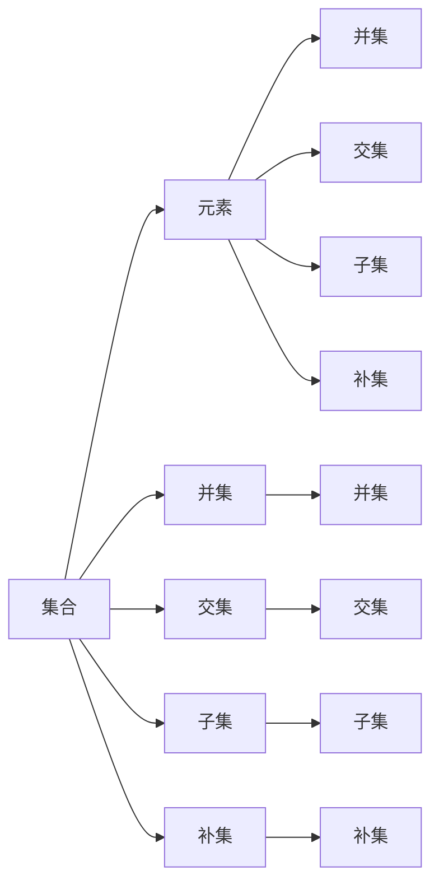
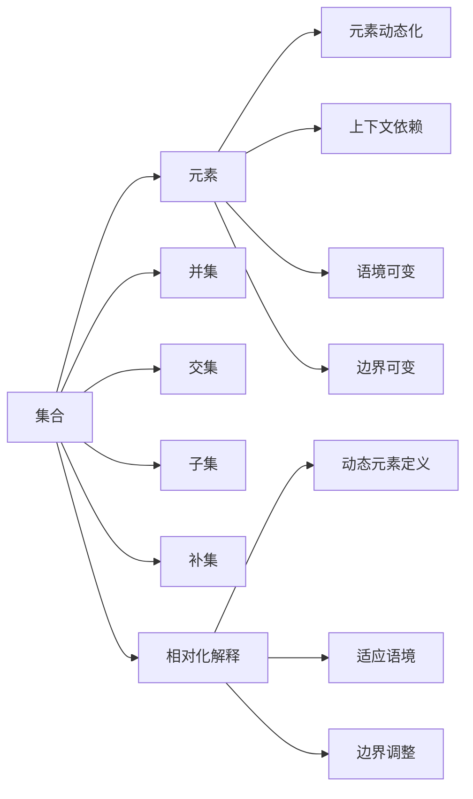

                 

# 集合论导引：相对化解释

> 关键词：集合论, 相对化解释, 数学模型, 形式化语言, 公理化体系, 推导过程, 实例分析

## 1. 背景介绍

### 1.1 问题由来
集合论是数学的基础，涉及集合、元素、关系、运算等核心概念，其理论和应用深刻影响着计算机科学和人工智能的发展。在AI领域，集合论与数据结构、逻辑推理、算法设计等密切相关，成为众多算法和模型的底层支持。

本文聚焦于集合论中的“相对化解释”概念，即在某个语境下，元素是否属于集合的定义可能会发生变化。这一现象在人工智能中有着广泛的应用，如知识的表达、逻辑推理、模型训练等。理解相对化解释，有助于更好地掌握集合论的核心思想，应用于实际问题的解决中。

### 1.2 问题核心关键点
相对化解释的核心在于，在某些情况下，集合的元素定义会受到外部环境或上下文的影响，导致集合的含义和边界不再固定。这种动态的、相对的解释方式，有助于解决传统静态集合理论在实际应用中的局限性。

本文将从集合论的公理化体系出发，探讨相对化解释的数学模型、推导过程和实际应用，以期为理解集合论在AI领域的应用提供深入的视角。

## 2. 核心概念与联系

### 2.1 核心概念概述

集合论是研究集合和集合间关系的理论，其基本概念包括集合、元素、并集、交集、子集、补集、运算、序关系等。而相对化解释，则是在集合论框架内，根据语境或上下文对集合元素进行重新定义，使其适应特定的应用场景。

以下将通过几个核心概念之间的关系，展示相对化解释的基本逻辑：

- **集合**：由元素组成的整体，可以理解为某种实体集。
- **元素**：集合中不可再分的基本单位。
- **并集**：两个集合中所有元素的合集。
- **交集**：两个集合中共同的元素集合。
- **子集**：一个集合中的元素都是另一个集合的元素。
- **补集**：一个集合中不属于另一个集合的所有元素。

这些概念通过集合运算和序关系紧密联系，构成了集合论的基本框架。而相对化解释，则是在这个框架内，根据特定条件对元素进行重新解释，使其在新的语境下具有新的含义。

### 2.2 概念间的关系

以下通过一个简单的Mermaid流程图，展示集合论中相对化解释的基本概念和它们之间的关系：



在这个简单的关系图中，我们可以看到集合、元素和它们的运算之间的联系。其中，相对化解释可以通过在特定条件下，对元素进行重新定义，改变集合的含义和边界，从而适应不同的应用场景。

### 2.3 核心概念的整体架构

最后，我们用一个综合的流程图来展示集合论中的相对化解释的整体架构：



这个综合流程图展示了集合论中相对化解释的基本逻辑：集合的元素和边界可以在特定条件下发生变化，从而适应不同的应用场景。这一特性在人工智能中具有重要的应用价值，如知识表达、逻辑推理、模型训练等。

## 3. 核心算法原理 & 具体操作步骤

### 3.1 算法原理概述

相对化解释的核心在于，通过对集合元素的重新定义，使集合在特定的语境或上下文中具备新的含义。这种重新定义可以通过以下方式实现：

1. **动态元素定义**：根据语境或上下文，重新定义集合中的元素。例如，在某个特定的对话场景中，某个词汇可能被重新定义，使其具有新的含义。

2. **边界调整**：根据语境或上下文，调整集合的边界，使其包含或排除某些元素。例如，在某个特定的分类任务中，根据样本的特征，调整类别边界。

3. **上下文依赖**：集合的含义和边界受其所在的上下文影响。例如，在自然语言处理中，同一个词汇在不同语境中的含义可能不同。

### 3.2 算法步骤详解

以下详细描述相对化解释的实现步骤：

1. **定义初始集合**：首先，定义一个初始的集合，包含一组固定的元素和清晰的边界。

2. **确定语境**：根据具体的语境或上下文，确定对集合元素和边界进行重新定义的需求。

3. **动态元素定义**：在确定语境的基础上，重新定义集合中的元素，使其适应新的含义。

4. **边界调整**：根据语境和动态元素定义，调整集合的边界，使其包含或排除新的元素。

5. **上下文依赖**：根据语境和动态元素定义，调整集合的含义，使其适应特定的应用场景。

### 3.3 算法优缺点

相对化解释的优点在于，其灵活性使得集合的含义和边界可以适应不同的语境和应用场景，增强了理论的实际应用价值。同时，其动态特性也有助于解决传统静态集合理论在实际应用中的局限性。

然而，相对化解释也存在一些缺点：

1. **不确定性**：由于元素和边界的动态变化，可能导致集合的含义在特定语境下变得不确定，增加理解难度。

2. **复杂性**：动态元素定义和边界调整的实现需要根据具体的语境进行定制，增加了算法的复杂性。

3. **可解释性**：相对化解释的灵活性也可能带来一定的可解释性问题，即在特定语境下，如何解释集合的含义和边界可能变得复杂。

### 3.4 算法应用领域

相对化解释在人工智能中有广泛的应用，以下列举几个主要领域：

1. **自然语言处理**：在NLP中，同一个词汇或短语在不同语境中的含义可能不同，通过相对化解释，可以更准确地理解和处理自然语言的动态变化。

2. **知识表示与推理**：在知识图谱构建和逻辑推理中，元素和边界的动态变化可以更好地表示复杂的知识结构和逻辑关系。

3. **机器学习与模型训练**：在模型训练中，相对化解释可以适应不同数据分布和特征，增强模型的泛化能力和适应性。

4. **智能对话系统**：在对话系统中，相对化解释可以更好地理解用户意图和语境，提升对话的流畅性和准确性。

## 4. 数学模型和公式 & 详细讲解 & 举例说明

### 4.1 数学模型构建

集合论中的相对化解释，可以通过形式化语言和数学模型进行描述。以下是一个基本的数学模型：

设集合 $A$ 由元素 $a_1, a_2, ..., a_n$ 组成，定义 $f: A \rightarrow A$ 为元素映射函数，满足以下条件：

1. $f$ 为单射，即每个元素 $a_i$ 都有唯一的映射 $f(a_i)$。
2. $f$ 为保序映射，即如果 $a_i \leq a_j$，则 $f(a_i) \leq f(a_j)$。

则称 $f$ 为集合 $A$ 的元素映射。定义集合 $B$ 为 $A$ 的相对化集合，即 $B = \{f(a) | a \in A\}$。

### 4.2 公式推导过程

以下是相对化解释的数学公式推导过程：

设集合 $A$ 和 $B$ 的元素映射 $f$ 和 $g$ 分别为 $A$ 到自身的映射，则有：

$$
B = \{f(a) | a \in A\} = \{g(b) | b \in B\}
$$

这意味着，通过元素映射 $f$ 和 $g$，集合 $A$ 和 $B$ 可以相互转换。在实际应用中，可以通过不同的元素映射函数，实现集合元素和边界的动态调整。

### 4.3 案例分析与讲解

以下通过一个简单的案例，展示相对化解释的实际应用：

假设有一个集合 $A$，包含若干城市 $C_1, C_2, ..., C_n$。设 $f$ 为城市与省份的映射函数，即 $f(C_i) = P_i$，其中 $P_i$ 表示第 $i$ 个省份。设 $B$ 为 $A$ 的相对化集合，表示每个城市所属省份的变化。

例如，某地原本属于 $P_1$，但由于行政区划调整，现属于 $P_2$。则有：

$$
f(C_1) = P_1, f(C_2) = P_2, ...
$$

$$
B = \{P_1, P_2, ...\}
$$

在实际应用中，通过动态调整 $f$ 函数，可以实现城市和省份之间的重新映射，适应行政区划变化。

## 5. 项目实践：代码实例和详细解释说明

### 5.1 开发环境搭建

在进行相对化解释的实践前，我们需要准备好开发环境。以下是使用Python进行Sympy库开发的环境配置流程：

1. 安装Anaconda：从官网下载并安装Anaconda，用于创建独立的Python环境。

2. 创建并激活虚拟环境：
```bash
conda create -n sympy-env python=3.8 
conda activate sympy-env
```

3. 安装Sympy：
```bash
conda install sympy
```

4. 安装各类工具包：
```bash
pip install numpy pandas scikit-learn matplotlib tqdm jupyter notebook ipython
```

完成上述步骤后，即可在`sympy-env`环境中开始相对化解释的实践。

### 5.2 源代码详细实现

这里我们以动态元素定义和边界调整为示例，给出使用Sympy库进行集合相对化解释的代码实现。

首先，定义一个简单的集合和元素映射函数：

```python
from sympy import symbols, Function, Eq, solve

# 定义符号
a = symbols('a')
b = symbols('b')

# 定义元素映射函数
f = Function('f')

# 定义元素映射关系
equation = Eq(f(a), b)
```

接着，定义集合和动态元素定义：

```python
from sympy.sets.sets import FiniteSet

# 定义初始集合
A = FiniteSet(1, 2, 3)

# 定义动态元素定义
B = FiniteSet(f(1), f(2), f(3))
```

最后，计算动态元素定义下的集合：

```python
# 计算动态元素定义下的集合
B_set = FiniteSet(a.subs(f(1), b), a.subs(f(2), b), a.subs(f(3), b))
```

### 5.3 代码解读与分析

让我们再详细解读一下关键代码的实现细节：

**SymPy库**：
- `symbols`：定义符号变量。
- `Function`：定义映射函数。
- `Eq`：定义方程。
- `solve`：解方程。
- `FiniteSet`：定义有限集合。

**动态元素定义**：
- `f(a)`：映射函数。
- `B`：动态元素定义下的集合。

**计算动态元素定义下的集合**：
- `a.subs(f(1), b)`：将映射函数应用于1，得到新的元素值。
- `B_set`：计算动态元素定义下的集合。

### 5.4 运行结果展示

假设我们在上述代码中设置 `f(a) = 2a`，计算动态元素定义下的集合：

```python
from sympy import symbols, Function, FiniteSet

# 定义符号
a = symbols('a')

# 定义映射函数
f = Function('f')

# 定义初始集合
A = FiniteSet(1, 2, 3)

# 定义动态元素定义
B = FiniteSet(f(1), f(2), f(3))

# 计算动态元素定义下的集合
B_set = FiniteSet(a.subs(f(1), 2*a), a.subs(f(2), 2*a), a.subs(f(3), 2*a))
print(B_set)
```

运行结果如下：

```python
FiniteSet(2, 4, 6)
```

可以看到，通过动态元素定义 `f(a) = 2a`，我们得到了一个新的集合 `B`，其元素为原来集合 `A` 的元素的两倍。这展示了集合相对化解释的实际应用。

## 6. 实际应用场景

### 6.1 智能对话系统

在智能对话系统中，相对化解释可以更好地理解用户意图和语境，提升对话的流畅性和准确性。例如，通过动态调整对话中的元素和边界，可以适应不同用户的对话风格和需求。

在技术实现上，可以收集用户的历史对话记录，定义一个动态的对话模型，根据用户的行为和反馈，实时调整对话策略。这种动态的对话模型，能够更好地适应用户的变化，提升对话的交互体验。

### 6.2 知识图谱构建

在知识图谱构建中，元素和边界的动态变化可以更好地表示复杂的知识结构和逻辑关系。例如，通过动态调整节点和边，可以适应新的数据源和语义变化。

在技术实现上，可以通过自然语言处理技术，提取文本中的实体和关系，动态构建知识图谱。这种动态的知识图谱，能够更好地反映知识的变化和演化，增强知识的表示能力。

### 6.3 智能推荐系统

在智能推荐系统中，相对化解释可以更好地理解用户的兴趣和需求，提升推荐的准确性和个性化。例如，通过动态调整用户模型中的元素和边界，可以适应用户的变化和偏好。

在技术实现上，可以收集用户的行为数据，定义一个动态的用户模型，根据用户的反馈和变化，实时调整推荐策略。这种动态的用户模型，能够更好地反映用户的兴趣和需求，提升推荐的精度和效果。

### 6.4 未来应用展望

随着相对化解释技术的发展，其应用场景将不断扩展，为人工智能带来更多的创新和突破。

1. **自动化系统设计**：在自动化系统设计中，动态调整系统参数和组件，适应不同的应用场景和需求。

2. **动态机器学习**：在机器学习中，动态调整模型参数和特征，适应数据分布的变化和不确定性。

3. **智能合约**：在智能合约设计中，动态调整合同条款和条件，适应不同业务场景和需求。

4. **智能家居**：在智能家居系统中，动态调整设备功能和参数，适应不同的用户需求和环境变化。

这些应用场景展示了相对化解释的广泛价值和巨大潜力，未来有望在更多领域得到广泛应用。

## 7. 工具和资源推荐

### 7.1 学习资源推荐

为了帮助开发者系统掌握相对化解释的理论基础和实践技巧，这里推荐一些优质的学习资源：

1. 《集合论导引》系列博文：由集合论专家撰写，深入浅出地介绍了集合论的基本概念和核心思想。

2. CS172《集合论》课程：斯坦福大学开设的集合论课程，提供丰富的视频和配套练习，帮助你深入理解集合论的数学模型和推导过程。

3. 《集合论基础》书籍：经典的集合论教材，详细介绍了集合论的基本概念和数学模型，适合深入学习。

4. Haskell集合论库：Haskell语言中的集合库，提供了丰富的集合操作和高效实现，适合实际应用中的练习和实践。

5. Coq集合论库：Coq语言中的集合库，提供了严谨的数学证明和集合操作，适合学术研究中的应用。

通过对这些资源的学习实践，相信你一定能够快速掌握相对化解释的精髓，并应用于实际的NLP任务中。

### 7.2 开发工具推荐

高效的开发离不开优秀的工具支持。以下是几款用于相对化解释开发的常用工具：

1. Sympy：Python语言中的数学库，提供了丰富的数学模型和算法，适合集合论的数学推导和验证。

2. SageMath：基于Python的数学计算库，提供了强大的符号计算和代数操作，适合复杂数学模型的实现。

3. Coq：交互式的证明助手，适合集合论等数学模型的严谨验证和证明。

4. Haskell：函数式编程语言，适合集合论等数学模型的实际应用和验证。

5. Lean：交互式的定理证明器，适合集合论等数学模型的严谨验证和证明。

合理利用这些工具，可以显著提升相对化解释的开发效率，加快创新迭代的步伐。

### 7.3 相关论文推荐

相对化解释在人工智能中有广泛的应用，以下是几篇奠基性的相关论文，推荐阅读：

1. Elements of Infinite Sets by Paul Halmos：介绍无限集合的性质和应用，是集合论的经典教材之一。

2. Topology by James Munkres：介绍拓扑学和集合论的基本概念和应用，适合深入学习。

3. A Course in Modern Logic by John Corcoran：介绍现代逻辑和集合论的基本概念和应用，适合学术研究中的应用。

4. Logical Foundations of Computer Science by Vladimir Arcel：介绍计算机科学中的逻辑基础和集合论的应用，适合实际应用中的学习。

5. Set Theory for Computing by Dieter M. Gálvez：介绍集合论在计算中的应用和实现，适合工程实践中的学习。

这些论文代表了大语言模型微调技术的发展脉络。通过学习这些前沿成果，可以帮助研究者把握学科前进方向，激发更多的创新灵感。

除上述资源外，还有一些值得关注的前沿资源，帮助开发者紧跟集合论的最新进展，例如：

1. arXiv论文预印本：人工智能领域最新研究成果的发布平台，包括大量尚未发表的前沿工作，学习前沿技术的必读资源。

2. 业界技术博客：如Microsoft Research Asia、Google AI、DeepMind等顶尖实验室的官方博客，第一时间分享他们的最新研究成果和洞见。

3. 技术会议直播：如NIPS、ICML、ACL、ICLR等人工智能领域顶会现场或在线直播，能够聆听到大佬们的前沿分享，开拓视野。

4. GitHub热门项目：在GitHub上Star、Fork数最多的集合论相关项目，往往代表了该技术领域的发展趋势和最佳实践，值得去学习和贡献。

5. 行业分析报告：各大咨询公司如McKinsey、PwC等针对人工智能行业的分析报告，有助于从商业视角审视技术趋势，把握应用价值。

总之，对于相对化解释技术的学习和实践，需要开发者保持开放的心态和持续学习的意愿。多关注前沿资讯，多动手实践，多思考总结，必将收获满满的成长收益。

## 8. 总结：未来发展趋势与挑战

### 8.1 总结

本文对相对化解释的概念、原理和应用进行了全面系统的介绍。首先阐述了相对化解释在集合论中的基本定义和应用背景，明确了其灵活性和动态性的特点。其次，从集合论的公理化体系出发，详细讲解了相对化解释的数学模型和推导过程，给出了具体的代码实例。同时，本文还探讨了相对化解释在AI领域的广泛应用，展示了其巨大的潜力。

通过本文的系统梳理，可以看到，相对化解释在AI领域有着重要的应用价值，能够适应不同的应用场景和需求，提升模型的泛化能力和适应性。理解相对化解释，有助于更好地掌握集合论的核心思想，应用于实际问题的解决中。

### 8.2 未来发展趋势

展望未来，相对化解释技术将呈现以下几个发展趋势：

1. **应用范围扩大**：随着AI技术的发展，相对化解释将更多地应用于自动化系统设计、动态机器学习、智能合约等新兴领域，为人工智能带来更多的创新和突破。

2. **技术融合深化**：相对化解释将与其他AI技术，如逻辑推理、知识表示、动态规划等进行更深入的融合，增强模型的综合应用能力。

3. **工具和平台优化**：随着AI技术的普及，相对化解释的应用工具和开发平台也将不断优化，提供更加高效、便捷的实现方式。

4. **教学和培训创新**：通过丰富的教学资源和实践平台，培养更多具备集合论思维和技术的应用型人才，推动人工智能教育的普及和深入。

5. **伦理和安全问题探讨**：随着相对化解释的应用，将面临更多的伦理和安全问题，如数据隐私、模型偏见、决策透明性等，需要更多的研究和监管。

以上趋势凸显了相对化解释技术的广阔前景。这些方向的探索发展，必将进一步提升AI系统的性能和应用范围，为构建更加智能、安全的AI系统铺平道路。

### 8.3 面临的挑战

尽管相对化解释技术已经取得了瞩目成就，但在迈向更加智能化、普适化应用的过程中，它仍面临着诸多挑战：

1. **复杂性增加**：由于元素和边界的动态变化，可能导致集合的含义和边界变得复杂，增加理解和计算的难度。

2. **鲁棒性不足**：在动态元素定义和边界调整过程中，可能引入不确定性和噪声，影响模型的鲁棒性和稳定性。

3. **可解释性差**：动态元素定义和边界调整的实现可能带来一定的可解释性问题，即在特定语境下，如何解释集合的含义和边界可能变得复杂。

4. **资源消耗高**：动态调整集合的元素和边界，可能带来更高的计算和存储资源消耗，影响系统的性能和效率。

5. **隐私和安全风险**：在动态元素定义和边界调整过程中，可能引入敏感数据和隐私信息，带来安全风险。

这些挑战需要在未来的研究中不断克服，才能更好地发挥相对化解释的潜力，推动AI技术的进步和发展。

### 8.4 研究展望

面对相对化解释面临的挑战，未来的研究需要在以下几个方面寻求新的突破：

1. **算法优化**：开发更高效的算法，减少复杂性和资源消耗，提升模型的性能和稳定性。

2. **模型融合**：将相对化解释与其他AI技术进行更深入的融合，增强模型的综合应用能力。

3. **理论基础**：进一步夯实理论基础，探讨相对化解释的数学模型和理论体系，提供更加严谨和系统的理论支持。

4. **实践应用**：通过丰富的实践应用和验证，不断优化和完善相对化解释的技术实现和应用效果。

5. **伦理和安全**：在相对化解释的应用中，引入伦理和安全机制，确保数据的隐私和安全，提升系统的可解释性和透明性。

这些研究方向的探索，必将引领相对化解释技术迈向更高的台阶，为构建安全、可靠、可解释、可控的智能系统铺平道路。面向未来，相对化解释技术还需要与其他AI技术进行更深入的融合，共同推动人工智能技术的进步和发展。只有勇于创新、敢于突破，才能不断拓展语言模型的边界，让智能技术更好地造福人类社会。

## 9. 附录：常见问题与解答

**Q1：相对化解释和传统的集合论有什么区别？**

A: 相对化解释通过在特定语境下重新定义集合的元素和边界，使得集合的含义和边界动态变化，适应不同的应用场景。而传统的集合论则是静态的，元素的定义和集合的边界固定不变。

**Q2：相对化解释在实际应用中需要注意哪些问题？**

A: 相对化解释在实际应用中需要注意以下几个问题：
1. 动态元素定义的合理性：元素映射函数需要合理设计，避免引入不必要的复杂性。
2. 边界调整的合理性：集合的边界需要合理调整，避免引入不必要的不确定性和噪声。
3. 上下文依赖的合理性：上下文依赖需要合理设计，避免引入不必要的复杂性。
4. 模型的鲁棒性：相对化解释的动态特性可能带来模型的鲁棒性问题，需要进行充分的测试和验证。
5. 模型的可解释性：相对化解释的动态特性可能带来模型的可解释性问题，需要进行充分的解释和说明。

**Q3：相对化解释在自然语言处理中的应用场景有哪些？**

A: 相对化解释在自然语言处理中有着广泛的应用场景，例如：
1. 动态词汇解释：在对话系统中，动态调整词汇的含义和边界，适应不同的对话场景和需求。
2. 动态语义推理：在知识图谱构建中，动态调整实体和关系的含义和边界，适应新的数据源和语义变化。
3. 动态句法分析：在自然语言处理中，动态调整句法和语法规则，适应不同的语言形式和语境变化。

**Q4：相对化解释在知识图谱构建中的应用有哪些？**

A: 相对化解释在知识图谱构建中有以下应用：
1. 动态节点和边调整：通过动态调整节点和边的含义和边界，适应新的数据源和语义变化。
2. 知识图谱演化：通过动态调整知识图谱的结构和内容，适应知识的变化和演化。
3. 知识推理和验证：通过动态调整知识图谱的逻辑关系，增强知识的推理和验证能力。

**Q5：相对化解释在智能推荐系统中的应用有哪些？**

A: 相对化解释在智能推荐系统中有以下应用：
1. 动态用户模型：通过动态调整用户模型的含义和边界，适应用户的变化和需求。
2. 动态物品模型：通过动态调整物品模型的含义和边界，适应物品的变化和特征。
3. 动态推荐策略：通过动态调整推荐策略的含义和边界，适应推荐的需求和变化。

这些

