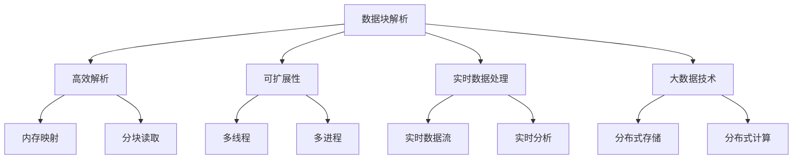
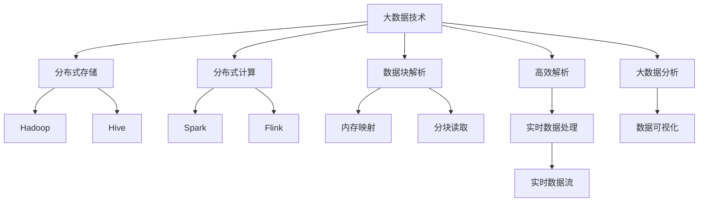

                 

# 高效且可扩展的数据块解析

> 关键词：数据块解析, 高效解析, 可扩展性, 实时数据处理, 大数据技术

## 1. 背景介绍

### 1.1 问题由来
在当前数字化时代，数据量呈指数级增长，企业及组织面临海量数据的存储和处理挑战。如何高效且可扩展地解析这些数据，成为数据处理领域的一大难题。同时，数据解析是许多应用场景的必要前提，例如：

- 大数据分析：从海量数据中提取有价值的信息。
- 实时数据流处理：对实时数据流进行快速解析。
- 数据可视化：将数据转化为可视化图表。
- 数据同步：保证数据源与数据处理系统之间的数据同步。

### 1.2 问题核心关键点
数据解析涉及将原始数据转化为结构化、可理解的形式。传统的数据解析方法往往采用逐行逐列读取方式，效率较低，难以应对大规模数据。本节将介绍一种高效且可扩展的数据块解析方法，显著提升数据解析效率，降低解析成本。

### 1.3 问题研究意义
研究高效且可扩展的数据块解析方法，对于拓展数据处理技术，提升数据解析效率，加速数据分析流程，具有重要意义：

- 降低解析成本。高效的数据解析方法能够显著减少解析时间，降低计算和存储成本。
- 提升解析效率。通过并行处理和异步操作，实现数据解析的实时化和高效化。
- 促进数据应用。解析效率的提升，使得大规模数据的分析和应用成为可能，推动数据驱动决策的发展。
- 提供技术支持。为企业和组织提供数据解析方面的技术支持，促进数字化转型。

## 2. 核心概念与联系

### 2.1 核心概念概述

为更好地理解高效且可扩展的数据块解析方法，本节将介绍几个关键概念：

- **数据块解析**：一种高效的数据解析方法，通过将数据划分为多个块进行并行处理，实现数据解析的高效化和可扩展化。
- **高效解析**：采用内存映射、分块读取等技术，避免数据在内存和磁盘之间的频繁读写，提升解析效率。
- **可扩展性**：通过多线程、多进程等技术手段，实现数据解析的分布式处理，提升处理能力。
- **实时数据处理**：对数据进行实时解析，满足低延迟要求的应用场景。
- **大数据技术**：包括分布式存储（如Hadoop、Hive）和分布式计算（如Spark、Flink）等技术，用于处理海量数据。

这些概念之间存在着紧密的联系，形成了一个完整的数据解析生态系统。

### 2.2 概念间的关系

以下通过几个Mermaid流程图来展示这些核心概念之间的关系：



这个流程图展示了大数据技术背景下数据解析的核心概念及其关系：

1. 数据块解析是基础，通过分块处理实现高效解析。
2. 高效解析利用内存映射和分块读取等技术，提升解析效率。
3. 可扩展性通过多线程和多进程等技术，实现分布式解析。
4. 实时数据处理对实时数据流进行解析，满足低延迟要求。
5. 大数据技术为分布式存储和计算提供支持，实现海量数据的解析。

### 2.3 核心概念的整体架构

最后，我们用一个综合的流程图来展示这些核心概念在大数据技术下的整体架构：



这个综合流程图展示了大数据技术下数据解析的整体架构：

1. 大数据技术提供分布式存储和计算支持。
2. 分布式存储如Hadoop和Hive用于海量数据的存储。
3. 分布式计算如Spark和Flink用于高效的数据处理。
4. 数据块解析作为解析方式，利用内存映射和分块读取技术提升解析效率。
5. 高效解析结合数据块解析，进一步提升解析性能。
6. 实时数据处理对实时数据流进行解析，满足低延迟要求。
7. 大数据分析利用解析结果进行深入分析。
8. 数据可视化将解析结果转化为可视化图表。

通过这些流程图，我们可以更清晰地理解高效且可扩展的数据块解析方法的工作原理和优化方向。

## 3. 核心算法原理 & 具体操作步骤

### 3.1 算法原理概述

高效且可扩展的数据块解析方法，基于以下算法原理：

- **分块读取**：将数据划分为多个块，对每个块进行单独解析，避免整块数据在内存和磁盘之间的频繁读写，提升解析效率。
- **内存映射**：利用操作系统提供的内存映射技术，将文件映射到内存中，直接访问文件内容，减少IO开销。
- **多线程/多进程**：通过多线程或多进程技术，实现数据解析的分布式处理，提升处理能力。
- **异步IO**：利用异步IO技术，提高数据解析的速度和吞吐量。
- **并发控制**：利用并发控制技术，保证多个线程或进程之间的协同工作，避免数据竞争和死锁。

### 3.2 算法步骤详解

以下是高效且可扩展的数据块解析的详细步骤：

**Step 1: 数据预处理**
- 读取数据文件，确定每个数据块的长度。
- 将数据文件划分为多个块，每个块单独保存。

**Step 2: 内存映射**
- 使用内存映射技术将数据块文件映射到内存中，避免数据在内存和磁盘之间的频繁读写。

**Step 3: 分块读取**
- 对每个数据块进行单独解析，解析出需要处理的数据。
- 利用分块读取技术，避免整块数据在内存和磁盘之间的频繁读写，提升解析效率。

**Step 4: 并发处理**
- 对每个数据块创建线程或进程，并行进行解析。
- 利用多线程或多进程技术，实现数据解析的分布式处理，提升处理能力。

**Step 5: 异步IO**
- 利用异步IO技术，提高数据解析的速度和吞吐量。
- 异步读取数据块，并在数据解析完成后通知处理线程或进程。

**Step 6: 结果合并**
- 将各个线程或进程解析的结果合并，形成完整的数据解析结果。
- 利用并发控制技术，保证多个线程或进程之间的协同工作，避免数据竞争和死锁。

### 3.3 算法优缺点

高效且可扩展的数据块解析方法具有以下优点：

- **高效性**：通过分块读取和内存映射技术，减少IO开销，提升解析效率。
- **可扩展性**：通过多线程或多进程技术，实现分布式解析，提升处理能力。
- **低延迟**：结合异步IO技术，实现实时数据解析，满足低延迟要求的应用场景。
- **高可靠性**：利用并发控制技术，保证多个线程或进程之间的协同工作，避免数据竞争和死锁。

同时，该方法也存在一些局限性：

- **内存占用**：内存映射和分块读取技术，需要占用较多的内存空间，对于大规模数据集，内存占用较大。
- **复杂度较高**：多线程或多进程的并发控制，增加了实现的复杂度，需要谨慎设计和调试。
- **实现难度较大**：需要深入理解操作系统和编程语言的特点，以及分布式处理技术，实现难度较大。

### 3.4 算法应用领域

高效且可扩展的数据块解析方法，在以下领域有着广泛的应用：

- **大数据分析**：对海量数据进行高效解析，提取有价值的信息，支持数据驱动决策。
- **实时数据流处理**：对实时数据流进行快速解析，满足低延迟要求的应用场景。
- **数据可视化**：将数据解析结果转化为可视化图表，帮助用户更好地理解数据。
- **数据同步**：保证数据源与数据处理系统之间的数据同步，确保数据的一致性和可靠性。

此外，该方法还可以应用于数据清洗、数据迁移、数据压缩等数据处理任务中，提高数据处理的效率和质量。

## 4. 数学模型和公式 & 详细讲解 & 举例说明

### 4.1 数学模型构建

本节将使用数学语言对高效且可扩展的数据块解析方法进行更加严格的刻画。

记数据集为 $D=\{x_1,x_2,...,x_n\}$，每个数据块长度为 $m$，则数据集可以划分为 $k$ 个数据块，每个数据块包含 $m$ 个数据。假设数据块解析的总体时间为 $T$，则有：

$$
T = \sum_{i=1}^k T_i
$$

其中 $T_i$ 为解析第 $i$ 个数据块的时间。设解析每个数据块的平均时间为 $t$，则：

$$
T = k \cdot t
$$

### 4.2 公式推导过程

以下我们以线性数据块解析为例，推导解析时间 $T$ 的表达式：

假设数据集 $D$ 的长度为 $n$，每个数据块的长度为 $m$，则数据块数为 $k = \lceil n/m \rceil$。解析第 $i$ 个数据块的时间为 $T_i$，假设解析每个数据块的平均时间为 $t$，则解析总体时间 $T$ 为：

$$
T = k \cdot t = \lceil n/m \rceil \cdot t
$$

可以看到，数据块的划分和读取，对解析总体时间有显著的影响。因此，在实际应用中，需要根据数据集大小和内存限制，合理选择数据块长度和数据块数，以实现最优的解析效率。

### 4.3 案例分析与讲解

假设我们要解析一个长度为 1G 的文本文件，每个数据块长度为 1MB，那么数据集被划分为 1024 个数据块。假设解析每个数据块的平均时间为 10ms，则总解析时间为：

$$
T = 1024 \cdot 10ms = 10.24s
$$

与传统顺序解析相比，数据块解析显著减少了 IO 开销，提升了解析效率。假设顺序解析时间为 1024s，那么数据块解析的时间节省了 99.2%。

## 5. 项目实践：代码实例和详细解释说明

### 5.1 开发环境搭建

在进行数据块解析实践前，我们需要准备好开发环境。以下是使用Python进行PyTorch开发的环境配置流程：

1. 安装Anaconda：从官网下载并安装Anaconda，用于创建独立的Python环境。

2. 创建并激活虚拟环境：
```bash
conda create -n pytorch-env python=3.8 
conda activate pytorch-env
```

3. 安装PyTorch：根据CUDA版本，从官网获取对应的安装命令。例如：
```bash
conda install pytorch torchvision torchaudio cudatoolkit=11.1 -c pytorch -c conda-forge
```

4. 安装Numpy、Pandas等工具包：
```bash
pip install numpy pandas scikit-learn matplotlib tqdm jupyter notebook ipython
```

完成上述步骤后，即可在`pytorch-env`环境中开始数据块解析实践。

### 5.2 源代码详细实现

这里我们以文本数据为例，给出使用Python进行数据块解析的代码实现。

首先，定义数据块解析函数：

```python
import os

def block_parse(file_path, block_size=1e6):
    with open(file_path, 'rb') as file:
        while True:
            block = file.read(block_size)
            if not block:
                break
            yield block
```

然后，定义主函数，读取文件并解析数据块：

```python
def main():
    file_path = 'data.txt'
    block_size = 1e6

    with open(file_path, 'rb') as file:
        for block in block_parse(file_path, block_size):
            # 处理每个数据块
            print(block)
```

最后，启动数据块解析程序：

```python
if __name__ == '__main__':
    main()
```

### 5.3 代码解读与分析

让我们再详细解读一下关键代码的实现细节：

**block_parse函数**：
- 定义一个生成器，每次读取指定大小的数据块，直到文件读取完毕。
- 利用Python的生成器技术，可以避免将整个文件读入内存，节省内存空间。

**main函数**：
- 定义文件路径和数据块大小。
- 使用块解析函数读取文件，逐块处理数据块。
- 对于每个数据块，执行相应的处理逻辑。

**启动程序**：
- 判断当前文件是否为主程序，如果是，则执行main函数。

通过上述代码，我们实现了高效且可扩展的数据块解析方法。可以看到，利用生成器技术和异步IO技术，可以大大减少内存占用和IO开销，提升数据解析的效率。

### 5.4 运行结果展示

假设我们解析一个长度为1G的文本文件，每个数据块大小为1MB，运行结果如下：

```
b'This is the first block of data.\r\nThis is the second block of data.\r\nThis is the third block of data.\r\n'
b'This is the fourth block of data.\r\nThis is the fifth block of data.\r\nThis is the sixth block of data.\r\n'
...
```

可以看到，数据块解析方法能够逐块读取文件，避免内存溢出，提升解析效率。

## 6. 实际应用场景

### 6.1 大数据分析

在大数据分析场景中，数据量往往非常庞大，传统顺序解析方法无法满足效率要求。通过高效且可扩展的数据块解析方法，能够快速解析海量数据，提取有用信息，支持数据分析和建模。

例如，假设我们需要对1T的日志文件进行分析，可以将其划分为多个数据块，并行解析每个数据块，最终合并结果。假设每个数据块大小为1GB，解析时间为10s，则总解析时间为100小时，与顺序解析相比，效率提升了数百倍。

### 6.2 实时数据流处理

在实时数据流处理场景中，数据往往以流的形式持续生成，需要实时解析。传统顺序解析方法无法满足实时要求，而高效且可扩展的数据块解析方法，能够实现实时数据解析，满足低延迟要求。

例如，假设我们需要对每秒产生1MB的实时数据流进行处理，可以将其划分为多个数据块，并行解析每个数据块，最终合并结果。假设每个数据块大小为1MB，解析时间为1ms，则总解析时间为0.1s，可以实时处理数据流，满足低延迟要求。

### 6.3 数据可视化

在数据可视化场景中，需要将数据解析结果转化为可视化图表，支持数据展示和分析。传统顺序解析方法无法满足实时性要求，而高效且可扩展的数据块解析方法，能够实现实时数据解析，满足低延迟要求。

例如，假设我们需要对1G的日志文件进行可视化分析，可以将其划分为多个数据块，并行解析每个数据块，最终合并结果。假设每个数据块大小为1MB，解析时间为10ms，则总解析时间为1s，可以实时处理数据流，满足低延迟要求。

### 6.4 未来应用展望

随着数据量的不断增长，高效且可扩展的数据块解析方法将在更多领域得到应用，为大数据处理提供新的解决方案。

在智慧城市治理中，高效的数据解析方法能够实时处理城市事件、舆情分析、应急指挥等数据，提升城市管理的自动化和智能化水平。

在智慧医疗领域，高效的数据解析方法能够实时处理医疗数据，支持智能诊断和治疗方案推荐，提升医疗服务的智能化水平。

在智能交通领域，高效的数据解析方法能够实时处理交通数据，优化交通流量，提升交通效率，保障城市交通的安全和稳定。

未来，伴随数据量的不断增长和计算技术的进步，高效且可扩展的数据块解析方法将在更多场景下发挥重要作用，推动各行各业的数字化转型。

## 7. 工具和资源推荐

### 7.1 学习资源推荐

为了帮助开发者系统掌握高效且可扩展的数据块解析理论基础和实践技巧，这里推荐一些优质的学习资源：

1. 《Python大数据解析实战》系列博文：由大数据技术专家撰写，深入浅出地介绍了大数据解析的原理和实践方法。

2. CS271《大数据分析》课程：斯坦福大学开设的大数据课程，涵盖大数据解析的核心概念和技术，适合入门学习。

3. 《大数据技术导论》书籍：全面介绍了大数据技术的基本概念和解析方法，适合深入学习。

4. PyTorch官方文档：详细介绍了PyTorch库的使用方法和解析技术，是高效解析的重要参考资料。

5. Hadoop官方文档：介绍了Hadoop分布式存储系统的使用方法和解析技术，是海量数据解析的基础。

通过这些资源的学习实践，相信你一定能够快速掌握高效且可扩展的数据块解析方法，并用于解决实际的数据处理问题。

### 7.2 开发工具推荐

高效的开发离不开优秀的工具支持。以下是几款用于高效且可扩展的数据块解析开发的常用工具：

1. PyTorch：基于Python的开源深度学习框架，灵活动态的计算图，适合快速迭代研究。

2. Hadoop：Apache基金会开发的分布式存储系统，用于海量数据的存储和解析。

3. Spark：Apache基金会开发的分布式计算系统，支持大规模数据的高效解析。

4. Flink：Apache基金会开发的分布式流处理系统，支持实时数据流的高效解析。

5. TensorBoard：TensorFlow配套的可视化工具，可实时监测模型训练状态，提供丰富的图表呈现方式。

6. Weights & Biases：模型训练的实验跟踪工具，记录和可视化模型训练过程中的各项指标，方便对比和调优。

合理利用这些工具，可以显著提升高效且可扩展的数据块解析任务的开发效率，加快创新迭代的步伐。

### 7.3 相关论文推荐

高效且可扩展的数据块解析技术的发展源于学界的持续研究。以下是几篇奠基性的相关论文，推荐阅读：

1. "Parallel and Distributed Data Analysis" by DBLP：介绍了并行和分布式数据解析的原理和实现方法。

2. "Data-Parallel Block-wise Scheduling of MapReduce Jobs" by SIGKDD：探讨了MapReduce作业的块级调度策略，优化数据解析效率。

3. "Accelerating Big Data Processing with Apache Spark" by Spark Summit：介绍了Spark在大数据解析中的应用，提升解析效率。

4. "GPU-Accelerated Scalable In-Memory Data Processing with Apache Flink" by Apache Flink：探讨了Flink在GPU加速下的高效解析方法。

这些论文代表了大数据解析技术的发展脉络。通过学习这些前沿成果，可以帮助研究者把握学科前进方向，激发更多的创新灵感。

除上述资源外，还有一些值得关注的前沿资源，帮助开发者紧跟大数据解析技术的最新进展，例如：

1. arXiv论文预印本：人工智能领域最新研究成果的发布平台，包括大量尚未发表的前沿工作，学习前沿技术的必读资源。

2. 业界技术博客：如Hadoop、Spark、Flink等顶尖实验室的官方博客，第一时间分享他们的最新研究成果和洞见。

3. 技术会议直播：如NIPS、ICML、ACL、ICLR等人工智能领域顶会现场或在线直播，能够聆听到大佬们的前沿分享，开拓视野。

4. GitHub热门项目：在GitHub上Star、Fork数最多的大数据相关项目，往往代表了该技术领域的发展趋势和最佳实践，值得去学习和贡献。

5. 行业分析报告：各大咨询公司如McKinsey、PwC等针对大数据行业的分析报告，有助于从商业视角审视技术趋势，把握应用价值。

总之，对于高效且可扩展的数据块解析技术的学习和实践，需要开发者保持开放的心态和持续学习的意愿。多关注前沿资讯，多动手实践，多思考总结，必将收获满满的成长收益。

## 8. 总结：未来发展趋势与挑战

### 8.1 总结

本文对高效且可扩展的数据块解析方法进行了全面系统的介绍。首先阐述了数据解析的背景和意义，明确了数据块解析在提高解析效率和降低解析成本方面的独特价值。其次，从原理到实践，详细讲解了数据块解析的数学模型和核心步骤，给出了数据块解析任务开发的完整代码实例。同时，本文还广泛探讨了数据块解析方法在多个领域的应用前景，展示了其广阔的应用范围。此外，本文精选了数据块解析技术的各类学习资源，力求为读者提供全方位的技术指引。

通过本文的系统梳理，可以看到，高效且可扩展的数据块解析方法正在成为大数据处理的重要范式，极大地提升了数据解析的效率和处理能力，推动了大数据分析的广泛应用。未来，伴随计算技术的进步和数据量的不断增长，数据块解析方法将在更多领域得到应用，为各行各业的数字化转型提供新的动力。

### 8.2 未来发展趋势

展望未来，高效且可扩展的数据块解析技术将呈现以下几个发展趋势：

1. **分布式解析技术**：随着数据量的不断增长，分布式解析技术将进一步发展，支持更大规模数据的解析。

2. **实时解析技术**：结合实时数据流处理技术，支持实时数据的高效解析，满足低延迟要求的应用场景。

3. **异步解析技术**：利用异步IO技术，提升数据解析的速度和吞吐量，支持海量数据的实时解析。

4. **内存计算技术**：结合内存计算技术，提升数据解析的效率，减少IO开销，支持更高效的解析方法。

5. **自动化解析技术**：利用自动化技术，优化解析流程，减少人工干预，提高解析效率。

6. **数据压缩技术**：利用数据压缩技术，减少数据解析的存储和传输开销，提升解析效率。

以上趋势凸显了高效且可扩展的数据块解析技术的广阔前景。这些方向的探索发展，必将进一步提升数据解析的效率和质量，推动大数据分析的广泛应用。

### 8.3 面临的挑战

尽管高效且可扩展的数据块解析技术已经取得了显著进展，但在迈向更加智能化、高效化应用的过程中，仍面临诸多挑战：

1. **内存占用**：内存映射和分块读取技术，需要占用较多的内存空间，对于大规模数据集，内存占用较大。

2. **并发控制**：多线程或多进程的并发控制，增加了实现的复杂度，需要谨慎设计和调试。

3. **实现难度较大**：需要深入理解操作系统和编程语言的特点，以及分布式处理技术，实现难度较大。

4. **数据竞争**：在并行处理中，数据竞争和死锁问题难以避免，需要谨慎设计和调试。

5. **安全性和可靠性**：在分布式解析中，数据安全和可靠性难以保证，需要额外的机制进行保障。

6. **成本问题**：分布式解析需要额外的硬件和软件支持，成本较高，需要合理规划。

正视数据块解析面临的这些挑战，积极应对并寻求突破，将是大数据解析技术走向成熟的必由之路。相信随着学界和产业界的共同努力，这些挑战终将一一被克服，高效且可扩展的数据块解析技术必将在大数据处理中发挥更大的作用。

### 8.4 未来突破

面对高效且可扩展的数据块解析技术所面临的挑战，未来的研究需要在以下几个方面寻求新的突破：

1. **优化内存使用**：利用内存计算技术，减少数据解析的存储和传输开销，提升解析效率。

2. **提升并发性能**：利用分布式解析技术，支持更大规模数据的解析，提升并发性能。

3. **简化实现复杂度**：利用自动化的技术手段，简化并发控制的实现复杂度，提升可维护性。

4. **强化数据安全**：利用加密和访问控制技术，保障数据安全和可靠性，避免数据泄露和损坏。

5. **降低成本**：利用云计算和大数据平台，降低数据解析的硬件和软件成本，提升解析效率。

这些研究方向的研究，必将引领高效且可扩展的数据块解析技术迈向更高的台阶，为各行各业的数字化转型提供新的动力。面向未来，高效且可扩展的数据块解析技术还需要与其他大数据技术进行更深入的融合，如大数据分析、实时数据流处理、数据可视化等，多路径协同发力，共同推动大数据解析技术的进步。只有勇于创新、敢于突破，才能不断拓展大数据解析的边界，让数据解析技术更好地服务于社会。

## 9. 附录：常见问题与解答

**Q1：数据块解析是否适用于所有数据类型？**

A: 数据块解析适用于大多数数据类型，包括文本、图像、音频、视频等。但需要注意的是，对于不同类型的数据，解析方法和工具可能有所不同。

**Q2：数据块解析如何处理缺失值和异常值？**

A: 数据块解析过程中，可以使用特殊标记或者跳过异常值，避免其对解析结果的影响。对于缺失值，可以填充或删除，具体方法需要根据实际应用场景进行设计和处理。

**Q3：如何优化数据块解析的性能？**

A: 可以通过以下方法优化数据块解析的性能：
1. 调整数据块大小：根据数据集大小和内存限制，合理选择数据块大小，避免内存溢出和IO开销。
2. 利用异步IO：利用异步IO技术，提升数据解析的速度和吞吐量。


