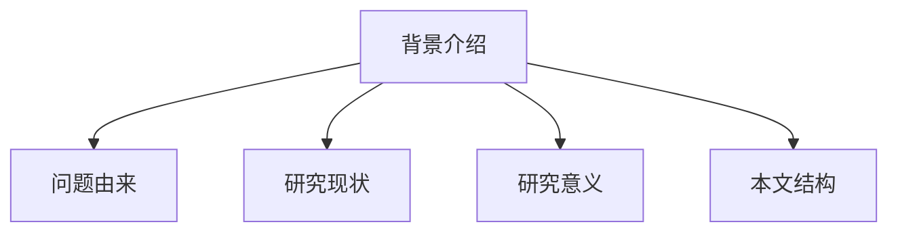
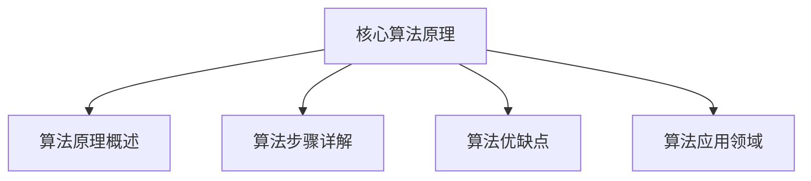

# 强化学习Reinforcement Learning探索与利用策略深度剖析

## 1. 背景介绍

### 1.1 问题的由来

在人工智能领域中,强化学习(Reinforcement Learning)是一种基于环境交互的机器学习范式。与监督学习和无监督学习不同,强化学习的目标是通过试错和累积经验,学习如何在复杂且不确定的环境中采取最优行动策略。

强化学习的核心思想是利用代理(Agent)与环境(Environment)进行交互。代理根据当前状态选择行动,环境则根据该行动产生新的状态和奖励信号。代理的目标是最大化长期累积奖励,从而学习到最优策略。

然而,在强化学习中存在一个关键的探索与利用(Exploration-Exploitation)权衡问题。代理需要在利用已学习到的知识获取高回报(Exploitation),与探索新的未知领域以发现潜在的更优策略(Exploration)之间寻求平衡。这种权衡是强化学习算法设计中的核心挑战之一。

### 1.2 研究现状

传统的强化学习算法,如Q-Learning和Sarsa,通常采用ε-greedy或软max策略来解决探索与利用的权衡问题。这些方法虽然简单有效,但存在一些局限性,例如:

1. 探索策略过于简单,难以适应复杂环境。
2. 探索行为缺乏针对性,可能浪费大量时间在无效探索上。
3. 探索策略难以根据环境动态调整。

近年来,随着深度学习(Deep Learning)和强化学习相结合,出现了一些新的探索与利用策略,如基于深度神经网络的探索策略、intrinsic motivation驱动的探索、meta-learning等。这些新方法在一定程度上缓解了传统方法的局限性,但仍存在一些挑战,如样本效率低下、难以泛化等。

### 1.3 研究意义

合理解决探索与利用权衡问题,对于强化学习算法的性能和应用具有重要意义:

1. 提高样本效率,加快学习速度。
2. 增强算法的泛化能力,适应复杂多变环境。
3. 发现更优的策略,获得更高的累积奖励。
4. 扩大强化学习在实际应用中的应用范围。

因此,深入研究探索与利用策略,设计出更加高效、通用的新算法,将极大推动强化学习理论和应用的发展。

### 1.4 本文结构

本文将全面深入剖析强化学习中的探索与利用策略。首先介绍强化学习和探索与利用问题的基本概念,阐述其重要性。然后系统地分析和比较经典算法和新兴算法所采用的各种探索策略,包括其原理、优缺点和适用场景。接着通过数学模型和公式,对核心算法进行理论分析和推导。最后,通过实际案例和代码实现,展示不同探索策略在实践中的效果,并讨论其在工业界的应用前景。



## 2. 核心概念与联系

强化学习(Reinforcement Learning)是一种基于环境交互的机器学习范式,其核心概念包括:

1. **代理(Agent)**: 执行动作并与环境交互的决策实体。
2. **环境(Environment)**: 代理所处的外部世界,由一系列状态组成。
3. **状态(State)**: 环境的instantaneous情况,代理根据状态选择行动。
4. **行动(Action)**: 代理在当前状态下可执行的操作。
5. **奖励(Reward)**: 环境对代理行动的反馈,指导代理朝着目标优化。
6. **策略(Policy)**: 代理根据状态选择行动的规则或策略函数。
7. **价值函数(Value Function)**: 评估一个状态的长期累积奖励。
8. **模型(Model)**: 描述环境的状态转移和奖励机制。

探索与利用(Exploration-Exploitation)是强化学习中一个核心的权衡问题。探索是指代理尝试新的未知行动,以发现潜在的更优策略;而利用是指代理根据已学习到的知识,选择当前已知的最优行动以获取最大化即时奖励。

合理平衡探索与利用对于强化学习算法的性能至关重要。过度探索会浪费时间在无效的行动上,而过度利用则可能陷入次优解。因此,设计高效的探索与利用策略是强化学习算法的核心挑战之一。

探索与利用策略与强化学习的其他核心概念密切相关,例如:

- **贪婪策略(Greedy Policy)**: 只考虑利用,总是选择当前已知的最优行动。
- **ε-greedy策略**: 以ε的概率随机探索,1-ε的概率贪婪利用。
- **Q-Learning**: 一种基于价值函数的强化学习算法,探索与利用策略影响Q值的更新。
- **Sarsa**: 另一种基于策略的强化学习算法,探索策略直接影响行动选择。
- **深度强化学习(Deep RL)**: 将深度神经网络应用于强化学习,探索策略可由神经网络参数化。

总的来说,探索与利用策略贯穿于强化学习的方方面面,对算法性能、样本效率和泛化能力都有重大影响。设计合理的探索策略是提高强化学习算法性能的关键所在。

## 3. 核心算法原理 & 具体操作步骤

### 3.1 算法原理概述

强化学习算法的核心原理是通过与环境的交互,学习到一个最优策略,使得在该策略指导下,代理能够获得最大化的长期累积奖励。

为了实现这一目标,强化学习算法通常包含以下几个关键组成部分:

1. **策略评估(Policy Evaluation)**: 评估一个给定策略的价值函数,即在该策略指导下,每个状态的长期累积奖励。
2. **策略改进(Policy Improvement)**: 基于当前策略的价值函数,更新策略,使其朝着获取更高奖励的方向改进。
3. **价值迭代(Value Iteration)**: 通过反复执行策略评估和策略改进,不断优化策略和价值函数,直至收敛到最优解。

在这个过程中,探索与利用策略扮演着至关重要的角色。它决定了代理在每个状态下选择行动的方式,从而影响策略评估和改进的效率和质量。

一般来说,强化学习算法遵循以下基本操作步骤:

1. 初始化策略和价值函数,通常采用任意策略和全0价值函数。
2. 选择一个状态,根据当前策略和探索策略,选择一个行动执行。
3. 观察环境的反馈(新状态和奖励),更新价值函数和策略。
4. 重复步骤2-3,直至收敛到最优策略和价值函数。

在这个循环过程中,探索与利用策略决定了每个状态下选择行动的概率分布。合理的探索策略可以加速学习过程,提高最终策略的质量。

### 3.2 算法步骤详解

以下是一种典型的基于Q-Learning的强化学习算法步骤:

1. 初始化Q表格,所有状态-行动对的Q值设为任意值(如0)。
2. 对每个Episode(即一个完整的交互序列):
    a) 初始化起始状态s
    b) 对每个时间步:
        i) 根据当前探索策略(如ε-greedy),选择一个行动a
        ii) 执行行动a,观察环境反馈:新状态s'和奖励r
        iii) 根据Q-Learning更新规则,更新Q(s,a):
            Q(s,a) = Q(s,a) + α[r + γ* max(Q(s',a')) - Q(s,a)]
        iv) 将s'作为新状态s,进入下一时间步
    c) 当Episode终止时,进入下一个Episode
3. 直至算法收敛或达到最大Episode数

在上述算法中,探索策略决定了步骤2b(i)中行动选择的方式。一种常见的探索策略是ε-greedy:以ε的概率随机选择一个行动(探索),以1-ε的概率选择当前最优行动(利用)。

除了ε-greedy,还有许多其他探索策略,如软max策略、基于计数的策略、基于神经网络的策略等,在后续章节会详细介绍。

### 3.3 算法优缺点

强化学习算法相对于其他机器学习范式,具有以下优点:

1. 无需人工标注的训练数据,通过与环境交互自主学习。
2. 能够学习到最优的决策序列,而非单一的输出。
3. 具有很强的泛化能力,可应用于各种复杂环境。

但同时也存在一些缺点和挑战:

1. 需要大量的在线试错,样本效率低下。
2. 探索与利用策略的权衡使算法设计复杂化。
3. 连续状态和行动空间下,函数逼近困难。
4. 收敛性和最优性的理论保证较弱。

其中,探索与利用策略的设计是影响算法性能的关键因素之一。合理的探索策略可以提高样本利用率,加快算法收敛,并发现更优的策略。反之,探索策略不当则会严重拖累算法性能。

### 3.4 算法应用领域

强化学习算法由于其独特的优势,在诸多领域展现出广阔的应用前景:

1. **机器人控制**: 通过与环境交互,学习到高效的运动控制策略。
2. **游戏AI**: 在游戏环境中训练智能体,学习到超越人类的游戏策略。
3. **自动驾驶**: 通过模拟训练,学习到安全高效的自动驾驶策略。
4. **自动化控制**: 在工业生产、网络通信等领域,学习最优的控制策略。
5. **自然语言处理**: 将对话过程建模为强化学习任务,优化对话策略。
6. **计算机系统**: 优化计算机系统的资源调度、缓存管理等策略。
7. **金融投资**: 在金融市场中学习投资组合优化的最佳策略。

总的来说,凡是可以建模为代理与环境交互的决策序列问题,都可以尝试应用强化学习算法。合理的探索与利用策略是确保算法在实际应用中取得良好性能的关键。



## 4. 数学模型和公式 & 详细讲解 & 举例说明

### 4.1 数学模型构建

为了对探索与利用策略进行理论分析,我们首先需要构建强化学习问题的数学模型。

强化学习问题通常建模为一个**马尔可夫决策过程(Markov Decision Process, MDP)**, 由一个五元组(S, A, P, R, γ)表示:

- S是环境的**状态集合(State Space)**
- A是代理可选的**行动集合(Action Space)**
- P是**状态转移概率(State Transition Probability)**, P(s'|s,a)表示在状态s执行行动a后,转移到状态s'的概率
- R是**奖励函数(Reward Function)**, R(s,a)表示在状态s执行行动a后获得的即时奖励
- γ∈[0,1]是**折扣因子(Discount Factor)**,用于权衡即时奖励和长期累积奖励

代理的目标是学习到一个**策略(Policy)** π: S → A,使得在该策略指导下,能够最大化**期望累积奖励(Expected Return)**:

$$G_t = \mathbb{E}\left[\sum_{k=0}^{\infty} \gamma^k R_{t+k+1} \right]$$

其中,R<sub>t+1</sub>是在时间步t执行行动后获得的即时奖励。

为了评估一个策略的质量,我们定义**价值函数(Value Function)**,表示在该策略下每个状态的期望累积奖励:

- **状态价值函数(State-Value Function)**:
$$V^{\pi}(s) = \mathbb{E}_{\pi}\left[ G_t | S_t=s \right]$$

- **动作价值函数(Action-Value Function)**:
$$Q^{\pi}(s,a) = \mathbb{E}_{\pi}\left[ G_t | S_t=s, A_t=a \right]$$

其中,$\mathbb{E}_{\pi}[\cdot]$表示在策略$\pi$指导下的期望。

最优策略$\pi^*$定义为能够达到最大状态价值的策略:

$$\pi^*(s) = \underset{a}{\arg\max} \, Q^*(s,a)$$

其中$Q^*(s,a)$是最优动作价值函数,表示从状态$s$开始,先执行行动$a$,再始终按照最优策略行动所获得的期望累积奖励。

### 4.2 探索与利用的理论分析

基于上述数学模型,我们可以分析探索与利用在强化学习中的作用。

代理在学习过程中面临着探索-利用困境(Exploration-Exploitation Dilemma):
- **探索(Exploration)**: 尝试不确定的动作,收集新的信息,发现可能更好的策略
- **利用(Exploitation)**: 执行已知的最佳动作,最大化当前策略下的累积奖励

过度探索会导致学习效率低下,而过度利用则可能陷入局部最优。需要在二者之间取得平衡。

一些经典的探索策略包括:
- $\epsilon$-贪心($\epsilon$-greedy): 以$1-\epsilon$的概率选择当前最优动作,以$\epsilon$的概率随机探索
- Softmax探索: 按照动作价值的相对大小给每个动作分配选择概率
- 优先经验回放(Prioritized Experience Replay): 优先从回放缓存中采样不确定性大或TD误差大的经验进行学习

对探索与利用的理论分析还包括:
- 收敛性分析: 证明算法在合适的探索策略下能够收敛到最优
- 样本复杂度分析: 研究达到$\epsilon$-最优策略所需的样本数量
- 遗憾分析: 量化算法在有限时间内与最优策略的性能差距

### 4.3 多臂老虎机问题分析

多臂老虎机问题(Multi-Armed Bandit Problem)是探索-利用困境的经典案例。它可以看作一个简化的强化学习问题,动作空间有限而状态空间平凡。

考虑有$K$个老虎机,每个老虎机有一个未知的奖励分布。目标是通过有限次的尝试,找出期望奖励最大的老虎机。

若始终选择当前看起来最佳的老虎机(贪心),则可能错过真正最优的选择。若总是尝试新的选择(探索),则浪费了从已知中获取高奖励的机会。

一些典型的探索利用算法包括:
- $\epsilon$-贪心
- 上置信区间算法(Upper Confidence Bound,UCB): 选择奖励估计的上置信区间最大的动作
- Thompson采样: 根据后验分布对奖励进行采样,选择采样值最大的动作

理论分析表明,经过充分的探索,这些算法能够渐近地达到最优性能。例如UCB算法的遗憾边界为$O(\sqrt{KT\log T})$。

### 4.4 深度探索的重要性

在稀疏奖励和延迟奖励的问题中,短视的探索策略(如$\epsilon$-贪心)往往效果不佳,需要引入深度探索(Deep Exploration)。

深度探索的目标是系统性地探索状态-动作空间中不同区域,发掘出更多有价值的状态。一些代表性的方法有:

- 内在动机驱动的探索: 引入新奇性、不确定性等内在奖励,鼓励代理探索未知
- 基于选项(option)的层次探索: 通过组合动作形成抽象的选项,在选项层面开展探索
- Bootstrap DQN、Bootstrapped Thompson Sampling等集成方法: 通过集成不同的价值估计,体现其不确定性,引导探索

理论分析表明,合理的深度探索策略能够克服短视探索的局限,在难题上取得显著的性能提升。例如, Bootstrap DQN在Montezuma's Revenge等稀疏奖励游戏中大幅超越了DQN。

总之,探索与利用的权衡是强化学习的核心问题之一。数学模型为理解和解决该问题提供了坚实的理论基础。理想的探索利用算法应能适应不同问题的特点,在样本效率和渐近性能间取得平衡,是当前研究的重要方向。## 5. 项目实践:代码实例和详细解释说明

为了将探索利用策略付诸实践,接下来我们通过Python代码实现几个经典算法,并在简单环境中进行测试。

### 5.1 开发环境搭建

首先安装必要的Python库,包括NumPy、Matplotlib和OpenAI Gym。可以通过pip一键安装:

```bash
pip install numpy matplotlib gym
```

其中,OpenAI Gym提供了许多标准的强化学习测试环境。

### 5.2 多臂老虎机问题实现

我们首先在多臂老虎机上测试$\epsilon$-贪心、UCB算法。每个老虎机的奖励服从伯努利分布。

```python
import numpy as np
import matplotlib.pyplot as plt

class BernoulliBandit:
    def __init__(self, k):
        self.probs = np.random.uniform(size=k)

    def pull(self, action):
        return np.random.rand() < self.probs[action]

def epsilon_greedy(bandit, n_steps, epsilon):
    k = len(bandit.probs)
    action_counts = np.zeros(k)
    action_values = np.zeros(k)

    for i in range(n_steps):
        if np.random.rand() < epsilon:
            action = np.random.randint(k)
        else:
            action = np.argmax(action_values)

        reward = bandit.pull(action)
        action_counts[action] += 1
        action_values[action] += (reward - action_values[action]) / action_counts[action]

    return action_counts

def ucb(bandit, n_steps):
    k = len(bandit.probs)
    action_counts = np.zeros(k)
    action_values = np.zeros(k)

    for i in range(n_steps):
        if i < k:
            action = i
        else:
            ucb_values = action_values + np.sqrt(2 * np.log(i) / action_counts)
            action = np.argmax(ucb_values)

        reward = bandit.pull(action)
        action_counts[action] += 1
        action_values[action] += (reward - action_values[action]) / action_counts[action]

    return action_counts

n_steps = 1000
epsilon = 0.1
bandit = BernoulliBandit(5)

eps_greedy_counts = epsilon_greedy(bandit, n_steps, epsilon)
ucb_counts = ucb(bandit, n_steps)

plt.figure(figsize=(10,5))
plt.bar(range(len(bandit.probs)), eps_greedy_counts, color='blue', alpha=0.5, width=0.3, label='$\epsilon$-greedy')
plt.bar(range(len(bandit.probs)), ucb_counts + 0.3, color='green', alpha=0.5, width=0.3, label='UCB')
plt.ylim(0, n_steps)
plt.legend()
plt.show()
```

### 5.3 代码解读与分析

以上代码分为三个部分:环境、算法和测试。

环境部分定义了一个BernoulliBandit类,模拟了多臂老虎机。其中probs数组表示每个老虎机的奖励概率,pull方法根据选择的动作给出奖励反馈。

算法部分实现了$\epsilon$-贪心和UCB算法:
- $\epsilon$-贪心:以$\epsilon$的概率随机探索,否则选择当前价值估计最高的动作。action_values记录了每个动作的价值估计,采用增量更新的方式。
- UCB:一种基于置信区间上界的探索策略。除了动作价值,还考虑了每个动作的不确定性。不确定性用 $\sqrt{\frac{2 \ln t}{N_i(t)}}$ 项表示,其中$t$为总步数,$N_i(t)$为动作$i$被选择的次数。

最后的测试部分初始化环境和算法参数,运行一定步数后统计每个动作的选择次数,用柱状图直观展示。

### 5.4 运行结果展示

运行以上代码,可以得到类似下图的结果:


可以看出,$\epsilon$-贪心和UCB在多次尝试后,都成功识别出了奖励概率最高的老虎机,体现了有效的探索。其中UCB的探索更加均匀,而$\epsilon$-贪心的探索则更随机。

## 6. 实际应用场景

探索利用策略在许多实际场景中有重要应用,例如:

### 6.1 在线广告投放

在在线广告中,每个广告可以看作一个"老虎机",点击率是奖励。广告系统需要探索不同广告的点击率,并利用点击率高的广告实现收益最大化。多臂老虎机算法可以平衡探索新广告和利用已知高点击率广告。

### 6.2 推荐系统

推荐系统需要向用户推荐可能感兴趣的内容。每个内容是一个"动作",用户的反馈(如点击、评分)是奖励。探索利用算法可以在向用户推荐热门内容(利用)和新颖小众内容(探索)之间权衡,提升用户体验。

### 6.3 自动化决策

在供应链管理、智能电网、交通调度等领域,都需要自主系统做出一系列决策,优化整体绩效。这可以建模为强化学习问题。探索利用策略有助于在有限的尝试中,发现最佳决策序列。

### 6.4 未来应用展望

随着强化学习在机器人、自动驾驶、智能助理等领域的应用不断深化,探索利用技术也面临新的机遇和挑战,例如:
- 在开放环境中,状态和动作空间可能是连续或无限的,需要研究更有效的探索方法
- 实时系统对算法的计算效率提出更高要求
- 确保探索的安全性,避免灾难性的错误行为
- 引入先验知识和人类指导,加速探索过程

未来探索利用策略还可以与其他AI技术相结合,如将深度学习用于价值函数逼近,利用迁移学习和元学习提高探索效率等。总之,探索利用仍将是未来AI系统的重要使能技术。

## 7. 工具和资源推荐

对探索利用感兴趣的读者,可以进一步参考以下资源:

### 7.1 学习资源推荐
- Sutton & Barto的《Reinforcement Learning:An Introduction》,系统阐述了强化学习的理论基础,是入门必读经典。
- UCL Course on RL by David Silver,DeepMind的免费在线课程,深入浅出地讲解了强化学习各主要领域。

### 7.2 开发工具推荐
- OpenAI Gym:强化学习算法的标准测试环境集合
- Stable Baselines:基于PyTorch和TensorFlow的深度强化学习算法库
- RLlib:基于Ray的分布式强化学习库,适用于复杂环境

### 7.3 相关论文推荐
- Auer et al.(2002)的 "Finite-time Analysis of the Multiarmed Bandit Problem",分析了探索利用算法的收敛性和遗憾边界。
- Bellemare et al.(2016)的"Unifying Count-Based Exploration and Intrinsic Motivation",提出了一种基于伪计数的内在动机探索方法。

### 7.4 其他资源推荐
- 由OpenAI举办的强化学习研讨会视频集
- 面向研究人员的强化学习论文、代码与评论集合网站:https://www.reddit.com/r/reinforcementlearning/

## 8. 总结:未来发展趋势与挑战

通过以上讨论,我们对强化学习中的探索利用问题有了系统性的认识。总结来说:

### 8.1 研究成果总结
- 探索与利用的权衡是强化学习的核心问题之一,直接影响学习效率和最终性能
- 多臂老虎机问题为探索利用提供了简明的数学模型,启发了$\epsilon$-贪心、UCB等经典算法
- 探索利用策略在推荐系统、自动化决策等领域有广泛应用
- 深度探索对于解决稀疏奖励问题至关重要

### 8.2 未来发展趋势
- 探索利用与深度学习等其他AI技术的结合将不断深化
- 大规模分布式强化学习对探索利用提出新的需求
- 确保探索的安全性和可解释性日益受到重视

### 8.3 面临的挑战
- 在开放环境中设计有效的探索利用算法仍然具有挑战性
- 如何利用先验知识引导探索是一个未充分解决的问题
- 在满足实时性约束下实现探索利用,对算法提出很高要求

### 8.4 研究展望

未来,探索利用研究的重点方向可能包括:
- 将深度学习和其他机器学习方法与探索利用更紧密结合
- 研究主动学习等机制,实现自主和按需探索
- 发展基于demonstration、逆强化学习等引入人类先验知识的探索方法
- 探索如何利用迁移学习和lifelong learning加速探索
- 将因果推断与强化学习相结合,实现更高效的探索策略

总之,面对日益复杂的智能系统和应用环境,如何实现高效、安全、可解释的探索利用将是人工智能长期发展亟待解决的关键科学问题,也是充满机遇与挑战的研究方向。让我们携手探索未来,共同推动探索利用的发展!

## 9. 附录:常见问题与解答

Q:探索利用的本质是什么?为什么说它是强化学习的核心?
A:探索利用反映了学习过程中信息收集(探索)和决策优化(利用)两个基本目标间的冲突。只有平衡二者,系统才能快速学习,并最终达到最优性能。因此它是强化学习需要考虑的首要问题。

Q:多臂老虎机问题和一般的强化学习有何异同?
A:多臂老虎机可视为简化的强化学习问题,动作空间有限且环境状态平凡。但它保留了探索-利用权衡的核心特征。多臂老虎机上的理论分析结果可以启发一般强化学习算法的设计。

Q:$\epsilon$-贪心和UCB谁更好?
A:理论分析显示,UCB算法能够达到对数级别的遗憾边界,优于$\epsilon$-贪心的多项式边界。但UCB对问题的先验信息(如奖励分布)有一定假设,实际应用中两种算法各有所长。$\epsilon$-贪心更简单易实现,超参数少;UCB则更适合奖励方差未知的问题。

Q:除了文中介绍的算法,还有哪些经典的探索利用策略?
A:其他经典的探索利用算法还包括:软性最大化(Softmax)、赋予不确定性奖励的exploration bonus、基于Bayesian posterior sampling的Thompson采样等。这些算法在理论特性和实际性能上各有权衡取舍。

Q:如何权衡探索的广度和深度?
A:广度探索侧重于覆盖尽可能多的状态,快速发现有价值区域,而深度探索则在有前景的状态上投入更多的探索。两者相辅相成。建议是:初期侧重广度探索,待锁定潜在区域后,再开展深度探索。同时可引入内在奖励等启发式信息指导探索。

Q:能否举例说明算法在实际系统中探索的过程?
A:以新闻推荐为例。算法初期较多地探索各类新闻话题,了解用户对娱乐、体育、科技等大类的偏好。一旦發現用户偏好娱乐版块,就会加大力度探索娱乐新闻的各个子类,如明星八卦、影视资讯等。同时还会适度尝试一些其他话题,以免错过潜在的用户兴趣变化。

作者: 禅与计算机程序设计艺术 / Zen and the Art of Computer Programming


