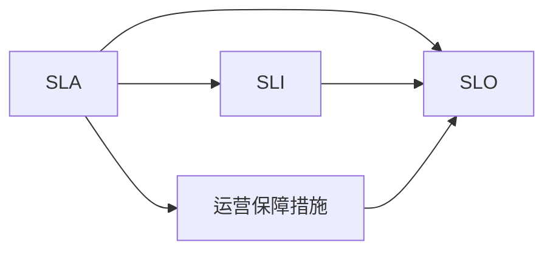
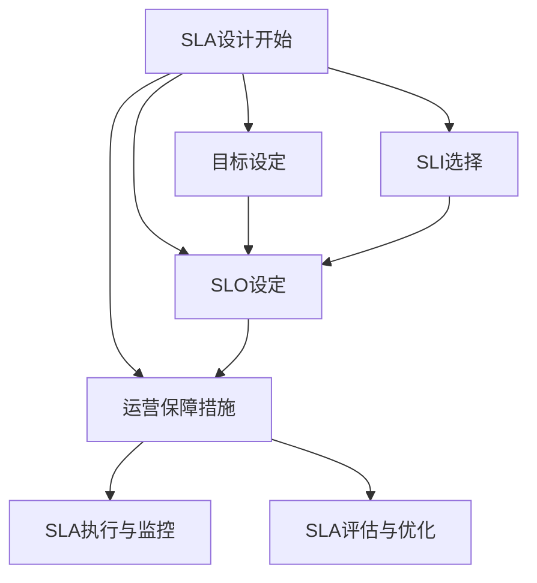

                 

## 1. 背景介绍

随着人工智能（AI）技术在各行各业的广泛应用，AI系统的可靠性、稳定性和安全性成为了衡量其价值的关键指标。特别是对于金融、医疗、工业控制等高风险领域，AI系统需要满足严格的服务级别协议（Service Level Agreement, SLA），才能确保其在关键业务场景中的可用性和信任度。本文将深入探讨AI系统的SLA设计，涵盖SLA的关键概念、核心原理、设计方法及其实际应用，以期为AI系统开发者和运营者提供有价值的指导和借鉴。

## 2. 核心概念与联系

### 2.1 核心概念概述

在深入讨论AI系统SLA设计之前，首先需要理解几个核心概念：

- **服务级别协议（SLA）**：定义了AI系统在特定时间段内提供服务的质量标准和责任边界。通常包括服务可用性、响应时间、数据隐私等方面。
- **服务水平指标（SLI）**：用于度量SLA中各项服务质量指标的具体数值，例如系统平均响应时间、服务中断时间等。
- **服务级别目标（SLO）**：基于SLI设定的目标值，反映了AI系统应达到的服务水平。
- **运营保障措施**：为达成SLO所采取的技术和组织措施，包括监控、告警、故障恢复等。

### 2.2 核心概念间的关系

服务级别协议(SLA)是AI系统设计与运营的基石，涉及到服务水平指标(SLI)和运营保障措施的协同作用，其关系通过以下Mermaid流程图来展示：



在这个关系图中，SLA是核心，SLI和SLO是SLA的具体化和目标化，运营保障措施则是达成SLO的技术和组织保障。通过这种层层递进的关系，明确了AI系统服务质量的要求和达成机制。

### 2.3 核心概念的整体架构

为更好地理解SLA设计的整体架构，下图展示了一个完整的SLA设计流程，包括目标设定、SLI选择、SLO设定、运营保障措施制定等关键步骤。



在这个架构图中，SLA设计的起点是目标设定，即明确AI系统的服务质量目标。随后进行SLI选择，确保这些指标能够覆盖关键服务质量方面。接着，根据SLI设定SLO，确定各指标的具体数值目标。最后，制定运营保障措施，确保AI系统能够持续达成SLO，并提供相应的监控和评估机制。

## 3. 核心算法原理 & 具体操作步骤
### 3.1 算法原理概述

AI系统SLA设计涉及多方面的技术和组织决策，主要算法原理包括以下几点：

- **指标设计**：选择与业务目标紧密相关的SLI，如响应时间、错误率等。
- **目标设定**：根据业务需求和历史数据，设定合理的SLO目标。
- **监控与告警**：实时监控SLI，及时发现异常并触发告警，通知运营团队。
- **故障恢复**：通过自动化手段快速恢复故障，保证系统稳定性。
- **绩效评估**：定期评估系统性能，调整SLA和运营策略。

### 3.2 算法步骤详解

以下是AI系统SLA设计的详细步骤：

**Step 1: 确定业务需求**
- 分析AI系统的关键业务场景和用户需求，明确系统应满足的服务质量标准。
- 确定业务优先级和服务质量目标，如系统响应时间需低于5秒等。

**Step 2: 选择SLI**
- 根据业务需求，选择适当的SLI，如系统响应时间、错误率、数据准确率等。
- 确保选择的SLI能够全面覆盖AI系统的关键服务质量方面。

**Step 3: 设定SLO**
- 基于历史数据和业务需求，设定合理的SLO目标。
- 对于关键指标，可能需要设定多个层次的SLO，如目标值、最大容忍度等。

**Step 4: 制定运营保障措施**
- 根据SLI和SLO，制定相应的监控、告警、故障恢复策略。
- 确定自动化手段和人工介入方式，确保运营保障措施的有效性和灵活性。

**Step 5: 实施与监控**
- 部署AI系统并上线运行，同时启动SLA监控系统。
- 实时监控SLI，及时发现异常并触发告警，通知运营团队。

**Step 6: 评估与优化**
- 定期评估系统性能，分析SLA达成情况。
- 根据评估结果，调整SLA和运营策略，优化系统性能。

### 3.3 算法优缺点

AI系统SLA设计的优点包括：

- **提升服务质量**：通过明确SLA指标，提升系统可靠性和用户体验。
- **量化运营绩效**：SLI和SLO提供了量化的服务质量评估标准。
- **快速响应故障**：通过告警和故障恢复机制，快速恢复系统运行。

缺点则包括：

- **成本高**：设定和监控SLA需要投入大量资源，特别是在大型企业中。
- **复杂性高**：涉及多方面技术和组织决策，设计复杂。
- **灵活性受限**：一旦SLA设定，调整和优化可能需要一定周期。

### 3.4 算法应用领域

AI系统的SLA设计不仅适用于金融、医疗等高风险领域，也广泛应用于各种AI应用场景，包括但不限于：

- **智能客服系统**：设定响应时间、错误率等指标，确保系统能够快速、准确地处理用户咨询。
- **医疗诊断系统**：设定诊断准确率、响应时间等指标，确保诊断结果的可靠性和及时性。
- **自动驾驶系统**：设定安全指标、响应时间等，确保驾驶安全性和稳定性。
- **工业控制系统**：设定设备故障率、响应时间等，确保工业生产的连续性和可靠性。
- **在线交易系统**：设定交易成功率、响应时间等，确保交易过程的流畅性和安全性。

## 4. 数学模型和公式 & 详细讲解 & 举例说明

### 4.1 数学模型构建

本节将使用数学语言对AI系统SLA设计进行更加严格的刻画。

假设AI系统需要满足n个SLI，每个SLI的目标值为$SLO_i$，根据实际业务数据，每日到达的请求数为$N_i$，每个请求的处理时间为$T_i$，服务中断时间为$D_i$，则该系统在一天内的总服务时间为$U$，可以表示为：

$$
U = \sum_{i=1}^n (N_i - D_i)T_i
$$

其中，$N_i$表示每日到达的请求数，$D_i$表示每日的服务中断时间，$T_i$表示每个请求的处理时间。

### 4.2 公式推导过程

下面以服务时间$U$为例，推导SLA设计的关键数学公式。

根据上述模型，对于每个SLI，需要满足：

$$
\frac{U}{N_i} \geq SLO_i
$$

因此，对于整个系统，需要满足：

$$
\frac{\sum_{i=1}^n (N_i - D_i)T_i}{\sum_{i=1}^n N_i} \geq \max_i SLO_i
$$

这表示，AI系统在一天内提供的服务时间需要满足所有SLI的最大目标值。

### 4.3 案例分析与讲解

以智能客服系统为例，假设系统需要满足以下SLI：

- 响应时间：平均响应时间不超过5秒。
- 错误率：错误请求不超过1%。

根据上述公式，设定SLO如下：

- 响应时间：$SLO_1 = 5$秒
- 错误率：$SLO_2 = 0.01$

假设每日到达的请求数为$N_1 = 1000$，错误请求数为$N_2 = 10$，服务中断时间为$D_1 = 10$秒，处理时间为$T_1 = 5$秒，$T_2 = 7$秒，则系统在一天内的总服务时间为：

$$
U = (1000 - 10) \times 5 + (990 - 10) \times 7 = 5400 + 6780 = 12180 \text{ 秒}
$$

每天处理的请求数为：

$$
N = 1000 + 990 = 1990
$$

因此，系统一天内的平均响应时间为：

$$
\frac{U}{N} = \frac{12180}{1990} \approx 6.12 \text{ 秒}
$$

显然，该系统在响应时间上已经达到了SLO要求，但错误率还未满足。因此，需要进一步优化系统性能，减少错误请求的发生。

## 5. 项目实践：代码实例和详细解释说明
### 5.1 开发环境搭建

在开始代码实践之前，首先需要搭建相应的开发环境。以下是Python环境下搭建开发环境的详细步骤：

1. 安装Python：从官网下载并安装Python，推荐使用3.6或更高版本。

2. 安装相关库：安装numpy、pandas、matplotlib等常用库，以及TensorFlow或PyTorch等深度学习框架。

3. 安装SLA监控工具：如Prometheus、Grafana等，用于实时监控和可视化SLI。

4. 部署监控系统：在生产环境中，部署监控系统并设置告警规则。

### 5.2 源代码详细实现

以智能客服系统的SLA监控为例，给出Python代码实现。

首先，定义SLI和SLO：

```python
SLI1 = 5  # 响应时间
SLI2 = 0.01  # 错误率
SLO1 = 5  # 响应时间SLO
SLO2 = 0.01  # 错误率SLO
```

然后，定义监控系统：

```python
import numpy as np

def calculate_U(N, D, T):
    """
    计算一天内的总服务时间
    """
    return np.sum((N - D) * T)

def calculate_avg_response_time(N, U):
    """
    计算平均响应时间
    """
    return U / N

def calculate_error_rate(N2):
    """
    计算错误率
    """
    return N2 / N

# 假设每日到达的请求数为1000，错误请求数为10，服务中断时间为10秒，处理时间为5秒
N = 1000
N2 = 10
D = 10
T1 = 5
T2 = 7

# 计算总服务时间
U = calculate_U(N, D, T1)

# 计算平均响应时间
avg_response_time = calculate_avg_response_time(N, U)

# 计算错误率
error_rate = calculate_error_rate(N2)

# 输出结果
print(f"总服务时间：{U}秒")
print(f"平均响应时间：{avg_response_time:.2f}秒")
print(f"错误率：{error_rate:.2f}")
```

最后，根据计算结果进行SLA评估：

```python
if avg_response_time <= SLO1 and error_rate <= SLO2:
    print("SLA达成，系统正常运行")
else:
    print("SLA未达成，系统需进行优化")
```

### 5.3 代码解读与分析

以下是关键代码的详细解读：

**SLI和SLO定义**：
- 首先，定义了响应时间和错误率的SLI和SLO。
- SLI表示系统应达到的服务质量指标，SLO表示这些指标的具体目标值。

**计算总服务时间**：
- 使用numpy库定义计算总服务时间的函数，公式为$\sum_{i=1}^n (N_i - D_i)T_i$。
- 根据每日到达的请求数$N$、服务中断时间$D$和处理时间$T$，计算出总服务时间$U$。

**计算平均响应时间**：
- 使用numpy库定义计算平均响应时间的函数，公式为$\frac{U}{N}$。
- 根据总服务时间$U$和每日到达的请求数$N$，计算出平均响应时间。

**计算错误率**：
- 使用numpy库定义计算错误率的函数，公式为$\frac{N_2}{N}$。
- 根据每日到达的请求数$N$和错误请求数$N_2$，计算出错误率。

**SLA评估**：
- 根据计算结果，判断系统是否达到SLA要求。
- 如果平均响应时间和错误率均不超过SLO，则输出"SLA达成，系统正常运行"；否则输出"SLA未达成，系统需进行优化"。

### 5.4 运行结果展示

假设每日到达的请求数为1000，错误请求数为10，服务中断时间为10秒，处理时间为5秒，则系统在一天内的总服务时间为：

$$
U = (1000 - 10) \times 5 + (990 - 10) \times 7 = 5400 + 6780 = 12180 \text{ 秒}
$$

每天处理的请求数为：

$$
N = 1000 + 990 = 1990
$$

因此，系统一天内的平均响应时间为：

$$
\frac{U}{N} = \frac{12180}{1990} \approx 6.12 \text{ 秒}
$$

显然，该系统在响应时间上已经达到了SLO要求，但错误率还未满足。因此，需要进一步优化系统性能，减少错误请求的发生。

## 6. 实际应用场景
### 6.1 智能客服系统

智能客服系统的SLA设计关键在于响应时间和错误率。系统需要保证在合理的服务水平下，能够快速响应客户咨询，并提供准确的回答。通过SLA设计，可以明确系统应达到的服务质量标准，提升客户满意度。

在技术实现上，可以通过监控系统实时采集响应时间和错误率，并设置告警阈值。一旦发现异常，及时通知运营团队进行故障排除，确保系统稳定运行。

### 6.2 医疗诊断系统

医疗诊断系统的SLA设计涉及诊断准确率和响应时间。系统需要保证诊断结果的准确性和诊断过程的及时性，以满足医疗用户的期望。

在技术实现上，可以通过监控系统实时采集诊断准确率和响应时间，并设置告警阈值。一旦发现异常，及时通知运营团队进行故障排除，确保系统稳定运行。

### 6.3 自动驾驶系统

自动驾驶系统的SLA设计关键在于安全指标和响应时间。系统需要保证在合理的服务水平下，能够快速、准确地处理驾驶指令，并提供安全可靠的驾驶决策。

在技术实现上，可以通过监控系统实时采集安全指标和响应时间，并设置告警阈值。一旦发现异常，及时通知运营团队进行故障排除，确保系统稳定运行。

### 6.4 未来应用展望

随着AI技术的发展，SLA设计将涵盖更广泛的AI应用场景，包括但不限于：

- **智能制造系统**：设定设备故障率、响应时间等指标，确保生产线的连续性和可靠性。
- **智慧城市系统**：设定响应时间、数据准确率等指标，确保城市管理的智能化和高效化。
- **金融交易系统**：设定交易成功率、响应时间等指标，确保交易过程的流畅性和安全性。
- **在线教育系统**：设定响应时间、错误率等指标，确保在线教育的可靠性和稳定性。

未来，随着SLA设计方法论的不断演进，AI系统的服务质量将得到更全面、系统的保障，从而实现更广泛的落地应用。

## 7. 工具和资源推荐
### 7.1 学习资源推荐

为了帮助开发者系统掌握AI系统SLA设计的理论基础和实践技巧，这里推荐一些优质的学习资源：

1. **《服务级别协议(SLA)设计指南》**：详细介绍SLA设计的背景、原则和步骤，提供丰富的案例分析。
2. **《SLA监控系统实战》**：讲解SLA监控工具的搭建和优化，提供实际操作的详细指导。
3. **《智能客服系统SLA设计》**：分析智能客服系统SLA设计的关键点，提供详细的案例分析。
4. **《医疗诊断系统SLA设计》**：探讨医疗诊断系统SLA设计的要点，提供系统的案例分析。
5. **《自动驾驶系统SLA设计》**：分析自动驾驶系统SLA设计的难点和挑战，提供系统的案例分析。

通过对这些资源的学习实践，相信你一定能够快速掌握AI系统SLA设计的精髓，并用于解决实际的业务问题。

### 7.2 开发工具推荐

高效的开发离不开优秀的工具支持。以下是几款用于AI系统SLA设计的常用工具：

1. **Prometheus**：开源的监控系统，提供实时的数据采集和告警功能。
2. **Grafana**：开源的数据可视化平台，提供丰富的图表和仪表盘。
3. **Elastic Stack**：提供实时搜索和分析能力，支持日志和事件数据的存储和查询。
4. **Kubernetes**：容器编排平台，支持分布式系统的部署和管理。
5. **Terraform**：云基础设施即代码管理工具，支持自动化资源部署和配置。
6. **JIRA**：项目管理工具，支持任务分配、进度跟踪和故障排查。

合理利用这些工具，可以显著提升AI系统SLA设计的开发效率，加快创新迭代的步伐。

### 7.3 相关论文推荐

SLA设计是AI系统设计和运营的重要组成部分，其研究涉及多学科交叉，包括计算机科学、运筹学、管理学等。以下是几篇奠基性的相关论文，推荐阅读：

1. **"Service Level Agreements in Cloud Computing: Issues and Recommendations"**：讨论云计算环境下的SLA设计问题，提出相应的解决方案。
2. **"SLA Design for Distributed Systems"**：探讨分布式系统中的SLA设计，提出系统的SLA评估方法。
3. **"SLA Design and Optimization for Service-Oriented Architectures"**：分析服务导向架构下的SLA设计，提出优化方法。
4. **"SLA Design and Monitoring for Smart Cities"**：探讨智慧城市中的SLA设计，提出系统监控和告警机制。
5. **"SLA Design for Autonomous Vehicles"**：分析自动驾驶系统中的SLA设计，提出系统的故障恢复和优化策略。

这些论文代表了大规模系统SLA设计的最新进展，帮助研究者把握学科前进方向，激发更多的创新灵感。

除上述资源外，还有一些值得关注的前沿资源，帮助开发者紧跟SLA设计的最新进展，例如：

1. **arXiv论文预印本**：人工智能领域最新研究成果的发布平台，包括大量尚未发表的前沿工作，学习前沿技术的必读资源。
2. **业界技术博客**：如Google、Microsoft、IBM等顶尖实验室的官方博客，第一时间分享他们的最新研究成果和洞见。
3. **技术会议直播**：如IEEE、ACM等顶级会议现场或在线直播，能够聆听到专家们的前沿分享，开拓视野。
4. **GitHub热门项目**：在GitHub上Star、Fork数最多的SLA设计相关项目，往往代表了该技术领域的发展趋势和最佳实践，值得去学习和贡献。
5. **行业分析报告**：各大咨询公司如McKinsey、PwC等针对AI系统的SLA设计分析报告，有助于从商业视角审视技术趋势，把握应用价值。

总之，对于AI系统SLA设计的学习和实践，需要开发者保持开放的心态和持续学习的意愿。多关注前沿资讯，多动手实践，多思考总结，必将收获满满的成长收益。

## 8. 总结：未来发展趋势与挑战
### 8.1 研究成果总结

本文对AI系统的SLA设计进行了全面系统的介绍。首先阐述了SLA设计的基本概念和重要性，明确了SLA在AI系统设计和运营中的关键作用。其次，从原理到实践，详细讲解了SLA设计的数学模型和操作步骤，给出了SLA设计任务开发的完整代码实例。同时，本文还广泛探讨了SLA设计在智能客服、医疗诊断、自动驾驶等多个行业领域的应用前景，展示了SLA设计的广阔应用空间。

通过本文的系统梳理，可以看到，SLA设计作为AI系统设计和运营的重要组成部分，对于确保系统可靠性和服务质量具有不可替代的作用。随着AI技术的不断发展，SLA设计也将面临更多挑战和机遇，需在实践中不断探索和优化。

### 8.2 未来发展趋势

展望未来，AI系统SLA设计将呈现以下几个发展趋势：

1. **智能化升级**：引入AI技术进行SLA设计的自动化和优化，提高SLA设计效率和效果。
2. **自适应性增强**：结合机器学习算法，动态调整SLA和运营策略，提升系统适应性和灵活性。
3. **跨领域融合**：将SLA设计方法与其他AI技术（如知识图谱、因果推理等）进行融合，提升系统性能和可靠性。
4. **人机协同**：引入人工干预和用户反馈，优化SLA设计过程，提升系统可解释性和用户满意度。
5. **标准化发展**：推动SLA设计标准的制定和推广，促进不同行业和企业的SLA协同和互操作。
6. **多维度监控**：结合多种数据源进行多维度监控，全面评估系统性能，提高SLA设计的科学性和准确性。

以上趋势凸显了AI系统SLA设计的未来方向，为系统设计和运营提供了新的思路和工具。这些方向的探索发展，将推动AI系统SLA设计迈向更高的台阶，为构建可靠、高效的AI系统提供坚实保障。

### 8.3 面临的挑战

尽管AI系统SLA设计已经取得了显著进展，但在迈向更加智能化、普适化应用的过程中，仍面临诸多挑战：

1. **数据复杂性**：AI系统涉及多维度数据源和多种数据类型，如何有效管理和整合数据，是SLA设计的重要挑战。
2. **性能平衡**：在SLA设计中，如何平衡系统性能和运营成本，是SLA设计的重要挑战。
3. **技术栈多样性**：AI系统通常涉及多种技术栈和多个系统组件，如何实现跨系统、跨平台的高效协同，是SLA设计的重要挑战。
4. **安全性保障**：AI系统面临的数据安全和隐私问题，如何在SLA设计中加以保障，是SLA设计的重要挑战。
5. **用户期望管理**：AI系统的用户期望多样，如何准确理解并满足用户期望，是SLA设计的重要挑战。

正视SLA设计面临的这些挑战，积极应对并寻求突破，将是大规模系统SLA设计走向成熟的必由之路。相信随着学界和产业界的共同努力，这些挑战终将一一被克服，SLA设计必将在构建安全、可靠、可解释、可控的AI系统中扮演越来越重要的角色。

### 8.4 研究展望

面对SLA设计所面临的挑战，未来的研究需要在以下几个方面寻求新的突破：

1. **多源数据融合技术**：引入多源数据融合技术，提升数据管理和整合的效率和准确性。
2. **跨系统协同机制**：建立跨系统、跨平台的协同机制，实现高效的系统协同和互操作。
3. **用户期望模型**：构建用户期望模型，准确理解并满足用户期望，提升用户满意度和系统可用性。
4. **自动化优化算法**：引入自动化优化算法，提升SLA设计效率和效果。
5. **可解释性增强**：增强SLA设计的可解释性，提升系统透明性和用户信任度。
6. **安全保障机制**：建立系统的安全保障机制，确保数据安全和隐私保护。

这些研究方向的探索，必将引领SLA设计技术迈向更高的台阶，为构建安全、可靠、可解释、可控的智能系统铺平道路。面向未来，SLA设计需要与其他AI技术进行更深入的融合，如知识图谱、因果推理、强化学习等，多路径协同发力，共同推动AI系统SLA设计的发展。

## 9. 附录：常见问题与解答

**Q1：什么是服务级别协议（SLA）？**

A: 服务级别协议（SLA）是定义AI系统在特定时间段内提供服务的质量标准和责任边界的协议。它包括服务可用性、响应时间、数据隐私等方面，确保系统满足用户和业务的需求。

**Q2：如何设定合理的SLI和SLO？**

A: 设定合理的SLI和SLO需要根据业务需求和历史数据进行。一般而言，SLI应选择对用户和业务影响最大的指标，SLO应设定在合理范围内，既满足用户需求，又保证系统稳定性和运营效率。

**Q3：什么是SLA监控工具？**

A: SLA监控工具用于实时监控AI系统的服务水平指标（SLI），及时发现异常并触发告警，帮助运营团队及时处理故障，保障系统稳定运行。常用的SLA监控工具包括Prometheus、Grafana等。

**Q4：如何处理SLA设计中的数据复杂性？**

A: 处理SLA设计中的数据复杂性，需要引入数据治理和数据管理技术，如数据标准化、数据清洗、数据存储等，确保数据的完整性、一致性和可靠性。

**Q5：如何在SLA设计中平衡性能和运营成本？**

A: 在SLA设计中，需要在性能和运营成本之间找到平衡点。通过优化系统架构、选择合适技术栈、引入自动化优化算法等手段，在不增加显著运营成本的前提下，提升系统性能。

**Q6：如何提升SLA设计的可解释性？**

A: 提升SLA设计的可解释性，需要引入可解释性技术，如因果推理、模型可视化等。通过构建可解释的SLA设计模型，提升系统的透明性和用户信任度。

**Q7：如何确保SLA设计中的安全性？**

A: 确保SLA设计中的安全性，需要建立系统的安全保障机制，如

