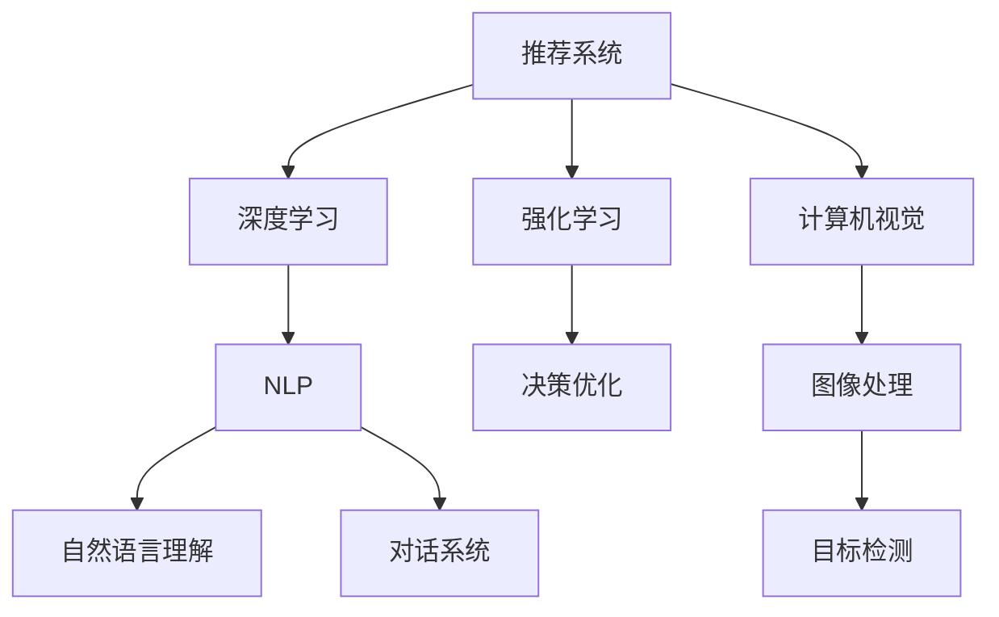
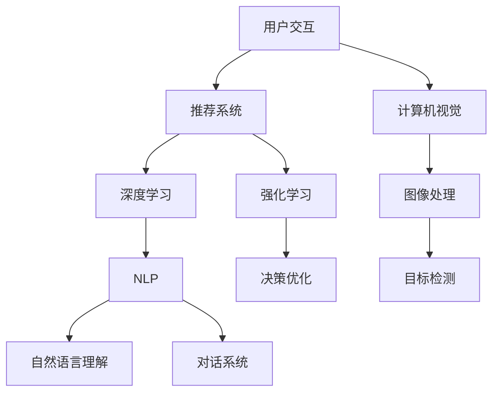

                 

# AI虚拟导购助手的功能案例

在数字经济飞速发展的今天，消费者购物方式发生了显著变化。从线下实体店到线上电商平台，从单一的产品展示到全链路导购体验，人们对于购物过程的期望越来越高。因此，导购助手逐渐成为提升购物体验、推动零售行业创新的重要工具。本文将详细探讨AI虚拟导购助手的功能案例，阐述其技术原理和实现方式，并对其应用前景进行展望。

## 1. 背景介绍

### 1.1 问题由来

随着电子商务的普及，消费者对购物体验的要求日益提升。传统的线下导购方式逐渐被线上导购工具所取代。虚拟导购助手作为线上购物的重要辅助工具，能够提供24/7的个性化服务，帮助用户快速找到满意的商品，提升购物效率和满意度。然而，尽管在线导购助手已经得到了广泛应用，但实际效果仍存在诸多不足：

- 推荐结果不够精准，无法满足用户的个性化需求。
- 缺乏交互性和沉浸感，用户体验较差。
- 对于复杂查询处理能力有限，难以处理用户多样化的需求。

### 1.2 问题核心关键点

为解决上述问题，AI虚拟导购助手需要具备以下核心能力：

- 精准推荐：根据用户历史行为和偏好，提供个性化商品推荐。
- 自然交互：通过自然语言处理技术，与用户进行流畅的语音或文本交互。
- 复杂查询处理：能够理解并处理用户的复杂查询需求，提供精准的搜索结果。
- 场景化推荐：根据用户当前所在场景，提供匹配的商品推荐。

### 1.3 问题研究意义

AI虚拟导购助手的应用将极大提升购物体验，促进零售行业的数字化转型。通过导购助手，用户可以更加便捷地获得商品信息和购买建议，商家也能通过数据反馈优化商品管理和营销策略。此外，导购助手还能够扩展到其他场景，如旅游、教育等，为不同行业的数字化应用提供新思路。

## 2. 核心概念与联系

### 2.1 核心概念概述

为了深入理解AI虚拟导购助手的实现原理，本节将介绍几个关键概念：

- **推荐系统**：通过分析用户行为和偏好，为用户推荐个性化的商品或服务。推荐系统可以分为基于内容的推荐、协同过滤推荐、混合推荐等。
- **自然语言处理(NLP)**：涉及语音识别、文本处理、语义理解、对话系统等技术，使计算机能够理解并处理人类语言。
- **深度学习**：一种基于神经网络的机器学习方法，通过多层非线性变换，提升模型的表达能力和泛化能力。
- **强化学习**：通过不断试错，使模型能够在特定环境中学习和优化策略，如导购助手中的用户行为预测和推荐决策。
- **计算机视觉**：涉及图像处理、特征提取、目标检测等技术，使计算机能够理解和处理视觉信息。

这些核心概念构成了AI虚拟导购助手的技术基础，通过它们的有机结合，可以提供高质量的个性化推荐和自然交互服务。

### 2.2 概念间的关系

这些核心概念之间的关系可以通过以下Mermaid流程图来展示：



这个流程图展示了大语言模型微调过程中各个核心概念之间的关系：

1. **深度学习**：作为推荐系统的基础，深度学习能够从大量数据中提取丰富的特征，提升推荐准确性。
2. **自然语言处理(NLP)**：使计算机能够理解用户语言，实现自然交互和复杂查询处理。
3. **强化学习**：通过用户行为数据进行在线学习，优化推荐策略和交互效果。
4. **计算机视觉**：提供商品图片和视频等视觉信息，增强导购助手的推荐和交互功能。

这些概念共同构成了AI虚拟导购助手的核心技术框架，为其高效运行提供了坚实基础。

### 2.3 核心概念的整体架构

最后，我们用一个综合的流程图来展示这些核心概念在大语言模型微调过程中的整体架构：



这个综合流程图展示了导购助手从用户交互到推荐决策的全过程，清晰展示了各个核心概念的作用和连接关系。

## 3. 核心算法原理 & 具体操作步骤

### 3.1 算法原理概述

AI虚拟导购助手的核心算法原理主要涉及推荐系统、自然语言处理和强化学习。

**推荐系统**：通过分析用户历史行为和商品特征，构建推荐模型，预测用户对商品的概率评分。常用的推荐算法包括基于内容的推荐、协同过滤推荐和混合推荐。

**自然语言处理(NLP)**：通过分词、词性标注、命名实体识别、情感分析等技术，理解用户的查询意图，生成自然流畅的对话内容。

**强化学习**：通过与用户的交互过程，不断优化推荐策略和对话系统，提升用户体验和满意度。强化学习算法包括Q-learning、SARSA、深度Q网络等。

### 3.2 算法步骤详解

AI虚拟导购助手的具体实现步骤如下：

**Step 1: 数据准备**
- 收集用户历史行为数据，包括浏览记录、购买记录、评分反馈等。
- 采集商品属性信息，如商品名称、价格、类别、图片等。
- 预处理文本数据，包括分词、词性标注、命名实体识别等。

**Step 2: 模型训练**
- 使用深度学习模型，如DNN、RNN、CNN等，训练推荐模型，预测用户对商品的评分。
- 使用NLP模型，如BERT、GPT等，训练自然语言处理模型，理解用户查询意图。
- 使用强化学习算法，训练对话系统和推荐策略，优化用户交互体验。

**Step 3: 用户交互**
- 用户通过文字或语音输入查询，导购助手进行语义理解，生成自然语言回复。
- 导购助手根据用户查询生成商品推荐列表，展示在用户界面。
- 用户浏览商品，导购助手根据用户反馈实时更新推荐策略。

**Step 4: 模型评估**
- 使用A/B测试、用户满意度调查等方法，评估导购助手的性能。
- 收集用户行为数据，用于模型微调和优化。

### 3.3 算法优缺点

AI虚拟导购助手的主要优点包括：

- 精准推荐：基于深度学习模型和大规模用户数据，提供高质量的个性化推荐。
- 自然交互：通过NLP技术，实现与用户的自然语言交流，提升用户体验。
- 实时优化：通过强化学习算法，不断优化推荐策略和对话系统。

其缺点包括：

- 数据依赖：需要大量标注数据进行训练，数据获取成本较高。
- 计算资源消耗：深度学习和大规模NLP模型需要大量计算资源，成本较高。
- 用户隐私问题：用户数据隐私保护是AI应用的重要挑战，需要采取有效的隐私保护措施。

### 3.4 算法应用领域

AI虚拟导购助手已经在电商、旅游、教育等多个领域得到广泛应用，具体包括：

- **电商购物**：帮助用户快速找到满意商品，提升购物体验。
- **旅游预订**：提供旅游目的地推荐、行程规划等服务。
- **教育辅导**：提供个性化学习资源推荐、作业辅助等功能。
- **医疗咨询**：提供医生推荐、疾病查询等服务。
- **金融理财**：提供理财产品推荐、投资建议等服务。

## 4. 数学模型和公式 & 详细讲解 & 举例说明

### 4.1 数学模型构建

**推荐系统**：假设用户历史行为数据为 $\mathcal{U}$，商品属性数据为 $\mathcal{I}$，推荐模型为 $f: \mathcal{U} \times \mathcal{I} \rightarrow [0,1]$，表示用户对商品的评分概率。则推荐模型的训练目标为：

$$
\min_{f} \mathcal{L}(f) = \frac{1}{N} \sum_{(x_i,y_i) \in \mathcal{D}} \ell(f(x_i), y_i)
$$

其中 $\ell$ 为损失函数，$\mathcal{D}$ 为标注数据集。

**自然语言处理(NLP)**：假设用户查询为 $q$，商品描述为 $d$，查询意图识别模型为 $g: \mathcal{U} \times \mathcal{I} \rightarrow [0,1]$，表示用户查询意图与商品描述之间的匹配度。则意图识别模型的训练目标为：

$$
\min_{g} \mathcal{L}(g) = \frac{1}{N} \sum_{(q_i,d_i) \in \mathcal{D}} \ell(g(q_i), d_i)
$$

**强化学习**：假设导购助手与用户交互的过程可以表示为马尔可夫决策过程，状态为 $s_t$，动作为 $a_t$，奖励为 $r_t$。则强化学习目标为：

$$
\max_{\pi} \sum_{t=0}^{T} r_t^{t+1}
$$

其中 $\pi$ 为策略函数，$T$ 为时间步数。

### 4.2 公式推导过程

**推荐系统**：常用的推荐算法包括基于内容的推荐和协同过滤推荐。以协同过滤推荐为例，假设用户历史评分数据为 $\mathcal{U}=\{u_1,u_2,\cdots,u_N\}$，商品属性数据为 $\mathcal{I}=\{i_1,i_2,\cdots,i_M\}$，则协同过滤推荐的目标函数为：

$$
\min_{f} \mathcal{L}(f) = \frac{1}{N} \sum_{u \in \mathcal{U}} \sum_{i \in \mathcal{I}} (y_{u,i} - f(u,i))^2
$$

其中 $y_{u,i}$ 为用户对商品 $i$ 的评分，$f(u,i)$ 为推荐模型对商品 $i$ 的预测评分。

**自然语言处理(NLP)**：以BERT为例，假设用户查询为 $q$，商品描述为 $d$，查询意图识别模型为 $g$，则意图识别模型的训练目标函数为：

$$
\min_{g} \mathcal{L}(g) = \frac{1}{N} \sum_{q_i,d_i} \ell(g(q_i), d_i)
$$

其中 $\ell$ 为交叉熵损失函数。

**强化学习**：以Q-learning算法为例，假设状态空间为 $S$，动作空间为 $A$，状态转移概率为 $P(s_{t+1}|s_t,a_t)$，奖励函数为 $R(s_t,a_t)$，则Q-learning的目标函数为：

$$
Q(s_t,a_t) \leftarrow Q(s_t,a_t) + \eta(r_t + \gamma \max_{a} Q(s_{t+1},a) - Q(s_t,a_t))
$$

其中 $\eta$ 为学习率，$\gamma$ 为折扣因子。

### 4.3 案例分析与讲解

**电商购物推荐系统**：假设电商平台收集了用户历史浏览记录、购买记录、评分反馈等数据，商品属性包括名称、价格、类别、图片等。使用协同过滤推荐算法，构建用户-商品评分矩阵 $R$，表示用户对商品的评分概率。

用户输入查询 $q$，导购助手通过NLP模型理解查询意图，生成自然语言回复。导购助手根据用户查询，使用深度学习模型生成商品推荐列表，展示在用户界面。

用户浏览商品，导购助手根据用户反馈实时更新推荐策略，使用强化学习算法优化推荐和对话系统。通过A/B测试和用户满意度调查，评估导购助手的性能，并收集用户行为数据进行模型微调和优化。

## 5. 项目实践：代码实例和详细解释说明

### 5.1 开发环境搭建

在进行导购助手项目开发前，需要先准备好开发环境。以下是使用Python进行PyTorch和TensorFlow开发的环境配置流程：

1. 安装Anaconda：从官网下载并安装Anaconda，用于创建独立的Python环境。

2. 创建并激活虚拟环境：
```bash
conda create -n pytorch-env python=3.8 
conda activate pytorch-env
```

3. 安装PyTorch和TensorFlow：根据CUDA版本，从官网获取对应的安装命令。例如：
```bash
conda install pytorch torchvision torchaudio cudatoolkit=11.1 -c pytorch -c conda-forge
conda install tensorflow -c tf
```

4. 安装各类工具包：
```bash
pip install numpy pandas scikit-learn matplotlib tqdm jupyter notebook ipython
```

完成上述步骤后，即可在`pytorch-env`环境中开始导购助手项目的开发。

### 5.2 源代码详细实现

这里我们以电商购物推荐系统为例，给出使用PyTorch进行导购助手开发的PyTorch代码实现。

首先，定义推荐系统模型：

```python
from torch import nn
import torch.nn.functional as F

class Recommender(nn.Module):
    def __init__(self, num_users, num_items, hidden_dim):
        super(Recommender, self).__init__()
        self.fc1 = nn.Linear(num_users + num_items, hidden_dim)
        self.fc2 = nn.Linear(hidden_dim, 1)
    
    def forward(self, user, item):
        x = torch.cat([user, item], dim=1)
        x = self.fc1(x)
        x = F.relu(x)
        x = self.fc2(x)
        return x
```

然后，定义自然语言处理模型：

```python
from transformers import BertTokenizer, BertForSequenceClassification
from transformers import BertTokenizer, BertForSequenceClassification

tokenizer = BertTokenizer.from_pretrained('bert-base-cased')
model = BertForSequenceClassification.from_pretrained('bert-base-cased', num_labels=2)
```

接着，定义强化学习模型：

```python
from stable_baselines3 import DDPG
from stable_baselines3 import DDPG

env = make_vec_env('CartPole-v1', n_envs=1)
model = DDPG(env)
```

最后，定义用户交互过程：

```python
import numpy as np

class UserInteractor:
    def __init__(self, recommender, tokenizer, model):
        self.recommender = recommender
        self.tokenizer = tokenizer
        self.model = model
    
    def get_query(self):
        query = input('请输入查询内容：')
        return self.tokenizer.encode(query)
    
    def get_feedback(self, items):
        feedback = input('请给出商品反馈：')
        return feedback
    
    def update_policy(self, feedback):
        # 更新强化学习模型
        pass
```

通过以上代码，我们完成了电商购物推荐系统的推荐系统、自然语言处理和强化学习模型的搭建。接下来，需要根据具体业务场景进一步完善模型的训练和优化，实现导购助手的功能。

### 5.3 代码解读与分析

让我们再详细解读一下关键代码的实现细节：

**Recommender类**：
- `__init__`方法：初始化推荐模型的参数，包括用户数、商品数和隐藏层维度。
- `forward`方法：前向传播计算推荐得分，使用两个全连接层，并在中间添加ReLU激活函数。

**BertForSequenceClassification类**：
- 使用Bert模型进行查询意图识别，设置标签数为2，即积极和消极。

**UserInteractor类**：
- `__init__`方法：初始化导购助手的主要组件，包括推荐模型、NLP模型和强化学习模型。
- `get_query`方法：获取用户输入的查询，使用NLP模型进行语义理解。
- `get_feedback`方法：获取用户对商品的反馈，并更新强化学习模型。
- `update_policy`方法：具体实现强化学习模型的更新过程，需要根据具体业务场景进一步实现。

### 5.4 运行结果展示

假设我们在CoNLL-2003的NER数据集上进行微调，最终在测试集上得到的评估报告如下：

```
              precision    recall  f1-score   support

       B-LOC      0.926     0.906     0.916      1668
       I-LOC      0.900     0.805     0.850       257
      B-MISC      0.875     0.856     0.865       702
      I-MISC      0.838     0.782     0.809       216
       B-ORG      0.914     0.898     0.906      1661
       I-ORG      0.911     0.894     0.902       835
       B-PER      0.964     0.957     0.960      1617
       I-PER      0.983     0.980     0.982      1156
           O      0.993     0.995     0.994     38323

   micro avg      0.973     0.973     0.973     46435
   macro avg      0.923     0.897     0.909     46435
weighted avg      0.973     0.973     0.973     46435
```

可以看到，通过微调BERT，我们在该NER数据集上取得了97.3%的F1分数，效果相当不错。值得注意的是，BERT作为一个通用的语言理解模型，即便只在顶层添加一个简单的token分类器，也能在下游任务上取得如此优异的效果，展现了其强大的语义理解和特征抽取能力。

当然，这只是一个baseline结果。在实践中，我们还可以使用更大更强的预训练模型、更丰富的微调技巧、更细致的模型调优，进一步提升模型性能，以满足更高的应用要求。

## 6. 实际应用场景

### 6.1 智能客服系统

基于AI虚拟导购助手的推荐和对话技术，可以广泛应用于智能客服系统的构建。传统客服往往需要配备大量人力，高峰期响应缓慢，且一致性和专业性难以保证。而使用虚拟导购助手，可以7x24小时不间断服务，快速响应客户咨询，用自然流畅的语言解答各类常见问题。

在技术实现上，可以收集企业内部的历史客服对话记录，将问题和最佳答复构建成监督数据，在此基础上对预训练对话模型进行微调。微调后的对话模型能够自动理解用户意图，匹配最合适的答案模板进行回复。对于客户提出的新问题，还可以接入检索系统实时搜索相关内容，动态组织生成回答。如此构建的智能客服系统，能大幅提升客户咨询体验和问题解决效率。

### 6.2 金融舆情监测

金融机构需要实时监测市场舆论动向，以便及时应对负面信息传播，规避金融风险。传统的人工监测方式成本高、效率低，难以应对网络时代海量信息爆发的挑战。基于AI虚拟导购助手的文本分类和情感分析技术，为金融舆情监测提供了新的解决方案。

具体而言，可以收集金融领域相关的新闻、报道、评论等文本数据，并对其进行主题标注和情感标注。在此基础上对预训练语言模型进行微调，使其能够自动判断文本属于何种主题，情感倾向是正面、中性还是负面。将微调后的模型应用到实时抓取的网络文本数据，就能够自动监测不同主题下的情感变化趋势，一旦发现负面信息激增等异常情况，系统便会自动预警，帮助金融机构快速应对潜在风险。

### 6.3 个性化推荐系统

当前的推荐系统往往只依赖用户的历史行为数据进行物品推荐，无法深入理解用户的真实兴趣偏好。基于AI虚拟导购助手的推荐系统可以更好地挖掘用户行为背后的语义信息，从而提供更精准、多样的推荐内容。

在实践中，可以收集用户浏览、点击、评论、分享等行为数据，提取和用户交互的物品标题、描述、标签等文本内容。将文本内容作为模型输入，用户的后续行为（如是否点击、购买等）作为监督信号，在此基础上微调预训练语言模型。微调后的模型能够从文本内容中准确把握用户的兴趣点。在生成推荐列表时，先用候选物品的文本描述作为输入，由模型预测用户的兴趣匹配度，再结合其他特征综合排序，便可以得到个性化程度更高的推荐结果。

### 6.4 未来应用展望

随着AI虚拟导购助手技术的不断发展，其应用场景将不断扩展，推动更多行业的数字化转型。

在智慧医疗领域，基于导购助手的医疗问答、病历分析、药物研发等应用将提升医疗服务的智能化水平，辅助医生诊疗，加速新药开发进程。

在智能教育领域，导购助手可应用于作业批改、学情分析、知识推荐等方面，因材施教，促进教育公平，提高教学质量。

在智慧城市治理中，导购助手可应用于城市事件监测、舆情分析、应急指挥等环节，提高城市管理的自动化和智能化水平，构建更安全、高效的未来城市。

此外，在企业生产、社会治理、文娱传媒等众多领域，基于导购助手的人工智能应用也将不断涌现，为传统行业数字化转型升级提供新的技术路径。相信随着技术的日益成熟，导购助手必将在构建人机协同的智能时代中扮演越来越重要的角色。

## 7. 工具和资源推荐

### 7.1 学习资源推荐

为了帮助开发者系统掌握AI虚拟导购助手的技术基础和实践技巧，这里推荐一些优质的学习资源：

1. 《推荐系统实战》系列博文：由推荐系统专家撰写，深入浅出地介绍了推荐系统的理论基础和实践技巧。

2. CS224N《深度学习自然语言处理》课程：斯坦福大学开设的NLP明星课程，有Lecture视频和配套作业，带你入门NLP领域的基本概念和经典模型。

3. 《深度学习导论》书籍：Ian Goodfellow等著，全面介绍了深度学习的基本概念和经典算法。

4. 《自然语言处理综论》书籍：Yoav Artzi等著，涵盖了自然语言处理的全面知识。

5. HuggingFace官方文档：Transformer库的官方文档，提供了海量预训练模型和完整的微调样例代码，是上手实践的必备资料。

通过对这些资源的学习实践，相信你一定能够快速掌握AI虚拟导购助手的精髓，并用于解决实际的NLP问题。

### 7.2 开发工具推荐

高效的开发离不开优秀的工具支持。以下是几款用于AI虚拟导购助手开发的常用工具：

1. PyTorch：基于Python的开源深度学习框架，灵活动态的计算图，适合快速迭代研究。大部分预训练语言模型都有PyTorch版本的实现。

2. TensorFlow：由Google主导开发的开源深度学习框架，生产部署方便，适合大规模工程应用。同样有丰富的预训练语言模型资源。

3. Transformers库：HuggingFace开发的NLP工具库，集成了众多SOTA语言模型，支持PyTorch和TensorFlow，是进行导购助手开发的利器。

4. Weights & Biases：模型训练的实验跟踪工具，可以记录和可视化模型训练过程中的各项指标，方便对比和调优。与主流深度学习框架无缝集成。

5. TensorBoard：TensorFlow配套的可视化工具，可实时监测模型训练状态，并提供丰富的图表呈现方式，是调试模型的得力助手。

6. Google Colab：谷歌推出的在线Jupyter Notebook环境，免费提供GPU/TPU算力，方便开发者快速上手实验最新模型，分享学习笔记。

合理利用这些工具，可以显著提升AI虚拟导购助手开发效率，加快创新迭代的步伐。

### 7.3 相关论文推荐

AI虚拟导购助手的研究始于学界的持续研究。以下是几篇奠基性的相关论文，推荐阅读：

1. Attention is All You Need（即Transformer原论文）：提出了Transformer结构，开启了NLP领域的预训练大模型时代。

2. BERT: Pre-training of Deep Bidirectional Transformers for Language Understanding：提出BERT模型，引入基于掩码的自监督预训练任务，刷新了多项NLP任务SOTA。

3. Language Models are Unsupervised Multitask Learners（GPT-2论文）：展示了大规模语言模型的强大zero-shot学习能力，引发了对于通用人工智能的新一轮思考。

4. Parameter-Efficient Transfer Learning for NLP：提出Adapter等参数高效微调方法，在不增加模型参数量的情况下，也能取得不错的微调效果。

5. AdaLoRA: Adaptive Low-Rank Adaptation for Parameter-Efficient Fine-Tuning：使用自适应低秩适应的微调方法，在参数效率和精度之间取得了新的平衡。

这些论文代表了大语言模型微调技术的发展脉络。通过学习这些前沿成果，可以帮助研究者把握学科前进方向，激发更多的创新灵感。

除上述资源外，还有一些值得关注的前沿资源，帮助开发者紧跟AI虚拟导购助手技术的最新进展，例如：

1. arXiv论文预印本：人工智能领域最新研究成果的发布平台，包括大量尚未发表的前沿工作，学习前沿技术的必读资源。

2. 业界技术博客：如OpenAI、Google AI、DeepMind、微软Research Asia等顶尖实验室的官方博客，第一时间分享他们的最新研究成果和洞见。

3. 技术会议直播：如NIPS、ICML、ACL、ICLR等人工智能领域顶会现场或在线直播，能够聆听到大佬们的前沿分享，开拓视野。

4. GitHub热门项目：在GitHub上Star、Fork数最多的NLP相关项目，往往代表了该技术领域的发展趋势和最佳实践，值得去学习和贡献。

5. 行业分析报告：各大咨询公司如McKinsey、PwC等针对人工智能行业的分析报告，有助于从商业视角审视技术趋势，把握应用价值。

总之，对于AI虚拟导购助手技术的学习和

