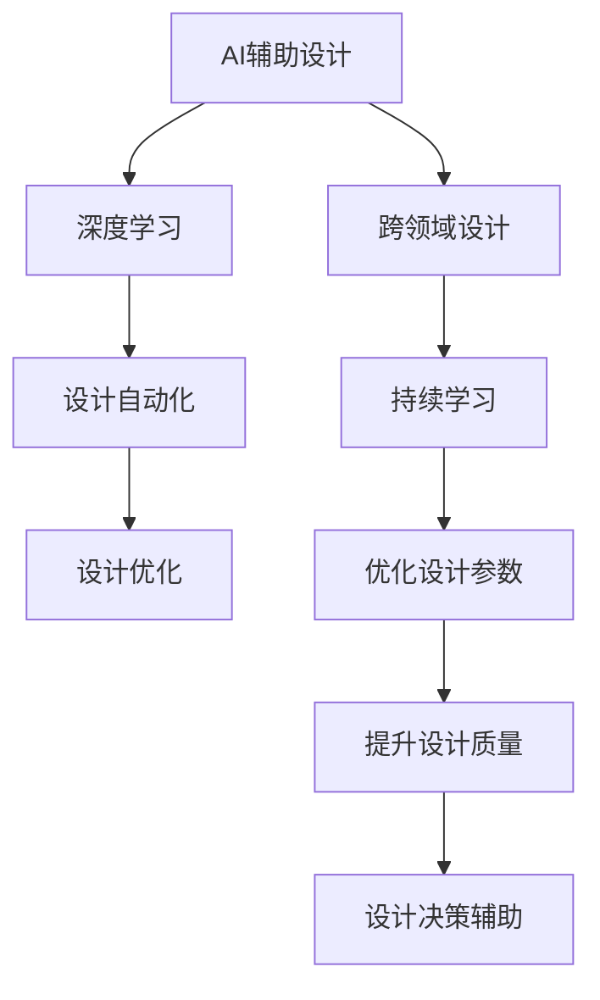
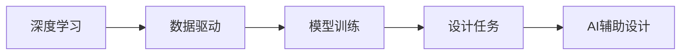
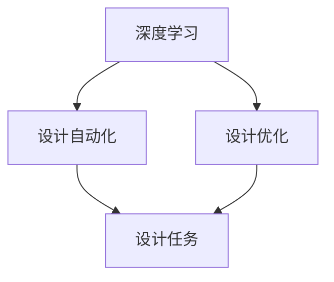
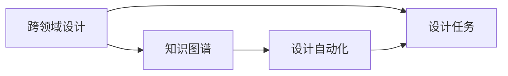
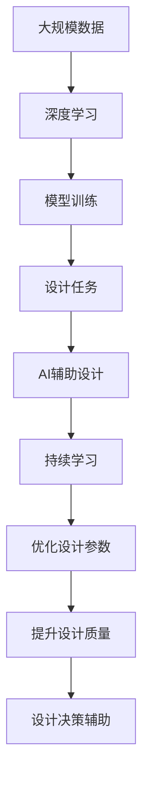

                 

# AI辅助设计在产品开发中的实践

> 关键词：AI辅助设计，产品开发，设计自动化，人工智能，深度学习

## 1. 背景介绍

### 1.1 问题由来
随着人工智能技术的快速发展和普及，越来越多的行业开始探索如何利用AI提升工作效率和创新能力。在产品开发领域，AI辅助设计（AI-assisted design）正成为一个日益受到关注的热点话题。AI辅助设计利用人工智能技术和深度学习算法，帮助设计师自动化完成某些设计任务，如自动布局、风格迁移、智能推荐等。

近年来，AI辅助设计已经在多个领域取得了显著成果。例如，在汽车、建筑、电子产品设计等领域，AI技术通过自动生成设计方案、优化设计参数、辅助设计决策等，大幅提高了设计效率和设计质量。但与此同时，对于AI辅助设计在产品开发中的具体应用场景和实现方法，目前还缺乏系统性的研究和实践指南。本文将从理论和实践两个层面，探讨AI辅助设计在产品开发中的应用，并给出具体的实现方法和步骤。

### 1.2 问题核心关键点
AI辅助设计在产品开发中的应用，核心在于如何利用人工智能技术和深度学习算法，自动化完成设计任务，提升设计效率和创新能力。具体来说，包括以下几个关键点：

1. **自动化设计**：通过深度学习模型自动生成设计方案，减少人工干预，提高设计速度。
2. **优化设计参数**：利用机器学习算法优化设计参数，确保设计质量符合要求。
3. **辅助设计决策**：通过智能推荐和数据分析，帮助设计师做出更好的设计决策。
4. **跨领域融合**：结合不同领域的设计知识和经验，提升设计的全面性和前瞻性。
5. **持续学习与改进**：通过反馈机制和持续学习，不断优化AI模型，提升设计能力。

本文将围绕以上关键点，深入探讨AI辅助设计在产品开发中的应用，并给出具体的实现方法和步骤。

## 2. 核心概念与联系

### 2.1 核心概念概述

为了更好地理解AI辅助设计在产品开发中的应用，本节将介绍几个密切相关的核心概念：

- **AI辅助设计**：利用人工智能技术和深度学习算法，自动化完成设计任务，提升设计效率和设计质量。
- **深度学习**：通过多层神经网络对数据进行抽象和特征提取，解决复杂模式识别和预测问题。
- **设计自动化**：使用自动化工具和算法，完成设计任务，减少人工干预。
- **设计优化**：通过机器学习算法，优化设计参数，提升设计质量。
- **跨领域设计**：结合不同领域的设计知识和经验，提升设计的全面性和前瞻性。

这些核心概念之间的逻辑关系可以通过以下Mermaid流程图来展示：



这个流程图展示了这个生态系统中各概念之间的联系：

1. AI辅助设计利用深度学习自动化完成设计任务。
2. 设计自动化和优化通过机器学习算法实现，提升设计质量。
3. 跨领域设计结合不同领域知识，提升设计全面性。
4. 持续学习不断优化模型，提升设计能力。

### 2.2 概念间的关系

这些核心概念之间存在着紧密的联系，形成了AI辅助设计的完整生态系统。下面我们将通过几个Mermaid流程图来展示这些概念之间的关系。

#### 2.2.1 AI辅助设计的学习范式



这个流程图展示了深度学习在AI辅助设计中的应用。深度学习通过数据驱动，训练出能够完成设计任务的模型，从而实现AI辅助设计。

#### 2.2.2 设计自动化与设计优化



这个流程图展示了设计自动化和设计优化之间的关系。设计自动化通过深度学习自动化完成设计任务，设计优化则通过机器学习算法优化设计参数，提升设计质量。

#### 2.2.3 跨领域设计



这个流程图展示了跨领域设计在AI辅助设计中的应用。跨领域设计通过知识图谱，结合不同领域的设计知识，提升设计的全面性和前瞻性。

### 2.3 核心概念的整体架构

最后，我们用一个综合的流程图来展示这些核心概念在AI辅助设计中的应用：



这个综合流程图展示了从数据到模型训练，再到设计任务完成的完整流程。AI辅助设计利用深度学习模型训练得到的设计模型，自动化完成设计任务，并通过持续学习不断优化模型，提升设计质量。

## 3. 核心算法原理 & 具体操作步骤

### 3.1 算法原理概述

AI辅助设计的核心算法原理可以概括为：利用深度学习模型，通过自动学习设计数据，生成设计方案，优化设计参数，辅助设计决策，提升设计效率和质量。

具体来说，包括以下几个关键步骤：

1. **数据准备**：收集和整理设计相关的数据集，如设计图纸、风格示例、材料参数等。
2. **模型训练**：使用深度学习模型（如卷积神经网络、生成对抗网络等）对设计数据进行训练，生成能够完成设计任务的模型。
3. **设计生成**：将输入的设计要求或示例，通过训练好的模型生成对应的设计方案。
4. **设计优化**：利用机器学习算法对设计方案进行优化，如通过遗传算法、贝叶斯优化等方法，调整设计参数，提升设计质量。
5. **设计决策辅助**：通过智能推荐系统或数据分析工具，辅助设计师进行设计决策。
6. **持续学习**：通过反馈机制和在线学习，不断优化AI模型，提升设计能力。

### 3.2 算法步骤详解

#### 3.2.1 数据准备

在AI辅助设计的第一步，需要准备设计相关的数据集。这些数据集可以包括设计图纸、风格示例、材料参数等。以下是一些常见的数据类型及其处理方式：

- **设计图纸**：可以从公开的设计平台（如SketchUp、AutoCAD等）收集设计图纸数据，包括二维和三维图纸。
- **风格示例**：可以从设计师的作品集或在线设计平台（如Pinterest、Behance等）收集风格示例数据，包括图片、颜色、图案等。
- **材料参数**：可以从材料供应商的在线数据库中收集材料参数数据，包括材料属性、物理特性、价格等。

在数据准备阶段，需要特别注意数据的质量和标注信息。高质量的数据集可以显著提升AI模型的训练效果。同时，需要对数据进行清洗和预处理，如去除噪声、标准化数据格式等。

#### 3.2.2 模型训练

模型训练是AI辅助设计的核心步骤，通过深度学习模型对设计数据进行学习，生成能够完成设计任务的模型。以下是一些常见的深度学习模型及其应用场景：

- **卷积神经网络（CNN）**：适用于图像设计任务，如图纸自动布局、风格迁移等。CNN模型可以从输入的图像数据中提取特征，生成相应的设计方案。
- **生成对抗网络（GAN）**：适用于生成式设计任务，如图纸自动生成、设计方案优化等。GAN模型通过生成器和判别器之间的对抗训练，生成高质量的设计方案。
- **变分自编码器（VAE）**：适用于设计参数优化任务，如材料参数配置、设计方案优化等。VAE模型可以生成潜在的设计参数，并通过解码器生成对应的设计方案。

在模型训练阶段，需要选择合适的损失函数和优化器，以确保模型能够收敛到理想状态。同时，需要进行超参数调优，如学习率、批大小、训练轮数等，以优化训练效果。

#### 3.2.3 设计生成

设计生成是AI辅助设计的关键步骤，通过训练好的深度学习模型，将输入的设计要求或示例，转化为对应的设计方案。以下是一些常见的设计生成技术及其应用场景：

- **自动布局**：使用CNN模型对输入的图纸进行自动布局，如自动排列家具、布局房间等。
- **风格迁移**：使用GAN模型将输入的图纸或图片转换为新的风格，如将古典风格转换为现代风格。
- **设计方案优化**：使用VAE模型生成潜在的设计方案，通过优化算法进行参数调整，生成最优的设计方案。

在模型生成阶段，需要根据具体任务设计合适的输入格式，如二维或三维坐标、风格参数、材料参数等。同时，需要评估生成方案的质量，确保生成的设计方案符合实际需求。

#### 3.2.4 设计优化

设计优化是通过机器学习算法对设计方案进行优化，提升设计质量。以下是一些常见的设计优化方法及其应用场景：

- **遗传算法（GA）**：适用于设计方案优化任务，如家具设计、建筑设计等。GA算法通过模拟自然选择过程，逐步优化设计方案。
- **贝叶斯优化（BO）**：适用于设计参数优化任务，如材料参数配置、设计方案优化等。BO算法通过贝叶斯统计方法，逐步优化设计参数。
- **强化学习（RL）**：适用于设计决策辅助任务，如设计方案评估、设计风格推荐等。RL算法通过环境与策略的交互，逐步优化设计决策。

在模型优化阶段，需要选择合适的优化算法和目标函数，以确保设计方案的质量和效率。同时，需要进行超参数调优，如优化算法参数、目标函数参数等，以优化优化效果。

#### 3.2.5 设计决策辅助

设计决策辅助是通过智能推荐系统或数据分析工具，辅助设计师进行设计决策。以下是一些常见的设计决策辅助技术及其应用场景：

- **智能推荐系统**：适用于设计方案推荐任务，如风格推荐、材料推荐等。智能推荐系统通过分析用户偏好和设计需求，推荐合适的设计方案。
- **数据分析工具**：适用于设计方案评估任务，如设计方案比较、设计风格评估等。数据分析工具通过统计分析和可视化，帮助设计师评估设计方案的优劣。

在模型辅助决策阶段，需要选择合适的推荐算法和评估指标，以确保设计决策的准确性和合理性。同时，需要进行超参数调优，如推荐算法参数、评估指标参数等，以优化推荐效果。

#### 3.2.6 持续学习

持续学习是通过反馈机制和在线学习，不断优化AI模型，提升设计能力。以下是一些常见的持续学习方法及其应用场景：

- **在线学习**：适用于设计数据更新任务，如材料参数更新、设计风格更新等。在线学习通过不断地学习新的设计数据，逐步优化模型。
- **反馈机制**：适用于设计方案评估任务，如设计方案比较、设计风格评估等。反馈机制通过评估设计方案的质量，提供反馈信息，帮助模型不断改进。

在模型持续学习阶段，需要选择合适的学习策略和反馈机制，以确保模型的不断改进。同时，需要进行超参数调优，如学习策略参数、反馈机制参数等，以优化学习效果。

### 3.3 算法优缺点

AI辅助设计的核心算法具有以下优点：

1. **高效性**：通过自动化设计任务，减少人工干预，提升设计效率。
2. **创新性**：利用AI模型生成多种设计方案，提升设计的创新性和多样性。
3. **准确性**：通过优化算法调整设计参数，提升设计质量。
4. **可扩展性**：能够处理大规模设计数据，适应复杂的设计任务。

同时，AI辅助设计也存在以下缺点：

1. **数据依赖**：需要高质量的设计数据，数据质量不足会影响模型效果。
2. **算法复杂**：需要选择合适的深度学习模型和优化算法，算法实现较为复杂。
3. **鲁棒性不足**：对于设计数据的微小变化，模型可能出现泛化不足的问题。
4. **解释性不足**：深度学习模型往往缺乏可解释性，难以理解其内部工作机制。

尽管存在这些缺点，但AI辅助设计在提升设计效率和创新能力方面的优势，使其成为产品开发中的重要工具。未来，研究者需要进一步提高算法的鲁棒性和可解释性，拓展AI辅助设计的应用场景。

### 3.4 算法应用领域

AI辅助设计的应用领域广泛，涵盖多个行业。以下是一些常见的应用场景：

- **汽车设计**：通过AI辅助设计，自动化生成车型设计方案，优化设计参数，提升设计效率和质量。
- **建筑设计**：通过AI辅助设计，自动化生成建筑方案，优化设计参数，提升设计效率和质量。
- **电子产品设计**：通过AI辅助设计，自动化生成电路板设计方案，优化设计参数，提升设计效率和质量。
- **时尚设计**：通过AI辅助设计，自动化生成时尚设计方案，优化设计参数，提升设计效率和质量。
- **航空航天设计**：通过AI辅助设计，自动化生成航空航天器设计方案，优化设计参数，提升设计效率和质量。

这些应用场景展示了AI辅助设计在产品开发中的巨大潜力，随着技术的不断发展，AI辅助设计的应用领域还将进一步拓展。

## 4. 数学模型和公式 & 详细讲解 & 举例说明

### 4.1 数学模型构建

在AI辅助设计中，数学模型通常用于描述深度学习模型和优化算法。以下是一些常见的数学模型及其应用场景：

- **卷积神经网络（CNN）**：适用于图像设计任务，如图纸自动布局、风格迁移等。CNN模型可以表示为：

  $$
  y = W_hx + b_h + \sum_{i=1}^k W_ih(x_i) + b_i
  $$

  其中，$y$为输出结果，$x$为输入数据，$W_h$为卷积核权重，$b_h$为偏置，$x_i$为输入数据，$W_i$为卷积核权重，$b_i$为偏置。

- **生成对抗网络（GAN）**：适用于生成式设计任务，如图纸自动生成、设计方案优化等。GAN模型可以表示为：

  $$
  G(z) = W_hx + b_h + \sum_{i=1}^k W_ih(x_i) + b_i
  $$

  $$
  D(x) = \sigma(W_hx + b_h + \sum_{i=1}^k W_ih(x_i) + b_i)
  $$

  其中，$G(z)$为生成器输出，$D(x)$为判别器输出，$x$为输入数据，$W_h$为卷积核权重，$b_h$为偏置，$x_i$为输入数据，$W_i$为卷积核权重，$b_i$为偏置。

- **变分自编码器（VAE）**：适用于设计参数优化任务，如材料参数配置、设计方案优化等。VAE模型可以表示为：

  $$
  z \sim \mathcal{N}(0, I)
  $$

  $$
  x = \mu(z) + \sigma(z)
  $$

  $$
  \mu(z) = W_hz + b_h
  $$

  $$
  \sigma(z) = \exp(W_hz + b_h)
  $$

  其中，$z$为潜在变量，$x$为输出结果，$W_h$为权重矩阵，$b_h$为偏置。

### 4.2 公式推导过程

以下我们将以生成对抗网络（GAN）为例，推导其生成器的生成过程和损失函数。

**生成器的生成过程**：

生成器$G(z)$将潜在变量$z$映射到输出结果$x$。假设输入$z$为随机向量，生成器的生成过程可以表示为：

$$
G(z) = W_hz + b_h + \sum_{i=1}^k W_ih(x_i) + b_i
$$

其中，$W_h$为卷积核权重，$b_h$为偏置，$x_i$为输入数据，$W_i$为卷积核权重，$b_i$为偏置。

**生成器的损失函数**：

生成器的目标是生成与真实数据相似的结果。假设真实数据为$x$，生成数据为$G(z)$，生成器的损失函数可以表示为：

$$
L_G = \mathbb{E}_{z}||G(z) - x||^2
$$

其中，$\mathbb{E}_{z}$为对潜在变量$z$的期望，$||\cdot||$为L2范数。

**判别器的损失函数**：

判别器$D(x)$的目的是区分真实数据和生成数据。假设真实数据为$x$，生成数据为$G(z)$，判别器的损失函数可以表示为：

$$
L_D = \mathbb{E}_{x}D(x) + \mathbb{E}_{z}(1 - D(G(z)))
$$

其中，$\mathbb{E}_{x}$为对真实数据$x$的期望，$\mathbb{E}_{z}$为对潜在变量$z$的期望。

**GAN的整体损失函数**：

GAN的整体损失函数为生成器和判别器的损失函数之和：

$$
L_{GAN} = L_G + L_D
$$

通过优化上述损失函数，可以训练出高质量的生成对抗网络。

### 4.3 案例分析与讲解

以下我们将以建筑设计为例，分析AI辅助设计在产品开发中的应用。

**案例背景**：某建筑公司需要设计一栋高层建筑，需要同时考虑美观、实用和成本。传统的设计方式需要设计师手工绘制和修改图纸，耗时耗力。通过AI辅助设计，可以自动化生成多种设计方案，辅助设计师进行决策。

**数据准备**：

- **设计图纸数据**：从公开的设计平台（如SketchUp、AutoCAD等）收集高层建筑的设计图纸数据，包括二维和三维图纸。
- **风格示例数据**：从设计师的作品集或在线设计平台（如Pinterest、Behance等）收集高层建筑的风格示例数据，包括图片、颜色、图案等。
- **材料参数数据**：从材料供应商的在线数据库中收集高层建筑的材料参数数据，包括材料属性、物理特性、价格等。

**模型训练**：

- **CNN模型**：使用卷积神经网络模型对高层建筑的设计图纸进行自动布局，如图纸自动排列家具、布局房间等。
- **GAN模型**：使用生成对抗网络模型将高层建筑的设计图纸转换为新的风格，如将古典风格转换为现代风格。
- **VAE模型**：使用变分自编码器模型生成潜在的设计参数，如材料参数配置、设计方案优化等。

**设计生成**：

- **自动布局**：使用CNN模型对输入的高层建筑设计图纸进行自动布局，生成多种设计方案。
- **风格迁移**：使用GAN模型将输入的高层建筑设计图纸转换为新的风格，生成多种设计方案。
- **设计方案优化**：使用VAE模型生成潜在的设计方案，通过优化算法进行参数调整，生成最优的设计方案。

**设计优化**：

- **遗传算法（GA）**：使用遗传算法对高层建筑的设计方案进行优化，如家具设计、建筑设计等。GA算法通过模拟自然选择过程，逐步优化设计方案。
- **贝叶斯优化（BO）**：使用贝叶斯优化对高层建筑的材料参数进行优化，如材料参数配置、设计方案优化等。BO算法通过贝叶斯统计方法，逐步优化设计参数。

**设计决策辅助**：

- **智能推荐系统**：使用智能推荐系统对高层建筑的设计方案进行推荐，如风格推荐、材料推荐等。智能推荐系统通过分析用户偏好和设计需求，推荐合适的设计方案。
- **数据分析工具**：使用数据分析工具对高层建筑的设计方案进行评估，如设计方案比较、设计风格评估等。数据分析工具通过统计分析和可视化，帮助设计师评估设计方案的优劣。

**持续学习**：

- **在线学习**：通过在线学习不断优化高层建筑的设计数据，如材料参数更新、设计风格更新等。在线学习通过不断地学习新的设计数据，逐步优化模型。
- **反馈机制**：通过反馈机制评估高层建筑的设计方案，如设计方案比较、设计风格评估等。反馈机制通过评估设计方案的质量，提供反馈信息，帮助模型不断改进。

**结果展示**：

通过AI辅助设计，建筑公司可以自动化生成多种高层建筑的设计方案，并通过智能推荐和数据分析辅助设计师进行决策。最终，设计师可以选择最优的设计方案，进行手工修改和验证，确保设计质量。

## 5. 项目实践：代码实例和详细解释说明

### 5.1 开发环境搭建

在进行AI辅助设计项目实践前，我们需要准备好开发环境。以下是使用Python进行TensorFlow开发的环境配置流程：

1. 安装Anaconda：从官网下载并安装Anaconda，用于创建独立的Python环境。

2. 创建并激活虚拟环境：
```bash
conda create -n tensorflow-env python=3.8 
conda activate tensorflow-env
```

3. 安装TensorFlow：根据CUDA版本，从官网获取对应的安装命令。例如：
```bash
conda install tensorflow=2.6 -c tf -c conda-forge
```

4. 安装TensorBoard：
```bash
pip install tensorboard
```

5. 安装各类工具包：
```bash
pip install numpy pandas scikit-learn matplotlib tqdm jupyter notebook ipython
```

完成上述步骤后，即可在`tensorflow-env`环境中开始AI辅助设计实践。

### 5.2 源代码详细实现

这里我们以建筑设计为例，给出使用TensorFlow对GAN模型进行训练的代码实现。

首先，定义GAN模型的生成器和判别器：

```python
import tensorflow as tf
from tensorflow.keras import layers

class Generator(tf.keras.Model):
    def __init__(self, latent_dim):
        super(Generator, self).__init__()
        self.latent_dim = latent_dim
        self.dense1 = layers.Dense(256, input_shape=(latent_dim,))
        self.dense2 = layers.Dense(512)
        self.dense3 = layers.Dense(1024)
        self.dense4 = layers.Dense(784, activation='tanh')

    def call(self, z):
        x = self.dense1(z)
        x = self.dense2(x)
        x = self.dense3(x)
        x = self.dense4(x)
        return x

class Discriminator(tf.keras.Model):
    def __init__(self):
        super(Discriminator, self).__init__()
        self.dense1 = layers.Dense(512, input_shape=(784,))
        self.dense2 = layers.Dense(256)
        self.dense3 = layers.Dense(1, activation='sigmoid')

    def call(self, x):
        x = self.dense1(x)
        x = self.dense2(x)
        x = self.dense3(x)
        return x
```

然后，定义生成器和判别器的损失函数和优化器：

```python
latent_dim = 100
learning_rate = 0.0002
batch_size = 64

# 定义生成器和判别器
generator = Generator(latent_dim)
discriminator = Discriminator()

# 定义生成器和判别器的损失函数
cross_entropy = tf.keras.losses.BinaryCrossentropy(from_logits=True)

def generator_loss(y_true, y_pred):
    return cross_entropy(y_true, y_pred)

def discriminator_loss(y_true, y_pred):
    real_loss = cross_entropy(tf.ones_like(y_pred), y_pred)
    fake_loss = cross_entropy(tf.zeros_like(y_pred), y_pred)
    total_loss = real_loss + fake_loss
    return total_loss

# 定义优化器
generator_optimizer = tf.keras.optimizers.Adam(learning_rate=learning_rate)
discriminator_optimizer = tf.keras.optimizers.Adam(learning_rate=learning_rate)
```

接着，定义训练函数：

```python
@tf.function
def train_step(images):
    noise = tf.random.normal([batch_size, latent_dim])

    with tf.GradientTape() as gen_tape, tf.GradientTape() as disc_tape:
        generated_images = generator(noise, training=True)
        real_images = images

        disc_real_loss = discriminator_loss(tf.ones_like(discriminator(real_images)), discriminator(real_images))
        disc_fake_loss = discriminator_loss(tf.zeros_like(discriminator(generated_images)), discriminator(generated_images))
        disc_loss = disc_real_loss + disc_fake_loss

        gen_loss = generator_loss(tf.ones_like(discriminator(generated_images)), discriminator(generated_images))

    gradients_of_generator = gen_tape.gradient(gen_loss, generator.trainable_variables)
    gradients_of_discriminator = disc_tape.gradient(disc_loss, discriminator.trainable_variables)

    generator_optimizer.apply_gradients(zip(gradients_of_generator, generator.trainable_variables))
    discriminator_optimizer.apply_gradients(zip(gradients_of_discriminator, discriminator.trainable_variables))
```

最后，启动训练流程并在测试集上评估：

```python
epochs = 100

for epoch in range(epochs):
    for batch in train_dataset:
        train_step(batch)

    discriminator_loss_summary = tf.summary.create_file_writer(logdir='logs').get_summary_writer()
    with discriminator_loss_summary.as_default():
        tf.summary.scalar('discriminator_loss', discriminator_loss, step=epoch)
        tf.summary.scalar('generator_loss', generator_loss, step=epoch)

    print(f'Epoch {epoch+1}, discriminator loss: {discriminator_loss:.3f}, generator loss: {generator_loss:.3f}')
```

以上就是使用TensorFlow对GAN模型进行训练

