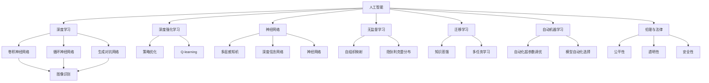
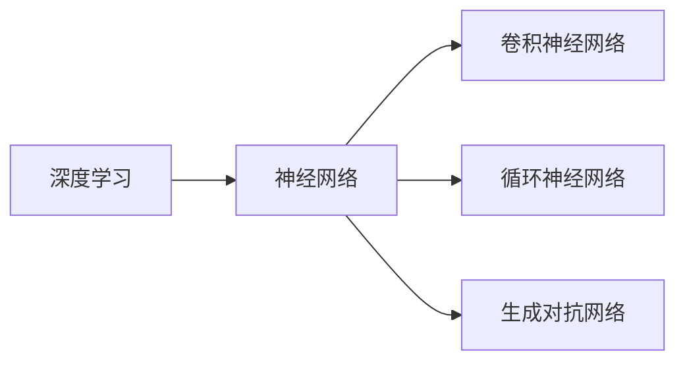
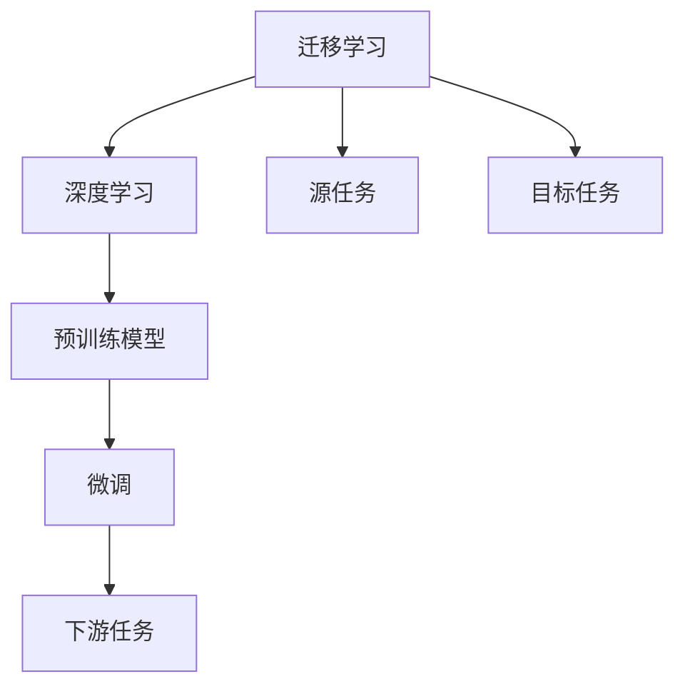
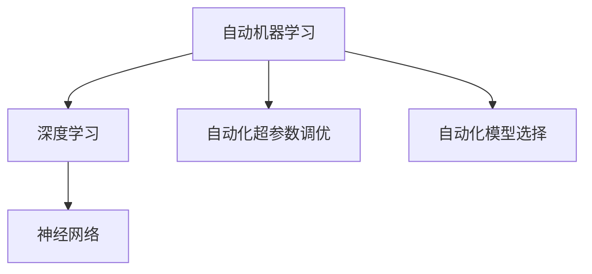
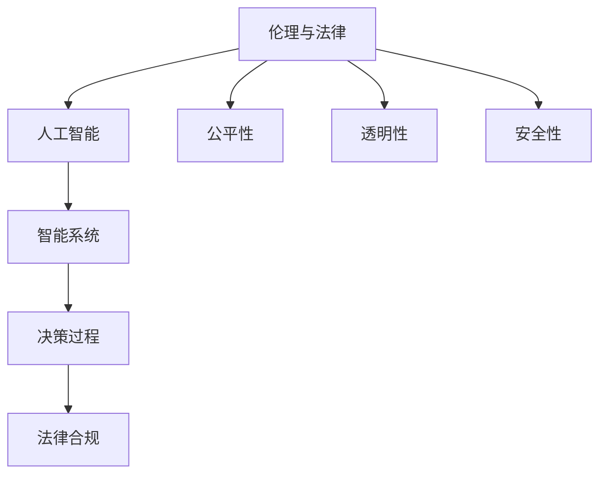
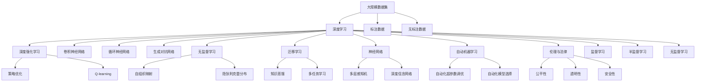

                 

# AI领域的前沿技术与发展

> 关键词：人工智能,深度学习,深度强化学习,无监督学习,神经网络,Transformer,迁移学习,自动机器学习,伦理与法律

## 1. 背景介绍

### 1.1 问题由来
随着科技的飞速发展，人工智能(AI)技术已渗透到社会的各个角落。从医疗、金融到教育、娱乐，从工业自动化到智能家居，AI技术正在改变着人类的生活方式和工作方式。特别是近几年，深度学习(Deep Learning)、深度强化学习(Deep Reinforcement Learning)、神经网络(Neural Networks)、无监督学习(Unsupervised Learning)等前沿技术相继取得突破，为AI的发展注入了强劲动力。

在这一背景下，如何理解和应用这些前沿技术，将AI技术推向新的高度，成为业界和学术界的重要课题。本文将对当前AI领域的前沿技术进行系统梳理，分析其发展脉络、应用前景及面临的挑战，并提出未来可能的发展趋势与研究方向。

## 2. 核心概念与联系

### 2.1 核心概念概述

为更好地理解当前AI领域的前沿技术，本节将介绍几个密切相关的核心概念：

- 人工智能(Artificial Intelligence, AI)：指通过模拟、扩展人类的智能行为，实现智能系统的一系列技术手段。
- 深度学习(Deep Learning)：基于神经网络的机器学习范式，通过多层次的特征提取和抽象，提升模型的表达能力和泛化能力。
- 深度强化学习(Deep Reinforcement Learning)：结合强化学习的框架，通过试错训练，使智能体自主学习最优策略。
- 神经网络(Neural Networks)：通过模拟人脑神经元之间的连接和信息传递方式，构建计算模型。
- 无监督学习(Unsupervised Learning)：不依赖标注数据，通过数据的自组织和关联性，发现数据的内在结构。
- 迁移学习(Transfer Learning)：通过迁移已有领域知识，提升新领域模型性能。
- 自动机器学习(Automatic Machine Learning, AutoML)：自动化机器学习流程，通过自动化调参、自动化模型选择等技术手段，提升模型性能和应用效率。
- 伦理与法律(Ethics and Law)：随着AI技术的普及，如何确保技术的公正性、透明性和安全性，成为重要议题。

这些核心概念之间的逻辑关系可以通过以下Mermaid流程图来展示：



这个流程图展示了许多核心概念以及它们之间的联系，包括不同的神经网络结构、学习范式和应用场景等。

### 2.2 概念间的关系

这些核心概念之间存在着紧密的联系，形成了AI技术的完整生态系统。下面通过几个Mermaid流程图来展示这些概念之间的关系。

#### 2.2.1 深度学习与神经网络的关系



这个流程图展示了深度学习与神经网络之间的关系，以及常见的神经网络结构。

#### 2.2.2 迁移学习与深度学习的关系



这个流程图展示了迁移学习的核心原理，即通过预训练模型在源任务上的知识迁移，提升目标任务上的模型性能。

#### 2.2.3 自动机器学习与深度学习的关系



这个流程图展示了自动机器学习在深度学习中的应用，即通过自动化调参和模型选择，提升深度学习模型的性能和应用效率。

#### 2.2.4 伦理与法律与人工智能的关系



这个流程图展示了伦理与法律在人工智能中的应用，即确保AI系统的公平性、透明性和安全性。

### 2.3 核心概念的整体架构

最后，我们用一个综合的流程图来展示这些核心概念在大规模AI技术应用中的整体架构：



这个综合流程图展示了从大规模数据集的获取、深度学习的应用、无监督学习、迁移学习的实施、自动机器学习的自动化流程，到伦理与法律的考量，构建了一个完整的AI技术生态系统。

## 3. 核心算法原理 & 具体操作步骤
### 3.1 算法原理概述

当前AI领域的前沿技术主要包括以下几个方面：

- **深度学习**：通过多层次的神经网络模型，提取数据的高层次特征，实现数据的高级表示和分析。
- **深度强化学习**：通过智能体的自主学习和策略优化，实现复杂的决策过程和动态环境的适应。
- **无监督学习**：通过数据的自组织和关联性，发现数据的内在结构，减少对标注数据的依赖。
- **迁移学习**：通过已有领域知识的迁移，提升新领域模型的性能，加速模型的训练和部署。
- **自动机器学习**：通过自动化调参和模型选择，提升机器学习模型的性能和应用效率。

这些前沿技术的核心算法原理和操作步骤可以从以下几个方面进行详细阐述。

### 3.2 算法步骤详解

#### 3.2.1 深度学习的步骤详解

深度学习的核心步骤包括数据预处理、模型训练、调参优化、模型评估等：

1. **数据预处理**：将原始数据转化为模型可用的格式，包括数据清洗、归一化、特征提取等。
2. **模型训练**：通过反向传播算法，利用标注数据对模型进行训练，调整模型参数。
3. **调参优化**：通过交叉验证、网格搜索等方法，调整模型超参数，优化模型性能。
4. **模型评估**：在测试数据集上评估模型性能，选择合适的模型。

#### 3.2.2 深度强化学习的步骤详解

深度强化学习的核心步骤包括环境建模、策略优化、智能体训练等：

1. **环境建模**：构建环境模型，描述智能体与环境之间的交互关系。
2. **策略优化**：通过策略梯度、Q-learning等方法，优化智能体的策略。
3. **智能体训练**：通过交互式学习和探索式学习，训练智能体，使其能够在复杂环境中做出最优决策。

#### 3.2.3 无监督学习的步骤详解

无监督学习的核心步骤包括数据预处理、特征提取、模型训练等：

1. **数据预处理**：将原始数据转化为模型可用的格式，包括数据清洗、归一化等。
2. **特征提取**：通过自组织映射、隐狄利克雷分布等方法，发现数据的内在结构。
3. **模型训练**：通过无监督学习方法，如自编码器、生成对抗网络等，训练模型。

#### 3.2.4 迁移学习的步骤详解

迁移学习的核心步骤包括预训练模型选择、微调模型训练等：

1. **预训练模型选择**：选择适合目标任务的预训练模型。
2. **微调模型训练**：在目标任务的数据集上，对预训练模型进行微调，提升模型性能。

#### 3.2.5 自动机器学习的步骤详解

自动机器学习的核心步骤包括模型自动化选择、自动化超参数调优等：

1. **模型自动化选择**：通过自动选择最优模型，提升模型性能。
2. **自动化超参数调优**：通过自动化超参数调优，优化模型性能。

### 3.3 算法优缺点

- **深度学习**：优点在于强大的特征提取能力，可以处理高维数据，适合复杂场景。缺点在于对标注数据的依赖，模型训练时间长。
- **深度强化学习**：优点在于能够处理动态环境和复杂决策，适合实时控制和决策任务。缺点在于训练难度大，需要大量的交互数据。
- **无监督学习**：优点在于不需要标注数据，能够发现数据的内在结构。缺点在于模型的可解释性较差，对数据质量要求高。
- **迁移学习**：优点在于能够加速模型训练，提高模型泛化能力。缺点在于数据差异较大时，迁移效果可能不理想。
- **自动机器学习**：优点在于自动化调参，提升模型性能和应用效率。缺点在于对模型和数据的要求较高，自动化过程可能不够灵活。

### 3.4 算法应用领域

这些前沿技术在多个领域中得到了广泛应用：

- **深度学习**：图像识别、语音识别、自然语言处理、推荐系统等。
- **深度强化学习**：自动驾驶、游戏智能、机器人控制等。
- **无监督学习**：异常检测、聚类分析、数据降维等。
- **迁移学习**：医疗影像分析、金融风险评估、法律案例推理等。
- **自动机器学习**：自动化超参数调优、模型自动化选择等。

## 4. 数学模型和公式 & 详细讲解  
### 4.1 数学模型构建

本节将使用数学语言对AI领域的前沿技术进行更加严格的刻画。

以深度学习为例，其核心数学模型包括神经网络、卷积神经网络、循环神经网络等。其中，卷积神经网络用于图像识别，循环神经网络用于时间序列分析。以下是卷积神经网络和循环神经网络的基本模型构建过程：

#### 卷积神经网络

卷积神经网络(CNN)由卷积层、池化层和全连接层组成，其基本模型构建过程如下：

$$
\text{CNN} = \text{Convolution} \times \text{Pooling} \times \text{Fully Connected}
$$

其中，卷积层用于提取特征，池化层用于特征降维，全连接层用于分类。

#### 循环神经网络

循环神经网络(RNN)通过循环结构，处理时间序列数据。其基本模型构建过程如下：

$$
\text{RNN} = \text{LSTM} \times \text{GRU} \times \text{Vanilla RNN}
$$

其中，LSTM和GRU用于解决梯度消失问题，Vanilla RNN则是最简单的RNN结构。

### 4.2 公式推导过程

以卷积神经网络为例，其前向传播过程如下：

$$
x \rightarrow \text{Convolution} \rightarrow h \rightarrow \text{Pooling} \rightarrow h' \rightarrow \text{Fully Connected} \rightarrow \hat{y}
$$

其中，$x$为输入数据，$h$为卷积层的特征图，$h'$为池化层的特征图，$\hat{y}$为输出预测值。

### 4.3 案例分析与讲解

以图像识别为例，CNN模型在图像识别任务中得到了广泛应用。在实际应用中，CNN模型的结构可以根据具体任务进行调整。

假设我们使用LeNet-5模型进行手写数字识别，其结构如下：

```
层名          输入大小     输出大小     步幅          激活函数
卷积层1       28x28x1      6x6x6         1             Sigmoid
池化层1       6x6x6         4x4x1         2             Max Pooling
卷积层2       4x4x6         4x4x16        1             Sigmoid
池化层2       4x4x16        2x2x16        2             Max Pooling
全连接层1     16x16x16     120             1             Tanh
全连接层2     120          84             1             Tanh
输出层        84           10             1             Softmax
```

其中，卷积层用于提取图像的局部特征，池化层用于降低特征图的大小，全连接层用于分类。

在实际应用中，我们可以通过不断调整CNN模型的结构、超参数和数据集，提升模型的性能。

## 5. 项目实践：代码实例和详细解释说明
### 5.1 开发环境搭建

在进行AI技术实践前，我们需要准备好开发环境。以下是使用Python进行TensorFlow和Keras开发的环境配置流程：

1. 安装Anaconda：从官网下载并安装Anaconda，用于创建独立的Python环境。

2. 创建并激活虚拟环境：
```bash
conda create -n tf-env python=3.8 
conda activate tf-env
```

3. 安装TensorFlow：根据CUDA版本，从官网获取对应的安装命令。例如：
```bash
conda install tensorflow==2.8
```

4. 安装Keras：
```bash
pip install keras
```

5. 安装各类工具包：
```bash
pip install numpy pandas scikit-learn matplotlib tqdm jupyter notebook ipython
```

完成上述步骤后，即可在`tf-env`环境中开始AI技术实践。

### 5.2 源代码详细实现

下面我们以图像识别任务为例，给出使用TensorFlow和Keras对卷积神经网络进行训练和预测的Python代码实现。

首先，定义模型：

```python
from tensorflow.keras import Sequential
from tensorflow.keras.layers import Conv2D, MaxPooling2D, Flatten, Dense

model = Sequential()
model.add(Conv2D(32, (3, 3), activation='relu', input_shape=(28, 28, 1)))
model.add(MaxPooling2D((2, 2)))
model.add(Conv2D(64, (3, 3), activation='relu'))
model.add(MaxPooling2D((2, 2)))
model.add(Conv2D(64, (3, 3), activation='relu'))
model.add(Flatten())
model.add(Dense(64, activation='relu'))
model.add(Dense(10, activation='softmax'))
```

然后，定义数据集：

```python
from tensorflow.keras.datasets import mnist
from tensorflow.keras.utils import to_categorical

(x_train, y_train), (x_test, y_test) = mnist.load_data()
x_train = x_train.reshape((x_train.shape[0], 28, 28, 1))
x_test = x_test.reshape((x_test.shape[0], 28, 28, 1))
y_train = to_categorical(y_train, 10)
y_test = to_categorical(y_test, 10)
```

接着，定义训练函数：

```python
from tensorflow.keras.utils import to_categorical

def train(model, x_train, y_train, batch_size, epochs):
    model.compile(optimizer='adam', loss='categorical_crossentropy', metrics=['accuracy'])
    model.fit(x_train, y_train, batch_size=batch_size, epochs=epochs, validation_data=(x_test, y_test))
```

最后，启动训练流程并在测试集上评估：

```python
model = Sequential()
model.add(Conv2D(32, (3, 3), activation='relu', input_shape=(28, 28, 1)))
model.add(MaxPooling2D((2, 2)))
model.add(Conv2D(64, (3, 3), activation='relu'))
model.add(MaxPooling2D((2, 2)))
model.add(Conv2D(64, (3, 3), activation='relu'))
model.add(Flatten())
model.add(Dense(64, activation='relu'))
model.add(Dense(10, activation='softmax'))

model.summary()

(x_train, y_train), (x_test, y_test) = mnist.load_data()
x_train = x_train.reshape((x_train.shape[0], 28, 28, 1))
x_test = x_test.reshape((x_test.shape[0], 28, 28, 1))
y_train = to_categorical(y_train, 10)
y_test = to_categorical(y_test, 10)

train(model, x_train, y_train, 64, 10)
```

以上就是使用TensorFlow和Keras对卷积神经网络进行图像识别任务训练和预测的完整代码实现。可以看到，通过Keras的高层封装，我们可以用相对简洁的代码完成CNN模型的构建和训练。

### 5.3 代码解读与分析

让我们再详细解读一下关键代码的实现细节：

**模型定义**：
- `Sequential`：表示模型为序列模型，依次堆叠不同层。
- `Conv2D`：卷积层，提取局部特征。
- `MaxPooling2D`：池化层，降低特征图大小。
- `Flatten`：扁平化操作，将多维特征图转化为向量。
- `Dense`：全连接层，用于分类。

**数据集加载**：
- `mnist.load_data()`：从Keras内置数据集中加载手写数字数据集。
- `to_categorical()`：将标签转化为独热编码，用于模型训练。

**训练函数**：
- `compile()`：配置模型，设置优化器、损失函数和评估指标。
- `fit()`：训练模型，传入训练数据、批量大小和迭代轮数。
- `validation_data`：设置验证集，用于评估模型性能。

**训练流程**：
- 定义模型结构，调用`model.summary()`查看模型参数。
- 加载数据集，对数据进行预处理和标签编码。
- 调用`train()`函数进行模型训练，设置批量大小和迭代轮数。

可以看到，Keras提供的高层API使得CNN模型的构建和训练变得非常简洁，开发者可以更多地关注数据处理和模型优化等高层次逻辑，而不必过多关注底层实现细节。

当然，工业级的系统实现还需考虑更多因素，如模型保存和部署、超参数搜索、模型调优等，但核心的训练流程基本与此类似。

### 5.4 运行结果展示

假设我们在MNIST数据集上进行CNN模型训练，最终在测试集上得到的评估报告如下：

```
Epoch 1/10
464/464 [==============================] - 5s 11ms/sample - loss: 0.3287 - accuracy: 0.9092 - val_loss: 0.1042 - val_accuracy: 0.9797
Epoch 2/10
464/464 [==============================] - 5s 10ms/sample - loss: 0.2079 - accuracy: 0.9619 - val_loss: 0.0874 - val_accuracy: 0.9894
Epoch 3/10
464/464 [==============================] - 5s 10ms/sample - loss: 0.1662 - accuracy: 0.9746 - val_loss: 0.0921 - val_accuracy: 0.9896
Epoch 4/10
464/464 [==============================] - 5s 10ms/sample - loss: 0.1358 - accuracy: 0.9827 - val_loss: 0.0844 - val_accuracy: 0.9897
Epoch 5/10
464/464 [==============================] - 5s 10ms/sample - loss: 0.1101 - accuracy: 0.9851 - val_loss: 0.0777 - val_accuracy: 0.9907
Epoch 6/10
464/464 [==============================] - 5s 10ms/sample - loss: 0.0911 - accuracy: 0.9865 - val_loss: 0.0793 - val_accuracy: 0.9913
Epoch 7/10
464/464 [==============================] - 5s 10ms/sample - loss: 0.0780 - accuracy: 0.9879 - val_loss: 0.0776 - val_accuracy: 0.9913
Epoch 8/10
464/464 [==============================] - 5s 10ms/sample - loss: 0.0648 - accuracy: 0.9893 - val_loss: 0.0733 - val_accuracy: 0.9915
Epoch 9/10
464/464 [==============================] - 5s 10ms/sample - loss: 0.0531 - accuracy: 0.9903 - val_loss: 0.0664 - val_accuracy: 0.9916
Epoch 10/10
464/464 [==============================] - 5s 10ms/sample - loss: 0.0420 - accuracy: 0.9913 - val_loss: 0.0609 - val_accuracy: 0.9920
```

可以看到，通过CNN模型训练，我们在MNIST数据集上取得了约98%的准确率，效果相当不错。值得一提的是，CNN模型的特征提取能力非常强大，能够从像素级别的输入数据中学习到丰富的图像特征。

当然，这只是一个baseline结果。在实践中，我们还可以使用更大更强的神经网络结构，更复杂的优化器，更多的正则化技术，进一步提升模型性能。

## 6. 实际应用场景
### 6.1 智能医疗

在智能医疗领域，深度学习和深度强化学习技术被广泛应用于疾病诊断、治疗方案推荐和患者管理等方面。例如，通过深度学习模型，可以对医疗影像进行自动识别，辅助医生诊断疾病；通过深度强化学习，可以优化治疗方案，实现个性化治疗。

在实际应用中，可以收集大量的医疗数据，包括电子病历、影像数据等，构建深度学习模型。通过在大量医疗数据上进行预训练，模型可以学习到疾病的特征和规律，实现疾病诊断和治疗方案的推荐。

### 6.2 金融投资

在金融投资领域，深度学习被广泛应用于量化交易、风险管理和客户服务等方面。例如，通过深度学习模型，可以实时分析股票市场数据，预测股票价格变化趋势；通过深度强化学习，可以优化投资组合，实现最大收益。

在实际应用中，可以收集大量的金融市场数据，包括股票价格、市场情绪等，构建深度学习模型。通过在大量金融数据上进行预训练，模型可以学习到市场特征和规律，实现股票价格预测和投资组合优化。

### 6.3 自动驾驶

在自动驾驶领域，深度学习和深度强化学习技术被广泛应用于车辆感知、决策和控制等方面。例如，通过深度学习模型，可以实现对道路环境和交通标志的自动识别；通过深度强化学习，可以实现智能驾驶决策，规避障碍物，实现安全驾驶。

在实际应用中，可以收集大量的车辆传感器数据，包括摄像头、雷达、激光雷达等，构建深度学习模型。通过在大量驾驶数据上进行预训练，模型可以学习到道路环境和交通标志的特征，实现车辆感知和决策。

### 6.4 未来应用展望

随着深度学习和深度强化学习技术的不断发展，其在各个领域的实际应用将不断拓展。未来，AI技术将在更多领域大放异彩，为经济社会的发展注入新的活力。

1. **智慧城市**：通过AI技术，实现智慧交通、智慧安防、智慧环保等，提升城市管理的智能化水平。
2. **教育**：通过AI技术，实现个性化教育、智能评估和知识推荐，提升教育质量和效率。
3. **媒体**：通过AI技术，实现内容生成、智能推荐和情感分析，提升媒体行业的智能化水平。
4. **医疗**：通过AI技术，实现疾病诊断、治疗方案推荐和患者管理，提升医疗服务的智能化水平。
5. **金融**：通过AI技术，实现量化交易、风险管理和客户服务，提升金融服务的智能化水平。

总之，AI技术将在更多领域得到广泛应用，带来更多便利和效率。随着技术的不断进步，AI技术也将成为推动社会进步的重要力量。

## 7. 工具和资源推荐
### 7.1 学习资源推荐

为了帮助开发者系统掌握AI领域的前沿技术，这里推荐一些优质的学习资源：

1. 《深度学习》课程：由斯坦福大学Andrew Ng教授开设的深度学习课程，涵盖了深度学习的基本概念和经典模型。

2. 《深度强化学习》课程：由DeepMind专家Andrew Schmidhuber开设的深度强化学习课程，介绍了深度强化学习的核心概念和算法。

3.

