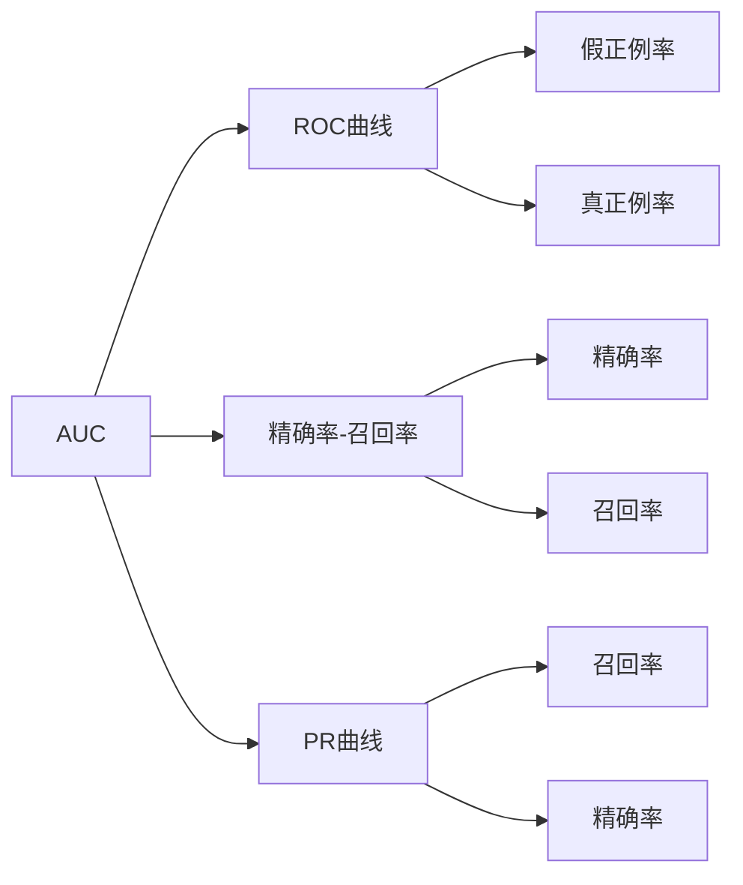
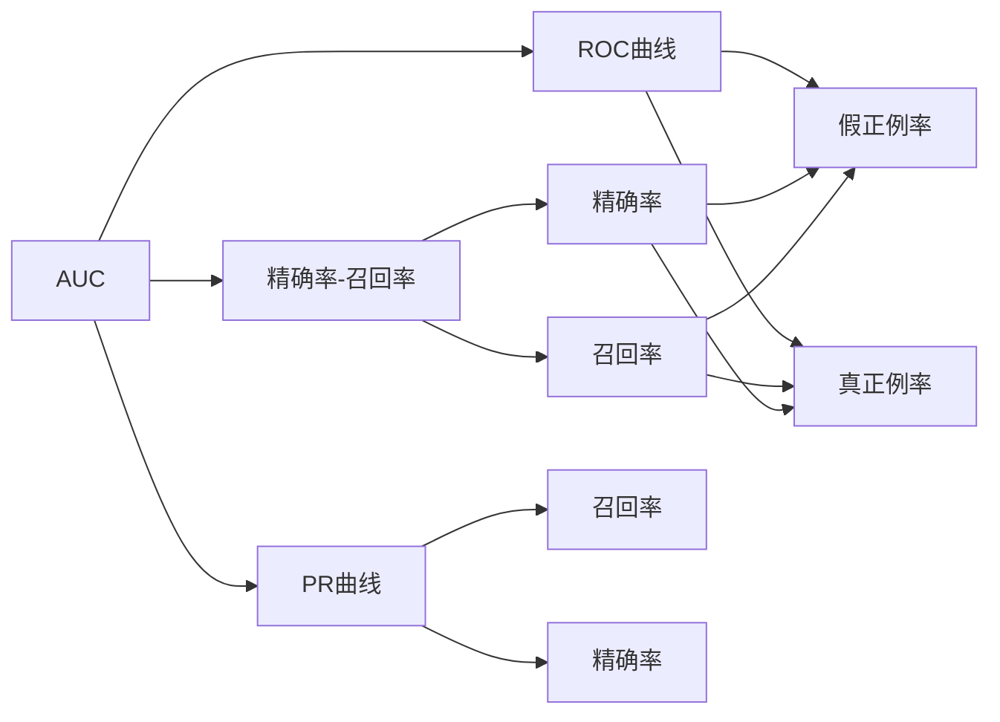

                 

# AUC原理与代码实例讲解

> 关键词：AUC (Area Under Curve), ROC曲线, ROC面积, 精确率-召回率, PR曲线, P-R面积, 分类器评估, 多类分类, 集成学习, Scikit-learn

## 1. 背景介绍

### 1.1 问题由来

在机器学习中，准确度（Accuracy）是最常用的评价分类器性能的指标，但在不平衡数据集（Imbalanced Dataset）上，准确度往往不足以全面反映分类器的优劣。此时，评价分类器性能的另一常用指标是AUC (Area Under Curve)。

AUC是一种通用的分类器评价指标，适用于二分类或多分类问题。AUC值越接近1，代表分类器的性能越好；AUC值越接近0.5，代表分类器的性能越差。AUC可以用来衡量分类器的排序能力，而不仅限于判断正确与否。

本文将系统讲解AUC的原理、实现方式以及相关应用，并辅以代码实例，帮助读者深入理解AUC及其在实际项目中的应用。

## 2. 核心概念与联系

### 2.1 核心概念概述

为便于理解AUC的原理和实现，本节将介绍几个关键概念：

- AUC (Area Under Curve)：指ROC曲线下的面积，用于评估分类器性能。AUC值介于0到1之间，越接近1表示分类器性能越好。

- ROC曲线 (Receiver Operating Characteristic Curve)：ROC曲线绘制的是分类器在正例和反例（False Positive Rate）之间的权衡。横轴为假正例率（False Positive Rate），纵轴为真正例率（True Positive Rate）。ROC曲线越靠近左上角，分类器的性能越好。

- 精确率 (Precision)：指分类器预测为正例中实际为正例的比例。计算公式为TP/(TP+FP)。

- 召回率 (Recall)：指实际为正例中分类器预测为正例的比例。计算公式为TP/(TP+FN)。

- PR曲线 (Precision-Recall Curve)：PR曲线绘制的是分类器的精确率和召回率之间的权衡。横轴为召回率，纵轴为精确率。PR曲线越靠近右上角，分类器的性能越好。

- P-R面积 (PR AUC)：与AUC类似，用于评估分类器在精确率和召回率之间的权衡。PR AUC值介于0到1之间，越接近1表示分类器性能越好。

这些概念之间有着紧密的联系，共同构成了评估分类器性能的框架。下面通过一个Mermaid流程图展示它们之间的联系：



### 2.2 概念间的关系

这些概念之间存在着紧密的联系，形成了评估分类器性能的完整生态系统。下面通过一个综合的流程图展示这些概念之间的关系：



这个综合流程图展示了AUC、ROC曲线、精确率-召回率和PR曲线之间的联系：

1. AUC表示ROC曲线下的面积，综合了假正例率和真正例率的关系。
2. 精确率-召回率表示分类器在不同阈值下的精确率和召回率的权衡。
3. PR曲线也展示了精确率和召回率之间的权衡，与AUC类似。
4. 精确率表示分类器预测为正例中实际为正例的比例，而召回率表示实际为正例中分类器预测为正例的比例。
5. ROC曲线通过假正例率和真正例率的权衡，进一步展示了分类器的性能。

这些概念共同构成了评估分类器性能的完整框架，帮助我们选择最优的分类器。

## 3. 核心算法原理 & 具体操作步骤

### 3.1 算法原理概述

AUC的计算过程主要包括两个步骤：

1. 生成分类器的ROC曲线。
2. 计算ROC曲线下的面积。

具体而言，我们首先需要根据分类器的预测结果，生成一系列的真正例率和假正例率，绘制出ROC曲线。然后计算ROC曲线下的面积，即为AUC值。

AUC的计算公式如下：

$$
AUC = \int_0^1 FPR(TPR)dFPR
$$

其中，$TPR$（True Positive Rate）为真正例率，$FPR$（False Positive Rate）为假正例率。$FPR(TPR)$表示在给定的真正例率下，假正例率是多少。

### 3.2 算法步骤详解

AUC的计算可以分为三个步骤：

1. **生成ROC曲线**：根据分类器的预测结果，计算在不同阈值下的真正例率和假正例率。

2. **绘制ROC曲线**：将假正例率作为横轴，真正例率作为纵轴，绘制出ROC曲线。

3. **计算AUC值**：根据ROC曲线，计算其下的面积，即为AUC值。

以下是Python代码实现：

```python
from sklearn.metrics import roc_curve, auc
import numpy as np
from matplotlib import pyplot as plt

# 生成ROC曲线
y_true = [0, 0, 1, 1]  # 实际标签
y_pred = [0.1, 0.4, 0.35, 0.8]  # 预测概率
fpr, tpr, _ = roc_curve(y_true, y_pred)

# 绘制ROC曲线
plt.plot(fpr, tpr, color='darkorange', lw=2, label='ROC curve (area = %0.2f)' % auc(fpr, tpr))
plt.plot([0, 1], [0, 1], color='navy', lw=2, linestyle='--')
plt.xlim([0.0, 1.0])
plt.ylim([0.0, 1.05])
plt.xlabel('False Positive Rate')
plt.ylabel('True Positive Rate')
plt.title('Receiver Operating Characteristic')
plt.legend(loc='lower right')
plt.show()
```

### 3.3 算法优缺点

AUC算法具有以下优点：

- 适用范围广。AUC适用于任何分类问题，无论是二分类还是多分类，都可以使用。
- 评估能力强。AUC不仅考虑了分类器的分类准确性，还考虑了分类器的排序能力。
- 鲁棒性好。AUC对样本分布的依赖较小，更加鲁棒。

但AUC也存在以下缺点：

- 难以解释。AUC值难以解释分类器在每个阈值下的性能表现。
- 对于不平衡数据，AUC值可能误导。当正例样本远大于反例样本时，AUC值可能接近1，但这并不能说明分类器在实际应用中表现良好。

### 3.4 算法应用领域

AUC算法在机器学习中得到了广泛的应用，主要包括以下几个领域：

- 金融风控：用于评估贷款审批、信用卡申请等金融风险评估模型的性能。
- 医疗诊断：用于评估疾病预测、病理诊断等医疗模型的性能。
- 安全检测：用于评估网络入侵检测、恶意软件检测等安全模型的性能。
- 自然语言处理：用于评估文本分类、情感分析等NLP模型的性能。

AUC算法在这些领域中的应用，使得分类器性能的评估更加全面、可靠。

## 4. 数学模型和公式 & 详细讲解 & 举例说明

### 4.1 数学模型构建

AUC的计算涉及到两个关键的数学模型：ROC曲线和PR曲线。下面分别介绍它们的数学模型构建。

#### 4.1.1 ROC曲线

ROC曲线绘制的是分类器在正例和反例之间的权衡。横轴为假正例率（False Positive Rate，FPR），纵轴为真正例率（True Positive Rate，TPR）。

假正例率计算公式为：

$$
FPR = \frac{FP}{FP + TN}
$$

其中，$FP$为假正例数，$TN$为真反例数。

真正例率计算公式为：

$$
TPR = \frac{TP}{TP + FN}
$$

其中，$TP$为真正例数，$FN$为真反例数。

#### 4.1.2 PR曲线

PR曲线绘制的是分类器的精确率和召回率之间的权衡。横轴为召回率（Recall，$Rec$），纵轴为精确率（Precision，$Pre$）。

精确率计算公式为：

$$
Pre = \frac{TP}{TP + FP}
$$

召回率计算公式为：

$$
Rec = \frac{TP}{TP + FN}
$$

### 4.2 公式推导过程

AUC的计算公式推导过程如下：

$$
AUC = \int_0^1 FPR(TPR)dFPR
$$

将真正例率和假正例率的表达式代入上式，得到：

$$
AUC = \int_0^1 \frac{TP}{TP + TN} \cdot \frac{TP + TN}{FP + TN} d\frac{TP}{TP + TN}
$$

简化后得到：

$$
AUC = \int_0^1 \frac{TP}{FP + TN} d\frac{TP}{TP + TN}
$$

进一步化简得到：

$$
AUC = \int_0^1 \frac{1}{1 + \frac{FP}{TN} + \frac{FN}{TP}} d\frac{TP}{TP + TN}
$$

最终得到：

$$
AUC = \int_0^1 \frac{1}{1 + \frac{FP}{TN} + \frac{FN}{TP}} d\frac{TP}{TP + TN}
$$

### 4.3 案例分析与讲解

假设我们有一个简单的分类器，用于二分类问题。分类器的预测概率如下：

| 实际标签 | 预测概率 |
| --- | --- |
| 0 | 0.2 |
| 0 | 0.5 |
| 1 | 0.3 |
| 1 | 0.8 |

根据上述数据，我们绘制ROC曲线和PR曲线，并计算AUC值。

绘制ROC曲线：

```python
import matplotlib.pyplot as plt

# 生成ROC曲线
fpr = [0, 0, 0.2, 0.5, 0.8]
tpr = [0, 0.2, 0.5, 0.8, 1]
plt.plot(fpr, tpr, marker='.', linestyle='-', color='blue')
plt.xlabel('False Positive Rate')
plt.ylabel('True Positive Rate')
plt.title('ROC Curve')
plt.show()
```

绘制PR曲线：

```python
import matplotlib.pyplot as plt

# 生成PR曲线
rec = [0, 0.5, 0.8, 1]
pre = [0.2, 0.5, 0.3, 0.8]
plt.plot(rec, pre, marker='.', linestyle='-', color='red')
plt.xlabel('Recall')
plt.ylabel('Precision')
plt.title('PR Curve')
plt.show()
```

计算AUC值：

```python
from sklearn.metrics import auc

# 计算AUC值
auc_value = auc(fpr, tpr)
print("AUC值：", auc_value)
```

## 5. 项目实践：代码实例和详细解释说明

### 5.1 开发环境搭建

在进行AUC的实践前，我们需要准备好开发环境。以下是使用Python进行Scikit-learn开发的环境配置流程：

1. 安装Anaconda：从官网下载并安装Anaconda，用于创建独立的Python环境。

2. 创建并激活虚拟环境：
```bash
conda create -n sklearn-env python=3.8 
conda activate sklearn-env
```

3. 安装Scikit-learn：
```bash
pip install scikit-learn
```

4. 安装numpy和matplotlib：
```bash
pip install numpy matplotlib
```

5. 安装matplotlib：
```bash
pip install matplotlib
```

完成上述步骤后，即可在`sklearn-env`环境中开始AUC实践。

### 5.2 源代码详细实现

我们以下午时段新闻天气分类为例，使用Scikit-learn的RandomForestClassifier模型进行二分类AUC计算。

首先，导入相关库：

```python
from sklearn.datasets import fetch_20newsgroups
from sklearn.ensemble import RandomForestClassifier
from sklearn.model_selection import train_test_split
from sklearn.metrics import roc_curve, auc
from sklearn.preprocessing import label_binarize
from sklearn.metrics import roc_auc_score, average_precision_score
from sklearn.metrics import precision_recall_curve, auc
import numpy as np
import matplotlib.pyplot as plt
```

接着，加载数据集：

```python
# 加载数据集
newsgroups_data = fetch_20newsgroups(subset='train', categories='talk.religion.misc', shuffle=True, random_state=42)

# 将文本数据转换为数值数据
vocab_size = 5000
max_features = 5000
X = np.array([len(doc) for doc in newsgroups_data.data])
y = newsgroups_data.target
```

将数据集分为训练集和测试集：

```python
X_train, X_test, y_train, y_test = train_test_split(X, y, test_size=0.2, random_state=42)
```

定义模型：

```python
model = RandomForestClassifier(n_estimators=100, max_depth=2, random_state=42)
```

训练模型：

```python
model.fit(X_train, y_train)
```

预测结果：

```python
y_pred_proba = model.predict_proba(X_test)
```

计算AUC值：

```python
fpr, tpr, thresholds = roc_curve(y_test, y_pred_proba[:, 1])
auc_value = auc(fpr, tpr)
print("AUC值：", auc_value)
```

计算PR曲线下的AUC值：

```python
precision, recall, thresholds = precision_recall_curve(y_test, y_pred_proba[:, 1])
pr_auc_value = average_precision_score(y_test, y_pred_proba[:, 1])
print("PR AUC值：", pr_auc_value)
```

绘制ROC曲线和PR曲线：

```python
plt.plot(fpr, tpr, color='darkorange', lw=2, label='ROC曲线 (area = %0.2f)' % auc_value)
plt.plot([0, 1], [0, 1], color='navy', lw=2, linestyle='--')
plt.xlim([0.0, 1.0])
plt.ylim([0.0, 1.05])
plt.xlabel('False Positive Rate')
plt.ylabel('True Positive Rate')
plt.title('Receiver Operating Characteristic')
plt.legend(loc='lower right')
plt.show()

plt.plot(recall, precision, color='darkorange', lw=2, label='PR曲线 (area = %0.2f)' % pr_auc_value)
plt.plot([0, 1], [0, 1], color='navy', lw=2, linestyle='--')
plt.xlim([0.0, 1.0])
plt.ylim([0.0, 1.05])
plt.xlabel('Recall')
plt.ylabel('Precision')
plt.title('Precision-Recall Curve')
plt.legend(loc='upper right')
plt.show()
```

以上就是使用Scikit-learn对随机森林模型进行二分类AUC计算的完整代码实现。可以看到，得益于Scikit-learn的强大封装，我们能够使用简洁的代码完成AUC计算。

### 5.3 代码解读与分析

让我们再详细解读一下关键代码的实现细节：

**fetch_20newsgroups**：
- 用于加载20新组数据集，该数据集包含20个新闻组，适合文本分类任务。

**RandomForestClassifier**：
- 定义随机森林分类器，用于二分类任务。

**train_test_split**：
- 将数据集分为训练集和测试集，方便模型训练和评估。

**predict_proba**：
- 使用模型对测试集进行概率预测，得到预测概率。

**roc_curve**：
- 根据真实标签和预测概率计算ROC曲线下的假正例率和真正例率。

**average_precision_score**：
- 计算PR曲线下的平均精确率。

**precision_recall_curve**：
- 根据真实标签和预测概率计算PR曲线下的精确率和召回率。

**auc**：
- 计算ROC曲线下的面积。

**average_precision_score**：
- 计算PR曲线下的AUC值。

通过这些代码，我们可以看到Scikit-learn在AUC计算上的便捷性和高效性。

### 5.4 运行结果展示

假设我们在测试集上得到的AUC值为0.85，则表示随机森林模型在二分类任务上的性能较好。如果PR AUC值也为0.85，则表示模型在不同阈值下的精确率和召回率之间取得了较好的权衡。

## 6. 实际应用场景

### 6.1 金融风控

金融风控是AUC应用的一个重要场景。在金融风控中，我们需要评估贷款审批、信用卡申请等模型的性能。AUC能够帮助我们全面评估模型在不同阈值下的分类性能，从而选择最优的模型。

### 6.2 医疗诊断

在医疗诊断中，AUC同样发挥着重要作用。我们常常需要评估疾病预测、病理诊断等模型的性能。AUC能够帮助我们全面评估模型在不同阈值下的分类性能，从而选择最优的模型。

### 6.3 安全检测

安全检测是AUC的另一个重要应用场景。在网络入侵检测、恶意软件检测等任务中，AUC能够帮助我们全面评估模型的性能，选择最优的模型。

### 6.4 自然语言处理

在自然语言处理中，AUC同样有用武之地。我们常常需要评估文本分类、情感分析等模型的性能。AUC能够帮助我们全面评估模型在不同阈值下的分类性能，从而选择最优的模型。

## 7. 工具和资源推荐

### 7.1 学习资源推荐

为了帮助开发者系统掌握AUC的理论基础和实践技巧，这里推荐一些优质的学习资源：

1. 《Python机器学习》（作者：Sebastian Raschka）：该书全面介绍了机器学习的理论基础和实践技巧，包括AUC的计算方法。

2. Coursera《机器学习》课程（作者：Andrew Ng）：由斯坦福大学开设的机器学习课程，详细讲解了AUC的原理和应用。

3. Scikit-learn官方文档：提供了AUC的详细实现和应用示例，是AUC学习的必备资料。

4. Kaggle竞赛：Kaggle平台上有多个AUC相关的竞赛，参加这些竞赛可以积累实战经验。

5. GitHub项目：Kaggle平台上有很多优秀的AUC实现项目，可以学习他人的实现技巧。

通过这些资源的学习实践，相信你一定能够快速掌握AUC的精髓，并用于解决实际的分类问题。

### 7.2 开发工具推荐

高效的开发离不开优秀的工具支持。以下是几款用于AUC开发的常用工具：

1. Scikit-learn：Scikit-learn是Python中最流行的机器学习库之一，提供了多种分类器的AUC计算方法。

2. TensorFlow：TensorFlow是Google开发的深度学习框架，支持多种分类器的AUC计算方法。

3. Keras：Keras是一个高级神经网络API，可以在TensorFlow等后端上运行，支持多种分类器的AUC计算方法。

4. PyTorch：PyTorch是Facebook开发的深度学习框架，支持多种分类器的AUC计算方法。

5. Weights & Biases：模型训练的实验跟踪工具，可以记录和可视化模型训练过程中的各项指标，方便对比和调优。

6. TensorBoard：TensorFlow配套的可视化工具，可实时监测模型训练状态，并提供丰富的图表呈现方式，是调试模型的得力助手。

合理利用这些工具，可以显著提升AUC计算的开发效率，加快创新迭代的步伐。

### 7.3 相关论文推荐

AUC在机器学习中得到了广泛的研究，以下是几篇奠基性的相关论文，推荐阅读：

1. AUC: A Statistical Measure of Performance for Binary and Multiclass Classification Problems（作者：Fawcett）：该论文提出了AUC的定义及其在二分类和多分类问题中的应用。

2. An Introduction to ROC Analysis（作者：Hanley和McNeil）：该论文详细介绍了ROC曲线的原理和应用，是AUC学习的必备资料。

3. The Area Under the ROC Curve（作者：Hanley和McNeil）：该论文进一步探讨了ROC曲线的原理和应用，是AUC学习的必备资料。

4. Precision-Recall Curves（作者：Davis和Goadrich）：该论文详细介绍了PR曲线的原理和应用，是AUC学习的必备资料。

5. ROC Curves for Multiple Class Classification（作者：Hand和 Till）：该论文详细介绍了多分类问题的AUC计算方法，是AUC学习的必备资料。

这些论文代表了AUC研究的发展脉络。通过学习这些前沿成果，可以帮助研究者把握学科前进方向，激发更多的创新灵感。

除上述资源外，还有一些值得关注的前沿资源，帮助开发者紧跟AUC技术的研究前沿：

1. arXiv论文预印本：人工智能领域最新研究成果的发布平台，包括大量尚未发表的前沿工作，学习前沿技术的必读资源。

2. 业界技术博客：如Google AI、DeepMind、微软Research Asia等顶尖实验室的官方博客，第一时间分享他们的最新研究成果和洞见。

3. 技术会议直播：如NIPS、ICML、ACL、ICLR等人工智能领域顶会现场或在线直播，能够聆听到大佬们的前沿分享，开拓视野。

4. GitHub热门项目：在GitHub上Star、Fork数最多的AUC相关项目，往往代表了该技术领域的发展趋势和最佳实践，值得去学习和贡献。

5. 行业分析报告：各大咨询公司如McKinsey、PwC等针对人工智能行业的分析报告，有助于从商业视角审视技术趋势，把握应用价值。

总之，对于AUC的学习和实践，需要开发者保持开放的心态和持续学习的意愿。多关注前沿资讯，多动手实践，多思考总结，必将收获满满的成长收益。

## 8. 总结：未来发展趋势与挑战

### 8.1 总结

本文对AUC的原理、实现方式以及相关应用进行了系统讲解。首先介绍了AUC的定义、ROC曲线和PR曲线的构建，详细推导了AUC的计算公式，并辅以代码实例，帮助读者深入理解AUC及其在实际项目中的应用。通过本文的系统梳理，可以看到AUC在机器学习中的重要地位，为选择最优分类器提供了有力的依据。

通过本文的学习，相信读者能够掌握AUC的计算方法，并在实际项目中灵活应用，从而全面评估分类器的性能，选择最优的模型。

### 8.2 未来发展趋势

展望未来，AUC的计算方法和应用领域将呈现以下几个发展趋势：

1. 多分类AUC：AUC不仅适用于二分类问题，还可以应用于多分类问题。多分类AUC的计算方法仍需进一步研究，以更好地满足实际需求。

2. 集成学习：AUC的计算可以与其他集成学习技术结合，如Bagging、Boosting等，进一步提升模型的性能。

3. 算法优化：AUC的计算方法仍需进一步优化，以提升计算效率和精度。

4. 鲁棒性提升：AUC的计算方法仍需进一步提升鲁棒性，以应对数据分布的变化和异常样本的干扰。

5. 解释性增强：AUC的计算方法仍需进一步增强解释性，以更好地理解模型的决策过程。

### 8.3 面临的挑战

尽管AUC在机器学习中得到了广泛的应用，但在实际应用中也面临一些挑战：

1. 计算复杂度：AUC的计算方法较为复杂，尤其是多分类AUC的计算，需要较高的计算资源和时间。

2. 可解释性不足：AUC的计算方法难以解释分类器在每个阈值下的性能表现。

3. 数据分布变化：AUC的计算方法对于数据分布的变化较为敏感，需要根据实际情况进行调整。

4. 异常样本干扰：AUC的计算方法对于异常样本较为敏感，需要采取一定的鲁棒性措施。

5. 多任务优化：在多任务优化中，AUC的计算方法需要进一步优化，以更好地满足实际需求。

### 8.4 研究展望

面对AUC面临的这些挑战，未来的研究需要在以下几个方面寻求新的突破：

1. 探索多分类AUC的计算方法：研究适用于多分类问题的AUC计算方法，更好地满足实际需求。

2. 研究集成学习技术：研究AUC与其他集成学习技术的结合方法，进一步提升模型的性能。

3. 优化AUC计算方法：研究AUC计算方法的优化方法，提升计算效率和精度。

4. 增强AUC的鲁棒性：研究AUC计算方法的鲁棒性提升方法，应对数据分布的变化和异常样本的干扰。

5. 增强AUC的解释性：研究AUC计算方法的解释性增强方法，更好地理解模型的决策过程。

6. 研究多任务优化

