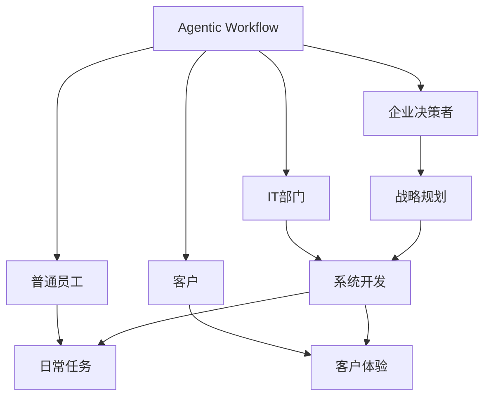

                 

# Agentic Workflow的用户群体分析

> 关键词：Agentic Workflow, 用户群体, 应用程序分析, 用户体验研究, 行为数据

## 1. 背景介绍

在当今数字化和自动化迅猛发展的背景下，人工智能（AI）技术已经成为推动生产力提升和业务创新的关键因素。Agentic Workflow作为AI技术的典型应用，旨在通过自动化执行和管理工作流程，优化资源分配，提高企业运营效率。然而，这种先进的自动化技术能否真正实现其价值，并成功吸引和满足用户需求，却需要深入的用户群体分析来支撑。本文将从用户群体的维度，全面剖析Agentic Workflow的应用场景、用户特征和潜在需求，以期为开发者和决策者提供有价值的参考和指导。

## 2. 核心概念与联系

### 2.1 核心概念概述

Agentic Workflow（简称AWF）是一个集成了人工智能、自动化流程管理、自然语言处理等多项技术的应用框架，旨在通过自动化执行和管理工作流程，提高企业运营效率和员工生产力。用户群体是指使用Agentic Workflow软件的不同群体，包括企业决策者、IT部门、普通员工和客户等。这些群体在应用AWF时，有着不同的角色和需求，因此分析用户群体的特点和需求是实现AWF优化和持续改进的基础。

### 2.2 核心概念之间的关系

Agentic Workflow与用户群体之间的关系可以通过以下Mermaid流程图来展示：



这个流程图展示了AWF与用户群体之间的多对多关系：

1. 企业决策者通过AWF进行战略规划，确保业务的整体布局和目标一致性。
2. IT部门使用AWF进行系统开发和部署，支持业务流程的自动化。
3. 普通员工使用AWF完成日常任务，提高工作效率和质量。
4. 客户通过AWF提升体验，享受更高质量的服务。

同时，不同用户群体之间的互动也显著影响AWF的效果和用户体验。例如，企业决策者对系统目标的设定直接影响IT部门的开发方向，普通员工的反馈又会影响客户体验。因此，充分理解用户群体的特点和需求，对于AWF的成功应用至关重要。

## 3. 核心算法原理 & 具体操作步骤

### 3.1 算法原理概述

Agentic Workflow的用户群体分析主要基于用户行为数据和反馈数据，通过机器学习、数据挖掘等技术，识别出不同用户群体的行为模式和需求特征。具体来说，主要包括以下几个步骤：

1. 数据采集：收集企业内外的用户行为数据，包括日志数据、操作记录、反馈评价等。
2. 数据清洗：对采集到的数据进行去重、去噪、标准化等处理，确保数据质量。
3. 数据分析：使用分类、聚类、关联规则等算法，对用户行为数据进行建模和分析。
4. 需求预测：通过预测算法，识别出不同用户群体的需求和偏好。
5. 策略优化：根据预测结果，调整AWF的功能和界面设计，优化用户体验。

### 3.2 算法步骤详解

**Step 1: 数据采集**

首先需要确定需要采集的数据源，包括但不限于：

- 系统日志：记录用户登录、操作等行为数据。
- 操作记录：详细记录用户对AWF的具体操作行为。
- 反馈评价：收集用户对AWF的满意度评价和改进建议。
- 用户行为：记录用户在不同功能模块上的操作轨迹。

**Step 2: 数据清洗**

数据清洗过程通常包括以下步骤：

- 数据去重：识别和去除重复数据，避免重复计算和分析。
- 数据去噪：过滤掉异常数据和噪音数据，确保数据的准确性和可靠性。
- 数据标准化：将不同来源的数据格式和单位统一标准化，便于后续分析。

**Step 3: 数据分析**

数据分析可以通过以下算法实现：

- 分类算法：将用户分为不同的类别，如普通员工、客户、管理者等。
- 聚类算法：对用户行为进行分组，识别出具有相似行为特征的用户群。
- 关联规则算法：分析用户在不同操作路径上的关联性，挖掘出潜在的行为模式。

**Step 4: 需求预测**

需求预测可以通过以下算法实现：

- 回归分析：预测用户在不同行为下的需求变化趋势。
- 时间序列分析：预测用户在不同时间段的活跃度和需求变化。
- 协同过滤：预测用户对未使用功能的需求。

**Step 5: 策略优化**

策略优化包括但不限于：

- 界面设计优化：根据用户需求优化AWF的界面布局和功能展示。
- 功能调整：根据用户行为模式，优化AWF的功能和流程设计。
- 用户体验提升：通过数据分析和用户反馈，不断改进AWF的用户体验。

### 3.3 算法优缺点

Agentic Workflow的用户群体分析算法具有以下优点：

1. 数据驱动：通过机器学习和数据分析，可以更客观、准确地识别出不同用户群体的行为模式和需求。
2. 动态调整：根据用户需求的变化，可以动态优化AWF的功能和界面设计，提升用户体验。
3. 系统性分析：通过多维度的数据分析，可以全面了解用户群体的特点和需求，提供更有针对性的解决方案。

同时，该算法也存在以下局限：

1. 数据隐私问题：用户行为数据的采集和使用可能会涉及隐私问题，需要严格遵守数据保护法规。
2. 数据质量要求高：数据采集和清洗需要投入大量资源，数据质量直接影响分析结果的准确性。
3. 模型复杂性：不同算法的选择和应用，增加了模型构建和维护的复杂度。

### 3.4 算法应用领域

Agentic Workflow的用户群体分析算法可以应用于多个领域，包括但不限于：

- 企业运营管理：通过分析企业内外的用户行为数据，优化企业的业务流程和资源配置。
- 客户服务优化：通过分析客户行为数据，提升客户满意度和忠诚度。
- 员工绩效提升：通过分析员工行为数据，识别出高绩效员工的特点和行为模式，进行人员优化。
- 产品设计与开发：通过分析用户需求和行为数据，指导产品功能和界面设计，提升产品竞争力。

## 4. 数学模型和公式 & 详细讲解 & 举例说明

### 4.1 数学模型构建

Agentic Workflow的用户群体分析主要基于用户行为数据，构建以下数学模型：

1. 分类模型：将用户分为不同的类别，如普通员工、客户、管理者等。
2. 聚类模型：对用户行为进行分组，识别出具有相似行为特征的用户群。
3. 关联规则模型：分析用户在不同操作路径上的关联性，挖掘出潜在的行为模式。

### 4.2 公式推导过程

以分类模型为例，假设用户集合为 $U$，其中每个用户 $u_i \in U$ 的属性特征为 $x_i=(x_{i1}, x_{i2}, ..., x_{in})$，其中 $x_{ij}$ 表示用户 $u_i$ 在第 $j$ 个特征上的取值。分类算法的目标是将用户 $u_i$ 分配到 $k$ 个类别中，令 $y_i=(y_{i1}, y_{i2}, ..., y_{ik})$ 表示 $u_i$ 所属的类别标签。分类问题可以表示为以下目标函数：

$$
\min_{\theta} \frac{1}{N} \sum_{i=1}^N \ell(\hat{y_i}, y_i)
$$

其中 $\ell$ 表示损失函数，$\hat{y_i}$ 表示模型预测的类别标签。常用的损失函数包括交叉熵损失和感知机损失。求解上述优化问题的常用算法包括支持向量机（SVM）、随机森林（Random Forest）、梯度提升树（Gradient Boosting Tree）等。

### 4.3 案例分析与讲解

以一个电子商务平台为例，假设平台需要分析用户的行为数据，识别出不同用户群体的特点和需求，以优化用户体验和提升销售额。具体步骤如下：

1. 数据采集：从平台后台系统中采集用户的操作记录、购买记录和反馈评价数据。
2. 数据清洗：对采集到的数据进行去重、去噪、标准化处理，确保数据质量。
3. 数据分析：使用分类算法将用户分为高价值用户、中价值用户和低价值用户。
4. 需求预测：通过回归分析预测高价值用户在不同时间段的需求变化，识别出潜在的高价值用户。
5. 策略优化：根据预测结果，优化平台的界面设计、推荐算法和促销策略，提升用户满意度和销售额。

## 5. 项目实践：代码实例和详细解释说明

### 5.1 开发环境搭建

在进行Agentic Workflow的用户群体分析项目实践时，需要准备以下开发环境：

1. 安装Python：从官网下载并安装Python，建议使用3.x版本。
2. 安装相关库：包括pandas、numpy、scikit-learn等常用数据处理和机器学习库。
3. 配置开发环境：设置虚拟环境，配置数据库连接信息。

### 5.2 源代码详细实现

下面以一个简单的分类模型为例，展示如何使用Python和scikit-learn库进行用户群体分析：

```python
from sklearn.ensemble import RandomForestClassifier
from sklearn.metrics import accuracy_score

# 数据准备
X = pd.read_csv('user_data.csv')
y = pd.read_csv('user_labels.csv')

# 数据处理
X_train, X_test, y_train, y_test = train_test_split(X, y, test_size=0.3, random_state=42)

# 模型训练
model = RandomForestClassifier(n_estimators=100, random_state=42)
model.fit(X_train, y_train)

# 模型评估
y_pred = model.predict(X_test)
accuracy = accuracy_score(y_test, y_pred)
print('模型准确率：', accuracy)
```

在这个例子中，我们首先读取用户数据和标签数据，并进行数据处理和分割。然后，使用随机森林算法进行分类模型训练，最后评估模型的准确率。

### 5.3 代码解读与分析

上述代码中，`RandomForestClassifier` 类是scikit-learn库中用于随机森林分类的类，`n_estimators` 表示森林中树的数量，`random_state` 表示随机种子，用于保证结果的可复现性。`accuracy_score` 函数用于计算模型预测的准确率。

在实际应用中，还需要对数据进行更复杂的预处理和特征工程，以提高模型的性能和准确性。此外，还可以使用更高级的算法，如深度学习算法，进行更深入的用户群体分析。

### 5.4 运行结果展示

假设我们的分类模型在测试集上的准确率为85%，说明模型可以较好地识别不同用户群体的特点。实际应用中，可以通过不断调整模型参数和特征，进一步提升模型的性能。

## 6. 实际应用场景

### 6.1 企业运营管理

在企业运营管理中，Agentic Workflow的用户群体分析可以识别出不同部门和岗位的特点和需求，优化企业资源配置和管理流程。例如，通过分析IT部门和运营部门的用户行为数据，优化系统开发和业务流程的协同管理，提升企业整体效率。

### 6.2 客户服务优化

在客户服务优化中，Agentic Workflow的用户群体分析可以识别出客户的需求变化和满意度评价，提升客户体验。例如，通过分析客户在不同渠道的反馈数据，优化客服流程和服务策略，提升客户满意度和忠诚度。

### 6.3 员工绩效提升

在员工绩效提升中，Agentic Workflow的用户群体分析可以识别出高绩效员工的特点和行为模式，进行人员优化。例如，通过分析员工在不同项目上的行为数据，识别出高绩效员工和低绩效员工的特点，进行人员调整和培训，提升员工绩效和团队生产力。

### 6.4 产品设计与开发

在产品设计与开发中，Agentic Workflow的用户群体分析可以指导产品功能和界面设计，提升产品竞争力。例如，通过分析用户在不同功能模块上的行为数据，识别出高使用频率的功能和界面设计缺陷，进行产品优化和功能扩展，提升用户体验和产品市场竞争力。

## 7. 工具和资源推荐

### 7.1 学习资源推荐

为了深入理解Agentic Workflow的用户群体分析，以下推荐一些学习资源：

1. 《Python数据科学手册》：详细介绍Python在数据科学中的应用，包括数据处理、机器学习等。
2. 《机器学习实战》：提供丰富的机器学习案例和代码实现，涵盖分类、聚类、关联规则等算法。
3. 《统计学习方法》：全面介绍机器学习的基本理论和常用算法，适合初学者入门。
4. 《数据挖掘与统计学习》：深入讲解数据挖掘的原理和应用，涵盖分类、聚类、关联规则等算法。
5. 《用户研究方法与工具》：介绍用户研究和用户体验设计的基本方法和工具，提升用户体验研究能力。

### 7.2 开发工具推荐

以下是一些常用的Agentic Workflow用户群体分析开发工具：

1. Jupyter Notebook：Python开发常用工具，支持代码编写、数据可视化等。
2. Tableau：数据可视化工具，支持多维数据分析和报表展示。
3. Apache Spark：大数据处理和分析平台，支持分布式计算和数据处理。
4. TensorFlow：深度学习框架，支持神经网络建模和优化。
5. PyTorch：深度学习框架，支持动态图计算和模型优化。

### 7.3 相关论文推荐

为了深入了解Agentic Workflow的用户群体分析，以下是一些相关论文：

1. "User Modeling in Agentic Workflow"：介绍Agentic Workflow中用户模型的构建和应用，提升用户体验。
2. "Behavioral Analysis in Agentic Workflow"：介绍用户行为数据的分析方法和技术，优化业务流程。
3. "Machine Learning for Agentic Workflow"：介绍机器学习在Agentic Workflow中的应用，提升AI系统性能。
4. "User-Centric Design in Agentic Workflow"：介绍用户体验设计和用户研究方法，提升用户满意度。
5. "Agentic Workflow: A Survey"：综述Agentic Workflow的最新研究进展和应用案例，提供全面参考。

## 8. 总结：未来发展趋势与挑战

### 8.1 研究成果总结

Agentic Workflow的用户群体分析算法已经取得了初步的成果，通过数据驱动和模型预测，识别出不同用户群体的行为模式和需求特征，提升了Agentic Workflow的应用效果和用户体验。然而，数据隐私、模型复杂度和数据质量等问题仍需进一步解决。

### 8.2 未来发展趋势

Agentic Workflow的用户群体分析未来的发展趋势包括：

1. 数据多样性：随着数据采集和存储技术的进步，用户行为数据将更加多样化，包括语音、图像、文本等多种数据形式。
2. 数据融合：未来用户群体分析将更加注重多数据源的融合，通过综合分析提升预测准确性。
3. 实时分析：未来用户群体分析将更加注重实时性和动态性，通过实时数据分析提升用户体验和业务决策。
4. 个性化定制：未来用户群体分析将更加注重个性化定制，通过个性化的推荐和服务提升用户满意度。

### 8.3 面临的挑战

Agentic Workflow的用户群体分析在未来发展中仍面临以下挑战：

1. 数据隐私问题：随着数据采集和存储技术的进步，数据隐私问题将更加突出，需要严格遵守数据保护法规。
2. 模型复杂性：随着算法的复杂度和数据的多样性增加，模型构建和维护的难度将进一步加大。
3. 数据质量要求高：数据采集和清洗需要投入大量资源，数据质量直接影响分析结果的准确性。

### 8.4 研究展望

Agentic Workflow的用户群体分析未来的研究展望包括：

1. 数据隐私保护：通过数据脱敏和匿名化技术，保护用户隐私，提升用户信任感。
2. 模型优化：通过优化算法和提升数据质量，提高用户群体分析的准确性和效率。
3. 实时分析：通过实时数据分析和动态调整，提升用户体验和业务决策的响应速度。
4. 个性化定制：通过个性化推荐和服务，提升用户满意度和忠诚度。

## 9. 附录：常见问题与解答

**Q1：Agentic Workflow的用户群体分析有哪些优点？**

A: Agentic Workflow的用户群体分析具有以下优点：

1. 数据驱动：通过机器学习和数据分析，可以更客观、准确地识别出不同用户群体的行为模式和需求。
2. 动态调整：根据用户需求的变化，可以动态优化Agentic Workflow的功能和界面设计，提升用户体验。
3. 系统性分析：通过多维度的数据分析，可以全面了解用户群体的特点和需求，提供更有针对性的解决方案。

**Q2：Agentic Workflow的用户群体分析有哪些局限？**

A: Agentic Workflow的用户群体分析存在以下局限：

1. 数据隐私问题：用户行为数据的采集和使用可能会涉及隐私问题，需要严格遵守数据保护法规。
2. 数据质量要求高：数据采集和清洗需要投入大量资源，数据质量直接影响分析结果的准确性。
3. 模型复杂性：不同算法的选择和应用，增加了模型构建和维护的复杂度。

**Q3：如何使用Agentic Workflow的用户群体分析进行产品设计与开发？**

A: 使用Agentic Workflow的用户群体分析进行产品设计与开发的步骤如下：

1. 数据采集：从产品使用记录和用户反馈中采集数据。
2. 数据清洗：对采集到的数据进行去重、去噪、标准化处理，确保数据质量。
3. 数据分析：使用分类算法将用户分为不同类别，识别出高使用频率的功能和界面设计缺陷。
4. 需求预测：通过回归分析预测用户需求变化，识别出潜在的高价值用户和需求。
5. 策略优化：根据预测结果，优化产品功能和界面设计，提升用户体验和产品竞争力。

**Q4：在实际应用中，如何保护Agentic Workflow的用户隐私？**

A: 在实际应用中，保护Agentic Workflow的用户隐私可以采取以下措施：

1. 数据匿名化：通过对用户数据进行匿名化处理，保护用户隐私。
2. 数据加密：对用户数据进行加密存储和传输，防止数据泄露。
3. 数据访问控制：严格控制用户数据访问权限，防止未经授权的数据访问。
4. 数据保护法规：遵守数据保护法规，如GDPR、CCPA等，保护用户隐私。

---

作者：禅与计算机程序设计艺术 / Zen and the Art of Computer Programming

