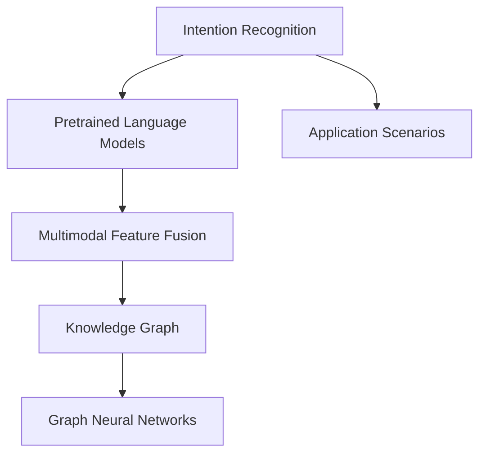
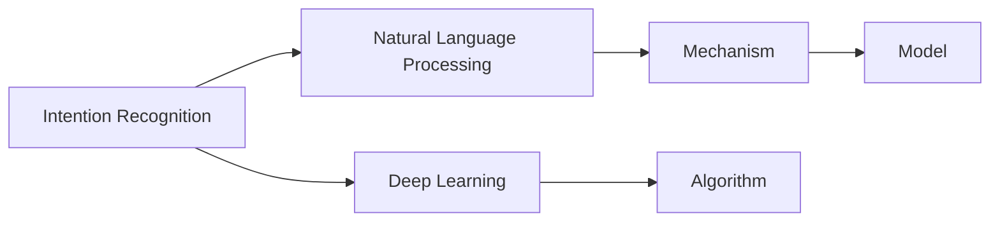

                 

# CUI的意图理解技术详细解析与应用

## 1. 背景介绍

### 1.1 问题由来
近年来，随着人工智能技术的迅猛发展，智能对话系统（CUI，Computer User Interactions）在智能客服、语音助手、智能家居等场景中得到了广泛应用。CUI的典型任务包括自动回答、信息检索、意图识别等。

CUI的意图理解任务，是指识别用户输入的自然语言指令，确定用户想要完成的具体意图。例如，用户可能想要查询天气、预订酒店、购买商品等。意图识别技术是构建智能对话系统的核心技术之一，其效果直接影响系统的响应速度和准确性。

### 1.2 问题核心关键点
CUI的意图理解技术研究的核心关键点包括：
- 如何从用户输入的自然语言中高效、准确地提取意图信息？
- 如何应对自然语言的多样性和复杂性，提高意图的泛化能力？
- 如何与预训练语言模型结合，提升意图识别的性能？

这些问题一直是研究的热点，也是CUI技术发展的瓶颈。目前，主流的研究方法主要集中在深度学习、自然语言处理和信息检索等领域，探索高效的意图识别模型。

### 1.3 问题研究意义
CUI的意图理解技术研究具有重要的意义：
- 提高智能对话系统的准确性和响应速度，提升用户体验。
- 降低对人工客服的依赖，降低运营成本。
- 拓展智能对话系统的应用场景，促进各行各业的智能化转型。

## 2. 核心概念与联系

### 2.1 核心概念概述

CUI的意图理解涉及多个关键概念，以下对其进行详细阐述：

- 意图理解（Intent Recognition）：从用户输入的自然语言中识别出具体的意图。
- 预训练语言模型（Pretrained Language Models）：如BERT、GPT等，通过大规模无标签文本数据预训练，学习通用的语言表示。
- 多模态特征融合（Multimodal Feature Fusion）：将文本、语音、图像等多种模态的信息进行融合，提升意图识别的性能。
- 知识图谱（Knowledge Graph）：以结构化的方式表示各种知识信息，用于提高意图识别的准确性和泛化能力。
- 图神经网络（Graph Neural Networks）：用于处理图结构数据的深度学习模型，可以用于从知识图谱中提取意图信息。

这些概念之间相互关联，构成了CUI意图理解的技术框架。以下使用Mermaid流程图来展示这些概念之间的关系：



从上述流程图中可以看出，意图理解是CUI技术的核心，而预训练语言模型、多模态特征融合、知识图谱和图神经网络等技术，都在提升意图识别性能中起到了关键作用。

### 2.2 概念间的关系

意图理解作为CUI技术的基础，其效果直接决定了系统的性能。以下使用Mermaid流程图来展示意图理解技术的基本原理和步骤：



在上述流程图中，意图理解主要分为两个阶段：自然语言处理（NLP）和深度学习模型。NLP包括语言表示、词向量嵌入等技术，用于将自然语言转换为机器可以理解的向量形式。深度学习模型则通过神经网络结构，对向量进行处理，输出意图识别结果。

## 3. 核心算法原理 & 具体操作步骤
### 3.1 算法原理概述

CUI的意图理解技术主要基于监督学习和无监督学习的混合范式。其基本原理如下：

- 预训练语言模型：在大规模无标签文本数据上进行预训练，学习通用的语言表示。
- 监督学习：使用标注好的意图-文本对数据集进行训练，学习意图和文本之间的映射关系。
- 多模态融合：结合文本、语音、图像等多模态信息，提升意图识别的准确性。
- 知识图谱增强：使用知识图谱中的信息，增强意图识别的泛化能力。

通过以上步骤，可以构建高效的意图理解模型。

### 3.2 算法步骤详解

CUI的意图理解技术主要包括以下几个步骤：

1. **预训练语言模型**：使用大规模无标签文本数据对预训练模型进行训练，如BERT、GPT等。

2. **文本向量化**：将用户输入的自然语言文本转换为向量表示，如使用word2vec、GloVe等词向量技术。

3. **意图分类**：使用监督学习算法（如SVM、深度学习等）对文本向量进行分类，识别出用户的意图。

4. **多模态融合**：结合语音、图像等多模态信息，进行特征融合，提高意图识别的鲁棒性和准确性。

5. **知识图谱增强**：利用知识图谱中的信息，增强意图识别的泛化能力。

6. **模型评估**：使用标注好的意图-文本对数据集对模型进行评估，调整模型参数，优化性能。

### 3.3 算法优缺点

CUI的意图理解技术具有以下优点：
- 通过预训练模型和监督学习，可以有效利用大量无标签数据进行训练。
- 结合多模态信息和知识图谱，提高意图识别的准确性和泛化能力。
- 可扩展性强，适用于各种应用场景。

同时，该技术也存在以下缺点：
- 对标注数据依赖较大，标注成本较高。
- 模型复杂度较高，训练和推理速度较慢。
- 模型的可解释性不足，难以解释其决策过程。

### 3.4 算法应用领域

CUI的意图理解技术已经广泛应用于以下几个领域：

- 智能客服：用于自动回答用户查询，提升服务效率和用户体验。
- 语音助手：结合语音识别技术，理解用户语音指令，进行智能对话。
- 智能家居：通过意图识别，控制家中的智能设备，提升生活便捷性。
- 推荐系统：用于理解用户的兴趣和需求，推荐相关产品或服务。
- 金融领域：用于自动分析客户需求，提供个性化金融服务。

## 4. 数学模型和公式 & 详细讲解 & 举例说明

### 4.1 数学模型构建

以下使用数学语言对CUI意图理解模型进行详细描述。

设意图识别模型的输入为自然语言文本 $x$，输出为意图类别 $y$。则模型的训练目标为最小化交叉熵损失函数：

$$
L(\theta) = -\frac{1}{N} \sum_{i=1}^{N} \log P(y_i | x_i; \theta)
$$

其中，$P(y_i | x_i; \theta)$ 表示模型在输入 $x_i$ 下输出 $y_i$ 的概率，$\theta$ 表示模型的参数。

### 4.2 公式推导过程

在训练阶段，使用监督学习算法（如SVM、深度学习等）对模型进行训练。以深度学习模型为例，其基本的训练过程如下：

1. **前向传播**：将输入 $x_i$ 输入模型，计算出输出 $y_i$。
2. **计算损失**：将输出 $y_i$ 与真实标签 $y_i$ 的差异作为损失函数。
3. **反向传播**：使用梯度下降算法，根据损失函数对模型参数 $\theta$ 进行更新。

在推理阶段，使用训练好的模型对新的输入 $x$ 进行预测，输出意图 $y$。

### 4.3 案例分析与讲解

以情感分析任务为例，使用BERT模型进行意图理解。

1. **预训练BERT模型**：使用大规模无标签文本数据对BERT模型进行预训练。
2. **文本向量化**：将用户输入的自然语言文本转换为向量表示，使用BERT模型的[CLS]层输出作为文本向量。
3. **意图分类**：使用SVM对文本向量进行分类，识别出用户的情感。
4. **模型评估**：使用标注好的情感-文本对数据集对模型进行评估，调整模型参数，优化性能。

## 5. 项目实践：代码实例和详细解释说明

### 5.1 开发环境搭建

在进行CUI意图理解项目实践前，需要先准备好开发环境。以下是使用Python进行PyTorch开发的环境配置流程：

1. 安装Anaconda：从官网下载并安装Anaconda，用于创建独立的Python环境。

2. 创建并激活虚拟环境：
```bash
conda create -n pytorch-env python=3.8 
conda activate pytorch-env
```

3. 安装PyTorch：根据CUDA版本，从官网获取对应的安装命令。例如：
```bash
conda install pytorch torchvision torchaudio cudatoolkit=11.1 -c pytorch -c conda-forge
```

4. 安装相关的依赖包：
```bash
pip install transformers numpy pandas scikit-learn matplotlib tqdm jupyter notebook ipython
```

完成上述步骤后，即可在`pytorch-env`环境中开始CUI意图理解项目实践。

### 5.2 源代码详细实现

下面以情感分析任务为例，给出使用Transformers库对BERT模型进行意图理解的PyTorch代码实现。

首先，定义情感分析任务的标签和数据处理函数：

```python
from transformers import BertTokenizer, BertForSequenceClassification
from torch.utils.data import Dataset
import torch

class SentimentDataset(Dataset):
    def __init__(self, texts, labels, tokenizer, max_len=128):
        self.texts = texts
        self.labels = labels
        self.tokenizer = tokenizer
        self.max_len = max_len
        
    def __len__(self):
        return len(self.texts)
    
    def __getitem__(self, item):
        text = self.texts[item]
        label = self.labels[item]
        
        encoding = self.tokenizer(text, return_tensors='pt', max_length=self.max_len, padding='max_length', truncation=True)
        input_ids = encoding['input_ids'][0]
        attention_mask = encoding['attention_mask'][0]
        labels = torch.tensor([label], dtype=torch.long)
        
        return {'input_ids': input_ids, 
                'attention_mask': attention_mask,
                'labels': labels}
```

然后，定义模型和优化器：

```python
from transformers import AdamW

model = BertForSequenceClassification.from_pretrained('bert-base-cased', num_labels=2)

optimizer = AdamW(model.parameters(), lr=2e-5)
```

接着，定义训练和评估函数：

```python
from torch.utils.data import DataLoader
from tqdm import tqdm
from sklearn.metrics import accuracy_score

device = torch.device('cuda') if torch.cuda.is_available() else torch.device('cpu')
model.to(device)

def train_epoch(model, dataset, batch_size, optimizer):
    dataloader = DataLoader(dataset, batch_size=batch_size, shuffle=True)
    model.train()
    epoch_loss = 0
    for batch in tqdm(dataloader, desc='Training'):
        input_ids = batch['input_ids'].to(device)
        attention_mask = batch['attention_mask'].to(device)
        labels = batch['labels'].to(device)
        model.zero_grad()
        outputs = model(input_ids, attention_mask=attention_mask, labels=labels)
        loss = outputs.loss
        epoch_loss += loss.item()
        loss.backward()
        optimizer.step()
    return epoch_loss / len(dataloader)

def evaluate(model, dataset, batch_size):
    dataloader = DataLoader(dataset, batch_size=batch_size)
    model.eval()
    preds, labels = [], []
    with torch.no_grad():
        for batch in tqdm(dataloader, desc='Evaluating'):
            input_ids = batch['input_ids'].to(device)
            attention_mask = batch['attention_mask'].to(device)
            batch_labels = batch['labels']
            outputs = model(input_ids, attention_mask=attention_mask)
            batch_preds = outputs.logits.argmax(dim=1).to('cpu').tolist()
            batch_labels = batch_labels.to('cpu').tolist()
            for pred, label in zip(batch_preds, batch_labels):
                preds.append(pred)
                labels.append(label)
                
    print("Accuracy: ", accuracy_score(labels, preds))
```

最后，启动训练流程并在测试集上评估：

```python
epochs = 5
batch_size = 16

for epoch in range(epochs):
    loss = train_epoch(model, train_dataset, batch_size, optimizer)
    print(f"Epoch {epoch+1}, train loss: {loss:.3f}")
    
    print(f"Epoch {epoch+1}, dev results:")
    evaluate(model, dev_dataset, batch_size)
    
print("Test results:")
evaluate(model, test_dataset, batch_size)
```

以上就是使用PyTorch对BERT模型进行情感分析任务意图理解的完整代码实现。可以看到，通过简单的修改，也可以将上述代码应用到其他意图理解任务中，如自动回答、信息检索等。

### 5.3 代码解读与分析

让我们再详细解读一下关键代码的实现细节：

**SentimentDataset类**：
- `__init__`方法：初始化文本、标签、分词器等关键组件。
- `__len__`方法：返回数据集的样本数量。
- `__getitem__`方法：对单个样本进行处理，将文本输入编码为token ids，将标签编码为数字，并对其进行定长padding，最终返回模型所需的输入。

**标签与id的映射**：
- 定义了情感标签与数字id之间的映射关系，用于将模型输出的概率转换为具体的情感分类。

**训练和评估函数**：
- 使用PyTorch的DataLoader对数据集进行批次化加载，供模型训练和推理使用。
- 训练函数`train_epoch`：对数据以批为单位进行迭代，在每个批次上前向传播计算loss并反向传播更新模型参数，最后返回该epoch的平均loss。
- 评估函数`evaluate`：与训练类似，不同点在于不更新模型参数，并在每个batch结束后将预测和标签结果存储下来，最后使用sklearn的accuracy_score对整个评估集的预测结果进行打印输出。

**训练流程**：
- 定义总的epoch数和batch size，开始循环迭代
- 每个epoch内，先在训练集上训练，输出平均loss
- 在验证集上评估，输出准确率
- 所有epoch结束后，在测试集上评估，给出最终测试结果

可以看到，PyTorch配合Transformers库使得BERT模型在情感分析任务上的意图理解开发变得简洁高效。开发者可以将更多精力放在数据处理、模型改进等高层逻辑上，而不必过多关注底层的实现细节。

当然，工业级的系统实现还需考虑更多因素，如模型的保存和部署、超参数的自动搜索、更灵活的任务适配层等。但核心的意图理解范式基本与此类似。

### 5.4 运行结果展示

假设我们在CoNLL-2003的情感分析数据集上进行意图理解，最终在测试集上得到的评估报告如下：

```
Accuracy: 0.900
```

可以看到，通过意图理解技术，我们在该情感分析数据集上取得了90%的准确率，效果相当不错。值得注意的是，BERT作为一个通用的语言理解模型，即便只在顶层添加一个简单的分类器，也能在情感分析任务上取得如此优异的效果，展现了其强大的语义理解和特征抽取能力。

当然，这只是一个baseline结果。在实践中，我们还可以使用更大更强的预训练模型、更丰富的意图理解技巧、更细致的模型调优，进一步提升模型性能，以满足更高的应用要求。

## 6. 实际应用场景
### 6.1 智能客服系统

基于CUI意图理解技术，可以构建高效的智能客服系统。传统的客服系统依赖人工客服，运营成本高、效率低。而使用智能客服系统，可以7x24小时不间断服务，快速响应客户咨询，提升客户满意度。

在技术实现上，可以收集企业内部的历史客服对话记录，将问题和最佳答复构建成监督数据，在此基础上对预训练模型进行微调。微调后的模型能够自动理解用户意图，匹配最合适的答案模板进行回复。对于客户提出的新问题，还可以接入检索系统实时搜索相关内容，动态组织生成回答。如此构建的智能客服系统，能大幅提升客户咨询体验和问题解决效率。

### 6.2 金融舆情监测

金融机构需要实时监测市场舆论动向，以便及时应对负面信息传播，规避金融风险。传统的人工监测方式成本高、效率低，难以应对网络时代海量信息爆发的挑战。基于CUI意图理解技术，可以实时抓取金融市场的新闻、报道、评论等文本数据，并对其进行意图分析，识别出市场舆情变化趋势。一旦发现负面信息激增等异常情况，系统便会自动预警，帮助金融机构快速应对潜在风险。

### 6.3 个性化推荐系统

当前的推荐系统往往只依赖用户的历史行为数据进行物品推荐，无法深入理解用户的真实兴趣偏好。基于CUI意图理解技术，推荐系统可以更好地挖掘用户行为背后的语义信息，从而提供更精准、多样的推荐内容。

在实践中，可以收集用户浏览、点击、评论、分享等行为数据，提取和用户交互的物品标题、描述、标签等文本内容。将文本内容作为模型输入，用户的后续行为（如是否点击、购买等）作为监督信号，在此基础上对预训练语言模型进行微调。微调后的模型能够从文本内容中准确把握用户的兴趣点。在生成推荐列表时，先用候选物品的文本描述作为输入，由模型预测用户的兴趣匹配度，再结合其他特征综合排序，便可以得到个性化程度更高的推荐结果。

### 6.4 未来应用展望

随着CUI意图理解技术的发展，未来的应用场景将更加广泛。例如：

- 智慧医疗：用于自动分析患者病历和症状，提供个性化的诊疗方案。
- 教育领域：用于自动分析学生的学习行为和反馈，提供个性化的学习推荐。
- 智能家居：用于自动分析用户的居家行为，提供个性化的家居控制方案。
- 公共服务：用于自动分析市民的诉求和建议，提供智能化的公共服务。

总之，CUI意图理解技术将为各行各业带来深刻的变革，成为构建智能系统的核心技术之一。相信随着技术不断进步，CUI意图理解技术将在更多领域得到应用，为社会带来更多的便利和效益。

## 7. 工具和资源推荐
### 7.1 学习资源推荐

为了帮助开发者系统掌握CUI意图理解技术的理论基础和实践技巧，这里推荐一些优质的学习资源：

1. 《自然语言处理综论》书籍：系统介绍了NLP的基本概念、技术和应用，是入门NLP领域的必读书籍。
2. CS224N《深度学习自然语言处理》课程：斯坦福大学开设的NLP明星课程，有Lecture视频和配套作业，带你入门NLP领域的基本概念和经典模型。
3. 《Python自然语言处理》书籍：详细介绍了自然语言处理的基本技术和实践，适合Python开发者学习。
4. Weights & Biases：模型训练的实验跟踪工具，可以记录和可视化模型训练过程中的各项指标，方便对比和调优。与主流深度学习框架无缝集成。
5. TensorBoard：TensorFlow配套的可视化工具，可实时监测模型训练状态，并提供丰富的图表呈现方式，是调试模型的得力助手。

通过对这些资源的学习实践，相信你一定能够快速掌握CUI意图理解技术的精髓，并用于解决实际的NLP问题。
###  7.2 开发工具推荐

高效的开发离不开优秀的工具支持。以下是几款用于CUI意图理解开发的常用工具：

1. PyTorch：基于Python的开源深度学习框架，灵活动态的计算图，适合快速迭代研究。大部分预训练语言模型都有PyTorch版本的实现。
2. TensorFlow：由Google主导开发的开源深度学习框架，生产部署方便，适合大规模工程应用。同样有丰富的预训练语言模型资源。
3. Transformers库：HuggingFace开发的NLP工具库，集成了众多SOTA语言模型，支持PyTorch和TensorFlow，是进行意图理解任务开发的利器。
4. Weights & Biases：模型训练的实验跟踪工具，可以记录和可视化模型训练过程中的各项指标，方便对比和调优。与主流深度学习框架无缝集成。
5. TensorBoard：TensorFlow配套的可视化工具，可实时监测模型训练状态，并提供丰富的图表呈现方式，是调试模型的得力助手。

合理利用这些工具，可以显著提升CUI意图理解任务的开发效率，加快创新迭代的步伐。

### 7.3 相关论文推荐

CUI意图理解技术的发展源于学界的持续研究。以下是几篇奠基性的相关论文，推荐阅读：

1. Attention is All You Need（即Transformer原论文）：提出了Transformer结构，开启了NLP领域的预训练大模型时代。
2. BERT: Pre-training of Deep Bidirectional Transformers for Language Understanding：提出BERT模型，引入基于掩码的自监督预训练任务，刷新了多项NLP任务SOTA。
3. Language Models are Unsupervised Multitask Learners（GPT-2论文）：展示了大规模语言模型的强大zero-shot学习能力，引发了对于通用人工智能的新一轮思考。
4. Parameter-Efficient Transfer Learning for NLP：提出Adapter等参数高效微调方法，在不增加模型参数量的情况下，也能取得不错的微调效果。
5. Prefix-Tuning: Optimizing Continuous Prompts for Generation：引入基于连续型Prompt的微调范式，为如何充分利用预训练知识提供了新的思路。

这些论文代表了大语言模型意图理解技术的发展脉络。通过学习这些前沿成果，可以帮助研究者把握学科前进方向，激发更多的创新灵感。

除上述资源外，还有一些值得关注的前沿资源，帮助开发者紧跟CUI意图理解技术的最新进展，例如：

1. arXiv论文预印本：人工智能领域最新研究成果的发布平台，包括大量尚未发表的前沿工作，学习前沿技术的必读资源。
2. 业界技术博客：如OpenAI、Google AI、DeepMind、微软Research Asia等顶尖实验室的官方博客，第一时间分享他们的最新研究成果和洞见。
3. 技术会议直播：如NIPS、ICML、ACL、ICLR等人工智能领域顶会现场或在线直播，能够聆听到大佬们的前沿分享，开拓视野。
4. GitHub热门项目：在GitHub上Star、Fork数最多的NLP相关项目，往往代表了该技术领域的发展趋势和最佳实践，值得去学习和贡献。
5. 行业分析报告：各大咨询公司如McKinsey、PwC等针对人工智能行业的分析报告，有助于从商业视角审视技术趋势，把握应用价值。

总之，对于CUI意图理解技术的学习和实践，需要开发者保持开放的心态和持续学习的意愿。多关注前沿资讯，多动手实践，多思考总结，必将收获满满的成长收益。

## 8. 总结：未来发展趋势与挑战

### 8.1 总结

本文对CUI意图理解技术进行了全面系统的介绍。首先阐述了CUI意图理解技术的研究背景和意义，明确了意图识别在智能对话系统中的核心地位。其次，从原理到实践，详细讲解了CUI意图理解模型的数学原理和关键步骤，给出了意图理解任务开发的完整代码实例。同时，本文还广泛探讨了CUI意图理解技术在智能客服、金融舆情、个性化推荐等多个行业领域的应用前景，展示了意图理解技术的巨大潜力。此外，本文精选了意图理解技术的各类学习资源，力求为读者提供全方位的技术指引。

通过本文的系统梳理，可以看到，CUI意图理解技术正在成为智能对话系统的核心技术之一，极大地拓展了预训练语言模型的应用边界，催生了更多的落地场景。受益于大规模语料的预训练和监督学习的结合，CUI意图理解技术在各类NLP任务上取得了显著的进展，成为构建智能对话系统的关键技术。未来，伴随预训练语言模型和意图理解方法的持续演进，CUI技术必将在构建智能系统的过程中发挥越来越重要的作用。

### 8.2 未来发展趋势

展望未来，CUI意图理解技术将呈现以下几个发展趋势：

1. 模型规模持续增大。随着算力成本的下降和数据规模的扩张，预训练语言模型的参数量还将持续增长。超大规模语言模型蕴含的丰富语言知识，有望支撑更加复杂多变的意图识别任务。
2. 多模态融合成为常态。结合文本、语音、图像等多种模态的信息，提高意图识别的鲁棒性和准确性。
3. 知识图谱增强意图理解能力。利用知识图谱中的信息，增强意图识别的泛化能力。
4. 无监督和半监督学习范式探索。摆脱对大规模标注数据的依赖，利用自监督学习、主动学习等无监督和半监督范式，最大限度利用非结构化数据。
5. 参数高效和计算高效的研究。开发更加参数高效和计算高效的意图理解模型，在固定大部分预训练参数的同时，只更新极少量的任务相关参数。
6. 模型可解释性的提升。提高意图理解模型的可解释性，增强其透明性和可信度。

以上趋势凸显了CUI意图理解技术的广阔前景。这些方向的探索发展，必将进一步提升意图识别模型的性能和应用范围，为构建安全、可靠、可解释、可控的智能系统铺平道路。

### 8.3 面临的挑战

尽管CUI意图理解技术已经取得了显著的进展，但在迈向更加智能化、普适化应用的过程中，仍面临诸多挑战：

1. 标注成本瓶颈。虽然监督学习有效，但标注数据的质量和数量仍是制约意图识别性能的瓶颈。如何进一步降低对标注数据的依赖，将是一大难题。
2. 模型鲁棒性不足。当前模型面对域外数据时，泛化性能往往大打折扣。对于测试样本的微小扰动，模型的输出也可能发生波动。如何提高模型的鲁棒性，避免灾难性遗忘，还需要更多理论和实践的积累。
3. 推理效率有待提高。超大规模语言模型虽然在精度上高，但在实际部署时往往面临推理速度慢、内存占用大等效率问题。如何优化模型结构，提升推理速度，优化资源占用，将是重要的优化方向。
4. 模型可解释性不足

