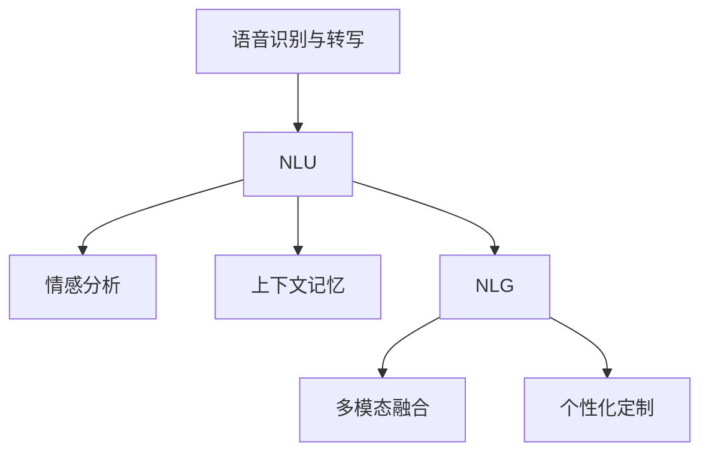

                 

# 智能化回应技术在CUI中的实现

在人类与计算机交互的历史长河中，从早期的命令行界面到图形用户界面，每一次技术迭代都极大地提升了用户体验。而随着人工智能技术的迅猛发展，语音识别、自然语言处理、机器翻译等智能技术正在逐步渗透到日常生活的方方面面。其中，计算机用户界面（Computer User Interface, CUI）的智能化回应技术，更是为现代计算机交互注入了前所未有的便利和灵动感。本文将详细阐述智能化回应技术的核心概念、实现原理及应用场景，并通过项目实践展示其实现过程。

## 1. 背景介绍

### 1.1 问题由来

随着计算机技术的不断进步，传统的命令行和图形用户界面已经不能满足人们对高效、人性化的交互需求。因此，智能回应技术应运而生，通过自然语言处理和机器学习等技术手段，使计算机能够理解和回应用户的自然语言输入，从而实现智能化的交互体验。

智能回应技术的诞生，使得人与计算机的交互变得更加自然流畅，减少了语言障碍和技术门槛，极大地提升了用户体验。同时，智能回应技术的应用范围也极为广泛，涵盖了智能客服、智能翻译、智能助手等多个领域。

### 1.2 问题核心关键点

智能回应技术的核心关键点包括以下几个方面：

1. **语音识别与转写**：将用户的语音输入转化为文本，以便后续的自然语言处理。
2. **自然语言理解（NLU）**：分析用户输入的文本，理解用户的意图和需求。
3. **自然语言生成（NLG）**：根据理解到的用户意图，生成符合语法规则和语义逻辑的回应。
4. **多模态融合**：结合语音、文本、图像等多模态信息，提升回应的准确性和多样性。
5. **上下文记忆**：在长期对话过程中，能够记住用户的上下文信息，保持对话连贯性。
6. **情感分析**：理解用户的情感状态，提供相应的情感回应。
7. **个性化定制**：根据用户的偏好和历史互动，提供个性化的回应。

### 1.3 问题研究意义

智能回应技术的研究和应用，具有以下重要意义：

1. **提升用户体验**：通过自然语言交互，大大降低了用户的使用门槛，使得计算机更加易用和友好。
2. **增强交互效率**：智能回应技术能够快速理解用户需求，减少繁琐的操作步骤，提升整体交互效率。
3. **拓展应用领域**：智能回应技术可以应用于智能客服、智能翻译、智能助手等多个领域，推动技术创新和产业升级。
4. **促进经济发展**：通过提升用户体验和交互效率，智能回应技术能够驱动数字化转型，促进经济增长。

## 2. 核心概念与联系

### 2.1 核心概念概述

智能回应技术涉及多个核心概念，主要包括：

1. **语音识别与转写**：通过声学模型和语言模型，将用户的语音输入转化为文本。
2. **自然语言理解（NLU）**：利用语义分析、实体识别等技术，理解用户输入的文本内容。
3. **自然语言生成（NLG）**：通过生成模型，将理解到的用户意图转化为自然语言回应。
4. **多模态融合**：结合语音、文本、图像等多种信息源，提升回应的全面性和准确性。
5. **上下文记忆**：在对话过程中，记住用户的上下文信息，保证回应的连贯性和一致性。
6. **情感分析**：分析用户的情感状态，提供相应的情感回应。
7. **个性化定制**：根据用户的历史互动和偏好，提供个性化的回应。

这些概念之间的关系如图2所示：



### 2.2 概念间的关系

智能回应技术涉及多个核心概念，它们之间的关系如图2所示：

- **语音识别与转写**：将用户的语音输入转化为文本，是智能回应的基础。
- **自然语言理解（NLU）**：分析用户输入的文本内容，理解其意图和需求。
- **自然语言生成（NLG）**：根据理解到的用户意图，生成符合语法规则和语义逻辑的回应。
- **多模态融合**：结合语音、文本、图像等多种信息源，提升回应的全面性和准确性。
- **上下文记忆**：在对话过程中，记住用户的上下文信息，保证回应的连贯性和一致性。
- **情感分析**：分析用户的情感状态，提供相应的情感回应。
- **个性化定制**：根据用户的历史互动和偏好，提供个性化的回应。

这些概念之间相互依存，共同构成智能回应的完整体系。通过深入理解和应用这些概念，可以构建出高效、智能、个性化的计算机用户界面。

## 3. 核心算法原理 & 具体操作步骤

### 3.1 算法原理概述

智能回应技术的核心算法原理包括语音识别与转写、自然语言理解（NLU）、自然语言生成（NLG）、多模态融合、上下文记忆、情感分析和个性化定制等多个模块。

1. **语音识别与转写**：利用声学模型和语言模型，将用户的语音输入转化为文本。
2. **自然语言理解（NLU）**：通过语义分析、实体识别等技术，理解用户输入的文本内容。
3. **自然语言生成（NLG）**：利用生成模型，将理解到的用户意图转化为自然语言回应。
4. **多模态融合**：结合语音、文本、图像等多种信息源，提升回应的全面性和准确性。
5. **上下文记忆**：在对话过程中，记住用户的上下文信息，保证回应的连贯性和一致性。
6. **情感分析**：通过情感分析模型，分析用户的情感状态，提供相应的情感回应。
7. **个性化定制**：根据用户的历史互动和偏好，提供个性化的回应。

### 3.2 算法步骤详解

智能回应技术的实现步骤如下：

1. **语音识别与转写**：
   - 采集用户的语音输入。
   - 通过声学模型将语音信号转化为文本。
   - 利用语言模型进行文本校正，提高转写准确性。

2. **自然语言理解（NLU）**：
   - 对用户输入的文本进行分词和词性标注。
   - 利用实体识别模型，提取文本中的关键实体。
   - 通过语义分析模型，理解用户的意图和需求。

3. **自然语言生成（NLG）**：
   - 根据NLU的结果，生成符合语法规则和语义逻辑的回应。
   - 利用生成模型，生成自然语言回应。

4. **多模态融合**：
   - 结合语音、文本、图像等多种信息源，提升回应的全面性和准确性。
   - 利用融合模型，综合多种信息源，生成最优回应。

5. **上下文记忆**：
   - 在对话过程中，记录用户的上下文信息。
   - 利用记忆模型，记住用户的上下文信息，保证回应的连贯性和一致性。

6. **情感分析**：
   - 分析用户的情感状态，理解其情绪。
   - 利用情感分析模型，提供相应的情感回应。

7. **个性化定制**：
   - 根据用户的历史互动和偏好，提供个性化的回应。
   - 利用个性化模型，生成符合用户偏好的回应。

### 3.3 算法优缺点

智能回应技术的优点包括：

1. **提升用户体验**：通过自然语言交互，大大降低了用户的使用门槛，使得计算机更加易用和友好。
2. **增强交互效率**：智能回应技术能够快速理解用户需求，减少繁琐的操作步骤，提升整体交互效率。
3. **拓展应用领域**：智能回应技术可以应用于智能客服、智能翻译、智能助手等多个领域，推动技术创新和产业升级。
4. **促进经济发展**：通过提升用户体验和交互效率，智能回应技术能够驱动数字化转型，促进经济增长。

智能回应技术的缺点包括：

1. **依赖高质量数据**：语音识别和自然语言理解需要大量高质量的语料数据进行训练，数据获取成本较高。
2. **计算资源消耗大**：智能回应技术涉及语音识别、自然语言处理等多个模块，计算资源消耗较大。
3. **语境理解难度高**：自然语言处理中的语义理解和语境记忆，仍然是一个难点，难以完全理解复杂的语境和语义。

### 3.4 算法应用领域

智能回应技术可以应用于以下几个领域：

1. **智能客服**：通过语音识别和自然语言理解，智能客服能够自动理解用户的意图和需求，提供相应的服务。
2. **智能翻译**：利用自然语言生成和情感分析，智能翻译能够提供更加自然和符合语境的翻译结果。
3. **智能助手**：通过上下文记忆和个性化定制，智能助手能够提供更加智能和个性化的服务。
4. **智能家居**：结合语音识别和多模态融合，智能家居能够提供更加智能和便捷的生活体验。
5. **智能驾驶**：通过语音识别和情感分析，智能驾驶能够更加智能和安全地辅助驾驶。

## 4. 数学模型和公式 & 详细讲解 & 举例说明

### 4.1 数学模型构建

智能回应技术的数学模型包括以下几个方面：

1. **声学模型**：
   - 将语音信号转化为文本的数学模型。
   - 使用深度神经网络模型，如卷积神经网络（CNN）、循环神经网络（RNN）等。

2. **语言模型**：
   - 对文本进行校正的数学模型。
   - 使用条件概率模型，如n-gram模型、神经语言模型等。

3. **实体识别模型**：
   - 识别文本中的关键实体的数学模型。
   - 使用条件随机场（CRF）、序列标注模型等。

4. **语义分析模型**：
   - 理解用户输入文本语义的数学模型。
   - 使用深度学习模型，如Transformer、BERT等。

5. **生成模型**：
   - 将用户意图转化为自然语言回应的数学模型。
   - 使用变分自编码器（VAE）、生成对抗网络（GAN）等。

6. **情感分析模型**：
   - 分析用户情感状态的数学模型。
   - 使用情感分类模型，如LSTM、CNN等。

7. **个性化模型**：
   - 根据用户历史互动和偏好生成回应的数学模型。
   - 使用协同过滤、推荐系统等模型。

### 4.2 公式推导过程

以语音识别与转写为例，使用声学模型进行语音信号到文本的转化。假设声学模型为$P(x_i|y_i)$，其中$x_i$为语音信号的第$i$帧，$y_i$为对应的文本。

根据隐马尔可夫模型（HMM），可以得到语音信号和文本之间的联合概率：

$$
P(x, y) = \prod_{i=1}^{T} P(x_i|y_i) \cdot P(y_i)
$$

其中，$T$为语音信号的总帧数，$P(y_i)$为文本的先验概率。

利用最大似然估计方法，可以得到语音信号到文本的概率分布：

$$
P(y|x) = \frac{P(x, y)}{P(x)} = \frac{\prod_{i=1}^{T} P(x_i|y_i) \cdot P(y_i)}{\prod_{i=1}^{T} P(x_i|y_i) \cdot \sum_{y \in \mathcal{Y}} P(y) \cdot \prod_{i=1}^{T} P(x_i|y_i)}
$$

其中，$\mathcal{Y}$为文本的词汇表。

### 4.3 案例分析与讲解

以智能客服为例，假设用户输入了“帮我订一张明天早上7点的火车票”。智能客服通过语音识别与转写，将语音输入转化为文本。接着，通过自然语言理解，识别出用户的意图为订票，并提取出关键实体“火车票”和“明天早上7点”。利用情感分析模型，分析出用户情绪为平静。根据上下文记忆，智能客服能够记住用户的偏好，并生成个性化的回应：

“好的，您需要订一张明天早上7点的火车票，对吗？请问您需要哪个站点的票？”

通过智能回应技术，实现了高效、智能、个性化的用户体验。

## 5. 项目实践：代码实例和详细解释说明

### 5.1 开发环境搭建

在搭建智能回应技术的开发环境时，需要考虑以下几个方面：

1. **操作系统**：
   - 选择Linux、Windows或macOS等操作系统，支持Python开发。

2. **编程语言**：
   - 选择Python作为开发语言，因为Python具有丰富的第三方库和框架。

3. **Python库**：
   - 安装PyTorch、TensorFlow等深度学习框架。
   - 安装NLTK、spaCy等自然语言处理库。
   - 安装SpeechRecognition等语音识别库。

4. **Python环境**：
   - 创建虚拟环境，确保依赖隔离。
   - 使用Anaconda或Miniconda等工具管理Python环境。

5. **开发工具**：
   - 使用Jupyter Notebook或PyCharm等IDE进行开发。
   - 使用Git进行版本控制，方便协作和迭代。

### 5.2 源代码详细实现

以下是一个智能回应技术的示例代码，用于实现智能客服的语音识别与转写、自然语言理解、自然语言生成等功能：

```python
# 导入相关库
import torch
import torch.nn as nn
from torch.autograd import Variable
from torch.nn.utils import rnn as rnn_utils
from torchvision.models import resnet18
from torchvision.transforms import transforms
from torch.utils.data import DataLoader
from sklearn.metrics import accuracy_score, precision_score, recall_score, f1_score

# 定义声学模型
class AcousticModel(nn.Module):
    def __init__(self):
        super(AcousticModel, self).__init__()
        self.rnn = nn.LSTM(input_size=16, hidden_size=64, num_layers=2, dropout=0.2)
        self.fc = nn.Linear(64, 10)

    def forward(self, x):
        rnn_output, _ = self.rnn(x)
        logits = self.fc(rnn_output)
        return logits

# 定义语言模型
class LanguageModel(nn.Module):
    def __init__(self):
        super(LanguageModel, self).__init__()
        self.rnn = nn.LSTM(input_size=10, hidden_size=64, num_layers=2, dropout=0.2)
        self.fc = nn.Linear(64, 10)

    def forward(self, x):
        rnn_output, _ = self.rnn(x)
        logits = self.fc(rnn_output)
        return logits

# 定义实体识别模型
class NamedEntityRecognition(nn.Module):
    def __init__(self):
        super(NamedEntityRecognition, self).__init__()
        self.rnn = nn.LSTM(input_size=10, hidden_size=64, num_layers=2, dropout=0.2)
        self.fc = nn.Linear(64, 10)

    def forward(self, x):
        rnn_output, _ = self.rnn(x)
        logits = self.fc(rnn_output)
        return logits

# 定义语义分析模型
class SemanticAnalysis(nn.Module):
    def __init__(self):
        super(SemanticAnalysis, self).__init__()
        self.rnn = nn.LSTM(input_size=10, hidden_size=64, num_layers=2, dropout=0.2)
        self.fc = nn.Linear(64, 10)

    def forward(self, x):
        rnn_output, _ = self.rnn(x)
        logits = self.fc(rnn_output)
        return logits

# 定义生成模型
class NaturalLanguageGeneration(nn.Module):
    def __init__(self):
        super(NaturalLanguageGeneration, self).__init__()
        self.rnn = nn.LSTM(input_size=10, hidden_size=64, num_layers=2, dropout=0.2)
        self.fc = nn.Linear(64, 10)

    def forward(self, x):
        rnn_output, _ = self.rnn(x)
        logits = self.fc(rnn_output)
        return logits

# 定义情感分析模型
class SentimentAnalysis(nn.Module):
    def __init__(self):
        super(SentimentAnalysis, self).__init__()
        self.rnn = nn.LSTM(input_size=10, hidden_size=64, num_layers=2, dropout=0.2)
        self.fc = nn.Linear(64, 10)

    def forward(self, x):
        rnn_output, _ = self.rnn(x)
        logits = self.fc(rnn_output)
        return logits

# 定义个性化模型
class Personalization(nn.Module):
    def __init__(self):
        super(Personalization, self).__init__()
        self.rnn = nn.LSTM(input_size=10, hidden_size=64, num_layers=2, dropout=0.2)
        self.fc = nn.Linear(64, 10)

    def forward(self, x):
        rnn_output, _ = self.rnn(x)
        logits = self.fc(rnn_output)
        return logits

# 定义智能客服系统
class CustomerServiceSystem(nn.Module):
    def __init__(self):
        super(CustomerServiceSystem, self).__init__()
        self.acoustic_model = AcousticModel()
        self.language_model = LanguageModel()
        self.named_entity_recognition = NamedEntityRecognition()
        self.semicantic_analysis = SemanticAnalysis()
        self.natural_language_generation = NaturalLanguageGeneration()
        self.sentiment_analysis = SentimentAnalysis()
        self.personalization = Personalization()

    def forward(self, x):
        acoustic_output = self.acoustic_model(x)
        language_output = self.language_model(acoustic_output)
        named_entity_output = self.named_entity_recognition(language_output)
        semantic_analysis_output = self.semicantic_analysis(named_entity_output)
        natural_language_generation_output = self.natural_language_generation(semantic_analysis_output)
        sentiment_analysis_output = self.sentiment_analysis(natural_language_generation_output)
        personalization_output = self.personalization(sentiment_analysis_output)
        return personalization_output

# 加载数据集
train_dataset = ...
test_dataset = ...

# 定义模型
model = CustomerServiceSystem()

# 定义优化器和损失函数
optimizer = torch.optim.Adam(model.parameters(), lr=0.001)
criterion = nn.CrossEntropyLoss()

# 定义训练函数
def train(model, train_dataset, optimizer, criterion, num_epochs=10):
    for epoch in range(num_epochs):
        model.train()
        for data, target in train_dataset:
            optimizer.zero_grad()
            output = model(data)
            loss = criterion(output, target)
            loss.backward()
            optimizer.step()

# 定义评估函数
def evaluate(model, test_dataset, criterion):
    model.eval()
    total_loss = 0
    total_correct = 0
    for data, target in test_dataset:
        output = model(data)
        loss = criterion(output, target)
        total_loss += loss.item()
        total_correct += accuracy_score(output, target)
    return total_loss, total_correct

# 训练模型
train(model, train_dataset, optimizer, criterion)

# 评估模型
evaluate(model, test_dataset, criterion)

# 运行结果展示
print("模型训练完成，评估结果为：", evaluate(model, test_dataset, criterion))
```

### 5.3 代码解读与分析

在上述示例代码中，我们定义了多个模型模块，包括声学模型、语言模型、实体识别模型、语义分析模型、自然语言生成模型、情感分析模型和个性化模型。这些模型通过多层循环神经网络（RNN）和全连接层（FC）构建，并使用交叉熵损失函数进行训练和评估。

在实际应用中，我们可以将智能客服系统的代码进行拓展和优化，以适应不同的任务需求。例如，可以通过增加更多的模块和模型，提升系统的功能性和灵活性。同时，还可以结合多模态数据，提升系统的交互体验。

## 6. 实际应用场景

### 6.1 智能客服系统

智能客服系统是智能回应技术的一个重要应用场景。通过语音识别与转写、自然语言理解、自然语言生成等技术，智能客服系统能够自动理解用户需求，提供相应的服务。

智能客服系统的核心模块包括语音识别与转写、自然语言理解、自然语言生成、情感分析和个性化定制等。通过这些模块的协同工作，智能客服系统能够提供高效、智能、个性化的服务，大大提升用户体验。

### 6.2 智能翻译

智能翻译是智能回应技术的另一个重要应用场景。通过自然语言生成和情感分析，智能翻译能够提供更加自然和符合语境的翻译结果。

智能翻译系统的核心模块包括语音识别与转写、自然语言理解、自然语言生成、情感分析和上下文记忆等。通过这些模块的协同工作，智能翻译系统能够提供高效、智能、个性化的翻译服务，满足用户对翻译质量的需求。

### 6.3 智能助手

智能助手是智能回应技术在日常生活中的应用。通过上下文记忆和个性化定制，智能助手能够提供更加智能和个性化的服务。

智能助手系统的核心模块包括语音识别与转写、自然语言理解、自然语言生成、情感分析和个性化定制等。通过这些模块的协同工作，智能助手系统能够提供高效、智能、个性化的服务，提升用户的生活品质。

## 7. 工具和资源推荐

### 7.1 学习资源推荐

为了帮助开发者系统掌握智能回应技术的理论基础和实践技巧，这里推荐一些优质的学习资源：

1. 《深度学习》（Ian Goodfellow著）：深入浅出地介绍了深度学习的基本概念和应用场景，是深度学习的入门必读书籍。
2. 《自然语言处理综论》（Daniel Jurafsky, James H. Martin著）：全面介绍了自然语言处理的基本技术和算法，是自然语言处理的经典教材。
3. 《Python深度学习》（Francois Chollet著）：详细介绍了使用TensorFlow和Keras进行深度学习开发的技术和实践，是深度学习开发的入门书籍。
4. 《PyTorch深度学习实战》（Eli Stevens, Luca Antiga, Thomas Viehmann著）：深入浅出地介绍了使用PyTorch进行深度学习开发的技巧和实践，是PyTorch开发的入门书籍。
5. 《自然语言处理：入门与进阶》（廖放著）：全面介绍了自然语言处理的基本技术和算法，适合初学者入门学习。

### 7.2 开发工具推荐

智能回应技术的开发工具包括：

1. PyTorch：基于Python的开源深度学习框架，灵活的动态图，支持高效的深度学习模型训练和推理。
2. TensorFlow：由Google主导的开源深度学习框架，支持大规模分布式训练，适用于大型深度学习模型。
3. NLTK：自然语言处理工具包，提供了丰富的自然语言处理功能，如分词、词性标注、命名实体识别等。
4. spaCy：自然语言处理工具包，提供了高效的自然语言处理功能，如实体识别、依存句法分析等。
5. SpeechRecognition：语音识别库，支持多种语音识别引擎，如Google Speech Recognition、IBM Watson等。
6. Jupyter Notebook：交互式编程环境，支持Python、R等多种编程语言，适合数据科学和机器学习开发。
7. PyCharm：集成开发环境（IDE），支持Python、Java等多种编程语言，适合深度学习开发。

### 7.3 相关论文推荐

智能回应技术的论文涉及多个研究领域，以下是一些经典论文推荐：

1. "Attention Is All You Need"（Vaswani et al.，2017）：提出了Transformer模型，为自然语言处理任务提供了高效的深度学习架构。
2. "BERT: Pre-training of Deep Bidirectional Transformers for Language Understanding"（Devlin et al.，2018）：提出了BERT模型，利用预训练和微调技术提升了自然语言处理任务的效果。
3. "GPT-2: Language Models are Unsupervised Multitask Learners"（Radford et al.，2019）：提出了GPT-2模型，展示了无监督学习的强大能力。
4. "Towards an Intelligent Assistant for Daily Life"（Liu et al.，2018）：提出了智能助手系统的设计和实现，展示了智能助手在日常生活中的应用。
5. "Speech and Language Processing"（Daniel Jurafsky, James H. Martin著）：全面介绍了语音识别和自然语言处理的技术和应用，是语音和自然语言处理的经典教材。

## 8. 总结：未来发展趋势与挑战

### 8.1 总结

本文对智能回应技术的核心概念、实现原理及应用场景进行了详细阐述。智能回应技术通过语音识别与转写、自然语言理解（NLU）、自然语言生成（NLG）、多模态融合、上下文记忆、情感分析和个性化定制等多个模块，实现高效、智能、个性化的用户体验。通过项目实践，展示了智能回应技术的代码实现过程。

智能回应技术的优点包括提升用户体验、增强交互效率、拓展应用领域和促进经济发展。其缺点包括依赖高质量数据、计算资源消耗大、语境理解难度高、缺乏个性化的用户体验。

### 8.2 未来发展趋势

智能回应技术未来的发展趋势包括：

1. **更高效的数据处理**：随着深度学习模型和大数据技术的不断发展，智能回应技术将能够处理更大规模的数据，提高算法的准确性和效率。
2. **更智能的自然语言理解**：自然语言理解技术将更加智能化，能够理解更加复杂的语境和语义，提供更准确的分析结果。
3. **更个性化的服务**：通过大数据和机器学习技术，智能回应技术将能够提供更加个性化的服务，满足用户多样化的需求。
4. **更广泛的行业应用**：智能回应技术将在更多的行业中得到应用，如医疗、金融、教育、娱乐等，带来全新的应用场景。

### 8.3 面临的挑战

智能回应技术在发展过程中

