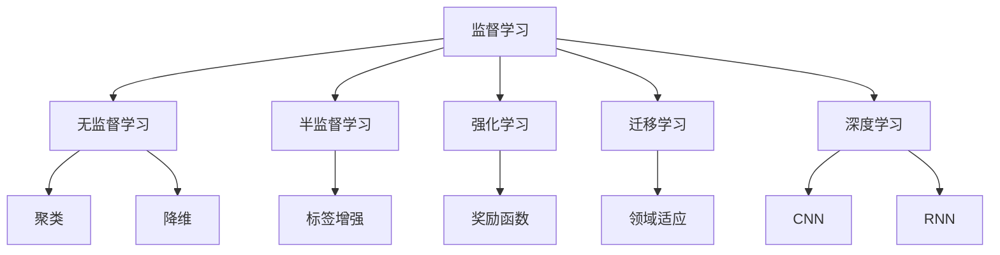
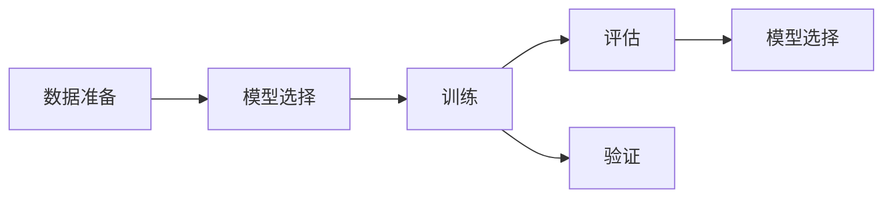
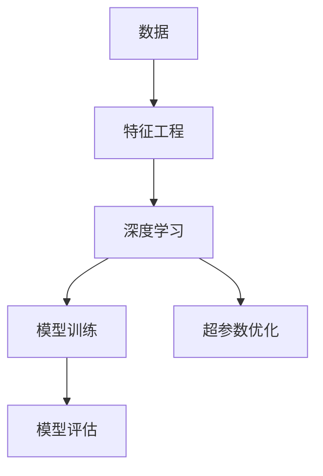
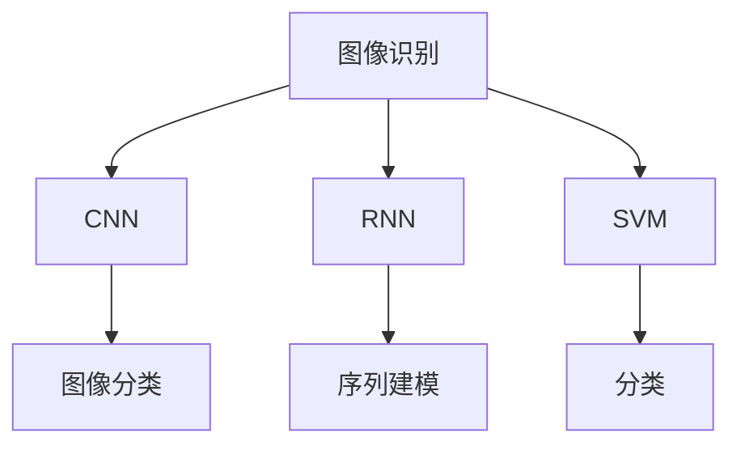
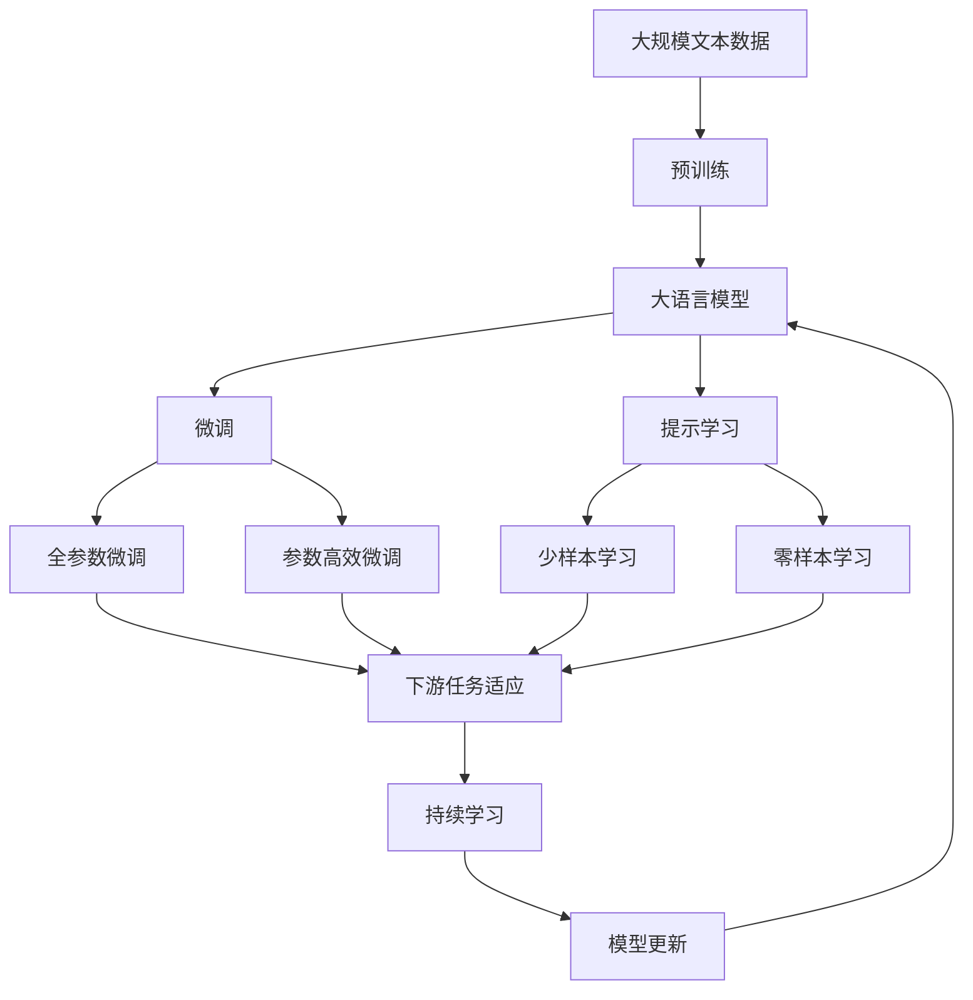

                 

# 机器学习原理与代码实例讲解

## 1. 背景介绍

机器学习作为人工智能的重要分支，其核心在于通过数据驱动的方式，使计算机系统能够具备对未知数据进行学习和预测的能力。在过去几十年间，机器学习领域取得了巨大的进步，从线性回归、决策树到深度学习、强化学习，不断涌现出一系列具有划时代意义的技术。

### 1.1 问题由来

机器学习的核心目标是通过数据建立模型，并应用该模型对新数据进行预测。这一过程涉及数据的准备、模型的选择、训练、验证和评估等多个环节。特别是在深度学习领域，模型的复杂度不断提高，涉及的计算量也越来越大。如何在有限的资源和时间内，构建高效、准确的预测模型，成为了当前研究的热点问题。

### 1.2 问题核心关键点

机器学习模型的构建可以分为三个步骤：模型选择、训练和评估。模型选择通常基于任务的复杂度和数据特性，例如线性回归适用于线性关系较强、数据维度较低的情况，而深度神经网络则适用于复杂、高维度的数据。训练阶段，模型的参数通过大量的训练数据进行优化，使其能够拟合数据的真实分布。评估阶段则通过验证集和测试集对模型的泛化能力进行评估，确保其在未见过的数据上仍能保持较好的性能。

## 2. 核心概念与联系

### 2.1 核心概念概述

为更好地理解机器学习模型构建的各个环节，本节将介绍几个密切相关的核心概念：

- 监督学习(Supervised Learning)：指使用标注好的数据进行模型训练，目标是预测标签。常见应用包括分类和回归任务。
- 无监督学习(Unsupervised Learning)：指使用未标注的数据进行模型训练，目标是发现数据的内在结构和规律。常见应用包括聚类和降维。
- 半监督学习(Semi-Supervised Learning)：指使用少量标注数据和大量未标注数据进行训练，以提高模型的泛化能力。
- 强化学习(Reinforcement Learning)：指通过与环境的交互，学习最优策略以最大化预期奖励。常见应用包括游戏AI和机器人控制。
- 迁移学习(Transfer Learning)：指将一个任务学到的知识迁移到另一个任务上，以减少新任务的训练成本。
- 深度学习(Deep Learning)：指利用多层次的神经网络进行复杂数据建模。常见架构包括卷积神经网络(CNN)和循环神经网络(RNN)。
- 交叉验证(Cross-Validation)：指将数据集分为训练集和验证集，通过多次交叉验证评估模型性能。

这些核心概念之间的逻辑关系可以通过以下Mermaid流程图来展示：



这个流程图展示了机器学习模型的各个分支，它们之间的相互关系和应用场景。通过理解这些核心概念，我们可以更好地把握机器学习模型构建的全过程。

### 2.2 概念间的关系

这些核心概念之间存在着紧密的联系，形成了机器学习模型构建的完整生态系统。下面我们通过几个Mermaid流程图来展示这些概念之间的关系。

#### 2.2.1 机器学习模型构建范式



这个流程图展示了机器学习模型构建的基本流程，包括数据准备、模型选择、训练、验证和评估等环节。数据准备阶段涉及数据收集、清洗和预处理；模型选择阶段根据任务特性选择合适的模型；训练阶段通过数据优化模型参数；验证阶段通过小批量数据评估模型性能；评估阶段通过大批量数据验证模型的泛化能力。

#### 2.2.2 深度学习在机器学习中的作用



这个流程图展示了深度学习在机器学习中的应用，包括数据预处理、特征提取、模型训练和超参数优化等环节。深度学习通过多层次的神经网络进行特征提取，从而获得更好的数据建模能力。

#### 2.2.3 机器学习模型的应用场景



这个流程图展示了机器学习模型在不同领域的应用场景，包括图像识别、序列建模、分类等任务。深度学习在图像识别、自然语言处理等高维度数据处理中表现出色，而传统的SVM等算法则在分类、回归等任务中依然具有重要地位。

### 2.3 核心概念的整体架构

最后，我们用一个综合的流程图来展示这些核心概念在大模型微调过程中的整体架构：



这个综合流程图展示了从预训练到微调，再到持续学习的完整过程。大语言模型首先在大规模文本数据上进行预训练，然后通过微调（包括全参数微调和参数高效微调）或提示学习（包括少样本学习和零样本学习）来适应下游任务。最后，通过持续学习技术，模型可以不断更新和适应新的任务和数据。

## 3. 核心算法原理 & 具体操作步骤
### 3.1 算法原理概述

机器学习模型的核心原理是通过优化损失函数来最小化预测误差，从而提高模型的泛化能力。以监督学习为例，模型通过训练数据拟合输入输出之间的映射关系，进而对新数据进行预测。常见的机器学习算法包括线性回归、决策树、支持向量机、随机森林、神经网络等。

在模型训练过程中，通常使用梯度下降等优化算法来更新模型参数，使得损失函数最小化。例如，在神经网络中，损失函数可以是均方误差、交叉熵等，而优化算法如Adam、SGD等则用于计算梯度并更新参数。

### 3.2 算法步骤详解

机器学习模型的训练通常包括以下几个步骤：

**Step 1: 数据准备**
- 收集和处理训练数据，进行数据清洗和预处理。
- 将数据划分为训练集、验证集和测试集。

**Step 2: 模型选择**
- 根据任务特性选择合适的模型。例如，分类任务可以选择逻辑回归、决策树、支持向量机等；回归任务可以选择线性回归、岭回归等；序列建模可以选择RNN、LSTM、GRU等。

**Step 3: 模型训练**
- 设置模型参数和超参数，如学习率、批量大小、迭代次数等。
- 使用优化算法如Adam、SGD等，通过梯度下降法更新模型参数。
- 在训练过程中，使用交叉验证等技术进行参数调优。

**Step 4: 模型评估**
- 在验证集上评估模型性能，使用均方误差、交叉熵等指标进行衡量。
- 根据评估结果，调整模型参数和超参数。
- 在测试集上最终评估模型性能，确保模型的泛化能力。

**Step 5: 模型部署**
- 将训练好的模型保存为文件或部署为服务。
- 使用API接口或SDK调用模型进行预测。

### 3.3 算法优缺点

机器学习模型具有以下优点：
- 自适应性强，能够处理非线性和高维数据。
- 泛化能力强，在未见过的数据上也能取得较好性能。
- 理论基础完善，有大量的研究资料可供学习和参考。

同时，这些模型也存在一些缺点：
- 计算量大，需要大量的计算资源和时间。
- 数据依赖性强，需要大量的标注数据进行训练。
- 模型复杂度高，难以理解和调试。
- 泛化能力受限于数据分布，容易过拟合。

### 3.4 算法应用领域

机器学习模型在各行各业中都有广泛的应用，例如：

- 金融风控：使用机器学习模型对用户的信用评分、风险评估等进行预测。
- 医疗诊断：通过分析病人的影像和基因数据，预测疾病的发生和发展。
- 推荐系统：根据用户的历史行为和兴趣，推荐个性化的商品和服务。
- 自然语言处理：利用机器学习模型进行文本分类、情感分析、机器翻译等任务。
- 图像识别：通过深度学习模型进行图像分类、目标检测等任务。
- 语音识别：使用机器学习模型进行语音转文本、情感识别等任务。
- 供应链管理：通过机器学习模型预测需求、优化库存等。

## 4. 数学模型和公式 & 详细讲解 & 举例说明

### 4.1 数学模型构建

以线性回归为例，构建机器学习模型的数学模型如下：

设训练集为 $D=\{(x_i,y_i)\}_{i=1}^N$，其中 $x_i \in \mathbb{R}^d$ 为输入向量，$y_i \in \mathbb{R}$ 为输出向量。线性回归模型的目标是通过拟合函数 $f(x)=\theta^T\phi(x)$ 最小化损失函数 $\mathcal{L}(\theta)$，其中 $\phi(x)$ 为输入向量的映射函数。

定义损失函数为均方误差（MSE）：

$$
\mathcal{L}(\theta) = \frac{1}{2N}\sum_{i=1}^N (y_i - \theta^T\phi(x_i))^2
$$

目标是最小化损失函数，即：

$$
\hat{\theta}=\mathop{\arg\min}_{\theta} \mathcal{L}(\theta)
$$

通过求解上述优化问题，可以得到线性回归模型的参数 $\hat{\theta}$。

### 4.2 公式推导过程

对于线性回归模型的参数 $\theta$，根据梯度下降算法的更新公式：

$$
\theta_{k+1} = \theta_k - \eta \nabla_{\theta}\mathcal{L}(\theta_k)
$$

其中 $\eta$ 为学习率，$\nabla_{\theta}\mathcal{L}(\theta_k)$ 为损失函数对参数 $\theta$ 的梯度。将均方误差损失函数代入上述公式，得到：

$$
\theta_{k+1} = \theta_k - \eta \frac{1}{N}\sum_{i=1}^N (y_i - \theta_k^T\phi(x_i))\phi(x_i)
$$

这个公式展示了线性回归模型的参数更新过程。通过不断迭代，最终可以逼近最优解 $\hat{\theta}$。

### 4.3 案例分析与讲解

以波士顿房价预测为例，构建机器学习模型：

假设训练集为波士顿房价数据集，输入变量包括平均数、大小、年龄、朝向、距离等，输出变量为房价。可以使用线性回归模型进行预测，具体实现步骤如下：

1. 数据预处理：对数据进行归一化、缺失值处理等操作。
2. 特征工程：选择和构造输入变量 $\phi(x_i)$。
3. 模型训练：使用梯度下降法训练模型参数 $\theta$。
4. 模型评估：在验证集上评估模型性能，调整超参数。
5. 模型部署：将训练好的模型保存为文件或部署为服务。

## 5. 项目实践：代码实例和详细解释说明

### 5.1 开发环境搭建

在进行机器学习模型开发前，我们需要准备好开发环境。以下是使用Python进行TensorFlow开发的环境配置流程：

1. 安装Anaconda：从官网下载并安装Anaconda，用于创建独立的Python环境。

2. 创建并激活虚拟环境：
```bash
conda create -n tf-env python=3.8 
conda activate tf-env
```

3. 安装TensorFlow：根据CUDA版本，从官网获取对应的安装命令。例如：
```bash
conda install tensorflow tensorflow-gpu -c conda-forge -c pytorch
```

4. 安装TensorBoard：
```bash
pip install tensorboard
```

5. 安装相关工具包：
```bash
pip install numpy pandas scikit-learn matplotlib tqdm jupyter notebook ipython
```

完成上述步骤后，即可在`tf-env`环境中开始模型开发。

### 5.2 源代码详细实现

下面以波士顿房价预测为例，给出使用TensorFlow进行线性回归模型的PyTorch代码实现。

首先，定义模型类：

```python
import tensorflow as tf
from sklearn.datasets import load_boston
from sklearn.model_selection import train_test_split

class BostonRegression(tf.keras.Model):
    def __init__(self, input_dim):
        super(BostonRegression, self).__init__()
        self.dense1 = tf.keras.layers.Dense(10, activation='relu')
        self.dense2 = tf.keras.layers.Dense(1)
    
    def call(self, x):
        x = self.dense1(x)
        x = self.dense2(x)
        return x
```

然后，定义训练和评估函数：

```python
import numpy as np
import pandas as pd
from sklearn.metrics import mean_squared_error

def train_model(model, train_x, train_y, batch_size, epochs, learning_rate):
    train_dataset = tf.data.Dataset.from_tensor_slices((train_x, train_y)).batch(batch_size)
    model.compile(optimizer=tf.keras.optimizers.Adam(learning_rate), loss='mse')
    model.fit(train_dataset, epochs=epochs, verbose=0)
    val_x, val_y = test_x, test_y
    val_dataset = tf.data.Dataset.from_tensor_slices((val_x, val_y)).batch(batch_size)
    mse_val = model.evaluate(val_dataset)
    print(f"Validation MSE: {mse_val}")
    return mse_val

def evaluate_model(model, test_x, test_y, batch_size):
    test_dataset = tf.data.Dataset.from_tensor_slices((test_x, test_y)).batch(batch_size)
    mse_test = model.evaluate(test_dataset)
    print(f"Test MSE: {mse_test}")
    return mse_test

# 加载数据集
boston = load_boston()
X, y = boston.data, boston.target
X_train, X_test, y_train, y_test = train_test_split(X, y, test_size=0.2, random_state=42)

# 数据预处理
mean = X.mean(axis=0)
std = X.std(axis=0)
X_train = (X_train - mean) / std
X_test = (X_test - mean) / std

# 模型训练
model = BostonRegression(input_dim=X_train.shape[1])
mse_train = train_model(model, X_train, y_train, batch_size=32, epochs=100, learning_rate=0.001)
mse_test = evaluate_model(model, X_test, y_test, batch_size=32)
```

最后，在TensorBoard上查看模型训练过程：

```bash
tensorboard --logdir=logs
```

打开浏览器，输入 `http://localhost:6006/`，即可看到TensorBoard界面。

### 5.3 代码解读与分析

让我们再详细解读一下关键代码的实现细节：

**BostonRegression类**：
- `__init__`方法：初始化模型层。
- `call`方法：定义模型前向传播过程。

**train_model函数**：
- 使用TensorFlow的`tf.data.Dataset`封装训练数据，批量输入。
- 编译模型，使用Adam优化器和均方误差损失函数。
- 调用`fit`函数进行模型训练，输出验证集上的均方误差。

**evaluate_model函数**：
- 与训练类似，不同点在于不更新模型参数，直接评估模型在测试集上的性能。

**数据预处理**：
- 对输入数据进行标准化处理，以提高模型的收敛速度和稳定性。

**训练流程**：
- 定义总迭代次数、批量大小和学习率。
- 调用`train_model`函数进行模型训练，记录训练集和验证集的均方误差。
- 调用`evaluate_model`函数评估模型在测试集上的性能，记录测试集的均方误差。

## 6. 实际应用场景

### 6.1 金融风控

金融风控系统通常需要实时评估客户的信用风险，以决定是否批准贷款申请。传统的方法依赖于手工规则和专家经验，难以适应复杂多变的市场环境。通过机器学习模型，可以对客户的各种信息（如年龄、收入、信用历史等）进行分析，预测其信用评分和违约概率，从而做出更准确的决策。

在实际应用中，可以收集客户的各种数据，包括历史交易记录、社交媒体信息、公共记录等，构建监督学习模型。例如，使用逻辑回归、决策树、随机森林等算法，对客户的信用评分进行预测。模型的输出可以作为贷款审批的依据，提高贷款审批的效率和准确性。

### 6.2 医疗诊断

医疗诊断系统需要对病人的影像、基因等数据进行分析，预测疾病的发生和发展。传统的医疗诊断依赖于医生的经验和知识，难以处理大规模和复杂的数据。通过机器学习模型，可以对病人的数据进行自动化分析，辅助医生做出更准确的诊断和治疗方案。

例如，可以使用深度学习模型对病人的CT、MRI等影像数据进行分析，预测是否患有某种疾病。也可以使用支持向量机等算法，对病人的基因数据进行分析，预测疾病的发展趋势。模型的输出可以辅助医生进行诊断和治疗，提高医疗服务的效率和准确性。

### 6.3 推荐系统

推荐系统需要对用户的兴趣和行为进行分析，推荐个性化的商品和服务。传统的推荐系统依赖于基于协同过滤的算法，难以处理稀疏和高维度的数据。通过机器学习模型，可以对用户的兴趣和行为进行分析，构建用户画像，推荐更符合用户喜好的商品和服务。

例如，可以使用协同过滤算法对用户的历史行为进行建模，预测用户可能感兴趣的商品。也可以使用深度学习模型，对用户的行为进行自然语言处理，分析用户的评论和评分，推荐更符合用户喜好的商品。模型的输出可以作为推荐系统的依据，提高推荐的准确性和个性化程度。

## 7. 工具和资源推荐

### 7.1 学习资源推荐

为了帮助开发者系统掌握机器学习理论基础和实践技巧，这里推荐一些优质的学习资源：

1. 《机器学习》书籍：由斯坦福大学的Andrew Ng教授所撰写，详细介绍了机器学习的基本概念和算法，是机器学习领域的经典教材。
2. Coursera《机器学习》课程：Andrew Ng教授在Coursera上开设的机器学习课程，提供了丰富的视频和作业，适合初学者入门。
3. Kaggle平台：提供了大量的机器学习竞赛和数据集，可以锻炼模型的构建和评估能力。
4. Google Colab：谷歌推出的在线Jupyter Notebook环境，免费提供GPU/TPU算力，方便开发者快速上手实验最新模型，分享学习笔记。
5. PyTorch官方文档：PyTorch的官方文档提供了丰富的API接口和样例代码，适合开发者学习和实践。

通过对这些资源的学习实践，相信你一定能够快速掌握机器学习模型的构建和优化方法，并用于解决实际的预测问题。

### 7.2 开发工具推荐

高效的开发离不开优秀的工具支持。以下是几款用于机器学习模型开发的常用工具：

1. PyTorch：基于Python的开源深度学习框架，灵活动态的计算图，适合快速迭代研究。
2. TensorFlow：由Google主导开发的开源深度学习框架，生产部署方便，适合大规模工程应用。
3. Scikit-Learn：基于Python的机器学习库，提供了丰富的算法和工具，适合数据预处理和模型评估。
4. Jupyter Notebook：交互式的Python开发环境，支持代码编辑、数据可视化和模型调试。
5. Keras：基于TensorFlow等深度学习框架的高层API，提供了简单易用的接口，适合快速原型开发。
6. TensorBoard：TensorFlow配套的可视化工具，可以实时监测模型训练状态，并提供丰富的图表呈现方式。

合理利用这些工具，可以显著提升机器学习模型开发的效率和效果。

### 7.3 相关论文推荐

机器学习模型在各个领域都有广泛的应用，以下是几篇奠基性的相关论文，推荐阅读：

1. 《Pattern Recognition and Machine Learning》书籍：Tom Mitchell教授所撰写，全面介绍了机器学习的基本理论和算法。
2. 《Deep Learning》书籍：Ian Goodfellow等人所撰写，详细介绍了深度学习的基本概念和算法。
3. 《An Introduction to Statistical Learning》书籍：Gareth James等人所撰写，介绍了统计学习的基本理论和算法。
4. 《Neural Networks and Deep Learning》书籍：Michael Nielsen所撰写，介绍了神经网络和深度学习的基本概念和算法。
5. 《SVM: Support Vector Machines in Practice》书籍：Cristianini和Scholkopf所撰写，介绍了支持向量机（SVM）的基本理论和算法。
6. 《Random Forests》论文：Tibshirani等人所撰写，介绍了随机森林的基本理论和算法。

这些论文代表了大机器学习模型发展的历史脉络，通过学习这些前沿成果，可以帮助研究者把握学科前进方向，激发更多的创新灵感。

## 8. 总结：未来发展趋势与挑战

### 8.1 总结

本文对机器学习模型的构建原理和实践技巧进行了全面系统的介绍。首先阐述了机器学习模型的背景和重要性，明确了模型构建的各个环节和步骤。其次，从原理到实践，详细讲解了线性回归模型的数学模型和优化算法，给出了模型构建的完整代码实例。同时，本文还广泛探讨了机器学习模型在金融风控、医疗诊断、推荐系统等多个行业领域的应用前景，展示了机器学习模型的强大应用潜力。

通过本文的系统梳理，可以看到，机器学习模型在各行各业中都有广泛的应用，其理论基础和实践技巧在不断发展和完善。未来，伴随机器学习模型的持续演进，相信其在各个领域的应用将更加广泛和深入，为人类生产生活带来更多便利和创新。

### 8.2 未来发展趋势

展望未来，机器学习模型的发展将呈现以下几个趋势：

1. 自动化和智能化：机器学习模型的构建将更加自动化和智能化，能够根据任务的复杂度和数据特性自动选择和优化模型。
2. 跨领域融合：机器学习模型将与其他人工智能技术如知识图谱、自然语言处理等进行更深入的融合，形成更加全面和高效的系统。
3. 深度学习与强化学习结合：深度学习和强化学习相结合的模型将具有更强的泛化能力和自适应能力，能够在复杂环境中进行学习和优化。
4. 模型压缩与加速：机器学习模型的压缩与加速技术将不断进步，使得大规模模型的应用变得更加高效和可控。
5. 数据驱动与模型驱动结合：在数据驱动的基础上，模型驱动的智能推荐和决策将发挥更大的作用，形成更全面和智能的系统。
6. 模型解释与可控性增强：机器学习模型的解释性和可控性将不断提升，使得模型的决策过程更加透明和可解释。

这些趋势展示了机器学习模型的广阔前景，将在更多领域实现更深层次的落地应用。

### 8.3 面临的挑战

尽管机器学习模型已经取得了瞩目成就，但在迈向更加智能化、普适化应用的过程中，它仍面临着诸多挑战：

1. 数据依赖性强：机器学习模型依赖于高质量的数据，数据获取和标注成本较高。
2. 模型复杂度高：机器学习模型的复杂度较高，难以理解和调试，容易出现过拟合等问题。
3. 泛化能力有限：模型对训练数据和测试数据之间的分布差异较敏感，容易过拟合。
4. 算法可解释性不足：机器学习模型的决策过程缺乏可解释性，难以理解和调试。
5. 安全性与隐私问题：机器学习模型可能存在数据泄露和算法偏见等问题，需要严格的数据保护和伦理约束。

这些挑战需要在未来的研究中不断解决，才能推动机器学习模型的不断发展和完善。

### 8.4 研究展望

未来的研究需要在以下几个方面寻求新的突破：

1. 数据增强与迁移学习：通过数据增强和迁移学习技术，提高机器学习模型的泛化能力和迁移能力。
2. 模型压缩与加速：开发更加高效的模型压缩和加速方法，使得大规模模型的应用变得更加高效和可控。
3. 模型解释与可控性增强：开发更加透明和可解释的机器学习模型，使得模型的决策过程更加透明和可控。
4. 多模态学习与知识图谱：开发多模态学习和知识图谱的机器学习模型，实现更全面和智能的系统。
5. 自动化与智能化：开发更加自动化和智能化的机器学习模型，能够根据任务的复杂度和数据特性自动选择和优化模型。

这些研究方向将引领机器学习模型的不断发展和完善，为构建智能、高效、可控的机器学习系统奠定基础。

## 9. 附录：常见问题与解答

**Q1：机器学习模型是否适用于所有数据集？**

A: 机器学习模型对数据集的质量和特征要求较高，不同的数据集可能需要不同的模型进行适配。对于结构化数据和稠密数据，传统的机器学习算法如线性回归、决策树等可能更适合；对于非结构化数据和稀疏数据，深度学习算法如卷积神经网络、循环神经网络等可能更适合。

**Q2：如何选择合适的机器学习算法？**

A: 选择合适的机器学习算法需要考虑数据集的特征、任务的类型和复杂度、

