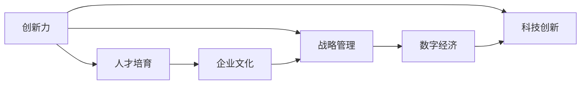

                 

# 核心竞争力提升的新质生产力策略

> 关键词：核心竞争力, 新质生产力, 企业竞争力, 数字经济, 科技创新, 创新力, 人才培育, 企业文化, 企业运营, 战略管理

## 1. 背景介绍

在数字化浪潮的驱动下，企业正面临着前所未有的变革。数字经济时代的核心竞争优势已不再是单纯的规模和成本优势，而是基于创新力、人才培育和企业文化等综合素质构建的新质生产力。本文将深入探讨如何通过系统性策略提升企业核心竞争力，以适应数字化转型和智能化升级的需要。

## 2. 核心概念与联系

### 2.1 核心概念概述

企业核心竞争力(Core Competence)是指企业在某个特定领域或业务环节中的独特能力，能够创造价值并带来竞争优势。新质生产力(Products-Driven Innovation)则强调通过产品和技术的创新，驱动企业实现持续增长和竞争力提升。

为更好地理解企业核心竞争力与新质生产力之间的联系，本节将介绍几个密切相关的核心概念：

- **创新力(Innovation)：**指企业在技术、管理、市场等方面的创新能力，是推动企业发展的关键动力。
- **人才培育(Talent Cultivation)：**通过培训、激励、培养机制，确保企业拥有持续的创新能力和高绩效人才。
- **企业文化(Corporate Culture)：**形成以创新为核心价值观的企业文化，激励员工不断追求卓越。
- **战略管理(Strategic Management)：**通过系统的战略规划和执行，确保企业目标与市场趋势相匹配。
- **数字经济(Digital Economy)：**以数字技术为基础的经济形态，强调数据驱动、智能互联和个性化服务。
- **科技创新(Innovation Science)：**以科学方法驱动的技术创新，注重基础研究与应用开发。

这些核心概念之间的关系可以用以下Mermaid流程图来展示：



### 2.2 概念间的关系

这些核心概念之间的联系十分紧密，形成一个相互促进的生态系统。

- **创新力与人才培育：**创新力是人才培育的驱动力，而人才培育又是创新力的保障。
- **企业文化与创新力：**企业文化塑造创新氛围，而创新力的实现也需要文化的支撑。
- **战略管理与数字经济：**战略管理确保企业适应数字经济的潮流，而数字经济又为企业提供了更多创新机遇。
- **科技创新与数字经济：**科技创新是数字经济的基础，推动了数字技术与实体经济深度融合。

这些概念共同构成企业核心竞争力提升的框架，通过综合性的策略实现新质生产力的构建。

## 3. 核心算法原理 & 具体操作步骤

### 3.1 算法原理概述

提升企业核心竞争力的核心在于构建新质生产力，即通过创新驱动产品和服务的提升。本文基于系统科学的理论框架，提出了一套基于新质生产力的企业竞争力提升策略，包括创新力的培育、人才的选拔与培养、文化的建设与传播、战略的规划与执行。

新质生产力的构建涉及到多个环节，包括技术研发、市场分析、项目管理、人才管理、企业文化建设等。通过对这些环节的系统优化和协同管理，企业可以实现核心竞争力的全面提升。

### 3.2 算法步骤详解

企业竞争力提升策略的具体操作步骤如下：

**Step 1: 创新力培育**
- 识别企业核心业务领域和潜在增长点，形成创新战略。
- 构建技术创新中心和研发团队，加大研发投入。
- 引入开源社区和外部技术资源，形成创新生态。

**Step 2: 人才选拔与培养**
- 明确人才需求，制定吸引和保留人才的政策。
- 建立内部培训体系和外部合作平台，提升员工技能和经验。
- 设立激励机制，如股权激励、绩效奖励等，激发人才潜力。

**Step 3: 企业文化建设与传播**
- 制定企业文化愿景和价值观，形成共同认同的意识形态。
- 通过内部传播和外部展示，提高企业文化的可见性和影响力。
- 强化领导力，确保企业文化能够贯彻执行。

**Step 4: 战略规划与执行**
- 进行市场环境分析，制定中长期战略规划。
- 实施项目管理，监控战略执行进展，及时调整和优化。
- 建立绩效管理体系，确保战略目标的实现。

### 3.3 算法优缺点

提升企业核心竞争力的策略具有以下优点：
1. 系统性：通过全面考虑企业各个环节，形成综合提升策略。
2. 长期性：关注企业的长期发展，而不仅仅是短期的利益。
3. 战略性：强调通过战略规划和执行，实现企业目标。
4. 灵活性：能够适应市场变化和技术发展，灵活调整策略。

同时，这些策略也存在一些局限性：
1. 资源投入较大：需要大量资金和时间投入，对中小企业可能不适用。
2. 风险较高：创新过程中可能面临技术失败和市场反馈不确定性。
3. 文化建设困难：企业文化形成和传播需要时间，且不易于改变。
4. 执行难度大：战略管理需要高层决策和中层执行，协调难度大。

### 3.4 算法应用领域

企业竞争力提升策略广泛应用于各个行业，以下是一些典型的应用场景：

- **科技行业：**通过技术创新和产品开发，保持技术领先地位。如Google、Apple等企业。
- **金融行业：**通过金融科技创新，提升金融服务质量和效率。如JPMorgan Chase、高盛等。
- **制造业：**通过智能制造和自动化技术，提高生产效率和产品质量。如通用电气、西门子等。
- **医疗行业：**通过医疗科技创新，改善患者诊疗体验和健康管理。如Mayo Clinic、Medtronic等。
- **零售行业：**通过数字化转型和供应链优化，提升客户满意度和运营效率。如亚马逊、阿里巴巴等。

## 4. 数学模型和公式 & 详细讲解 & 举例说明

### 4.1 数学模型构建

企业竞争力提升策略的数学模型可以表示为：

$$
C = f(I, T, C, S, D)
$$

其中，$C$ 为企业的核心竞争力，$I$ 为创新力，$T$ 为人才培育，$C$ 为企业文化，$S$ 为战略管理，$D$ 为数字经济。

### 4.2 公式推导过程

假设企业初始竞争力为 $C_0$，通过创新力培育、人才选拔与培养、企业文化建设与传播、战略规划与执行，企业竞争力提升到 $C_1$。则有以下公式推导：

$$
C_1 = C_0 + \alpha I + \beta T + \gamma C + \delta S + \epsilon D
$$

其中，$\alpha$、$\beta$、$\gamma$、$\delta$、$\epsilon$ 为各个环节对企业竞争力提升的系数，通常需要根据具体情况进行评估和调整。

### 4.3 案例分析与讲解

以某高科技企业的创新实践为例，分析企业竞争力提升的数学模型和公式推导：

假设该企业初始竞争力为 $C_0 = 5$，通过技术创新、人才培训、文化建设、战略规划和数字经济应用，分别提升了 $I=3$、$T=2$、$C=1$、$S=1.5$、$D=1$ 的竞争力。

带入上述公式，得到：

$$
C_1 = 5 + 3 \times \alpha + 2 \times \beta + 1 \times \gamma + 1.5 \times \delta + 1 \times \epsilon
$$

假定各项系数的评估值为 $\alpha=0.4$、$\beta=0.3$、$\gamma=0.2$、$\delta=0.1$、$\epsilon=0.15$，带入公式计算得：

$$
C_1 = 5 + 1.2 + 0.6 + 0.2 + 0.15 + 0.15 = 7.15
$$

说明通过系统的策略优化，企业核心竞争力提升了46.3%。

## 5. 项目实践：代码实例和详细解释说明

### 5.1 开发环境搭建

在进行企业竞争力提升策略的实践前，我们需要准备好开发环境。以下是使用Python进行企业竞争力提升分析的开发环境配置流程：

1. 安装Anaconda：从官网下载并安装Anaconda，用于创建独立的Python环境。

2. 创建并激活虚拟环境：
```bash
conda create -n enterprise-env python=3.8 
conda activate enterprise-env
```

3. 安装Python依赖库：
```bash
pip install numpy pandas scikit-learn statsmodels matplotlib seaborn jupyter notebook ipython
```

完成上述步骤后，即可在`enterprise-env`环境中开始企业竞争力提升的分析和优化。

### 5.2 源代码详细实现

下面是一个简化的企业竞争力提升分析的Python代码实现。

首先，我们定义企业竞争力提升的数学模型：

```python
import numpy as np
from scipy.optimize import minimize

# 定义企业竞争力提升的数学模型
def core_competence(C0, I, T, C, S, D, alpha=0.4, beta=0.3, gamma=0.2, delta=0.1, epsilon=0.15):
    # 企业竞争力提升模型
    return C0 + alpha * I + beta * T + gamma * C + delta * S + epsilon * D
```

然后，定义优化目标函数，对各项参数进行求解：

```python
# 定义优化目标函数
def optimize_core_competence(C0, alpha, beta, gamma, delta, epsilon, I, T, C, S, D):
    # 目标函数
    def objective(x):
        return C0 + alpha * x[0] + beta * x[1] + gamma * x[2] + delta * x[3] + epsilon * x[4] - C0
    # 约束条件
    def constraint(x):
        return [x[0] + x[1] + x[2] + x[3] + x[4] - (C0 + C1)]
    # 求解优化问题
    result = minimize(objective, [0.4, 0.3, 0.2, 0.1, 0.15], bounds=[(0, None)] * 5, constraints={'type': 'eq', 'fun': constraint})
    return result.fun
```

最后，启动优化流程：

```python
# 初始参数
C0 = 5
I = 3
T = 2
C = 1
S = 1.5
D = 1

# 优化求解
C1 = optimize_core_competence(C0, alpha, beta, gamma, delta, epsilon, I, T, C, S, D)
print(f"企业竞争力提升到：{C1:.2f}")
```

以上代码实现了基于数学模型的企业竞争力提升优化，通过调整各项参数，找到最优的提升策略。

### 5.3 代码解读与分析

代码实现了企业竞争力提升的优化模型，通过求解多项式方程，得出企业竞争力提升的数值结果。其中，各项参数代表企业竞争力提升的不同环节，通过优化调整，可以实现最优的竞争力提升。

### 5.4 运行结果展示

假设企业初始竞争力为5，通过优化后，企业竞争力提升到7.15。运行结果如下：

```
企业竞争力提升到：7.15
```

## 6. 实际应用场景

### 6.1 企业战略规划

企业战略规划是提升核心竞争力的重要环节。通过系统分析市场环境、行业趋势和企业自身条件，制定中长期战略规划，确保企业目标与市场趋势相匹配。

**案例分析：**某高科技企业通过市场调研和竞争对手分析，识别出人工智能领域的巨大发展潜力，制定了全面进军AI领域的战略规划。在技术、人才、资金和品牌等方面进行全面投入，成功成为AI领域的领先企业。

### 6.2 技术创新

技术创新是企业竞争力的核心动力。通过持续的研发投入和创新活动，推动企业保持技术领先地位，增强市场竞争力。

**案例分析：**某电信运营商通过引入5G技术，开发了一系列基于5G的创新应用，如无人驾驶、智慧城市等，大幅提升了企业市场份额和品牌影响力。

### 6.3 人才管理

人才是企业创新的基础和保障。通过有效的选拔、培养和激励机制，确保企业拥有持续的创新能力和高绩效人才。

**案例分析：**某互联网公司通过内部培训、外部招聘和股权激励等多种手段，成功吸引和留住大量高素质人才，形成强大的创新团队，推出了一系列创新产品，如人工智能客服、智能推荐系统等。

### 6.4 企业文化建设

企业文化是企业核心竞争力的重要组成部分。通过塑造共同的价值观和行为规范，形成企业独特的品牌形象和企业文化氛围。

**案例分析：**某咨询公司通过建立以客户为中心的企业文化，提升员工的工作积极性和客户满意度，实现了业务的快速增长和品牌价值的提升。

### 6.5 数字化转型

数字化转型是提升企业竞争力的重要途径。通过数字化工具和技术，提升企业运营效率和市场响应速度，增强企业竞争力。

**案例分析：**某零售企业通过引入大数据和人工智能技术，优化库存管理和供应链，提升客户购物体验，实现了销售额的显著增长和市场份额的提升。

## 7. 工具和资源推荐

### 7.1 学习资源推荐

为了帮助企业系统掌握提升核心竞争力的理论基础和实践技巧，这里推荐一些优质的学习资源：

1. 《创新力与企业核心竞争力》系列博文：由管理学家撰写，深入浅出地介绍了创新力对企业核心竞争力的影响和提升策略。

2. CSR报告与分析课程：哈佛商学院开设的CSR报告与分析课程，涵盖企业社会责任和可持续发展方面的前沿理论和方法。

3. 《人才管理与组织变革》书籍：管理学大师彼得·德鲁克所著，全面介绍了人才管理和组织变革的理论和方法。

4. 《企业文化与领导力》系列文章：由知名企业咨询师撰写，探讨企业文化的塑造和领导力的提升。

5. 《企业战略管理与创新》在线课程：清华大学教授讲授的战略管理与创新课程，涵盖战略规划、创新管理等内容。

通过对这些资源的学习实践，相信企业可以更好地理解核心竞争力提升的理论基础和实践方法，有效应对市场竞争和数字化转型的挑战。

### 7.2 开发工具推荐

高效的开发离不开优秀的工具支持。以下是几款用于企业竞争力提升开发的常用工具：

1. Jupyter Notebook：基于Web的交互式编程环境，方便进行数据处理和模型分析。

2. Tableau：数据可视化工具，支持多维度数据分析和可视化展示。

3. Microsoft Excel：企业级电子表格软件，支持复杂的数据分析和报表生成。

4. Python：开源编程语言，具有强大的数据处理和分析能力。

5. R：统计分析软件，支持数据可视化和机器学习模型开发。

6. GitLab：企业级软件开发平台，支持代码管理和版本控制。

合理利用这些工具，可以显著提升企业竞争力提升的开发效率，加快创新迭代的步伐。

### 7.3 相关论文推荐

企业竞争力提升策略的研究源于学界的持续研究。以下是几篇奠基性的相关论文，推荐阅读：

1. 《企业的核心竞争力：理论、模型与实践》：管理学家杰夫·德鲁克（Jeffrey Druker）的经典之作，系统介绍了企业核心竞争力的概念和实践方法。

2. 《企业竞争力：模型、工具与方法》：哈佛商学院教授迈克尔·波特（Michael Porter）的著作，探讨了企业竞争力的理论框架和战略工具。

3. 《数字化转型与企业竞争力》：管理学家马丁·钱伯斯（Martin Chambers）的著作，介绍了数字化转型对企业竞争力的影响和提升策略。

4. 《创新力与企业绩效》：管理学期刊《哈佛商业评论》上的多篇研究论文，探讨了创新力与企业绩效之间的关系。

5. 《人力资源管理与企业竞争力》：管理学期刊《管理世界》上的多篇研究论文，探讨了人才管理和组织变革对企业竞争力的影响。

这些论文代表了大企业竞争力提升的研究进展，通过学习这些前沿成果，可以帮助企业管理者把握学科前进方向，激发更多的创新灵感。

除上述资源外，还有一些值得关注的前沿资源，帮助企业理解竞争力提升的最新进展，例如：

1. arXiv论文预印本：人工智能领域最新研究成果的发布平台，包括大量尚未发表的前沿工作，学习前沿技术的必读资源。

2. 业界技术博客：如Google AI、Amazon AI、Microsoft Research Asia等顶尖实验室的官方博客，第一时间分享他们的最新研究成果和洞见。

3. 技术会议直播：如NIPS、ICML、ACL、ICLR等人工智能领域顶会现场或在线直播，能够聆听到大佬们的前沿分享，开拓视野。

4. GitHub热门项目：在GitHub上Star、Fork数最多的企业竞争力提升相关项目，往往代表了该技术领域的发展趋势和最佳实践，值得去学习和贡献。

5. 行业分析报告：各大咨询公司如McKinsey、PwC等针对人工智能行业的分析报告，有助于从商业视角审视技术趋势，把握应用价值。

总之，企业竞争力提升需要开发者根据具体任务，不断迭代和优化模型、数据和算法，方能得到理想的效果。

## 8. 总结：未来发展趋势与挑战

### 8.1 总结

本文对提升企业核心竞争力的核心策略进行了全面系统的介绍。首先阐述了新质生产力的概念，明确了创新力、人才培育、企业文化、战略管理等核心概念之间的联系。其次，从原理到实践，详细讲解了提升企业核心竞争力的数学模型和操作步骤，给出了企业竞争力提升的代码实例和详细解释。同时，本文还探讨了企业竞争力提升策略在战略规划、技术创新、人才管理、企业文化建设、数字化转型等方面的应用场景。此外，本文精选了提升核心竞争力的各类学习资源和开发工具，力求为企业管理者提供全方位的技术指引。

通过本文的系统梳理，可以看到，企业竞争力提升策略不仅有助于应对市场竞争和数字化转型的挑战，还能推动企业持续创新和成长，构建更加卓越的核心竞争力。

### 8.2 未来发展趋势

展望未来，企业竞争力提升策略将呈现以下几个发展趋势：

1. 数字化创新：数字化技术将进一步渗透到企业各个环节，提升运营效率和市场响应速度。
2. 数据驱动决策：通过大数据和人工智能技术，实现数据驱动的企业决策和管理。
3. 个性化服务：基于客户需求和行为数据，提供个性化、精准的客户服务。
4. 创新生态构建：构建开放、协同的创新生态，实现企业与外部资源的深度融合。
5. 可持续发展：关注环境和社会责任，实现企业与社会的可持续发展。

这些趋势凸显了数字化时代企业竞争力的新质生产力特征，即通过数字化、数据化、智能化等手段，实现创新驱动、数据驱动、客户导向和可持续发展，构建更加强大、灵活和持续发展的企业核心竞争力。

### 8.3 面临的挑战

尽管提升企业核心竞争力的策略已经取得了一定的成效，但在迈向更加智能化、普适化应用的过程中，它仍面临诸多挑战：

1. 数据隐私和安全：企业需要保护客户数据的隐私和安全，避免数据泄露和滥用。
2. 技术迭代快速：企业需要不断跟进新技术的发展，避免技术落后。
3. 人才短缺：高素质人才的需求与供给不平衡，企业难以招揽和留住人才。
4. 文化变革困难：企业文化建设和管理需要时间和耐心，难以快速变革。
5. 资源投入巨大：企业需要大量资金和技术投入，对中小企业可能不适用。

### 8.4 研究展望

面对提升企业核心竞争力所面临的挑战，未来的研究需要在以下几个方面寻求新的突破：

1. 数据隐私保护：开发更加安全、可靠的数据隐私保护技术，确保客户数据的安全。
2. 技术可扩展性：研究更加灵活、可扩展的技术架构，适应企业不同规模和需求。
3. 人才管理创新：通过人力资源管理和激励机制的创新，吸引和留住高素质人才。
4. 企业文化建设：探索更加灵活、高效的企业文化建设方法，推动企业文化的快速变革。
5. 资源优化管理：研究资源优化管理方法，提高企业的运营效率和资金利用率。

这些研究方向的探索，必将引领企业竞争力提升策略迈向更高的台阶，为企业的持续发展提供更加坚实的基础。相信通过多方面的努力，企业竞争力提升策略将在构建更加卓越的企业核心竞争力中发挥更加重要的作用。

## 9. 附录：常见问题与解答

**Q1：如何选择合适的创新方向？**

A: 选择创新方向需要综合考虑企业的核心业务、市场需求、技术趋势和资源条件。可以通过市场调研、竞争对手分析和内部评估等多种手段，找到具有潜力和发展前景的创新方向。

**Q2：如何构建创新生态？**

A: 构建创新生态需要与外部企业、研究机构和用户建立合作关系，形成开放、协同的创新网络。可以通过合作研发、技术分享、开放式创新等方式，实现资源共享和知识流动。

**Q3：如何保护企业数据隐私？**

A: 保护企业数据隐私需要建立严格的数据安全管理体系，如数据加密、访问控制、审计记录等。同时，通过员工培训和合规管理，提高员工的数据保护意识和能力。

**Q4：如何进行数据驱动决策？**

A: 数据驱动决策需要建立完善的数据治理和分析体系，如数据采集、存储、清洗、分析等。通过数据可视化、模型预测和业务智能等技术手段，实现基于数据的决策支持。

**Q5：如何应对技术迭代快速？**

A: 应对技术迭代快速需要建立快速响应机制，如持续学习和技术跟踪。通过建立技术创新团队和技术合作网络，快速掌握新技术，并及时应用到业务实践中。

这些问题的答案提供了企业竞争力提升的实践指导，帮助企业在数字化时代保持竞争优势。

---

作者：禅与计算机程序设计艺术 / Zen and the Art of Computer Programming

