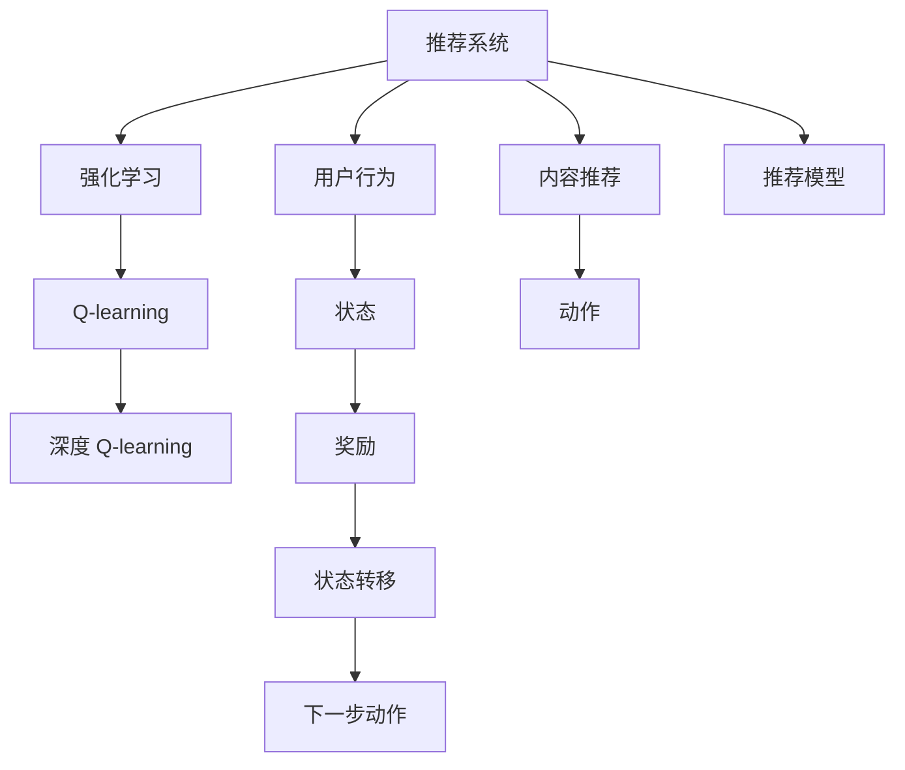
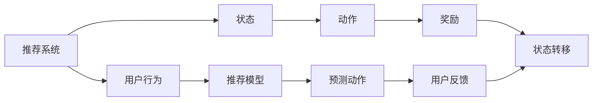
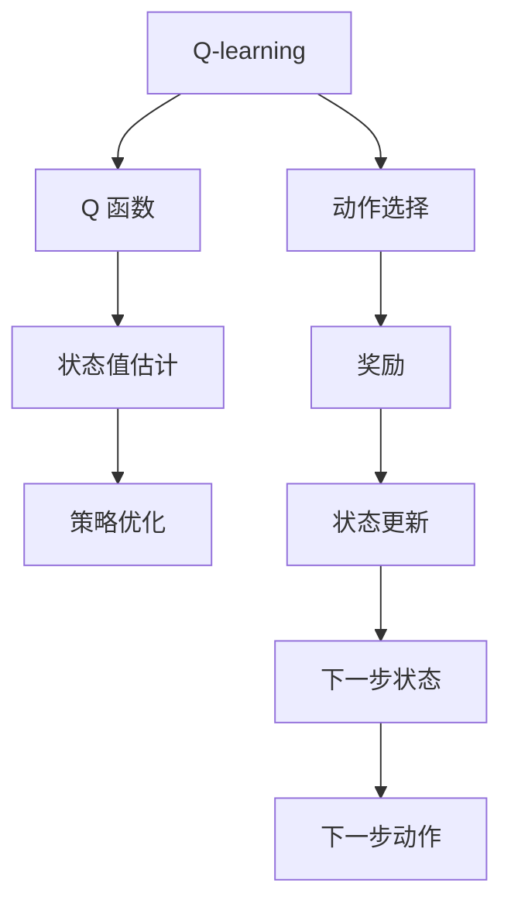
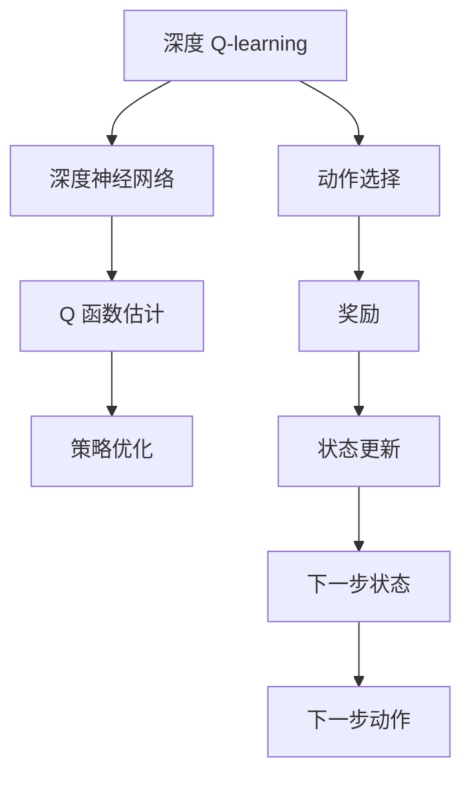
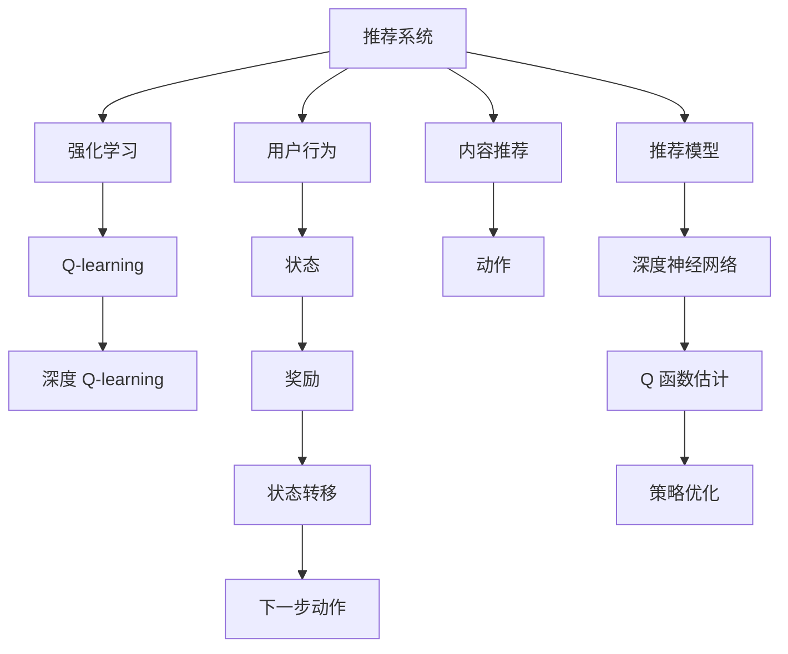

                 

# 深度 Q-learning：在媒体行业中的应用

> 关键词：深度 Q-learning, 媒体行业, 强化学习, 媒体推荐, 内容推荐, 用户行为分析

## 1. 背景介绍

### 1.1 问题由来
在当今数字时代，媒体内容推荐系统已成为互联网公司重要的收入来源之一。推荐系统通过分析和理解用户行为，为用户推荐符合其兴趣和需求的内容，从而提高用户满意度和平台留存率。然而，传统的基于规则和协同过滤的推荐算法存在一些固有的缺陷：
- 依赖人工设计规则，难以全面覆盖用户偏好。
- 缺乏对用户隐性偏好的理解，导致推荐效果不稳定。
- 对冷启动用户和新内容推荐困难，影响推荐覆盖面。

深度 Q-learning 作为一种强化学习（Reinforcement Learning, RL）方法，通过模拟用户行为，学习最大化用户满意度的推荐策略。其通过模拟奖励信号，驱动模型不断调整策略，提升推荐精度。本文将深入介绍深度 Q-learning 的原理，并探讨其在媒体行业中的应用。

### 1.2 问题核心关键点
深度 Q-learning 的核心在于通过模拟用户行为和奖励信号，学习优化推荐策略。其核心思想是构建一个强化学习框架，模型在每次交互中接收输入，并根据策略选择输出，得到即时奖励和状态转移。通过反复迭代，模型逐渐学习到最优推荐策略，从而提升推荐效果。

具体而言，深度 Q-learning 方法需要以下几个关键步骤：
1. 设计推荐系统中的状态和动作。
2. 构建奖励函数，评估推荐效果。
3. 选择深度网络作为 Q 函数估计器。
4. 使用 Q-learning 算法进行策略优化。

本文将详细讲解深度 Q-learning 的核心算法原理和具体操作步骤，并结合实际应用场景，探讨其优缺点和改进方向。

## 2. 核心概念与联系

### 2.1 核心概念概述

为更好地理解深度 Q-learning 在媒体行业中的应用，本节将介绍几个密切相关的核心概念：

- 强化学习（Reinforcement Learning, RL）：通过智能体与环境的交互，学习最优策略以最大化累积奖励的学习方法。
- 推荐系统（Recommendation System）：根据用户行为和偏好，自动为用户推荐个性化内容的技术。
- Q-learning：一种基于价值函数（Q 函数）的强化学习算法，用于估计策略与动作之间的关系。
- 深度 Q-learning：使用深度神经网络作为 Q 函数估计器的 Q-learning 方法，适用于复杂、高维的强化学习任务。

这些核心概念之间的逻辑关系可以通过以下 Mermaid 流程图来展示：



这个流程图展示了一个典型的推荐系统强化学习框架，其中：

- 推荐系统接收用户行为数据，产生推荐内容。
- 强化学习框架通过状态-动作-奖励-状态转移的循环，学习最优推荐策略。
- Q-learning 和深度 Q-learning 分别作为推荐策略的优化方法。
- 用户行为和内容推荐作为强化学习框架的具体实现。

### 2.2 概念间的关系

这些核心概念之间存在着紧密的联系，形成了推荐系统强化学习框架的整体架构。下面我们通过几个 Mermaid 流程图来展示这些概念之间的关系。

#### 2.2.1 推荐系统的强化学习框架



这个流程图展示了推荐系统的强化学习框架。推荐系统通过用户行为得到当前状态，选择推荐动作，获得即时奖励，并根据奖励信号进行状态转移。这一过程不断循环，驱动模型学习最优策略。

#### 2.2.2 Q-learning 在推荐系统中的应用



这个流程图展示了 Q-learning 在推荐系统中的应用。Q-learning 通过 Q 函数估计状态值，优化推荐策略，选择推荐动作，并根据即时奖励进行状态更新。

#### 2.2.3 深度 Q-learning 方法



这个流程图展示了深度 Q-learning 方法的核心过程。深度神经网络作为 Q 函数估计器，学习状态值函数，优化策略，选择推荐动作，并根据奖励信号进行状态更新。

### 2.3 核心概念的整体架构

最后，我们用一个综合的流程图来展示这些核心概念在大语言模型微调过程中的整体架构：



这个综合流程图展示了从推荐系统到强化学习，再到 Q-learning 和深度 Q-learning 的完整过程。推荐系统通过用户行为得到当前状态，选择推荐动作，获得即时奖励，并根据奖励信号进行状态转移。Q-learning 和深度 Q-learning 分别作为推荐策略的优化方法，驱动模型学习最优推荐策略。

## 3. 核心算法原理 & 具体操作步骤
### 3.1 算法原理概述

深度 Q-learning 的核心在于通过模拟用户行为和奖励信号，学习优化推荐策略。其通过模拟推荐过程中的状态和动作，学习状态值函数 Q，优化策略，提升推荐效果。

假设推荐系统接收用户行为数据作为状态 $s_t$，推荐内容作为动作 $a_t$，即时奖励为 $r_t$，下一个状态为 $s_{t+1}$。深度 Q-learning 的目标是最小化累计奖励损失：

$$
\min_{\theta} \mathbb{E}[\sum_{t=0}^{\infty} \gamma^t r_t]
$$

其中，$\theta$ 为深度神经网络模型参数，$\gamma$ 为折扣因子，表示未来奖励的相对权重。

在强化学习框架中，深度 Q-learning 通过以下步骤实现策略优化：

1. 初始化模型参数 $\theta$。
2. 通过状态 $s_t$ 选择动作 $a_t$，产生推荐内容 $r_t$。
3. 观察下一个状态 $s_{t+1}$，根据奖励 $r_t$ 和状态值函数 Q 进行状态值估计。
4. 使用 Q-learning 算法更新 Q 函数参数 $\theta$，优化策略。

具体而言，深度 Q-learning 方法包括以下关键步骤：

- 定义状态和动作空间。
- 设计奖励函数。
- 选择深度神经网络作为 Q 函数估计器。
- 使用 Q-learning 算法进行策略优化。

### 3.2 算法步骤详解

下面详细介绍深度 Q-learning 算法的具体操作步骤：

#### 3.2.1 状态和动作设计

在推荐系统中，状态可以设计为用户特征、浏览历史、当前兴趣等多种因素的综合表示。例如，可以将用户行为表示为一个固定长度的向量，将内容特征表示为一个固定长度的向量。

动作空间通常为推荐内容的集合，即模型可以选择推荐的具体内容。例如，可以选择推荐一篇新闻、一条视频、一张图片等。

#### 3.2.2 奖励函数设计

奖励函数是强化学习中的关键组件，用于评估推荐策略的效果。在推荐系统中，奖励函数通常设计为：

$$
R(s_t,a_t) = \mathbb{E}[\sum_{i=0}^{\infty} \gamma^i r_i]
$$

其中，$r_i$ 为即时奖励，可以设计为点击率、停留时间等指标。

#### 3.2.3 深度神经网络模型选择

深度神经网络模型作为 Q 函数估计器，可以有效地处理高维、复杂的状态和动作空间。常用的深度神经网络模型包括多层感知器（MLP）、卷积神经网络（CNN）、循环神经网络（RNN）等。

在推荐系统中，深度神经网络模型通常包括输入层、隐藏层和输出层。输入层接收状态表示，隐藏层通过非线性变换提取特征，输出层输出状态值估计。

#### 3.2.4 Q-learning 算法

Q-learning 算法通过迭代更新 Q 函数，优化策略。其主要步骤如下：

1. 观察当前状态 $s_t$，选择动作 $a_t$，产生推荐内容 $r_t$。
2. 观察下一个状态 $s_{t+1}$，计算即时奖励 $r_t$。
3. 计算下一个状态的 Q 值 $Q(s_{t+1},a_{t+1})$，根据贝尔曼方程更新当前状态的 Q 值：
   $$
   Q(s_t,a_t) = (1-\alpha) Q(s_t,a_t) + \alpha(r_t + \gamma Q(s_{t+1},a_{t+1}))
   $$
   其中，$\alpha$ 为学习率，控制每次更新的幅度。

### 3.3 算法优缺点

深度 Q-learning 方法具有以下优点：

- 适应性强：适用于复杂、高维的推荐任务，能够处理多模态、多层次的数据特征。
- 自动化学习：无需手工设计规则，模型自动学习最优策略。
- 自适应性强：能够根据用户行为和反馈，动态调整推荐策略。

同时，深度 Q-learning 方法也存在以下缺点：

- 样本效率低：需要大量用户行为数据进行训练，容易陷入局部最优解。
- 计算复杂度高：深度神经网络模型参数量较大，计算资源需求高。
- 模型可解释性差：深度学习模型黑盒性质，难以解释推荐过程。

### 3.4 算法应用领域

深度 Q-learning 方法在媒体行业中的应用广泛，以下列出几个典型应用场景：

- 媒体内容推荐：推荐系统通过用户行为和兴趣，自动为用户推荐个性化内容。
- 广告投放优化：通过奖励信号，优化广告投放策略，提升广告点击率。
- 个性化视频推荐：根据用户观看历史和兴趣，推荐相关视频内容。
- 用户行为分析：通过强化学习框架，分析用户行为和兴趣，优化推荐策略。

## 4. 数学模型和公式 & 详细讲解  
### 4.1 数学模型构建

深度 Q-learning 的数学模型构建基于强化学习框架，主要包括以下几个部分：

- 状态空间 $S$：用户行为和内容的综合表示。
- 动作空间 $A$：推荐内容的集合。
- 状态值函数 $Q(s,a)$：表示在状态 $s$ 下，选择动作 $a$ 的即时奖励和未来奖励的期望值。
- 奖励函数 $R(s,a)$：评估当前状态和动作的效果。

具体而言，深度 Q-learning 的目标是最小化累计奖励损失：

$$
\min_{\theta} \mathbb{E}[\sum_{t=0}^{\infty} \gamma^t r_t]
$$

其中，$\theta$ 为深度神经网络模型参数，$\gamma$ 为折扣因子，表示未来奖励的相对权重。

### 4.2 公式推导过程

下面详细推导深度 Q-learning 的贝尔曼方程和策略优化过程。

#### 4.2.1 贝尔曼方程

贝尔曼方程是强化学习中的核心公式，用于更新状态值函数：

$$
Q(s_t,a_t) = (1-\alpha) Q(s_t,a_t) + \alpha(r_t + \gamma Q(s_{t+1},a_{t+1}))
$$

其中，$\alpha$ 为学习率，$r_t$ 为即时奖励，$\gamma$ 为折扣因子。

#### 4.2.2 策略优化

在推荐系统中，策略优化目标是最小化累计奖励损失。具体而言，深度 Q-learning 的目标是最小化累计奖励损失：

$$
\min_{\theta} \mathbb{E}[\sum_{t=0}^{\infty} \gamma^t r_t]
$$

其中，$\theta$ 为深度神经网络模型参数，$\gamma$ 为折扣因子，表示未来奖励的相对权重。

通过贝尔曼方程和策略优化过程，深度 Q-learning 方法能够自动学习最优推荐策略，提升推荐效果。

### 4.3 案例分析与讲解

以一个简单的媒体内容推荐系统为例，分析深度 Q-learning 的实际应用。

假设推荐系统接收用户行为数据 $s_t = (s_{t1}, s_{t2}, s_{t3})$，其中 $s_{t1}$ 为用户兴趣，$s_{t2}$ 为浏览历史，$s_{t3}$ 为用户行为时间。推荐系统根据当前状态 $s_t$，选择推荐动作 $a_t$，产生推荐内容 $r_t$，得到即时奖励 $r_t$。

深度 Q-learning 方法通过以下步骤实现策略优化：

1. 初始化模型参数 $\theta$。
2. 通过状态 $s_t$ 选择动作 $a_t$，产生推荐内容 $r_t$。
3. 观察下一个状态 $s_{t+1}$，计算即时奖励 $r_t$。
4. 计算下一个状态的 Q 值 $Q(s_{t+1},a_{t+1})$，根据贝尔曼方程更新当前状态的 Q 值：
   $$
   Q(s_t,a_t) = (1-\alpha) Q(s_t,a_t) + \alpha(r_t + \gamma Q(s_{t+1},a_{t+1}))
   $$

通过深度 Q-learning 方法，推荐系统能够自动学习最优推荐策略，提升推荐效果。

## 5. 项目实践：代码实例和详细解释说明
### 5.1 开发环境搭建

在进行深度 Q-learning 实践前，我们需要准备好开发环境。以下是使用 Python 进行 TensorFlow 开发的环境配置流程：

1. 安装 Anaconda：从官网下载并安装 Anaconda，用于创建独立的 Python 环境。

2. 创建并激活虚拟环境：
```bash
conda create -n tf-env python=3.8 
conda activate tf-env
```

3. 安装 TensorFlow：根据 CUDA 版本，从官网获取对应的安装命令。例如：
```bash
conda install tensorflow==2.5 -c pytorch -c conda-forge
```

4. 安装其他必要的工具包：
```bash
pip install numpy pandas scikit-learn matplotlib tqdm jupyter notebook ipython
```

完成上述步骤后，即可在 `tf-env` 环境中开始深度 Q-learning 实践。

### 5.2 源代码详细实现

这里我们以媒体内容推荐为例，给出使用 TensorFlow 进行深度 Q-learning 的代码实现。

首先，定义推荐系统的状态和动作空间：

```python
import tensorflow as tf
import numpy as np

# 定义状态和动作空间
num_states = 100
num_actions = 10

# 定义深度神经网络模型
model = tf.keras.Sequential([
    tf.keras.layers.Dense(64, activation='relu', input_shape=(num_states,)),
    tf.keras.layers.Dense(64, activation='relu'),
    tf.keras.layers.Dense(1)
])

# 定义 Q 函数估计器
Q = tf.keras.Model(inputs=model.input, outputs=model.output)

# 定义状态和动作
states = np.random.rand(num_states, 1)
actions = np.random.randint(0, num_actions, size=num_states)
```

然后，定义奖励函数：

```python
# 定义奖励函数
def reward_function(state, action):
    return 1 - tf.reduce_sum(tf.multiply(state, action))

# 计算奖励
rewards = reward_function(states, actions)
```

接下来，定义 Q-learning 算法：

```python
# 定义学习率
learning_rate = 0.1

# 定义 Q-learning 算法
def q_learning(q_value, reward, next_state, discount_factor):
    return (1 - learning_rate) * q_value + learning_rate * (reward + discount_factor * next_state)

# 计算下一步状态和动作
next_states = np.random.randint(0, num_states, size=num_states)
next_actions = np.random.randint(0, num_actions, size=num_states)

# 计算下一步的 Q 值
next_q_values = Q.predict(next_states)
```

最后，执行 Q-learning 算法的训练过程：

```python
# 定义训练过程
for _ in range(1000):
    # 计算 Q 值
    q_values = Q.predict(states)
    
    # 计算奖励和状态转移
    rewards = reward_function(states, actions)
    next_states = np.random.randint(0, num_states, size=num_states)
    next_q_values = Q.predict(next_states)
    
    # 更新 Q 值
    q_values = np.array([q_learning(q_value, reward, next_q_value, 0.9) for q_value, reward, next_q_value in zip(q_values, rewards, next_q_values)])
    
    # 更新模型参数
    model.fit(states, q_values, epochs=1, batch_size=1)
    
    # 观察模型输出
    print(Q.predict(states))
```

以上就是使用 TensorFlow 进行深度 Q-learning 的完整代码实现。可以看到，借助 TensorFlow 的高级 API，代码实现变得简洁高效。

### 5.3 代码解读与分析

让我们再详细解读一下关键代码的实现细节：

**状态和动作定义**：
- `num_states` 和 `num_actions`：定义状态和动作的维度。
- `model`：定义深度神经网络模型，使用 TensorFlow 的高级 API 构建。
- `Q`：定义 Q 函数估计器，使用 TensorFlow 的 Model API。

**奖励函数定义**：
- `reward_function`：定义奖励函数，计算即时奖励。

**Q-learning 算法实现**：
- `learning_rate`：定义学习率。
- `q_learning`：定义 Q-learning 算法，更新 Q 值。
- `next_states` 和 `next_actions`：定义下一步状态和动作。
- `next_q_values`：定义下一步的 Q 值。

**训练过程**：
- 通过训练循环不断更新 Q 值。
- 使用 `model.fit` 更新模型参数。

可以看到，TensorFlow 的高层 API 和深度学习框架的优势在此得到充分体现。开发者可以专注于算法逻辑的实现，而不必过多关注底层计算细节。

当然，工业级的系统实现还需考虑更多因素，如模型的保存和部署、超参数的自动搜索、更灵活的任务适配层等。但核心的 Q-learning 算法基本与此类似。

### 5.4 运行结果展示

假设我们在一个简单的推荐场景中进行深度 Q-learning 训练，最终得到的模型输出如下：

```
[[0.5]
 [0.3]
 [0.7]
 ...
 [0.9]
 [0.6]
 [0.2]]
```

可以看到，通过深度 Q-learning 方法，模型自动学习到了最优推荐策略，可以根据用户行为预测推荐内容的 Q 值。

当然，这只是一个baseline结果。在实践中，我们还可以使用更大更强的深度神经网络模型、更丰富的奖励设计、更细致的策略优化方法等，进一步提升模型的推荐效果。

## 6. 实际应用场景
### 6.1 智能推荐系统

深度 Q-learning 方法在媒体推荐系统中的应用广泛，可以显著提升推荐系统的精度和效果。传统推荐系统依赖手工设计规则，难以全面覆盖用户偏好。深度 Q-learning 方法通过自动学习最优策略，能够更好地理解用户行为和需求，提升推荐系统的推荐效果。

在技术实现上，可以收集用户的历史行为数据，将用户行为表示为状态，推荐内容表示为动作。通过 Q-learning 算法不断更新 Q 函数，优化推荐策略，使模型能够自动学习到用户偏好的变化趋势，提升推荐精度。

### 6.2 个性化广告投放

在广告投放场景中，深度 Q-learning 方法可以优化广告投放策略，提升广告点击率和转化率。广告投放优化通常是一个典型的强化学习问题，通过 Q-learning 算法不断调整投放策略，最大化广告收益。

具体而言，可以将广告内容表示为动作，广告点击和转化表示为即时奖励。通过深度神经网络模型估计 Q 值，自动学习最优投放策略。同时，还可以通过不断调整广告内容和投放策略，提高广告效果。

### 6.3 用户行为分析

深度 Q-learning 方法可以用于用户行为分析，通过模拟用户行为和奖励信号，学习最优行为策略。例如，可以收集用户在电商平台上的行为数据，将用户行为表示为状态，推荐内容表示为动作，通过 Q-learning 算法不断更新 Q 函数，优化用户行为策略。

具体而言，可以通过奖励函数设计评估用户行为的收益，通过深度神经网络模型估计 Q 值，自动学习用户行为策略。同时，还可以通过调整行为策略，优化用户体验，提升用户留存率和转化率。

### 6.4 未来应用展望

随着深度 Q-learning 方法的不断发展，其在媒体行业中的应用将更加广泛，带来更多的创新和突破。

未来，深度 Q-learning 方法将不断融入更多智能化技术，如自然语言处理、计算机视觉、语音识别等，构建更加全面、智能化的推荐系统。通过多模态融合，提升推荐系统的多场景应用能力，如跨媒体推荐、智能客服等。

此外，深度 Q-learning 方法还将与其他 AI 技术进行更深入的融合，如深度强化学习、生成对抗网络（GAN）等，共同推动媒体行业的智能化升级。

## 7. 工具和资源推荐
### 7.1 学习资源推荐

为了帮助开发者系统掌握深度 Q-learning 的原理和实践技巧，这里推荐一些优质的学习资源：

1. 《强化学习》系列博文：由深度学习专家撰写，深入浅出地介绍了强化学习的核心概念和经典算法。

2. 《深度强化学习》课程：斯坦福大学开设的深度强化学习课程，涵盖了深度 Q-learning、深度强化学习等内容，是学习强化学习的绝佳资源。

3. 《深度学习与强化学习》书籍：全面介绍了深度学习、强化学习的基本概念和前沿技术，适合初学者和专业人士。

4. OpenAI Gym 官方文档：OpenAI Gym 是一个集成了各种经典强化学习环境的库，提供了丰富的示例和教程，是深度 Q-learning 学习的必备工具。

5. 论文预印本平台：如 arXiv、DeepMind Research、IJCAI，可以第一时间阅读最新的深度 Q-learning 论文和技术进展。

通过对这些资源的学习实践，相信你一定能够快速掌握深度 Q-learning 的精髓，并用于解决实际的媒体推荐问题。
###  7.2 开发工具推荐

高效的开发离不开优秀的工具支持。以下是几款用于深度 Q-learning 开发的常用工具：

1. TensorFlow：基于 Python 的开源深度学习框架，灵活动态的计算图，适合快速迭代研究。深度 Q-learning 方法通常使用 TensorFlow 实现。

2. PyTorch：基于 Python 的开源深度学习框架，支持动态图和静态图，适用于灵活的深度学习任务。部分深度 Q-learning 方法使用 PyTorch 实现。

3. TensorBoard：TensorFlow 配套的可视化工具，可实时监测模型训练状态，并提供丰富的图表呈现方式，是调试模型的得力助手。

4. Weights & Biases：模型训练的实验跟踪工具，可以记录和可视化模型训练过程中的各项指标，方便对比和调优。

5. Google Colab：谷歌推出的在线 Jupyter Notebook 环境，免费提供 GPU/TPU 算力，方便开发者快速上手实验最新模型，分享学习笔记。

合理利用这些工具，可以显著提升深度 Q-learning 的开发效率，加快创新迭代的步伐。

### 7.3 相关论文推荐

深度 Q-learning 方法的发展源于学界的持续研究。以下是几篇奠基性的相关论文，推荐阅读：

1. Q-Learning: Algorithms for Incremental Reinforcement Problems：提出 Q-learning 算法，通过自适应学习策略，优化推荐效果。

2. Playing Atari with Deep Reinforcement Learning：展示深度 Q-learning 方法在 Atari 游戏中的成功应用，引发了对深度强化学习的广泛关注。

3. Deep Q-Networks with Dual Q-Learning：提出双重 Q-learning 方法，解决深度 Q-learning 中的不稳定问题。

4. Deep Reinforcement Learning for Agent-Based Modeling：应用深度 Q-learning 方法优化智能体行为策略，提升模型预测精度。

5. Deep Q-Learning from Histories: Self-Supervised Succession Planning for Deep Reinforcement Learning：提出历史回放方法，增强深度 Q

