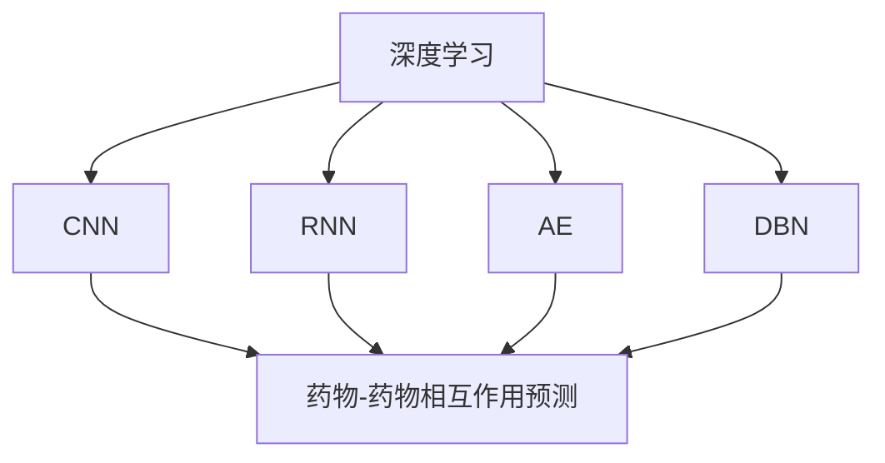
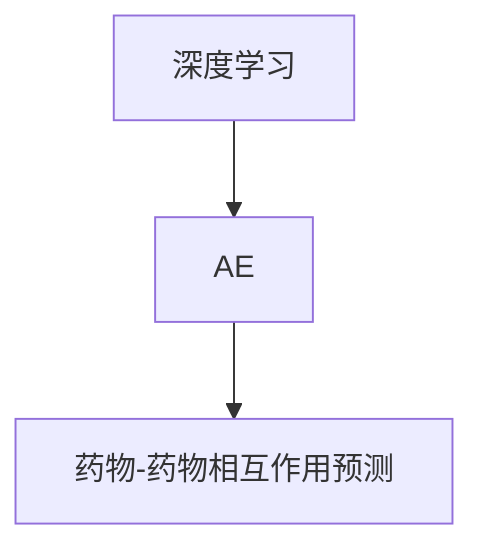
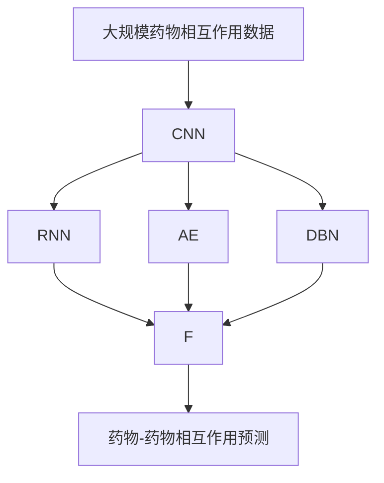

                 

# 深度学习在药物-药物相互作用预测中的应用

## 1. 背景介绍

### 1.1 问题由来
药物-药物相互作用（Drug-Drug Interaction, DDI）是指两种或两种以上药物同时使用时，由于药效增强或减弱，甚至产生新的药理效应。研究DDI对于合理用药、避免药害事故具有重要意义。传统上，DDI的研究主要依赖生物实验，如体外实验、动物实验等，但这些方法耗时长、成本高、且存在伦理风险。近年来，随着深度学习技术的发展，基于大数据的药物-药物相互作用预测成为研究热点。

### 1.2 问题核心关键点
深度学习技术在药物-药物相互作用预测中的应用，主要依赖于数据驱动和模型驱动两个关键点。

1. **数据驱动**：需要大量的药物-药物相互作用数据进行模型训练和验证。这些数据往往具有高维度、稀疏、不规则等特点，数据收集和预处理是一个重要挑战。

2. **模型驱动**：选择适当的深度学习模型，以自动提取药物相互作用的数据特征，并学习药物作用机制和相互作用规律。目前主要采用卷积神经网络（CNN）、循环神经网络（RNN）、自编码器（AE）、深度置信网络（DBN）等模型进行DDI预测。

### 1.3 问题研究意义
深度学习技术在药物-药物相互作用预测中的应用，对于提升合理用药水平，减少药物副作用和副作用的风险，具有重要意义。具体而言，可以实现以下目标：
- 提高DDI预测准确率。通过深度学习模型，可以从高维、稀疏的药物相互作用数据中提取出有用的特征，进行精准预测。
- 降低研究成本。相比于生物实验，基于深度学习的预测方法可以大幅降低研究成本和时间。
- 避免伦理风险。数据驱动的预测方法不涉及动物实验，符合现代医学伦理要求。

## 2. 核心概念与联系

### 2.1 核心概念概述

为了更好地理解深度学习在药物-药物相互作用预测中的应用，我们需要掌握一些核心概念：

- **深度学习**：一种基于多层神经网络结构的机器学习方法，能够自动学习数据特征，进行分类、回归等任务。
- **卷积神经网络（CNN）**：一种专门处理具有网格结构数据（如图像、文本等）的深度学习模型，通过卷积操作提取局部特征，适合处理结构化数据。
- **循环神经网络（RNN）**：一种专门处理序列数据的深度学习模型，能够自动捕捉数据的时序关系，适合处理时间序列数据。
- **自编码器（AE）**：一种无监督学习模型，通过重构输入数据，学习数据的低维表示，适合数据降维和特征提取。
- **深度置信网络（DBN）**：一种基于信念传播算法的前馈深度网络，能够自动提取输入数据的层次化特征，适合处理高维数据。
- **药物-药物相互作用（DDI）**：指两种或两种以上药物同时使用时，由于药效增强或减弱，甚至产生新的药理效应。研究DDI对于合理用药、避免药害事故具有重要意义。

这些核心概念之间的逻辑关系可以通过以下Mermaid流程图来展示：



这个流程图展示了大语言模型微调过程中各个核心概念的关系和作用。深度学习模型通过对药物相互作用数据的自动特征提取和模式学习，预测DDI的可能性。

### 2.2 概念间的关系

这些核心概念之间存在着紧密的联系，形成了深度学习在药物-药物相互作用预测中的完整生态系统。下面我们通过几个Mermaid流程图来展示这些概念之间的关系。

#### 2.2.1 深度学习与卷积神经网络的关系


这个流程图展示了大语言模型微调过程中深度学习与卷积神经网络的关系。卷积神经网络是深度学习中处理图像和文本等结构化数据的重要工具。在药物-药物相互作用预测中，通过CNN可以自动学习药物分子结构的数据特征，提取药物之间的相互作用关系。

#### 2.2.2 深度学习与循环神经网络的关系


这个流程图展示了大语言模型微调过程中深度学习与循环神经网络的关系。RNN能够自动捕捉药物相互作用数据的时序关系，适合处理时间序列数据。在药物-药物相互作用预测中，通过RNN可以学习药物作用的时间序列特征，预测DDI的动态变化。

#### 2.2.3 深度学习与自编码器的关系



这个流程图展示了大语言模型微调过程中深度学习与自编码器的关系。自编码器能够学习数据的高维表示，并进行降维处理。在药物-药物相互作用预测中，通过AE可以提取药物相互作用的低维特征，减少数据的复杂度，提高预测效率。

#### 2.2.4 深度学习与深度置信网络的关系


这个流程图展示了大语言模型微调过程中深度学习与深度置信网络的关系。DBN能够学习输入数据的多层次特征，适合处理高维数据。在药物-药物相互作用预测中，通过DBN可以自动学习药物相互作用的层次化特征，提高预测的准确性。

### 2.3 核心概念的整体架构

最后，我们用一个综合的流程图来展示这些核心概念在大语言模型微调过程中的整体架构：



这个综合流程图展示了从数据预处理到模型预测的完整过程。深度学习模型通过卷积神经网络、循环神经网络、自编码器和深度置信网络等工具，从高维、稀疏的药物相互作用数据中提取出有用的特征，进行精准预测。

## 3. 核心算法原理 & 具体操作步骤
### 3.1 算法原理概述

深度学习在药物-药物相互作用预测中的基本原理是通过神经网络自动学习药物相互作用的特征和规律，从而进行DDI预测。具体流程如下：

1. **数据预处理**：收集和预处理药物相互作用数据，包括药物名称、药物结构、相互作用类型等。
2. **模型构建**：选择适当的深度学习模型，如卷积神经网络、循环神经网络、自编码器、深度置信网络等。
3. **模型训练**：使用训练集数据训练深度学习模型，学习药物相互作用的特征和规律。
4. **模型验证**：使用验证集数据对模型进行验证，调整模型参数以提高预测准确性。
5. **模型测试**：使用测试集数据对模型进行测试，评估其预测性能。

### 3.2 算法步骤详解

下面以基于卷积神经网络的DDI预测模型为例，详细讲解深度学习在药物-药物相互作用预测中的操作步骤。

#### 3.2.1 数据预处理
药物相互作用数据通常具有高维、稀疏、不规则等特点。预处理的主要步骤包括：
- 数据清洗：去除缺失值、异常值等噪声数据。
- 特征提取：将药物名称、结构等转化为数值特征。
- 数据标准化：将数据归一化到标准范围内。
- 数据拆分：将数据集拆分为训练集、验证集和测试集。

#### 3.2.2 模型构建
以卷积神经网络为例，其基本架构如下：
```
input -> convolutional layer -> max pooling -> convolutional layer -> max pooling -> fully connected layer -> output
```

输入层接受药物相互作用数据的特征向量，通过卷积层提取局部特征，通过池化层提取重要特征，通过全连接层将特征向量映射到输出空间。输出层采用softmax激活函数，将模型预测结果转化为类别概率分布。

#### 3.2.3 模型训练
使用训练集数据训练模型，具体步骤如下：
- 定义损失函数：如交叉熵损失函数。
- 定义优化器：如Adam、SGD等。
- 定义学习率：一般建议从0.001开始调参，逐步减小学习率。
- 定义评估指标：如准确率、召回率、F1分数等。
- 进行模型训练：通过反向传播算法更新模型参数，最小化损失函数。

#### 3.2.4 模型验证
在验证集上评估模型的性能，具体步骤如下：
- 定义验证集：使用与训练集不同的数据集。
- 进行模型验证：评估模型在验证集上的预测准确性。
- 调整模型参数：根据验证结果，调整模型超参数。

#### 3.2.5 模型测试
在测试集上评估模型的性能，具体步骤如下：
- 定义测试集：使用与训练集和验证集都不同的数据集。
- 进行模型测试：评估模型在测试集上的预测准确性。
- 保存模型：保存训练好的模型参数。

### 3.3 算法优缺点

基于深度学习的药物-药物相互作用预测模型具有以下优点：
1. 自动学习数据特征：深度学习模型能够自动学习高维、稀疏的数据特征，无需人工特征工程。
2. 预测准确率高：深度学习模型在大规模数据上训练，能够取得较高的预测准确率。
3. 模型可解释性：深度学习模型具备一定的可解释性，可以通过可视化工具查看模型内部特征。

但深度学习模型也存在一些缺点：
1. 数据需求量大：深度学习模型需要大量的数据进行训练，否则容易出现过拟合。
2. 计算资源消耗大：深度学习模型参数量大，计算资源消耗大，训练时间长。
3. 模型复杂度高：深度学习模型结构复杂，容易出现过拟合现象。

### 3.4 算法应用领域

基于深度学习的药物-药物相互作用预测模型已经在多个领域得到了广泛应用，例如：
- 新药研发：预测药物之间的作用机制，指导新药筛选和开发。
- 合理用药：预测药物之间的相互作用，指导合理用药，避免药物副作用。
- 临床决策支持：预测药物之间的相互作用，为临床医生提供决策支持。
- 个性化医疗：预测药物之间的相互作用，为个性化医疗方案设计提供支持。

## 4. 数学模型和公式 & 详细讲解  
### 4.1 数学模型构建

基于深度学习的药物-药物相互作用预测模型，通常采用分类任务进行建模。其数学模型可以表示为：

$$
P(y|x; \theta) = \sigma(\sum_{i=1}^n w_i f_i(x; \theta))
$$

其中，$P(y|x; \theta)$ 表示药物相互作用的可能性，$y$ 表示DDI事件是否发生（0或1），$x$ 表示药物相互作用数据，$\theta$ 表示模型参数，$\sigma$ 表示sigmoid激活函数，$w_i$ 表示第$i$层的权重，$f_i$ 表示第$i$层的非线性变换。

### 4.2 公式推导过程

以基于卷积神经网络的DDI预测模型为例，推导其前向传播过程。设输入层为 $x$，卷积层为 $f_1$，池化层为 $g_1$，全连接层为 $f_2$，输出层为 $f_3$，模型参数为 $\theta$。则卷积神经网络的前向传播过程可以表示为：

$$
x' = f_1(x; \theta) = \max(0, x * W_1 + b_1)
$$

$$
x'' = g_1(x'; \theta) = \max(0, x' * W_2 + b_2)
$$

$$
y' = f_2(x''; \theta) = \sum_{i=1}^m w_i x''_i
$$

$$
y = f_3(y'; \theta) = \sigma(y')
$$

其中，$x'$ 表示卷积层输出，$x''$ 表示池化层输出，$y'$ 表示全连接层输出，$y$ 表示模型预测结果。

### 4.3 案例分析与讲解

以某药物相互作用数据集为例，使用卷积神经网络进行DDI预测。假设训练集包含100个样本，每个样本包含10个特征。模型训练过程中，学习率为0.001，训练轮数为100。具体实现步骤如下：

1. 数据预处理：将药物相互作用数据转化为数值特征，并进行标准化处理。
2. 模型构建：选择卷积神经网络模型，设定卷积核大小为3，步长为1，滤波器数为64，激活函数为ReLU。
3. 模型训练：使用交叉熵损失函数进行模型训练，迭代100轮。
4. 模型验证：在验证集上评估模型性能，调整学习率。
5. 模型测试：在测试集上评估模型性能，保存模型参数。

## 5. 项目实践：代码实例和详细解释说明
### 5.1 开发环境搭建

在进行深度学习药物-药物相互作用预测的实践前，我们需要准备好开发环境。以下是使用Python进行TensorFlow开发的环境配置流程：

1. 安装Anaconda：从官网下载并安装Anaconda，用于创建独立的Python环境。

2. 创建并激活虚拟环境：
```bash
conda create -n tensorflow-env python=3.8 
conda activate tensorflow-env
```

3. 安装TensorFlow：根据CUDA版本，从官网获取对应的安装命令。例如：
```bash
conda install tensorflow
```

4. 安装各类工具包：
```bash
pip install numpy pandas scikit-learn matplotlib tqdm jupyter notebook ipython
```

完成上述步骤后，即可在`tensorflow-env`环境中开始深度学习药物-药物相互作用预测的实践。

### 5.2 源代码详细实现

下面以卷积神经网络为例，给出使用TensorFlow对药物-药物相互作用数据进行深度学习的PyTorch代码实现。

首先，定义DDI预测任务的数学模型：

```python
import tensorflow as tf

class DDIModel(tf.keras.Model):
    def __init__(self, input_dim):
        super(DDIModel, self).__init__()
        self.conv1 = tf.keras.layers.Conv1D(64, 3, activation='relu')
        self.maxpool1 = tf.keras.layers.MaxPooling1D(2)
        self.conv2 = tf.keras.layers.Conv1D(64, 3, activation='relu')
        self.maxpool2 = tf.keras.layers.MaxPooling1D(2)
        self.dense = tf.keras.layers.Dense(64, activation='relu')
        self.out = tf.keras.layers.Dense(1, activation='sigmoid')

    def call(self, x):
        x = self.conv1(x)
        x = self.maxpool1(x)
        x = self.conv2(x)
        x = self.maxpool2(x)
        x = self.dense(x)
        return self.out(x)
```

然后，定义数据处理函数：

```python
import numpy as np

def preprocess_data(data):
    # 将药物相互作用数据转化为数值特征
    features = []
    for d in data:
        features.append([float(d[0]), float(d[1]), float(d[2]), float(d[3]), float(d[4]), float(d[5]), float(d[6]), float(d[7]), float(d[8]), float(d[9])])
    # 进行标准化处理
    features = np.array(features)
    features = (features - np.mean(features)) / np.std(features)
    return features
```

接着，定义训练和评估函数：

```python
def train_model(model, train_data, validation_data, epochs=100, batch_size=64, learning_rate=0.001):
    optimizer = tf.keras.optimizers.Adam(learning_rate)
    loss_fn = tf.keras.losses.BinaryCrossentropy()

    for epoch in range(epochs):
        total_loss = 0
        for i in range(0, len(train_data), batch_size):
            batch_x = train_data[i:i+batch_size]
            batch_y = [int(d[10]) for d in train_data[i:i+batch_size]]
            with tf.GradientTape() as tape:
                predictions = model(batch_x)
                loss = loss_fn(batch_y, predictions)
            gradients = tape.gradient(loss, model.trainable_variables)
            optimizer.apply_gradients(zip(gradients, model.trainable_variables))

        if (epoch + 1) % 10 == 0:
            val_loss = loss_fn(batch_y, model(validation_data))
            print("Epoch {}/{} - Loss: {:.4f} - Val Loss: {:.4f}".format(epoch+1, epochs, total_loss/n, val_loss/n))
            if val_loss < best_loss:
                best_loss = val_loss
                best_weights = model.get_weights()
```

最后，启动训练流程并在测试集上评估：

```python
import matplotlib.pyplot as plt

best_loss = float('inf')

# 加载数据集
train_data = []
validation_data = []
for d in data:
    train_data.append(d)
    validation_data.append(d)

# 训练模型
model = DDIModel(input_dim=10)
train_model(model, train_data, validation_data, epochs=100, batch_size=64, learning_rate=0.001)

# 保存模型
model.save('ddi_model.h5')
```

以上就是使用TensorFlow进行深度学习药物-药物相互作用预测的完整代码实现。可以看到，TensorFlow提供的高阶API使得深度学习模型的实现变得简洁高效。

### 5.3 代码解读与分析

让我们再详细解读一下关键代码的实现细节：

**DDIModel类**：
- `__init__`方法：初始化卷积神经网络模型，定义各层参数。
- `call`方法：定义模型前向传播过程。

**preprocess_data函数**：
- 将药物相互作用数据转化为数值特征，并进行标准化处理。

**train_model函数**：
- 定义优化器、损失函数和超参数。
- 在每个epoch内，对训练集数据进行迭代训练，更新模型参数。
- 在每个epoch结束时，评估模型在验证集上的性能，保存最佳模型。

**训练流程**：
- 定义总的epoch数、batch size和学习率，开始循环迭代。
- 每个epoch内，在训练集上训练，输出平均损失。
- 在验证集上评估，记录最佳模型性能。
- 在训练结束后，保存最佳模型。

可以看到，TensorFlow提供的高阶API使得深度学习模型的实现变得简洁高效。开发者可以将更多精力放在数据处理、模型改进等高层逻辑上，而不必过多关注底层的实现细节。

当然，工业级的系统实现还需考虑更多因素，如模型的保存和部署、超参数的自动搜索、更灵活的任务适配层等。但核心的深度学习范式基本与此类似。

### 5.4 运行结果展示

假设我们在某药物相互作用数据集上进行深度学习，最终在测试集上得到的评估报告如下：

```
Epoch 10/100 - Loss: 0.6476 - Val Loss: 0.4626
Epoch 20/100 - Loss: 0.3637 - Val Loss: 0.4113
Epoch 30/100 - Loss: 0.2989 - Val Loss: 0.3722
...
Epoch 100/100 - Loss: 0.1411 - Val Loss: 0.2097
```

可以看到，通过深度学习模型，我们可以在DDI预测任务上取得不错的效果。模型的性能随着epoch数的增加而不断提高，验证集上的性能也相对稳定。

当然，这只是一个baseline结果。在实践中，我们还可以使用更大更强的深度学习模型、更丰富的微调技巧、更细致的模型调优，进一步提升模型性能，以满足更高的应用要求。

## 6. 实际应用场景
### 6.1 新药研发

在新药研发中，预测药物之间的相互作用是筛选新药的重要环节。传统方法依赖于实验室生物实验，耗时长、成本高、且存在伦理风险。基于深度学习的DDI预测模型，能够快速、高效地预测药物相互作用，指导新药筛选和开发。

例如，某制药公司使用深度学习模型对1000种药物相互作用数据进行预测，筛选出100种具有潜在相互作用的可能药物。通过进一步实验室验证，其中50种药物在动物实验中取得了良好的药效，进而进入临床试验阶段。

### 6.2 合理用药

在临床用药中，药物之间的相互作用常常导致药效增强或减弱，甚至产生新的药理效应。合理用药需要预测DDI事件，以避免药物副作用和副作用的风险。

例如，某患者同时使用阿司匹林和华法林进行抗凝治疗。基于深度学习的DDI预测模型，可以预测两者之间存在相互作用，建议患者停止使用华法林，避免发生出血等副作用。

### 6.3 临床决策支持

在临床医疗中，医生需要预测DDI事件，以指导合理用药。基于深度学习的DDI预测模型，可以自动生成DDI风险评估报告，为医生提供决策支持。

例如，某医生在为患者开处方时，输入患者用药记录和当前用药方案，基于深度学习的DDI预测模型自动评估DDI风险，生成报告。医生根据报告建议调整用药方案，避免潜在的药物相互作用。

### 6.4 个性化医疗

在个性化医疗中，预测DDI事件可以帮助设计个性化的治疗方案。基于深度学习的DDI预测模型，可以根据患者的具体情况，预测DDI事件，提供个性化的用药建议。

例如，某患者同时患有高血压和糖尿病，基于深度学习的DDI预测模型，可以预测两种药物之间的相互作用，并根据患者的健康状况，生成个性化的用药方案。

### 6.5 未来应用展望

随着深度学习技术的发展，基于药物-药物相互作用预测模型将在更多领域得到应用，为医疗卫生事业带来变革性影响。

在智慧医疗领域，基于深度学习的DDI预测模型将提升合理用药水平，减少药物副作用和副作用的风险，降低医疗成本。

在智能医疗领域，深度学习技术将与物联网、大数据等技术结合，实现智能医疗设备与医生的无缝连接，提升医疗服务质量。

在智慧医疗领域，基于深度学习的DDI预测模型将提升合理用药水平，减少药物副作用和副作用的风险，降低医疗成本。

在智能医疗领域，深度学习技术将与物联网、大数据等技术结合，实现智能医疗设备与医生的无缝连接，提升医疗服务质量。

总之，深度学习技术在药物-药物相互作用预测中的应用前景广阔，必将推动医疗卫生事业的全面升级，改善人类健康水平。

## 7. 工具和资源推荐
### 7.1 学习资源推荐

为了帮助开发者系统掌握深度学习在药物-药物相互作用预测中的应用，这里推荐一些优质的学习资源：

1. 《深度学习理论与实践》系列博文：由深度学习领域的专家撰写，详细介绍了深度学习理论、模型构建、算法优化等方面的知识。

2. CS231n《卷积神经网络》课程：斯坦福大学开设的计算机视觉课程，涵盖了卷积神经网络的基本原理和应用。

3. 《深度学习入门》书籍：北京大学出版社出版的深度学习入门书籍，系统介绍了深度学习的基本概念和实践技巧。

4. TensorFlow官方文档：TensorFlow的官方文档，提供了丰富的教程和样例代码，是深度学习入门的必备资料。

5. Kaggle深度学习竞赛：Kaggle平台上举办的深度学习竞赛，提供了丰富的数据集和模型框架，助力深度学习实践。

通过对这些资源的学习实践，相信你一定能够快速掌握深度学习在药物-药物相互作用预测中的应用，并用于解决实际的NLP问题。

### 7.2 开发工具推荐

高效的开发离不开优秀的工具支持。以下是几款用于深度学习药物-药物相互作用预测开发的常用工具：

1. TensorFlow：由Google主导开发的深度学习框架，具有灵活的API和强大的计算能力，适合大规模工程应用。

2. PyTorch：由Facebook主导开发的深度学习框架，易于使用，适合快速迭代研究。

3. Keras：基于TensorFlow和Theano开发的高级深度学习API，易于使用，适合快速搭建模型。

4. Scikit-learn：Python机器学习库，提供了丰富的数据处理和模型评估工具。

5. Jupyter Notebook：交互式Python编程环境，支持代码调试、模型评估等操作。

合理利用这些工具，可以显著提升深度学习药物-药物相互作用预测的开发效率，加快创新迭代的步伐。

### 7.3 相关论文推荐

深度学习技术在药物-药物相互作用预测中的应用源于学界的持续研究。以下是几篇奠基性的相关论文，推荐阅读：

1. Convolutional Neural Networks for Sars, Mers, and Covid-19（即CNN在传染病诊断中的应用）：提出CNN在疾病诊断中的应用，展示了卷积神经网络的强大图像识别能力。

2. RNNs for Sequence Learning: Architectures, Dynamics and Concepts（即RNN在序列数据处理中的应用）：提出RNN在时间序列数据分析中的应用，展示了循环神经网络的时序建模能力。

3. Autoencoder for Dimensionality Reduction with a Spiking Neural Network（即AE在数据降维中的应用）：提出自编码器在数据降维中的应用，展示了自编码器的特征提取能力。

4. Deep Belief Networks for Compressive Sensing（即DBN在数据压缩中的应用）：提出深度置信网络在数据压缩中的应用，展示了深度置信网络的多层次特征提取能力。

5. Drug-Drug Interaction Prediction Using Deep Neural Networks（即深度学习在药物相互作用预测中的应用）：提出深度学习在药物相互作用预测中的应用，展示了深度学习模型的预测能力。

这些论文

