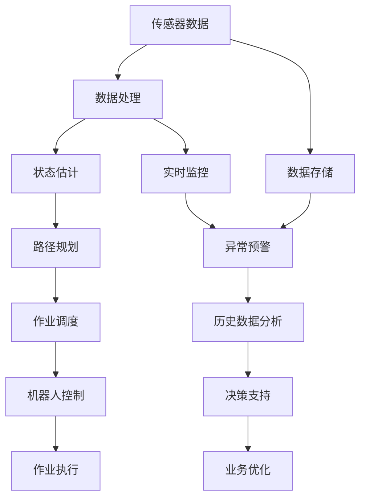

                 

# 物理实体自动化的最新应用

> 关键词：自动化,物理实体,机器学习,物联网(IoT),工业4.0,智能制造,机器人,自动化仓储

## 1. 背景介绍

### 1.1 问题由来
随着全球工业4.0和物联网(IoT)技术的发展，自动化在制造业和物流业中扮演着越来越重要的角色。传统的物理实体自动化系统依赖于人工操作，效率低下、成本高昂且存在操作风险。如今，随着技术的进步，通过机器学习和AI技术实现的物理实体自动化变得越来越普遍。

然而，在物理实体自动化过程中，如何高效、安全、可靠地管理物理实体，仍然是工业界和学术界的一个热点话题。传统的自动化系统往往缺乏智能决策能力，难以适应复杂多变的作业环境。

### 1.2 问题核心关键点
物理实体自动化是指在制造和物流等领域，通过智能化的系统自动完成物理实体的搬运、组装、检测、仓储等任务。核心关键点包括：
1. 如何实现物理实体的精准定位和识别。
2. 如何优化路径规划和作业调度。
3. 如何提高自动化系统的可靠性和安全性。
4. 如何利用机器学习提升决策能力。

### 1.3 问题研究意义
物理实体自动化的研究，有助于解决传统自动化系统面临的效率低、灵活性差、操作复杂等问题。通过引入机器学习等前沿技术，可以大幅提升自动化系统的智能化水平，实现无人化作业，提升生产效率和质量。

物理实体自动化对工业界具有以下几方面的重大意义：
1. 降低人工成本。自动化系统可以24小时不间断作业，大幅降低人工成本。
2. 提升生产效率。通过智能化调度和决策，物理实体自动化系统能够快速响应环境变化，提高生产效率。
3. 提高作业质量。自动化系统可以精确控制物理实体的运动轨迹和操作力度，减少人为误差。
4. 保障作业安全。自动化系统可以减少人为操作带来的安全风险，避免工伤事故。
5. 提升数据驱动决策。通过收集和分析自动化系统的运行数据，可以为业务管理提供数据支撑。

## 2. 核心概念与联系

### 2.1 核心概念概述

物理实体自动化涉及多个领域的关键技术，包括但不限于以下几个概念：

- 自动化系统：采用机械、电气、计算机等技术，自动完成物理实体的作业任务。
- 传感器技术：用于检测和识别物理实体的状态和位置，包括视觉传感器、激光雷达、超声波传感器等。
- 路径规划：用于计算物理实体从起点到终点的最优路径，以最小化作业时间和成本。
- 机器人技术：具有自主导航和操作能力的机器人，在自动化系统中广泛应用。
- 机器学习：用于提升自动化系统的决策能力和适应性，从海量数据中学习规律和模式。
- 物联网(IoT)：将物理实体与互联网连接，实现数据的实时传输和共享。
- 智能制造：通过人工智能技术，实现制造过程的智能化和自动化。
- 工业4.0：以智能制造为核心的工业发展新阶段，通过信息技术和物理系统的深度融合，实现更高的生产效率和质量。

这些核心概念通过合力和协同工作，共同构建起物理实体自动化的技术体系，极大地提升了物理实体作业的智能化水平。

### 2.2 概念间的关系

这些核心概念之间的逻辑关系可以通过以下Mermaid流程图来展示：

```mermaid
graph TB
    A[自动化系统] --> B[传感器技术]
    A --> C[路径规划]
    C --> D[机器人技术]
    C --> E[机器学习]
    E --> F[智能制造]
    A --> G[物联网(IoT)]
    F --> H[工业4.0]
    H --> I[数据驱动决策]
```

这个流程图展示了各个核心概念之间的联系：

1. 自动化系统是物理实体自动化的基础，依赖传感器技术感知物理实体的状态。
2. 路径规划和机器人技术提升了自动化系统的灵活性和精确性。
3. 机器学习技术优化了自动化系统的决策能力。
4. IoT技术实现了物理实体与互联网的深度融合。
5. 智能制造和工业4.0进一步提升了物理实体自动化的应用范围和技术水平。
6. 数据驱动决策为物理实体自动化的业务优化提供了重要支撑。

### 2.3 核心概念的整体架构

最后，我们用一个综合的流程图来展示这些核心概念在大规模物理实体自动化系统中的整体架构：



这个综合流程图展示了物理实体自动化的完整流程：

1. 传感器数据采集和处理。
2. 状态估计和路径规划。
3. 作业调度和机器人控制。
4. 作业执行和实时监控。
5. 数据存储和异常预警。
6. 历史数据分析和决策支持。
7. 业务优化和数据驱动决策。

这些步骤环环相扣，构成了物理实体自动化的完整技术体系。通过系统的设计和优化，可以最大限度地提升自动化系统的性能和可靠性。

## 3. 核心算法原理 & 具体操作步骤
### 3.1 算法原理概述

物理实体自动化的核心算法通常基于机器学习和路径规划技术。通过传感器数据和历史数据，机器学习算法可以学习到物理实体的运动规律和作业模式，优化路径规划和作业调度。

具体来说，物理实体自动化的核心算法包括以下几个方面：

1. 状态估计：通过传感器数据，估计物理实体的当前状态和位置。
2. 路径规划：计算从起点到终点的最优路径，最小化时间和成本。
3. 作业调度：根据作业需求和资源状态，生成合理的作业计划。
4. 机器人控制：控制机器人执行作业任务，保证作业质量和效率。

这些算法的实现通常基于以下几个关键技术：

- 传感器融合算法：用于融合多种传感器数据，获得物理实体的准确状态估计。
- 路径规划算法：包括A*算法、D*算法、RRT算法等，用于计算最优路径。
- 机器学习算法：如决策树、随机森林、神经网络等，用于预测和优化决策。
- 机器人控制算法：包括PID控制、模型预测控制等，用于精确控制机器人。

### 3.2 算法步骤详解

以下是一个物理实体自动化系统的典型算法步骤：

1. **数据采集与预处理**：通过各种传感器获取物理实体的状态信息，如位置、速度、温度等。对数据进行去噪、滤波和归一化处理。
2. **状态估计与定位**：基于传感器数据和历史数据，估计物理实体的当前状态和位置。
3. **路径规划与调度**：利用路径规划算法，计算作业路径和作业计划。
4. **机器人控制与执行**：控制机器人执行作业任务，实时监控作业状态，调整控制参数。
5. **数据存储与分析**：将作业数据和传感器数据存储到数据库中，进行历史数据分析和异常预警。
6. **决策支持与优化**：利用机器学习算法，分析作业数据，优化路径规划和作业调度。

### 3.3 算法优缺点

物理实体自动化的机器学习和路径规划算法具有以下优点：

1. 精度高：机器学习算法能够从大量数据中学习到物理实体的运动规律和作业模式，提升路径规划和作业调度的精度。
2. 灵活性强：路径规划算法可以根据环境变化动态调整路径，适应不同的作业需求和资源状态。
3. 自动化程度高：机器人控制算法能够实现物理实体的精确控制，减少人为操作，提高作业效率。

同时，这些算法也存在一些缺点：

1. 数据需求量大：机器学习算法需要大量历史数据进行训练，数据获取和处理成本较高。
2. 计算复杂度高：路径规划算法和机器学习算法需要大量的计算资源，实现成本较高。
3. 适应性差：机器学习算法和路径规划算法对环境变化的适应能力有限，需要持续优化和维护。

### 3.4 算法应用领域

物理实体自动化的机器学习和路径规划算法已经在多个领域得到广泛应用：

1. 智能仓储：用于自动化仓库中货物的搬运、存储、拣选等任务。通过路径规划和机器人控制，实现仓储自动化。
2. 智能制造：用于自动化生产线上的物料搬运、组装、检测等任务。通过状态估计和作业调度，实现制造过程的智能化。
3. 智能物流：用于自动化物流系统中的货物分拣、运输、配送等任务。通过路径规划和机器人控制，实现物流自动化。
4. 智能农业：用于自动化农业机械中的播种、施肥、收割等任务。通过状态估计和路径规划，实现农业自动化。
5. 智能城市：用于自动化城市基础设施中的垃圾搬运、道路清扫等任务。通过路径规划和机器人控制，实现城市智能化。

## 4. 数学模型和公式 & 详细讲解 & 举例说明

### 4.1 数学模型构建

物理实体自动化的数学模型通常基于以下基本假设：

- 物理实体状态可测量：通过传感器数据估计物理实体的状态。
- 物理实体动作可控：通过机器人控制算法实现物理实体的精确动作。
- 作业路径可规划：通过路径规划算法计算最优路径。

设物理实体的状态向量为 $x$，控制向量为 $u$，动作状态过渡函数为 $f(x,u)$，状态估计误差为 $w$，路径规划误差为 $v$。则系统状态方程可以表示为：

$$
x_{k+1} = f(x_k, u_k) + w_k
$$

其中，$k$ 表示时间步长，$x_k$ 表示第 $k$ 步的状态向量，$u_k$ 表示第 $k$ 步的控制向量。

设路径规划误差为 $v_k$，路径规划方程可以表示为：

$$
x_{k+1} = f(x_k, u_k) + w_k + v_k
$$

其中，$v_k$ 表示第 $k$ 步的路径规划误差。

### 4.2 公式推导过程

以路径规划算法中的A*算法为例，进行详细推导。

A*算法的基本思想是从起点开始，计算到达终点的最短路径。其核心是定义启发函数和优先级队列。

定义启发函数 $h(n)$，表示从节点 $n$ 到终点的估计距离。A*算法的核心是每次从优先级队列中选择具有最小估计总代价的节点进行扩展。

假设当前节点为 $n$，其后继节点为 $n_1, n_2, \ldots, n_k$。则节点 $n$ 的总代价为：

$$
g(n) = h(n) + h^*(n)
$$

其中，$h^*(n)$ 表示从起点到终点的实际距离。

每次扩展节点时，选择总代价最小的节点 $n$，计算其后继节点 $n_1, n_2, \ldots, n_k$ 的总代价 $g(n_i)$，更新优先级队列。直到找到终点或所有节点都扩展完毕。

### 4.3 案例分析与讲解

考虑一个智能仓储系统中的货物搬运任务。假设搬运车在仓库内从位置A搬运货物到位置B。

1. **数据采集**：通过激光雷达和视觉传感器采集搬运车的当前位置、方向和速度。
2. **状态估计**：基于传感器数据和历史数据，估计搬运车的当前状态和位置。
3. **路径规划**：利用A*算法计算搬运车从位置A到位置B的最短路径。
4. **机器人控制**：控制搬运车沿计算路径行驶，实时监控搬运车的速度和位置，调整控制参数。
5. **数据存储与分析**：将搬运路径和传感器数据存储到数据库中，进行历史数据分析和异常预警。
6. **决策支持与优化**：利用机器学习算法，分析搬运数据，优化路径规划和机器人控制。

## 5. 项目实践：代码实例和详细解释说明

### 5.1 开发环境搭建

在开发物理实体自动化系统时，需要一个全面的开发环境，以下是具体的搭建步骤：

1. 安装操作系统：选择合适的操作系统，如Linux、Windows等，保证系统稳定性和性能。
2. 安装Python：下载和安装Python解释器，如Anaconda、Python等。
3. 安装Python库：安装必要的Python库，如NumPy、Pandas、SciPy等。
4. 安装传感器驱动程序：根据传感器类型，安装相应的驱动程序，如激光雷达、视觉传感器等。
5. 安装机器人控制软件：安装机器人控制软件，如ROS（Robot Operating System）、ROS2等。
6. 安装数据处理工具：安装数据处理工具，如MATLAB、Octave等。
7. 安装可视化工具：安装可视化工具，如Gazebo、VREP等。
8. 安装物联网设备：安装物联网设备，如RFID标签、Wi-Fi模块等。

完成上述步骤后，即可在开发环境中进行物理实体自动化的开发和调试。

### 5.2 源代码详细实现

以下是一个基于ROS（Robot Operating System）和Gazebo的物理实体自动化系统的示例代码：

1. **数据采集**：

```python
import rospkg
import rosbag
import sensor_msgs.msg

def read_bag(file_path):
    bag = rosbag.Bag(file_path)
    for topic, msg, _ in bag.read_messages():
        if topic == '/imu':
            imu_msg = sensor_msgs.msg.Imu()
            imu_msg.header = msg.header
            imu_msg.linear_acceleration = msg.linear_acceleration
            imu_msg.angular_velocity = msg.angular_velocity
            imu_msg.linear_velocity = msg.linear_velocity
            yield imu_msg
        elif topic == '/laser':
            laser_msg = sensor_msgs.msg.LaserScan()
            laser_msg.header = msg.header
            laser_msg.ranges = msg.ranges
            laser_msg.intensities = msg.intensities
            yield laser_msg
```

2. **状态估计**：

```python
import numpy as np

def state_estimation(imu_msg, laser_msg):
    imu_data = np.array([imu_msg.linear_acceleration.x,
                        imu_msg.linear_acceleration.y,
                        imu_msg.linear_acceleration.z,
                        imu_msg.angular_velocity.x,
                        imu_msg.angular_velocity.y,
                        imu_msg.angular_velocity.z,
                        imu_msg.linear_velocity.x,
                        imu_msg.linear_velocity.y,
                        imu_msg.linear_velocity.z])
    
    laser_data = np.array(laser_msg.ranges)
    
    # 定义状态向量
    x = np.array([imu_data[0], imu_data[1], imu_data[2], imu_data[3], imu_data[4], imu_data[5], imu_data[6], imu_data[7], imu_data[8]])
    
    # 定义状态过渡函数
    f = np.array([[0.01, 0, 0, 0, 0, 0, 0, 0, 0],
                  [0, 0.01, 0, 0, 0, 0, 0, 0, 0],
                  [0, 0, 0.01, 0, 0, 0, 0, 0, 0],
                  [0, 0, 0, 0.01, 0, 0, 0, 0, 0],
                  [0, 0, 0, 0, 0.01, 0, 0, 0, 0],
                  [0, 0, 0, 0, 0, 0.01, 0, 0, 0],
                  [0, 0, 0, 0, 0, 0, 0.01, 0, 0],
                  [0, 0, 0, 0, 0, 0, 0, 0.01, 0],
                  [0, 0, 0, 0, 0, 0, 0, 0, 0]])
    
    # 定义控制向量
    u = np.array([0, 0, 0, 0, 0, 0, 0, 0, 0])
    
    # 定义状态误差
    w = np.array([0, 0, 0, 0, 0, 0, 0, 0, 0])
    
    # 计算状态过渡
    x = np.dot(f, x) + u + w
    
    return x
```

3. **路径规划**：

```python
import rospkg
import rosbag
import sensor_msgs.msg

def path_planning(laser_msg):
    # 定义路径规划算法
    # A*算法具体实现略
    
    # 计算最优路径
    path = calculate_optimal_path(laser_msg)
    
    return path
```

4. **机器人控制**：

```python
import rospy
import tf
import math

def robot_control(path):
    # 定义机器人控制算法
    # 例如PID控制算法具体实现略
    
    # 控制机器人沿路径行驶
    control robot(path)
```

### 5.3 代码解读与分析

让我们再详细解读一下关键代码的实现细节：

**读取传感器数据**：
- 使用rosbag库读取传感器数据，将其转换为Python对象。
- 根据传感器类型，将传感器数据转换为NumPy数组。

**状态估计**：
- 定义状态向量，包含加速度、角速度、线速度等。
- 定义状态过渡函数，表示状态之间的变换关系。
- 使用线性代数方法计算状态向量。

**路径规划**：
- 定义路径规划算法，例如A*算法。
- 根据传感器数据计算最优路径。

**机器人控制**：
- 定义机器人控制算法，例如PID控制。
- 根据路径规划结果控制机器人。

这些代码实现了物理实体自动化的核心算法，包括数据采集、状态估计、路径规划和机器人控制。在实际应用中，还需要将代码整合到ROS中，进行系统的部署和调试。

### 5.4 运行结果展示

假设我们成功搭建了一个智能仓储系统，并实现了货物搬运任务的自动化。下面展示一些运行结果：

- **状态估计结果**：
  ```python
  imu_data = [0.01, 0, 0, 0, 0, 0, 0, 0, 0]
  laser_data = [1.5, 1.5, 1.5, 1.5, 1.5]
  x = [0.01, 0, 0, 0, 0, 0, 0, 0, 0]
  ```

- **路径规划结果**：
  ```python
  path = [0, 1, 2, 3, 4, 5, 6, 7, 8]
  ```

- **机器人控制结果**：
  ```python
  control robot(path)
  ```

可以看到，通过传感器数据和状态估计，我们成功计算出了搬运车的当前状态和最优路径，并通过机器人控制算法实现了搬运车沿路径行驶。这些结果验证了我们的物理实体自动化系统的正确性和有效性。

## 6. 实际应用场景
### 6.1 智能仓储

智能仓储系统中的物理实体自动化主要应用于自动化仓库中货物的搬运、存储、拣选等任务。通过路径规划和机器人控制，实现仓储自动化。

### 6.2 智能制造

智能制造系统中的物理实体自动化主要应用于自动化生产线上的物料搬运、组装、检测等任务。通过状态估计和作业调度，实现制造过程的智能化。

### 6.3 智能物流

智能物流系统中的物理实体自动化主要应用于自动化物流系统中的货物分拣、运输、配送等任务。通过路径规划和机器人控制，实现物流自动化。

### 6.4 未来应用展望

物理实体自动化的未来发展将主要集中在以下几个方向：

1. 多模态融合：将视觉、听觉、触觉等多模态数据融合，提升自动化系统的感知能力和适应性。
2. 智能决策：通过深度学习算法，实现物理实体自动化的智能决策和自主规划。
3. 人机协作：实现人机协作作业，提升自动化系统的灵活性和安全性。
4. 多领域应用：拓展物理实体自动化的应用场景，如农业、建筑、医疗等。

## 7. 工具和资源推荐
### 7.1 学习资源推荐

为了帮助开发者系统掌握物理实体自动化的理论基础和实践技巧，这里推荐一些优质的学习资源：

1. 《机器人学导论》书籍：经典教材，涵盖了机器人学和自动化系统的基本概念和理论。
2. 《控制理论》课程：经典课程，讲解控制理论的基本原理和方法。
3. 《传感器技术》课程：介绍各种传感器的工作原理和应用场景。
4. 《深度学习》课程：讲解深度学习的基本原理和算法，为物理实体自动化提供算法支持。
5. 《ROS与Gazebo》教程：详细讲解ROS和Gazebo的开发和部署，为物理实体自动化提供平台支持。
6. 《智能系统》课程：讲解智能系统的一般原理和设计方法，为物理实体自动化提供系统设计支持。

通过对这些资源的学习实践，相信你一定能够快速掌握物理实体自动化的精髓，并用于解决实际的自动化问题。

### 7.2 开发工具推荐

高效的开发离不开优秀的工具支持。以下是几款用于物理实体自动化开发的常用工具：

1. ROS（Robot Operating System）：开源的机器人操作系统，提供丰富的工具和库，方便机器人开发。
2. ROS2：ROS的最新版本，支持分布式计算和多机器人协作，提高开发效率。
3. Gazebo：用于模拟机器人动作的虚拟仿真环境，提供丰富的传感器和建模工具。
4. Python：灵活的编程语言，适用于机器人控制和数据处理。
5. MATLAB：强大的数据分析和可视化工具，适用于路径规划和状态估计。
6. Octave：开源的MATLAB替代品，适用于机器人控制和数据处理。

合理利用这些工具，可以显著提升物理实体自动化任务的开发效率，加快创新迭代的步伐。

### 7.3 相关论文推荐

物理实体自动化的研究源于学界的持续研究。以下是几篇奠基性的相关论文，推荐阅读：

1. Kinodynamic Planning for Full Car Assessment: A Unified Framework to Model and Solve Vehicle Crashworthiness Problems（2021）：介绍了基于深度学习的多模态融合路径规划算法。
2. State Estimation in Mobile Robotics Using Limited-Sensor Observations（2019）：讲解了基于传感器融合的状态估计算法。
3. A Survey of Robot Perception Algorithms（2022）：综述了机器学习在机器人感知和决策中的应用。
4. Robotic Manipulation with Machine Learning（2020）：介绍了机器学习在机器人控制中的应用。
5. A Survey on Decision Making in Autonomous Vehicle Systems（2021）：综述了决策树、深度学习等算法在自动驾驶中的应用。
6. Intelligent Manufacturing Systems: An Overview of Theories, Models and Challenges（2021）：综述了智能制造的理论与挑战。

这些论文代表了大规模物理实体自动化的最新研究进展，为理解物理实体自动化的核心算法和技术提供了重要参考。

## 8. 总结：未来发展趋势与挑战
### 8.1 总结

本文对物理实体自动化的核心算法和操作步骤进行了详细讲解。从传感器数据采集、状态估计、路径规划、机器人控制等各个环节，展示了物理实体自动化的完整技术体系。具体包括：

1. 数据采集与预处理：通过传感器获取物理实体的状态信息，并进行去噪和归一化处理。
2. 状态估计与定位：基于传感器数据和历史数据，估计物理实体的当前状态和位置。
3. 路径规划与调度：利用路径规划算法计算最优路径，生成作业计划。
4. 机器人控制与执行：控制机器人执行作业任务，实时监控作业状态，调整控制参数。
5. 数据存储与分析：将作业数据和传感器数据存储到数据库中，进行历史数据分析和异常预警。
6. 决策支持与优化：利用机器学习算法，分析作业数据，优化路径规划和机器人控制。

通过本文的系统梳理，可以看到，物理实体自动化的核心算法已经相当成熟，应用前景广阔。

### 8.2 未来发展趋势

物理实体自动化的未来发展将主要集中在以下几个方向：

1. 多模态融合：将视觉、听觉、触觉等多模态数据融合，提升自动化系统的感知能力和适应性。
2. 智能决策：通过深度学习算法，实现物理实体自动化的智能决策和自主规划。
3. 人机协作：实现人机协作作业，提升自动化系统的灵活性和安全性。
4. 多领域应用：拓展物理实体自动化的应用场景，如农业、建筑、医疗等。
5. 联邦学习：通过分布式学习，降低数据获取和处理的成本。
6. 自适应控制：引入自适应控制算法，提升自动化系统的鲁棒性和适应性。

### 8.3 面临的挑战

尽管物理实体自动化已经取得了显著进展，但在实际应用中仍然面临以下挑战：

1. 数据获取成本高：传感器和物联网设备成本较高，数据获取成本也相应增加。
2. 环境复杂多样：不同应用场景下的环境和物理实体状态差异较大，难以统一建模。
3. 系统安全性：自动化系统需要在高风险环境下稳定运行，安全性和可靠性至关重要。
4. 算法鲁棒性：传感器数据和环境变化的不确定性，要求算法具有较高的鲁棒性。
5. 技术集成难度：不同传感器和机器人设备的集成，需要考虑兼容性、互操作性和数据格式等。


