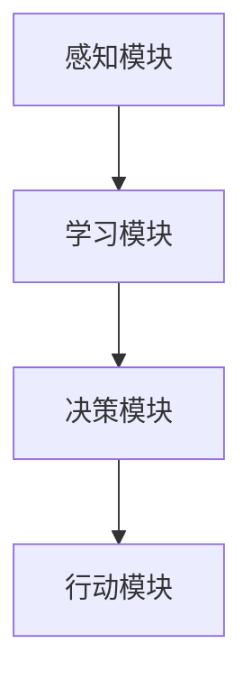
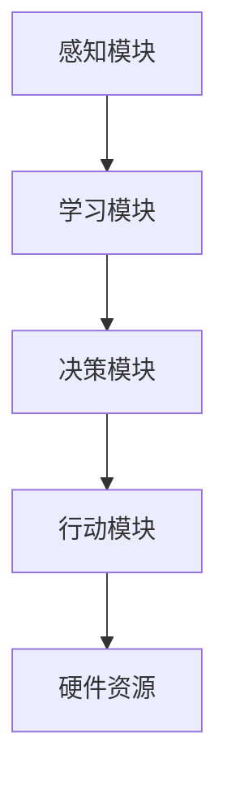

> 关键词：AI Agent, 硬件进化，软件架构，边缘计算，神经形态工程，量子计算，软件定义硬件，智能边缘，AI加速器

# AI Agent: AI的下一个风口 硬件进化对软件的影响

在人工智能的快速发展中，AI Agent 作为一种智能体，正成为下一个技术风口。随着硬件技术的不断进化，特别是针对AI优化的硬件加速器、神经形态芯片等，AI Agent 的性能和效率得到了显著提升。本文将探讨硬件进化对AI Agent软件架构的影响，分析其原理、应用领域，并展望未来发展趋势与挑战。

## 1. 背景介绍

### 1.1 AI Agent的兴起

AI Agent，或称为智能代理，是指能够自主感知环境、学习、决策和执行行动的实体。随着深度学习、强化学习等AI技术的成熟，AI Agent在机器人、自动驾驶、智能家居、游戏等领域得到了广泛应用。

### 1.2 硬件进化的推动

近年来，硬件技术的发展为AI Agent带来了新的机遇。特别是以下几种硬件技术的突破：

- **AI加速器**：针对深度学习等AI任务进行优化的专用硬件，如GPU、TPU、FPGA等，显著提升了AI Agent的计算能力。
- **神经形态工程**：模仿生物神经系统结构和功能的新型计算架构，如神经形态芯片，为AI Agent提供更高效的能量效率。
- **量子计算**：利用量子力学原理进行计算，有望在未来实现指数级的计算速度提升，为AI Agent带来新的可能性。
- **软件定义硬件**：通过软件定义硬件技术，可以灵活地调整硬件资源，适应不同AI Agent的需求。

### 1.3 硬件进化对软件架构的影响

硬件进化的推动，对AI Agent的软件架构产生了深远影响。传统的软件架构难以充分利用硬件的优势，需要新的架构设计来适配硬件进化带来的变化。

## 2. 核心概念与联系

### 2.1 AI Agent概念原理

AI Agent是一种具有自主决策能力的软件实体，通常由感知模块、学习模块、决策模块和行动模块组成。

**Mermaid流程图**：



### 2.2 硬件进化对软件架构的影响

硬件进化对AI Agent软件架构的影响主要体现在以下几个方面：

- **计算效率**：硬件加速器等专用硬件可以显著提高AI Agent的计算效率，使得复杂模型能够实时运行。
- **能量效率**：神经形态芯片等新型计算架构可以提高AI Agent的能量效率，使其在电池供电设备上运行更长时间。
- **灵活性**：软件定义硬件技术可以提供灵活的硬件资源分配，适应不同AI Agent的需求。
- **实时性**：边缘计算等硬件进化技术可以提高AI Agent的实时性，使其能够快速响应外部事件。

**Mermaid流程图**：



## 3. 核心算法原理 & 具体操作步骤

### 3.1 算法原理概述

AI Agent的核心算法包括感知、学习、决策和行动。其中，感知模块负责收集环境信息，学习模块负责从数据中学习知识，决策模块负责基于学习到的知识做出决策，行动模块负责执行决策。

### 3.2 算法步骤详解

1. **感知**：AI Agent通过传感器等设备收集环境信息，如图像、声音、温度等。
2. **学习**：AI Agent使用机器学习算法从收集到的数据中学习，如深度学习、强化学习等。
3. **决策**：AI Agent根据学习到的知识，使用决策算法选择最佳行动方案。
4. **行动**：AI Agent执行决策，对环境产生影响。

### 3.3 算法优缺点

- **优点**：
  - 高效：AI Agent能够快速处理大量数据，并做出快速决策。
  - 智能化：AI Agent能够从数据中学习，不断改进自己的行为。
  - 自主性：AI Agent能够自主感知环境、学习、决策和行动，无需人工干预。
- **缺点**：
  - 计算资源消耗大：AI Agent需要大量的计算资源，如CPU、GPU等。
  - 数据依赖性强：AI Agent的性能依赖于训练数据的质量和数量。
  - 安全性问题：AI Agent的决策可能受到攻击，需要考虑安全性问题。

### 3.4 算法应用领域

AI Agent的应用领域非常广泛，包括：

- **机器人**：工业机器人、服务机器人、家用机器人等。
- **自动驾驶**：无人驾驶汽车、无人机等。
- **智能家居**：智能家电、智能照明、智能安防等。
- **游戏**：游戏AI、虚拟现实等。

## 4. 数学模型和公式 & 详细讲解 & 举例说明

### 4.1 数学模型构建

AI Agent的数学模型通常包括以下部分：

- **感知模块**：使用感知器模型，如卷积神经网络(CNN)、循环神经网络(RNN)等。
- **学习模块**：使用监督学习、无监督学习、强化学习等算法。
- **决策模块**：使用决策树、支持向量机(SVM)、神经网络等算法。
- **行动模块**：使用控制理论、优化算法等。

### 4.2 公式推导过程

以感知模块为例，假设输入数据为 $X \in \mathbb{R}^{m \times n}$，感知器模型为 $f(X)$，则输出为 $Y = f(X)$。

### 4.3 案例分析与讲解

以自动驾驶为例，感知模块使用CNN提取图像特征，学习模块使用卷积神经网络学习道路场景，决策模块使用神经网络选择最佳行动方案，行动模块使用控制理论控制车辆行驶。

## 5. 项目实践：代码实例和详细解释说明

### 5.1 开发环境搭建

1. 安装Python 3.7及以上版本。
2. 安装TensorFlow或PyTorch深度学习框架。
3. 安装相关库，如NumPy、Pandas等。

### 5.2 源代码详细实现

以下是一个简单的自动驾驶AI Agent的代码示例：

```python
import tensorflow as tf

# 导入数据集
def load_data():
    # 加载自动驾驶数据集，如Kitti数据集
    pass

# 感知模块：CNN
def build_perception_model():
    model = tf.keras.Sequential([
        tf.keras.layers.Conv2D(32, (3, 3), activation='relu', input_shape=(224, 224, 3)),
        tf.keras.layers.MaxPooling2D((2, 2)),
        tf.keras.layers.Conv2D(64, (3, 3), activation='relu'),
        tf.keras.layers.MaxPooling2D((2, 2)),
        tf.keras.layers.Conv2D(128, (3, 3), activation='relu'),
        tf.keras.layers.Flatten()
    ])
    return model

# 学习模块：CNN
def build_learning_model():
    model = tf.keras.Sequential([
        tf.keras.layers.Dense(64, activation='relu'),
        tf.keras.layers.Dense(2, activation='softmax')
    ])
    return model

# 决策模块：神经网络
def build_decision_model():
    model = tf.keras.Sequential([
        tf.keras.layers.Dense(64, activation='relu'),
        tf.keras.layers.Dense(2, activation='softmax')
    ])
    return model

# 行动模块：控制理论
def build_action_model():
    # 设计控制策略，如PID控制器
    pass

# 训练模型
def train_model(perception_model, learning_model, decision_model, action_model, data):
    # 训练感知模块
    perception_model.compile(optimizer='adam', loss='categorical_crossentropy')
    perception_model.fit(data['images'], data['labels'], epochs=10)
    
    # 训练学习模块
    learning_model.compile(optimizer='adam', loss='categorical_crossentropy')
    learning_model.fit(data['images'], data['labels'], epochs=10)
    
    # 训练决策模块
    decision_model.compile(optimizer='adam', loss='categorical_crossentropy')
    decision_model.fit(data['images'], data['labels'], epochs=10)
    
    # 训练行动模块
    action_model.compile(optimizer='adam', loss='categorical_crossentropy')
    action_model.fit(data['images'], data['labels'], epochs=10)

# 预测
def predict(perception_model, learning_model, decision_model, action_model, image):
    # 前向传播
    perception_output = perception_model.predict(image)
    learning_output = learning_model.predict(perception_output)
    decision_output = decision_model.predict(learning_output)
    action_output = action_model.predict(decision_output)
    
    return action_output

if __name__ == "__main__":
    # 加载数据集
    data = load_data()
    
    # 构建模型
    perception_model = build_perception_model()
    learning_model = build_learning_model()
    decision_model = build_decision_model()
    action_model = build_action_model()
    
    # 训练模型
    train_model(perception_model, learning_model, decision_model, action_model, data)
    
    # 预测
    image = ... # 加载一张图片
    prediction = predict(perception_model, learning_model, decision_model, action_model, image)
    print(prediction)
```

### 5.3 代码解读与分析

以上代码展示了自动驾驶AI Agent的基本架构。首先，导入TensorFlow框架和相关库。然后，定义加载数据集、构建感知模块、学习模块、决策模块和行动模块的函数。接着，定义训练模型和预测函数。最后，在主函数中，加载数据集，构建模型，训练模型，并预测一张图片。

### 5.4 运行结果展示

运行上述代码，将得到自动驾驶AI Agent的预测结果。

## 6. 实际应用场景

AI Agent在以下实际应用场景中发挥着重要作用：

- **机器人**：工业机器人、服务机器人、家用机器人等。
- **自动驾驶**：无人驾驶汽车、无人机等。
- **智能家居**：智能家电、智能照明、智能安防等。
- **游戏**：游戏AI、虚拟现实等。

## 7. 工具和资源推荐

### 7.1 学习资源推荐

- 《深度学习》
- 《Python机器学习》
- 《强化学习》
- 《自动驾驶》

### 7.2 开发工具推荐

- TensorFlow
- PyTorch
- Keras
- OpenCV

### 7.3 相关论文推荐

- “Deep Learning for Autonomous Navigation of Quadrotor Robots”
- “Human-level control through deep reinforcement learning”
- “Towards General Visual Recognition with Deep Learning”

## 8. 总结：未来发展趋势与挑战

### 8.1 研究成果总结

本文介绍了AI Agent的概念、原理、算法、应用场景以及硬件进化对AI Agent软件架构的影响。通过分析，我们了解到AI Agent在各个领域的广泛应用和硬件进化对其带来的机遇。

### 8.2 未来发展趋势

- **硬件进化**：随着AI加速器、神经形态芯片等新型硬件的发展，AI Agent的计算能力和能量效率将进一步提升。
- **软件架构**：AI Agent的软件架构将更加模块化、可扩展，适应不同场景的需求。
- **跨学科融合**：AI Agent将与其他学科如认知科学、神经科学等相结合，实现更加智能化的应用。

### 8.3 面临的挑战

- **数据安全**：AI Agent的数据安全成为重要问题，需要加强数据隐私保护和数据安全监管。
- **伦理道德**：AI Agent的决策可能引发伦理道德问题，需要制定相应的伦理规范和监管措施。
- **人机协作**：AI Agent与人类协作成为趋势，需要研究人机协作的机制和策略。

### 8.4 研究展望

AI Agent作为AI的下一个风口，具有广阔的应用前景。未来，我们需要关注以下研究方向：

- **跨学科融合**：将认知科学、神经科学等领域的知识融入AI Agent的设计，提升其智能水平。
- **人机协作**：研究人机协作机制，实现人机协同的智能化应用。
- **安全可控**：加强AI Agent的数据安全、伦理道德和安全可控性研究。

作者：禅与计算机程序设计艺术 / Zen and the Art of Computer Programming