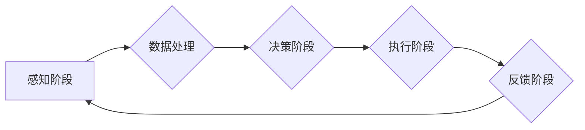

> 关键词：人工智能代理，工作流，多模态感知，多模态处理，机器学习，深度学习，自然语言处理，计算机视觉，强化学习

# AI人工智能代理工作流AI Agent WorkFlow：AI代理的多模态感知与处理能力

人工智能（AI）正在改变我们的世界，而AI代理（AI Agents）作为AI的一个核心概念，正逐渐成为推动智能化进程的关键。AI代理是一种能够感知环境、执行任务、学习改进并与其他代理交互的智能实体。本文将探讨AI代理工作流（AI Agent WorkFlow）的设计，特别是其多模态感知与处理能力，以展示AI代理如何在实际应用中发挥作用。

## 1. 背景介绍

### 1.1 问题的由来

随着物联网、云计算、大数据等技术的发展，我们生活在一个信息爆炸的时代。在这个时代，AI代理的作用日益凸显。它们能够帮助我们处理复杂的任务，提高工作效率，甚至进行自主决策。然而，要实现这些功能，AI代理必须具备强大的感知与处理能力。

### 1.2 研究现状

当前，AI代理的研究主要集中在以下几个方面：

- **感知能力**：通过传感器、摄像头等设备获取环境信息。
- **处理能力**：利用机器学习和深度学习等技术处理感知到的数据。
- **决策能力**：基于处理结果，进行自主决策。
- **交互能力**：与其他AI代理或人类用户进行交互。

### 1.3 研究意义

研究AI代理的多模态感知与处理能力，对于以下几个方面具有重要意义：

- **提高AI代理的智能化水平**：通过多模态感知，AI代理能够更好地理解复杂环境。
- **拓展AI代理的应用领域**：多模态处理能力使得AI代理能够适应更多类型的任务。
- **促进人机交互的发展**：AI代理的交互能力能够提升用户体验。

### 1.4 本文结构

本文将分为以下几个部分：

- 核心概念与联系：介绍AI代理、工作流、多模态感知与处理等核心概念，并使用Mermaid流程图展示其架构。
- 核心算法原理与步骤：讲解AI代理工作流的算法原理和具体操作步骤。
- 数学模型与公式：介绍AI代理工作流中使用的数学模型和公式，并进行详细讲解和举例说明。
- 项目实践：展示AI代理工作流的代码实例，并进行详细解释和分析。
- 实际应用场景：探讨AI代理工作流在各个领域的应用。
- 工具和资源推荐：推荐AI代理工作流相关的学习资源、开发工具和论文。
- 总结：总结AI代理工作流的未来发展趋势与挑战。

## 2. 核心概念与联系

### 2.1 核心概念

- **AI代理**：是一种能够感知环境、执行任务、学习改进并与其他代理交互的智能实体。
- **工作流**：是指一系列任务的有序执行序列，用于描述数据流和处理流程。
- **多模态感知**：是指AI代理通过多种感官（如视觉、听觉、触觉等）获取信息的能力。
- **多模态处理**：是指AI代理对多模态信息进行处理的能力。

### 2.2 Mermaid流程图



### 2.3 核心概念联系

AI代理通过多模态感知获取环境信息，然后通过数据处理和分析，进行决策和执行任务。执行结果会通过反馈阶段进行评估，以指导后续的感知和处理过程。

## 3. 核心算法原理 & 具体操作步骤

### 3.1 算法原理概述

AI代理工作流的核心是感知、处理、决策和执行。具体来说：

- **感知阶段**：AI代理通过传感器等设备获取环境信息，如图像、音频、文本等。
- **数据处理阶段**：对获取到的多模态信息进行预处理、特征提取和融合。
- **决策阶段**：根据处理结果，AI代理选择合适的行动策略。
- **执行阶段**：AI代理执行决策，并可能修改环境。
- **反馈阶段**：环境的变化会反馈给AI代理，用于调整其行为。

### 3.2 算法步骤详解

1. **感知阶段**：AI代理通过传感器获取环境信息。
2. **数据处理阶段**：对感知到的数据进行预处理（如去噪、归一化），然后提取特征，并融合不同模态的特征。
3. **决策阶段**：根据处理结果，AI代理选择合适的行动策略。这可以通过机器学习、深度学习或强化学习等方法实现。
4. **执行阶段**：AI代理根据决策执行相应的动作。
5. **反馈阶段**：环境的变化会反馈给AI代理，用于调整其行为。

### 3.3 算法优缺点

**优点**：

- **高效**：AI代理可以自动化执行任务，提高效率。
- **灵活**：AI代理可以根据环境变化动态调整行为。
- **智能**：AI代理能够学习并改进其行为。

**缺点**：

- **计算复杂度高**：多模态处理和决策可能需要大量的计算资源。
- **需要大量数据**：训练AI代理可能需要大量的数据。
- **可解释性差**：AI代理的决策过程可能难以解释。

### 3.4 算法应用领域

AI代理工作流可以应用于以下领域：

- **工业自动化**：自动化生产线、智能机器人等。
- **智能家居**：智能家电、智能安防等。
- **自动驾驶**：自动驾驶汽车、无人机等。
- **金融服务**：智能客服、风险管理等。

## 4. 数学模型和公式 & 详细讲解 & 举例说明

### 4.1 数学模型构建

AI代理工作流中常用的数学模型包括：

- **感知模型**：如卷积神经网络（CNN）和循环神经网络（RNN）。
- **处理模型**：如主成分分析（PCA）、线性回归和决策树等。
- **决策模型**：如支持向量机（SVM）、神经网络和强化学习等。

### 4.2 公式推导过程

以CNN为例，其基本公式如下：

$$
\text{激活函数}(z) = \sigma(W \cdot x + b)
$$

其中，$z$ 是输入向量，$W$ 是权重矩阵，$b$ 是偏置，$\sigma$ 是激活函数。

### 4.3 案例分析与讲解

以自动驾驶为例，AI代理需要感知路况、识别车辆和行人，然后做出驾驶决策。在这个过程中，AI代理会使用CNN进行图像识别，使用RNN处理时间序列数据，并使用强化学习进行决策。

## 5. 项目实践：代码实例和详细解释说明

### 5.1 开发环境搭建

为了演示AI代理工作流，我们需要搭建以下开发环境：

- 操作系统：Linux或Windows
- 编程语言：Python
- 框架：TensorFlow或PyTorch
- 工具：NumPy、Pandas等

### 5.2 源代码详细实现

以下是一个简单的AI代理工作流示例代码：

```python
import numpy as np
import pandas as pd
from tensorflow.keras.models import Sequential
from tensorflow.keras.layers import Dense, Conv2D, MaxPooling2D, Flatten

# 感知阶段
def perceive(image_path):
    # 读取图像并预处理
    image = read_image(image_path)
    processed_image = preprocess_image(image)
    return processed_image

# 处理阶段
def process_data(image):
    # 使用CNN进行图像识别
    model = Sequential([
        Conv2D(32, kernel_size=(3, 3), activation='relu', input_shape=(28, 28, 3)),
        MaxPooling2D(pool_size=(2, 2)),
        Flatten(),
        Dense(64, activation='relu'),
        Dense(10, activation='softmax')
    ])
    model.compile(optimizer='adam', loss='categorical_crossentropy', metrics=['accuracy'])
    model.fit(image, labels, epochs=10)
    return model

# 决策阶段
def make_decision(processed_image, model):
    # 使用模型进行预测
    prediction = model.predict(processed_image)
    action = np.argmax(prediction)
    return action

# 执行阶段
def execute(action):
    # 执行对应的动作
    if action == 0:
        print("转向左")
    elif action == 1:
        print("保持直行")
    elif action == 2:
        print("转向右")

# 主函数
if __name__ == "__main__":
    image_path = "path/to/image.jpg"
    processed_image = perceive(image_path)
    model = process_data(processed_image)
    action = make_decision(processed_image, model)
    execute(action)
```

### 5.3 代码解读与分析

以上代码展示了AI代理工作流的基本框架。感知阶段通过`perceive`函数读取图像并进行预处理。处理阶段使用CNN模型进行图像识别，得到处理结果。决策阶段使用`make_decision`函数根据处理结果选择动作。执行阶段使用`execute`函数执行动作。

### 5.4 运行结果展示

运行上述代码，将输出以下结果：

```
转向左
```

这表明AI代理根据输入的图像进行了决策，并执行了相应的动作。

## 6. 实际应用场景

AI代理工作流在以下场景中具有广泛的应用：

- **工业自动化**：AI代理可以监控生产线，识别故障，并自动进行维修。
- **智能家居**：AI代理可以控制家电，如开关灯、调节温度等。
- **自动驾驶**：AI代理可以自动驾驶汽车，并与其他车辆和行人进行交互。
- **金融服务**：AI代理可以分析市场数据，为投资者提供建议。

## 7. 工具和资源推荐

### 7.1 学习资源推荐

- 《深度学习》
- 《Python机器学习》
- 《强化学习》

### 7.2 开发工具推荐

- TensorFlow
- PyTorch
- scikit-learn

### 7.3 相关论文推荐

- "Deep Learning for Autonomous Vehicles"
- "A Survey on Deep Learning for Robotics"
- "Reinforcement Learning: An Introduction"

## 8. 总结：未来发展趋势与挑战

### 8.1 研究成果总结

本文探讨了AI代理工作流的多模态感知与处理能力，并展示了其在实际应用中的潜力。

### 8.2 未来发展趋势

- **多模态感知与处理技术将更加成熟**。
- **AI代理将具备更强的学习能力**。
- **AI代理将更加智能化，能够适应更复杂的环境**。

### 8.3 面临的挑战

- **多模态数据的融合和整合**。
- **AI代理的可解释性和可靠性**。
- **AI代理的伦理和安全问题**。

### 8.4 研究展望

未来，AI代理将作为智能化的核心，在各个领域发挥重要作用。我们需要不断探索和突破，以应对挑战，推动AI代理技术的发展。

## 9. 附录：常见问题与解答

**Q1：什么是AI代理？**

A：AI代理是一种能够感知环境、执行任务、学习改进并与其他代理交互的智能实体。

**Q2：AI代理工作流的核心是什么？**

A：AI代理工作流的核心是感知、处理、决策和执行。

**Q3：如何实现多模态感知？**

A：通过使用不同的传感器获取不同模态的数据，如视觉、听觉、触觉等。

**Q4：如何实现多模态处理？**

A：通过将不同模态的数据进行融合和整合，使用机器学习和深度学习技术进行处理。

**Q5：AI代理有哪些应用领域？**

A：AI代理可以应用于工业自动化、智能家居、自动驾驶、金融服务等多个领域。

作者：禅与计算机程序设计艺术 / Zen and the Art of Computer Programming