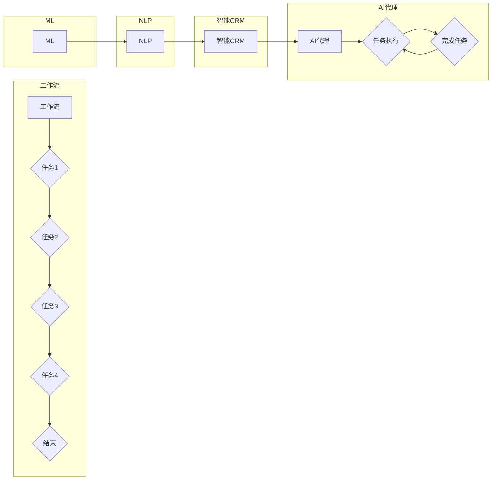

# AI人工智能代理工作流AI Agent WorkFlow：智能代理在CRM客户管理中的应用

> 关键词：AI代理，工作流，智能CRM，客户管理，自动化，自然语言处理，机器学习

## 1. 背景介绍

随着技术的飞速发展，人工智能（AI）正在改变着各个行业的运作方式，其中CRM（客户关系管理）系统也不例外。传统的CRM系统依赖于人工操作，效率低下，且难以处理复杂的客户交互。而AI代理工作流（AI Agent WorkFlow）的出现，为CRM系统带来了革命性的变革。AI代理工作流通过智能化、自动化的方式，提升客户服务质量，优化客户体验，并提高企业运营效率。

### 1.1 问题的由来

在CRM客户管理中，企业面临以下挑战：

- 客户数据分散，难以整合和分析。
- 客户交互复杂，人工处理效率低。
- 客户需求多变，难以快速响应。
- 客户服务成本高，难以控制。

为了解决这些问题，企业需要一种智能化的CRM系统，能够自动处理客户交互，提供个性化的服务，并降低运营成本。

### 1.2 研究现状

目前，AI代理工作流在CRM客户管理中的应用已经取得了显著成果。以下是一些主流的AI代理工作流应用：

- 自动化客户服务：通过聊天机器人、虚拟助手等AI代理，提供24/7的客户服务，解答客户问题，处理客户投诉。
- 客户数据分析：利用机器学习算法，分析客户数据，发现客户需求，优化产品和服务。
- 客户关系管理：通过AI代理，实现客户信息的自动化收集、整理和分析，提升客户关系管理效率。
- 销售支持：AI代理可以分析客户行为，提供销售线索，协助销售人员达成销售目标。

### 1.3 研究意义

AI代理工作流在CRM客户管理中的应用，具有以下意义：

- 提高客户服务质量，提升客户满意度。
- 优化客户体验，增强客户忠诚度。
- 降低运营成本，提高企业效益。
- 释放人力资源，提升员工工作效率。

### 1.4 本文结构

本文将围绕AI代理工作流在CRM客户管理中的应用，进行深入探讨。文章结构如下：

- 2. 核心概念与联系
- 3. 核心算法原理 & 具体操作步骤
- 4. 数学模型和公式 & 详细讲解 & 举例说明
- 5. 项目实践：代码实例和详细解释说明
- 6. 实际应用场景
- 7. 工具和资源推荐
- 8. 总结：未来发展趋势与挑战
- 9. 附录：常见问题与解答

## 2. 核心概念与联系

### 2.1 核心概念

- **AI代理（AI Agent）**：一种能够模拟人类智能行为，执行特定任务的软件程序。
- **工作流（WorkFlow）**：一系列相互关联的任务或活动，按照一定顺序执行，以完成特定业务目标。
- **智能CRM（Intelligent CRM）**：结合AI技术，实现智能化客户关系管理的系统。
- **自然语言处理（NLP）**：使计算机能够理解、解释和生成人类语言的技术。
- **机器学习（ML）**：让计算机从数据中学习，做出决策或预测的技术。

### 2.2 架构Mermaid流程图



## 3. 核心算法原理 & 具体操作步骤

### 3.1 算法原理概述

AI代理工作流的核心算法主要包括：

- **自然语言理解（NLU）**：将自然语言文本转换为机器可理解的语义表示。
- **对话管理（DM）**：根据对话历史和NLU结果，选择合适的对话策略。
- **自然语言生成（NLG）**：根据对话策略和上下文信息，生成自然语言回复。

### 3.2 算法步骤详解

1. **输入处理**：接收用户输入的文本。
2. **NLU处理**：将输入文本转换为语义表示。
3. **对话管理**：根据语义表示和对话历史，选择合适的对话策略。
4. **NLG处理**：根据对话策略和上下文信息，生成自然语言回复。
5. **输出处理**：将回复文本发送给用户。

### 3.3 算法优缺点

#### 优点

- **自动化**：自动化处理客户交互，提高效率。
- **智能化**：提供个性化服务，提升客户满意度。
- **可扩展性**：易于扩展到不同的业务场景。

#### 缺点

- **依赖数据**：需要大量的训练数据。
- **准确性**：NLU和NLG的准确性受限于算法和数据。
- **解释性**：模型的决策过程难以解释。

### 3.4 算法应用领域

AI代理工作流在CRM客户管理中的应用领域包括：

- 客户服务
- 销售支持
- 售后服务
- 市场营销

## 4. 数学模型和公式 & 详细讲解 & 举例说明

### 4.1 数学模型构建

AI代理工作流的核心数学模型包括：

- **NLU模型**：通常使用循环神经网络（RNN）或Transformer模型。
- **DM模型**：通常使用决策树、随机森林或神经网络。
- **NLG模型**：通常使用序列到序列（Seq2Seq）模型。

### 4.2 公式推导过程

以NLU模型为例，其目标是最小化交叉熵损失函数：

$$
L = -\sum_{i=1}^{N}y_i\log(p(y_i|x_i))
$$

其中，$x_i$ 为输入文本，$y_i$ 为真实标签，$p(y_i|x_i)$ 为模型预测的概率。

### 4.3 案例分析与讲解

以一个简单的客户服务场景为例，用户输入：“我想要退掉最近购买的产品。”

1. **NLU处理**：将输入文本转换为语义表示，如[购买，退掉，产品]。
2. **DM处理**：根据语义表示和对话历史，选择合适的对话策略，如“请告诉我产品的订单号。”
3. **NLG处理**：根据对话策略和上下文信息，生成回复：“请告诉我您的订单号，以便我帮您处理退货。”
4. **输出处理**：将回复文本发送给用户。

## 5. 项目实践：代码实例和详细解释说明

### 5.1 开发环境搭建

1. 安装Python 3.8及以上版本。
2. 安装transformers库：`pip install transformers`
3. 安装flask库：`pip install flask`

### 5.2 源代码详细实现

```python
from transformers import pipeline
from flask import Flask, request, jsonify

app = Flask(__name__)

# 创建NLU和NLG模型
nlu_model = pipeline('nlu', model='distilbert-base-uncased')
nlg_model = pipeline('nlg', model='t5-small')

@app.route('/chat', methods=['POST'])
def chat():
    user_input = request.json['user_input']
    # NLU处理
    intent, entities = nlu_model(user_input)
    # DM处理
    if intent == 'request_refund':
        response = "请告诉我您的订单号，以便我帮您处理退货。"
    else:
        response = "对不起，我不明白您的意思。"
    # NLG处理
    nl_response = nlg_model(response)
    return jsonify({'response': nl_response[0]['generated_text']})

if __name__ == '__main__':
    app.run(debug=True)
```

### 5.3 代码解读与分析

以上代码实现了一个简单的聊天机器人，用于处理客户的退货请求。

1. 首先创建NLU和NLG模型。
2. 接着定义一个Flask应用，用于处理HTTP请求。
3. 在`/chat`路由中，接收用户输入，进行NLU处理，根据对话管理选择回复，再进行NLG处理，最后将回复发送给用户。

### 5.4 运行结果展示

启动Flask应用后，可以通过以下HTTP请求进行交互：

```
POST /chat
{
  "user_input": "我想要退掉最近购买的产品。"
}
```

返回结果：

```json
{
  "response": "请告诉我您的订单号，以便我帮您处理退货。"
}
```

## 6. 实际应用场景

AI代理工作流在CRM客户管理中的应用场景包括：

- **客户服务**：自动解答常见问题，处理客户投诉，提供24/7的客户支持。
- **销售支持**：自动识别销售线索，提供产品信息，协助销售人员达成销售目标。
- **售后服务**：自动处理售后服务请求，提高客户满意度。
- **市场营销**：根据客户行为进行精准营销，提升营销效果。

## 7. 工具和资源推荐

### 7.1 学习资源推荐

- 《深度学习自然语言处理》
- 《自然语言处理原理与进展》
- 《机器学习实战》

### 7.2 开发工具推荐

- Hugging Face Transformers库
- Flask框架

### 7.3 相关论文推荐

- "A Neural Conversation Model for Chatterbot"
- "A Survey of Recent Advances in Dialogue Systems"
- "A Tutorial on Dialogue Systems"

## 8. 总结：未来发展趋势与挑战

### 8.1 研究成果总结

本文介绍了AI代理工作流在CRM客户管理中的应用，分析了其核心概念、算法原理、操作步骤和实际应用场景。通过代码实例，展示了如何使用Python和Flask框架实现一个简单的聊天机器人。

### 8.2 未来发展趋势

- **多模态交互**：结合语音、图像等多模态信息，提升客户交互体验。
- **个性化服务**：根据客户历史行为和偏好，提供个性化的服务。
- **智能化决策**：利用AI技术，实现智能化的决策支持。

### 8.3 面临的挑战

- **数据隐私**：如何保护客户数据隐私是一个重要挑战。
- **算法偏见**：避免算法偏见，确保公平、公正。
- **模型可解释性**：提高模型可解释性，增强用户信任。

### 8.4 研究展望

未来，AI代理工作流将在CRM客户管理中发挥越来越重要的作用。通过不断的技术创新和优化，AI代理工作流将为企业带来更高的效率、更好的客户体验和更大的商业价值。

## 9. 附录：常见问题与解答

**Q1：AI代理工作流与传统的CRM系统相比有哪些优势？**

A：AI代理工作流可以实现自动化、智能化的客户服务，提高客户服务质量，降低运营成本，并提升客户满意度。

**Q2：如何保证AI代理工作流的准确性？**

A：可以通过以下方法提高AI代理工作流的准确性：
- 使用高质量的数据集进行训练。
- 不断优化算法模型。
- 定期更新训练数据。

**Q3：AI代理工作流是否可以应用于所有行业？**

A：AI代理工作流可以应用于大多数行业，但需要根据不同行业的特点进行调整和优化。

**Q4：如何评估AI代理工作流的效果？**

A：可以通过以下指标评估AI代理工作流的效果：
- 客户满意度
- 客户服务效率
- 客户流失率
- 营销转化率

**Q5：AI代理工作流是否会取代人工客服？**

A：AI代理工作流可以协助人工客服，提高服务效率，但无法完全取代人工客服。人工客服在处理复杂问题和提供个性化服务方面仍然具有不可替代的优势。

---

作者：禅与计算机程序设计艺术 / Zen and the Art of Computer Programming