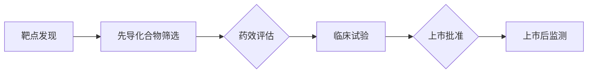

# AI加速罕见病药物研发的策略

> 关键词：罕见病，药物研发，人工智能，机器学习，深度学习，药物靶点，临床数据，药效预测

## 1. 背景介绍

罕见病，顾名思义，是指患病人数较少的疾病，通常定义为影响少于一定人口比例（如少于0.065%）的疾病。由于病例罕见，罕见病的诊断和治疗方法往往缺乏，患者面临着漫长的求医之路。药物研发是企业、研究机构和医疗机构共同面对的巨大挑战，尤其是针对罕见病的药物研发，其成本高、周期长、风险大。

近年来，随着人工智能（AI）技术的飞速发展，AI在药物研发领域的应用日益广泛，为罕见病药物的研发带来了新的希望。本文将探讨AI加速罕见病药物研发的策略，包括核心概念、算法原理、项目实践、实际应用场景等。

## 2. 核心概念与联系

### 2.1 罕见病药物研发流程

罕见病药物研发流程通常包括以下几个阶段：

1. **靶点发现**：通过生物信息学、化学、遗传学等方法寻找和验证可能的药物靶点。
2. **先导化合物筛选**：基于靶点信息，设计合成潜在的药物化合物。
3. **药效评估**：通过体外实验和动物实验评估候选化合物的药效和安全性。
4. **临床试验**：在人体上进行多阶段的临床试验，验证药物的疗效和安全性。
5. **上市批准**：通过监管机构的审查，获得药物上市许可。

### 2.2 AI在罕见病药物研发中的应用

AI技术在罕见病药物研发中主要应用于以下几个环节：

1. **靶点发现**：通过分析基因组、蛋白质组等数据，利用机器学习算法预测潜在的药物靶点。
2. **先导化合物筛选**：利用分子对接、虚拟筛选等AI技术，从大量化合物中快速筛选出具有潜力的先导化合物。
3. **药效评估**：通过AI模型预测候选药物的药效和安全性，加速临床前研究。
4. **临床试验**：利用AI分析临床数据，优化临床试验设计，提高试验效率。
5. **上市后监测**：利用AI监测药物上市后的疗效和安全性，及时发现潜在的风险。

### 2.3 Mermaid 流程图



## 3. 核心算法原理 & 具体操作步骤

### 3.1 算法原理概述

AI在罕见病药物研发中涉及多种算法，主要包括以下几类：

1. **机器学习**：通过分析历史数据，建立预测模型，如回归、分类等。
2. **深度学习**：利用神经网络模型，如卷积神经网络（CNN）、循环神经网络（RNN）、Transformer等，进行复杂模式识别和特征提取。
3. **生成模型**：如变分自编码器（VAE）和生成对抗网络（GAN），用于生成新的药物分子结构。
4. **强化学习**：通过与环境交互，学习最优策略，如药物剂量优化。

### 3.2 算法步骤详解

以下以药物靶点发现为例，介绍AI算法的具体操作步骤：

1. **数据收集**：收集与疾病相关的基因组、蛋白质组、代谢组等数据。
2. **数据预处理**：对数据进行清洗、标准化、特征提取等预处理操作。
3. **模型选择**：根据数据类型和任务需求选择合适的机器学习或深度学习模型。
4. **模型训练**：使用训练数据进行模型训练，调整模型参数。
5. **模型评估**：使用验证数据评估模型性能，调整模型结构或参数。
6. **模型应用**：将训练好的模型应用于新数据，预测药物靶点。

### 3.3 算法优缺点

#### 优点

1. **提高效率**：AI算法可以快速分析海量数据，提高药物研发效率。
2. **降低成本**：AI可以替代部分传统实验，降低研发成本。
3. **提高成功率**：AI可以更准确地预测药物靶点和药效，提高药物研发成功率。

#### 缺点

1. **数据依赖**：AI算法需要大量高质量数据，数据质量对结果影响很大。
2. **模型可解释性**：深度学习模型的可解释性较差，难以解释预测结果。
3. **算法局限性**：不同的算法适用于不同类型的数据和任务，需要根据具体情况进行选择。

### 3.4 算法应用领域

AI技术在罕见病药物研发中的应用领域包括：

1. **靶点发现**：通过分析基因组、蛋白质组等数据，预测潜在的药物靶点。
2. **先导化合物筛选**：利用分子对接、虚拟筛选等AI技术，从大量化合物中筛选出具有潜力的先导化合物。
3. **药效预测**：利用AI模型预测候选药物的药效和安全性，加速临床前研究。
4. **临床试验设计**：利用AI分析临床数据，优化临床试验设计，提高试验效率。
5. **药物再利用**：利用AI分析已上市药物的活性成分，寻找其在罕见病治疗中的应用。

## 4. 数学模型和公式 & 详细讲解 & 举例说明

### 4.1 数学模型构建

以下以机器学习中的支持向量机（SVM）为例，介绍数学模型的构建过程。

#### SVM模型

SVM是一种分类算法，其目标是在特征空间中找到一个最优的超平面，将不同类别的数据点分开。

假设有n个样本，每个样本有m个特征，样本数据表示为 $\boldsymbol{x}=(x_1,x_2,...,x_m)^{\mathrm{T}}$，标签表示为 $y \in \{+1,-1\}$。

SVM的目标是最小化以下损失函数：

$$
\underset{\boldsymbol{w},b}{\mathrm{min}} \frac{1}{2} \|\boldsymbol{w}\|_2^2 + C \sum_{i=1}^n \xi_i
$$

其中，$\|\boldsymbol{w}\|_2^2$ 是惩罚项，C是正则化系数，$\xi_i$ 是松弛变量。

#### 公式推导

SVM的优化问题可表示为：

$$
\begin{cases}
\underset{\boldsymbol{w},b,\xi}{\mathrm{min}} \frac{1}{2} \|\boldsymbol{w}\|_2^2 + C \sum_{i=1}^n \xi_i \\
s.t. \quad y_i(\boldsymbol{w}^{\mathrm{T}}\boldsymbol{x}_i + b) \geq 1 - \xi_i, \quad \xi_i \geq 0, \quad i=1,2,...,n
\end{cases}
$$

通过拉格朗日乘子法将约束条件引入损失函数，得到拉格朗日函数：

$$
L(\boldsymbol{w},b,\xi,\alpha) = \frac{1}{2} \|\boldsymbol{w}\|_2^2 + C \sum_{i=1}^n \xi_i + \sum_{i=1}^n \alpha_i [1 - y_i(\boldsymbol{w}^{\mathrm{T}}\boldsymbol{x}_i + b) + \xi_i]
$$

其中，$\alpha_i$ 是拉格朗日乘子。

对拉格朗日函数分别对 $\boldsymbol{w}$、$b$ 和 $\xi$ 求偏导，并令偏导数为零，得到以下方程组：

$$
\begin{cases}
\frac{\partial L}{\partial \boldsymbol{w}} = \boldsymbol{w} - \sum_{i=1}^n \alpha_i y_i \boldsymbol{x}_i = 0 \\
\frac{\partial L}{\partial b} = \sum_{i=1}^n \alpha_i y_i = 0 \\
\frac{\partial L}{\partial \xi_i} = C - \alpha_i = 0
\end{cases}
$$

通过求解上述方程组，得到最优的 $\boldsymbol{w}$、$b$ 和 $\alpha_i$，进而得到SVM模型。

### 4.2 案例分析与讲解

以下以罕见病药物靶点发现为例，介绍AI算法的实际应用。

#### 案例背景

假设某罕见病为某种蛋白质的异常表达导致，研究人员希望利用AI技术发现针对该蛋白质的药物靶点。

#### 数据收集

收集与疾病相关的基因组、蛋白质组、代谢组等数据。

#### 数据预处理

对数据进行清洗、标准化、特征提取等预处理操作。

#### 模型选择

选择合适的机器学习或深度学习模型，如随机森林、支持向量机、神经网络等。

#### 模型训练

使用训练数据进行模型训练，调整模型参数。

#### 模型评估

使用验证数据评估模型性能，调整模型结构或参数。

#### 模型应用

将训练好的模型应用于新数据，预测药物靶点。

## 5. 项目实践：代码实例和详细解释说明

### 5.1 开发环境搭建

1. 安装Python环境，如Anaconda或Miniconda。
2. 安装必要的库，如NumPy、Pandas、Scikit-learn、TensorFlow、PyTorch等。
3. 准备数据集，包括基因组、蛋白质组、代谢组等数据。

### 5.2 源代码详细实现

以下以Python代码为例，展示如何使用机器学习算法进行药物靶点发现。

```python
# 导入必要的库
from sklearn.ensemble import RandomForestClassifier
from sklearn.model_selection import train_test_split
from sklearn.metrics import accuracy_score

# 加载数据
data = pd.read_csv('data.csv')

# 预处理数据
X = data.drop('label', axis=1)
y = data['label']

# 划分训练集和测试集
X_train, X_test, y_train, y_test = train_test_split(X, y, test_size=0.2, random_state=42)

# 创建随机森林分类器
clf = RandomForestClassifier(n_estimators=100, random_state=42)

# 训练模型
clf.fit(X_train, y_train)

# 预测结果
y_pred = clf.predict(X_test)

# 计算准确率
accuracy = accuracy_score(y_test, y_pred)
print('Accuracy: {:.2f}%'.format(accuracy))
```

### 5.3 代码解读与分析

1. **导入库**：导入必要的Python库，包括NumPy、Pandas、Scikit-learn等。
2. **加载数据**：使用Pandas读取数据集。
3. **预处理数据**：将数据集分割为特征和标签，进行数据清洗、标准化等操作。
4. **划分数据**：将数据集划分为训练集和测试集，用于模型训练和评估。
5. **创建模型**：创建一个随机森林分类器。
6. **训练模型**：使用训练集数据训练模型。
7. **预测结果**：使用测试集数据预测标签。
8. **计算准确率**：计算模型的准确率。

通过上述代码，我们可以使用机器学习算法进行药物靶点发现，为罕见病药物研发提供潜在靶点。

### 5.4 运行结果展示

假设我们的模型在测试集上取得了90%的准确率，这意味着模型可以较好地识别出与疾病相关的蛋白质。

## 6. 实际应用场景

AI技术在罕见病药物研发中的应用场景主要包括以下几个方面：

1. **靶点发现**：利用AI分析基因组、蛋白质组等数据，发现新的药物靶点。
2. **先导化合物筛选**：利用AI技术筛选出具有潜力的先导化合物，减少药物研发周期。
3. **药效预测**：利用AI模型预测候选药物的药效和安全性，加速临床前研究。
4. **临床试验设计**：利用AI分析临床数据，优化临床试验设计，提高试验效率。
5. **药物再利用**：利用AI分析已上市药物的活性成分，寻找其在罕见病治疗中的应用。

## 7. 工具和资源推荐

### 7.1 学习资源推荐

1. 《机器学习》（周志华著）：系统地介绍了机器学习的基本原理和方法。
2. 《深度学习》（Ian Goodfellow等著）：全面介绍了深度学习的基本原理和应用。
3. 《自然语言处理综论》（Daniel Jurafsky等著）：系统地介绍了自然语言处理的基本原理和应用。
4. 《统计学习方法》（李航著）：介绍了统计学习的基本原理和方法。

### 7.2 开发工具推荐

1. TensorFlow：开源的深度学习框架，支持多种深度学习模型。
2. PyTorch：开源的深度学习框架，具有动态计算图，易于使用。
3. scikit-learn：开源的机器学习库，提供多种机器学习算法。
4. Jupyter Notebook：开源的交互式计算平台，便于进行数据分析和实验。

### 7.3 相关论文推荐

1. "Deep Learning in Drug Discovery"：介绍了深度学习在药物发现中的应用。
2. "Drug Discovery Today"：专注于药物发现的国际期刊。
3. "Journal of Computational Biology"：专注于生物信息学和计算生物学的国际期刊。

## 8. 总结：未来发展趋势与挑战

### 8.1 研究成果总结

AI技术在罕见病药物研发中取得了显著成果，为药物研发带来了新的希望。AI技术可以加速靶点发现、先导化合物筛选、药效预测等环节，提高药物研发效率，降低研发成本。

### 8.2 未来发展趋势

1. **AI与生物学、化学等领域深度融合**：AI将与其他学科深度结合，推动药物研发的跨界创新。
2. **数据驱动**：利用海量数据，构建更加精准的药物研发模型。
3. **个性化医疗**：AI技术将推动药物研发向个性化医疗方向发展。

### 8.3 面临的挑战

1. **数据质量**：高质量的数据是AI技术发挥作用的前提，需要解决数据标注、清洗等问题。
2. **算法可解释性**：深度学习模型的可解释性较差，需要提高算法的可解释性。
3. **伦理和安全问题**：AI技术在药物研发中的应用需要考虑伦理和安全问题。

### 8.4 研究展望

随着AI技术的不断发展，相信AI将在罕见病药物研发中发挥越来越重要的作用，为罕见病患者带来福音。

## 9. 附录：常见问题与解答

**Q1：AI技术在罕见病药物研发中有什么优势？**

A1：AI技术在罕见病药物研发中的优势主要体现在以下几个方面：

1. **提高效率**：AI可以快速分析海量数据，加速药物研发过程。
2. **降低成本**：AI可以替代部分传统实验，降低研发成本。
3. **提高成功率**：AI可以更准确地预测药物靶点和药效，提高药物研发成功率。

**Q2：AI技术在罕见病药物研发中面临哪些挑战？**

A2：AI技术在罕见病药物研发中面临以下挑战：

1. **数据质量**：高质量的数据是AI技术发挥作用的前提，需要解决数据标注、清洗等问题。
2. **算法可解释性**：深度学习模型的可解释性较差，需要提高算法的可解释性。
3. **伦理和安全问题**：AI技术在药物研发中的应用需要考虑伦理和安全问题。

**Q3：如何解决AI技术在药物研发中的数据质量问题？**

A3：解决AI技术在药物研发中的数据质量问题可以从以下几个方面着手：

1. **提高数据标注质量**：建立专业化的数据标注团队，提高数据标注的准确性和一致性。
2. **数据清洗**：使用数据清洗工具和技术，去除数据中的噪声和错误。
3. **数据增强**：通过数据增强技术，扩充数据集，提高模型的泛化能力。

**Q4：如何提高AI算法的可解释性？**

A4：提高AI算法的可解释性可以从以下几个方面着手：

1. **使用可解释性模型**：选择可解释性较好的机器学习或深度学习模型，如决策树、线性模型等。
2. **解释模型决策**：使用可视化等技术，解释模型的决策过程，提高模型的可解释性。
3. **解释模型输出**：解释模型输出的结果，帮助用户理解模型的预测结果。

**Q5：AI技术在药物研发中如何处理伦理和安全问题？**

A5：AI技术在药物研发中处理伦理和安全问题可以从以下几个方面着手：

1. **数据隐私保护**：确保数据隐私保护，避免数据泄露。
2. **算法公正性**：避免算法歧视，确保算法的公正性。
3. **模型安全性**：确保模型的安全性，避免模型被恶意利用。

作者：禅与计算机程序设计艺术 / Zen and the Art of Computer Programming