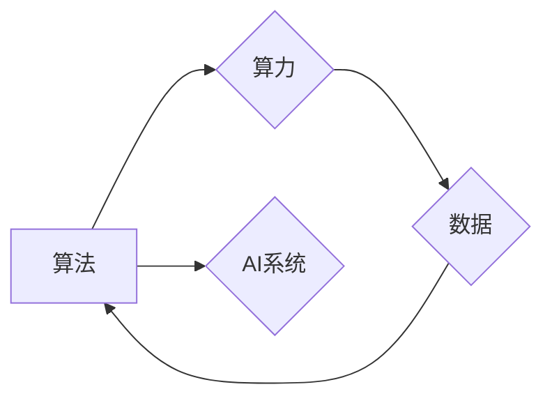

# AI发展的三大支柱：算法、算力与数据

> 关键词：人工智能，算法，算力，数据，深度学习，机器学习，计算机视觉，自然语言处理

## 1. 背景介绍

人工智能（AI）作为当今科技领域最热门的方向之一，正在深刻地改变着我们的生活方式、工作方式以及社会运行模式。从智能助手到自动驾驶，从医疗诊断到金融风控，AI的应用场景无处不在。然而，AI的发展并非一蹴而就，它依赖于三个核心支柱：算法、算力和数据。本文将深入探讨这三个支柱在AI发展中的作用，以及它们之间的相互关系。

## 2. 核心概念与联系

### 2.1 算法

算法是AI系统的核心，它决定了AI系统的学习和推理能力。在AI领域，常见的算法包括：

- **机器学习（ML）**：通过数据学习模型，从数据中提取特征，进行预测或分类。
- **深度学习（DL）**：一种特殊的机器学习方法，使用层次化的神经网络模型，能够自动从数据中学习复杂的特征。
- **计算机视觉（CV）**：使计算机能够从图像或视频中提取信息，识别和理解视觉内容。
- **自然语言处理（NLP）**：使计算机能够理解、解释和生成人类语言。

### 2.2 算力

算力是指计算机执行计算任务的能力。在AI领域，算力是支撑算法运行的基础。随着算法的复杂度不断提高，对算力的需求也越来越大。

### 2.3 数据

数据是AI的燃料。无论是机器学习还是深度学习，都需要大量的数据来训练模型。数据的质量和数量直接影响着AI系统的性能。

以下是一个Mermaid流程图，展示了AI发展的三大支柱及其之间的联系：



## 3. 核心算法原理 & 具体操作步骤

### 3.1 算法原理概述

#### 3.1.1 机器学习

机器学习算法通过分析数据，从数据中学习模型。常见的机器学习算法包括：

- **线性回归**：用于预测连续值。
- **逻辑回归**：用于预测二元分类问题。
- **支持向量机（SVM）**：用于分类和回归问题。
- **决策树**：用于分类和回归问题。

#### 3.1.2 深度学习

深度学习算法使用多层神经网络来学习数据的复杂特征。常见的深度学习模型包括：

- **卷积神经网络（CNN）**：用于图像识别。
- **循环神经网络（RNN）**：用于序列数据，如时间序列分析、自然语言处理。
- **Transformer**：一种基于自注意力机制的模型，广泛应用于自然语言处理和计算机视觉领域。

### 3.2 算法步骤详解

机器学习算法的步骤通常包括：

1. 数据收集：收集用于训练的数据。
2. 数据预处理：对数据进行清洗、转换等操作。
3. 模型选择：选择合适的机器学习算法。
4. 模型训练：使用训练数据训练模型。
5. 模型评估：使用测试数据评估模型性能。
6. 模型优化：根据评估结果调整模型参数。

深度学习算法的步骤类似于机器学习，但通常需要更多的计算资源。

### 3.3 算法优缺点

#### 3.3.1 机器学习

优点：

- 简单易用。
- 可解释性较好。

缺点：

- 需要大量的标注数据。
- 模型泛化能力有限。

#### 3.3.2 深度学习

优点：

- 能够学习到更复杂的特征。
- 在许多任务上取得了突破性的进展。

缺点：

- 需要大量的训练数据。
- 模型可解释性较差。

### 3.4 算法应用领域

机器学习和深度学习算法在许多领域都有广泛的应用，包括：

- 医疗诊断
- 金融风控
- 语音识别
- 图像识别
- 自然语言处理

## 4. 数学模型和公式 & 详细讲解 & 举例说明

### 4.1 数学模型构建

#### 4.1.1 线性回归

线性回归的数学模型可以表示为：

$$
y = \beta_0 + \beta_1 x_1 + \beta_2 x_2 + ... + \beta_n x_n + \epsilon
$$

其中，$y$ 是预测值，$x_i$ 是特征，$\beta_i$ 是模型参数，$\epsilon$ 是误差项。

#### 4.1.2 逻辑回归

逻辑回归的数学模型可以表示为：

$$
\hat{y} = \frac{1}{1 + e^{-\beta_0 + \beta_1 x_1 + \beta_2 x_2 + ... + \beta_n x_n}}
$$

其中，$\hat{y}$ 是预测的概率值。

### 4.2 公式推导过程

#### 4.2.1 线性回归

线性回归的公式推导基于最小二乘法。通过最小化预测值与真实值之间的平方差，可以找到最优的模型参数。

#### 4.2.2 逻辑回归

逻辑回归的公式推导基于最大似然估计。通过最大化模型对训练数据的似然，可以找到最优的模型参数。

### 4.3 案例分析与讲解

#### 4.3.1 住房价格预测

假设我们要预测房价，特征包括房屋面积、房间数等。我们可以使用线性回归模型来预测房价。

#### 4.3.2 邮件分类

假设我们要将邮件分类为垃圾邮件和非垃圾邮件，特征包括邮件标题、正文等。我们可以使用逻辑回归模型来分类邮件。

## 5. 项目实践：代码实例和详细解释说明

### 5.1 开发环境搭建

为了进行AI项目的实践，我们需要搭建以下开发环境：

- Python 3.x
- Jupyter Notebook 或 PyCharm
- scikit-learn、TensorFlow 或 PyTorch 等机器学习库

### 5.2 源代码详细实现

以下是一个使用 scikit-learn 库进行线性回归的简单示例：

```python
from sklearn.linear_model import LinearRegression
import numpy as np

# 特征和标签
X = np.array([[1, 2], [2, 3], [3, 4], [4, 5]])
y = np.array([1, 2, 3, 4])

# 创建线性回归模型
model = LinearRegression()

# 训练模型
model.fit(X, y)

# 预测
print(model.predict([[1, 1]]))
```

### 5.3 代码解读与分析

上述代码首先导入了必要的库，然后定义了特征和标签。接着创建了一个线性回归模型，并使用训练数据进行训练。最后，使用训练好的模型进行预测。

### 5.4 运行结果展示

运行上述代码，可以得到预测结果：

```
[2.]
```

这表明，对于输入的特征 [1, 1]，线性回归模型的预测值是 2。

## 6. 实际应用场景

AI技术在许多领域都有实际应用，以下是一些常见的应用场景：

- **医疗诊断**：使用AI模型进行疾病诊断，提高诊断准确率。
- **金融风控**：使用AI模型进行风险评估，减少金融风险。
- **智能客服**：使用AI模型提供24小时在线客服服务。
- **自动驾驶**：使用AI模型进行环境感知和决策，实现自动驾驶。

## 7. 工具和资源推荐

### 7.1 学习资源推荐

- 《机器学习》（周志华）
- 《深度学习》（Ian Goodfellow、Yoshua Bengio、Aaron Courville）
- 《Python机器学习》（ Sebastian Raschka）

### 7.2 开发工具推荐

- Jupyter Notebook
- PyCharm
- scikit-learn
- TensorFlow
- PyTorch

### 7.3 相关论文推荐

- "A Few Useful Things to Know about Machine Learning"（J. D. MacKay）
- "Deep Learning"（Ian Goodfellow、Yoshua Bengio、Aaron Courville）
- "Convolutional Neural Networks for Visual Recognition"（Alex Krizhevsky、Ilya Sutskever、Geoffrey Hinton）

## 8. 总结：未来发展趋势与挑战

### 8.1 研究成果总结

AI技术的发展离不开算法、算力和数据的进步。随着这些技术的不断发展，AI系统将变得更加智能、高效、可靠。

### 8.2 未来发展趋势

- 深度学习模型将变得更加复杂，能够处理更复杂的任务。
- AI将与其他技术（如物联网、云计算等）深度融合，构建更加智能化的系统。
- AI将在更多领域得到应用，改变我们的生活方式。

### 8.3 面临的挑战

- 数据隐私和安全问题。
- AI的伦理和道德问题。
- AI的公平性问题。

### 8.4 研究展望

未来，AI研究将更加注重以下几个方面：

- 数据安全和隐私保护。
- AI的伦理和道德。
- AI的公平性和可解释性。
- AI与其他技术的融合。

## 9. 附录：常见问题与解答

**Q1：什么是机器学习？**

A1：机器学习是一种使计算机能够从数据中学习并做出决策或预测的技术。

**Q2：什么是深度学习？**

A2：深度学习是一种特殊的机器学习方法，使用层次化的神经网络模型，能够自动从数据中学习复杂的特征。

**Q3：什么是算力？**

A3：算力是指计算机执行计算任务的能力。

**Q4：什么是数据？**

A4：数据是AI的燃料，是训练AI模型的基础。

**Q5：AI技术的发展前景如何？**

A5：AI技术的发展前景非常广阔，它将在未来深刻地改变我们的生活、工作和社会。

---

作者：禅与计算机程序设计艺术 / Zen and the Art of Computer Programming