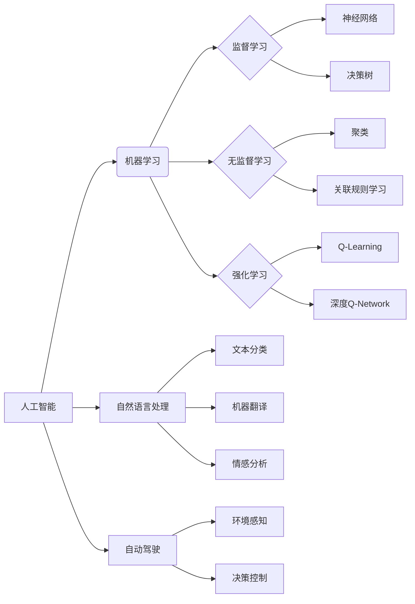

> 人工智能，机器学习，深度学习，自然语言处理，自动驾驶，伦理，未来展望

# Andrej Karpathy：人工智能的未来发展前景

## 1. 背景介绍

人工智能（AI）作为一个充满无限可能性的领域，近年来已经取得了令人瞩目的进展。Andrej Karpathy，作为OpenAI的首席科学家，他的工作在推动AI技术发展方面发挥了重要作用。本文将探讨Andrej Karpathy关于人工智能未来发展的观点，分析其核心概念与联系，并展望AI技术的未来趋势与挑战。

## 2. 核心概念与联系

### 2.1 人工智能的定义

人工智能是一种模拟、延伸和扩展人类智能的科学和技术。它包括机器学习、深度学习、自然语言处理、计算机视觉等多个子领域。

### 2.2 机器学习

机器学习是AI的一个分支，它使计算机能够从数据中学习并做出决策或预测。机器学习分为监督学习、无监督学习和强化学习。

### 2.3 深度学习

深度学习是机器学习的一个子集，它使用多层神经网络来学习数据的复杂特征。

### 2.4 自然语言处理

自然语言处理（NLP）是AI的一个分支，它使计算机能够理解和处理人类语言。

### 2.5 自动驾驶

自动驾驶是AI在交通领域的应用，它使汽车能够自主行驶。

### Mermaid 流程图



## 3. 核心算法原理 & 具体操作步骤

### 3.1 算法原理概述

AI的核心算法包括机器学习算法、神经网络算法和深度学习算法。

### 3.2 算法步骤详解

1. 数据收集：收集大量数据，用于训练和测试AI模型。
2. 数据预处理：对数据进行清洗、标注和特征提取。
3. 模型选择：根据任务需求选择合适的AI模型。
4. 模型训练：使用训练数据对模型进行训练。
5. 模型评估：使用测试数据评估模型的性能。
6. 模型优化：根据评估结果对模型进行优化。

### 3.3 算法优缺点

- 优点：AI技术能够处理大量数据，提高效率和准确性。
- 缺点：AI技术可能存在偏见、隐私问题和伦理问题。

### 3.4 算法应用领域

AI技术在各个领域都有广泛的应用，包括医疗、金融、交通、教育等。

## 4. 数学模型和公式 & 详细讲解 & 举例说明

### 4.1 数学模型构建

AI模型通常由数学模型构建而成，例如神经网络模型。

### 4.2 公式推导过程

神经网络模型的数学公式如下：

$$
\hat{y} = f(\mathbf{W} \cdot \mathbf{z} + b)
$$

其中，$\hat{y}$ 为输出，$\mathbf{W}$ 为权重，$\mathbf{z}$ 为输入，$b$ 为偏置，$f$ 为激活函数。

### 4.3 案例分析与讲解

以卷积神经网络（CNN）为例，它是一种常用于图像识别的神经网络。CNN的数学模型如下：

$$
h_{l} = \sigma(\mathbf{W}_{l} \cdot h_{l-1} + b_{l})
$$

其中，$h_{l}$ 为第$l$层的输出，$\mathbf{W}_{l}$ 为第$l$层的权重，$b_{l}$ 为第$l$层的偏置，$\sigma$ 为激活函数。

## 5. 项目实践：代码实例和详细解释说明

### 5.1 开发环境搭建

以下为使用Python和TensorFlow搭建深度学习开发环境的步骤：

1. 安装Anaconda：从Anaconda官网下载并安装。
2. 创建虚拟环境：`conda create -n tensorflow_env python=3.7`
3. 激活虚拟环境：`conda activate tensorflow_env`
4. 安装TensorFlow：`pip install tensorflow`

### 5.2 源代码详细实现

以下为使用TensorFlow实现一个简单的神经网络模型的代码示例：

```python
import tensorflow as tf

model = tf.keras.Sequential([
    tf.keras.layers.Dense(64, activation='relu', input_shape=[784]),
    tf.keras.layers.Dense(10, activation='softmax')
])

model.compile(optimizer='adam',
              loss='sparse_categorical_crossentropy',
              metrics=['accuracy'])

model.fit(x_train, y_train, epochs=5)

test_loss, test_acc = model.evaluate(x_test,  y_test, verbose=2)
print('
Test accuracy:', test_acc)
```

### 5.3 代码解读与分析

以上代码首先导入了TensorFlow库，并创建了一个简单的神经网络模型，包括一个输入层、一个隐藏层和一个输出层。模型使用ReLU作为激活函数，输出层使用softmax激活函数，用于分类任务。接着，使用Adam优化器、交叉熵损失函数和准确率作为评估指标编译模型。最后，使用训练数据训练模型，并在测试数据上评估模型的性能。

## 6. 实际应用场景

### 6.1 医疗

AI技术在医疗领域的应用包括疾病诊断、药物研发、手术机器人等。

### 6.2 金融

AI技术在金融领域的应用包括欺诈检测、风险管理、投资策略等。

### 6.3 交通

AI技术在交通领域的应用包括自动驾驶、交通流量预测、交通信号控制等。

### 6.4 教育

AI技术在教育领域的应用包括个性化推荐、智能辅导、自动评分等。

## 7. 工具和资源推荐

### 7.1 学习资源推荐

- 《Python机器学习》
- 《深度学习》
- 《人工智能：一种现代的方法》

### 7.2 开发工具推荐

- TensorFlow
- PyTorch
- Keras

### 7.3 相关论文推荐

- "ImageNet Classification with Deep Convolutional Neural Networks"（AlexNet）
- "Playing Atari with Deep Reinforcement Learning"（Deep Q-Network）
- "Sequence to Sequence Learning with Neural Networks"（Seq2Seq）

## 8. 总结：未来发展趋势与挑战

### 8.1 研究成果总结

AI技术在各个领域取得了显著的成果，但仍面临许多挑战。

### 8.2 未来发展趋势

- 跨学科融合
- 算法创新
- 安全性和可解释性

### 8.3 面临的挑战

- 隐私保护
- 伦理问题
- 数据质量

### 8.4 研究展望

AI技术将在未来继续发展，为人类社会带来更多福祉。

## 9. 附录：常见问题与解答

**Q1：什么是人工智能？**

A：人工智能是一种模拟、延伸和扩展人类智能的科学和技术。

**Q2：什么是机器学习？**

A：机器学习是AI的一个分支，它使计算机能够从数据中学习并做出决策或预测。

**Q3：什么是深度学习？**

A：深度学习是机器学习的一个子集，它使用多层神经网络来学习数据的复杂特征。

**Q4：人工智能有哪些应用？**

A：人工智能在医疗、金融、交通、教育等多个领域都有广泛的应用。

**Q5：人工智能面临哪些挑战？**

A：人工智能面临隐私保护、伦理问题和数据质量等挑战。

---

作者：禅与计算机程序设计艺术 / Zen and the Art of Computer Programming