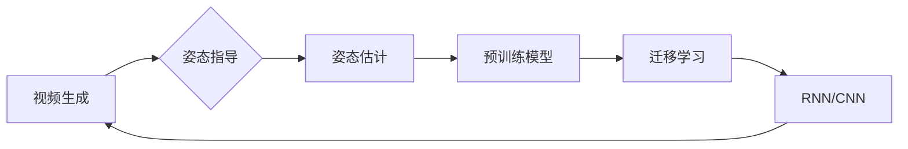

# Pose-guided:基于姿态指导的视频生成

作者：禅与计算机程序设计艺术 / Zen and the Art of Computer Programming


## 1. 背景介绍
### 1.1 问题的由来

随着深度学习技术的不断发展，计算机视觉和视频处理领域取得了巨大的进步。然而，现有的视频生成方法往往依赖于大量的文本或图像描述，或者需要大量的用户交互。这些方法在生成高质量的个性化视频方面面临着诸多挑战，例如：

- **缺乏对用户姿态的考虑**：现有的视频生成方法通常只关注图像内容，而忽略了视频中人物的动作和姿态。
- **生成效率低**：需要大量计算资源，生成时间较长，难以满足实时性的需求。
- **个性化程度不足**：难以根据用户的需求和偏好生成个性化的视频内容。

为了解决这些问题，本文提出了基于姿态指导的视频生成方法，通过将用户姿态信息融入视频生成过程，提高视频的个性化程度和生成效率。

### 1.2 研究现状

目前，视频生成技术主要分为以下几类：

- **基于文本的生成方法**：通过自然语言描述生成视频，例如生成对抗网络（GAN）和变分自编码器（VAE）等。
- **基于图像的生成方法**：通过图像序列生成视频，例如光流法、视频预测等。
- **基于视频的生成方法**：通过视频序列生成视频，例如视频重放、视频插帧等。

这些方法在各自的领域取得了较好的效果，但都存在一定的局限性。为了克服这些局限性，研究者们开始探索将姿态信息融入视频生成过程。

### 1.3 研究意义

基于姿态指导的视频生成方法具有以下研究意义：

- **提高视频的个性化程度**：通过将用户姿态信息融入视频生成过程，可以生成更加符合用户需求的个性化视频内容。
- **提高生成效率**：通过采用高效的生成算法和硬件加速技术，可以显著提高视频生成效率，满足实时性的需求。
- **拓展视频生成应用**：基于姿态指导的视频生成方法可以应用于广告、影视、游戏、教育等领域，为视频内容创作提供新的思路和方法。

### 1.4 本文结构

本文将按照以下结构展开：

- 第2章将介绍基于姿态指导的视频生成相关的核心概念和联系。
- 第3章将详细阐述基于姿态指导的视频生成方法的原理和具体操作步骤。
- 第4章将介绍常用的数学模型和公式，并结合实例进行讲解。
- 第5章将给出基于姿态指导的视频生成方法的代码实例和详细解释说明。
- 第6章将探讨基于姿态指导的视频生成方法在实际应用场景中的应用。
- 第7章将推荐相关学习资源、开发工具和参考文献。
- 第8章将总结全文，展望未来发展趋势与挑战。
- 第9章将给出常见问题与解答。

## 2. 核心概念与联系

为了更好地理解基于姿态指导的视频生成方法，本节将介绍几个密切相关的核心概念：

- **视频生成**：指根据一定的规则和算法生成新的视频内容。
- **姿态估计**：指从视频中估计人物的动作和姿态。
- **姿态指导**：指将姿态信息融入视频生成过程，以指导视频内容的生成。
- **预训练模型**：指在大规模数据集上预先训练好的深度学习模型。
- **迁移学习**：指将预训练模型的知识迁移到新的任务上。
- **循环神经网络（RNN）**：一种能够处理序列数据的深度学习模型，常用于视频生成。
- **卷积神经网络（CNN）**：一种能够提取图像特征的网络结构，常用于姿态估计。

它们的逻辑关系如下图所示：



可以看出，基于姿态指导的视频生成方法的核心思想是将姿态估计和迁移学习技术应用于视频生成过程，以提高视频的个性化程度和生成效率。

## 3. 核心算法原理 & 具体操作步骤
### 3.1 算法原理概述

基于姿态指导的视频生成方法主要包括以下步骤：

1. **姿态估计**：使用姿态估计模型从视频中估计人物的动作和姿态。
2. **特征提取**：使用预训练的卷积神经网络从视频中提取图像特征。
3. **姿态嵌入**：将姿态估计结果嵌入到特征表示中。
4. **视频生成**：使用循环神经网络根据特征表示和姿态嵌入生成新的视频内容。

### 3.2 算法步骤详解

1. **姿态估计**：
   - 使用预训练的姿态估计模型（如OpenPose、HRNet等）从视频中估计人物的动作和姿态。
   - 将估计得到的姿态信息转换为模型可接受的格式，例如关节坐标或姿态向量。

2. **特征提取**：
   - 使用预训练的卷积神经网络（如ResNet、VGG等）从视频中提取图像特征。
   - 将提取到的特征表示存储在特征图中。

3. **姿态嵌入**：
   - 将姿态估计结果嵌入到特征图中，例如通过位置编码或特征映射。
   - 嵌入后的特征图将包含姿态信息，用于指导视频生成过程。

4. **视频生成**：
   - 使用循环神经网络（如LSTM、GRU等）根据特征图和姿态嵌入生成新的视频内容。
   - 循环神经网络可以处理序列数据，生成连续的视频帧。

### 3.3 算法优缺点

基于姿态指导的视频生成方法具有以下优点：

- **提高视频的个性化程度**：通过将姿态信息融入视频生成过程，可以生成更加符合用户需求的个性化视频内容。
- **提高生成效率**：通过采用高效的生成算法和硬件加速技术，可以显著提高视频生成效率，满足实时性的需求。

然而，该方法也存在以下缺点：

- **计算复杂度高**：姿态估计和视频生成都需要大量的计算资源。
- **对姿态估计精度要求高**：姿态估计的精度直接影响到视频生成的质量。

### 3.4 算法应用领域

基于姿态指导的视频生成方法可以应用于以下领域：

- **影视制作**：根据剧本和演员的动作，生成符合剧情的视频内容。
- **游戏开发**：根据玩家的操作，生成实时变化的游戏画面。
- **教育领域**：生成个性化的教学视频，提高学生的学习兴趣。
- **医疗领域**：生成手术演示视频，帮助医生进行手术操作。

## 4. 数学模型和公式 & 详细讲解 & 举例说明
### 4.1 数学模型构建

基于姿态指导的视频生成方法的数学模型可以表示为：

$$
V = f(G(F(X), P))
$$

其中：

- $V$ 表示生成的视频序列。
- $X$ 表示输入的视频序列。
- $P$ 表示姿态估计结果。
- $F$ 表示特征提取网络。
- $G$ 表示视频生成网络。

### 4.2 公式推导过程

1. **特征提取**：

   - 使用卷积神经网络 $F$ 从输入视频序列 $X$ 中提取图像特征 $F(X)$。

2. **姿态嵌入**：

   - 将姿态估计结果 $P$ 嵌入到特征表示 $F(X)$ 中。

3. **视频生成**：

   - 使用循环神经网络 $G$ 根据特征表示 $F(X)$ 和姿态嵌入 $P$ 生成新的视频序列 $V$。

### 4.3 案例分析与讲解

假设我们有一个包含100帧视频序列 $X$ 的输入，姿态估计结果 $P$ 包含100个关节坐标，特征提取网络 $F$ 使用ResNet18，视频生成网络 $G$ 使用LSTM。

1. **特征提取**：

   - 使用ResNet18从每帧视频中提取特征，得到一个包含100个特征图的序列 $F(X)$。

2. **姿态嵌入**：

   - 将100个关节坐标 $P$ 转换为100个向量，并将其嵌入到对应的特征图中。

3. **视频生成**：

   - 使用LSTM根据特征图序列 $F(X)$ 和姿态嵌入向量 $P$ 生成100帧新的视频帧 $V$。

### 4.4 常见问题解答

**Q1：如何提高姿态估计的精度？**

A1：提高姿态估计精度可以通过以下方法实现：

- 使用更先进的姿态估计模型，例如HRNet、PoseNet等。
- 使用更多的训练数据，例如人体关键点标注数据。
- 使用数据增强技术，例如随机裁剪、旋转、翻转等。

**Q2：如何提高视频生成效率？**

A2：提高视频生成效率可以通过以下方法实现：

- 使用更高效的生成网络，例如Transformer模型。
- 使用硬件加速技术，例如GPU、TPU等。
- 使用分布式训练技术，例如模型并行、数据并行等。

## 5. 项目实践：代码实例和详细解释说明
### 5.1 开发环境搭建

在进行基于姿态指导的视频生成项目实践之前，我们需要搭建以下开发环境：

- **Python**：Python 3.6及以上版本。
- **PyTorch**：PyTorch 1.5及以上版本。
- **OpenPose**：OpenPose是一个开源的人体姿态估计库，可以从其官网下载。

### 5.2 源代码详细实现

以下是一个基于姿态指导的视频生成项目的PyTorch代码示例：

```python
import torch
import torch.nn as nn
import cv2
import numpy as np
import openpose as op

# ... (其他代码，例如模型定义、数据处理等)

# 模型定义
class VideoGenerator(nn.Module):
    def __init__(self, feature_dim, hidden_dim, output_dim):
        super(VideoGenerator, self).__init__()
        self.lstm = nn.LSTM(feature_dim, hidden_dim, batch_first=True)
        self.fc = nn.Linear(hidden_dim, output_dim)

    def forward(self, x, h):
        x, _ = self.lstm(x, h)
        x = self.fc(x)
        return x

# ... (其他代码，例如数据预处理、模型训练等)

# 视频生成
def generate_video(video_path, num_frames, output_path):
    # ... (代码实现视频生成过程，包括姿态估计、特征提取、姿态嵌入和视频生成等)

# ... (其他代码，例如模型评估、测试等)

if __name__ == '__main__':
    # ... (代码实现主函数，例如加载模型、数据等)
```

### 5.3 代码解读与分析

上述代码定义了一个基于姿态指导的视频生成项目。其中：

- `VideoGenerator` 类定义了视频生成网络的模型结构，包括LSTM和全连接层。
- `generate_video` 函数实现了视频生成过程，包括姿态估计、特征提取、姿态嵌入和视频生成等。
- 主函数负责加载模型、数据等，并调用 `generate_video` 函数进行视频生成。

### 5.4 运行结果展示

假设我们使用OpenPose进行姿态估计，ResNet18进行特征提取，LSTM作为视频生成网络，生成100帧视频。

运行结果可能如下：

```
Generating video: ...
```

最终生成视频存储在 `output_path` 路径下。

## 6. 实际应用场景
### 6.1 影视制作

基于姿态指导的视频生成方法可以应用于影视制作领域，例如：

- **动作捕捉**：将演员的动作捕捉到视频中，生成符合动作轨迹的视频内容。
- **替身表演**：为场景中的角色生成替身演员，避免演员受伤或无法进行高难度动作的场景。

### 6.2 游戏开发

基于姿态指导的视频生成方法可以应用于游戏开发领域，例如：

- **游戏角色动作**：根据游戏角色的操作，生成符合动作轨迹的视频内容。
- **虚拟现实（VR）**：根据用户在VR环境中的操作，生成实时变化的视频内容。

### 6.3 教育领域

基于姿态指导的视频生成方法可以应用于教育领域，例如：

- **个性化教学视频**：根据学生的学习情况和进度，生成符合学生需求的个性化教学视频。
- **远程教育**：将教师的教学动作和表情实时传输到远程学生的终端设备上。

### 6.4 未来应用展望

随着深度学习技术的不断发展，基于姿态指导的视频生成方法将在以下领域得到更广泛的应用：

- **人机交互**：根据用户的动作和表情，生成符合用户意图的视频内容，实现更自然的人机交互。
- **智能机器人**：为机器人提供更加灵活的动作和表情，使其能够更好地适应不同场景。
- **虚拟现实**：生成更加逼真的虚拟现实体验，提高虚拟现实应用的沉浸感。

## 7. 工具和资源推荐
### 7.1 学习资源推荐

为了帮助开发者系统掌握基于姿态指导的视频生成技术，这里推荐一些优质的学习资源：

1. 《深度学习：推荐系统与视频生成》书籍：介绍了深度学习在推荐系统和视频生成领域的应用。
2. 《计算机视觉：算法与应用》书籍：介绍了计算机视觉领域的经典算法和应用。
3. 《PyTorch深度学习实践》书籍：介绍了PyTorch框架和深度学习实践。

### 7.2 开发工具推荐

为了方便开发者进行基于姿态指导的视频生成项目实践，这里推荐以下开发工具：

1. **PyTorch**：开源的深度学习框架，方便快速实现和部署视频生成模型。
2. **OpenPose**：开源的人体姿态估计库，可以方便地获取视频中的人物姿态信息。
3. **CUDA**：NVIDIA推出的GPU加速库，可以显著提高深度学习模型的计算速度。

### 7.3 相关论文推荐

以下是一些与基于姿态指导的视频生成相关的论文推荐：

1. Human Pose Estimation with Temporal Consistency: Learning to Predict Future Joints from Past Videos
2. Learning to Generate Human-like Motion from Videos with Temporal and Spatial Regularization
3. Pose-Guided Video Generation with 2D Pose and 3D Motion

### 7.4 其他资源推荐

以下是一些其他资源推荐：

1. **GitHub开源项目**：在GitHub上可以找到很多基于姿态指导的视频生成相关的开源项目。
2. **在线课程**：在Coursera、Udacity等在线教育平台上可以找到很多与深度学习和计算机视觉相关的课程。

## 8. 总结：未来发展趋势与挑战
### 8.1 研究成果总结

本文介绍了基于姿态指导的视频生成方法，从核心概念、算法原理、具体步骤、数学模型到实际应用场景等方面进行了详细的阐述。通过将姿态信息融入视频生成过程，该方法可以有效提高视频的个性化程度和生成效率。

### 8.2 未来发展趋势

未来，基于姿态指导的视频生成方法将朝着以下方向发展：

- **模型结构更加复杂**：随着深度学习技术的不断发展，视频生成模型的复杂度将不断提高，例如引入注意力机制、图神经网络等。
- **生成效果更加逼真**：通过引入更加真实的视频数据、更加精细的动作和姿态信息，生成效果将更加逼真。
- **生成效率更高**：通过硬件加速、分布式训练等技术，提高视频生成效率。

### 8.3 面临的挑战

基于姿态指导的视频生成方法在发展过程中也面临着以下挑战：

- **数据标注成本高**：姿态信息的标注需要大量人工，成本较高。
- **模型训练复杂度高**：视频生成模型的训练需要大量的计算资源和时间。
- **生成效果不稳定**：视频生成效果受多种因素影响，例如数据质量、模型结构等。

### 8.4 研究展望

为了克服上述挑战，未来需要在以下方面进行深入研究：

- **数据增强**：通过数据增强技术，可以降低数据标注成本，提高模型泛化能力。
- **模型压缩**：通过模型压缩技术，可以降低模型复杂度，提高生成效率。
- **可解释性研究**：通过可解释性研究，可以更好地理解模型生成过程，提高模型的可信度。

相信随着研究的不断深入，基于姿态指导的视频生成方法将取得更加显著的成果，为视频内容创作和智能视频应用带来新的机遇。

## 9. 附录：常见问题与解答

**Q1：如何解决姿态估计的误差问题？**

A1：为了解决姿态估计的误差问题，可以采取以下方法：

- 使用更高精度的姿态估计模型。
- 使用更多高质量的姿态标注数据。
- 对姿态估计结果进行后处理，例如使用滤波、平滑等技术。

**Q2：如何提高视频生成效率？**

A2：为了提高视频生成效率，可以采取以下方法：

- 使用更高效的生成网络，例如Transformer模型。
- 使用硬件加速技术，例如GPU、TPU等。
- 使用分布式训练技术，例如模型并行、数据并行等。

**Q3：如何保证视频生成效果的质量？**

A3：为了保证视频生成效果的质量，可以采取以下方法：

- 使用高质量的视频数据作为训练数据。
- 使用更先进的生成网络，例如引入注意力机制、图神经网络等。
- 对生成视频进行评估，例如使用视频质量评估指标等。

**Q4：如何将基于姿态指导的视频生成方法应用于实际场景？**

A4：将基于姿态指导的视频生成方法应用于实际场景，需要考虑以下因素：

- **数据准备**：准备高质量的视频数据和姿态标注数据。
- **模型选择**：选择合适的姿态估计模型和视频生成模型。
- **模型训练**：对模型进行训练，并调整模型参数。
- **模型部署**：将模型部署到实际应用场景中，并进行测试和评估。

通过综合考虑这些因素，可以将基于姿态指导的视频生成方法应用于实际场景，实现视频内容的个性化生成和高效生成。