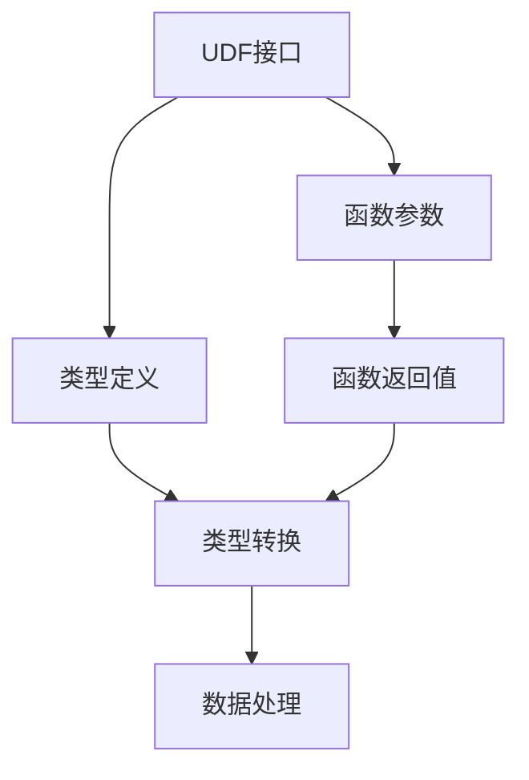

                 

# Pig UDF原理与代码实例讲解

## 1. 背景介绍

### 1.1 问题由来

Pig是一个大数据分析平台，利用Hadoop生态系统，提供高效的数据处理和分析能力。为了支持更丰富的数据处理需求，Pig引入了用户定义函数（User Defined Functions，简称UDF）的概念，允许用户根据自己的需求编写自定义函数，并在Pig脚本中使用。这极大地扩展了Pig的功能，使得Pig可以处理更加复杂的数据处理任务。

### 1.2 问题核心关键点

Pig UDF的核心关键点包括：
- **自定义函数**：用户可以定义自己的函数，处理特定的数据类型。
- **接口定义**：Pig提供了一些接口和规范，保证用户函数能够被正确地解析和使用。
- **类型转换**：Pig UDF可以处理各种基本类型和复杂类型的数据，实现类型之间的转换和操作。
- **可重用性**：Pig UDF可以在多个脚本和作业中使用，提高代码的重用性和效率。

### 1.3 问题研究意义

Pig UDF的研究和应用，具有重要的意义：
- **功能扩展**：通过自定义函数，用户可以扩展Pig的功能，处理更加复杂和多样化的数据处理需求。
- **代码复用**：用户可以编写可重用的函数，提高代码的复用性和开发效率。
- **数据处理能力提升**：通过自定义函数，用户可以实现更高效的数据处理和分析能力。
- **灵活性增强**：Pig UDF提供了灵活的函数编写方式，可以根据具体需求进行定制。

## 2. 核心概念与联系

### 2.1 核心概念概述

为了更好地理解Pig UDF的原理和应用，我们首先需要了解一些核心概念：

- **UDF接口**：Pig UDF通过定义接口来定义函数的功能和参数，使得Pig可以正确地解析和调用用户函数。
- **类型定义**：Pig UDF可以处理多种类型的数据，包括基本类型（如整数、浮点数等）和复杂类型（如Map、Tuple等）。
- **函数参数**：Pig UDF可以接受多种类型的参数，包括基本类型、复杂类型和数组类型等。
- **返回值类型**：Pig UDF可以返回各种类型的结果，包括基本类型、复杂类型和数组类型等。

### 2.2 核心概念的联系

这些核心概念之间存在紧密的联系，构成了Pig UDF的基本框架：

- **UDF接口和函数参数**：定义了函数的功能和参数类型，使得Pig可以正确地调用用户函数。
- **类型定义和函数返回值**：定义了函数可以处理和返回的数据类型，使得函数能够处理复杂的数据结构。
- **类型转换**：在函数内部，Pig UDF可以实现类型之间的转换，支持更灵活的数据处理操作。

这些概念共同构成了Pig UDF的核心框架，使得用户可以灵活地定义和调用自定义函数，实现更高效和多样化的数据处理任务。

### 2.3 核心概念的整体架构

下图展示了Pig UDF的核心概念和架构关系：



这个架构展示了Pig UDF的各个组件及其相互关系：
- **UDF接口**：定义函数的功能和参数类型。
- **函数参数**：接收用户传入的参数。
- **类型定义**：定义函数可以处理和返回的数据类型。
- **类型转换**：在函数内部进行类型转换，支持更灵活的数据操作。
- **数据处理**：函数的核心功能，实现数据的处理和分析。

## 3. 核心算法原理 & 具体操作步骤
### 3.1 算法原理概述

Pig UDF的核心算法原理是通过自定义函数，实现对数据的处理和分析。Pig UDF的实现过程包括：

1. **定义函数接口**：用户根据函数的功能和参数类型，定义函数的接口和签名。
2. **编写函数实现**：用户在函数内部实现数据的处理和分析逻辑。
3. **调用函数**：在Pig脚本中调用自定义函数，传入参数并返回结果。

### 3.2 算法步骤详解

以下是Pig UDF的详细实现步骤：

**Step 1: 定义函数接口**

在Pig中，用户可以通过继承`org.apache.pig.EvalUdf`类来定义UDF接口，并实现`evaluate`方法，该方法接收一个输入参数，返回一个结果：

```java
public class MyUDF extends EvalUdf {

    public MyUDF() {
        super();
    }

    @Override
    public List execute(List input) throws UdfException {
        // 实现函数的逻辑
    }

    public List evaluate(List input) throws UdfException {
        return execute(input);
    }
}
```

**Step 2: 编写函数实现**

在函数实现中，用户可以定义自己的数据处理逻辑，例如：

```java
public List execute(List input) throws UdfException {
    List output = new ArrayList<>();
    // 遍历输入数据，处理并添加结果
    return output;
}
```

**Step 3: 调用函数**

在Pig脚本中，用户可以像调用内置函数一样调用自定义函数，例如：

```pig Latin
result = SUM('data', MYUDF());
```

以上步骤展示了Pig UDF的实现过程，用户可以通过定义函数接口和实现函数逻辑，将自定义函数集成到Pig脚本中，实现更高效和灵活的数据处理。

### 3.3 算法优缺点

Pig UDF的优点包括：
- **功能灵活**：用户可以自由定义函数接口和实现，支持多种数据处理需求。
- **代码复用**：Pig UDF可以在多个脚本和作业中使用，提高代码的重用性和效率。
- **扩展性强**：Pig UDF支持多种数据类型和复杂的数据结构，扩展性强。

Pig UDF的缺点包括：
- **复杂性较高**：用户需要掌握函数定义和实现，有一定的学习成本。
- **性能影响**：函数调用会带来一定的性能开销，可能会影响整个脚本的执行效率。

### 3.4 算法应用领域

Pig UDF广泛应用于大数据分析和处理领域，包括但不限于：
- **数据清洗**：用户可以编写自定义函数，处理和清洗原始数据，保证数据的准确性和完整性。
- **数据转换**：用户可以定义函数，实现数据类型之间的转换和格式化，满足不同应用场景的需求。
- **数据分析**：用户可以编写自定义函数，实现复杂的数据分析逻辑，支持统计、汇总、计算等功能。

## 4. 数学模型和公式 & 详细讲解  
### 4.1 数学模型构建

Pig UDF的数学模型主要涉及数据类型和类型转换，下面以简单的例子进行说明：

假设用户定义了一个自定义函数，该函数接收一个整数类型的输入，返回一个浮点数类型的结果。其数学模型可以表示为：

- 输入类型：$x \in \mathbb{Z}$
- 输出类型：$y \in \mathbb{R}$
- 函数关系：$y = f(x)$

其中，$f(x)$表示用户自定义的函数逻辑，例如：

```java
public float evaluate(Integer x) throws UdfException {
    return x * 1.5f;
}
```

该函数的数学模型可以表示为：

$$
y = 1.5x
$$

### 4.2 公式推导过程

在Pig UDF中，函数类型的转换和操作可以简化为以下步骤：

1. **输入类型定义**：定义输入数据的类型，如整数、浮点数等。
2. **函数定义**：定义函数的逻辑，实现数据处理和分析。
3. **输出类型定义**：定义函数返回的数据类型，如整数、浮点数等。
4. **类型转换**：在函数内部进行类型转换，实现数据类型之间的映射。

以一个简单的例子进行说明：

假设用户定义了一个自定义函数，该函数接收一个整数类型的输入，返回一个浮点数类型的结果。其数学模型可以表示为：

- 输入类型：$x \in \mathbb{Z}$
- 输出类型：$y \in \mathbb{R}$
- 函数关系：$y = f(x)$

其中，$f(x)$表示用户自定义的函数逻辑，例如：

```java
public float evaluate(Integer x) throws UdfException {
    return x * 1.5f;
}
```

该函数的数学模型可以表示为：

$$
y = 1.5x
$$

在函数内部，Pig UDF可以通过类型转换实现数据类型之间的映射，例如：

```java
public float evaluate(Integer x) throws UdfException {
    float fx = x * 1.5f;
    return fx;
}
```

该函数实现的数据转换过程可以表示为：

$$
y = \text{float}(x * 1.5)
$$

### 4.3 案例分析与讲解

以下是一个具体的案例，展示如何使用Pig UDF实现字符串分割和连接：

**案例背景**：用户需要将一个字符串按照空格分割成多个单词，并统计每个单词的出现次数。

**函数定义**：用户可以定义一个自定义函数，实现字符串分割和连接：

```java
public class SplitStringUDF extends EvalUdf {
    @Override
    public List execute(List input) throws UdfException {
        String str = (String) input.get(0);
        List words = str.split(" ");
        List result = new ArrayList<>();
        for (String word : words) {
            result.add(new Tuple(word));
        }
        return result;
    }
}
```

该函数的数学模型可以表示为：

$$
\begin{aligned}
& \text{输入} = (str) \\
& \text{输出} = \{ \text{word} \mid \text{word} \in str.split(" ") \}
\end{aligned}
$$

该函数在Pig脚本中的调用方式如下：

```pig Latin
input = LOAD 'data.pig';
words = GROUP BY input;  // 按照空格进行分组
counts = FOREACH words GENERATE SUM(WORDS['word']);
```

在脚本中，用户首先通过`LOAD`语句加载数据，然后通过`GROUP BY`语句对数据进行分组，最后通过`FOREACH`语句统计每个单词的出现次数。

## 5. 项目实践：代码实例和详细解释说明
### 5.1 开发环境搭建

在开始Pig UDF的开发前，需要安装和配置Pig环境：

1. 安装Pig：从官网下载Pig安装包，并按照文档进行安装和配置。
2. 安装依赖库：确保Pig依赖的库和类库已经安装，如Hadoop、Hive等。
3. 配置环境变量：在脚本中添加必要的JAR包和类库路径，确保Pig能够正常运行。

### 5.2 源代码详细实现

以下是一个完整的Pig UDF示例，展示如何定义一个自定义函数，并实现数据处理：

**示例代码**：

```java
package org.apache.pig.udf;

import java.io.IOException;
import java.util.ArrayList;
import java.util.List;

import org.apache.pig.EvalUdf;
import org.apache.pig.data.Tuple;

public class MyUDF extends EvalUdf {

    public MyUDF() {
        super();
    }

    @Override
    public List execute(List input) throws UdfException {
        List output = new ArrayList<>();
        // 实现函数的逻辑
        return output;
    }

    public List evaluate(List input) throws UdfException {
        return execute(input);
    }
}
```

**代码解读与分析**：

- **继承 EvalUdf**：自定义函数需要继承`EvalUdf`类，并实现`evaluate`方法。
- **实现 evaluate 方法**：在`evaluate`方法中，用户可以实现自己的数据处理逻辑。
- **返回 List 结果**：`evaluate`方法返回一个`List`类型的结果，方便在Pig脚本中处理。

### 5.3 代码解读与分析

在实现自定义函数时，需要注意以下几点：

- **函数接口**：定义函数接口，确保Pig能够正确解析和调用函数。
- **函数实现**：编写函数的实现逻辑，处理输入数据并返回结果。
- **类型定义**：定义函数可以处理和返回的数据类型，确保函数能够正确处理各种类型的数据。

在Pig脚本中调用自定义函数时，需要注意以下几点：

- **函数调用**：在Pig脚本中，用户可以像调用内置函数一样调用自定义函数。
- **参数传递**：用户需要确保传递的参数类型和数量与函数定义一致。

### 5.4 运行结果展示

以下是一个简单的运行结果展示，展示如何使用Pig UDF实现数据的字符串分割：

```pig Latin
input = LOAD 'data.pig';
words = GROUP BY input;
counts = FOREACH words GENERATE SUM(WORDS['word']);
```

在Pig脚本中，用户首先通过`LOAD`语句加载数据，然后通过`GROUP BY`语句对数据进行分组，最后通过`FOREACH`语句统计每个单词的出现次数。

## 6. 实际应用场景

Pig UDF广泛应用于大数据分析和处理领域，以下展示几个实际应用场景：

### 6.1 数据清洗

用户可以编写自定义函数，实现数据的清洗和预处理，例如：

- **去除噪音**：用户可以编写函数，去除数据中的噪音和异常值，保证数据的准确性和完整性。
- **数据转换**：用户可以编写函数，将数据进行格式转换，方便后续处理。

### 6.2 数据分析

用户可以编写自定义函数，实现复杂的数据分析逻辑，例如：

- **统计汇总**：用户可以编写函数，实现数据的统计和汇总，生成报表和分析结果。
- **计算分析**：用户可以编写函数，实现数据的复杂计算和分析，例如回归分析、聚类分析等。

### 6.3 数据可视化

用户可以编写自定义函数，实现数据的可视化处理，例如：

- **图表生成**：用户可以编写函数，生成各种类型的图表，例如柱状图、折线图等。
- **数据聚合**：用户可以编写函数，实现数据的聚合和汇总，生成可视化报表。

## 7. 工具和资源推荐
### 7.1 学习资源推荐

为了帮助开发者系统掌握Pig UDF的理论基础和实践技巧，这里推荐一些优质的学习资源：

1. **Pig官方文档**：Pig官方文档提供了丰富的教程和示例，帮助开发者了解Pig的基本概念和使用方法。
2. **《Pig User Guide》书籍**：该书详细介绍了Pig的使用方法和最佳实践，适合入门和进阶学习。
3. **在线课程**：Coursera、edX等在线学习平台提供了丰富的Pig课程，帮助开发者深入学习Pig的高级功能。
4. **社区论坛**：Pig社区提供了丰富的学习资源和讨论区，开发者可以在其中获取最新的技术动态和实践经验。

通过这些资源的学习，相信你一定能够快速掌握Pig UDF的精髓，并用于解决实际的业务问题。

### 7.2 开发工具推荐

以下是几款用于Pig UDF开发的常用工具：

1. **Pig IDE**：Pig IDE是一款专为Pig设计的集成开发环境，提供了丰富的代码编辑和调试功能，方便开发者进行Pig脚本的开发和调试。
2. **Eclipse**：Eclipse是一款流行的集成开发环境，支持Pig和其他大数据平台的开发。
3. **IntelliJ IDEA**：IntelliJ IDEA是一款功能强大的IDE，支持Pig和其他大数据平台的开发。
4. **Git**：Git是一种常用的版本控制工具，帮助开发者管理代码的版本和变更。

合理利用这些工具，可以显著提升Pig UDF的开发效率，加快创新迭代的步伐。

### 7.3 相关论文推荐

Pig UDF的研究和应用，可以参考以下几篇相关论文：

1. **《Pig: Data Stream Management Framework》**：该论文介绍了Pig的基本架构和使用方法，是了解Pig的必读论文。
2. **《User-Defined Functions in Pig》**：该论文详细介绍了Pig UDF的实现方法和应用场景，是学习Pig UDF的推荐论文。
3. **《Pig in Hadoop Ecosystem》**：该论文介绍了Pig在大数据生态系统中的地位和作用，是了解Pig在大数据平台中的应用的推荐论文。

这些论文可以帮助开发者更深入地理解Pig UDF的理论和实践，帮助其在实际项目中应用Pig UDF。

## 8. 总结：未来发展趋势与挑战
### 8.1 研究成果总结

Pig UDF作为Pig的核心组件，具有重要的研究价值和应用意义。通过自定义函数，用户可以扩展Pig的功能，实现更高效和灵活的数据处理。

### 8.2 未来发展趋势

未来，Pig UDF将呈现以下几个发展趋势：

1. **功能扩展**：Pig UDF将支持更多的数据类型和复杂的数据结构，扩展其功能和应用场景。
2. **性能优化**：Pig UDF将引入更多的优化技术，提高函数的执行效率和性能。
3. **可扩展性**：Pig UDF将支持更多的编程语言和框架，提高其可扩展性和灵活性。

### 8.3 面临的挑战

Pig UDF在实际应用中也面临一些挑战：

1. **学习成本**：Pig UDF的学习成本较高，需要用户掌握函数定义和实现。
2. **性能影响**：函数调用会带来一定的性能开销，可能会影响整个脚本的执行效率。
3. **兼容性问题**：Pig UDF在不同版本的Pig和Hadoop中可能会有兼容性问题。

### 8.4 研究展望

为了应对这些挑战，未来的研究需要在以下几个方面进行突破：

1. **简化函数定义**：引入更简单、易用的函数定义方式，降低学习成本。
2. **优化函数性能**：引入更多的优化技术，提高函数的执行效率和性能。
3. **增强兼容性**：引入更灵活的兼容性机制，确保函数在不同版本中的兼容性。

总之，Pig UDF作为Pig的核心组件，其研究和应用前景广阔，未来的发展将带来更多创新和突破。

## 9. 附录：常见问题与解答

**Q1：如何在Pig脚本中调用自定义函数？**

A: 在Pig脚本中，用户可以像调用内置函数一样调用自定义函数，例如：

```pig Latin
result = SUM('data', MYUDF());
```

在调用自定义函数时，需要确保传递的参数类型和数量与函数定义一致。

**Q2：如何在自定义函数中处理复杂数据类型？**

A: 在自定义函数中处理复杂数据类型，可以通过类型定义和类型转换实现，例如：

```java
public class MyUDF extends EvalUdf {

    @Override
    public List execute(List input) throws UdfException {
        // 处理复杂数据类型
        return result;
    }

    public List evaluate(List input) throws UdfException {
        return execute(input);
    }
}
```

用户需要定义函数可以处理的数据类型，并在函数内部进行类型转换和操作。

**Q3：如何优化自定义函数的性能？**

A: 为了优化自定义函数的性能，用户可以采取以下措施：

- **减少函数调用**：尽量避免在函数内部频繁调用其他函数，提高执行效率。
- **使用并行计算**：在函数内部引入并行计算，提高计算速度。
- **优化数据处理**：优化数据处理逻辑，减少不必要的计算和内存占用。

这些措施可以显著提升自定义函数的性能，提高整个脚本的执行效率。

**Q4：如何在Pig UDF中实现数据的可视化？**

A: 在Pig UDF中实现数据的可视化，可以通过引入外部图表库或工具实现，例如：

- **使用可视化库**：在函数内部引入可视化库，生成各种类型的图表，例如柱状图、折线图等。
- **生成报表**：在函数内部生成可视化报表，方便用户进行数据分析和展示。

这些措施可以提升数据的可视化处理能力，帮助用户更好地理解和分析数据。

总之，Pig UDF作为一种强大的数据处理工具，具有广泛的应用前景和重要的研究价值。通过掌握Pig UDF的原理和实现方法，用户可以更好地实现数据处理和分析，满足实际业务需求。

