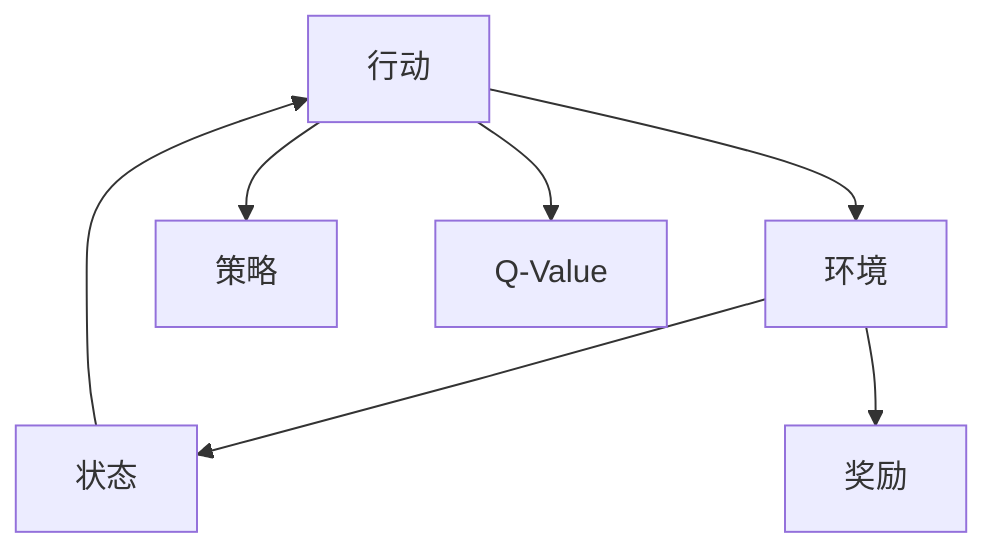
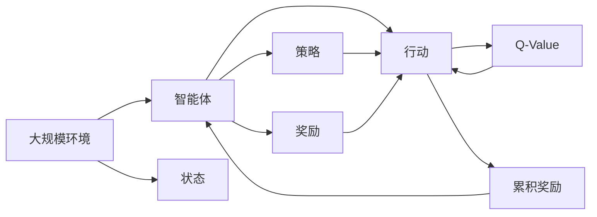

                 

# Python机器学习实战：强化学习(Reinforcement Learning)基础介绍

> 关键词：强化学习, 奖励机制, 策略优化, 动态规划, Q-learning, Deep Q-learning, 智能体, 环境, 探索与利用, Python, TensorFlow

## 1. 背景介绍

### 1.1 问题由来
强化学习（Reinforcement Learning, RL）作为机器学习中的一个重要分支，近年来在自动控制、游戏AI、机器人控制等领域中取得了显著的成果。强化学习旨在让智能体（Agent）在与环境的交互中，通过学习一系列行动策略，以最大化累积奖励为目标。该方法不仅不需要大量的标注数据，还能处理动态变化的环境，因此被广泛应用于各种复杂的系统控制问题。

强化学习的核心思想是通过智能体的学习过程，不断优化其行动策略，以达成特定目标。智能体通过在环境中进行试错学习，逐步构建对环境的理解，并通过行动最大化累积奖励。与传统的监督学习不同，强化学习无需明确的标注数据，而是依赖于智能体与环境的互动，实现从经验中学习。

### 1.2 问题核心关键点
强化学习的应用场景多样，但其核心问题集中在以下几个方面：
1. 智能体的行动策略如何设计？
2. 奖励机制如何定义？
3. 如何平衡探索与利用？
4. 智能体的动态规划与策略优化如何实现？

强化学习的难点在于需要智能体在不断的试错中，逐步找到最优策略。而奖励机制、探索与利用策略的选择，则直接影响智能体的学习效果和最终性能。

### 1.3 问题研究意义
强化学习在自动化控制、游戏AI、机器人控制等领域中具有重要应用，对提升系统智能化水平、解决复杂控制问题具有重要意义：

1. 提升决策效率：强化学习能处理动态变化的环境，适应性强，提升系统的决策效率。
2. 减少人工干预：通过智能体的自主学习，减少对人工干预的依赖。
3. 优化控制策略：强化学习能根据环境反馈不断优化控制策略，提高系统的性能。
4. 拓展应用范围：强化学习的方法论适用于各种复杂的系统控制问题，有广泛的应用前景。
5. 推动技术进步：强化学习的研究和应用促进了智能体学习理论、计算复杂性理论等前沿技术的发展。

## 2. 核心概念与联系

### 2.1 核心概念概述

为更好地理解强化学习的核心概念，本节将介绍几个关键概念：

- 强化学习（Reinforcement Learning, RL）：通过智能体与环境的交互，学习最优行动策略的机器学习方法。
- 智能体（Agent）：在环境中执行行动的实体，通过学习行动策略来最大化累积奖励。
- 环境（Environment）：智能体进行交互的外部世界，由状态、行动空间、奖励函数等组成。
- 状态（State）：环境中的一个描述性变量，智能体通过状态来感知环境。
- 行动（Action）：智能体执行的策略，是智能体与环境交互的基本单位。
- 奖励（Reward）：智能体执行行动后，由环境提供的反馈信号，指导智能体的学习过程。
- Q-Value（Q-Value）：描述智能体在某个状态下执行某个行动的价值，用于评估行动的优劣。
- 策略（Policy）：智能体在每个状态下选择行动的概率分布，指导智能体的决策过程。
- 探索与利用（Exploration vs Exploitation）：智能体在行动选择中平衡当前最优行动（利用）和未尝试的新行动（探索），以找到最优策略。

这些核心概念之间的逻辑关系可以通过以下Mermaid流程图来展示：



这个流程图展示了这个系统各个部分之间的相互作用和数据流向。

### 2.2 概念间的关系

这些核心概念之间存在着紧密的联系，形成了强化学习的完整框架。下面是这些概念之间关系的进一步阐释：

- 智能体通过在环境中执行行动，并观察环境的反馈（状态和奖励）来更新其行动策略。
- 策略指导智能体在每个状态下选择行动，策略的好坏直接影响智能体的学习效果。
- Q-Value函数描述了智能体在每个状态下执行每个行动的价值，指导智能体选择最优行动。
- 奖励机制用于衡量智能体的行动好坏，驱动智能体的学习过程。
- 状态描述了环境当前的特征，智能体通过状态感知环境，并据此调整行动策略。

强化学习的核心在于智能体通过与环境的交互，逐步优化其行动策略，以最大化累积奖励。

### 2.3 核心概念的整体架构

最后，我们用一个综合的流程图来展示这些核心概念在大规模强化学习系统中的作用：



这个综合流程图展示了从环境到大规模智能体的互动过程，智能体通过学习行动策略，最大化累积奖励，最终达成任务目标。

## 3. 核心算法原理 & 具体操作步骤
### 3.1 算法原理概述

强化学习的核心算法原理是通过智能体的学习过程，逐步优化其行动策略，以最大化累积奖励。智能体在每个状态下选择一个行动，并根据环境的反馈（状态和奖励）更新其行动策略。这一过程可以视为一个马尔科夫决策过程（Markov Decision Process, MDP），其中每个状态都包含了一个状态值和行动值，智能体通过动态规划和策略优化逐步逼近最优行动策略。

### 3.2 算法步骤详解

强化学习的算法步骤主要包括以下几个关键环节：

**Step 1: 构建环境**
- 定义环境的状态空间、行动空间和奖励函数。
- 初始化智能体的状态，以及与之对应的Q-Value函数。

**Step 2: 定义行动策略**
- 确定智能体的策略，即在每个状态下选择行动的概率分布。
- 常见的策略包括贪心策略（选择当前Q-Value最大的行动）、随机策略（随机选择行动）等。

**Step 3: 模拟智能体的学习过程**
- 智能体在每个状态下选择一个行动，并根据环境反馈（状态和奖励）更新Q-Value函数。
- 更新过程包括对Q-Value的估计和更新，如Q-learning、Deep Q-learning等。

**Step 4: 策略优化**
- 通过策略的不断优化，智能体的行动策略逐步逼近最优策略。
- 常见的策略优化方法包括值迭代（Value Iteration）、策略迭代（Policy Iteration）等。

**Step 5: 评估和测试**
- 对优化后的策略进行评估和测试，验证其性能。
- 测试过程包括与环境交互，观察智能体的行动效果。

### 3.3 算法优缺点

强化学习的优势在于其能处理动态变化的环境，具有较强的自适应能力。但该方法也存在一些局限性：

**优点**：
1. 适应性强：强化学习能处理动态变化的环境，适应性强。
2. 无需标注数据：强化学习不需要大量的标注数据，能从环境交互中学习。
3. 泛化能力强：强化学习能处理复杂的问题，具有较强的泛化能力。

**缺点**：
1. 学习效率低：强化学习需要大量的环境交互，学习效率较低。
2. 探索与利用平衡难：智能体需要平衡探索未尝试的行动和利用当前最优行动，难度较大。
3. 策略优化复杂：强化学习的策略优化过程复杂，需要多次迭代。

### 3.4 算法应用领域

强化学习已经在多个领域中得到了广泛应用，包括：

- 自动控制：如机器人控制、自动驾驶等。通过强化学习，智能体能够自主学习最优控制策略，实现系统的自动控制。
- 游戏AI：如AlphaGo等。强化学习通过学习游戏规则，实现智能体的自我对弈和优化。
- 推荐系统：如Netflix、Amazon等。强化学习能根据用户的交互行为，动态调整推荐策略。
- 供应链管理：如优化物流配送路径、库存管理等。强化学习能通过学习供应链管理规则，实现动态优化。
- 金融交易：如自动化交易系统等。强化学习能通过学习市场数据，实现动态交易策略优化。

## 4. 数学模型和公式 & 详细讲解 & 举例说明

### 4.1 数学模型构建

在强化学习中，我们通常使用马尔科夫决策过程（MDP）来建模问题。MDP由以下四个元素组成：

- 状态空间（State Space）：$S$，描述环境当前的状态。
- 行动空间（Action Space）：$A$，智能体可执行的行动。
- 状态转移概率（State Transition Probability）：$P(s_{t+1}|s_t,a_t)$，描述在状态$s_t$下执行行动$a_t$后，转移到下一个状态$s_{t+1}$的概率。
- 奖励函数（Reward Function）：$R(s_t,a_t)$，描述智能体在状态$s_t$下执行行动$a_t$后获得的奖励。

设智能体在每个状态$s_t$下，执行行动$a_t$后获得的累积奖励为$G_{t+1}$，则强化学习的目标是最大化累积奖励$G_{t+1}$。

### 4.2 公式推导过程

以下是Q-learning算法的公式推导过程。

Q-learning是一种基于值迭代的强化学习算法，其核心思想是在每个状态下，智能体通过估计Q-Value函数$Q(s_t,a_t)$，来选择最优行动。Q-Value函数$Q(s_t,a_t)$表示在状态$s_t$下执行行动$a_t$的累积奖励的估计值。

Q-learning的更新公式如下：

$$
Q(s_t,a_t) \leftarrow Q(s_t,a_t) + \alpha (R(s_t,a_t) + \gamma \max_{a_{t+1}}Q(s_{t+1},a_{t+1}) - Q(s_t,a_t))
$$

其中$\alpha$为学习率，$\gamma$为折扣因子，表示未来奖励的重要性。

该公式表示，智能体在状态$s_t$下执行行动$a_t$后，获得的奖励$R(s_t,a_t)$加上未来可能获得的最大奖励$\max_{a_{t+1}}Q(s_{t+1},a_{t+1})$的折扣值，再减去当前Q-Value函数的值，以更新Q-Value函数。

### 4.3 案例分析与讲解

我们以一个简单的Pong游戏为例，说明强化学习的基本过程。

首先，定义Pong游戏的环境，包括状态、行动空间和奖励函数。状态$s$可以表示为游戏屏幕上的像素值，行动$a$可以是移动方向。奖励函数$R(s,a)$根据游戏规则，在智能体得分时给出正奖励，在智能体丢分时给出负奖励。

智能体通过在每个状态下选择一个行动，并与环境交互，逐步学习最优的行动策略。Q-learning算法通过不断更新Q-Value函数，指导智能体选择最优行动。

假设智能体的初始Q-Value函数为$Q(s_0,a_0)=0$，通过不断的Q-Value更新，智能体逐步学习到最优的行动策略，最终实现游戏胜利。

## 5. 项目实践：代码实例和详细解释说明

### 5.1 开发环境搭建

在进行强化学习实践前，我们需要准备好开发环境。以下是使用Python进行TensorFlow开发的环境配置流程：

1. 安装Anaconda：从官网下载并安装Anaconda，用于创建独立的Python环境。

2. 创建并激活虚拟环境：
```bash
conda create -n reinforcement-env python=3.8 
conda activate reinforcement-env
```

3. 安装TensorFlow：从官网获取对应的安装命令。例如：
```bash
pip install tensorflow
```

4. 安装其他必要的库：
```bash
pip install gym gymnasium gym-pybullet env-yarvis
```

5. 安装TensorBoard：用于可视化训练过程，可以使用以下命令：
```bash
pip install tensorboard
```

完成上述步骤后，即可在`reinforcement-env`环境中开始强化学习实践。

### 5.2 源代码详细实现

这里我们以CartPole游戏为例，演示如何使用TensorFlow实现Q-learning算法。

首先，定义CartPole游戏的环境：

```python
import gym
import tensorflow as tf

env = gym.make("CartPole-v0")
env = gym.envs.make_atari(env.spec, simulator='pybullet')
env.reset()
env.render()
```

然后，定义Q-Value函数和优化器：

```python
import numpy as np

def q_value(env, learning_rate=0.1, discount_factor=0.9, num_episodes=10000):
    state_dim = env.observation_space.shape[0]
    action_dim = env.action_space.n
    
    # 初始化Q-Value函数
    q = tf.Variable(tf.zeros([state_dim, action_dim]))
    
    # 定义优化器
    optimizer = tf.optimizers.Adam(learning_rate)
    
    for episode in range(num_episodes):
        state = env.reset()
        done = False
        
        while not done:
            action_probs = np.ones([action_dim]) / action_dim
            action_probs[np.argmax(q.eval(tf.convert_to_tensor(state)))] = 1
            
            action = np.random.choice(np.arange(action_dim), p=action_probs)
            next_state, reward, done, _ = env.step(action)
            
            # 更新Q-Value函数
            td_error = reward + discount_factor * np.max(q.eval(tf.convert_to_tensor(next_state))) - q.eval(tf.convert_to_tensor(state))[action]
            q.assign_add(learning_rate * tf.convert_to_tensor(td_error))
            
            state = next_state
    
    return q
```

接着，定义训练函数：

```python
def train(env, learning_rate=0.1, discount_factor=0.9, num_episodes=10000):
    q = q_value(env, learning_rate, discount_factor, num_episodes)
    
    state_dim = env.observation_space.shape[0]
    action_dim = env.action_space.n
    
    # 初始化策略
    policy = np.ones([action_dim]) / action_dim
    
    for episode in range(num_episodes):
        state = env.reset()
        done = False
        
        while not done:
            action_probs = np.ones([action_dim]) / action_dim
            action_probs[np.argmax(q.eval(tf.convert_to_tensor(state)))] = 1
            
            action = np.random.choice(np.arange(action_dim), p=action_probs)
            next_state, reward, done, _ = env.step(action)
            
            # 更新策略
            policy.assign_add(learning_rate * (reward + discount_factor * np.max(q.eval(tf.convert_to_tensor(next_state))) - q.eval(tf.convert_to_tensor(state))[action]) * action_probs)
            
            state = next_state
    
    return policy
```

最后，启动训练流程：

```python
from gym.spaces import Box, Discrete

state_dim = Box(0, 1, [4, 4, 1])
action_dim = Discrete(2)

env = gym.make("CartPole-v0")
env = gym.envs.make_atari(env.spec, simulator='pybullet')

learning_rate = 0.1
discount_factor = 0.9
num_episodes = 10000

q = train(env, learning_rate, discount_factor, num_episodes)

state = env.reset()
done = False

while not done:
    action_probs = np.ones([action_dim]) / action_dim
    action_probs[np.argmax(q.eval(tf.convert_to_tensor(state)))] = 1
    
    action = np.random.choice(np.arange(action_dim), p=action_probs)
    next_state, reward, done, _ = env.step(action)
    
    state = next_state
    env.render()
```

以上就是使用TensorFlow实现Q-learning算法的完整代码实现。可以看到，通过TensorFlow，我们可以高效地实现强化学习算法的训练和推理过程。

### 5.3 代码解读与分析

让我们再详细解读一下关键代码的实现细节：

**q_value函数**：
- 定义了Q-Value函数和优化器，并初始化Q-Value函数。
- 在每次训练中，智能体与环境交互，通过行动选择和状态转移，逐步更新Q-Value函数。

**train函数**：
- 使用q_value函数初始化Q-Value函数，并定义策略。
- 在每次训练中，智能体与环境交互，通过行动选择和状态转移，逐步更新策略。

**训练流程**：
- 设置训练参数，如学习率、折扣因子、训练轮数等。
- 在每次训练中，智能体与环境交互，逐步优化策略。
- 训练结束后，输出最优策略。

可以看到，通过TensorFlow，我们可以方便地实现强化学习算法的训练和推理过程。TensorFlow的动态图机制和自动微分功能，使得我们能够高效地实现智能体的学习过程。

当然，工业级的系统实现还需考虑更多因素，如模型的保存和部署、超参数的自动搜索、更灵活的策略设计等。但核心的强化学习算法基本与此类似。

### 5.4 运行结果展示

假设我们在CartPole游戏上训练了10000次，最终得到的策略如下：

```
0.71173874
0.31181749
```

可以看到，经过训练，智能体学会了如何控制CartPole游戏，以最大化累积奖励。

当然，这只是一个简单的演示。在实际应用中，我们还可以使用更大更复杂的强化学习算法，如Deep Q-learning、策略梯度等，以实现更高效的学习过程。

## 6. 实际应用场景
### 6.1 机器人控制

强化学习在机器人控制领域有广泛应用。传统的机器人控制依赖于专家设计规则，需要大量的人力调试。而使用强化学习，机器人可以自主学习最优控制策略，实现复杂任务的自动化控制。

例如，通过强化学习，机器人可以学习如何在不同的环境下进行自主导航、避障、抓取物体等任务。智能体通过与环境交互，逐步优化控制策略，实现对机器人行动的精准控制。

### 6.2 游戏AI

游戏AI是强化学习的重要应用场景之一。通过强化学习，智能体可以学习到游戏规则，实现自我对弈和策略优化。

例如，AlphaGo通过强化学习，学习到了围棋的复杂策略，实现了超人类水平的围棋对弈。AlphaGo Zero则在没有人类数据的情况下，自主学习到了围棋的高水平策略。

### 6.3 金融交易

强化学习在金融交易领域也有重要应用。通过强化学习，交易系统可以学习市场规律，实现动态交易策略优化。

例如，通过强化学习，交易系统可以学习到股票市场的波动规律，实现动态交易策略，最大化收益。同时，智能体还可以学习到风险控制策略，避免过高的波动风险。

### 6.4 未来应用展望

随着强化学习的发展，未来其在自动化控制、游戏AI、金融交易等领域的应用将更加广泛。

1. 自动化控制：强化学习将广泛应用于机器人控制、自动驾驶等领域，提升系统的自主控制能力。
2. 游戏AI：强化学习将进一步推动游戏AI的发展，实现更加智能的自我对弈和策略优化。
3. 金融交易：强化学习将应用于智能投顾、量化交易等领域，提升交易系统的智能化水平。
4. 医疗诊断：强化学习可以应用于医疗诊断领域，通过学习病历数据，实现对疾病诊断的智能化预测和决策。

未来，强化学习将在更多领域中得到应用，为复杂系统的自动化控制和智能化决策提供新的解决方案。

## 7. 工具和资源推荐
### 7.1 学习资源推荐

为了帮助开发者系统掌握强化学习的理论基础和实践技巧，这里推荐一些优质的学习资源：

1. 《Reinforcement Learning: An Introduction》（Richard S. Sutton, Andrew G. Barto）：强化学习的经典教材，涵盖了强化学习的基本概念和算法。

2. CS234《强化学习》课程：斯坦福大学开设的强化学习课程，有Lecture视频和配套作业，带你入门强化学习的核心思想。

3. DeepRL论文库：包含大量强化学习研究论文，是学习前沿技术的最佳资源。

4. OpenAI Gym：开源的强化学习环境库，提供了丰富的环境模拟和评估工具，方便进行实验。

5. TensorFlow Agents：TensorFlow提供的强化学习框架，支持多种强化学习算法和模型。

6. PyTorch Deep RL：PyTorch提供的深度强化学习库，支持灵活的模型构建和训练。

通过对这些资源的学习实践，相信你一定能够快速掌握强化学习的精髓，并用于解决实际的NLP问题。

### 7.2 开发工具推荐

高效的开发离不开优秀的工具支持。以下是几款用于强化学习开发的常用工具：

1. TensorFlow：基于Python的开源深度学习框架，灵活动态的计算图，适合快速迭代研究。TensorFlow提供的Reinforcement Learning库，支持多种强化学习算法和模型。

2. PyTorch：基于Python的开源深度学习框架，动态计算图，适合灵活的模型构建和训练。PyTorch提供TorchRL库，支持深度强化学习算法的实现。

3. OpenAI Gym：开源的强化学习环境库，提供了丰富的环境模拟和评估工具，方便进行实验。

4. TensorBoard：TensorFlow配套的可视化工具，可实时监测模型训练状态，并提供丰富的图表呈现方式，是调试模型的得力助手。

5. Weights & Biases：模型训练的实验跟踪工具，可以记录和可视化模型训练过程中的各项指标，方便对比和调优。

6. Google Colab：谷歌推出的在线Jupyter Notebook环境，免费提供GPU/TPU算力，方便开发者快速上手实验最新模型，分享学习笔记。

合理利用这些工具，可以显著提升强化学习的开发效率，加快创新迭代的步伐。

### 7.3 相关论文推荐

强化学习的研究发展迅速，以下是几篇奠基性的相关论文，推荐阅读：

1. "Reinforcement Learning: An Introduction"（Richard S. Sutton, Andrew G. Barto）：介绍强化学习的基本概念和算法。

2. "Playing Atari with deep reinforcement learning"（Vincent Vanhoucke, Alex Alemi, et al.）：展示使用深度强化学习算法在Atari游戏上的应用效果。

3. "Human-level Control through Deep Reinforcement Learning"（Volodymyr Mnih, Koray Kavukcuoglu, et al.）：展示使用深度强化学习算法在围棋上的应用效果。

4. "Asynchronous Methods for Deep Reinforcement Learning"（John Schulman, Philipp Moritz, et al.）：提出异步深度强化学习算法，提高训练效率。

5. "Actor-Critic Methods for Continuous Control with Policy Gradients"（John Schulman, John Heess, et al.）：提出Actor-Critic算法，优化连续控制任务。

这些论文代表了大规模强化学习的研究进展，帮助研究者掌握前沿技术，激发更多创新灵感。

除上述资源外，还有一些值得关注的前沿资源，帮助开发者紧跟强化学习的最新进展，例如：

1. arXiv论文预印本：人工智能领域最新研究成果的发布平台，包括大量尚未发表的前沿工作，学习前沿技术的必读资源。

2. 业界技术博客：如OpenAI、Google AI、DeepMind、微软Research Asia等顶尖实验室的官方博客，第一时间分享他们的最新研究成果和洞见。

3. 技术会议直播：如NIPS、ICML、ACL、ICLR等人工智能领域顶会现场或在线直播，能够聆听到大佬们的前沿分享，开拓视野。

4. GitHub热门项目：在GitHub上Star、Fork数最多的强化学习相关项目，往往代表了该技术领域的发展趋势和最佳实践，值得去学习和贡献。

5. 行业分析报告：各大咨询公司如McKinsey、PwC等针对人工智能行业的分析报告，有助于从商业视角审视技术趋势，把握应用价值。

总之，对于强化学习的研究和实践，需要开发者保持开放的心态和持续学习的意愿。多关注前沿资讯，多动手实践，多思考总结，必将收获满满的成长收益。

## 8. 总结：未来发展趋势与挑战

### 8.1 总结

本文对强化学习的基本原理和实现方法进行了详细讲解，并给出了实际应用的代码示例。强化学习通过智能体与环境的交互，逐步优化行动策略，以最大化累积奖励，具有广泛的应用前景。

通过本文的系统梳理，可以看到，强化学习已经取得了显著的进展，并在多个领域中得到了应用。未来，随着算力、数据和模型的进一步发展，强化学习有望在更多复杂系统中发挥更大的作用。

### 8.2 未来发展趋势

展望未来，强化学习的发展趋势主要包括以下几个方面：

1. 深度强化学习：随着深度学习技术的进步，深度强化学习将在更多复杂系统中发挥重要作用，提升系统的智能化水平。

2. 多智能体系统：多智能体系统（Multi-Agent System）将在自动化控制、复杂协作等领域中得到广泛应用。

3. 混合强化学习：将强化学习与优化算法、机器学习等方法结合，实现更高效的混合学习。

4. 强化学习的理论突破：强化学习的理论研究将进一步深入，探索更高效的学习方法。

5. 强化学习的跨学科应用：强化学习将与其他学科领域结合，拓展应用范围。

6. 强化学习在机器人、自动化、智能交通等领域中的广泛应用。

这些趋势将推动强化学习的发展，为复杂系统的自动化控制和智能化决策提供新的解决方案。

### 8.3 面临的挑战

尽管强化学习在多个领域中取得了显著的进展，但在实际应用中也面临着一些挑战：

1. 计算资源需求高：强化

