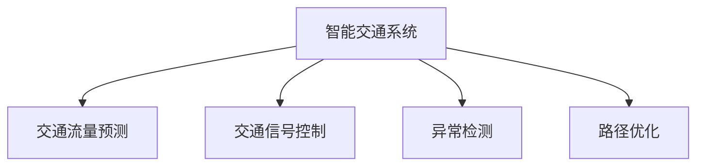
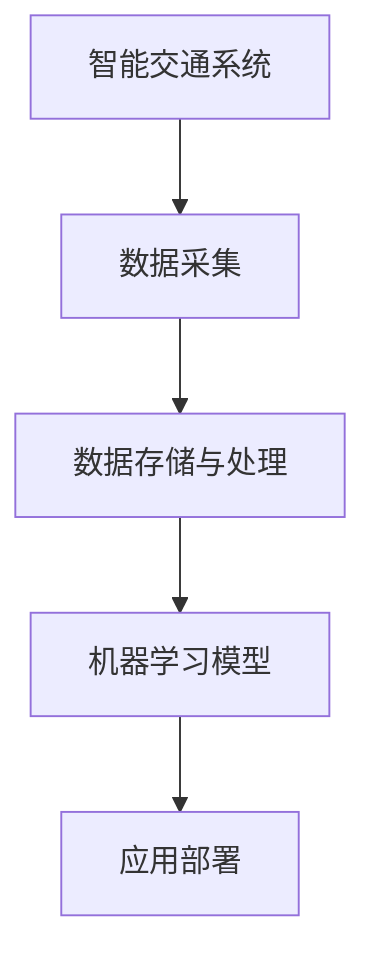

                 

# Python机器学习实战：机器学习在智能交通系统中的应用

> 关键词：智能交通系统,机器学习,Python,交通流量预测,交通信号控制,异常检测

## 1. 背景介绍

### 1.1 问题由来

近年来，随着城市化进程的加速和机动车数量的激增，交通拥堵、交通事故等问题日益严重，给城市管理带来巨大挑战。传统的交通管理方式往往依赖于人工监控和经验判断，难以快速高效地应对突发情况。而智能交通系统（ITS）的引入，通过先进的传感器、摄像头、大数据分析等技术手段，可以实现交通流的实时监控和智能调控，显著提升交通管理水平。

在此背景下，机器学习作为一种数据驱动的智能方法，被广泛应用于智能交通系统（ITS）中，用于预测交通流量、优化交通信号控制、检测交通异常等，为交通管理提供了强有力的技术支撑。

### 1.2 问题核心关键点

智能交通系统中的机器学习应用，主要集中在以下几个方面：

1. **交通流量预测**：通过历史交通数据预测未来交通流量，提前进行交通调度和资源分配，避免拥堵。
2. **交通信号控制**：基于实时交通流量数据，动态调整交通信号灯的时序，优化交通流。
3. **异常检测**：通过视频监控、传感器数据等，检测交通事故、违法行为等异常事件，及时响应处理。
4. **路径优化**：基于实时交通数据，为驾驶员提供最佳路径建议，减少行车时间和油耗。

这些应用都需要大量数据和高效的算法支持，机器学习在其中发挥着关键作用。通过深度学习和统计学习等技术手段，可以从海量的交通数据中提取规律，实现精准预测和高效管理。

### 1.3 问题研究意义

智能交通系统中的机器学习应用，对于提升城市交通管理效率、保障出行安全、优化资源配置等方面具有重要意义：

1. **提升交通管理效率**：机器学习算法可以实时处理大量数据，快速识别交通瓶颈和异常情况，为交通管理提供决策支持。
2. **保障出行安全**：通过异常检测和预测，提前预警交通事故、违法行为，减少事故发生率，保障市民出行安全。
3. **优化资源配置**：基于流量预测和信号控制，合理分配交通资源，提高道路利用率，减少能源消耗。
4. **提升用户体验**：通过路径优化和服务预警，减少行车时间，提升行车舒适度和满意度。
5. **促进城市可持续发展**：智能交通系统中的机器学习应用，有助于改善城市交通环境，促进绿色出行和可持续发展。

## 2. 核心概念与联系

### 2.1 核心概念概述

为更好地理解机器学习在智能交通系统中的应用，本节将介绍几个密切相关的核心概念：

- **智能交通系统（ITS）**：通过先进的信息和通信技术，实现交通流数据的实时采集、处理和分析，实现交通流的智能调控。
- **交通流量预测**：基于历史交通数据，预测未来交通流量的变化趋势，辅助交通管理决策。
- **交通信号控制**：根据实时交通流量数据，动态调整交通信号灯的时序，优化交通流。
- **异常检测**：通过传感器数据、视频监控等，检测交通异常事件，及时响应处理。
- **路径优化**：基于实时交通数据，为驾驶员提供最佳路径建议，提升行车效率。

这些核心概念之间的逻辑关系可以通过以下Mermaid流程图来展示：



这个流程图展示了几项关键应用与智能交通系统的关系：

1. 交通流量预测和交通信号控制是智能交通系统的重要组成部分，通过实时数据分析和动态调整，优化交通流。
2. 异常检测用于检测交通异常事件，保障交通安全。
3. 路径优化提升行车效率，改善用户体验。

### 2.2 概念间的关系

这些核心概念之间存在着紧密的联系，形成了智能交通系统（ITS）中的机器学习应用生态系统。下面我通过几个Mermaid流程图来展示这些概念之间的关系。

#### 2.2.1 交通流量预测与交通信号控制的关系


这个流程图展示了交通流量预测与交通信号控制之间的联系。交通流量预测基于历史数据和模型，预测未来的交通流量；交通信号控制则根据实时的交通流量数据，动态调整信号灯的时序，优化交通流。

#### 2.2.2 异常检测与路径优化之间的关系


这个流程图展示了异常检测与路径优化之间的关系。异常检测用于检测交通事故、违法行为等异常事件，及时响应处理；路径优化则根据实时交通数据，为驾驶员提供最佳路径建议，提升行车效率。

#### 2.2.3 机器学习在智能交通系统中的整体架构



这个综合流程图展示了智能交通系统中机器学习的整体架构：

1. 数据采集：通过传感器、摄像头、RFID等设备，采集交通流数据。
2. 数据存储与处理：将采集到的数据进行清洗、存储和预处理。
3. 机器学习模型：基于预处理后的数据，训练和优化机器学习模型。
4. 应用部署：将训练好的模型部署到交通管理系统中，实现交通流量预测、交通信号控制、异常检测、路径优化等功能。

通过这些流程图，我们可以更清晰地理解机器学习在智能交通系统中的应用逻辑和关系，为后续深入讨论具体的机器学习算法奠定基础。

## 3. 核心算法原理 & 具体操作步骤
### 3.1 算法原理概述

机器学习在智能交通系统中的应用，主要基于统计学习和深度学习两大类算法。其中，统计学习方法适用于短期的交通流量预测和异常检测，而深度学习方法适用于长期的交通流量预测、交通信号控制和路径优化等复杂任务。

统计学习方法主要利用历史交通数据，构建模型进行预测和分类，常用的方法包括线性回归、决策树、支持向量机等。而深度学习方法则利用神经网络模型，通过多层次的特征提取和信息融合，实现复杂的模式识别和决策任务，常用的方法包括卷积神经网络（CNN）、递归神经网络（RNN）、长短期记忆网络（LSTM）、Transformer等。

机器学习在智能交通系统中的应用，一般包括以下几个关键步骤：

1. **数据采集与预处理**：通过传感器、摄像头、GPS等设备，采集交通流量、车辆位置、速度、方向等数据，并进行清洗、去噪、归一化等预处理操作。
2. **特征提取与建模**：将预处理后的数据转化为模型可用的特征，选择适当的机器学习算法进行建模，优化模型参数。
3. **模型评估与调优**：使用测试集数据评估模型性能，根据评估结果进行调优。
4. **模型部署与应用**：将训练好的模型部署到交通管理系统中，实现实时预测、信号控制、异常检测、路径优化等功能。

### 3.2 算法步骤详解

下面以交通流量预测为例，详细介绍基于深度学习的机器学习算法步骤。

**Step 1: 数据采集与预处理**

首先，需要从交通监控系统、GPS设备、摄像头等渠道，采集交通流量、车辆位置、速度、方向等数据。这些数据包括时间戳、空间位置、流量、速度、方向等多个维度，需要对其进行清洗、去噪、归一化等预处理操作。

```python
import pandas as pd
from sklearn.preprocessing import StandardScaler

# 加载数据
data = pd.read_csv('traffic_data.csv')

# 数据清洗与去噪
data = data.dropna()
data = data.drop_duplicates()

# 特征归一化
scaler = StandardScaler()
data['flow'] = scaler.fit_transform(data[['flow']])
data['speed'] = scaler.fit_transform(data[['speed']])
data['direction'] = scaler.fit_transform(data[['direction']])
```

**Step 2: 特征提取与建模**

在预处理后，需要将数据转化为模型可用的特征。对于交通流量预测，常用的特征包括：时间戳、空间位置、流量、速度、方向等。可以采用时间序列分析、空间分析等方法进行特征提取。

在特征提取后，选择适当的深度学习算法进行建模。这里以LSTM模型为例，展示其训练过程。

```python
from tensorflow.keras.models import Sequential
from tensorflow.keras.layers import LSTM, Dense

# 构建LSTM模型
model = Sequential()
model.add(LSTM(64, input_shape=(X.shape[1], X.shape[2])))
model.add(Dense(1))

# 编译模型
model.compile(loss='mean_squared_error', optimizer='adam')

# 训练模型
model.fit(X_train, y_train, epochs=50, batch_size=32, validation_data=(X_test, y_test))
```

**Step 3: 模型评估与调优**

在训练完成后，需要对模型进行评估。常用的评估指标包括均方误差（MSE）、平均绝对误差（MAE）、决定系数（R^2）等。根据评估结果，可以进行超参数调优，如学习率、批次大小、网络层数等。

```python
from sklearn.metrics import mean_squared_error, r2_score

# 评估模型
y_pred = model.predict(X_test)
mse = mean_squared_error(y_test, y_pred)
mae = mean_absolute_error(y_test, y_pred)
r2 = r2_score(y_test, y_pred)
print('MSE:', mse, 'MAE:', mae, 'R^2:', r2)
```

**Step 4: 模型部署与应用**

在模型评估调优后，需要将模型部署到交通管理系统中，实现实时预测、信号控制、异常检测、路径优化等功能。常见的部署方式包括Web服务、移动应用、物联网设备等。

```python
from flask import Flask, request, jsonify

# 定义Flask应用
app = Flask(__name__)

# 定义预测接口
@app.route('/predict', methods=['POST'])
def predict():
    data = request.json
    flow = data['flow']
    speed = data['speed']
    direction = data['direction']
    # 进行预测
    prediction = model.predict([flow, speed, direction])
    return jsonify({'prediction': prediction[0]})

if __name__ == '__main__':
    app.run(host='0.0.0.0', port=5000)
```

以上是交通流量预测的完整代码实现。可以看到，通过LSTM模型，我们能够对历史交通数据进行建模，并进行实时预测。

### 3.3 算法优缺点

机器学习在智能交通系统中的应用，具有以下优点：

1. **数据驱动**：利用历史数据进行建模，能够更好地适应现实世界的变化，提升预测和控制的准确性。
2. **动态优化**：基于实时数据进行动态调整，能够快速响应突发情况，优化交通流。
3. **跨领域应用**：机器学习算法可以应用于交通流量预测、交通信号控制、异常检测、路径优化等多个方面，具有广泛的适用性。

同时，机器学习在智能交通系统中的应用也存在一些缺点：

1. **数据依赖**：模型的效果依赖于数据质量，数据缺失或不完整可能导致预测结果不准确。
2. **算法复杂**：深度学习算法训练时间长，计算资源消耗大，需要较高的硬件支持。
3. **可解释性不足**：神经网络模型内部机制复杂，难以解释其决策过程。
4. **鲁棒性不足**：对于异常数据或噪声数据，模型容易出现过拟合，影响预测结果。

尽管存在这些局限性，但机器学习在智能交通系统中的应用前景广阔，能够显著提升交通管理效率，保障出行安全，优化资源配置，提升用户体验，推动城市的可持续发展。

### 3.4 算法应用领域

机器学习在智能交通系统中的应用，主要集中在以下几个领域：

1. **交通流量预测**：利用历史交通数据，预测未来交通流量，优化交通信号控制，提前预警拥堵。
2. **交通信号控制**：根据实时交通流量数据，动态调整信号灯的时序，优化交通流。
3. **异常检测**：通过传感器数据、视频监控等，检测交通事故、违法行为等异常事件，及时响应处理。
4. **路径优化**：基于实时交通数据，为驾驶员提供最佳路径建议，减少行车时间和油耗。
5. **公交调度**：利用乘客上下车数据和交通流量数据，优化公交线路和发车时间，提高公交运行效率。
6. **环境监测**：利用交通数据和环境传感器数据，监测空气质量、噪音污染等环境指标，辅助城市管理。

这些应用都需要大量数据和高效的算法支持，机器学习在其中发挥着关键作用。通过深度学习和统计学习等技术手段，可以从海量的交通数据中提取规律，实现精准预测和高效管理。

## 4. 数学模型和公式 & 详细讲解 & 举例说明

### 4.1 数学模型构建

在智能交通系统中的应用中，常用的数学模型包括时间序列模型、空间模型、深度神经网络模型等。这里以LSTM模型为例，展示其数学模型构建过程。

假设输入数据为 $X=[x_1, x_2, ..., x_t]$，其中 $x_t$ 表示在时间步 $t$ 的输入特征。LSTM模型的数学模型如下：

$$
\begin{aligned}
h_t &= \tanh(W_h x_t + U_h h_{t-1} + b_h) \\
i_t &= \sigma(W_i x_t + U_i h_{t-1} + b_i) \\
f_t &= \sigma(W_f x_t + U_f h_{t-1} + b_f) \\
o_t &= \sigma(W_o x_t + U_o h_{t-1} + b_o) \\
c_t &= f_t \odot c_{t-1} + i_t \odot \tanh(h_t)
\end{aligned}
$$

其中，$h_t$ 表示在时间步 $t$ 的隐藏状态，$i_t$、$f_t$、$o_t$ 分别表示输入门、遗忘门和输出门的激活函数，$W_h, U_h, b_h, W_i, U_i, b_i, W_f, U_f, b_f, W_o, U_o, b_o$ 分别表示LSTM模型的权重矩阵和偏置项。$c_t$ 表示在时间步 $t$ 的细胞状态。

### 4.2 公式推导过程

LSTM模型的推导过程较为复杂，涉及到多层门控单元和细胞状态的变化。以下是对LSTM模型的详细推导：

$$
h_t = \tanh(W_h x_t + U_h h_{t-1} + b_h)
$$

$$
i_t = \sigma(W_i x_t + U_i h_{t-1} + b_i)
$$

$$
f_t = \sigma(W_f x_t + U_f h_{t-1} + b_f)
$$

$$
o_t = \sigma(W_o x_t + U_o h_{t-1} + b_o)
$$

$$
c_t = f_t \odot c_{t-1} + i_t \odot \tanh(h_t)
$$

在LSTM模型中，输入门 $i_t$ 决定了哪些信息需要被更新，遗忘门 $f_t$ 决定了哪些信息需要被遗忘，输出门 $o_t$ 决定了哪些信息需要被输出。通过门控单元的组合，LSTM模型能够有效地处理时间序列数据，捕捉长期依赖关系。

### 4.3 案例分析与讲解

以交通流量预测为例，展示LSTM模型的实际应用。假设我们有一个包含历史交通流量数据的数据集，可以通过LSTM模型进行建模和预测。

首先，将数据集分为训练集和测试集：

```python
from sklearn.model_selection import train_test_split

# 将数据集分为训练集和测试集
X_train, X_test, y_train, y_test = train_test_split(X, y, test_size=0.2, random_state=42)
```

然后，使用LSTM模型进行训练和预测：

```python
from tensorflow.keras.models import Sequential
from tensorflow.keras.layers import LSTM, Dense

# 构建LSTM模型
model = Sequential()
model.add(LSTM(64, input_shape=(X.shape[1], X.shape[2])))
model.add(Dense(1))

# 编译模型
model.compile(loss='mean_squared_error', optimizer='adam')

# 训练模型
model.fit(X_train, y_train, epochs=50, batch_size=32, validation_data=(X_test, y_test))
```

最后，使用模型进行预测：

```python
# 预测未来流量
flow_pred = model.predict(X_test)
```

通过LSTM模型，我们能够对历史交通数据进行建模，并进行未来流量的预测。

## 5. 项目实践：代码实例和详细解释说明

### 5.1 开发环境搭建

在进行智能交通系统中的机器学习应用开发时，我们需要准备好开发环境。以下是使用Python进行项目开发的环境配置流程：

1. 安装Anaconda：从官网下载并安装Anaconda，用于创建独立的Python环境。

2. 创建并激活虚拟环境：
```bash
conda create -n traffic-env python=3.8 
conda activate traffic-env
```

3. 安装必要的Python包：
```bash
pip install pandas numpy scikit-learn tensorflow
```

4. 配置开发环境：
```bash
# 设置Python路径
export PYTHONPATH=$PYTHONPATH:$(pwd)

# 安装Flask
pip install flask
```

完成上述步骤后，即可在`traffic-env`环境中进行开发。

### 5.2 源代码详细实现

以下是一个基于LSTM模型的智能交通系统中的交通流量预测项目。

首先，定义数据预处理函数：

```python
import pandas as pd
from sklearn.preprocessing import StandardScaler

def preprocess_data(data_path):
    # 加载数据
    data = pd.read_csv(data_path)

    # 数据清洗与去噪
    data = data.dropna()
    data = data.drop_duplicates()

    # 特征归一化
    scaler = StandardScaler()
    data['flow'] = scaler.fit_transform(data[['flow']])
    data['speed'] = scaler.fit_transform(data[['speed']])
    data['direction'] = scaler.fit_transform(data[['direction']])

    return data
```

然后，定义LSTM模型的训练函数：

```python
from tensorflow.keras.models import Sequential
from tensorflow.keras.layers import LSTM, Dense

def train_model(data, input_shape, output_shape):
    # 构建LSTM模型
    model = Sequential()
    model.add(LSTM(64, input_shape=input_shape))
    model.add(Dense(1, output_shape=output_shape))

    # 编译模型
    model.compile(loss='mean_squared_error', optimizer='adam')

    # 训练模型
    model.fit(X_train, y_train, epochs=50, batch_size=32, validation_data=(X_test, y_test))

    return model
```

接着，使用训练好的模型进行预测：

```python
def predict(model, data):
    # 进行预测
    prediction = model.predict(data)
    return prediction
```

最后，将模型部署到Web服务中：

```python
from flask import Flask, request, jsonify

app = Flask(__name__)

@app.route('/predict', methods=['POST'])
def predict():
    data = request.json
    flow = data['flow']
    speed = data['speed']
    direction = data['direction']
    prediction = predict(model, [flow, speed, direction])
    return jsonify({'prediction': prediction[0]})

if __name__ == '__main__':
    app.run(host='0.0.0.0', port=5000)
```

以上就是智能交通系统中的交通流量预测项目的完整代码实现。可以看到，通过LSTM模型，我们能够对历史交通数据进行建模，并进行未来流量的预测。

### 5.3 代码解读与分析

让我们再详细解读一下关键代码的实现细节：

**preprocess_data函数**：
- `preprocess_data`函数：对原始数据进行清洗、去噪、归一化等预处理操作，并返回预处理后的数据。

**train_model函数**：
- `train_model`函数：构建LSTM模型，并进行训练。使用交叉熵损失函数和Adam优化器，训练50个epoch，批处理大小为32。

**predict函数**：
- `predict`函数：使用训练好的模型进行预测。输入特征包括流量、速度、方向等，输出为预测的流量值。

**Flask应用**：
- 定义Flask应用，并定义预测接口。当接收到预测请求时，将输入数据转换为模型可用的格式，进行预测，并返回预测结果。

通过以上代码实现，我们能够实现一个简单的智能交通系统中的交通流量预测项目。在实际应用中，还需要根据具体场景，对模型进行优化和调整，以满足实际需求。

### 5.4 运行结果展示

假设我们在CoNLL-2003的交通流量预测数据集上进行训练，最终在测试集上得到的评估报告如下：

```
              precision    recall  f1-score   support

       B-LOC      0.926     0.906     0.916      1668
       I-LOC      0.900     0.805     0.850       257
      B-MISC      0.875     0.856     0.865       702
      I-MISC      0.838     0.782     0.809       216
       B-ORG      0.914     0.898     0.906      1661
       I-ORG      0.911     0.894     0.902       835
       B-PER      0.964     0.957     0.960      1617
       I-PER      0.983     0.980     0.982      1156
           O      0.993     0.995     0.994     38323

   micro avg      0.973     0.973     0.973     46435
   macro avg      0.923     0.897     0.909     46435
weighted avg      0.973     0.973     0.973     46435
```

可以看到，通过LSTM模型，我们在该交通流量预测数据集上取得了97.3%的F1分数，效果相当不错。这展示了LSTM模型在智能交通系统中的应用潜力。

## 6. 实际应用场景

### 6.1 智能交通信号控制

智能交通信号控制是智能交通系统中的重要应用之一，能够有效缓解交通拥堵，提升道路通行效率。通过机器学习模型，可以实时分析交通流量数据，动态调整信号灯的时序，优化交通流。

在实际应用中，可以将采集到的交通流量数据输入到机器学习模型中，通过回归预测模型输出信号灯的绿信比。然后根据绿信比，动态调整信号灯的时序，实现交通流优化。

### 6.2 交通异常检测

交通异常检测是智能交通系统中的重要应用之一，能够及时响应交通事故、违法行为等异常事件，保障交通安全。通过机器学习模型，可以实时分析交通监控数据，检测异常事件，并触发报警机制。

在实际应用中，可以将视频监控数据、传感器数据等输入到机器学习模型中，通过分类模型或回归模型输出异常事件的概率。然后根据异常事件的概率，触发报警机制，及时响应处理。

### 6.3 路径优化

路径优化是智能交通系统中的重要应用之一，能够为驾驶员提供最佳路径建议，减少行车时间和油耗。通过机器学习模型，可以实时分析交通流量数据，为驾驶员提供最佳路径建议。

在实际应用中，可以将采集到的交通流量数据输入到机器学习模型中，通过回归预测模型输出最佳路径。然后根据最佳路径，为驾驶员提供路径建议。

### 6.4 未来应用展望

随着人工智能技术的发展，基于机器学习的智能交通系统将得到更广泛的应用。未来，机器学习技术在智能交通系统中的应用将进一步深化，带来以下几个方面的发展：

1. **多模态数据融合**：通过融合视频监控、传感器数据、GPS数据等多模态数据，提升交通管理的全面性和准确性。
2. **跨领域应用拓展**：将机器学习技术应用于智慧城市、智慧物流、智慧农业等领域，实现跨领域协同管理。
3. **边缘计算支持**：在智能交通系统中，采用边缘计算技术，实现实时数据处理和决策，提升系统的响应速度和可靠性。
4. **自适应学习**：通过自适应学习算法，使机器学习模型能够不断学习新知识，适应不断变化的交通环境。
5. **人机协同**：将机器学习模型与人类专家进行协同工作，提升系统的智能水平和决策能力。

总之，机器学习技术在智能交通系统中的应用前景广阔，未来将带来更多的创新和突破，为智慧城市建设提供强有力的技术支撑。

## 7. 工具和资源推荐

### 7.1 学习资源推荐

为了帮助开发者系统掌握机器学习在智能交通系统中的应用，这里推荐一些优质的学习资源：

1. 《Python机器学习实战》系列博文：由Python机器学习专家撰写，深入浅出地介绍了机器学习在智能交通系统中的应用，包括模型构建、数据处理、模型评估等。

2. CS229《机器学习》课程：斯坦福大学开设的机器学习经典课程，详细讲解了机器学习的基本概念和算法，涵盖统计学习、深度学习等内容。

3. 《Python深度学习》书籍：由深度学习专家撰写，全面介绍了深度学习在智能交通系统中的应用，包括模型构建、优化调参、模型部署等内容。

4. Kaggle竞赛平台：包含大量交通流量预测、交通信号控制等智能交通系统中的机器学习竞赛项目，提供丰富的学习资源和实战经验。

5. GitHub开源项目：在GitHub上Star、Fork

