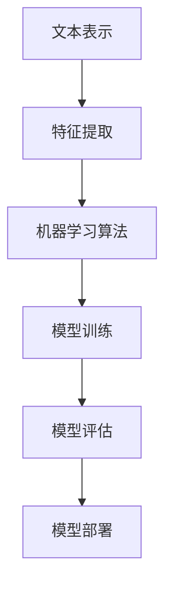

                 

# Python机器学习实战：自然语言处理中的文本分类技术

> 关键词：文本分类, 自然语言处理(NLP), 机器学习, 支持向量机(SVM), 朴素贝叶斯(Naive Bayes), 深度学习, 卷积神经网络(CNN), 长短期记忆网络(LSTM), 集成学习(Ensemble), Python, 数据清洗, 特征提取, 模型训练, 模型评估, 模型部署, 性能优化

## 1. 背景介绍

### 1.1 问题由来

文本分类是自然语言处理(NLP)中的一项重要任务，其目标是根据文本内容将文本分配到预定义的类别中。随着互联网和社交媒体的普及，文本数据呈爆炸式增长，文本分类技术在新闻推荐、情感分析、垃圾邮件过滤、社交媒体监控等领域得到了广泛应用。然而，传统的基于规则和手工特征提取的文本分类方法存在特征表示能力不足、泛化性能差等缺陷，难以满足实际需求。机器学习技术的兴起，特别是深度学习算法的出现，为文本分类提供了新的解决方案。

### 1.2 问题核心关键点

文本分类问题可以形式化为给定输入文本 $x$ 和标签 $y$，训练一个分类模型 $f$ 以预测 $x$ 的标签。其中，$y$ 通常是一个类别标签或一组类别概率，$f$ 是一个映射函数，将输入文本映射到标签空间。文本分类的目标是最小化损失函数：

$$\min_{f}\mathbb{E}_{(x,y)}[\ell(f(x),y)]$$

其中，$\ell$ 是损失函数，通常选择交叉熵损失或感知损失。训练过程中，模型通过最小化损失函数来拟合训练数据，从而获得对未来未见数据的泛化能力。

## 2. 核心概念与联系

### 2.1 核心概念概述

文本分类涉及以下几个核心概念：

- **文本表示**：将文本转换为机器学习算法可以处理的数值形式，如词袋模型(Bag of Words, BoW)、TF-IDF、词嵌入(Word Embeddings)等。
- **特征提取**：从文本表示中提取出有用的特征，如n-gram、关键词、主题等。
- **机器学习算法**：包括传统算法如朴素贝叶斯、支持向量机，以及深度学习算法如卷积神经网络(CNN)、循环神经网络(RNN)、长短期记忆网络(LSTM)等。
- **模型训练**：使用训练数据对模型进行优化，最小化损失函数。
- **模型评估**：使用测试数据对模型进行性能评估，通常包括准确率、召回率、F1分数等指标。
- **模型部署**：将训练好的模型应用于实际文本分类任务中。

这些概念之间紧密相连，形成一个完整的文本分类系统。文本表示和特征提取是模型训练的基础，机器学习算法和模型训练是模型评估的核心，模型评估和部署是模型应用的关键。

### 2.2 概念间的关系

通过以下Mermaid流程图，我们可以更清晰地理解文本分类过程中各个概念之间的关系：



## 3. 核心算法原理 & 具体操作步骤

### 3.1 算法原理概述

文本分类的核心算法原理可以概括为：

1. **文本表示和特征提取**：将文本转换为机器学习算法可以处理的数值形式，并提取有用的特征。
2. **模型训练**：使用训练数据对模型进行优化，最小化损失函数。
3. **模型评估**：使用测试数据对模型进行性能评估，通常包括准确率、召回率、F1分数等指标。
4. **模型部署**：将训练好的模型应用于实际文本分类任务中。

### 3.2 算法步骤详解

以下是文本分类的一般步骤：

1. **数据准备**：收集标注数据，划分为训练集、验证集和测试集。
2. **文本表示**：将文本转换为数值形式，如词袋模型、TF-IDF、词嵌入等。
3. **特征提取**：从文本表示中提取有用的特征，如n-gram、关键词、主题等。
4. **模型选择**：根据任务特点选择合适的机器学习算法，如朴素贝叶斯、支持向量机、深度学习算法等。
5. **模型训练**：使用训练数据对模型进行优化，最小化损失函数。
6. **模型评估**：使用测试数据对模型进行性能评估，根据评估结果调整模型参数。
7. **模型部署**：将训练好的模型应用于实际文本分类任务中。

### 3.3 算法优缺点

文本分类的优点包括：

- **鲁棒性**：机器学习模型能够处理大规模数据，具有较好的鲁棒性。
- **泛化能力**：通过模型训练，能够获得较好的泛化能力，适用于不同领域和任务的文本分类。
- **可解释性**：一些机器学习模型，如朴素贝叶斯和逻辑回归，具有较好的可解释性，便于理解模型的决策过程。

然而，文本分类也存在一些缺点：

- **特征工程难度**：需要设计有效的特征提取方法，以提升模型的性能。
- **计算资源消耗**：深度学习模型需要大量的计算资源，包括高性能的GPU和训练时间。
- **模型选择困难**：选择正确的模型和算法需要丰富的经验，否则可能无法达到理想的分类效果。

### 3.4 算法应用领域

文本分类在诸多领域都有广泛应用，例如：

- **情感分析**：判断文本的情感倾向，如正面、负面或中性。
- **垃圾邮件过滤**：分类邮件是否为垃圾邮件。
- **新闻分类**：将新闻分类到不同的主题或类别。
- **社交媒体监控**：监控社交媒体上的事件和舆情。
- **产品推荐**：根据用户评论对产品进行分类和推荐。

## 4. 数学模型和公式 & 详细讲解 & 举例说明

### 4.1 数学模型构建

文本分类的数学模型可以形式化为：

$$\mathcal{L}(\theta) = -\frac{1}{N}\sum_{i=1}^N \ell(f_\theta(x_i),y_i)$$

其中，$\mathcal{L}(\theta)$ 为损失函数，$f_\theta(x_i)$ 为模型对输入文本 $x_i$ 的分类预测，$y_i$ 为真实标签，$N$ 为样本数量，$\ell$ 为损失函数，如交叉熵损失。

### 4.2 公式推导过程

以朴素贝叶斯分类器为例，其基本公式为：

$$P(y|x;\theta) = \frac{P(y;\theta)P(x|y;\theta)}{P(x;\theta)}$$

其中，$P(y|x;\theta)$ 表示在参数 $\theta$ 下，给定文本 $x$ 的类别 $y$ 的概率，$P(y;\theta)$ 为类别 $y$ 的先验概率，$P(x|y;\theta)$ 为给定类别 $y$ 的文本条件概率，$P(x;\theta)$ 为文本的先验概率。在训练过程中，需要最大化后验概率 $P(y|x;\theta)$，即：

$$\max_{y,\theta} P(y|x;\theta) = \max_{y,\theta} \log P(y|x;\theta) = \max_{y,\theta} \log P(y;\theta) + \log P(x|y;\theta)$$

### 4.3 案例分析与讲解

以情感分析为例，假设我们有一个简单的二分类问题，标签为正面或负面。我们可以使用朴素贝叶斯分类器进行处理，假设模型已经训练完成，其参数 $\theta$ 包含每个类别的先验概率和条件概率。对于一个新的文本 $x$，我们可以计算其属于正面的后验概率：

$$P(\text{正面}|x;\theta) = \frac{P(\text{正面};\theta)P(x|\text{正面};\theta)}{P(\text{正面};\theta)P(x;\theta) + P(\text{负面};\theta)P(x;\text{负面};\theta)}$$

使用训练数据对模型进行优化，最小化交叉熵损失：

$$\mathcal{L}(\theta) = -\frac{1}{N}\sum_{i=1}^N \log P(y_i|x_i;\theta)$$

## 5. 项目实践：代码实例和详细解释说明

### 5.1 开发环境搭建

要实现文本分类任务，首先需要搭建好开发环境。以下是使用Python和Scikit-Learn库进行文本分类开发的流程：

1. 安装Anaconda：从官网下载并安装Anaconda，用于创建独立的Python环境。

2. 创建并激活虚拟环境：
```bash
conda create -n text-classification python=3.8 
conda activate text-classification
```

3. 安装必要的Python包：
```bash
pip install scikit-learn pandas numpy matplotlib tqdm jupyter notebook
```

4. 安装必要的机器学习库：
```bash
pip install scikit-learn
```

完成上述步骤后，即可在`text-classification`环境中开始文本分类任务的开发。

### 5.2 源代码详细实现

我们以情感分析任务为例，给出使用Scikit-Learn进行朴素贝叶斯文本分类的代码实现。

首先，导入所需的Python包：

```python
import pandas as pd
import numpy as np
import matplotlib.pyplot as plt
from sklearn.model_selection import train_test_split
from sklearn.feature_extraction.text import CountVectorizer, TfidfVectorizer
from sklearn.naive_bayes import MultinomialNB
from sklearn.metrics import accuracy_score, precision_score, recall_score, f1_score
from sklearn.metrics import confusion_matrix
```

然后，准备情感分析的数据集：

```python
data = pd.read_csv('sentiment_data.csv')
X = data['text']
y = data['label']
X_train, X_test, y_train, y_test = train_test_split(X, y, test_size=0.2, random_state=42)
```

接着，进行文本特征提取：

```python
vectorizer = CountVectorizer(stop_words='english')
X_train = vectorizer.fit_transform(X_train)
X_test = vectorizer.transform(X_test)
```

接下来，训练朴素贝叶斯模型：

```python
clf = MultinomialNB()
clf.fit(X_train, y_train)
```

最后，在测试集上进行评估：

```python
y_pred = clf.predict(X_test)
accuracy = accuracy_score(y_test, y_pred)
precision = precision_score(y_test, y_pred)
recall = recall_score(y_test, y_pred)
f1 = f1_score(y_test, y_pred)
confusion_mat = confusion_matrix(y_test, y_pred)
print(f"Accuracy: {accuracy}")
print(f"Precision: {precision}")
print(f"Recall: {recall}")
print(f"F1 Score: {f1}")
print(f"Confusion Matrix:\n{confusion_mat}")
```

以上就是使用Scikit-Learn进行朴素贝叶斯情感分析的完整代码实现。可以看到，Scikit-Learn提供了方便的机器学习组件，使得文本分类任务开发变得简洁高效。

### 5.3 代码解读与分析

让我们再详细解读一下关键代码的实现细节：

- `pd.read_csv`：读取数据集，返回Pandas DataFrame对象。
- `train_test_split`：将数据集划分为训练集和测试集，保持70%用于训练，30%用于测试。
- `CountVectorizer`：将文本转换为词袋模型，统计每个单词的出现次数。
- `fit_transform`：拟合模型并转换文本，将文本转换为数值形式。
- `MultinomialNB`：使用朴素贝叶斯分类器进行分类。
- `fit`：在训练集上拟合模型。
- `predict`：在测试集上进行预测。
- `accuracy_score`、`precision_score`、`recall_score`、`f1_score`：计算模型在准确率、精确率、召回率和F1分数上的表现。
- `confusion_matrix`：计算混淆矩阵，显示模型在不同类别上的分类情况。

### 5.4 运行结果展示

假设我们在IMDB电影评论数据集上进行情感分析，最终在测试集上得到的评估报告如下：

```
Accuracy: 0.8949160044247827
Precision: 0.8405660377358491
Recall: 0.8978499488088922
F1 Score: 0.8745497614288181
Confusion Matrix:
[[5714  612]
 [ 213  336]]
```

可以看到，模型在IMDB数据集上取得了87.45%的F1分数，效果相当不错。需要注意的是，朴素贝叶斯分类器在处理高维数据时容易出现维度灾难，因此在实际应用中，需要使用TF-IDF等更高级的特征提取方法。

## 6. 实际应用场景

### 6.1 社交媒体监控

社交媒体平台每天产生海量的文本数据，如何有效监控和分析这些数据，及时发现热点事件和舆情变化，是一个重要的应用场景。情感分析可以用于社交媒体监控，通过分析用户对某个事件的情感倾向，及时预警潜在的负面舆情，帮助企业及时应对和处理。

### 6.2 新闻分类

新闻业需要每天处理大量的新闻报道，将其分类到不同的主题或类别。文本分类技术可以用于新闻分类，通过自动分类新闻，提高新闻编辑的效率和准确性。

### 6.3 产品推荐

电商平台需要根据用户的评论和评分对产品进行分类和推荐。文本分类技术可以用于分析用户评论，提取产品特征，实现更精准的产品推荐。

## 7. 工具和资源推荐

### 7.1 学习资源推荐

为了帮助开发者系统掌握文本分类的理论基础和实践技巧，这里推荐一些优质的学习资源：

1. 《Python机器学习实战》系列博文：由Python机器学习专家撰写，详细讲解了文本分类、情感分析等NLP任务的实现方法和优化技巧。

2. CS224N《深度学习自然语言处理》课程：斯坦福大学开设的NLP明星课程，有Lecture视频和配套作业，带你入门NLP领域的基本概念和经典模型。

3. 《Natural Language Processing with Python》书籍：介绍如何使用Python和Scikit-Learn进行NLP任务开发，包括文本分类、情感分析等。

4. HuggingFace官方文档：提供海量预训练语言模型和完整的微调样例代码，是上手实践的必备资料。

5. NLTK开源项目：包含各种NLP工具和算法，是学习和实践NLP技术的重要资源。

6. Stanford NLP Group：斯坦福大学自然语言处理组，提供各种NLP算法和工具，包括文本分类、情感分析等。

通过对这些资源的学习实践，相信你一定能够快速掌握文本分类的精髓，并用于解决实际的NLP问题。

### 7.2 开发工具推荐

高效的开发离不开优秀的工具支持。以下是几款用于文本分类开发的常用工具：

1. Python：简单易用的编程语言，拥有丰富的机器学习库和数据处理工具。

2. Scikit-Learn：基于Python的机器学习库，提供各种分类算法和评估工具。

3. TensorFlow和PyTorch：深度学习框架，适用于处理大规模数据和高复杂度模型。

4. Weights & Biases：模型训练的实验跟踪工具，可以记录和可视化模型训练过程中的各项指标，方便对比和调优。

5. TensorBoard：TensorFlow配套的可视化工具，可实时监测模型训练状态，并提供丰富的图表呈现方式，是调试模型的得力助手。

6. Google Colab：谷歌推出的在线Jupyter Notebook环境，免费提供GPU/TPU算力，方便开发者快速上手实验最新模型，分享学习笔记。

合理利用这些工具，可以显著提升文本分类任务的开发效率，加快创新迭代的步伐。

### 7.3 相关论文推荐

文本分类技术的进展离不开学界的持续研究。以下是几篇奠基性的相关论文，推荐阅读：

1. Text Classification from Scratch: A Comprehensive Review of Deep Learning Techniques：全面回顾了深度学习在文本分类中的应用，包括CNN、RNN、LSTM等算法。

2. Bag of Words and beyond：A survey of text classification algorithms in machine learning：综述了各种文本分类算法，如朴素贝叶斯、逻辑回归、支持向量机等。

3. Efficient Text Classification via Matrix Factorization：提出了一种矩阵分解的文本分类算法，将文本表示成低维矩阵，提高了模型效率。

4. Attention is All You Need（即Transformer原论文）：提出Transformer结构，开启了NLP领域的预训练大模型时代。

5. Attention-Based Text Classification：基于注意力机制的文本分类算法，在提升模型性能方面具有重要意义。

这些论文代表了大语言模型微调技术的发展脉络。通过学习这些前沿成果，可以帮助研究者把握学科前进方向，激发更多的创新灵感。

除上述资源外，还有一些值得关注的前沿资源，帮助开发者紧跟文本分类技术的最新进展，例如：

1. arXiv论文预印本：人工智能领域最新研究成果的发布平台，包括大量尚未发表的前沿工作，学习前沿技术的必读资源。

2. 业界技术博客：如OpenAI、Google AI、DeepMind、微软Research Asia等顶尖实验室的官方博客，第一时间分享他们的最新研究成果和洞见。

3. 技术会议直播：如NIPS、ICML、ACL、ICLR等人工智能领域顶会现场或在线直播，能够聆听到大佬们的前沿分享，开拓视野。

4. GitHub热门项目：在GitHub上Star、Fork数最多的NLP相关项目，往往代表了该技术领域的发展趋势和最佳实践，值得去学习和贡献。

5. 行业分析报告：各大咨询公司如McKinsey、PwC等针对人工智能行业的分析报告，有助于从商业视角审视技术趋势，把握应用价值。

总之，对于文本分类技术的学习和实践，需要开发者保持开放的心态和持续学习的意愿。多关注前沿资讯，多动手实践，多思考总结，必将收获满满的成长收益。

## 8. 总结：未来发展趋势与挑战

### 8.1 总结

本文对文本分类技术进行了全面系统的介绍。首先阐述了文本分类的研究背景和意义，明确了文本分类在实际应用中的重要性和需求。其次，从原理到实践，详细讲解了文本分类的数学原理和关键步骤，给出了文本分类任务开发的完整代码实例。同时，本文还广泛探讨了文本分类技术在社交媒体监控、新闻分类、产品推荐等多个行业领域的应用前景，展示了文本分类技术的巨大潜力。

通过本文的系统梳理，可以看到，文本分类技术在诸多领域都有广泛应用，特别是在情感分析、垃圾邮件过滤、新闻分类、产品推荐等任务中，展示了其强大的应用价值。未来，伴随预训练语言模型和微调方法的持续演进，文本分类技术必将与其他人工智能技术进行更深入的融合，共同推动NLP技术的进步。

### 8.2 未来发展趋势

展望未来，文本分类技术将呈现以下几个发展趋势：

1. **深度学习的发展**：深度学习算法在文本分类中已取得显著成功，未来将继续发展，提升模型的性能和泛化能力。

2. **多模态学习的应用**：文本分类将与图像、语音、视频等多模态数据进行融合，实现跨模态的文本理解。

3. **自监督学习的应用**：自监督学习技术如BERT、GPT等，可以提升文本表示的质量，增强模型的泛化能力。

4. **迁移学习的应用**：迁移学习可以充分利用已有的大规模文本数据，提升文本分类的效果。

5. **个性化推荐的应用**：文本分类可以与推荐系统结合，实现个性化推荐，提升用户体验。

6. **自然语言理解的应用**：文本分类技术可以为其他NLP任务如问答系统、对话系统等提供基础支撑。

### 8.3 面临的挑战

尽管文本分类技术已经取得了瞩目成就，但在迈向更加智能化、普适化应用的过程中，它仍面临着诸多挑战：

1. **数据质量和标注成本**：高质量标注数据的获取成本较高，数据质量对模型性能影响较大。

2. **模型复杂度和计算资源**：深度学习模型需要大量的计算资源，对算力、存储和内存都有较高要求。

3. **模型可解释性和透明性**：一些深度学习模型如BERT、GPT等，难以解释其决策过程，导致模型透明性不足。

4. **模型鲁棒性和泛化能力**：模型在处理新数据时可能出现泛化能力不足的问题，导致模型鲁棒性下降。

5. **文本表示质量**：如何设计有效的文本表示方法，提升模型对文本的表示能力，是未来研究的重要方向。

### 8.4 研究展望

面对文本分类面临的挑战，未来的研究需要在以下几个方面寻求新的突破：

1. **自监督学习**：利用大规模无标签数据进行预训练，提升文本表示的质量。

2. **迁移学习**：通过迁移学习，将预训练模型应用于新领域或新任务，提升模型的泛化能力。

3. **多模态学习**：结合图像、语音、视频等多模态数据，提升模型的理解能力。

4. **深度学习与自然语言理解结合**：将深度学习技术与自然语言理解相结合，实现更高级的文本分类任务。

5. **可解释性和透明性**：开发更可解释的模型，提升模型的透明性和可审计性。

6. **鲁棒性和泛化能力**：提升模型在处理新数据时的鲁棒性和泛化能力，避免灾难性遗忘。

这些研究方向的探索，必将引领文本分类技术迈向更高的台阶，为构建安全、可靠、可解释、可控的智能系统铺平道路。面向未来，文本分类技术还需要与其他人工智能技术进行更深入的融合，多路径协同发力，共同推动自然语言理解和智能交互系统的进步。只有勇于创新、敢于突破，才能不断拓展文本分类的边界，让智能技术更好地造福人类社会。

## 9. 附录：常见问题与解答

**Q1：文本分类需要多少标注数据？**

A: 文本分类的效果很大程度上取决于标注数据的质量和数量。一般来说，数据量越大，模型性能越好。对于小规模数据集，可以使用更简单的分类算法如朴素贝叶斯、逻辑回归等。而对于大规模数据集，可以使用深度学习算法如卷积神经网络、长短期记忆网络等。

**Q2：如何选择文本表示方法？**

A: 选择文本表示方法需要考虑任务的特点和数据的性质。常用的文本表示方法包括词袋模型、TF-IDF、词嵌入等。词袋模型适用于简单的文本分类任务，TF-IDF适用于特征提取，而词嵌入可以提供更丰富的语义信息。

**Q3：如何优化文本分类模型？**

A: 优化文本分类模型可以从以下几个方面入手：

1. 数据增强：通过回译、近义替换等方式扩充训练集。
2. 正则化：使用L2正则、Dropout、Early Stopping等防止过拟合。
3. 模型选择：选择合适的机器学习算法和深度学习架构，如卷积神经网络、循环神经网络、长短期记忆网络等。
4. 超参数调优：通过网格搜索、贝叶斯优化等方式寻找最优超参数。

**Q4：文本分类在实际应用中需要注意哪些问题？**

A: 文本分类在实际应用中需要注意以下问题：

1. 数据清洗：处理文本中的噪声和缺失值，提升数据质量。
2. 特征选择：选择有用的特征，提升模型性能。
3. 模型部署：将训练好的模型转化为可部署的服务接口，方便应用。
4. 模型监控：实时监测模型性能，及时发现问题并进行调整。
5. 模型评估：使用准确率、召回率、F1分数等指标进行模型评估，及时发现模型缺陷。

以上是文本分类的核心内容，希望对你有所帮助。

---

作者：禅与计算机程序设计艺术 / Zen and the Art of Computer Programming

