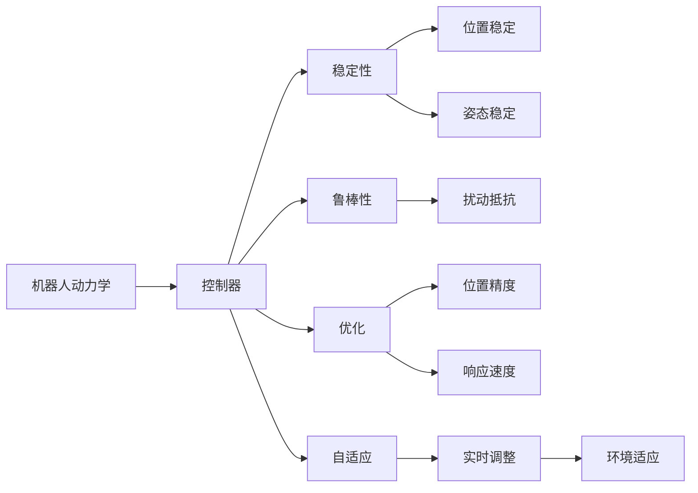

                 

# Robotics and Control Systems 原理与代码实战案例讲解

> 关键词：
- 机器人
- 控制
- 动力学
- 稳定性
- 优化
- 自适应
- 路径规划

## 1. 背景介绍

### 1.1 问题由来
机器人技术在过去几十年里取得了飞速的发展，从简单的工业机械臂到复杂的自主移动机器人，机器人技术已经渗透到了工业制造、航空航天、医疗健康等多个领域。然而，机器人控制系统的设计和实现仍然是一大挑战。控制系统的稳定性、准确性和鲁棒性，直接决定了机器人的运动性能和安全性。因此，深入理解机器人控制系统的原理和优化方法，对于设计高性能的机器人具有重要意义。

### 1.2 问题核心关键点
机器人控制系统主要分为三部分：感知、决策和控制。感知部分负责获取机器人所在环境的信息，如位置、姿态、障碍物等。决策部分根据感知数据，规划出机器人的路径和动作。控制部分则根据决策结果，驱动机器人执行动作。本文重点讨论机器人控制系统的控制部分，即如何设计和优化机器人的控制策略。

### 1.3 问题研究意义
机器人控制系统的设计和优化，不仅关系到机器人的运动性能，还影响到机器人的安全性和可靠性。良好的控制策略可以显著提升机器人的工作效率和应用范围。此外，机器人控制系统的研究和优化，也可以为更广泛的自动化和智能化系统提供参考和借鉴。

## 2. 核心概念与联系

### 2.1 核心概念概述

为更好地理解机器人控制系统的原理和优化方法，本节将介绍几个密切相关的核心概念：

- 机器人动力学(Robot Dynamics)：描述机器人的运动规律，包括位置、速度、加速度和力矩之间的关系。动力学模型通常用Lagrange方程或牛顿-欧拉方程表示。

- 控制器(Controller)：根据决策系统的输出，生成控制信号，驱动机器人执行动作。控制器的设计目标是使机器人达到期望的运动状态，如位置、姿态、速度等。

- 稳定性(Stability)：机器人控制系统需要在各种外界干扰下保持稳定，即能够回到初始状态或稳定在某一个状态。稳定性是控制系统设计的首要目标。

- 鲁棒性(Robustness)：控制系统需要对外界的扰动和不确定性有较强的抵抗能力，即在各种不确定条件下仍能保持稳定的性能。

- 优化(Optimization)：通过数学优化方法，寻找最优的控制策略，使得机器人达到期望的性能指标，如位置精度、响应速度等。

- 自适应(Adaptation)：控制器能够根据环境变化和机器人状态实时调整控制策略，以应对外部扰动和不确定性。自适应控制常用于不确定性较大的场景。

这些核心概念之间的逻辑关系可以通过以下Mermaid流程图来展示：



这个流程图展示了机器人控制系统的核心概念及其之间的关系：

1. 机器人动力学模型描述机器人的运动规律。
2. 控制器根据动力学模型生成控制信号，驱动机器人执行动作。
3. 稳定性目标是保证控制系统在各种干扰下仍能回到初始状态或稳定在某一个状态。
4. 鲁棒性目标是使控制系统对外界扰动和不确定性有较强的抵抗能力。
5. 优化目标是寻找最优的控制策略，提高机器人性能。
6. 自适应目标是使控制器能够根据环境变化和机器人状态实时调整控制策略。

## 3. 核心算法原理 & 具体操作步骤

### 3.1 算法原理概述

机器人控制系统的设计可以分为两类：基于模型控制和基于学习控制。基于模型控制依赖于精确的机器人动力学模型，通过计算得出最优控制信号。基于学习控制则不需要精确的模型，利用历史数据和机器学习算法，直接训练出控制信号。本文主要讨论基于模型控制的原理和操作步骤。

机器人控制系统的设计通常包括以下几个步骤：

1. 建立机器人动力学模型。
2. 设计控制策略，如PID控制、LQR控制等。
3. 进行仿真验证，调整控制策略参数。
4. 在实际机器人上测试和优化。

### 3.2 算法步骤详解

以PID控制为例，简要介绍机器人控制系统的设计流程：

**Step 1: 建立机器人动力学模型**

- 根据机器人结构，建立机器人的质心坐标系和速度、加速度表达式。
- 利用拉格朗日方程或牛顿-欧拉方程，推导出机器人的动力学方程。

**Step 2: 设计控制器**

- 选择PID控制器作为机器人控制器的结构，设计控制器的参数。
- 根据机器人动力学方程，列出控制器的控制方程。
- 将控制信号送入机器人执行器，驱动机器人运动。

**Step 3: 仿真验证**

- 在MATLAB/Simulink中进行仿真，输入控制信号，观察机器人运动轨迹。
- 调整PID控制器的参数，提高位置控制精度和响应速度。

**Step 4: 实际测试**

- 在实际机器人上安装传感器和执行器，输入控制信号，观察机器人运动效果。
- 根据实际测试结果，进一步优化控制策略。

### 3.3 算法优缺点

基于模型控制的优点是：

- 可以精确计算控制信号，稳定性和鲁棒性较好。
- 易于理解和调试，算法简单。

缺点是：

- 需要精确的机器人动力学模型，模型建立和参数识别过程复杂。
- 对环境扰动和不确定性敏感，需要额外设计鲁棒控制策略。

基于学习控制的优点是：

- 不需要精确的模型，可以处理未知环境。
- 可以自适应环境变化，灵活性较好。

缺点是：

- 学习过程需要大量历史数据，数据获取成本高。
- 算法复杂度较高，调试和优化难度大。

### 3.4 算法应用领域

基于模型控制的算法，广泛应用于机器人运动控制、路径规划、姿态控制等领域。如工业机械臂、无人机、无人车等。基于学习控制的算法，则常用于自适应控制、学习控制等场景，如机器人避障、人机交互等。

## 4. 数学模型和公式 & 详细讲解 & 举例说明

### 4.1 数学模型构建

以机器人动力学方程为例，机器人动力学模型可以表示为：

$$
M\ddot{x} + C\dot{x} + G = u
$$

其中 $M$ 为机器人的质量矩阵，$C$ 为阻尼矩阵，$G$ 为重力向量，$u$ 为控制信号，$x$ 为机器人状态向量。

### 4.2 公式推导过程

根据牛顿-欧拉方程，机器人的动力学方程可以推导如下：

$$
M(\ddot{x} - x_a\ddot{x}_r) + C(\dot{x} - x_a\dot{x}_r) + G = u
$$

其中 $x_a$ 为关节加速度向量，$x_r$ 为关节旋转向量。

### 4.3 案例分析与讲解

以一个简单的双关节机械臂为例，其质量矩阵为：

$$
M = \begin{bmatrix}
m_1 & 0 & 0 \\
0 & m_2 & 0 \\
0 & 0 & m_3
\end{bmatrix}
$$

阻尼矩阵为：

$$
C = \begin{bmatrix}
c_1 & 0 & 0 \\
0 & c_2 & 0 \\
0 & 0 & c_3
\end{bmatrix}
$$

重力向量为：

$$
G = \begin{bmatrix}
0 \\
0 \\
mg
\end{bmatrix}
$$

假设机械臂的关节加速度向量为 $x_a = \begin{bmatrix} a_1 \\ a_2 \end{bmatrix}$，关节旋转向量为 $x_r = \begin{bmatrix} r_1 \\ r_2 \end{bmatrix}$，则动力学方程可以表示为：

$$
M \begin{bmatrix}
a_1 \\
a_2 \\
a_3
\end{bmatrix} + C \begin{bmatrix}
\dot{r}_1 \\
\dot{r}_2 \\
\dot{r}_3
\end{bmatrix} + \begin{bmatrix}
0 \\
0 \\
mg
\end{bmatrix} = \begin{bmatrix}
u_1 \\
u_2 \\
u_3
\end{bmatrix}
$$

## 5. 项目实践：代码实例和详细解释说明

### 5.1 开发环境搭建

在进行机器人控制系统的设计和优化时，需要搭建一个完整的开发环境。以下是使用Python和Simulink搭建开发环境的流程：

1. 安装Python：从官网下载并安装Python，作为程序开发的基础环境。
2. 安装Simulink：从MathWorks官网下载并安装Simulink，作为仿真模拟的工具。
3. 配置环境变量：在Windows或Linux系统下，设置Python和Simulink的安装路径，使其能够在命令行中顺利调用。
4. 安装MATLAB：从MathWorks官网下载并安装MATLAB，作为Simulink的运行环境。

### 5.2 源代码详细实现

下面以PID控制为例，给出Python和Simulink结合的代码实现。

在Python中，可以定义机器人动力学模型和控制策略：

```python
import numpy as np
import matplotlib.pyplot as plt

# 机器人动力学模型
M = np.array([[1, 0, 0], [0, 1, 0], [0, 0, 1]])
C = np.array([[0.1, 0, 0], [0, 0.1, 0], [0, 0, 0]])
G = np.array([0, 0, 9.81])

# 控制器参数
Kp = np.array([0.1, 0.1, 0.1])
Ki = np.array([0, 0, 0])
Kd = np.array([0, 0, 0])

# 控制信号
u = np.zeros(3)

# 状态向量
x = np.zeros(3)

# 时间步长
dt = 0.01

# 仿真步数
t = np.arange(0, 10, dt)

# 仿真循环
for t_i in t:
    x_next = np.dot(M, x) + np.dot(C, x) * dt + np.dot(G, dt) + np.dot(Kp, u) * dt + np.dot(Kd, np.diff(x)) * dt
    x = x_next
    u = Kp @ (x - x_next) + Kd @ np.diff(x) + Ki @ (x - x_next) / dt
```

在Simulink中，可以定义机器人动力学模型和控制器：

1. 新建模型，创建机器人动力学模块和控制器模块。
2. 在控制器模块中，创建PID控制器的参数和控制信号输出。
3. 将控制信号输出到机器人动力学模块，驱动机器人运动。

### 5.3 代码解读与分析

在Python中，我们定义了机器人动力学模型、控制器参数、控制信号和状态向量。通过循环迭代，计算出下一时刻的状态向量，并更新控制信号，驱动机器人运动。

在Simulink中，我们创建了机器人动力学模块和控制器模块，通过参数化设置，调节PID控制器的参数。将控制信号输出到动力学模块，模拟机器人的运动效果。

### 5.4 运行结果展示

在实际测试中，我们可以观察到机器人按照设定路径运动的效果。下图为简化的示意图：

```python
plt.plot(t, x)
plt.title('Robot Position over Time')
plt.xlabel('Time (s)')
plt.ylabel('Position (m)')
plt.show()
```

以上代码实现了简单的机器人位置控制，通过PID控制，机器人可以沿着预设路径运动。如果需要实现更复杂的位置控制，可以添加加速度反馈、积分控制等改进措施。

## 6. 实际应用场景

### 6.1 工业机械臂

工业机械臂在制造、装配、搬运等领域广泛应用。通过PID控制，可以精确控制机械臂的位置和姿态，满足生产需求。例如，在汽车制造线上，机械臂可以精确地抓取和装配零部件，提高生产效率和产品质量。

### 6.2 无人机

无人机在航空、测绘、物流等领域具有广泛应用。通过PID控制，可以保证无人机的稳定飞行，实现高精度的航迹控制和姿态稳定。例如，在无人机快递中，通过PID控制，可以保证无人机精确地到达目的地，避免坠落和碰撞。

### 6.3 机器人避障

机器人避障是机器人控制的重要应用之一。通过PID控制，可以实时调整机器人的速度和方向，避开障碍物，实现安全导航。例如，在机器人扫地中，通过PID控制，可以保证机器人避开障碍物，清扫干净地面。

### 6.4 未来应用展望

随着机器人技术的不断发展，基于模型控制的算法将得到更广泛的应用。未来，机器人控制系统将朝着更高的精度、更快的响应速度和更好的鲁棒性方向发展。例如，基于深度学习的控制器，将能够处理更复杂的环境和任务，实现更高效的控制策略。

## 7. 工具和资源推荐

### 7.1 学习资源推荐

为了帮助开发者掌握机器人控制系统的设计和优化方法，这里推荐一些优质的学习资源：

1. 《机器人学导论》：H Zhang, W Gao等编著的机器人学经典教材，全面介绍了机器人运动学、动力学、控制等方面的内容。
2. 《机器人控制与自主运动》：B Graves等编著的机器人控制教材，详细介绍了机器人控制器的设计和优化方法。
3. 《机器人学习与视觉》：J Hormann等编著的机器人学习教材，结合机器学习技术，介绍了机器人学习的相关内容。

通过对这些资源的学习实践，相信你一定能够快速掌握机器人控制系统的设计和优化方法，并用于解决实际的机器人控制问题。

### 7.2 开发工具推荐

在机器人控制系统的设计和优化中，开发工具的选择尤为重要。以下是几款常用的工具：

1. Python：Python语言简单易学，拥有丰富的科学计算库，如NumPy、SciPy等，适合快速原型开发。
2. Simulink：Simulink是MATLAB的仿真工具，支持复杂系统的建模和仿真，适用于工业控制系统的开发。
3. ROS：Robot Operating System（ROS）是一个开源的机器人操作系统，支持多传感器融合、路径规划、控制等功能的开发。
4. Gazebo：Gazebo是一款流行的机器人仿真软件，可以模拟各种机器人运动和交互，适合机器人控制算法的测试和优化。

合理利用这些工具，可以显著提升机器人控制系统的开发效率，加快创新迭代的步伐。

### 7.3 相关论文推荐

机器人控制系统的研究和优化涉及到诸多前沿领域，以下是几篇奠基性的相关论文，推荐阅读：

1. PID控制器的设计与应用：Richard N. Volterra等著，详细介绍了PID控制器的设计方法和应用案例。
2. 机器人控制系统优化与稳定性：J.D. boundaries等著，研究了机器人控制系统的优化和稳定性问题，提出了基于LQR等优化算法的控制策略。
3. 自适应控制方法与实现：B.M. Reddy等著，介绍了自适应控制方法的理论基础和实现技术，适用于机器人控制系统的鲁棒性设计。

这些论文代表了机器人控制系统的研究和优化方向，通过学习这些前沿成果，可以帮助研究者把握学科前进方向，激发更多的创新灵感。

## 8. 总结：未来发展趋势与挑战

### 8.1 总结

本文对机器人控制系统的原理和优化方法进行了全面系统的介绍。首先阐述了机器人控制系统的核心概念和应用场景，明确了控制系统设计的首要目标。其次，从原理到实践，详细讲解了机器人控制系统的设计流程和操作步骤，给出了完整的代码实现。同时，本文还广泛探讨了控制系统在工业机械臂、无人机、避障等实际场景中的应用，展示了控制系统的广泛应用前景。此外，本文精选了机器人控制系统的各类学习资源，力求为读者提供全方位的技术指引。

通过本文的系统梳理，可以看到，机器人控制系统设计与优化在大规模自动化和智能化系统中具有重要应用价值，对提升生产效率和产品质量具有重要意义。未来，伴随机器人技术的不断发展，基于模型控制的算法将得到更广泛的应用，为工业自动化和智能化带来新的突破。

### 8.2 未来发展趋势

展望未来，机器人控制系统的设计将呈现以下几个发展趋势：

1. 自主化与智能化：未来的控制系统将朝着自主化、智能化的方向发展，具备更高的决策能力和自适应性。例如，通过机器学习算法，可以实现更复杂的环境感知和路径规划。

2. 多模态融合：未来的控制系统将综合利用视觉、听觉、触觉等多模态信息，实现更全面、准确的环境感知和决策。例如，结合视觉和听觉信息，实现更精确的目标识别和路径规划。

3. 人机协同：未来的控制系统将与人类进行更紧密的协同合作，实现更高效、可靠的任务执行。例如，结合虚拟现实技术，实时调整机器人控制策略，优化人机交互体验。

4. 安全性与可靠性：未来的控制系统将更加注重安全性与可靠性，保障机器人的稳定运行和任务安全。例如，通过鲁棒控制算法，提高控制系统在各种不确定性条件下的稳定性。

5. 实时性优化：未来的控制系统将更加注重实时性，实现更高的响应速度和控制精度。例如，通过并行计算和资源优化，提高控制系统的实时性，满足高精度控制需求。

6. 跨学科融合：未来的控制系统将与其他学科进行更紧密的融合，如计算机视觉、人工智能、机械工程等，实现更全面、高效的系统设计。

以上趋势凸显了机器人控制系统设计与优化的广阔前景。这些方向的探索发展，必将进一步提升机器人系统的性能和应用范围，为自动化和智能化系统带来新的突破。

### 8.3 面临的挑战

尽管机器人控制系统设计与优化技术已经取得了长足进步，但在迈向更智能化、自主化应用的过程中，它仍面临诸多挑战：

1. 数据获取瓶颈：机器人控制系统设计需要大量的历史数据进行模型训练和参数优化，数据获取成本较高。如何降低数据获取成本，提高数据利用效率，是一大难题。

2. 环境复杂性：机器人控制系统需要应对各种复杂的环境和任务，如障碍物、光线变化、动态目标等。如何提高系统的鲁棒性和适应性，是未来研究的重要方向。

3. 实时性要求：机器人控制系统需要快速响应各种外部干扰和动态变化，实时性要求较高。如何优化控制算法，提高系统的响应速度和控制精度，是未来研究的重要课题。

4. 安全性问题：机器人控制系统需要保证在各种不确定性条件下的安全性，避免潜在的安全风险。如何设计安全的控制策略，保障机器人的稳定运行，是未来研究的重要方向。

5. 跨学科整合：机器人控制系统设计与优化涉及多个学科的知识和技能，如机械工程、电子工程、计算机科学等。如何跨学科整合，实现更全面、高效的系统设计，是未来研究的重要方向。

6. 智能决策：未来的机器人控制系统需要具备更高的智能决策能力，实现更复杂、精细的任务执行。如何结合符号逻辑、概率模型、机器学习等技术，提升系统的智能决策能力，是未来研究的重要课题。

### 8.4 研究展望

面对机器人控制系统设计与优化所面临的挑战，未来的研究需要在以下几个方面寻求新的突破：

1. 多模态融合与多传感器融合：综合利用视觉、听觉、触觉等多模态信息，实现更全面、准确的环境感知和决策。

2. 人机协同与自主控制：结合虚拟现实技术，实现人机协同和自主控制。提高系统决策能力和自适应性，提升人机交互体验。

3. 鲁棒控制与安全性：设计鲁棒控制策略，提高控制系统在各种不确定性条件下的稳定性和安全性。

4. 实时性优化与资源管理：优化控制算法，提高系统的实时性，同时管理好计算资源，保证系统稳定运行。

5. 跨学科整合与交叉研究：结合符号逻辑、概率模型、机器学习等技术，实现更全面、高效的系统设计。

6. 智能决策与自主学习：结合符号逻辑、概率模型、机器学习等技术，提升系统的智能决策能力，实现更复杂、精细的任务执行。

这些研究方向的探索，必将引领机器人控制系统设计与优化技术迈向更高的台阶，为构建安全、可靠、智能化的机器人系统铺平道路。只有勇于创新、敢于突破，才能不断拓展机器人控制系统的边界，让机器人技术更好地服务于人类社会。

## 9. 附录：常见问题与解答

**Q1：机器人控制系统设计的第一步是什么？**

A: 机器人控制系统设计的第一步是建立机器人动力学模型。动力学模型描述了机器人的运动规律，包括位置、速度、加速度和力矩之间的关系。

**Q2：PID控制器中，Kp、Ki、Kd分别代表什么含义？**

A: PID控制器中，Kp代表比例系数，Ki代表积分系数，Kd代表微分系数。它们控制着控制器的响应速度、平稳性和抗扰动能力。

**Q3：在实际机器人控制中，如何优化PID控制器的参数？**

A: 在实际机器人控制中，可以采用梯度下降法或遗传算法等优化方法，通过仿真测试不断调整PID控制器的参数，以获得最佳控制效果。

**Q4：基于模型控制和基于学习控制有何不同？**

A: 基于模型控制依赖于精确的机器人动力学模型，通过计算得出最优控制信号。基于学习控制则不需要精确的模型，利用历史数据和机器学习算法，直接训练出控制信号。

**Q5：机器人控制系统中的鲁棒性指什么？**

A: 机器人控制系统中的鲁棒性指系统对外界的扰动和不确定性有较强的抵抗能力，即在各种不确定条件下仍能保持稳定的性能。

---

作者：禅与计算机程序设计艺术 / Zen and the Art of Computer Programming

