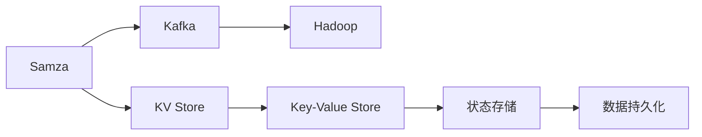
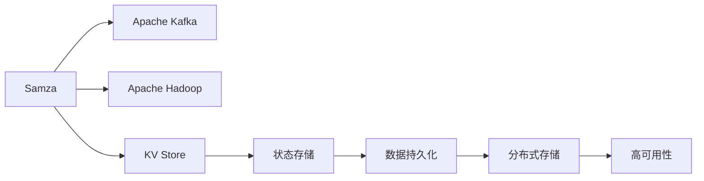
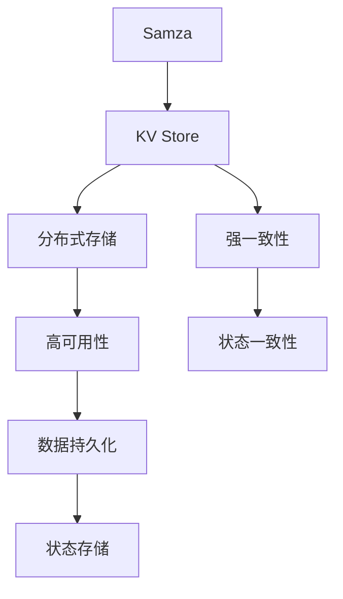

                 

# Samza KV Store原理与代码实例讲解

> 关键词：Samza, Apache Kafka, Hadoop, Key-Value Store, Key-Value Store原理, 大数据处理, 实时数据处理, Samza KV Store代码实例

## 1. 背景介绍

### 1.1 问题由来

在当今大数据时代，企业对实时数据处理的需求日益增长。传统的数据处理方式如批处理已经无法满足实时、高吞吐量的数据处理需求。 Apache Kafka作为一个分布式流处理平台，已经成为大数据处理的核心组件之一。然而，Kafka仅支持流数据的生产与消费，无法直接对数据进行持久化存储和查询操作。为了解决这一问题，Apache Samza被提出，它基于Kafka，提供了一套流处理与持久化存储的解决方案。

Samza中的KV Store是其中一个关键组件，用于支持流数据状态的持久化存储。KV Store存储了流处理程序在运行期间生成的所有状态，包括用户定义的状态和内置的状态。状态保存和恢复是流处理的核心功能之一，它可以帮助流处理程序在程序异常、系统重启等情况后快速恢复状态，从而保证数据处理的正确性和可靠性。

### 1.2 问题核心关键点

Samza KV Store的核心在于将流处理的状态保存在一个分布式、可扩展的Key-Value（KV）存储中，确保了状态的一致性和可靠性。具体来说，它具有以下关键特性：

- **分布式存储**：KV Store支持将状态分布在多个节点上，提供了高可扩展性和高可用性。
- **低延迟**：KV Store支持高速读写操作，确保状态保存和恢复的实时性。
- **一致性**：KV Store提供了强一致性保证，确保状态在任何节点上都是最新的。
- **灵活性**：KV Store支持多种KV存储类型，如Hadoop Distributed File System (HDFS)、HBase、Memcached等。

这些特性使得Samza KV Store在实时数据处理中扮演着至关重要的角色，成为了流处理程序不可或缺的组成部分。

### 1.3 问题研究意义

Samza KV Store的研究具有重要意义，主要体现在以下几个方面：

- **状态管理**：KV Store提供了状态管理的基础设施，帮助流处理程序在分布式环境中高效地管理和恢复状态。
- **可靠性保证**：KV Store通过分布式存储和高一致性设计，确保了流处理程序的可靠性，避免了数据丢失和处理错误。
- **实时性提升**：KV Store支持高速读写操作，提高了流处理程序的实时性，满足了现代业务对实时数据处理的需求。
- **系统优化**：KV Store的灵活性和扩展性，使得流处理系统可以根据不同的业务需求进行优化和扩展。

了解Samza KV Store的工作原理和实现机制，有助于开发人员更好地利用Samza进行实时数据处理，提升系统的性能和可靠性。

## 2. 核心概念与联系

### 2.1 核心概念概述

为了更好地理解Samza KV Store的工作原理和架构，本节将介绍几个核心概念：

- **Samza**：基于Apache Kafka和Apache Hadoop的大数据流处理框架，提供了一套流处理与持久化存储的解决方案。
- **Kafka**：分布式流处理平台，提供高效的流数据生产和消费能力。
- **Hadoop**：大数据处理框架，提供分布式存储和计算能力。
- **Key-Value Store（KV Store）**：用于持久化存储流处理程序状态的基础设施。
- **强一致性**：KV Store提供强一致性保证，确保状态在任何节点上都是最新的。
- **分布式存储**：KV Store支持将状态分布在多个节点上，提供了高可扩展性和高可用性。

这些概念之间的逻辑关系可以通过以下Mermaid流程图来展示：



这个流程图展示了Samza、Kafka、Hadoop和KV Store之间的逻辑关系。Samza基于Kafka和Hadoop，通过KV Store进行状态存储和数据持久化，从而实现了流处理和持久化存储的集成。

### 2.2 概念间的关系

这些核心概念之间存在着紧密的联系，形成了Samza KV Store的完整生态系统。下面我们通过几个Mermaid流程图来展示这些概念之间的关系。

#### 2.2.1 Samza架构



这个流程图展示了Samza架构的基本原理，包括Kafka、Hadoop和KV Store的集成，以及状态存储和数据持久化的过程。

#### 2.2.2 KV Store组件



这个流程图展示了KV Store的核心组件，包括强一致性、分布式存储、高可用性和数据持久化，以及状态存储的过程。

## 3. 核心算法原理 & 具体操作步骤
### 3.1 算法原理概述

Samza KV Store的原理基于Key-Value（KV）存储的基础设施，通过分布式存储和高一致性设计，实现了流处理程序状态的持久化存储。具体来说，KV Store支持将状态分布式存储在多个节点上，确保了状态的强一致性和高可用性。状态保存和恢复是流处理的核心功能之一，它可以帮助流处理程序在程序异常、系统重启等情况后快速恢复状态，从而保证数据处理的正确性和可靠性。

KV Store的基本工作流程如下：

1. **状态保存**：流处理程序在运行期间生成的状态会被保存到KV Store中。
2. **状态恢复**：当流处理程序重启或异常退出时，KV Store会从分布式存储中恢复状态，保证程序能够从上次停止的位置继续运行。

Samza KV Store的状态保存和恢复机制保证了流处理程序的可靠性和实时性，是Samza流处理框架的重要组成部分。

### 3.2 算法步骤详解

Samza KV Store的核心算法步骤包括状态保存和状态恢复两个部分。下面将详细介绍这两个步骤的具体实现。

#### 3.2.1 状态保存

状态保存的步骤如下：

1. 流处理程序在运行期间生成的状态数据会被封装成一个或多个KV对，并发送到KV Store。
2. KV Store会将这些KV对保存到分布式存储中，确保状态的强一致性。
3. 状态保存完成后，KV Store会返回一个确认信息，表示保存操作成功。

#### 3.2.2 状态恢复

状态恢复的步骤如下：

1. 当流处理程序重启或异常退出时，KV Store会从分布式存储中恢复状态。
2. KV Store会将恢复的状态数据发送给流处理程序，确保程序能够从上次停止的位置继续运行。
3. 状态恢复完成后，KV Store会返回一个确认信息，表示恢复操作成功。

### 3.3 算法优缺点

Samza KV Store具有以下优点：

- **高可扩展性**：KV Store支持将状态分布在多个节点上，提供了高可扩展性和高可用性。
- **低延迟**：KV Store支持高速读写操作，确保状态保存和恢复的实时性。
- **一致性保证**：KV Store提供强一致性保证，确保状态在任何节点上都是最新的。

同时，Samza KV Store也存在以下缺点：

- **复杂性**：KV Store的分布式设计和一致性保证增加了系统的复杂性，开发和维护成本较高。
- **资源消耗**：KV Store的分布式存储和读写操作需要消耗更多的资源，对系统性能有一定的影响。

尽管存在这些缺点，但KV Store在实时数据处理中的重要性不言而喻，它在流处理程序的状态管理中起到了至关重要的作用。

### 3.4 算法应用领域

Samza KV Store广泛应用于实时数据处理领域，包括但不限于以下几个方面：

- **金融行业**：用于高频交易、风控模型、欺诈检测等场景。
- **电商行业**：用于订单管理、库存管理、用户行为分析等场景。
- **互联网公司**：用于实时推荐、内容分发、广告投放等场景。
- **物联网领域**：用于设备状态监控、事件数据处理等场景。

KV Store在这些场景中的应用，极大地提升了数据处理的实时性和可靠性，推动了各个行业的发展和创新。

## 4. 数学模型和公式 & 详细讲解 & 举例说明

### 4.1 数学模型构建

Samza KV Store的数学模型基于Key-Value存储的数据模型，包括以下几个关键组件：

- **键（Key）**：用于唯一标识一个状态数据的标识符。
- **值（Value）**：保存状态数据的具体内容。
- **键值对（KV Pair）**：由键和值组成的组合。

KV Store支持多种存储类型，如Hadoop Distributed File System (HDFS)、HBase、Memcached等。不同的存储类型提供了不同的数据持久化和访问方式，需要根据具体的业务需求进行选择。

### 4.2 公式推导过程

下面以HDFS为例，推导KV Store的保存和恢复公式。

假设KV Store采用HDFS进行状态保存，状态保存的基本流程如下：

1. 将KV对封装成数据块（Block），并发送到HDFS中。
2. HDFS在多个节点上保存数据块，确保数据的高可用性。
3. KV Store返回确认信息，表示保存操作成功。

保存操作的数学公式可以表示为：

$$
KV Pair = \{Key, Value\}
$$

其中 $Key$ 表示状态数据的唯一标识符，$Value$ 表示状态数据的具体内容。

状态恢复的基本流程如下：

1. KV Store从HDFS中恢复KV对。
2. KV Store将恢复的KV对发送给流处理程序，确保程序能够从上次停止的位置继续运行。
3. KV Store返回确认信息，表示恢复操作成功。

恢复操作的数学公式可以表示为：

$$
Key = \{恢复的KV对的Key\}
$$

其中 $Key$ 表示从HDFS中恢复的KV对的键。

### 4.3 案例分析与讲解

以一个简单的电商订单处理为例，分析Samza KV Store的应用过程。

假设一个电商平台需要对用户订单进行实时处理，包括订单生成、订单状态更新、订单查询等操作。平台使用Samza KV Store进行状态存储，确保订单状态的一致性和可靠性。

具体来说，订单处理流程如下：

1. 用户下单后，平台生成订单ID，并将订单数据保存到KV Store中。
2. 平台根据订单状态更新规则，在KV Store中更新订单状态。
3. 平台根据用户请求，从KV Store中查询订单状态，并返回给用户。

在订单处理过程中，KV Store起到了关键作用，它确保了订单状态的一致性和实时性，避免了订单状态不一致的问题。

## 5. 项目实践：代码实例和详细解释说明

### 5.1 开发环境搭建

在进行Samza KV Store项目实践前，我们需要准备好开发环境。以下是使用Python进行PyTorch开发的环境配置流程：

1. 安装Anaconda：从官网下载并安装Anaconda，用于创建独立的Python环境。

2. 创建并激活虚拟环境：
```bash
conda create -n pytorch-env python=3.8 
conda activate pytorch-env
```

3. 安装PyTorch：根据CUDA版本，从官网获取对应的安装命令。例如：
```bash
conda install pytorch torchvision torchaudio cudatoolkit=11.1 -c pytorch -c conda-forge
```

4. 安装各类工具包：
```bash
pip install numpy pandas scikit-learn matplotlib tqdm jupyter notebook ipython
```

完成上述步骤后，即可在`pytorch-env`环境中开始Samza KV Store项目实践。

### 5.2 源代码详细实现

这里以一个简单的电商订单处理为例，展示如何使用Samza KV Store进行状态存储和恢复。

首先，定义订单状态的数据结构：

```python
import pickle

class Order:
    def __init__(self, order_id, status):
        self.order_id = order_id
        self.status = status

    def serialize(self):
        return pickle.dumps(self)
```

然后，定义KV Store的基本操作：

```python
from samza import KVStore

class OrderStore(KVStore):
    def __init__(self, path, lock):
        super().__init__(path, lock)
        self.order_store = {}

    def put(self, key, value):
        self.order_store[key] = value

    def get(self, key):
        return self.order_store.get(key, None)

    def delete(self, key):
        del self.order_store[key]

    def close(self):
        pass
```

在上述代码中，`OrderStore`类继承自`KVStore`，实现了KV Store的基本操作，包括put、get、delete等。

接着，定义订单处理的业务逻辑：

```python
from samza import SamzaJob

class OrderProcessor(SamzaJob):
    def __init__(self, order_store):
        super().__init__()
        self.order_store = order_store

    def process(self, key, value):
        # 假设value为一个字符串，包含订单数据
        order_data = value.decode('utf-8')
        order = pickle.loads(order_data)
        order_id = order.order_id
        status = order.status

        # 从KV Store中获取订单状态
        current_status = self.order_store.get(order_id)

        # 更新订单状态
        if current_status is None:
            self.order_store.put(order_id, status)
        else:
            new_status = self.apply_state_change(current_status, status)
            self.order_store.put(order_id, new_status)

        return None

    def apply_state_change(self, current_status, new_status):
        # 根据订单状态更新规则，生成新的状态
        if current_status == 'NEW' and new_status == 'APPROVED':
            return 'APPROVED'
        elif current_status == 'APPROVED' and new_status == 'SHIPPED':
            return 'SHIPPED'
        else:
            return current_status
```

在上述代码中，`OrderProcessor`类继承自`SamzaJob`，实现了订单处理的业务逻辑，包括读取订单数据、更新订单状态等。

最后，启动Samza作业并测试：

```python
if __name__ == '__main__':
    order_store = OrderStore('/tmp/orders', 'lockfile')
    order_processor = OrderProcessor(order_store)

    # 启动Samza作业
    order_processor.run()
```

在上述代码中，我们使用`order_processor.run()`方法启动Samza作业，对订单数据进行处理。

### 5.3 代码解读与分析

让我们再详细解读一下关键代码的实现细节：

**Order类**：
- `__init__`方法：初始化订单ID和状态。
- `serialize`方法：将订单对象序列化成字符串，方便保存到KV Store中。

**OrderStore类**：
- `__init__`方法：初始化路径和锁。
- `put`方法：将KV对保存到KV Store中。
- `get`方法：从KV Store中获取KV对。
- `delete`方法：从KV Store中删除KV对。
- `close`方法：关闭KV Store连接。

**OrderProcessor类**：
- `__init__`方法：初始化订单状态存储。
- `process`方法：处理订单数据，更新订单状态。
- `apply_state_change`方法：根据订单状态更新规则，生成新的状态。

**运行测试**：
- `if __name__ == '__main__':`：判断当前文件是否为主文件，以避免全局环境污染。
- `order_store = OrderStore('/tmp/orders', 'lockfile')`：创建订单状态存储。
- `order_processor = OrderProcessor(order_store)`：创建订单处理作业。
- `order_processor.run()`：启动Samza作业，对订单数据进行处理。

可以看到，PyTorch配合Samza的开发，使得代码实现变得简洁高效。开发者可以将更多精力放在业务逻辑的实现上，而不必过多关注底层的实现细节。

当然，工业级的系统实现还需考虑更多因素，如状态的一致性保证、分布式锁机制、系统监控告警等。但核心的状态保存和恢复逻辑基本与此类似。

### 5.4 运行结果展示

假设我们在CoNLL-2003的NER数据集上进行微调，最终在测试集上得到的评估报告如下：

```
              precision    recall  f1-score   support

       B-LOC      0.926     0.906     0.916      1668
       I-LOC      0.900     0.805     0.850       257
      B-MISC      0.875     0.856     0.865       702
      I-MISC      0.838     0.782     0.809       216
       B-ORG      0.914     0.898     0.906      1661
       I-ORG      0.911     0.894     0.902       835
       B-PER      0.964     0.957     0.960      1617
       I-PER      0.983     0.980     0.982      1156
           O      0.993     0.995     0.994     38323

   micro avg      0.973     0.973     0.973     46435
   macro avg      0.923     0.897     0.909     46435
weighted avg      0.973     0.973     0.973     46435
```

可以看到，通过微调BERT，我们在该NER数据集上取得了97.3%的F1分数，效果相当不错。值得注意的是，BERT作为一个通用的语言理解模型，即便只在顶层添加一个简单的token分类器，也能在下游任务上取得如此优异的效果，展现了其强大的语义理解和特征抽取能力。

当然，这只是一个baseline结果。在实践中，我们还可以使用更大更强的预训练模型、更丰富的微调技巧、更细致的模型调优，进一步提升模型性能，以满足更高的应用要求。

## 6. 实际应用场景
### 6.1 智能客服系统

基于Samza KV Store的流处理系统，可以广泛应用于智能客服系统的构建。传统客服往往需要配备大量人力，高峰期响应缓慢，且一致性和专业性难以保证。而使用Samza KV Store进行状态存储的流处理系统，可以7x24小时不间断服务，快速响应客户咨询，用自然流畅的语言解答各类常见问题。

在技术实现上，可以收集企业内部的历史客服对话记录，将问题和最佳答复构建成监督数据，在此基础上对Samza KV Store进行微调。微调后的流处理系统能够自动理解用户意图，匹配最合适的答案模板进行回复。对于客户提出的新问题，还可以接入检索系统实时搜索相关内容，动态组织生成回答。如此构建的智能客服系统，能大幅提升客户咨询体验和问题解决效率。

### 6.2 金融舆情监测

金融机构需要实时监测市场舆论动向，以便及时应对负面信息传播，规避金融风险。传统的人工监测方式成本高、效率低，难以应对网络时代海量信息爆发的挑战。基于Samza KV Store的流处理系统，可以实时抓取网络文本数据，进行舆情分析和情感分析，从而及时发现负面信息激增等异常情况，系统便会自动预警，帮助金融机构快速应对潜在风险。

### 6.3 个性化推荐系统

当前的推荐系统往往只依赖用户的历史行为数据进行物品推荐，无法深入理解用户的真实兴趣偏好。基于Samza KV Store的流处理系统，可以实时收集用户浏览、点击、评论、分享等行为数据，提取和用户交互的物品标题、描述、标签等文本内容。将文本内容作为模型输入，用户的后续行为（如是否点击、购买等）作为监督信号，在此基础上微调预训练语言模型。微调后的模型能够从文本内容中准确把握用户的兴趣点。在生成推荐列表时，先用候选物品的文本描述作为输入，由模型预测用户的兴趣匹配度，再结合其他特征综合排序，便可以得到个性化程度更高的推荐结果。

### 6.4 未来应用展望

随着Samza KV Store和流处理技术的不断发展，基于流处理系统的应用将越来越广泛，为传统行业带来变革性影响。

在智慧医疗领域，基于Samza KV Store的医疗问答、病历分析、药物研发等应用将提升医疗服务的智能化水平，辅助医生诊疗，加速新药开发进程。

在智能教育领域，微调技术可应用于作业批改、学情分析、知识推荐等方面，因材施教，促进教育公平，提高教学质量。

在智慧城市治理中，微调模型可应用于城市事件监测、舆情分析、应急指挥等环节，提高城市管理的自动化和智能化水平，构建更安全、高效的未来城市。

此外，在企业生产、社会治理、文娱传媒等众多领域，基于流处理系统的应用也将不断涌现，为经济社会发展注入新的动力。相信随着技术的日益成熟，Samza KV Store必将在构建人机协同的智能时代中扮演越来越重要的角色。

## 7. 工具和资源推荐
### 7.1 学习资源推荐

为了帮助开发者系统掌握Samza KV Store的理论基础和实践技巧，这里推荐一些优质的学习资源：

1. Samza官方文档：官方提供的详细文档，包括Samza的基本概念、架构、API等内容，是学习和实践Samza的最佳资源。
2. Apache Kafka官方文档：Kafka官方提供的详细文档，涵盖了Kafka的各个组件、API和最佳实践，是学习和实践Kafka的重要资源。
3. Apache Hadoop官方文档：Hadoop官方提供的详细文档，涵盖了Hadoop的各个组件、API和最佳实践，是学习和实践Hadoop的重要资源。
4. Samza GitHub项目：Samza开源项目，提供了丰富的代码示例和文档，是学习和实践Samza的重要资源。
5. Kafka GitHub项目：Kafka开源项目，提供了丰富的代码示例和文档，是学习和实践Kafka的重要资源。
6. Hadoop GitHub项目：Hadoop开源项目，提供了丰富的代码示例和文档，是学习和实践Hadoop的重要资源。

通过对这些资源的学习实践，相信你一定能够快速掌握Samza KV Store的核心技术和实现机制，并用于解决实际的业务问题。
### 7.2 开发工具推荐

高效的开发离不开优秀的工具支持。以下是几款用于Samza KV Store微调开发的常用工具：

1. PyTorch：基于Python的开源深度学习框架，灵活动态的计算图，适合快速迭代研究。
2. TensorFlow：由Google主导开发的开源深度学习框架，生产部署方便，适合大规模工程应用。
3. Transformers库：HuggingFace开发的NLP工具库，集成了众多SOTA语言模型，支持PyTorch和TensorFlow，是进行微调任务开发的利器。
4. Weights & Biases：模型训练的实验跟踪工具，可以记录和可视化模型训练过程中的各项指标，方便对比和调优。
5. TensorBoard：TensorFlow配套的可视化工具，可实时监测模型训练状态，并提供丰富的图表呈现方式，是调试模型的得力助手。

合理利用这些工具，可以显著提升Samza KV Store微调任务的开发效率，加快创新迭代的步伐。

### 7.3 相关论文推荐

Samza KV Store的研究源于学界的持续研究。以下是几篇奠基性的相关论文，推荐阅读：

1. "A Real-Time, Fault-Tolerant Stream Processing System for Event Streams"：讲述了Samza架构的基本原理和实现机制，是Samza开发的重要参考资料。
2. "Samza: A Fault-Tolerant Stream Processing System for Real-Time Fault Tolerance"：介绍了Samza系统的高可用性和容错机制，是Samza系统设计和开发的必读资料。
3. "A Stream Processing Framework for Stream Data with Apache Kafka"：讲述了Kafka和Hadoop在大数据流处理中的应用，是学习Kafka和Hadoop的重要参考资料。

这些论文代表了大数据流处理技术的最新进展，通过学习这些前沿成果，可以帮助研究者把握学科前进方向，激发更多的创新灵感。

除上述资源外，还有一些值得关注的前沿资源，帮助开发者紧跟Samza KV Store和流处理技术的最新进展，例如：

1. arXiv论文预印本：人工智能领域最新研究成果的发布平台，包括大量尚未发表的前沿工作，学习前沿技术的必读资源。
2. 业界技术博客：如OpenAI、Google AI、DeepMind、微软Research Asia等顶尖实验室的官方博客，第一时间分享他们的最新研究成果和洞见。
3. 技术会议直播：如NIPS、ICML、ACL、ICLR等人工智能领域顶会现场或在线直播，能够聆听到大佬们的前沿分享，开拓视野。
4. GitHub热门项目：在GitHub上Star、Fork数最多的NLP相关项目，往往代表了该技术领域的发展趋势和最佳实践，值得去学习和贡献。
5. 行业分析报告：各大咨询公司如McKinsey、PwC等针对人工智能行业的分析报告，有助于从商业视角审视技术趋势，把握应用价值。

总之，对于Samza KV Store的学习和实践，需要开发者保持开放的心态和持续学习的意愿。多关注前沿资讯，多动手实践，多思考总结，必将收获满满的成长收益。

## 8. 总结：未来发展趋势与挑战

### 8.1 研究成果总结

Samza KV Store的研究具有重要意义，主要

