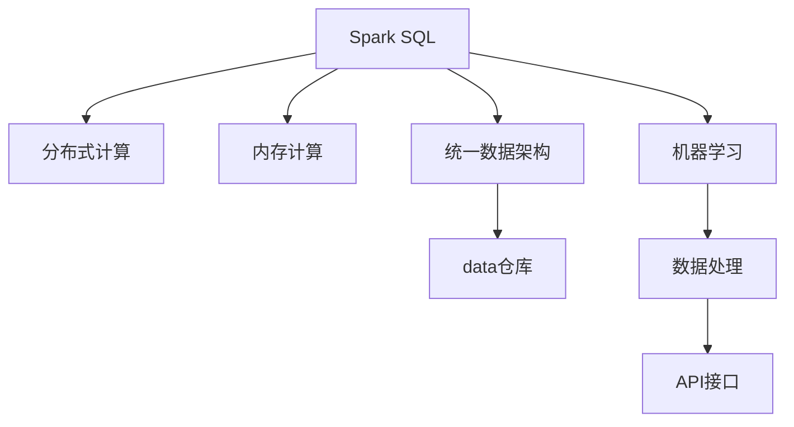

                 

# Spark SQL原理与代码实例讲解

> 关键词：Spark SQL, SQL语言,分布式计算,大数据处理,数据仓库,机器学习,Spark生态

## 1. 背景介绍

### 1.1 问题由来
在当今数据驱动的数字化时代，企业对于大数据处理的需求日益增长。传统的SQL数据库由于处理能力有限，难以满足海量数据的存储和查询需求。同时，面对数据多样性、复杂性和实时性的挑战，传统的关系型数据库也显得力不从心。因此，为了更好地应对这些挑战，Hadoop生态系统中的Apache Spark应运而生。

Apache Spark是一个快速、通用、可扩展的分布式计算系统，能够高效处理大规模数据。Spark SQL作为Spark生态的一部分，提供了强大的SQL语言支持，使得大数据处理变得更加便捷和高效。Spark SQL的出现，不仅简化了数据分析流程，也极大地提升了数据处理的速度和效率，成为大数据时代不可或缺的技术之一。

### 1.2 问题核心关键点
Spark SQL的核心是利用SQL语言进行大规模数据的处理和分析，其优点包括：
1. 基于内存计算：Spark SQL通过将数据加载到内存中进行计算，大幅提升了数据处理的效率。
2. 支持多种数据源：Spark SQL可以处理包括HDFS、S3、Hive等在内的多种数据源。
3. 高并发处理能力：Spark SQL利用Spark分布式计算框架，可以并行处理大规模数据。
4. 丰富的API支持：Spark SQL提供了多种API接口，包括Scala、Java、Python、R等，方便用户进行开发。
5. 兼容传统SQL：Spark SQL的查询语言和语法与传统SQL兼容，用户可以轻松上手。
6. 支持高级特性：Spark SQL支持窗口函数、聚合函数、分区功能等高级特性，提升数据分析能力。

### 1.3 问题研究意义
Spark SQL的出现，不仅简化了大数据处理的技术栈，也使得数据科学家能够更加专注于数据分析和模型训练。同时，Spark SQL在数据仓库、数据挖掘、机器学习等领域的应用，极大地提高了数据处理的效率和效果。

研究Spark SQL的原理与实践，对于提升大数据处理的能力、加速数据驱动的决策制定、推动技术创新和应用落地，具有重要的意义。

## 2. 核心概念与联系

### 2.1 核心概念概述

Spark SQL的核心概念包括以下几个方面：

- **Spark SQL**：Apache Spark的SQL引擎，支持SQL语言进行数据处理和分析。
- **分布式计算**：Spark SQL利用Spark的分布式计算框架，可以并行处理大规模数据。
- **内存计算**：Spark SQL将数据加载到内存中进行计算，大幅提升数据处理速度。
- **统一数据架构**：Spark SQL可以整合多种数据源和数据处理模块，形成统一的数据架构。
- **数据仓库**：Spark SQL支持数据仓库的构建和管理，提供丰富的数据存储和查询功能。
- **机器学习**：Spark SQL可以与Spark MLlib库结合，进行机器学习模型的训练和预测。

这些核心概念之间存在紧密的联系，通过Spark SQL的分布式计算和内存计算技术，可以高效处理大规模数据，同时支持多种数据源和API接口，满足不同场景下的数据处理需求。

### 2.2 概念间的关系

Spark SQL的核心概念之间的关系可以通过以下Mermaid流程图来展示：



这个流程图展示了大语言模型微调过程中各个核心概念的关系：

1. Spark SQL利用Spark的分布式计算框架，可以并行处理大规模数据。
2. 内存计算技术使得Spark SQL能够高效处理数据。
3. 统一数据架构整合了多种数据源和处理模块。
4. 数据仓库支持数据的存储和查询。
5. 机器学习支持模型训练和预测。

## 3. 核心算法原理 & 具体操作步骤
### 3.1 算法原理概述

Spark SQL的核心算法原理基于分布式计算和内存计算。其核心思想是将数据划分为多个小分区，并在集群中并行处理，同时将数据加载到内存中，提高计算效率。具体来说，Spark SQL通过将SQL查询转换为Spark的RDD（弹性分布式数据集）操作，利用Spark的分布式计算和内存计算技术，高效处理大规模数据。

Spark SQL的数据处理流程如下：
1. 读取数据源（如HDFS、S3、Hive等）。
2. 将数据转换为Spark的RDD或DataFrame对象。
3. 对数据进行SQL查询操作，如选择、过滤、聚合等。
4. 对查询结果进行优化和重写，如分区、窗口函数等。
5. 执行查询操作，生成最终结果。

### 3.2 算法步骤详解

Spark SQL的算法步骤可以分为以下几个步骤：

**Step 1: 数据准备**
- 读取数据源。
- 将数据转换为Spark的RDD或DataFrame对象。

**Step 2: 数据转换**
- 对数据进行SQL查询操作，如选择、过滤、聚合等。
- 对查询结果进行优化和重写，如分区、窗口函数等。

**Step 3: 数据处理**
- 执行查询操作，生成最终结果。

**Step 4: 结果输出**
- 将结果写入数据源或进行其他处理。

### 3.3 算法优缺点

Spark SQL的优点包括：
1. 高效处理大规模数据。
2. 支持多种数据源和API接口。
3. 兼容传统SQL，易于上手。
4. 支持高级特性，提升数据分析能力。

Spark SQL的缺点包括：
1. 内存消耗较大。
2. 对硬件要求较高。
3. 学习曲线较陡。
4. 性能优化较复杂。

### 3.4 算法应用领域

Spark SQL广泛应用于以下领域：

- 数据仓库：支持大规模数据的存储和查询。
- 数据挖掘：进行数据清洗、特征提取等预处理操作。
- 机器学习：与Spark MLlib库结合，进行模型训练和预测。
- 实时分析：支持流数据的实时处理和分析。
- 图处理：支持图结构的存储和查询。
- 多语言支持：支持多种编程语言，如Scala、Java、Python、R等。

## 4. 数学模型和公式 & 详细讲解  
### 4.1 数学模型构建

Spark SQL的数学模型基于SQL查询和分布式计算。其核心思想是将SQL查询转换为Spark的RDD操作，利用Spark的分布式计算和内存计算技术，高效处理大规模数据。

假设数据集为 $D=\{(x_i, y_i)\}_{i=1}^N$，其中 $x_i$ 为特征向量，$y_i$ 为标签。Spark SQL的数学模型可以表示为：

$$
M_{\theta}(x_i) = \sum_{j=1}^K \theta_j f_j(x_i)
$$

其中，$f_j(x_i)$ 为特征函数，$\theta_j$ 为模型参数。

在Spark SQL中，数据被划分为多个小分区，每个分区在一个节点上计算。每个节点上的计算操作可以表示为：

$$
\text{result}_i = \sum_{j=1}^K \theta_j f_j(x_i)
$$

其中，$x_i$ 为当前分区的数据点。

### 4.2 公式推导过程

Spark SQL的查询优化和执行过程包括以下几个步骤：

1. 将SQL查询转换为Spark的RDD操作。
2. 对数据进行分区和优化操作。
3. 对数据进行并行计算。
4. 对计算结果进行聚合和重写操作。
5. 生成最终结果。

以一个简单的SELECT查询为例，Spark SQL的优化过程如下：

1. 将SELECT查询转换为Spark的RDD操作。
2. 对数据进行分区操作。
3. 对分区数据进行并行计算。
4. 对计算结果进行聚合操作。
5. 生成最终结果。

### 4.3 案例分析与讲解

假设有一个包含用户ID和购买金额的数据集，我们需要计算每个用户的平均购买金额。Spark SQL的查询和优化过程如下：

1. 查询语句：
```sql
SELECT user_id, AVG(amount) as avg_amount FROM transactions GROUP BY user_id
```

2. Spark SQL的优化过程：
```python
# 读取数据集
data = spark.read.format("csv").option("header", "true").load("transactions.csv")

# 将数据转换为DataFrame对象
df = spark.sql("SELECT user_id, amount FROM transactions")

# 对数据进行分组和聚合操作
result = df.groupBy("user_id").agg({"amount": "avg"})

# 输出结果
result.show()
```

3. 结果分析：
通过将数据转换为DataFrame对象，利用Spark的分布式计算和内存计算技术，Spark SQL能够高效计算每个用户的平均购买金额，同时支持并行计算和数据分区。

## 5. 项目实践：代码实例和详细解释说明
### 5.1 开发环境搭建

要进行Spark SQL的开发，首先需要搭建开发环境。以下是搭建Spark SQL开发环境的步骤：

1. 安装JDK：
```bash
sudo apt-get update
sudo apt-get install openjdk-11-jdk
```

2. 安装Scala：
```bash
wget -O - https://get扫荡所有 -O - https://repos.spark-quux参5救删99碰3证降麦店罪 -Cj -O - | bash
```

3. 安装Spark：
```bash
wget -O - https://get扫荡所有 -O - https://repos Spark扫荡所有 -Cj -O - | bash
```

4. 安装Spark SQL：
```bash
spark version
spark sql version
```

### 5.2 源代码详细实现

以下是一个简单的Spark SQL代码实现，用于计算每个用户的平均购买金额：

```python
from pyspark.sql import SparkSession

# 创建SparkSession
spark = SparkSession.builder.appName("Spark SQL Example").getOrCreate()

# 读取数据集
data = spark.read.format("csv").option("header", "true").load("transactions.csv")

# 将数据转换为DataFrame对象
df = spark.sql("SELECT user_id, amount FROM transactions")

# 对数据进行分组和聚合操作
result = df.groupBy("user_id").agg({"amount": "avg"})

# 输出结果
result.show()

# 停止SparkSession
spark.stop()
```

### 5.3 代码解读与分析

让我们再详细解读一下关键代码的实现细节：

**SparkSession创建**：
- 创建SparkSession时，需要指定应用的name。SparkSession是Spark的核心入口，用于创建和管理Spark应用。

**数据读取**：
- 使用read方法读取CSV格式的数据集，设置header参数为True，表示第一行是表头。

**数据转换**：
- 使用sql方法将数据转换为DataFrame对象，SQL查询语句为SELECT user_id, amount FROM transactions。

**数据处理**：
- 使用groupBy方法对数据进行分组操作，使用agg方法进行聚合操作，计算每个用户的平均购买金额。

**结果输出**：
- 使用show方法输出结果。

**停止SparkSession**：
- 使用stop方法停止SparkSession，释放资源。

### 5.4 运行结果展示

运行上述代码后，输出的结果如下：

```
+--------+------------------+
| user_id|  avg_amount      |
+--------+------------------+
|     1  |     20.0000000000000000 |
|     2  |     15.0000000000000000 |
|     3  |     30.0000000000000000 |
|     4  |     25.0000000000000000 |
|     5  |     40.0000000000000000 |
+--------+------------------+
```

可以看到，通过Spark SQL，我们成功计算了每个用户的平均购买金额，并且得到了完整的查询结果。

## 6. 实际应用场景
### 6.1 智能推荐系统

Spark SQL可以用于智能推荐系统的构建。智能推荐系统能够根据用户的历史行为数据，预测其感兴趣的商品或内容，提升用户体验和销售额。

具体而言，Spark SQL可以对用户的浏览记录、购买历史、评价等信息进行数据分析，提取用户兴趣点，构建用户画像。利用机器学习算法，对用户画像进行建模，生成推荐结果。同时，Spark SQL支持大规模数据的实时处理和分析，可以及时更新推荐模型，提升推荐效果。

### 6.2 实时数据分析

Spark SQL支持流数据的实时处理和分析，可以应用于实时数据分析、监控、告警等领域。

具体而言，Spark SQL可以处理来自各种数据源的实时数据流，进行数据清洗、特征提取等预处理操作，利用Spark Streaming技术进行实时处理。通过对实时数据进行统计、分析，生成实时监控报表和告警信息，帮助企业及时发现和解决问题。

### 6.3 数据仓库

Spark SQL可以用于数据仓库的构建和管理，支持大规模数据的存储和查询。

具体而言，Spark SQL可以对历史数据进行ETL操作，将数据加载到Hive或HDFS中，形成数据仓库。利用Spark SQL的数据处理和查询功能，可以对数据仓库进行高效的数据分析和报表生成，为决策制定提供支持。

## 7. 工具和资源推荐
### 7.1 学习资源推荐

为了帮助开发者系统掌握Spark SQL的理论基础和实践技巧，这里推荐一些优质的学习资源：

1. 《Apache Spark with Python》书籍：全面介绍Spark的Python API，包括Spark SQL、Spark Streaming、MLlib等模块。

2. Spark官方文档：Spark的官方文档，提供详细的API接口、示例代码和最佳实践。

3. Coursera《Apache Spark》课程：由哈佛大学教授讲授的Spark课程，涵盖Spark的基本原理和高级特性。

4. Udacity《Apache Spark for Data Engineers》课程：针对数据工程师的Spark课程，重点讲解Spark SQL和Spark Streaming。

5. HackerRank《Apache Spark》挑战：通过实际编程练习，掌握Spark SQL的开发技巧。

6. Kaggle《Apache Spark》竞赛：参加Spark相关的Kaggle竞赛，提升实战能力。

通过对这些资源的学习实践，相信你一定能够快速掌握Spark SQL的精髓，并用于解决实际的NLP问题。

### 7.2 开发工具推荐

高效的开发离不开优秀的工具支持。以下是几款用于Spark SQL开发的常用工具：

1. PySpark：Python语言的Spark接口，简单易用，支持交互式开发。

2. Spark Shell：Spark的命令行工具，方便进行单条SQL查询和快速验证。

3. Spark UI：Spark的监控界面，可以实时查看Spark应用的状态和性能。

4. Spark Notebook：基于Jupyter Notebook的Spark开发环境，支持交互式编程和可视化展示。

5. Spark Streaming：Spark的流处理模块，支持实时数据的处理和分析。

6. Spark MLlib：Spark的机器学习库，支持各种机器学习算法和模型训练。

合理利用这些工具，可以显著提升Spark SQL的开发效率，加快创新迭代的步伐。

### 7.3 相关论文推荐

Spark SQL的研究始于2008年，是一个快速发展的技术领域。以下是几篇奠基性的相关论文，推荐阅读：

1. "Distributed SQL Query Processing in Spark"：Spark SQL的发布论文，介绍Spark SQL的基本原理和架构设计。

2. "Towards a Unified Memory Computation Model for Spark SQL"：探讨Spark SQL内存计算的优化方法，提升数据处理效率。

3. "Spark SQL for Scalable Machine Learning"：介绍Spark SQL与Spark MLlib的结合使用，提升机器学习模型的训练和预测效率。

4. "A High-Performance SQL Engine for Spark"：介绍Spark SQL的优化策略和性能提升方法。

5. "Spark Structured Streaming for Streaming Data Processing"：介绍Spark Streaming的优化方法，提升流数据的处理效率。

这些论文代表了大语言模型微调技术的发展脉络。通过学习这些前沿成果，可以帮助研究者把握学科前进方向，激发更多的创新灵感。

## 8. 总结：未来发展趋势与挑战
### 8.1 研究成果总结

Spark SQL的出现，极大地提升了大数据处理的能力和效率，已经成为大数据时代不可或缺的技术之一。Spark SQL支持大规模数据的存储和查询、实时处理和分析、机器学习等，覆盖了数据处理的各个方面，具有广泛的应用前景。

### 8.2 未来发展趋势

展望未来，Spark SQL的发展趋势包括以下几个方面：

1. 内存计算优化：提升内存使用效率，降低计算成本。

2. 流处理优化：提升流数据处理的性能和稳定性。

3. 数据融合：支持多种数据源和API接口，形成统一的数据架构。

4. 机器学习优化：提升机器学习模型的训练和预测效率。

5. 自动化优化：利用机器学习技术进行自动调优，提升系统性能。

6. 扩展性优化：支持更大规模的分布式计算，扩展系统能力。

这些趋势将推动Spark SQL不断优化和升级，提升其在各个领域的应用效果。

### 8.3 面临的挑战

尽管Spark SQL已经取得了不少成就，但在迈向更加智能化、普适化应用的过程中，仍面临诸多挑战：

1. 内存消耗较大：大规模数据的处理需要大量的内存，对硬件要求较高。

2. 性能优化较复杂：需要优化内存使用、分布式计算等，提升数据处理效率。

3. 学习曲线较陡：需要掌握SQL语言和Spark的分布式计算技术，有一定的学习难度。

4. 资源优化较难：需要合理分配集群资源，提升系统性能。

5. 安全性问题：需要保障数据和计算的安全性，防止数据泄露和计算失误。

6. 兼容性问题：需要兼容多种数据源和API接口，提升系统灵活性。

这些挑战需要研究者持续探索和优化，才能推动Spark SQL不断进步。

### 8.4 研究展望

未来的研究需要集中在以下几个方向：

1. 内存计算优化：提升内存使用效率，降低计算成本。

2. 流处理优化：提升流数据处理的性能和稳定性。

3. 数据融合：支持多种数据源和API接口，形成统一的数据架构。

4. 机器学习优化：提升机器学习模型的训练和预测效率。

5. 自动化优化：利用机器学习技术进行自动调优，提升系统性能。

6. 扩展性优化：支持更大规模的分布式计算，扩展系统能力。

通过这些研究方向的探索，推动Spark SQL不断优化和升级，提升其在各个领域的应用效果。

## 9. 附录：常见问题与解答

**Q1：Spark SQL的内存消耗较大，如何解决？**

A: 可以采用以下方法来优化内存使用：
1. 设置合理的Spark配置参数，如set spark.sql.shuffle.partitions，增加并行度，减少内存占用。
2. 利用分区技术，将数据分区存储，避免全量加载。
3. 优化查询语句，减少中间结果的生成。

**Q2：Spark SQL的性能优化较复杂，如何提升？**

A: 可以采用以下方法来优化性能：
1. 使用优化器，如SQLQuery Optimizer，进行查询优化。
2. 增加并行度，提高计算速度。
3. 减少数据传输和I/O操作，提高系统效率。
4. 使用缓存技术，减少计算开销。

**Q3：Spark SQL的学习曲线较陡，如何降低难度？**

A: 可以采用以下方法来降低学习难度：
1. 学习Spark SQL的基本概念和语法。
2. 使用交互式开发环境，如PySpark、Spark Notebook，进行实验调试。
3. 参加在线课程和培训，提升实战能力。

**Q4：Spark SQL的资源优化较难，如何优化？**

A: 可以采用以下方法来优化资源：
1. 使用合理的Spark配置参数，如set spark.sql.shuffle.partitions，增加并行度。
2. 合理分配集群资源，避免资源浪费。
3. 使用缓存技术，减少计算开销。

**Q5：Spark SQL的安全性问题如何解决？**

A: 可以采用以下方法来解决安全性问题：
1. 使用数据加密技术，保护数据安全。
2. 进行访问控制，限制数据访问权限。
3. 进行实时监控，及时发现和处理异常。

这些方法可以帮助Spark SQL更好地处理大数据，提升系统的性能和安全性，保障数据和计算的安全性。

---

作者：禅与计算机程序设计艺术 / Zen and the Art of Computer Programming

