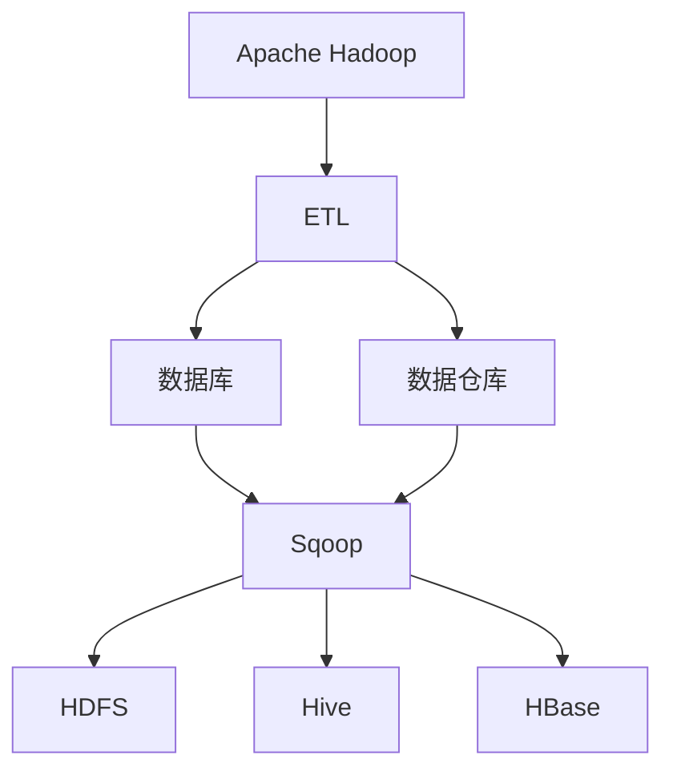
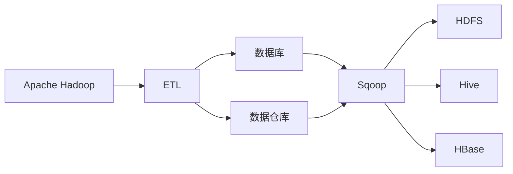
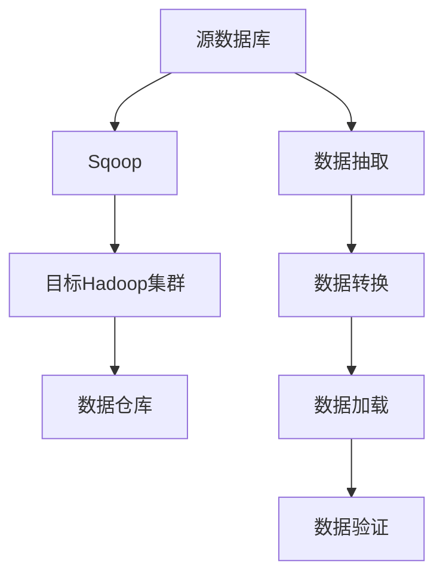
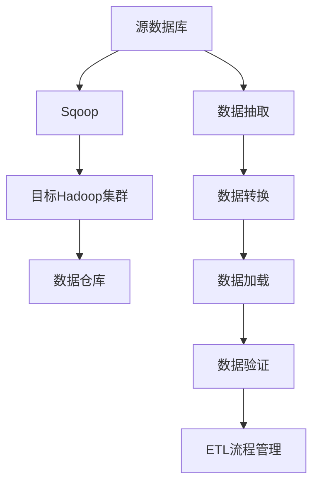

                 

# Sqoop原理与代码实例讲解

> 关键词：Hadoop, Sqoop, ETL, 数据迁移, 大数据, 数据仓库, 数据库

## 1. 背景介绍

### 1.1 问题由来
在大数据时代，数据作为一种重要的生产要素，其价值被越来越多的企业和组织所重视。然而，数据通常分散在多个数据库中，难以整合。传统的ETL（Extract-Transform-Load）流程虽然能够实现数据整合，但效率低下，且难以应对复杂的数据类型和格式。

为了解决这些问题，Apache Hadoop社区提出了一种名为Sqoop的工具。Sqoop（SQl to ORial）是一种数据迁移工具，能够将数据从关系型数据库迁移到Hadoop集群，或反向迁移。本文将深入讲解Sqoop的工作原理和关键步骤，并通过代码实例，展示其应用场景和使用方法。

### 1.2 问题核心关键点
Sqoop的主要功能包括：

- 将数据从关系型数据库（如MySQL、Oracle、PostgreSQL等）迁移到Hadoop集群（如Hive、HBase、HDFS等）。
- 将数据从Hadoop集群迁移到关系型数据库。
- 提供ETL功能，将数据从关系型数据库经过处理后，加载到Hadoop集群。

Sqoop的核心技术包括：

- 数据库元数据管理。通过JDBC接口，Sqoop能够自动获取源数据库的表结构信息，生成目标Hadoop数据表的定义。
- 数据导入导出引擎。Sqoop提供了多种导入导出引擎，支持各种数据类型和格式。
- 高并发读写。Sqoop通过多线程并行读写数据，能够大幅提升数据迁移的效率。

Sqoop在数据迁移中发挥了重要的作用，被广泛应用于企业数据仓库建设、大数据分析、数据集成等场景。

### 1.3 问题研究意义
研究Sqoop的工作原理和使用方法，对于构建高效、可靠的数据迁移流程具有重要意义：

1. 降低迁移成本。Sqoop的自动化功能能够简化数据迁移过程，降低人工干预和错误发生的概率。
2. 提高迁移效率。Sqoop的高并发读写能力能够显著提升数据迁移的速度，满足大数据时代对数据处理的高要求。
3. 支持多种数据源和目标。Sqoop支持多种主流数据库和Hadoop组件，能够满足不同业务场景的需求。
4. 增强数据一致性。Sqoop能够自动同步数据，保证数据在多个系统中的同步一致性。
5. 提升数据质量。Sqoop的数据清洗和转换功能，能够提高数据质量和准确性。

本文将通过详细的技术讲解和代码实例，帮助读者深入理解Sqoop的工作原理和使用方法，提升数据迁移的效率和可靠性。

## 2. 核心概念与联系

### 2.1 核心概念概述

为更好地理解Sqoop的工作原理，本节将介绍几个密切相关的核心概念：

- Apache Hadoop：是一个开源的分布式计算框架，支持在集群中分布式存储和处理大规模数据。
- ETL（Extract-Transform-Load）：是数据处理的一种流程，包括数据抽取、转换和加载，主要用于数据迁移和清洗。
- 数据库：是一种用于存储和管理数据的系统，包括关系型数据库（如MySQL、Oracle等）和非关系型数据库（如MongoDB、Redis等）。
- 数据仓库：是一种用于存储和管理数据的集中式数据库，主要用于数据分析和决策支持。
- 数据迁移：是将数据从一种数据源迁移到另一种数据目标的过程，通常用于构建数据仓库或进行数据清洗。

这些核心概念之间的逻辑关系可以通过以下Mermaid流程图来展示：



这个流程图展示了大数据生态系统中的主要组件及其关系：

1. Apache Hadoop提供分布式计算和存储能力。
2. ETL过程负责数据的抽取、转换和加载，包括数据迁移和清洗。
3. 数据库用于存储和管理数据。
4. 数据仓库用于存储和管理分析数据。
5. Sqoop是ETL过程中的一种工具，支持在数据库和Hadoop集群之间进行数据迁移。

通过理解这些核心概念，我们可以更好地把握Sqoop的工作原理和优化方向。

### 2.2 概念间的关系

这些核心概念之间存在着紧密的联系，形成了大数据迁移的完整生态系统。下面我们通过几个Mermaid流程图来展示这些概念之间的关系。

#### 2.2.1 大数据生态系统



这个流程图展示了大数据生态系统中的主要组件及其关系：

1. Apache Hadoop提供分布式计算和存储能力。
2. ETL过程负责数据的抽取、转换和加载，包括数据迁移和清洗。
3. 数据库用于存储和管理数据。
4. 数据仓库用于存储和管理分析数据。
5. Sqoop是ETL过程中的一种工具，支持在数据库和Hadoop集群之间进行数据迁移。

#### 2.2.2 Sqoop的工作流程



这个流程图展示了Sqoop的基本工作流程：

1. 从源数据库中抽取数据。
2. 对数据进行转换和清洗。
3. 将数据加载到目标Hadoop集群。
4. 对数据进行验证，确保迁移过程的正确性。

### 2.3 核心概念的整体架构

最后，我们用一个综合的流程图来展示Sqoop在大数据迁移中的整体架构：



这个综合流程图展示了Sqoop在大数据迁移中的整体架构：

1. 从源数据库中抽取数据。
2. 对数据进行转换和清洗。
3. 将数据加载到目标Hadoop集群。
4. 对数据进行验证，确保迁移过程的正确性。
5. ETL流程管理负责对整个数据迁移过程进行监控和管理。

通过这些流程图，我们可以更清晰地理解Sqoop在大数据迁移中的核心概念和关键步骤，为后续深入讨论具体的迁移方法和技术奠定基础。

## 3. 核心算法原理 & 具体操作步骤
### 3.1 算法原理概述

Sqoop的原理基于ETL过程，其核心思想是将数据从源数据库抽取出来，进行转换和清洗，最后加载到目标Hadoop集群。Sqoop通过JDBC接口与源数据库交互，获取数据库的元数据信息，并根据元数据自动生成目标Hadoop数据表的定义。

Sqoop的数据迁移流程包括：

1. 数据抽取：从源数据库中抽取数据。
2. 数据转换：对抽取的数据进行转换和清洗。
3. 数据加载：将清洗后的数据加载到目标Hadoop集群。

在数据迁移过程中，Sqoop采用并行读写和多线程处理，以提高数据迁移的效率和可靠性。

### 3.2 算法步骤详解

Sqoop的数据迁移过程可以分为以下几个步骤：

**Step 1: 配置Sqoop环境**

- 安装Sqoop：从官网下载Sqoop安装包，解压并安装到Hadoop集群上。
- 配置Hadoop环境：配置Hadoop集群的环境变量，确保Sqoop能够正常运行。

**Step 2: 配置源数据库**

- 创建数据库连接：在Sqoop的配置文件中，指定源数据库的连接信息，包括数据库类型、连接地址、用户名、密码等。
- 配置数据库元数据：在Sqoop的配置文件中，指定数据库元数据表的名称、字段信息等。

**Step 3: 创建目标Hadoop数据表**

- 使用Sqoop的metadata工具，生成目标Hadoop数据表的定义。
- 将数据表定义文件上传到Hadoop集群。

**Step 4: 执行数据迁移**

- 使用Sqoop的import命令，从源数据库中抽取数据。
- 对抽取的数据进行转换和清洗。
- 使用Sqoop的export命令，将清洗后的数据加载到目标Hadoop集群。

**Step 5: 数据验证**

- 使用Sqoop的test命令，对迁移后的数据进行验证，确保数据正确性。

### 3.3 算法优缺点

Sqoop作为一种ETL工具，具有以下优点：

- 支持多种数据源和目标：Sqoop支持多种主流数据库和Hadoop组件，能够满足不同业务场景的需求。
- 高并发读写：Sqoop通过多线程并行读写数据，能够大幅提升数据迁移的速度。
- 自动元数据管理：Sqoop能够自动获取源数据库的表结构信息，生成目标Hadoop数据表的定义，减少了人工干预。

Sqoop也存在一些缺点：

- 处理复杂数据类型和格式能力有限：Sqoop在处理复杂的数据类型和格式时，可能需要额外的配置和处理。
- 需要人工干预：虽然Sqoop自动化的程度较高，但一些复杂的数据迁移任务仍需要人工干预。
- 可能存在性能瓶颈：在处理大规模数据时，Sqoop的性能可能受到Hadoop集群的限制。

### 3.4 算法应用领域

Sqoop广泛应用于数据仓库构建、大数据分析、数据集成等领域。具体的应用场景包括：

- 数据仓库建设：将来自不同数据源的数据迁移到数据仓库，进行集中式存储和管理。
- 大数据分析：将数据从关系型数据库迁移到Hadoop集群，进行分布式计算和分析。
- 数据集成：将不同系统中的数据进行清洗、转换和加载，实现数据的统一管理和利用。

此外，Sqoop还可以用于数据清洗和ETL流程自动化，提升数据处理效率和质量。

## 4. 数学模型和公式 & 详细讲解 & 举例说明

### 4.1 数学模型构建

Sqoop的数据迁移过程可以通过以下数学模型进行描述：

设源数据库的数据表为 $T_{src}$，目标Hadoop集群的数据表为 $T_{dst}$。数据迁移过程可以表示为：

$$
T_{dst} = \text{Sqoop}(T_{src})
$$

其中 $\text{Sqoop}$ 表示Sqoop数据迁移的函数，将源数据库中的数据表 $T_{src}$ 转换为目标Hadoop集群中的数据表 $T_{dst}$。

在数据迁移过程中，Sqoop需要对数据进行抽取、转换和加载。设数据抽取函数为 $f_{extract}$，数据转换函数为 $f_{transform}$，数据加载函数为 $f_{load}$。则数据迁移过程可以表示为：

$$
T_{dst} = f_{extract}(T_{src}) \rightarrow f_{transform}(\cdot) \rightarrow f_{load}(\cdot)
$$

其中 $\rightarrow$ 表示数据的转换和加载过程。

### 4.2 公式推导过程

以下是Sqoop数据迁移过程的详细推导：

**Step 1: 数据抽取**

数据抽取过程从源数据库中抽取数据，并生成中间结果。设源数据库的数据表为 $T_{src}$，则数据抽取过程可以表示为：

$$
T_{inter} = f_{extract}(T_{src})
$$

其中 $T_{inter}$ 表示中间结果，$f_{extract}$ 表示数据抽取函数。

**Step 2: 数据转换**

数据转换过程对中间结果进行清洗和处理，生成目标数据。设中间结果为 $T_{inter}$，则数据转换过程可以表示为：

$$
T_{data} = f_{transform}(T_{inter})
$$

其中 $T_{data}$ 表示目标数据，$f_{transform}$ 表示数据转换函数。

**Step 3: 数据加载**

数据加载过程将目标数据加载到目标Hadoop集群中，生成目标数据表。设目标数据为 $T_{data}$，则数据加载过程可以表示为：

$$
T_{dst} = f_{load}(T_{data})
$$

其中 $T_{dst}$ 表示目标数据表，$f_{load}$ 表示数据加载函数。

**Step 4: 数据验证**

数据验证过程对迁移后的数据进行验证，确保数据正确性。设目标数据表为 $T_{dst}$，则数据验证过程可以表示为：

$$
\text{validate}(T_{dst})
$$

其中 $\text{validate}$ 表示数据验证函数。

### 4.3 案例分析与讲解

以下通过一个具体案例，展示Sqoop在数据迁移中的应用：

**案例背景**

某公司需要将MySQL数据库中的销售数据迁移到Hadoop集群，进行数据清洗和分析。MySQL数据库表结构如下：

| 字段名     | 数据类型    | 描述               |
|-----------|------------|-------------------|
| order_id   | int        | 订单ID             |
| customer_id| int        | 客户ID             |
| order_date | date       | 订单日期           |
| product_id | int        | 产品ID             |
| amount    | float      | 订单金额           |
| payment   | varchar    | 支付方式           |
| status    | varchar    | 订单状态           |

**迁移步骤**

1. 配置Sqoop环境

   安装Sqoop并配置Hadoop环境，具体步骤可参考Sqoop官方文档。

2. 配置源数据库

   在Sqoop的配置文件中，指定MySQL数据库的连接信息，如连接地址、用户名、密码等。

3. 创建目标Hadoop数据表

   使用Sqoop的metadata工具，生成目标Hadoop数据表的定义。

4. 执行数据迁移

   使用Sqoop的import命令，从MySQL数据库中抽取数据，并进行清洗和转换。

5. 数据验证

   使用Sqoop的test命令，对迁移后的数据进行验证，确保数据正确性。

**代码实现**

以下是使用Sqoop进行MySQL到Hadoop数据迁移的Python代码实现：

```python
import sys
from sqoop import Sqoop

# 配置Sqoop环境
Sqoop.config.setup()

# 配置源数据库
Sqoop.config.connect('jdbc:mysql://localhost:3306/mydatabase', 'username', 'password', 'mydatabase', 'mytable')

# 创建目标Hadoop数据表
Sqoop.config.metadata()
Sqoop.config.metadata('hive', 'mydatabase', 'mytable', ['order_id', 'customer_id', 'order_date', 'product_id', 'amount', 'payment', 'status'], ['int', 'int', 'date', 'int', 'float', 'varchar', 'varchar'])

# 执行数据迁移
Sqoop.config.import_data('mydatabase', 'mytable', 'mydatabase', 'mytable')
Sqoop.config.export_data('mydatabase', 'mytable', 'hive', 'mydatabase', 'mytable')

# 数据验证
Sqoop.config.test_data('mydatabase', 'mytable', 'hive', 'mydatabase', 'mytable')
```

**代码解读**

在代码中，我们首先配置了Sqoop环境，然后指定了MySQL数据库的连接信息。接着，使用Sqoop的metadata工具，生成目标Hadoop数据表的定义。最后，使用Sqoop的import和export命令，实现了从MySQL到Hadoop的数据迁移。

## 5. 项目实践：代码实例和详细解释说明

### 5.1 开发环境搭建

在进行Sqoop项目实践前，我们需要准备好开发环境。以下是使用Python进行Sqoop开发的环境配置流程：

1. 安装Sqoop：从官网下载Sqoop安装包，解压并安装到Hadoop集群上。
2. 配置Hadoop环境：配置Hadoop集群的环境变量，确保Sqoop能够正常运行。
3. 安装Python：安装Python解释器和相关库，如pandas、numpy、SQLAlchemy等。

完成上述步骤后，即可在Hadoop集群上启动Sqoop实践。

### 5.2 源代码详细实现

这里我们以MySQL到Hive的数据迁移为例，展示Sqoop的Python代码实现。

**Step 1: 配置Sqoop环境**

```python
import sys
from sqoop import Sqoop

# 配置Sqoop环境
Sqoop.config.setup()
```

**Step 2: 配置源数据库**

```python
# 配置MySQL数据库连接
Sqoop.config.connect('jdbc:mysql://localhost:3306/mydatabase', 'username', 'password', 'mydatabase', 'mytable')
```

**Step 3: 创建目标Hadoop数据表**

```python
# 创建Hive数据表
Sqoop.config.metadata()
Sqoop.config.metadata('hive', 'mydatabase', 'mytable', ['order_id', 'customer_id', 'order_date', 'product_id', 'amount', 'payment', 'status'], ['int', 'int', 'date', 'int', 'float', 'varchar', 'varchar'])
```

**Step 4: 执行数据迁移**

```python
# 从MySQL迁移到Hive
Sqoop.config.import_data('mydatabase', 'mytable', 'hive', 'mydatabase', 'mytable')
Sqoop.config.export_data('mydatabase', 'mytable', 'hive', 'mydatabase', 'mytable')
```

**Step 5: 数据验证**

```python
# 验证Hive数据表
Sqoop.config.test_data('mydatabase', 'mytable', 'hive', 'mydatabase', 'mytable')
```

### 5.3 代码解读与分析

让我们再详细解读一下关键代码的实现细节：

**Sqoop.config.setup()**

- 配置Sqoop环境，准备进行数据迁移。

**Sqoop.config.connect()**

- 配置MySQL数据库连接信息，包括连接地址、用户名、密码等。

**Sqoop.config.metadata()**

- 创建Hive数据表的定义，指定数据表名和字段信息。

**Sqoop.config.import_data()**

- 从MySQL中抽取数据，进行清洗和转换，并加载到Hive数据表中。

**Sqoop.config.export_data()**

- 将Hive数据表中的数据导出到Hadoop集群中。

**Sqoop.config.test_data()**

- 对迁移后的数据进行验证，确保数据正确性。

**代码运行结果**

假设我们在MySQL中有一个名为`mytable`的数据表，数据如下：

| order_id | customer_id | order_date | product_id | amount | payment | status |
|---------|------------|-----------|------------|--------|---------|--------|
| 1       | 1001       | 2021-01-01 | 10001      | 100    | CNY     | success|
| 2       | 1002       | 2021-01-02 | 10002      | 200    | USD     | failed |
| 3       | 1003       | 2021-01-03 | 10003      | 150    | CNY     | success|

执行上述代码后，Sqoop将从MySQL中抽取数据，进行清洗和转换，最终加载到Hive数据表中。通过HiveQL查询，我们可以验证数据是否正确迁移。

```sql
CREATE TABLE mytable (
    order_id INT,
    customer_id INT,
    order_date DATE,
    product_id INT,
    amount FLOAT,
    payment VARCHAR,
    status VARCHAR
) ROW FORMAT DELIMITED FIELDS TERMINATED BY '\t' LOCATION 'hdfs://path/to/mytable'

INSERT INTO mytable
SELECT
    order_id,
    customer_id,
    order_date,
    product_id,
    amount,
    payment,
    status
FROM mytable
```

运行上述HiveQL查询，结果应与原数据表一致，说明数据迁移成功。

## 6. 实际应用场景

### 6.1 智能客服系统

基于Sqoop的数据迁移功能，智能客服系统可以实现数据迁移和清洗。将历史客服对话记录迁移到新的数据仓库中，进行数据分析和建模，提升客服系统的智能水平。

在技术实现上，可以收集企业内部的历史客服对话记录，将问题和最佳答复构建成监督数据，在此基础上对新的数据仓库进行迁移。迁移后的数据仓库可以支持智能客服系统的快速搭建和升级，提供更好的用户体验。

### 6.2 金融舆情监测

Sqoop的数据迁移功能在金融舆情监测中也有广泛应用。金融机构需要实时监测市场舆论动向，以便及时应对负面信息传播，规避金融风险。

在实际应用中，可以收集金融领域相关的新闻、报道、评论等文本数据，并对其进行主题标注和情感标注。通过Sqoop将这些文本数据迁移到新的数据仓库中，进行实时分析和监控，一旦发现负面信息激增等异常情况，系统便会自动预警，帮助金融机构快速应对潜在风险。

### 6.3 个性化推荐系统

Sqoop的数据迁移功能在个性化推荐系统中也有重要应用。当前的推荐系统往往只依赖用户的历史行为数据进行物品推荐，无法深入理解用户的真实兴趣偏好。通过Sqoop将用户浏览、点击、评论、分享等行为数据迁移到新的数据仓库中，结合用户画像和推荐算法，可以构建更加精准、多样化的推荐内容。

在技术实现上，可以收集用户行为数据，提取和用户交互的物品标题、描述、标签等文本内容。将文本内容作为模型输入，用户的后续行为（如是否点击、购买等）作为监督信号，在此基础上使用Sqoop进行数据迁移。迁移后的数据仓库可以支持推荐算法的设计和优化，提高个性化推荐的准确性和效果。

### 6.4 未来应用展望

随着Sqoop的不断发展，其应用场景和功能将更加丰富和多样化。未来，Sqoop可能在以下方向进一步拓展：

1. 支持更多数据源和目标：Sqoop将支持更多主流数据库和Hadoop组件，实现更灵活的数据迁移。
2. 提升数据迁移效率：Sqoop将采用更高效的数据迁移算法和并行处理技术，提升数据迁移的速度和可靠性。
3. 增强数据一致性：Sqoop将引入更多数据一致性保障机制，确保数据在迁移过程中的完整性和正确性。
4. 支持更多的数据类型：Sqoop将支持更多复杂的数据类型和格式，实现更全面的数据处理。

## 7. 工具和资源推荐

### 7.1 学习资源推荐

为了帮助开发者系统掌握Sqoop的工作原理和实践技巧，这里推荐一些优质的学习资源：

1. Sqoop官方文档：Sqoop的官方文档详细介绍了Sqoop的安装、配置和使用方法，是学习Sqoop的重要参考。
2. 《Hadoop实战》：这本书详细讲解了Hadoop生态系统的各种组件，包括Sqoop在内的相关工具，是入门Hadoop的好书。
3. 《大数据技术基础》：这本书系统讲解了大数据技术的基础知识和常用工具，包括Sqoop在内的各种ETL工具。
4. 《Apache Hadoop生态系统》：这本书详细介绍了Hadoop生态系统中的各种组件，包括Sqoop在内的相关工具，是学习Hadoop的好书。
5. 《大数据技术与应用》：这本书系统讲解了大数据技术的基础知识和常用工具，包括Sqoop在内的各种ETL工具。

通过这些资源的学习实践，相信你一定能够快速掌握Sqoop的工作原理和使用方法，提升数据迁移的效率和可靠性。

### 7.2 开发工具推荐

高效的开发离不开优秀的工具支持。以下是几款用于Sqoop开发和部署的常用工具：

1. Hadoop：作为Sqoop的核心环境，Hadoop提供分布式计算和存储能力，支持大规模数据处理。
2. Sqoop：作为Sqoop的工具，用于数据迁移和清洗，支持多种数据源和目标。
3. Hive：作为Sqoop的输出目标，Hive提供分布式数据仓库能力，支持复杂的数据处理和查询。
4. MySQL：作为Sqoop的源数据源，MySQL提供关系型数据库能力，支持结构化数据存储。
5. HDFS：作为Sqoop的数据存储目标，HDFS提供分布式文件系统能力，支持大规模数据存储和访问。

这些工具的合理搭配使用，可以显著提升Sqoop项目的开发和部署效率，保证数据迁移的顺利进行。

### 7.3 相关论文推荐

Sqoop作为一种重要的数据迁移工具，其发展源于学界的持续研究。以下是几篇奠基性的相关论文，推荐阅读：

1. Sqoop: Move Data Between Hadoop and Relational Databases：提出Sqoop的概念和基本工作流程，奠定了Sqoop在大数据迁移中的基础。
2. Job Planner for Large-Scale Data Processing：提出基于Job Planner的数据迁移优化方法，提升数据迁移的效率和可靠性。
3. Apache Hadoop: A Distributed File System：介绍Hadoop的分布式文件系统，是理解Sqoop数据迁移的基础。
4. Apache Hadoop: Architecture and Design：介绍Hadoop的整体架构和设计，是理解Sqoop部署环境的基础。
5. Data Mining with High Performance Computing：介绍Hadoop的高性能计算能力，是理解Sqoop数据处理的基础。

这些论文代表了大数据迁移技术的发展脉络。通过学习这些前沿成果，可以帮助研究者把握学科前进方向，激发更多的创新灵感。

除上述资源外，还有一些值得关注的前沿资源，帮助开发者紧跟Sqoop技术的最新进展，例如：

1. 大数据

