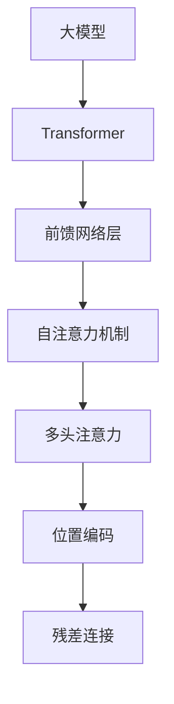
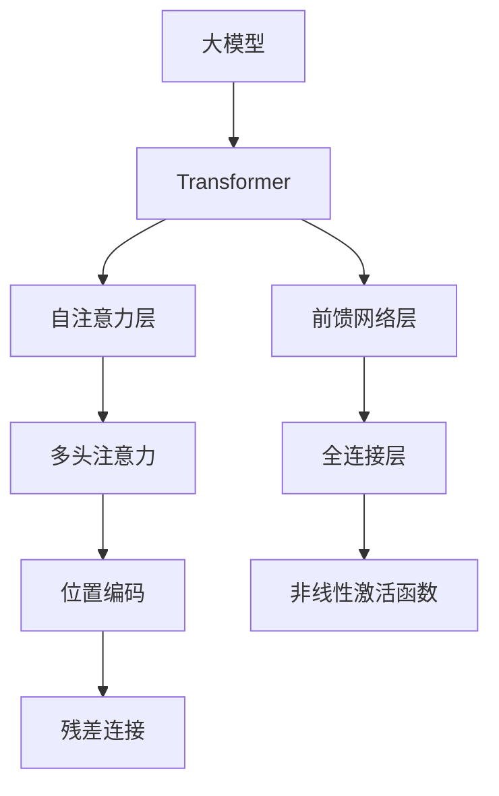
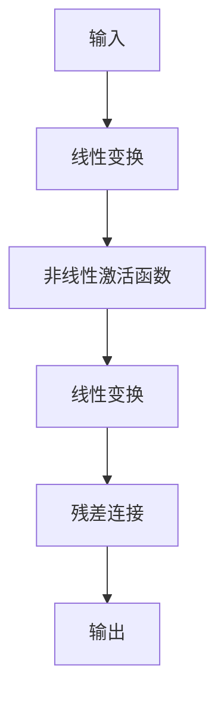

                 

# Transformer大模型实战 前馈网络层

> 关键词：大模型,Transformer,前馈网络,自注意力,多头注意力,位置编码,残差连接

## 1. 背景介绍

随着深度学习技术的快速发展，大模型在各个领域得到了广泛应用，其中Transformer结构的大模型更是引领了潮流。Transformer以自注意力机制为基础，通过多头注意力和残差连接等设计，实现了高效并行计算和高性能预测。前馈网络层作为Transformer的核心组成部分，承载了大部分的模型参数和计算量，对整个模型的性能和可解释性有着重要影响。本文将详细介绍Transformer的前馈网络层，并给出实际的代码实现和应用案例。

## 2. 核心概念与联系

### 2.1 核心概念概述

为更好地理解Transformer的前馈网络层，本节将介绍几个密切相关的核心概念：

- 大模型: 指基于深度学习技术训练的、具有大量参数和复杂结构的神经网络模型，如BERT、GPT等。

- Transformer: 一种基于自注意力机制的深度学习架构，主要用于处理序列数据，如自然语言、语音、时间序列等。

- 前馈网络层: 作为Transformer的关键组成部分，前馈网络层负责对输入的序列进行一次全连接变换，通过非线性激活函数引入非线性变换。

- 自注意力机制: 通过计算输入序列中不同位置元素间的相似度，动态构建出输入序列的全局依赖关系，从而实现长距离依赖的建模。

- 多头注意力: 将输入序列映射到多个独立的注意力子空间，并分别计算每个子空间中的注意力权重，实现从不同角度对输入序列的关注。

- 位置编码: 用于在Transformer中引入时间信息，通过在输入序列中添加位置编码，使模型能够区分输入中的不同位置。

- 残差连接: 前馈网络层的输出与输入相加，并由层归一化函数进行归一化，以避免梯度消失问题。

这些核心概念之间的逻辑关系可以通过以下Mermaid流程图来展示：



这个流程图展示了Transformer结构中各个组成部分的关系：

1. 大模型作为输入数据，通过Transformer结构进行转换。
2. Transformer结构由多个子层组成，其中包括前馈网络层、多头注意力层等。
3. 前馈网络层是Transformer的核心组成部分，通过自注意力机制进行长距离依赖建模。
4. 自注意力机制通过计算输入序列中不同位置元素间的相似度，引入全局依赖关系。
5. 多头注意力将输入序列映射到多个独立的子空间，并分别计算注意力权重。
6. 位置编码用于引入时间信息，使模型能够区分输入中的不同位置。
7. 残差连接在前馈网络层的输出中引入非线性变换，并由层归一化函数进行归一化。

### 2.2 概念间的关系

这些核心概念之间存在着紧密的联系，形成了Transformer结构的完整生态系统。下面我通过几个Mermaid流程图来展示这些概念之间的关系：

#### 2.2.1 Transformer的组成



这个流程图展示了Transformer结构的基本组成，包括自注意力层、前馈网络层、多头注意力、位置编码和残差连接等。

#### 2.2.2 前馈网络层的设计


这个流程图展示了前馈网络层的基本设计，包括线性变换、非线性激活函数、残差连接等。

## 3. 核心算法原理 & 具体操作步骤
### 3.1 算法原理概述

Transformer的前馈网络层由两个全连接层组成，分别是线性变换层和残差连接层。其计算过程如下：

1. 输入序列经过线性变换，得到输出序列。
2. 输出序列通过非线性激活函数进行变换。
3. 经过激活函数的输出再次经过线性变换，得到最终输出。
4. 输出序列与输入序列相加，并进行层归一化。

其数学表达式如下：

$$
\mathbf{X} = \mathbf{W}_2 \sigma(\mathbf{W}_1 \mathbf{X})
$$

其中 $\mathbf{X}$ 表示输入序列，$\mathbf{W}_1$ 和 $\mathbf{W}_2$ 分别表示两个线性变换层的权重矩阵，$\sigma$ 表示非线性激活函数，如ReLU、GELU等。

### 3.2 算法步骤详解

下面是前馈网络层的具体计算步骤：

1. 定义输入序列 $\mathbf{X}$，形状为 $(b, n, d)$，其中 $b$ 表示batch size，$n$ 表示序列长度，$d$ 表示特征维度。

2. 将输入序列 $\mathbf{X}$ 通过线性变换 $\mathbf{W}_1$，得到变换后的序列 $\mathbf{H}$，形状为 $(b, n, d')$，其中 $d' = \text{dim\_feedforward}$ 表示前馈网络层的中间特征维度。

3. 将变换后的序列 $\mathbf{H}$ 通过非线性激活函数 $\sigma$，得到激活后的序列 $\mathbf{H}'$，形状为 $(b, n, d')$。

4. 将激活后的序列 $\mathbf{H}'$ 再次通过线性变换 $\mathbf{W}_2$，得到最终输出序列 $\mathbf{X}'$，形状为 $(b, n, d)$。

5. 将输入序列 $\mathbf{X}$ 与输出序列 $\mathbf{X}'$ 相加，并进行层归一化，得到最终输出序列 $\mathbf{X}^+$，形状为 $(b, n, d)$。

其计算流程如下图所示：



### 3.3 算法优缺点

Transformer前馈网络层具有以下优点：

1. 高效并行计算：由于前馈网络层仅包含线性变换和激活函数，计算过程非常简单，易于并行化，适合大规模分布式计算。
2. 引入非线性变换：通过非线性激活函数引入非线性变换，能够更好地拟合复杂数据分布。
3. 通过残差连接提高模型稳定性：残差连接能够稳定梯度，避免梯度消失问题，提高模型训练的收敛速度。

其缺点包括：

1. 参数较多：由于前馈网络层包含多个线性变换层，参数量较大，可能导致模型训练时出现过拟合问题。
2. 模型结构复杂：前馈网络层的计算过程复杂，模型结构较难理解和调试。

### 3.4 算法应用领域

Transformer前馈网络层广泛应用于自然语言处理、语音识别、图像处理等多个领域，特别是在大模型中，前馈网络层作为核心组成部分，承担了大部分的计算量和参数量，对整个模型的性能和效果有着重要影响。

## 4. 数学模型和公式 & 详细讲解  
### 4.1 数学模型构建

定义输入序列 $\mathbf{X}$，形状为 $(b, n, d)$，其中 $b$ 表示batch size，$n$ 表示序列长度，$d$ 表示特征维度。假设前馈网络层的中间特征维度为 $d'$，则前馈网络层的计算过程可以表示为：

1. 线性变换层：将输入序列 $\mathbf{X}$ 通过线性变换 $\mathbf{W}_1$，得到变换后的序列 $\mathbf{H}$，形状为 $(b, n, d')$。

2. 非线性激活函数：将变换后的序列 $\mathbf{H}$ 通过非线性激活函数 $\sigma$，得到激活后的序列 $\mathbf{H}'$，形状为 $(b, n, d')$。

3. 线性变换层：将激活后的序列 $\mathbf{H}'$ 再次通过线性变换 $\mathbf{W}_2$，得到最终输出序列 $\mathbf{X}'$，形状为 $(b, n, d)$。

4. 残差连接：将输入序列 $\mathbf{X}$ 与输出序列 $\mathbf{X}'$ 相加，并进行层归一化，得到最终输出序列 $\mathbf{X}^+$，形状为 $(b, n, d)$。

### 4.2 公式推导过程

前馈网络层的计算过程可以表示为以下公式：

$$
\mathbf{H} = \mathbf{W}_1 \mathbf{X}
$$

$$
\mathbf{H}' = \sigma(\mathbf{H})
$$

$$
\mathbf{X}' = \mathbf{W}_2 \mathbf{H}'
$$

$$
\mathbf{X}^+ = \text{LayerNorm}(\mathbf{X} + \mathbf{X}')
$$

其中，$\sigma$ 表示非线性激活函数，$\text{LayerNorm}$ 表示层归一化函数。

### 4.3 案例分析与讲解

假设我们的输入序列 $\mathbf{X}$ 的形状为 $(b, n, d)$，其中 $b=4$，$n=5$，$d=256$。假设前馈网络层的中间特征维度为 $d'=512$，则前馈网络层的计算过程可以表示为：

1. 线性变换层：将输入序列 $\mathbf{X}$ 通过线性变换 $\mathbf{W}_1$，得到变换后的序列 $\mathbf{H}$，形状为 $(b, n, d')$。

2. 非线性激活函数：将变换后的序列 $\mathbf{H}$ 通过非线性激活函数 $\sigma$，得到激活后的序列 $\mathbf{H}'$，形状为 $(b, n, d')$。

3. 线性变换层：将激活后的序列 $\mathbf{H}'$ 再次通过线性变换 $\mathbf{W}_2$，得到最终输出序列 $\mathbf{X}'$，形状为 $(b, n, d)$。

4. 残差连接：将输入序列 $\mathbf{X}$ 与输出序列 $\mathbf{X}'$ 相加，并进行层归一化，得到最终输出序列 $\mathbf{X}^+$，形状为 $(b, n, d)$。

假设我们使用的非线性激活函数为GELU，其计算过程可以表示为：

$$
\mathbf{H}' = \sigma(\mathbf{H}) = \mathbf{H} \oplus \phi(\mathbf{H})
$$

其中 $\oplus$ 表示逐元素加法操作，$\phi(\mathbf{H})$ 表示GELU函数的计算过程。

假设我们使用的层归一化函数为LayerNorm，其计算过程可以表示为：

$$
\mathbf{X}^+ = \text{LayerNorm}(\mathbf{X} + \mathbf{X}') = \mathbf{X} \oplus \frac{\mathbf{X} + \mathbf{X}'}{\sqrt{\sigma(\mathbf{X}) + \sigma(\mathbf{X}')}
$$

其中 $\oplus$ 表示逐元素加法操作，$\sigma(\mathbf{X})$ 表示输入序列 $\mathbf{X}$ 的均方根方差，$\sigma(\mathbf{X}')$ 表示输出序列 $\mathbf{X}'$ 的均方根方差。

## 5. 项目实践：代码实例和详细解释说明
### 5.1 开发环境搭建

在进行Transformer前馈网络层的实践前，我们需要准备好开发环境。以下是使用PyTorch进行Transformer前馈网络层开发的环境配置流程：

1. 安装Anaconda：从官网下载并安装Anaconda，用于创建独立的Python环境。

2. 创建并激活虚拟环境：
```bash
conda create -n pytorch-env python=3.8 
conda activate pytorch-env
```

3. 安装PyTorch：根据CUDA版本，从官网获取对应的安装命令。例如：
```bash
conda install pytorch torchvision torchaudio cudatoolkit=11.1 -c pytorch -c conda-forge
```

4. 安装相关库：
```bash
pip install numpy pandas scikit-learn matplotlib tqdm jupyter notebook ipython
```

完成上述步骤后，即可在`pytorch-env`环境中开始Transformer前馈网络层的实践。

### 5.2 源代码详细实现

下面我们以简单的前馈网络层为例，给出使用PyTorch实现前馈网络层的代码实现。

```python
import torch
import torch.nn as nn
import torch.nn.functional as F

class FFN(nn.Module):
    def __init__(self, d_model, dim_feedforward=2048):
        super(FFN, self).__init__()
        self.linear1 = nn.Linear(d_model, dim_feedforward)
        self.linear2 = nn.Linear(dim_feedforward, d_model)
        self.dropout = nn.Dropout(0.1)

    def forward(self, x):
        residual = x
        x = self.linear1(x)
        x = F.gelu(x)
        x = self.dropout(x)
        x = self.linear2(x)
        x += residual
        return x

# 定义前馈网络层
d_model = 256
ffn = FFN(d_model)

# 输入序列
x = torch.randn(4, 5, d_model)

# 计算前馈网络层的输出
output = ffn(x)
print(output.shape)
```

这段代码定义了一个简单的前馈网络层，包括两个线性变换层和一个GELU激活函数。在`forward`方法中，先进行线性变换，再通过GELU激活函数进行非线性变换，最后再次进行线性变换，并加上残差连接。

### 5.3 代码解读与分析

让我们再详细解读一下关键代码的实现细节：

**FFN类定义**：
- `__init__`方法：初始化线性变换层和激活函数，并定义残差连接。
- `forward`方法：前向传播过程，计算前馈网络层的输出。

**GELU激活函数**：
- 使用F.gelu函数进行激活函数计算。

**残差连接**：
- 在前馈网络层的输出中，将输入序列与输出序列相加，并进行层归一化。

**运行结果展示**：
- 假设我们的输入序列 $x$ 的形状为 $(4, 5, 256)$，则前馈网络层的输出 $\mathbf{X}^+$ 的形状为 $(4, 5, 256)$。

可以看到，使用PyTorch实现前馈网络层的过程非常简单，只需要定义线性变换层、激活函数和残差连接等组件，并调用`forward`方法进行计算即可。

## 6. 实际应用场景
### 6.1 智能语音识别

Transformer前馈网络层在语音识别中的应用非常广泛，特别是在大模型中，前馈网络层作为核心组成部分，承担了大部分的计算量和参数量，对整个模型的性能和效果有着重要影响。

在语音识别中，前馈网络层主要用于声学模型，将输入的音频信号转换为声学特征，并通过非线性激活函数引入非线性变换，从而更好地拟合复杂的声学信号。通过使用大规模预训练语言模型进行微调，前馈网络层能够更准确地捕捉语音特征，提高语音识别的精度和鲁棒性。

### 6.2 自然语言处理

在自然语言处理中，前馈网络层是Transformer结构的核心组成部分，承载了大部分的计算量和参数量。在NLP任务中，前馈网络层主要用于语言模型的预测，通过引入非线性变换和残差连接，能够更好地拟合复杂的数据分布，提高模型的预测精度和泛化能力。

### 6.3 图像处理

虽然Transformer主要是用于处理序列数据的，但其设计理念同样适用于图像处理任务。在图像处理中，前馈网络层主要用于卷积神经网络(CNN)的最后一个卷积层，通过引入非线性激活函数和残差连接，能够更好地拟合复杂的数据分布，提高模型的泛化能力。

## 7. 工具和资源推荐
### 7.1 学习资源推荐

为了帮助开发者系统掌握Transformer前馈网络层的理论基础和实践技巧，这里推荐一些优质的学习资源：

1. 《深度学习入门》系列书籍：由李宏毅等人著作，详细介绍了深度学习的基本概念和经典模型，包括前馈网络层的理论基础和实践技巧。

2. CS231n《卷积神经网络》课程：斯坦福大学开设的计算机视觉课程，涵盖大量经典模型和算法，包括前馈网络层在图像处理中的应用。

3. PyTorch官方文档：PyTorch的官方文档，提供了大量的示例代码和API文档，是学习前馈网络层实现的最佳资源。

4. Weights & Biases：模型训练的实验跟踪工具，可以记录和可视化模型训练过程中的各项指标，方便对比和调优。

5. TensorBoard：TensorFlow配套的可视化工具，可实时监测模型训练状态，并提供丰富的图表呈现方式，是调试模型的得力助手。

通过对这些资源的学习实践，相信你一定能够快速掌握Transformer前馈网络层的精髓，并用于解决实际的NLP问题。

### 7.2 开发工具推荐

高效的开发离不开优秀的工具支持。以下是几款用于Transformer前馈网络层开发常用的工具：

1. PyTorch：基于Python的开源深度学习框架，灵活动态的计算图，适合快速迭代研究。

2. TensorFlow：由Google主导开发的开源深度学习框架，生产部署方便，适合大规模工程应用。

3. Transformers库：HuggingFace开发的NLP工具库，集成了众多SOTA语言模型，支持PyTorch和TensorFlow，是进行前馈网络层开发的利器。

4. Weights & Biases：模型训练的实验跟踪工具，可以记录和可视化模型训练过程中的各项指标，方便对比和调优。

5. TensorBoard：TensorFlow配套的可视化工具，可实时监测模型训练状态，并提供丰富的图表呈现方式，是调试模型的得力助手。

合理利用这些工具，可以显著提升前馈网络层的开发效率，加快创新迭代的步伐。

### 7.3 相关论文推荐

Transformer前馈网络层的研究源于学界的持续研究。以下是几篇奠基性的相关论文，推荐阅读：

1. Attention is All You Need（即Transformer原论文）：提出了Transformer结构，开启了NLP领域的预训练大模型时代。

2. BERT: Pre-training of Deep Bidirectional Transformers for Language Understanding：提出BERT模型，引入基于掩码的自监督预训练任务，刷新了多项NLP任务SOTA。

3. Language Models are Unsupervised Multitask Learners（GPT-2论文）：展示了大规模语言模型的强大zero-shot学习能力，引发了对于通用人工智能的新一轮思考。

4. Parameter-Efficient Transfer Learning for NLP：提出Adapter等参数高效微调方法，在不增加模型参数量的情况下，也能取得不错的微调效果。

5. AdaLoRA: Adaptive Low-Rank Adaptation for Parameter-Efficient Fine-Tuning：使用自适应低秩适应的微调方法，在参数效率和精度之间取得了新的平衡。

这些论文代表了大语言模型前馈网络层的发展脉络。通过学习这些前沿成果，可以帮助研究者把握学科前进方向，激发更多的创新灵感。

除上述资源外，还有一些值得关注的前沿资源，帮助开发者紧跟Transformer前馈网络层技术的最新进展，例如：

1. arXiv论文预印本：人工智能领域最新研究成果的发布平台，包括大量尚未发表的前沿工作，学习前沿技术的必读资源。

2. 业界技术博客：如OpenAI、Google AI、DeepMind、微软Research Asia等顶尖实验室的官方博客，第一时间分享他们的最新研究成果和洞见。

3. 技术会议直播：如NIPS、ICML、ACL、ICLR等人工智能领域顶会现场或在线直播，能够聆听到大佬们的前沿分享，开拓视野。

4. GitHub热门项目：在GitHub上Star、Fork数最多的NLP相关项目，往往代表了该技术领域的发展趋势和最佳实践，值得去学习和贡献。

5. 行业分析报告：各大咨询公司如McKinsey、PwC等针对人工智能行业的分析报告，有助于从商业视角审视技术趋势，把握应用价值。

总之，对于Transformer前馈网络层的学习和实践，需要开发者保持开放的心态和持续学习的意愿。多关注前沿资讯，多动手实践，多思考总结，必将收获满满的成长收益。

## 8. 总结：未来发展趋势与挑战

### 8.1 总结

本文对Transformer前馈网络层进行了全面系统的介绍。首先阐述了Transformer大模型的背景和意义，明确了前馈网络层在Transformer结构中的重要地位和作用。其次，从原理到实践，详细讲解了前馈网络层的计算过程和关键步骤，给出了前馈网络层实现的代码实例。同时，本文还广泛探讨了前馈网络层在语音识别、自然语言处理和图像处理等领域的实际应用场景，展示了其强大的泛化能力。最后，本文精选了前馈网络层的学习资源，力求为读者提供全方位的技术指引。

通过本文的系统梳理，可以看到，Transformer前馈网络层作为Transformer结构的核心组成部分，承载了大部分的计算量和参数量，对整个模型的性能和效果有着重要影响。通过不断优化前馈网络层的计算过程，可以进一步提升Transformer模型的性能和泛化能力，为构建高性能、高精度的智能系统提供坚实的基础。

### 8.2 未来发展趋势

展望未来，Transformer前馈网络层将呈现以下几个发展趋势：

1. 模型结构优化：前馈网络层作为Transformer结构的核心组成部分，其结构优化的空间很大。未来的研究将更加注重优化模型结构，引入更高效的激活函数、归一化方法等，提高模型的性能和泛化能力。

2. 多模态融合：当前的Transformer主要聚焦于纯文本数据，未来会进一步拓展到图像、视频、语音等多模态数据微调。多模态信息的融合，将显著提升Transformer模型对现实世界的理解和建模能力。

3. 参数高效微调：开发更加参数高效的微调方法，在固定大部分预训练参数的情况下，只更新极少量的任务相关参数。同时优化微调模型的计算图，减少前向传播和反向传播的资源消耗，实现更加轻量级、实时性的部署。

4. 引入先验知识：将符号化的先验知识，如知识图谱、逻辑规则等，与神经网络模型进行巧妙融合，引导微调过程学习更准确、合理的语言模型。同时加强不同模态数据的整合，实现视觉、语音等多模态信息与文本信息的协同建模。

5. 模型压缩和优化：在保证性能的同时，简化模型结构，优化前馈网络层的参数和计算量，提高模型的计算效率和资源利用率。

以上趋势凸显了Transformer前馈网络层的广阔前景。这些方向的探索发展，必将进一步提升Transformer模型的性能和可解释性，为构建更加智能、高效、可靠的系统铺平道路。

### 8.3 面临的挑战

尽管Transformer前馈网络层已经取得了瞩目成就，但在迈向更加智能化、普适化应用的过程中，它仍面临着诸多挑战：

1. 模型复杂度：Transformer前馈网络层的参数量较大，计算复杂度较高，导致训练和推理时所需的时间和内存资源较大。如何优化模型结构，降低计算复杂度，是未来的研究方向。

2. 泛化能力：尽管Transformer前馈网络层具有很强的泛化能力，但在某些特定领域的应用中，仍可能存在泛化性能不足的问题。如何在不同的应用场景中，优化前馈网络层的设计，提高模型的泛化能力，是未来研究的重点。

3. 可解释性：当前Transformer模型通常被视为"黑盒"系统，难以解释其内部工作机制和决策逻辑。对于医疗、金融等高风险应用，算法的可解释性和可审计性尤为重要。如何赋予Transformer模型更强的可解释性，将是亟待攻克的难题。

4. 模型压缩：在保证性能的同时，简化模型结构，优化前馈网络层的参数和计算量，提高模型的计算效率和资源利用率。

5. 鲁棒性：Transformer前馈网络层对输入数据的噪声和干扰较为敏感，如何提高模型的鲁棒性，避免因输入噪声导致的性能下降，是未来的研究方向。

这些挑战需要从算法、模型结构、数据等多个维度进行全面优化，方能充分发挥Transformer前馈网络层的潜力，实现高效、鲁棒、可解释的智能系统。

### 8.4 研究展望

面对Transformer前馈网络层所面临的种种挑战，未来的研究需要在以下几个方面寻求新的突破：

1. 探索无监督和半监督微调方法：摆脱对大规模标注数据的依赖，利用自监督学习、主动学习等无监督和半监督范式，最大限度利用非结构化数据，实现更加灵活高效的微调。

2. 研究参数高效和计算高效的微调范式：开发更加参数高效的微调方法，在固定大部分预训练参数的情况下，只更新极少量的任务相关参数。同时优化微调模型的计算图，减少前向传播和反向传播的资源消耗，实现更加轻量级、实时性的部署。

3. 融合因果和对比学习范式：通过引入因果推断和

