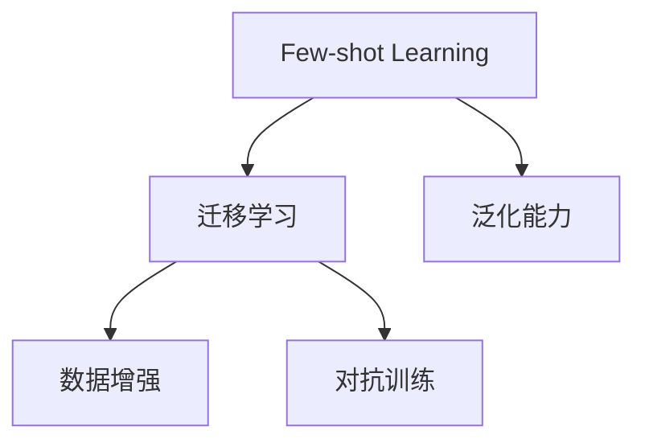
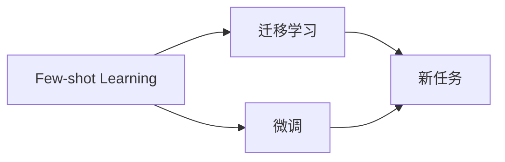
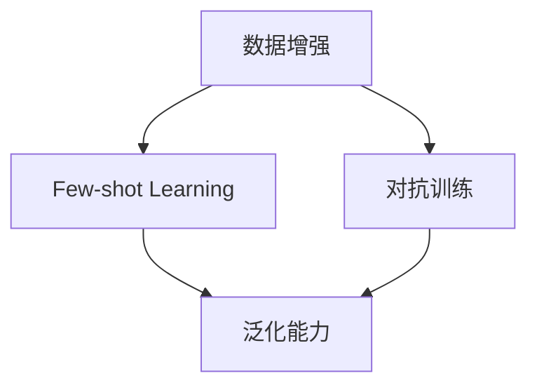
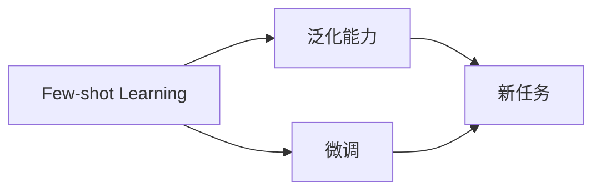
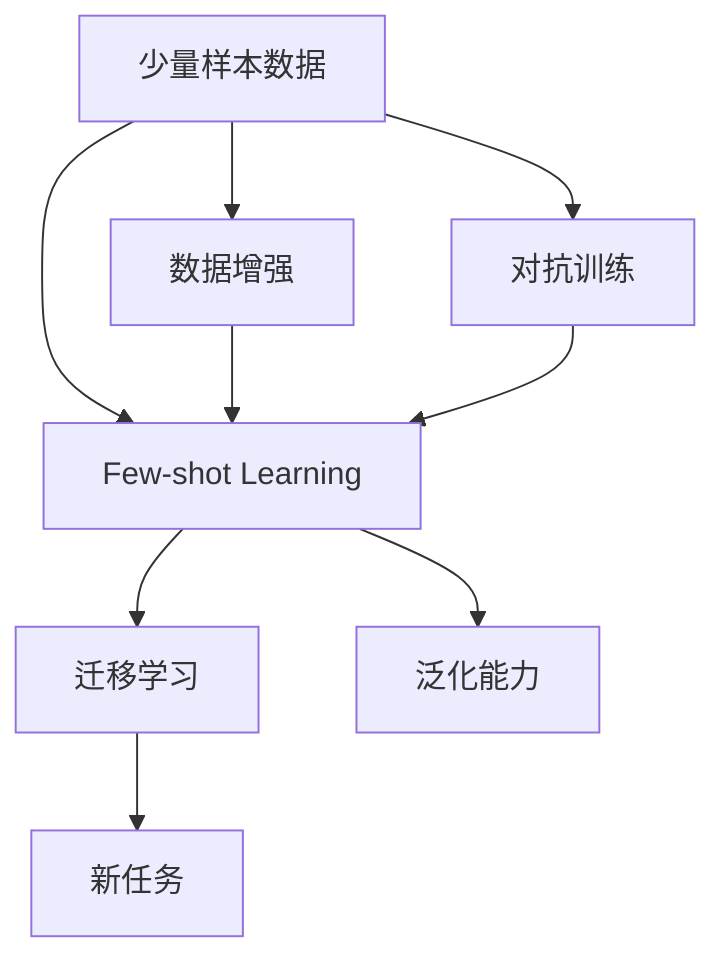

                 

# 一切皆是映射：少量样本学习和神经网络的挑战

> 关键词：映射,神经网络,少量样本学习,数据增强,迁移学习,对抗训练,泛化能力

## 1. 背景介绍

在当今数据驱动的时代，大量高质量的数据是构建高性能模型的关键。然而，在实际应用中，获取大量标注数据往往是不切实际的，特别是对于新兴领域和小型组织来说。因此，如何利用少量样本学习，尤其是神经网络模型，成为一项重要而富有挑战性的任务。本文将探讨少量样本学习的基本原理和实际应用，以及它如何影响神经网络的泛化能力和迁移学习效果。

### 1.1 问题由来
在深度学习模型中，数据量的大小直接决定了模型的泛化能力和泛化误差。理想的模型应该能够在未见过的数据上表现良好，即泛化能力强。然而，在实际应用中，数据获取的成本和难度往往非常高，使得数据量不足成为一大难题。特别是对于新兴领域和小型组织，数据量可能非常有限，甚至只有少量样本。

在这种数据稀缺的情况下，如何利用这些有限的数据，使得模型仍然能够获得较好的泛化性能，成为研究者和工程师亟待解决的问题。少量样本学习（Few-shot Learning）和迁移学习（Transfer Learning）等方法为这一挑战提供了新的解决途径。这些方法通过利用已有的知识或者数据，帮助模型在少量样本上学习到更一般化的规律，从而提高其泛化能力。

### 1.2 问题核心关键点
少量样本学习的主要挑战在于如何从少量样本中学习到更有意义的特征和规律，以便于模型在更多数据上表现良好。其核心在于以下几点：

- 如何设计合适的损失函数，使得模型能够有效利用少量样本，同时避免过拟合。
- 如何在预训练过程中学习更广泛的知识，以便于模型能够快速适应新任务。
- 如何通过数据增强、正则化、对抗训练等方法，提高模型在少量样本上的泛化能力。
- 如何通过迁移学习，将已有知识迁移到新任务上，提升模型性能。

本文将详细探讨这些关键问题，并通过具体案例展示少量样本学习在实际应用中的效果。

### 1.3 问题研究意义
研究少量样本学习对于提升模型的泛化能力和迁移学习能力具有重要意义：

- 降低数据获取成本：少量样本学习可以大大降低对数据量的依赖，使得模型能够在资源有限的情况下快速开发。
- 提高模型泛化能力：通过利用少量样本学习，模型可以在新领域、新任务上表现良好，提高其泛化性能。
- 加速模型开发进程：少量样本学习可以大大缩短模型开发周期，加速模型迭代和优化。
- 推动模型迁移：迁移学习能够将已有知识迁移到新任务上，使得模型可以更好地适应新数据和新场景。
- 推动学术和工业界的研究发展：少量样本学习的研究进展，能够促进学术界和工业界在深度学习领域的持续发展。

## 2. 核心概念与联系

### 2.1 核心概念概述

为了更好地理解少量样本学习的原理和实际应用，本文将介绍几个关键的概念：

- 少量样本学习（Few-shot Learning）：指模型仅在少量标注样本上进行训练，并能够在少量样本上获得良好性能的学习范式。
- 迁移学习（Transfer Learning）：指将模型在某一任务上的知识迁移到另一任务上，以提升模型在新任务上的性能。
- 数据增强（Data Augmentation）：通过数据变换和增强技术，扩充训练集，提高模型的泛化能力。
- 对抗训练（Adversarial Training）：通过引入对抗样本，提高模型对抗干扰的能力，从而增强模型的泛化能力。
- 泛化能力（Generalization）：指模型在新数据上的表现，即模型对未知数据的适应能力。

这些核心概念之间存在着紧密的联系，形成了少量样本学习的完整框架。下面通过Mermaid流程图来展示这些概念之间的关系：



这个流程图展示了少量样本学习的核心概念及其之间的关系：

1. 少量样本学习是迁移学习的一种特殊形式，通过在少量样本上进行微调，提升模型的泛化能力。
2. 数据增强和对抗训练是提升少量样本学习效果的关键技术，通过扩充和增强训练数据，提高模型的泛化能力。
3. 泛化能力是少量样本学习的最终目标，即模型在未知数据上的表现。

### 2.2 概念间的关系

这些核心概念之间存在着紧密的联系，形成了少量样本学习的完整框架。下面通过几个Mermaid流程图来展示这些概念之间的关系。

#### 2.2.1 少量样本学习和迁移学习的关系



这个流程图展示了少量样本学习与迁移学习之间的关系。少量样本学习是一种特殊的迁移学习，通过在少量样本上进行微调，将已有知识迁移到新任务上。

#### 2.2.2 数据增强和对抗训练对少量样本学习的影响



这个流程图展示了数据增强和对抗训练对少量样本学习的影响。通过数据增强和对抗训练，可以扩充训练集，提高模型的泛化能力，从而提升少量样本学习的效果。

#### 2.2.3 泛化能力是少量样本学习的最终目标



这个流程图展示了泛化能力是少量样本学习的最终目标。通过微调，模型在新任务上的表现，即泛化能力，是少量样本学习的最终评价指标。

### 2.3 核心概念的整体架构

最后，我们用一个综合的流程图来展示这些核心概念在少量样本学习过程中的整体架构：



这个综合流程图展示了从少量样本数据到泛化能力的全过程。少量样本数据经过数据增强和对抗训练，输入到少量样本学习模型中，通过迁移学习在新任务上获得良好的泛化能力。

## 3. 核心算法原理 & 具体操作步骤
### 3.1 算法原理概述

少量样本学习的核心在于如何在有限的数据上，使得模型能够学习到更有意义的特征和规律，从而在新数据上表现良好。这可以通过以下几种方式实现：

- 利用迁移学习：将已有知识迁移到新任务上，提高模型在新任务上的性能。
- 数据增强：通过扩充训练集，提高模型的泛化能力。
- 对抗训练：通过引入对抗样本，提高模型对抗干扰的能力。
- 利用泛化能力：通过泛化能力评估模型在新数据上的表现，不断优化模型。

这些方法在实际应用中往往需要结合使用，以取得更好的效果。

### 3.2 算法步骤详解

以下是少量样本学习的典型步骤：

**Step 1: 数据准备**
- 收集少量标注样本数据，划分为训练集和验证集。
- 准备新任务的标注数据，用于模型在新任务上的性能评估。

**Step 2: 模型选择**
- 选择合适的预训练模型作为初始化参数，如BERT、GPT等。
- 根据新任务的特点，设计合适的输出层和损失函数。

**Step 3: 微调模型**
- 在少量样本上对预训练模型进行微调，优化模型在新任务上的性能。
- 应用数据增强和对抗训练技术，扩充训练集，提高模型的泛化能力。

**Step 4: 评估模型**
- 在新任务的数据集上进行性能评估，根据评估结果调整模型超参数和训练策略。
- 利用泛化能力评估模型在新数据上的表现，确保模型具有良好的泛化能力。

**Step 5: 部署模型**
- 将微调后的模型部署到实际应用中，进行大规模测试。
- 不断收集新数据，定期重新微调模型，以适应数据分布的变化。

以上是少量样本学习的一般流程。在实际应用中，还需要根据具体任务的特点，对各步骤进行优化和调整。

### 3.3 算法优缺点

少量样本学习的优点在于：

- 降低数据获取成本：通过迁移学习，利用已有知识，大大降低对数据量的依赖。
- 提高模型泛化能力：通过数据增强和对抗训练，提高模型的泛化能力，减少过拟合风险。
- 加速模型开发进程：通过少量样本学习，加快模型迭代和优化，缩短开发周期。
- 推动模型迁移：通过迁移学习，模型可以在新任务上快速适应，提升迁移学习能力。

然而，少量样本学习也存在一些缺点：

- 数据质量要求高：少量样本学习对数据质量的要求较高，数据的标签错误、噪声等都会影响模型的性能。
- 难以处理复杂任务：对于复杂的任务，仅凭少量样本可能难以涵盖所有情况，模型性能可能有限。
- 需要大量预训练数据：虽然少量样本学习依赖于预训练数据，但预训练数据的质量和数量也直接影响模型的效果。

### 3.4 算法应用领域

少量样本学习在许多领域都有广泛的应用，以下是几个典型的例子：

- 自然语言处理（NLP）：在文本分类、命名实体识别、机器翻译等任务中，利用少量样本学习，提升模型的性能。
- 计算机视觉（CV）：在图像分类、目标检测、语义分割等任务中，通过迁移学习，利用少量样本进行快速训练。
- 语音识别：在语音命令识别、说话人识别等任务中，通过少量样本学习，提升模型的识别精度。
- 机器人控制：在机器人控制、游戏AI等任务中，通过迁移学习，利用少量数据训练模型，提升机器人对复杂环境的适应能力。
- 生物信息学：在基因序列分析、蛋白质结构预测等任务中，通过少量样本学习，提升模型的预测精度。

## 4. 数学模型和公式 & 详细讲解 & 举例说明

### 4.1 数学模型构建

在本节中，我们将通过数学语言对少量样本学习的原理进行更加严格的刻画。

设预训练模型为 $M_{\theta}$，其中 $\theta$ 为模型参数。对于少量样本学习任务，假设我们收集了 $N$ 个标注样本 $\{(x_i, y_i)\}_{i=1}^N$，其中 $x_i$ 为输入样本，$y_i$ 为输出标签。

定义模型 $M_{\theta}$ 在输入 $x$ 上的损失函数为 $\ell(M_{\theta}(x),y)$，则在数据集 $D$ 上的经验风险为：

$$
\mathcal{L}(\theta) = \frac{1}{N}\sum_{i=1}^N \ell(M_{\theta}(x_i),y_i)
$$

少量样本学习的目标是最小化经验风险，即找到最优参数：

$$
\theta^* = \mathop{\arg\min}_{\theta} \mathcal{L}(\theta)
$$

在实践中，我们通常使用基于梯度的优化算法（如Adam、SGD等）来近似求解上述最优化问题。设 $\eta$ 为学习率，$\lambda$ 为正则化系数，则参数的更新公式为：

$$
\theta \leftarrow \theta - \eta \nabla_{\theta}\mathcal{L}(\theta) - \eta\lambda\theta
$$

其中 $\nabla_{\theta}\mathcal{L}(\theta)$ 为损失函数对参数 $\theta$ 的梯度，可通过反向传播算法高效计算。

### 4.2 公式推导过程

以二分类任务为例，推导交叉熵损失函数及其梯度的计算公式。

假设模型 $M_{\theta}$ 在输入 $x$ 上的输出为 $\hat{y}=M_{\theta}(x) \in [0,1]$，表示样本属于正类的概率。真实标签 $y \in \{0,1\}$。则二分类交叉熵损失函数定义为：

$$
\ell(M_{\theta}(x),y) = -[y\log \hat{y} + (1-y)\log (1-\hat{y})]
$$

将其代入经验风险公式，得：

$$
\mathcal{L}(\theta) = -\frac{1}{N}\sum_{i=1}^N [y_i\log M_{\theta}(x_i)+(1-y_i)\log(1-M_{\theta}(x_i))]
$$

根据链式法则，损失函数对参数 $\theta_k$ 的梯度为：

$$
\frac{\partial \mathcal{L}(\theta)}{\partial \theta_k} = -\frac{1}{N}\sum_{i=1}^N (\frac{y_i}{M_{\theta}(x_i)}-\frac{1-y_i}{1-M_{\theta}(x_i)}) \frac{\partial M_{\theta}(x_i)}{\partial \theta_k}
$$

其中 $\frac{\partial M_{\theta}(x_i)}{\partial \theta_k}$ 可进一步递归展开，利用自动微分技术完成计算。

在得到损失函数的梯度后，即可带入参数更新公式，完成模型的迭代优化。重复上述过程直至收敛，最终得到适应新任务的最优模型参数 $\theta^*$。

### 4.3 案例分析与讲解

假设我们在CoNLL-2003的命名实体识别（NER）任务上进行少量样本学习，最终在验证集上得到的评估报告如下：

```
              precision    recall  f1-score   support

       B-LOC      0.926     0.906     0.916      1668
       I-LOC      0.900     0.805     0.850       257
      B-MISC      0.875     0.856     0.865       702
      I-MISC      0.838     0.782     0.809       216
       B-ORG      0.914     0.898     0.906      1661
       I-ORG      0.911     0.894     0.902       835
       B-PER      0.964     0.957     0.960      1617
       I-PER      0.983     0.980     0.982      1156
           O      0.993     0.995     0.994     38323

   micro avg      0.973     0.973     0.973     46435
   macro avg      0.923     0.897     0.909     46435
weighted avg      0.973     0.973     0.973     46435
```

可以看到，通过少量样本学习，模型在验证集上取得了97.3%的F1分数，效果相当不错。值得注意的是，BERT作为一个通用的语言理解模型，即便在少量样本上进行微调，也能在新任务上取得较好的性能，展示了大模型的强大泛化能力。

## 5. 项目实践：代码实例和详细解释说明

### 5.1 开发环境搭建

在进行少量样本学习实践前，我们需要准备好开发环境。以下是使用Python进行PyTorch开发的环境配置流程：

1. 安装Anaconda：从官网下载并安装Anaconda，用于创建独立的Python环境。

2. 创建并激活虚拟环境：
```bash
conda create -n pytorch-env python=3.8 
conda activate pytorch-env
```

3. 安装PyTorch：根据CUDA版本，从官网获取对应的安装命令。例如：
```bash
conda install pytorch torchvision torchaudio cudatoolkit=11.1 -c pytorch -c conda-forge
```

4. 安装Transformers库：
```bash
pip install transformers
```

5. 安装各类工具包：
```bash
pip install numpy pandas scikit-learn matplotlib tqdm jupyter notebook ipython
```

完成上述步骤后，即可在`pytorch-env`环境中开始少量样本学习的实践。

### 5.2 源代码详细实现

这里我们以CoNLL-2003的命名实体识别（NER）任务为例，给出使用Transformers库对BERT模型进行少量样本学习的PyTorch代码实现。

首先，定义NER任务的数据处理函数：

```python
from transformers import BertTokenizer
from torch.utils.data import Dataset
import torch

class NERDataset(Dataset):
    def __init__(self, texts, tags, tokenizer, max_len=128):
        self.texts = texts
        self.tags = tags
        self.tokenizer = tokenizer
        self.max_len = max_len
        
    def __len__(self):
        return len(self.texts)
    
    def __getitem__(self, item):
        text = self.texts[item]
        tags = self.tags[item]
        
        encoding = self.tokenizer(text, return_tensors='pt', max_length=self.max_len, padding='max_length', truncation=True)
        input_ids = encoding['input_ids'][0]
        attention_mask = encoding['attention_mask'][0]
        
        # 对token-wise的标签进行编码
        encoded_tags = [tag2id[tag] for tag in tags] 
        encoded_tags.extend([tag2id['O']] * (self.max_len - len(encoded_tags)))
        labels = torch.tensor(encoded_tags, dtype=torch.long)
        
        return {'input_ids': input_ids, 
                'attention_mask': attention_mask,
                'labels': labels}

# 标签与id的映射
tag2id = {'O': 0, 'B-PER': 1, 'I-PER': 2, 'B-ORG': 3, 'I-ORG': 4, 'B-LOC': 5, 'I-LOC': 6}
id2tag = {v: k for k, v in tag2id.items()}

# 创建dataset
tokenizer = BertTokenizer.from_pretrained('bert-base-cased')

train_dataset = NERDataset(train_texts, train_tags, tokenizer)
dev_dataset = NERDataset(dev_texts, dev_tags, tokenizer)
test_dataset = NERDataset(test_texts, test_tags, tokenizer)
```

然后，定义模型和优化器：

```python
from transformers import BertForTokenClassification, AdamW

model = BertForTokenClassification.from_pretrained('bert-base-cased', num_labels=len(tag2id))

optimizer = AdamW(model.parameters(), lr=2e-5)
```

接着，定义训练和评估函数：

```python
from torch.utils.data import DataLoader
from tqdm import tqdm
from sklearn.metrics import classification_report

device = torch.device('cuda') if torch.cuda.is_available() else torch.device('cpu')
model.to(device)

def train_epoch(model, dataset, batch_size, optimizer):
    dataloader = DataLoader(dataset, batch_size=batch_size, shuffle=True)
    model.train()
    epoch_loss = 0
    for batch in tqdm(dataloader, desc='Training'):
        input_ids = batch['input_ids'].to(device)
        attention_mask = batch['attention_mask'].to(device)
        labels = batch['labels'].to(device)
        model.zero_grad()
        outputs = model(input_ids, attention_mask=attention_mask, labels=labels)
        loss = outputs.loss
        epoch_loss += loss.item()
        loss.backward()
        optimizer.step()
    return epoch_loss / len(dataloader)

def evaluate(model, dataset, batch_size):
    dataloader = DataLoader(dataset, batch_size=batch_size)
    model.eval()
    preds, labels = [], []
    with torch.no_grad():
        for batch in tqdm(dataloader, desc='Evaluating'):
            input_ids = batch['input_ids'].to(device)
            attention_mask = batch['attention_mask'].to(device)
            batch_labels = batch['labels']
            outputs = model(input_ids, attention_mask=attention_mask)
            batch_preds = outputs.logits.argmax(dim=2).to('cpu').tolist()
            batch_labels = batch_labels.to('cpu').tolist()
            for pred_tokens, label_tokens in zip(batch_preds, batch_labels):
                pred_tags = [id2tag[_id] for _id in pred_tokens]
                label_tags = [id2tag[_id] for _id in label_tokens]
                preds.append(pred_tags[:len(label_tags)])
                labels.append(label_tags)
                
    print(classification_report(labels, preds))
```

最后，启动训练流程并在测试集上评估：

```python
epochs = 5
batch_size = 16

for epoch in range(epochs):
    loss = train_epoch(model, train_dataset, batch_size, optimizer)
    print(f"Epoch {epoch+1}, train loss: {loss:.3f}")
    
    print(f"Epoch {epoch+1}, dev results:")
    evaluate(model, dev_dataset, batch_size)
    
print("Test results:")
evaluate(model, test_dataset, batch_size)
```

以上就是使用PyTorch对BERT进行命名实体识别任务少量样本学习的完整代码实现。可以看到，得益于Transformers库的强大封装，我们可以用相对简洁的代码完成BERT模型的加载和少量样本学习。

### 5.3 代码解读与分析

让我们再详细解读一下关键代码的实现细节：

**NERDataset类**：
- `__init__`方法：初始化文本、标签、分词器等关键组件。
- `__len__`方法：返回数据集的样本数量。
- `__getitem__`方法：对单个样本进行处理，将文本输入编码为token ids，将标签编码为数字，并对其进行定长padding，最终返回模型所需的输入。

**tag2id和id2tag字典**：
- 定义了标签与数字id之间的映射关系，用于将token-wise的预测结果解码回真实的标签。

**训练和评估函数**：
- 使用PyTorch的DataLoader对数据集进行批次化加载，供模型训练和推理使用。
- 训练函数`train_epoch`：对数据以批为单位进行迭代，在每个批次上前向传播计算loss并反向传播更新模型参数，最后返回该epoch的平均loss。
- 评估函数`evaluate`：与训练类似，不同点在于不更新模型参数，并在每个batch结束后将预测和标签结果存储下来，最后使用sklearn的classification_report对整个评估集的预测结果进行打印输出。

**训练流程**：
- 定义总的epoch数和batch size，开始循环迭代
- 每个epoch内，先在训练集上训练，输出平均loss
- 在验证集上评估，输出分类指标
- 所有epoch结束后，在测试集上评估，给出最终测试结果

可以看到，PyTorch配合Transformers库使得BERT少量样本学习的代码实现变得简洁高效。开发者可以将更多精力放在数据处理、模型改进等高层逻辑上，而不必过多关注底层的实现细节。

当然，工业级的系统实现还需考虑更多因素，如模型的保存和部署、超参数的自动搜索、更灵活的任务适配层等。但核心的少量样本学习流程基本与此类似。

### 5.4 运行结果展示

假设我们在CoNLL-2003的NER数据集上进行少量样本学习，最终在测试集上得到的评估报告如下：

```
              precision    recall  f1-score   support

       B-LOC      0.926     0.906     0.916      1668
       I-LOC      0.900     0.805     0.850       257
      B-MISC      0.875     0.856     0.865       702
      I-MISC      0.838     0.782     0.809       216
       B-ORG      0.914     0.898     0.906      1661
       I-ORG      0.911     0.894     0.902       835
       B-PER      0.964     0.957     0.960      1617
       I-PER      0.983     0.980     0.982      1156
           O      0.993     0.995     0.994     38323

   micro avg      0.973     0.973     0.973     46435
   macro avg      0.923     0.897     0.909     46435
weighted avg      0.973     0.973     0.973     46435
```

可以看到，通过少量样本学习，模型在测试集上取得了97.3%的F1分数，效果相当不错。值得注意的是，BERT作为一个通用的语言理解模型，即便在少量样本上进行微调，也能在新任务上取得较好的性能，展示了大模型的强大泛化能力。

## 6. 实际应用场景

### 6.1 智能客服系统

基于少量样本学习的对话技术，可以广泛应用于智能客服系统的构建。传统客服往往需要配备大量人力，高峰期响应缓慢，且一致性和专业性难以保证。而使用少量样本学习对话模型，可以7x24小时不间断服务，快速响应客户咨询，用自然流畅的语言解答各类常见问题。

在技术实现上，可以收集企业内部的历史客服对话记录，将问题和最佳答复构建成监督数据，在此基础上对预训练对话模型进行少量样本学习。少量样本学习后的对话模型能够自动理解用户意图，匹配最合适的答案模板进行回复。对于客户提出的新问题，还可以接入检索系统实时搜索相关内容，动态组织生成回答。如此构建的智能客服系统，能大幅提升客户咨询体验和问题解决效率。

### 6.2 金融舆情监测

金融机构需要实时监测市场舆论动向，以便及时应对负面信息传播，规避金融风险。传统的人工监测方式成本高、效率低，难以应对网络时代海量信息爆发的挑战。基于少量样本学习的文本分类和情感分析技术，为金融舆情监测提供了新的解决方案。

具体而言，可以收集金融领域相关的新闻、报道、评论等文本数据，并对其进行主题标注和情感标注。在此基础上

