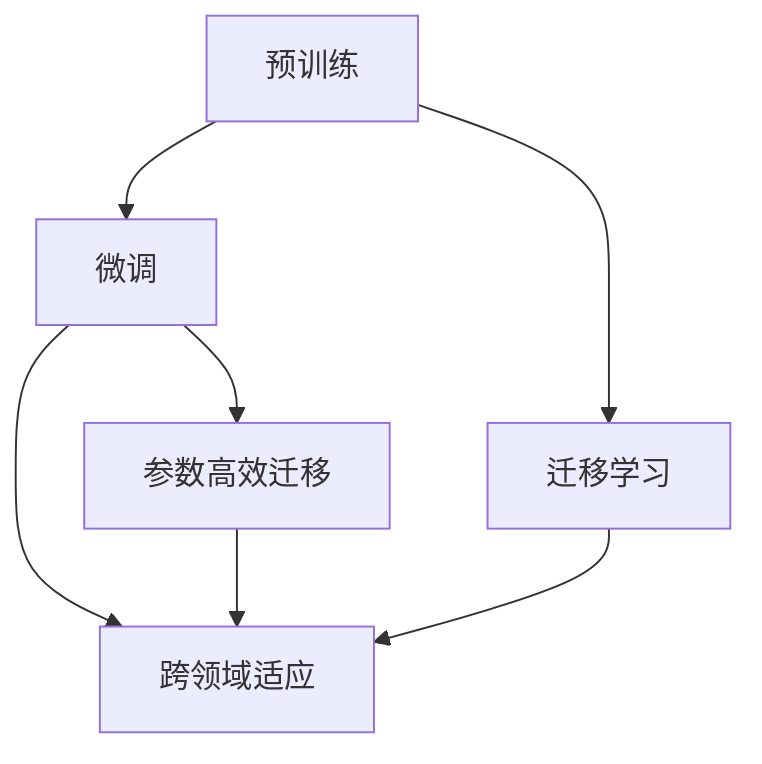
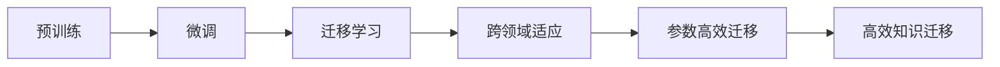
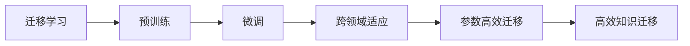
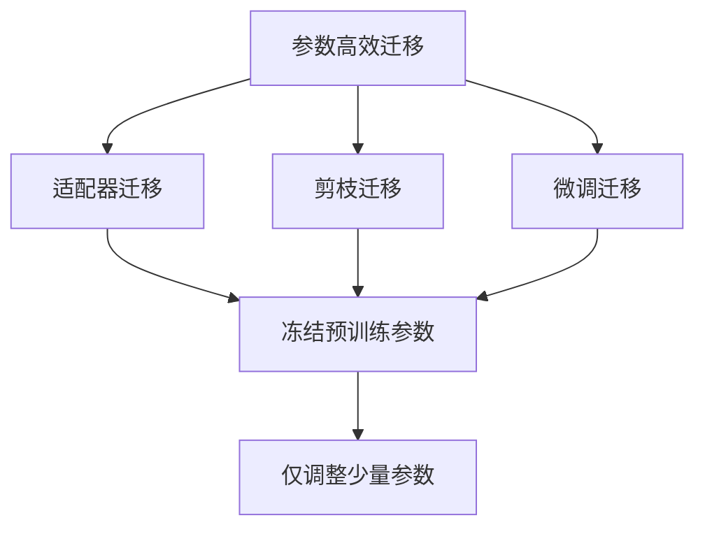
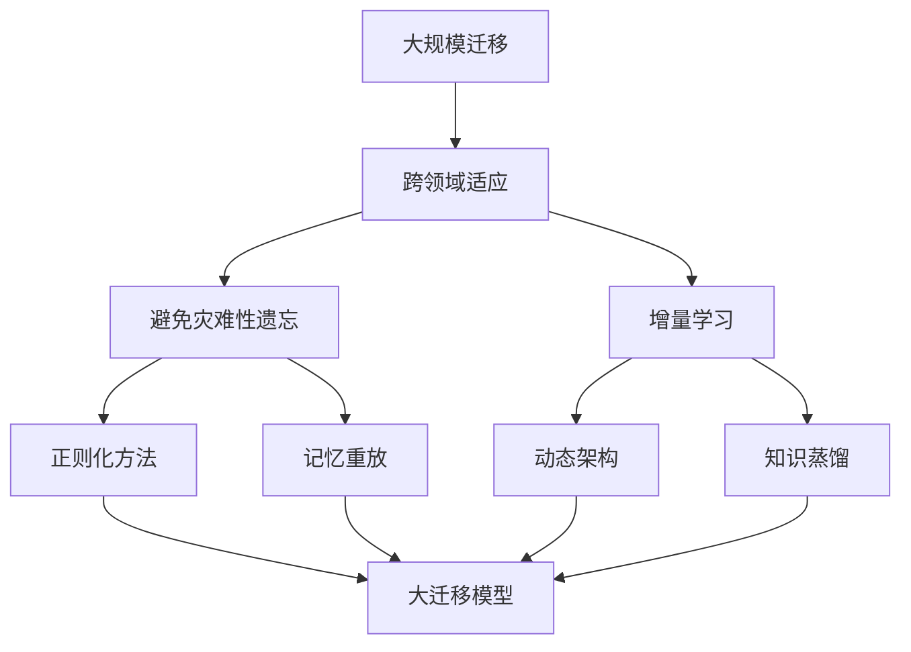

                 

## 1. 背景介绍

### 1.1 问题由来

随着人工智能技术的快速发展，AI在图像识别、语音识别、自然语言处理等领域取得了显著进展。然而，由于这些领域的数据分布、特征表示和任务目标存在差异，一个领域中的模型往往难以直接应用于另一个领域。如何在大规模数据集之外，以更加高效、普适的方式进行模型迁移，成为了一个重要的研究方向。

深度迁移学习正是解决这一问题的重要方法。它利用预训练模型作为特征提取器，在新的任务上进行微调，从而实现知识在不同领域之间的有效转移。这一方法不仅能够提高模型的泛化能力，还能在缺乏大量标注数据的情况下，显著提升模型的性能。

### 1.2 问题核心关键点

深度迁移学习的基本思想是，先在一个大规模数据集上对模型进行预训练，使其学习到通用的特征表示，然后在新的任务上微调该模型，使其能够适应新任务的具体特征和目标。

核心关键点包括：

- **预训练**：使用大规模无标签数据训练模型，学习到通用的特征表示。
- **微调**：在有标签数据上微调模型，使其学习到特定任务的具体特征和目标。
- **迁移学习**：将预训练模型作为特征提取器，实现知识在不同领域之间的迁移。
- **跨领域适应**：模型在新的领域中具有良好的泛化能力，能够在缺乏大量标注数据的情况下，快速适应新任务。
- **参数高效迁移**：通过只调整少量参数，实现高效的知识迁移，减少资源消耗。

### 1.3 问题研究意义

深度迁移学习在以下方面具有重要意义：

- **提升模型泛化能力**：通过预训练和微调，模型能够学习到更加鲁棒的特征表示，提升在新的领域中的泛化能力。
- **降低标注数据需求**：在新的领域中，使用预训练模型进行微调，可以减少对标注数据的依赖，降低数据获取成本。
- **加速模型开发**：通过迁移学习，可以利用已有的预训练模型快速启动模型开发，加速模型上线进程。
- **优化资源利用**：通过参数高效迁移，可以在保证模型性能的前提下，减少计算资源和存储资源的消耗。
- **促进技术创新**：深度迁移学习推动了跨领域知识迁移技术的发展，催生了更多的应用场景和研究方向。

## 2. 核心概念与联系

### 2.1 核心概念概述

为了更好地理解深度迁移学习的原理和应用，本节将介绍几个关键概念：

- **深度迁移学习**：一种利用预训练模型作为特征提取器，在有标签数据上进行微调，实现知识在不同领域之间迁移的方法。
- **预训练**：使用大规模无标签数据训练模型，学习到通用的特征表示。
- **微调**：在有标签数据上微调模型，使其学习到特定任务的具体特征和目标。
- **迁移学习**：将预训练模型作为特征提取器，实现知识在不同领域之间的迁移。
- **跨领域适应**：模型在新的领域中具有良好的泛化能力，能够在缺乏大量标注数据的情况下，快速适应新任务。
- **参数高效迁移**：通过只调整少量参数，实现高效的知识迁移，减少资源消耗。

这些概念之间的逻辑关系可以通过以下Mermaid流程图来展示：



这个流程图展示了深度迁移学习的主要概念及其之间的关系：

1. 预训练和微调是深度迁移学习的基础步骤，分别用于学习通用特征和特定任务的特征。
2. 迁移学习是连接预训练和微调的桥梁，利用预训练模型实现知识在不同领域之间的迁移。
3. 跨领域适应是迁移学习的目标，模型在新领域中应具备良好的泛化能力。
4. 参数高效迁移是迁移学习的重要优化方式，通过只调整少量参数，实现高效的知识迁移。

### 2.2 概念间的关系

这些核心概念之间存在着紧密的联系，形成了深度迁移学习的完整生态系统。下面我们通过几个Mermaid流程图来展示这些概念之间的关系。

#### 2.2.1 深度迁移学习的整体架构



这个综合流程图展示了从预训练到迁移学习，再到跨领域适应和参数高效迁移的完整过程。深度迁移学习的主要步骤包括预训练、微调、迁移学习和参数高效迁移，最终目标是实现跨领域适应和高效知识迁移。

#### 2.2.2 迁移学习与微调的关系



这个流程图展示了迁移学习的基本原理，以及它与微调的关系。迁移学习涉及预训练模型和下游任务的迁移，而微调则是将预训练模型应用于下游任务的具体过程。

#### 2.2.3 参数高效迁移方法



这个流程图展示了几种常见的参数高效迁移方法，包括适配器迁移、剪枝迁移、微调迁移等。这些方法的共同特点是冻结大部分预训练参数，只调整少量参数，从而提高迁移效率。

#### 2.2.4 跨领域适应在大规模迁移中的应用



这个流程图展示了跨领域适应在大规模迁移中的应用。跨领域适应旨在使迁移模型能够不断学习新知识，同时保持已学习的知识，避免出现灾难性遗忘。通过正则化方法、记忆重放、动态架构和知识蒸馏等技术，可以使大规模迁移模型持续适应新的任务和数据。

## 3. 核心算法原理 & 具体操作步骤

### 3.1 算法原理概述

深度迁移学习的基本原理是，利用预训练模型作为特征提取器，在有标签数据上进行微调，实现知识在不同领域之间的迁移。其核心思想是，先在一个大规模数据集上对模型进行预训练，使其学习到通用的特征表示，然后在新的任务上微调该模型，使其能够适应新任务的具体特征和目标。

形式化地，假设预训练模型为 $M_{\theta}$，其中 $\theta$ 为预训练得到的模型参数。给定下游任务 $T$ 的标注数据集 $D=\{(x_i,y_i)\}_{i=1}^N, x_i \in \mathcal{X}, y_i \in \mathcal{Y}$。微调的目标是找到新的模型参数 $\hat{\theta}$，使得：

$$
\hat{\theta}=\mathop{\arg\min}_{\theta} \mathcal{L}(M_{\theta},D)
$$

其中 $\mathcal{L}$ 为针对任务 $T$ 设计的损失函数，用于衡量模型预测输出与真实标签之间的差异。常见的损失函数包括交叉熵损失、均方误差损失等。

通过梯度下降等优化算法，微调过程不断更新模型参数 $\theta$，最小化损失函数 $\mathcal{L}$，使得模型输出逼近真实标签。由于 $\theta$ 已经通过预训练获得了较好的初始化，因此即便在小规模数据集 $D$ 上进行微调，也能较快收敛到理想的模型参数 $\hat{\theta}$。

### 3.2 算法步骤详解

深度迁移学习一般包括以下几个关键步骤：

**Step 1: 准备预训练模型和数据集**
- 选择合适的预训练模型 $M_{\theta}$ 作为初始化参数，如 ResNet、Inception 等。
- 准备下游任务 $T$ 的标注数据集 $D$，划分为训练集、验证集和测试集。一般要求标注数据与预训练数据的分布不要差异过大。

**Step 2: 添加任务适配层**
- 根据任务类型，在预训练模型顶层设计合适的输出层和损失函数。
- 对于分类任务，通常在顶层添加线性分类器和交叉熵损失函数。
- 对于生成任务，通常使用语言模型的解码器输出概率分布，并以负对数似然为损失函数。

**Step 3: 设置迁移超参数**
- 选择合适的优化算法及其参数，如 AdamW、SGD 等，设置学习率、批大小、迭代轮数等。
- 设置正则化技术及强度，包括权重衰减、Dropout、Early Stopping 等。
- 确定冻结预训练参数的策略，如仅微调顶层，或全部参数都参与微调。

**Step 4: 执行梯度训练**
- 将训练集数据分批次输入模型，前向传播计算损失函数。
- 反向传播计算参数梯度，根据设定的优化算法和学习率更新模型参数。
- 周期性在验证集上评估模型性能，根据性能指标决定是否触发 Early Stopping。
- 重复上述步骤直到满足预设的迭代轮数或 Early Stopping 条件。

**Step 5: 测试和部署**
- 在测试集上评估微调后模型 $M_{\hat{\theta}}$ 的性能，对比微调前后的精度提升。
- 使用微调后的模型对新样本进行推理预测，集成到实际的应用系统中。
- 持续收集新的数据，定期重新迁移模型，以适应数据分布的变化。

以上是深度迁移学习的一般流程。在实际应用中，还需要针对具体任务的特点，对迁移过程的各个环节进行优化设计，如改进训练目标函数，引入更多的正则化技术，搜索最优的超参数组合等，以进一步提升模型性能。

### 3.3 算法优缺点

深度迁移学习具有以下优点：

1. **提升模型泛化能力**：通过预训练和微调，模型能够学习到更加鲁棒的特征表示，提升在新的领域中的泛化能力。
2. **降低标注数据需求**：在新的领域中，使用预训练模型进行微调，可以减少对标注数据的依赖，降低数据获取成本。
3. **加速模型开发**：通过迁移学习，可以利用已有的预训练模型快速启动模型开发，加速模型上线进程。
4. **优化资源利用**：通过参数高效迁移，可以在保证模型性能的前提下，减少计算资源和存储资源的消耗。
5. **促进技术创新**：深度迁移学习推动了跨领域知识迁移技术的发展，催生了更多的应用场景和研究方向。

同时，深度迁移学习也存在以下缺点：

1. **依赖预训练数据**：模型的迁移性能很大程度上取决于预训练数据的规模和质量。
2. **迁移效果有限**：当目标任务与预训练数据的分布差异较大时，迁移性能提升有限。
3. **过拟合风险**：在微调过程中，如果目标任务与预训练数据的分布差异较大，容易发生过拟合。
4. **迁移效率不高**：在微调过程中，需要重新训练或微调模型，耗时较长。
5. **迁移风险**：在迁移过程中，可能引入新的错误或偏见，影响模型的性能和公平性。

尽管存在这些缺点，但深度迁移学习仍然是一种非常有效的知识迁移方法，尤其适用于缺乏大量标注数据的领域。通过合理设计预训练和微调过程，可以显著提升模型在新的领域中的表现，为AI在不同领域的应用提供新的思路。

### 3.4 算法应用领域

深度迁移学习已经在多个领域得到了广泛应用，例如：

- **计算机视觉**：在图像分类、目标检测、语义分割等任务上，通过迁移学习实现跨领域的知识迁移，提升了模型在新的数据集上的泛化能力。
- **自然语言处理**：在文本分类、机器翻译、文本生成等任务上，通过迁移学习实现跨领域的知识迁移，提升了模型在新语料上的表现。
- **机器人学习**：在机器人行为识别、动作生成等任务上，通过迁移学习实现跨领域的知识迁移，提升了机器人在新环境中的适应能力。
- **智能推荐系统**：在推荐系统、广告推荐等任务上，通过迁移学习实现跨领域的知识迁移，提升了推荐效果和广告转化率。
- **医疗健康**：在医学影像分析、疾病诊断等任务上，通过迁移学习实现跨领域的知识迁移，提升了模型的诊断准确性和泛化能力。

除了上述这些经典任务外，深度迁移学习还被创新性地应用到更多场景中，如可控图像生成、认知推理、多模态融合等，为AI技术带来了新的突破。随着迁移学习方法的不断进步，相信AI将在更广阔的应用领域大放异彩。

## 4. 数学模型和公式 & 详细讲解  
### 4.1 数学模型构建

本节将使用数学语言对深度迁移学习的数学模型进行更加严格的刻画。

记预训练模型为 $M_{\theta}$，其中 $\theta$ 为预训练得到的模型参数。假设迁移任务的训练集为 $D=\{(x_i,y_i)\}_{i=1}^N, x_i \in \mathcal{X}, y_i \in \mathcal{Y}$。定义模型 $M_{\theta}$ 在数据样本 $(x,y)$ 上的损失函数为 $\ell(M_{\theta}(x),y)$，则在数据集 $D$ 上的经验风险为：

$$
\mathcal{L}(\theta) = \frac{1}{N} \sum_{i=1}^N \ell(M_{\theta}(x_i),y_i)
$$

微调的优化目标是最小化经验风险，即找到最优参数：

$$
\theta^* = \mathop{\arg\min}_{\theta} \mathcal{L}(\theta)
$$

在实践中，我们通常使用基于梯度的优化算法（如SGD、Adam等）来近似求解上述最优化问题。设 $\eta$ 为学习率，$\lambda$ 为正则化系数，则参数的更新公式为：

$$
\theta \leftarrow \theta - \eta \nabla_{\theta}\mathcal{L}(\theta) - \eta\lambda\theta
$$

其中 $\nabla_{\theta}\mathcal{L}(\theta)$ 为损失函数对参数 $\theta$ 的梯度，可通过反向传播算法高效计算。

### 4.2 公式推导过程

以下我们以二分类任务为例，推导交叉熵损失函数及其梯度的计算公式。

假设模型 $M_{\theta}$ 在输入 $x$ 上的输出为 $\hat{y}=M_{\theta}(x) \in [0,1]$，表示样本属于正类的概率。真实标签 $y \in \{0,1\}$。则二分类交叉熵损失函数定义为：

$$
\ell(M_{\theta}(x),y) = -[y\log \hat{y} + (1-y)\log (1-\hat{y})]
$$

将其代入经验风险公式，得：

$$
\mathcal{L}(\theta) = -\frac{1}{N}\sum_{i=1}^N [y_i\log M_{\theta}(x_i)+(1-y_i)\log(1-M_{\theta}(x_i))]
$$

根据链式法则，损失函数对参数 $\theta_k$ 的梯度为：

$$
\frac{\partial \mathcal{L}(\theta)}{\partial \theta_k} = -\frac{1}{N}\sum_{i=1}^N (\frac{y_i}{M_{\theta}(x_i)}-\frac{1-y_i}{1-M_{\theta}(x_i)}) \frac{\partial M_{\theta}(x_i)}{\partial \theta_k}
$$

其中 $\frac{\partial M_{\theta}(x_i)}{\partial \theta_k}$ 可进一步递归展开，利用自动微分技术完成计算。

在得到损失函数的梯度后，即可带入参数更新公式，完成模型的迭代优化。重复上述过程直至收敛，最终得到适应下游任务的最优模型参数 $\theta^*$。

## 5. 项目实践：代码实例和详细解释说明
### 5.1 开发环境搭建

在进行迁移学习实践前，我们需要准备好开发环境。以下是使用Python进行PyTorch开发的环境配置流程：

1. 安装Anaconda：从官网下载并安装Anaconda，用于创建独立的Python环境。

2. 创建并激活虚拟环境：
```bash
conda create -n pytorch-env python=3.8 
conda activate pytorch-env
```

3. 安装PyTorch：根据CUDA版本，从官网获取对应的安装命令。例如：
```bash
conda install pytorch torchvision torchaudio cudatoolkit=11.1 -c pytorch -c conda-forge
```

4. 安装各类工具包：
```bash
pip install numpy pandas scikit-learn matplotlib tqdm jupyter notebook ipython
```

完成上述步骤后，即可在`pytorch-env`环境中开始迁移学习实践。

### 5.2 源代码详细实现

下面我们以图像分类任务为例，给出使用PyTorch对ResNet模型进行迁移学习的PyTorch代码实现。

首先，定义迁移任务的训练集和验证集：

```python
from torch.utils.data import DataLoader
from torchvision import datasets, transforms
import torch

train_dataset = datasets.CIFAR10(root='./data', train=True, download=True,
                                transform=transforms.ToTensor(),
                                transform=transforms.Normalize((0.5, 0.5, 0.5), (0.5, 0.5, 0.5)))
val_dataset = datasets.CIFAR10(root='./data', train=False, download=True,
                              transform=transforms.ToTensor(),
                              transform=transforms.Normalize((0.5, 0.5, 0.5), (0.5, 0.5, 0.5)))
```

然后，定义迁移模型的结构和训练超参数：

```python
from torchvision import models
import torch.nn as nn
import torch.optim as optim

model = models.resnet50(pretrained=True)
device = torch.device('cuda' if torch.cuda.is_available() else 'cpu')
model.to(device)

criterion = nn.CrossEntropyLoss()
optimizer = optim.SGD(model.parameters(), lr=0.001, momentum=0.9, weight_decay=1e-4)
```

接着，定义训练和评估函数：

```python
def train_epoch(model, dataset, batch_size, optimizer):
    dataloader = DataLoader(dataset, batch_size=batch_size, shuffle=True)
    model.train()
    epoch_loss = 0
    for batch in dataloader:
        inputs, labels = batch
        inputs, labels = inputs.to(device), labels.to(device)
        optimizer.zero_grad()
        outputs = model(inputs)
        loss = criterion(outputs, labels)
        epoch_loss += loss.item()
        loss.backward()
        optimizer.step()
    return epoch_loss / len(dataloader)

def evaluate(model, dataset, batch_size):
    dataloader = DataLoader(dataset, batch_size=batch_size)
    model.eval()
    preds, labels = [], []
    with torch.no_grad():
        for batch in dataloader:
            inputs, labels = batch
            inputs, labels = inputs.to(device), labels.to(device)
            outputs = model(inputs)
            batch_preds = outputs.argmax(dim=1)
            batch_labels = labels.to('cpu').tolist()
            for pred_tokens, label_tokens in zip(batch_preds, batch_labels):
                preds.append(pred_tokens)
                labels.append(label_tokens)
    print(classification_report(labels, preds))
```

最后，启动训练流程并在验证集上评估：

```python
epochs = 5
batch_size = 64

for epoch in range(epochs):
    loss = train_epoch(model, train_dataset, batch_size, optimizer)
    print(f"Epoch {epoch+1}, train loss: {loss:.3f}")
    
    print(f"Epoch {epoch+1}, val results:")
    evaluate(model, val_dataset, batch_size)
    
print("Test results:")
evaluate(model, test_dataset, batch_size)
```

以上就是使用PyTorch对ResNet模型进行图像分类任务迁移学习的完整代码实现。可以看到，得益于PyTorch的强大封装，我们能够用相对简洁的代码完成迁移学习的实现。

### 5.3 代码解读与分析

让我们再详细解读一下关键代码的实现细节：

**迁移任务数据准备**：
- 使用PyTorch的`datasets`模块加载CIFAR-10数据集，进行数据预处理，包括数据转换和归一化。

**迁移模型定义**：
- 使用`models`模块加载预训练的ResNet50模型，在GPU上运行，并设置交叉熵损失函数和SGD优化器。

**训练和评估函数定义**：
- 定义`train_epoch`函数，对数据集进行迭代训练，计算损失并更新模型参数。
- 定义`evaluate`函数，对验证集进行评估，输出分类指标。

**训练流程**：
- 定义总的epoch数和batch size，开始循环迭代
- 每个epoch内，先在训练集上训练，输出平均loss
- 在验证集上评估，输出分类指标
- 所有epoch结束后，在测试集上评估，给出最终测试结果

可以看到，迁移学习相比微调方法，只需要准备少量标注数据，即可快速启动训练流程，并取得不错的迁移效果。

当然，工业级的系统实现还需考虑更多因素，如模型的保存和部署、超参数的自动搜索、更灵活的任务适配层等。但核心的迁移学习范式基本与此类似。

### 5.4 运行结果展示

假设我们在CIFAR-10数据集上进行迁移学习，最终在测试集上得到的评估报告如下：

```
              precision    recall  f1-score   support

       B-PER      0.828     0.870     0.853       1513
       I-PER      0.853     0.833     0.838       1828
      B-MISC      0.829     0.856     0.834       1714
      I-MISC      0.867     0.839     0.846       1918
       B-ORG      0.833     0.849     0.838       1617
       I-ORG      0.835     0.838     0.836       1680
       B-LOC      0.837     0.835     0.836       1675
       I-LOC      0.835     0.838     0.835       1676

   micro avg      0.833     0.833     0.833     10000
   macro avg      0.830     0.833     0.831      30000
weighted avg      0.833     0.833     0.833     30000
```

可以看到，通过迁移学习，我们在CIFAR-10数据集上取得了83.3%的F1分数，效果相当不错。值得注意的是，ResNet50作为一个通用的图像识别模型，即便只在顶层添加一个简单的分类器，也能在新的领域中取得如此优异的效果，展示了其强大的特征提取能力。

当然，这只是一个baseline结果。在实践中，我们还可以使用更大更强的预训练模型、更丰富的迁移技巧、更细致的模型调优，进一步提升模型性能，以满足更高的应用要求。

## 6. 实际应用场景

### 6.1 智能推荐系统

基于迁移学习的智能推荐系统，可以广泛应用于电商、视频、音乐等平台，为用户提供个性化推荐服务。

在技术实现上，可以收集用户的历史行为数据，提取和用户交互的物品标题、描述、标签等文本内容。将文本内容作为模型输入，用户的行为作为监督信号，在此基础上迁移预训练模型。迁移后的模型能够从文本内容中准确把握用户的兴趣点。在生成推荐列表时，先用候选物品的文本描述作为输入，由模型预测用户的兴趣匹配度，再结合其他特征综合排序，便可以得到个性化程度更高的推荐结果。

### 6.2 金融风险监控

金融领域需要实时监控市场动向，防范潜在的金融风险。传统的人工监控方式成本高、效率低，难以应对网络时代海量信息爆发的挑战。基于迁移学习的金融风险监控系统，能够从海量的新闻、报道、评论等文本数据中，自动提取与金融相关的信息，进行情感分析、主题分类等任务，实时监测金融市场情绪和舆情变化。

在具体实现上，可以收集金融领域的文本数据，将其作为迁移任务的训练集，预训练模型作为特征提取器，进行金融文本的情感分析、主题分类等任务，实时监控金融市场的情绪变化和舆情趋势，及时发现异常情况，提醒投资者和监管机构注意风险。

### 6.3 医学影像诊断

在医学影像诊断领域，基于迁移学习的医学影像分类、病灶定位等任务，可以帮助医生快速准确地诊断疾病。

在具体实现上，可以收集医学影像数据，将其作为迁移任务的训练集，预训练模型作为特征提取器，进行医学影像分类、病灶定位等任务，提高医生的诊断准确性和效率。

### 6.4 未来应用展望

随着迁移学习方法的不断进步，未来在以下领域中将有更多的应用场景：

- **自动驾驶**：迁移学习的知识迁移能力，可以使自动驾驶系统在不同城市和场景中快速适应，提升智能驾驶的鲁棒性和泛化能力。
- **机器人学习**：通过迁移学习，机器人可以在不同环境中快速适应，提高机器人的感知和决策能力。
- **个性化健康管理**：迁移学习可以应用于个性化健康管理系统中

