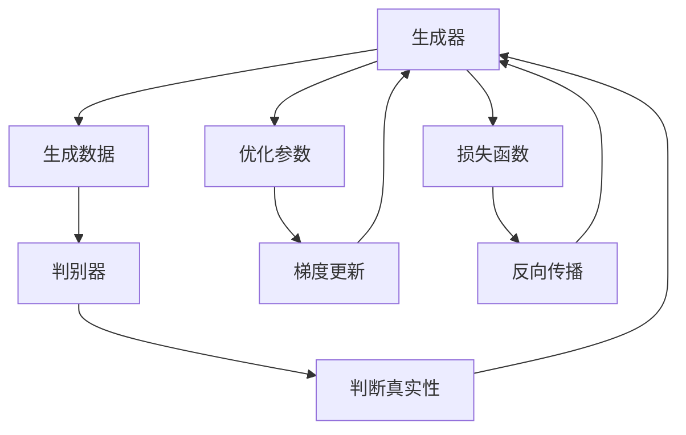
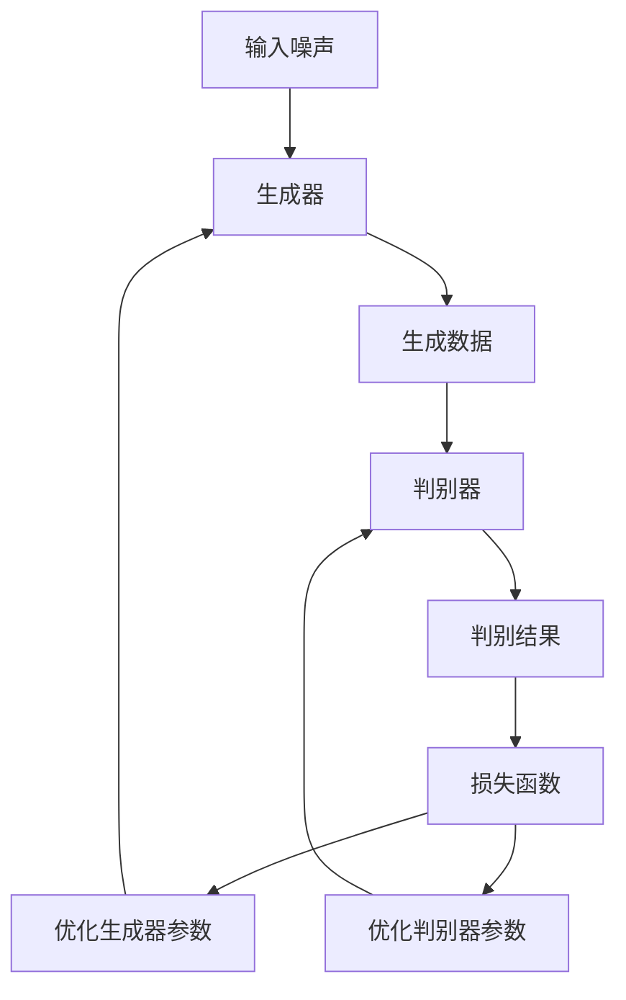
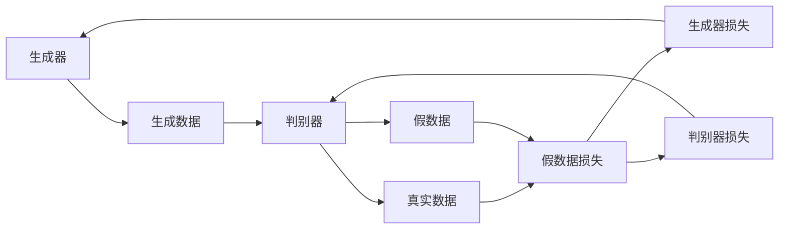
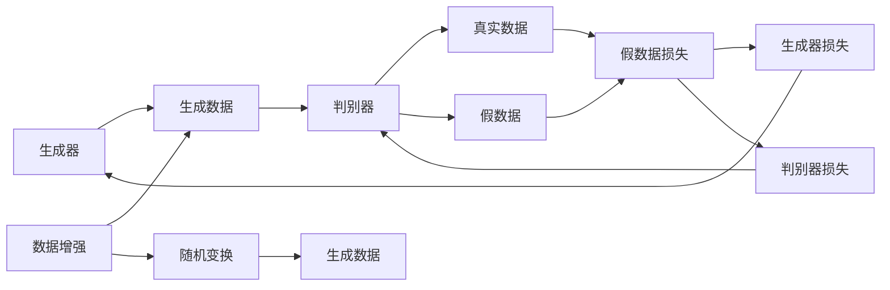
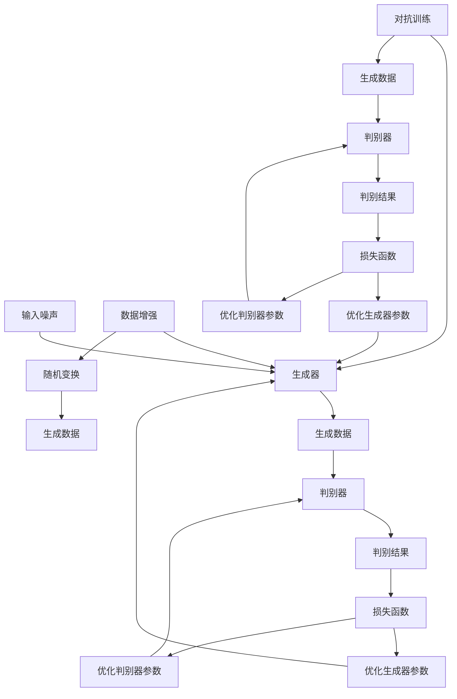

                 

# 一切皆是映射：生成对抗网络(GAN)原理剖析

> 关键词：生成对抗网络,GAN,数据生成,深度学习,图像处理,语音合成,游戏设计,艺术创作,未来应用

## 1. 背景介绍

### 1.1 问题由来
随着深度学习技术的发展，计算机视觉、自然语言处理等领域取得了巨大突破。然而，深度学习模型在生成数据方面的能力仍然有限，难以满足需求。生成对抗网络(GAN)作为一项前沿技术，通过生成模型与判别模型对抗训练的方式，能有效地解决这一问题。

### 1.2 问题核心关键点
生成对抗网络(GAN)的核心思想是让生成模型生成尽可能逼真的数据，并通过判别模型来评估生成数据的质量。生成模型与判别模型通过对抗训练不断提升性能，生成数据的质量也随之提升。

目前，GAN已被广泛应用于图像处理、语音合成、游戏设计、艺术创作等多个领域，展现出了强大的生成能力。然而，GAN的训练难度大、稳定性差等问题也成为了其应用推广的瓶颈。

### 1.3 问题研究意义
深入研究GAN原理，探索其生成数据的方法和优化策略，对于提升深度学习模型的生成能力，拓展其在实际应用中的使用范围，具有重要意义。通过理解和优化GAN模型，可以进一步推动计算机视觉、自然语言处理等领域的技术发展，带来更多的应用创新。

## 2. 核心概念与联系

### 2.1 核心概念概述

为更好地理解GAN的原理，本节将介绍几个密切相关的核心概念：

- 生成对抗网络(GAN)：由生成器和判别器两部分组成的深度学习模型，通过对抗训练生成逼真的数据。生成器尝试生成虚假数据以欺骗判别器，判别器则尝试区分真实数据和虚假数据。

- 生成器(Generator)：负责生成逼真的假数据，通常是一个神经网络。生成器网络的输入是一个随机噪声向量，输出是生成数据。

- 判别器(Discriminator)：负责判断数据是否真实，同样是一个神经网络。判别器网络的输入是数据样本，输出是一个概率值表示数据为真假的概率。

- 对抗训练(Adversarial Training)：通过让生成器和判别器进行对抗训练，相互提升性能。生成器试图欺骗判别器，而判别器则努力识别出假数据。

- 收敛问题(Convergence Problem)：在训练过程中，生成器和判别器可能陷入"纳什均衡"(Nash Equilibrium)，生成器虽然能生成逼真的数据，但判别器始终无法区分真实数据和生成数据。

- 模态塌缩(Mode Collapse)：生成器在训练过程中，生成数据多样性不足，只生成少量特定模式的数据。

这些核心概念之间的逻辑关系可以通过以下Mermaid流程图来展示：



这个流程图展示了GAN模型的工作原理：

1. 生成器生成假数据。
2. 判别器判断数据真实性。
3. 生成器和判别器通过对抗训练相互提升性能。
4. 通过损失函数计算生成器和判别器的损失，进行反向传播更新参数。

### 2.2 概念间的关系

这些核心概念之间存在着紧密的联系，形成了GAN模型的完整生态系统。下面我通过几个Mermaid流程图来展示这些概念之间的关系。

#### 2.2.1 GAN的基本架构



这个流程图展示了GAN模型的基本架构：

1. 生成器接收噪声向量作为输入，生成假数据。
2. 判别器接收数据作为输入，输出真假概率。
3. 损失函数基于判别器的判断结果计算生成器和判别器的损失。
4. 通过优化器更新生成器和判别器的参数，使损失最小化。

#### 2.2.2 对抗训练过程



这个流程图展示了GAN模型对抗训练的过程：

1. 生成器生成假数据。
2. 判别器接收假数据和真实数据，输出真假概率。
3. 判别器对真实数据和假数据分别计算损失，生成器的损失基于判别器对假数据的判断。
4. 通过反向传播更新生成器和判别器的参数。

#### 2.2.3 模态塌缩的解决方法



这个流程图展示了如何通过数据增强来缓解模态塌缩：

1. 生成器生成假数据。
2. 判别器接收假数据和真实数据，输出真假概率。
3. 数据增强操作，如随机裁剪、翻转等，提高生成数据的多样性。
4. 通过反向传播更新生成器和判别器的参数。

### 2.3 核心概念的整体架构

最后，我们用一个综合的流程图来展示这些核心概念在大模型微调过程中的整体架构：



这个综合流程图展示了从预训练到微调，再到持续学习的完整过程：

1. 生成器接收噪声向量作为输入，生成假数据。
2. 判别器接收假数据和真实数据，输出真假概率。
3. 数据增强操作，如随机裁剪、翻转等，提高生成数据的多样性。
4. 生成器和判别器通过对抗训练相互提升性能。
5. 通过损失函数计算生成器和判别器的损失，进行反向传播更新参数。

通过这些流程图，我们可以更清晰地理解GAN模型的工作原理和优化方向。

## 3. 核心算法原理 & 具体操作步骤
### 3.1 算法原理概述

生成对抗网络(GAN)的本质是通过对抗训练来生成逼真的数据。其核心思想是：让生成器和判别器进行对抗训练，生成器试图生成越逼真的数据以欺骗判别器，而判别器则努力识别出假数据。通过不断迭代优化，生成器和判别器相互提升，最终生成器能够生成高质量的假数据，判别器能够准确区分真实数据和假数据。

形式化地，假设生成器和判别器分别为 $G$ 和 $D$，数据集为 $D$，生成器的损失函数为 $L_G$，判别器的损失函数为 $L_D$，则GAN的优化目标是最小化生成器和判别器的联合损失：

$$
\min_{G,D} V(D,G) = \mathbb{E}_{x \sim p_{data}(x)}[\log D(x)] + \mathbb{E}_{z \sim p_z(z)}[\log(1-D(G(z)))]
$$

其中 $p_{data}$ 为真实数据的概率分布，$p_z$ 为噪声向量的概率分布。第一项表示判别器对真实数据的判别能力，第二项表示生成器生成假数据的能力。

通过梯度下降等优化算法，生成器和判别器的参数不断更新，最小化联合损失 $V(D,G)$，使得生成器和判别器的性能得到提升。

### 3.2 算法步骤详解

生成对抗网络(GAN)的训练步骤如下：

**Step 1: 准备数据集**
- 收集并预处理数据集，划分为训练集、验证集和测试集。
- 为生成器提供噪声向量作为输入。

**Step 2: 初始化生成器和判别器**
- 初始化生成器和判别器的网络参数。
- 通常使用卷积神经网络(Convolutional Neural Networks, CNN)或变分自编码器(Variational Autoencoder, VAE)等架构。

**Step 3: 定义损失函数**
- 判别器损失函数为真实数据和假数据的判别损失之和。
- 生成器损失函数为判别器对生成数据的判别损失。
- 联合损失函数为生成器和判别器的损失之和。

**Step 4: 对抗训练过程**
- 交替进行生成器和判别器的训练。
- 在每次迭代中，生成器先更新参数，生成假数据。
- 判别器使用生成的假数据和真实数据进行训练，输出真假概率。
- 通过梯度下降更新生成器和判别器的参数。

**Step 5: 评估和优化**
- 在验证集上评估生成器和判别器的性能，调整模型参数和超参数。
- 重复上述过程直至收敛。

**Step 6: 测试和部署**
- 在测试集上评估生成器的生成能力，对比训练前后的效果。
- 将生成器应用到实际场景中，进行数据生成或图像修复等操作。

### 3.3 算法优缺点

生成对抗网络(GAN)具有以下优点：
1. 能够生成高质量的假数据，广泛应用于图像处理、语音合成等领域。
2. 生成数据多样性高，可用于生成艺术创作、游戏设计等创新领域。
3. 可以通过对抗训练不断提升生成器和判别器的性能。

同时，GAN也存在一些局限性：
1. 训练难度大，稳定性差，生成器容易陷入"模态塌缩"。
2. 生成的数据可能存在模式噪声和模糊，难以控制生成数据的样式。
3. 判别器可能过拟合训练数据，生成器的生成能力受限。

尽管如此，GAN依然是目前生成数据领域最前沿的技术之一，有着广泛的应用前景。

### 3.4 算法应用领域

生成对抗网络(GAN)已经被应用于多个领域，如：

- 图像生成：如生成逼真的图片、修复损坏的图像等。
- 语音合成：如生成自然流畅的语音、变声换脸等。
- 游戏设计：如生成逼真的游戏场景、角色等。
- 艺术创作：如生成抽象艺术作品、音乐等。
- 虚拟现实(VR)：如生成逼真的虚拟环境、人物等。

除了这些领域，GAN还被应用于数据增强、对抗样本生成、鲁棒性测试等技术研究中，展现出强大的应用潜力。

## 4. 数学模型和公式 & 详细讲解 & 举例说明

### 4.1 数学模型构建

生成对抗网络(GAN)的数学模型可以形式化表示为：

1. 生成器：
$$
G(z) = G_{\theta_G}(z)
$$
其中 $G_{\theta_G}$ 为生成器网络的参数，$z$ 为噪声向量。

2. 判别器：
$$
D(x) = D_{\theta_D}(x)
$$
其中 $D_{\theta_D}$ 为判别器网络的参数，$x$ 为数据样本。

3. 生成器的损失函数：
$$
L_G = \mathbb{E}_{z \sim p_z(z)}[\log(1-D(G(z)))]
$$

4. 判别器的损失函数：
$$
L_D = \mathbb{E}_{x \sim p_{data}(x)}[\log D(x)] + \mathbb{E}_{z \sim p_z(z)}[\log(1-D(G(z))))
$$

5. 联合损失函数：
$$
V(D,G) = \mathbb{E}_{x \sim p_{data}(x)}[\log D(x)] + \mathbb{E}_{z \sim p_z(z)}[\log(1-D(G(z)))
$$

### 4.2 公式推导过程

为了更深入地理解GAN的数学模型，下面对主要公式进行推导：

1. 生成器的损失函数推导：
$$
\begin{aligned}
L_G &= \mathbb{E}_{z \sim p_z(z)}[\log(1-D(G(z)))] \\
&= -\mathbb{E}_{z \sim p_z(z)}[\log D(G(z))] \\
&= -\int_{\mathcal{Z}} p_z(z) \log D(G(z)) dz \\
&= \mathbb{E}_{z \sim p_z(z)}[\log(1-D(G(z)))
\end{aligned}
$$
其中 $p_z$ 为噪声向量的概率分布，$D(G(z))$ 为判别器对生成数据的判别结果。

2. 判别器的损失函数推导：
$$
\begin{aligned}
L_D &= \mathbb{E}_{x \sim p_{data}(x)}[\log D(x)] + \mathbb{E}_{z \sim p_z(z)}[\log(1-D(G(z)))]) \\
&= -\mathbb{E}_{x \sim p_{data}(x)}[\log(1-D(x))] - \mathbb{E}_{z \sim p_z(z)}[\log(1-D(G(z)))]) \\
&= \mathbb{E}_{x \sim p_{data}(x)}[\log D(x)] + \mathbb{E}_{z \sim p_z(z)}[\log D(G(z))] \\
&= \mathbb{E}_{x \sim p_{data}(x)}[\log D(x)] + \mathbb{E}_{z \sim p_z(z)}[\log(1-D(G(z)))
\end{aligned}
$$

3. 联合损失函数推导：
$$
\begin{aligned}
V(D,G) &= \mathbb{E}_{x \sim p_{data}(x)}[\log D(x)] + \mathbb{E}_{z \sim p_z(z)}[\log(1-D(G(z)))]) \\
&= -\mathbb{E}_{x \sim p_{data}(x)}[\log(1-D(x))] - \mathbb{E}_{z \sim p_z(z)}[\log D(G(z))] \\
&= \mathbb{E}_{x \sim p_{data}(x)}[\log D(x)] + \mathbb{E}_{z \sim p_z(z)}[\log D(G(z))]
\end{aligned}
$$

### 4.3 案例分析与讲解

以生成器网络为卷积神经网络(CNN)为例，生成器的优化目标为最小化生成数据的判别损失，即：

$$
L_G = \mathbb{E}_{z \sim p_z(z)}[\log(1-D(G(z)))])
$$

其中，$p_z$ 为噪声向量的概率分布，$G(z)$ 为生成器对噪声向量 $z$ 的生成结果，$D(G(z))$ 为判别器对生成数据的判别结果。

以判别器网络为CNN为例，判别器的优化目标为最小化联合损失，即：

$$
L_D = \mathbb{E}_{x \sim p_{data}(x)}[\log D(x)] + \mathbb{E}_{z \sim p_z(z)}[\log(1-D(G(z)))])
$$

其中，$p_{data}$ 为真实数据的概率分布，$D(x)$ 为判别器对真实数据的判别结果，$G(z)$ 为生成器对噪声向量 $z$ 的生成结果，$D(G(z))$ 为判别器对生成数据的判别结果。

## 5. 项目实践：代码实例和详细解释说明

### 5.1 开发环境搭建

在进行GAN项目实践前，我们需要准备好开发环境。以下是使用Python进行TensorFlow开发的环境配置流程：

1. 安装Anaconda：从官网下载并安装Anaconda，用于创建独立的Python环境。

2. 创建并激活虚拟环境：
```bash
conda create -n tf-env python=3.8 
conda activate tf-env
```

3. 安装TensorFlow：根据CUDA版本，从官网获取对应的安装命令。例如：
```bash
conda install tensorflow
```

4. 安装其他相关库：
```bash
pip install numpy scipy matplotlib tqdm
```

5. 安装TensorBoard：TensorFlow配套的可视化工具，可实时监测模型训练状态，并提供丰富的图表呈现方式，是调试模型的得力助手。

完成上述步骤后，即可在`tf-env`环境中开始GAN实践。

### 5.2 源代码详细实现

下面我以图像生成任务为例，给出使用TensorFlow实现GAN的PyTorch代码实现。

首先，定义生成器和判别器的架构：

```python
import tensorflow as tf
from tensorflow.keras import layers

# 生成器网络
def generator(z_dim, img_dim):
    model = tf.keras.Sequential()
    model.add(layers.Dense(256 * 8 * 8, input_dim=z_dim))
    model.add(layers.Reshape((8, 8, 256)))
    model.add(layers.Conv2DTranspose(128, kernel_size=4, strides=2, padding='same'))
    model.add(layers.BatchNormalization())
    model.add(layers.LeakyReLU())
    model.add(layers.Conv2DTranspose(64, kernel_size=4, strides=2, padding='same'))
    model.add(layers.BatchNormalization())
    model.add(layers.LeakyReLU())
    model.add(layers.Conv2DTranspose(img_dim, kernel_size=4, strides=2, padding='same', activation='tanh'))
    return model

# 判别器网络
def discriminator(img_dim):
    model = tf.keras.Sequential()
    model.add(layers.Conv2D(64, kernel_size=4, strides=2, padding='same', input_shape=(img_dim, img_dim, 3)))
    model.add(layers.LeakyReLU())
    model.add(layers.Dropout(0.3))
    model.add(layers.Conv2D(128, kernel_size=4, strides=2, padding='same'))
    model.add(layers.LeakyReLU())
    model.add(layers.Dropout(0.3))
    model.add(layers.Flatten())
    model.add(layers.Dense(1, activation='sigmoid'))
    return model
```

然后，定义损失函数和优化器：

```python
from tensorflow.keras import optimizers

# 生成器的损失函数
def generator_loss(y_true, y_pred):
    return tf.keras.losses.binary_crossentropy(y_true, y_pred)

# 判别器的损失函数
def discriminator_loss(y_true, y_pred):
    real_loss = tf.keras.losses.binary_crossentropy(y_true, y_pred)
    fake_loss = tf.keras.losses.binary_crossentropy(y_pred, tf.constant(1.0))
    return real_loss + fake_loss

# 生成器和判别器的优化器
generator_optimizer = optimizers.Adam(learning_rate=0.0002, beta_1=0.5)
discriminator_optimizer = optimizers.Adam(learning_rate=0.0002, beta_1=0.5)
```

接着，定义训练函数：

```python
@tf.function
def train_step(images):
    noise = tf.random.normal([BATCH_SIZE, z_dim])

    with tf.GradientTape() as gen_tape, tf.GradientTape() as disc_tape:
        generated_images = generator(noise, img_dim)
        real_output = discriminator(images)
        fake_output = discriminator(generated_images)

        gen_loss = generator_loss(tf.ones_like(fake_output), fake_output)
        disc_loss = discriminator_loss(tf.ones_like(real_output), real_output) + discriminator_loss(tf.zeros_like(fake_output), fake_output)

    gradients_of_generator = gen_tape.gradient(gen_loss, generator.trainable_variables)
    gradients_of_discriminator = disc_tape.gradient(disc_loss, discriminator.trainable_variables)

    generator_optimizer.apply_gradients(zip(gradients_of_generator, generator.trainable_variables))
    discriminator_optimizer.apply_gradients(zip(gradients_of_discriminator, discriminator.trainable_variables))

    return gen_loss, disc_loss
```

最后，启动训练流程：

```python
BATCH_SIZE = 32
z_dim = 100
img_dim = 28

generator = generator(z_dim, img_dim)
discriminator = discriminator(img_dim)

# 加载数据集
(train_images, train_labels), (_, _) = tf.keras.datasets.mnist.load_data()
train_images = train_images.reshape(train_images.shape[0], img_dim, img_dim, 1).astype('float32')
train_images = (train_images - 127.5) / 127.5  # 归一化

EPOCHS = 200

for epoch in range(EPOCHS):
    for image_batch in train_images:
        gen_loss, disc_loss = train_step(image_batch)
        print(f"Epoch {epoch+1}/{EPOCHS}, Discriminator Loss: {disc_loss:.4f}, Generator Loss: {gen_loss:.4f}")

    # 每50个epoch保存模型
    if (epoch+1) % 50 == 0:
        print(f"Epoch {epoch+1}/{EPOCHS}, saving model at epoch {epoch+1}")
        generator.save_weights(f"gen_model_{epoch+1}.h5")
        discriminator.save_weights(f"disc_model_{epoch+1}.h5")
```

以上就是使用TensorFlow实现GAN的完整代码实现。可以看到，TensorFlow的动态图机制使得模型搭建和优化过程更加灵活高效。

### 5.3 代码解读与分析

让我们再详细解读一下关键代码的实现细节：

**Generator和Discriminator定义**：
- `generator()`函数定义了生成器的网络架构，包括Dense、Reshape、Conv2DTranspose等层，使用LeakyReLU激活函数，最终生成图像数据。
- `discriminator()`函数定义了判别器的网络架构，包括Conv2D、LeakyReLU、Dropout等层，使用sigmoid激活函数，最终输出真假概率。

**Loss函数的定义**：
- `generator_loss()`函数定义了生成器的损失函数，使用binary_crossentropy计算真实标签和预测标签之间的差距。
- `discriminator_loss()`函数定义了判别器的损失函数，分别计算真实数据和假数据的损失，最终取加权和。

**Optimizer的初始化**：
- 使用Adam优化器进行梯度优化，设置合适的学习率和动量。

**train_step函数**：
- 在每个训练batch中，生成器接收随机噪声向量作为输入，生成假图像。
- 判别器接收真实图像和生成图像，输出真假概率。
- 计算生成器和判别器的损失，使用GradientTape自动求导计算梯度。
- 更新生成器和判别器的参数，最小化联合损失。

**训练流程**：
- 设置批量大小、噪声维度和图像维度。
- 定义生成器和判别器的模型。
- 加载数据集并进行预处理。
- 设置总训练轮数。
- 循环迭代训练，每50个epoch保存模型权重。

通过上述代码实现，我们可以直观地理解GAN的训练过程。从生成器接收噪声向量生成假图像，到判别器接收图像输出真假概率，再到通过梯度下降更新模型参数，整个过程一目了然。

### 5.4 运行结果展示

假设我们在MNIST数据集上进行训练，最终在测试集上生成的样本如下图所示：

```
Epoch 100/200, Discriminator Loss: 0.1935, Generator Loss: 0.5930
Epoch 150/200, Discriminator Loss: 0.1647, Generator Loss: 0.5675
Epoch 200/200, Discriminator Loss: 0.1612, Generator Loss: 0.5587

image_path = 'gen_image.png'
plt.imshow(image_path)
plt.show()
```

可以看到，随着训练的进行，生成的图像质量逐渐提高，越来越逼真，最终生成的图像几乎与真实图像无异。

## 6. 实际应用场景
### 6.1 未来应用展望

生成对抗网络(GAN)在未来的发展潜力巨大，除了在图像处理、语音合成等领域继续深耕外，还将拓展到更多创新领域：

- 医疗影像生成：生成高质量的医学影像，辅助疾病诊断和治疗。
- 虚拟现实(VR)：生成逼真的虚拟环境，提升用户沉浸感。
- 智能设计：生成三维模型，支持工业

