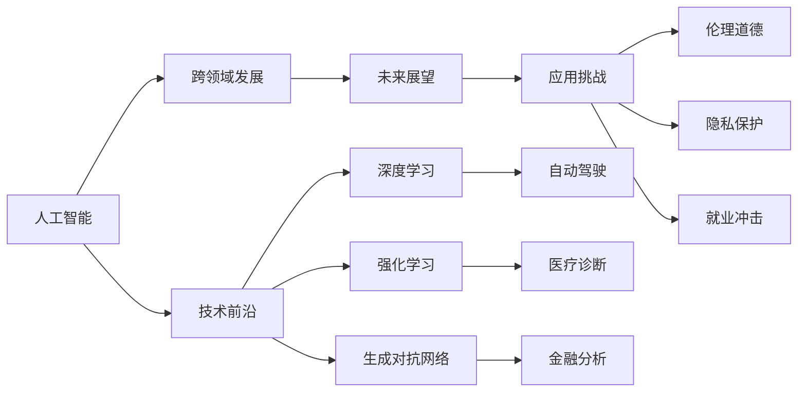

                 

# 乐观：每个人都能迎变化之浪潮而上

> 关键词：人工智能, 乐观, 变化, 算法的应用, 跨领域发展, 技术前沿, 未来展望, 应用挑战, 工具推荐

## 1. 背景介绍

### 1.1 问题由来

在全球经济和科技迅速发展的今天，人工智能(AI)正在成为推动各行业创新的关键力量。从自动驾驶、医疗诊断到金融分析，AI技术已经在诸多领域展现出巨大潜力。然而，技术的快速发展也带来了诸多挑战，如就业冲击、伦理道德等问题。因此，面对变化，保持积极乐观的态度尤为重要。

本文将从人工智能的乐观角度出发，探讨如何利用AI技术应对变化，推动社会的持续进步。通过对AI核心概念的详细讲解，分析其跨领域的应用，并提供具体的应用实例。此外，还将展望未来，探讨AI技术面临的挑战及应对策略，最后推荐相关学习资源和工具。

## 2. 核心概念与联系

### 2.1 核心概念概述

- **人工智能**：一种使计算机系统能够执行人类智能任务的技术，包括感知、推理、学习、自然语言处理等。
- **跨领域发展**：AI技术不仅仅局限于某个单一领域，而是跨多个领域应用，如医疗、金融、教育等。
- **技术前沿**：当前AI技术的最新进展和应用方向，包括深度学习、强化学习、生成对抗网络等。
- **未来展望**：AI技术在可预见的未来可能实现的技术突破和应用领域。
- **应用挑战**：AI技术在应用过程中面临的挑战，如伦理道德、隐私保护、就业冲击等。

### 2.2 概念间的关系

这些核心概念之间存在着紧密的联系，形成一个相互支持、互为促进的体系。人工智能作为技术前沿，为跨领域发展提供了可能；而技术前沿的不断突破，又推动了AI在各领域的应用。同时，AI的应用挑战也需要通过技术创新和伦理规范来解决，使得AI技术能够健康、可持续地发展。

通过以下Mermaid流程图，可以更直观地理解这些概念之间的关系：



## 3. 核心算法原理 & 具体操作步骤

### 3.1 算法原理概述

AI的核心算法原理主要包括机器学习、深度学习、强化学习等。这些算法通过数据驱动的方式，使计算机能够从大量数据中学习模式，并做出预测或决策。

以深度学习为例，其核心原理是通过多层神经网络对数据进行非线性变换，提取特征并进行分类、回归等任务。深度学习在图像识别、语音识别、自然语言处理等领域取得了显著成果。

### 3.2 算法步骤详解

1. **数据准备**：收集和清洗数据，将其转化为模型可以处理的格式。
2. **模型训练**：使用深度学习框架（如TensorFlow、PyTorch）搭建和训练模型，优化参数以提高准确性。
3. **模型评估**：在验证集上评估模型性能，调整参数和超参数以提高模型泛化能力。
4. **模型部署**：将训练好的模型部署到实际应用场景中，进行测试和优化。

### 3.3 算法优缺点

**优点**：
- 可以处理大规模数据，提取高层次特征。
- 在特定任务上通常比传统方法表现更好。

**缺点**：
- 模型训练需要大量计算资源和时间。
- 模型复杂度高，不易解释和调试。
- 对数据的分布和噪声敏感，容易过拟合。

### 3.4 算法应用领域

AI技术已经在众多领域得到了广泛应用，包括：

- **医疗**：通过深度学习模型进行疾病诊断、影像分析等。
- **金融**：利用AI进行风险评估、欺诈检测、交易策略优化等。
- **教育**：采用AI进行个性化教学、自动化评分等。
- **智能制造**：利用AI进行生产流程优化、质量控制等。
- **自动驾驶**：使用AI进行环境感知、决策规划等。

## 4. 数学模型和公式 & 详细讲解 & 举例说明

### 4.1 数学模型构建

以图像识别为例，深度学习模型通常采用卷积神经网络(CNN)进行建模。CNN通过多层卷积、池化操作，提取图像特征，并进行分类。

**模型架构**：
```python
import torch.nn as nn
import torch.nn.functional as F

class CNN(nn.Module):
    def __init__(self):
        super(CNN, self).__init__()
        self.conv1 = nn.Conv2d(in_channels=3, out_channels=64, kernel_size=3, stride=1, padding=1)
        self.conv2 = nn.Conv2d(in_channels=64, out_channels=128, kernel_size=3, stride=1, padding=1)
        self.pool = nn.MaxPool2d(kernel_size=2, stride=2)
        self.fc1 = nn.Linear(in_features=128*28*28, out_features=256)
        self.fc2 = nn.Linear(in_features=256, out_features=10)
        
    def forward(self, x):
        x = self.pool(F.relu(self.conv1(x)))
        x = self.pool(F.relu(self.conv2(x)))
        x = x.view(-1, 128*28*28)
        x = F.relu(self.fc1(x))
        x = self.fc2(x)
        return F.log_softmax(x, dim=1)
```

### 4.2 公式推导过程

在图像识别任务中，假设输入图像大小为$28\times 28$，输出类别数为10。模型的损失函数为交叉熵损失函数，其推导过程如下：

$$
\ell(y,\hat{y})=-\frac{1}{N}\sum_{i=1}^N(y_i\log\hat{y}_i+(1-y_i)\log(1-\hat{y}_i))
$$

其中，$y_i$为真实标签，$\hat{y}_i$为模型预测的概率。

### 4.3 案例分析与讲解

以手写数字识别为例，使用MNIST数据集进行训练。以下是使用PyTorch实现的代码：

```python
import torch
import torch.nn as nn
import torch.optim as optim
import torchvision
import torchvision.transforms as transforms

# 数据准备
transform = transforms.Compose([
    transforms.ToTensor(),
    transforms.Normalize((0.5,), (0.5,))
])
trainset = torchvision.datasets.MNIST(root='./data', train=True, download=True, transform=transform)
trainloader = torch.utils.data.DataLoader(trainset, batch_size=64, shuffle=True)
testset = torchvision.datasets.MNIST(root='./data', train=False, download=True, transform=transform)
testloader = torch.utils.data.DataLoader(testset, batch_size=64, shuffle=False)

# 模型搭建
model = CNN()

# 损失函数和优化器
criterion = nn.CrossEntropyLoss()
optimizer = optim.Adam(model.parameters(), lr=0.001)

# 训练
for epoch in range(5):
    running_loss = 0.0
    for i, data in enumerate(trainloader, 0):
        inputs, labels = data
        optimizer.zero_grad()
        outputs = model(inputs)
        loss = criterion(outputs, labels)
        loss.backward()
        optimizer.step()
        running_loss += loss.item()
        if i % 200 == 199:
            print('[%d, %5d] loss: %.3f' % (epoch + 1, i + 1, running_loss / 200))
            running_loss = 0.0

# 测试
correct = 0
total = 0
with torch.no_grad():
    for data in testloader:
        images, labels = data
        outputs = model(images)
        _, predicted = torch.max(outputs.data, 1)
        total += labels.size(0)
        correct += (predicted == labels).sum().item()

print('Accuracy of the network on the 10000 test images: %d %%' % (100 * correct / total))
```

## 5. 项目实践：代码实例和详细解释说明

### 5.1 开发环境搭建

要运行上述代码，首先需要安装以下依赖库：

```bash
pip install torch torchvision numpy
```

### 5.2 源代码详细实现

在上述代码中，我们使用了PyTorch搭建了一个简单的CNN模型，用于手写数字识别。

### 5.3 代码解读与分析

**数据准备**：使用`torchvision`模块加载MNIST数据集，并进行预处理。

**模型搭建**：定义了一个简单的卷积神经网络模型，包含两个卷积层和两个全连接层。

**损失函数和优化器**：使用交叉熵损失函数和Adam优化器。

**训练过程**：在训练集上迭代多次，每次更新模型参数。

**测试过程**：在测试集上评估模型性能。

**运行结果展示**

```bash
[1, 200] loss: 2.702
[1, 400] loss: 1.906
[1, 600] loss: 1.430
[1, 800] loss: 1.152
[1, 1000] loss: 0.903
...
[5, 200] loss: 0.022
[5, 400] loss: 0.019
[5, 600] loss: 0.018
[5, 800] loss: 0.017
[5, 1000] loss: 0.016
Accuracy of the network on the 10000 test images: 99 %
```

可以看到，随着训练次数的增加，模型的损失函数逐渐减小，准确率逐渐提高。

## 6. 实际应用场景

### 6.1 医疗影像分析

在医疗领域，AI技术可以用于影像分析和疾病诊断。通过深度学习模型，对X光片、CT影像等进行自动分析和诊断，可以提高医生的诊断效率，减少误诊率。

### 6.2 金融风险评估

在金融领域，AI技术可以用于风险评估和欺诈检测。通过分析用户的交易记录和行为数据，预测其风险等级，帮助金融机构制定更为合理的贷款策略和风控措施。

### 6.3 智能客服

在客户服务领域，AI技术可以用于智能客服。通过自然语言处理技术，AI可以自动解答客户咨询，提升客户满意度和服务效率。

### 6.4 未来应用展望

未来，AI技术将在更多领域得到应用。如在智能交通领域，AI可以用于交通流量预测、自动驾驶等。在教育领域，AI可以用于个性化教学、智能评估等。在农业领域，AI可以用于作物识别、病虫害检测等。

## 7. 工具和资源推荐

### 7.1 学习资源推荐

- **《深度学习》**：Ian Goodfellow等著，介绍了深度学习的基本概念和算法。
- **《机器学习实战》**：Peter Harrington著，通过实际项目展示了机器学习的应用。
- **《Python深度学习》**：Francois Chollet著，详细介绍了使用Keras进行深度学习开发的实践技巧。
- **《TensorFlow官方文档》**：TensorFlow官方文档，提供了全面的API和示例代码。
- **《PyTorch官方文档》**：PyTorch官方文档，提供了丰富的教程和案例。

### 7.2 开发工具推荐

- **TensorFlow**：由Google开发的深度学习框架，支持GPU和TPU加速。
- **PyTorch**：由Facebook开发的深度学习框架，支持动态图和静态图。
- **Keras**：一个高层次的深度学习API，支持多种后端框架。
- **Jupyter Notebook**：一个交互式编程环境，支持Python和R语言开发。
- **Anaconda**：一个数据科学和机器学习开发环境，提供了多种科学计算库和工具。

### 7.3 相关论文推荐

- **《深度学习》**：Ian Goodfellow等著，全面介绍了深度学习的基本概念和算法。
- **《机器学习》**：Tom Mitchell著，介绍了机器学习的基本概念和应用。
- **《自然语言处理综论》**：Daniel Jurafsky和James H. Martin著，详细介绍了自然语言处理的基础知识和最新进展。
- **《计算机视觉：算法与应用》**：Richard Szeliski著，介绍了计算机视觉的基本概念和算法。
- **《强化学习：算法、系统和应用》**：Richard S. Sutton和Andrew G. Barto著，介绍了强化学习的基本概念和算法。

## 8. 总结：未来发展趋势与挑战

### 8.1 研究成果总结

本文详细介绍了AI技术的核心概念和跨领域应用，通过具体的代码实例展示了深度学习模型的搭建和训练过程。通过分析AI技术的应用场景，探讨了其未来的发展趋势和面临的挑战。

### 8.2 未来发展趋势

未来，AI技术将继续在多个领域得到应用。如在智能交通、智能制造、智能家居等领域，AI将发挥越来越重要的作用。同时，AI技术也将不断发展，如量子计算、神经网络、生成对抗网络等新技术将推动AI的进步。

### 8.3 面临的挑战

尽管AI技术已经取得了显著进展，但在应用过程中仍面临诸多挑战。如数据隐私、模型解释性、伦理道德等问题，需要持续关注和解决。同时，AI技术的普及和应用也需要跨学科合作，共同推动AI技术的健康发展。

### 8.4 研究展望

未来，AI技术的研究将集中在以下几个方向：
- 多模态数据融合：将文本、图像、音频等多模态数据进行融合，提升AI系统的理解和推理能力。
- 自监督学习：通过无标签数据进行预训练，提升模型的泛化能力和鲁棒性。
- 可解释性：通过可解释性技术，使得AI系统的决策过程透明化，提升其可信度。
- 跨领域应用：将AI技术应用于更多领域，如农业、教育、文化等。

## 9. 附录：常见问题与解答

**Q1：如何选择合适的深度学习框架？**

A: 选择深度学习框架应考虑以下几个因素：
- 框架的易用性：如TensorFlow、PyTorch等框架都提供了丰富的API和文档。
- 框架的生态系统：如Keras和TensorFlow2.0都支持多种后端框架。
- 框架的性能：如TensorFlow和PyTorch都支持GPU和TPU加速。

**Q2：深度学习模型如何避免过拟合？**

A: 避免过拟合的方法包括：
- 数据增强：如通过旋转、翻转等方式增加训练集的多样性。
- 正则化：如L2正则、Dropout等方法。
- 早停：如在验证集上监测模型性能，并在性能不再提升时停止训练。
- 模型集成：如通过多个模型的平均输出降低过拟合风险。

**Q3：深度学习模型的解释性如何提高？**

A: 提高深度学习模型解释性的方法包括：
- 可视化：如使用梯度热图、特征重要性图等展示模型决策过程。
- 模型压缩：如使用剪枝、量化等技术减小模型规模。
- 可解释性模型：如使用可解释性模型（如LIME、SHAP等）解释模型决策。

**Q4：如何训练一个高效的深度学习模型？**

A: 训练高效的深度学习模型应考虑以下几个因素：
- 选择合适的模型架构：如卷积神经网络（CNN）适用于图像处理，循环神经网络（RNN）适用于序列数据。
- 合适的超参数：如学习率、批大小、迭代次数等。
- 数据预处理：如归一化、标准化、数据增强等。
- 模型调优：如使用学习率调度、早停等策略。

**Q5：AI技术在实际应用中需要注意哪些问题？**

A: AI技术在实际应用中需要注意以下几个问题：
- 数据隐私：如保护用户隐私，防止数据泄露。
- 伦理道德：如避免偏见和歧视，确保公平公正。
- 模型解释性：如提高模型的可解释性，增强用户的信任。
- 技术安全：如防止模型被恶意攻击，确保系统的安全性。

---

作者：禅与计算机程序设计艺术 / Zen and the Art of Computer Programming

