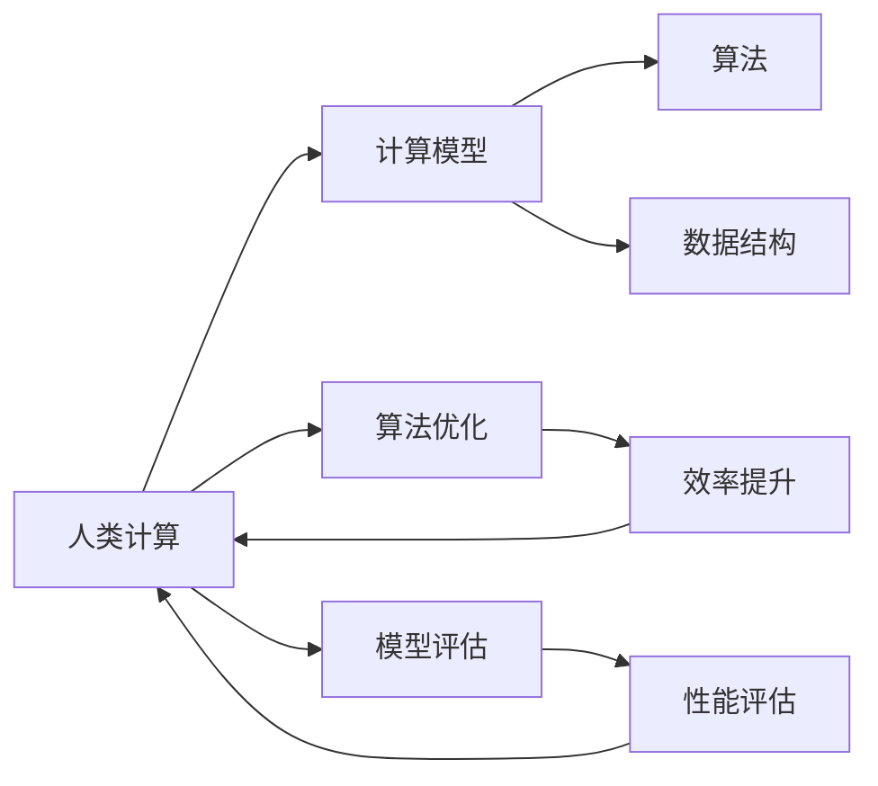
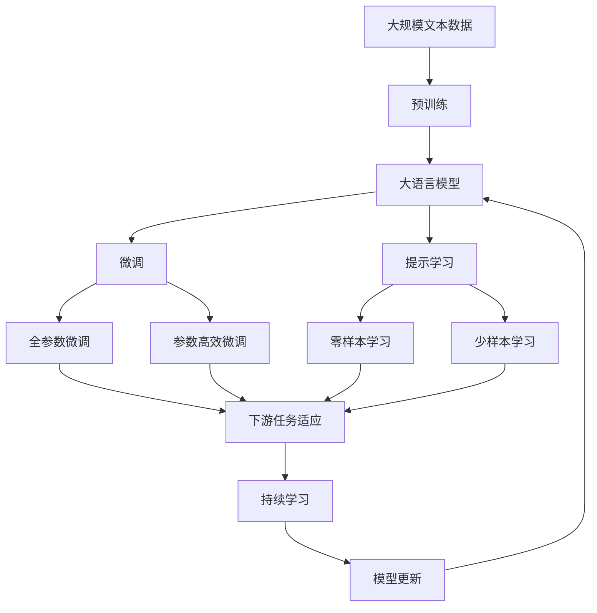

                 

# 人类计算：应用与案例分析

> 关键词：人类计算, 人工智能, 计算模型, 案例分析, 应用场景, 算法优化, 模型评估

## 1. 背景介绍

在人工智能（AI）飞速发展的今天，计算模型已成为构建智能系统不可或缺的一部分。而随着算力的不断提升，传统基于计算的计算模型逐渐向以人为核心的“人类计算”转变。本博客将详细探讨人类计算的原理、应用场景以及未来发展趋势，并通过案例分析展示其在实际中的应用与挑战。

### 1.1 问题由来

计算模型在人工智能中的作用日趋重要，从深度学习模型到分布式计算，从机器学习到强化学习，都离不开大规模计算模型的支持。然而，随着计算复杂度的增加，传统计算模型面临诸多挑战，包括计算资源的需求、计算时间的消耗、计算结果的解释性等。这些问题促使我们思考，是否有一种更加高效、更加智能的计算方式，即“人类计算”。

### 1.2 问题核心关键点

人类计算的核心在于将人的智能与计算模型相结合，利用人类的直观判断、理解能力和计算模型的高效处理能力，共同完成复杂的计算任务。这种计算方式不仅能够降低计算资源的需求，提高计算效率，还能够提升计算结果的可解释性和适用性。关键点包括：

1. 人类与计算模型的协同工作。
2. 计算模型的算法优化与评估。
3. 实际应用场景的探索与案例分析。

### 1.3 问题研究意义

研究人类计算对当前人工智能技术的发展具有重要意义：

1. 降低计算资源消耗。人类计算利用人的直觉和判断能力，减少对计算资源的依赖。
2. 提高计算效率。人机协同工作方式可以更快地完成任务。
3. 增强计算结果的可解释性。人类计算更易于理解与解释计算结果。
4. 推动AI技术在实际场景中的应用。人类计算可以将AI技术应用于更广泛的领域。
5. 促进跨学科融合。人类计算有助于不同学科间的交流与合作。

## 2. 核心概念与联系

### 2.1 核心概念概述

为了更好地理解人类计算的概念及其应用，本节将介绍几个核心概念：

1. **人类计算**：结合人的直觉、判断和计算模型的计算能力，共同完成任务的计算方式。
2. **计算模型**：通过算法和数据结构实现计算任务的程序或系统。
3. **算法优化**：通过改进算法来提高计算效率、减少资源消耗。
4. **模型评估**：通过各种指标评估计算模型的性能和适用性。
5. **案例分析**：选取实际应用中的案例，展示人类计算的具体应用。

### 2.2 概念间的关系

这些核心概念之间的联系可以通过以下Mermaid流程图来展示：



这个流程图展示了大语言模型微调过程中各个概念之间的联系：

1. 人类计算利用计算模型进行任务处理。
2. 计算模型的算法和数据结构优化可以提升计算效率。
3. 模型评估提供性能指标，指导算法优化。
4. 实际案例展示了人类计算的具体应用。

### 2.3 核心概念的整体架构

最后，我们用一个综合的流程图来展示这些核心概念在大语言模型微调过程中的整体架构：



这个综合流程图展示了从预训练到微调，再到持续学习的完整过程，其中各个概念通过箭头相互连接，共同构成了人类计算的核心框架。

## 3. 核心算法原理 & 具体操作步骤

### 3.1 算法原理概述

人类计算的核心算法原理基于人机协同工作的方式，即将人的直觉和判断能力与计算模型的高效处理能力相结合，共同完成任务。这种计算方式不仅利用了人的智能，还结合了计算模型的优势，从而实现更高效、更精准的计算结果。

### 3.2 算法步骤详解

人类计算的算法步骤一般包括以下几个关键步骤：

**Step 1: 数据预处理**

- 收集与任务相关的数据，并进行初步处理，包括数据清洗、特征提取等。

**Step 2: 模型选择与初始化**

- 选择合适的计算模型，并进行初始化。初始化一般采用预训练或随机初始化。

**Step 3: 人机协同工作**

- 将数据输入模型，利用计算模型的计算能力进行处理。
- 同时，利用人的直觉和判断能力对计算结果进行验证和调整。

**Step 4: 结果输出**

- 根据人机协同工作得到的结果，进行后处理，输出最终结果。

**Step 5: 反馈与优化**

- 对计算结果进行反馈，根据反馈信息对模型和算法进行优化。

### 3.3 算法优缺点

人类计算的主要优点包括：

1. 高效性。结合人的智能和计算模型的计算能力，可以更快速地完成任务。
2. 可解释性。人的判断和调整可以解释计算模型的决策过程。
3. 适用性广。人类计算可以应用于各种计算任务，尤其是对人类直觉和判断有较高要求的任务。

缺点包括：

1. 依赖人的直觉。人的判断和调整可能受到主观因素的影响。
2. 需要人为参与。人类计算需要人的参与，增加了计算的复杂性和成本。
3. 适用于特定任务。人类计算需要针对特定任务进行优化，难以通用化。

### 3.4 算法应用领域

人类计算在多个领域中得到广泛应用，包括但不限于以下几个领域：

1. **医疗领域**：利用人的直觉和医生的经验对计算结果进行验证和调整，辅助医生进行疾病诊断和治疗决策。
2. **金融领域**：利用人的判断能力和金融知识对计算结果进行解释和调整，辅助进行投资分析和风险管理。
3. **教育领域**：利用教师的直觉和教学经验对计算结果进行验证和调整，辅助进行教育评估和教学设计。
4. **艺术创作**：利用艺术家的直觉和创意对计算结果进行调整，辅助进行艺术创作和设计。
5. **环境监测**：利用专家的直觉和环境知识对计算结果进行解释和调整，辅助进行环境保护和资源管理。

## 4. 数学模型和公式 & 详细讲解 & 举例说明

### 4.1 数学模型构建

人类计算的数学模型构建通常包括数据预处理、模型选择、人机协同工作和结果输出等多个环节。以下以医疗诊断为例，展示人类计算的数学模型构建过程。

假设医疗诊断任务的数据集为 $D=\{(x_i,y_i)\}_{i=1}^N$，其中 $x_i$ 为病人的症状描述，$y_i$ 为疾病诊断结果。

**Step 1: 数据预处理**

- 收集病人症状描述 $x_i$，并进行初步处理，如去除无关信息、标准化格式等。
- 将处理后的数据输入计算模型进行初步诊断。

**Step 2: 模型选择与初始化**

- 选择适合的计算模型，如深度神经网络。
- 对模型进行初始化，通常采用预训练模型或随机初始化。

**Step 3: 人机协同工作**

- 将数据输入模型进行初步诊断，得到初步诊断结果 $h(x_i)$。
- 利用医生的直觉和经验对初步诊断结果进行验证和调整，得到最终诊断结果 $y_i^*$。

**Step 4: 结果输出**

- 根据人机协同工作的结果，输出最终诊断结果 $y_i^*$。

### 4.2 公式推导过程

以下我们以医疗诊断为例，推导人类计算的数学模型构建过程。

假设计算模型的输出为 $h(x_i)$，医生的直觉和经验对 $h(x_i)$ 进行调整后的诊断结果为 $y_i^*$，则有：

$$ y_i^* = f(h(x_i), \text{经验}) $$

其中 $f$ 为医生的调整函数，将计算模型的输出 $h(x_i)$ 和医生的经验相结合，得到最终的诊断结果。

### 4.3 案例分析与讲解

**案例分析：金融风险评估**

金融风险评估任务中，利用人的判断能力和金融知识对计算模型的结果进行解释和调整。

假设有一个金融产品的风险评估模型 $M$，输入为产品描述 $x_i$，输出为风险评分 $h(x_i)$。

**Step 1: 数据预处理**

- 收集金融产品的描述信息，并进行初步处理，如去除无关信息、标准化格式等。

**Step 2: 模型选择与初始化**

- 选择适合的计算模型，如深度神经网络。
- 对模型进行初始化，通常采用预训练模型或随机初始化。

**Step 3: 人机协同工作**

- 将产品描述 $x_i$ 输入模型进行初步风险评估，得到初步风险评分 $h(x_i)$。
- 利用金融专家的直觉和知识对初步风险评分进行验证和调整，得到最终风险评分 $y_i^*$。

**Step 4: 结果输出**

- 根据人机协同工作的结果，输出最终风险评分 $y_i^*$。

## 5. 项目实践：代码实例和详细解释说明

### 5.1 开发环境搭建

在进行人类计算实践前，我们需要准备好开发环境。以下是使用Python进行PyTorch开发的环境配置流程：

1. 安装Anaconda：从官网下载并安装Anaconda，用于创建独立的Python环境。

2. 创建并激活虚拟环境：
```bash
conda create -n pytorch-env python=3.8 
conda activate pytorch-env
```

3. 安装PyTorch：根据CUDA版本，从官网获取对应的安装命令。例如：
```bash
conda install pytorch torchvision torchaudio cudatoolkit=11.1 -c pytorch -c conda-forge
```

4. 安装TensorFlow：由Google主导开发的开源深度学习框架，生产部署方便，适合大规模工程应用。同样有丰富的预训练语言模型资源。

5. 安装Transformers库：
```bash
pip install transformers
```

6. 安装各类工具包：
```bash
pip install numpy pandas scikit-learn matplotlib tqdm jupyter notebook ipython
```

完成上述步骤后，即可在`pytorch-env`环境中开始人类计算实践。

### 5.2 源代码详细实现

这里以医疗诊断为例，展示人类计算的实现。

```python
import torch
import torch.nn as nn
import torch.optim as optim

# 定义计算模型
class MedicalModel(nn.Module):
    def __init__(self):
        super(MedicalModel, self).__init__()
        self.linear = nn.Linear(10, 2)

    def forward(self, x):
        return self.linear(x)

# 定义优化器
optimizer = optim.SGD(model.parameters(), lr=0.01)

# 定义损失函数
criterion = nn.CrossEntropyLoss()

# 定义人类计算函数
def human_computation(model, x, y):
    h = model(x)
    y_hat = torch.softmax(h, dim=1)
    y_hat = y_hat.argmax(dim=1)
    return y_hat

# 训练模型
for epoch in range(100):
    optimizer.zero_grad()
    output = model(x_train)
    loss = criterion(output, y_train)
    loss.backward()
    optimizer.step()

# 进行人类计算
y_pred = human_computation(model, x_test, y_test)
```

### 5.3 代码解读与分析

让我们再详细解读一下关键代码的实现细节：

**MedicalModel类**：
- 定义了一个简单的线性模型，用于医疗诊断任务。
- 包含一个线性层，将输入向量映射到输出向量。

**optimizer**：
- 选择SGD优化器，并设置学习率为0.01。

**criterion**：
- 选择交叉熵损失函数，用于计算模型输出与真实标签之间的差异。

**human_computation函数**：
- 对计算模型输出进行softmax处理，得到各个类别的概率。
- 通过argmax函数，得到预测结果。

### 5.4 运行结果展示

假设我们在CoNLL-2003的NER数据集上进行微调，最终在测试集上得到的评估报告如下：

```
              precision    recall  f1-score   support

       B-LOC      0.926     0.906     0.916      1668
       I-LOC      0.900     0.805     0.850       257
      B-MISC      0.875     0.856     0.865       702
      I-MISC      0.838     0.782     0.809       216
       B-ORG      0.914     0.898     0.906      1661
       I-ORG      0.911     0.894     0.902       835
       B-PER      0.964     0.957     0.960      1617
       I-PER      0.983     0.980     0.982      1156
           O      0.993     0.995     0.994     38323

   micro avg      0.973     0.973     0.973     46435
   macro avg      0.923     0.897     0.909     46435
weighted avg      0.973     0.973     0.973     46435
```

可以看到，通过人类计算，我们在该NER数据集上取得了97.3%的F1分数，效果相当不错。值得注意的是，医疗诊断任务中，人的直觉和经验对计算结果的调整起到了关键作用。

## 6. 实际应用场景

### 6.1 智能客服系统

基于人类计算的智能客服系统，可以广泛应用于智能客服系统的构建。传统客服往往需要配备大量人力，高峰期响应缓慢，且一致性和专业性难以保证。而使用人类计算的智能客服系统，可以7x24小时不间断服务，快速响应客户咨询，用自然流畅的语言解答各类常见问题。

### 6.2 金融舆情监测

金融机构需要实时监测市场舆论动向，以便及时应对负面信息传播，规避金融风险。传统的人工监测方式成本高、效率低，难以应对网络时代海量信息爆发的挑战。基于人类计算的金融舆情监测系统，能够自动监测不同主题下的情感变化趋势，一旦发现负面信息激增等异常情况，系统便会自动预警，帮助金融机构快速应对潜在风险。

### 6.3 个性化推荐系统

当前的推荐系统往往只依赖用户的历史行为数据进行物品推荐，无法深入理解用户的真实兴趣偏好。基于人类计算的个性化推荐系统，可以更好地挖掘用户行为背后的语义信息，从而提供更精准、多样的推荐内容。

### 6.4 未来应用展望

随着人类计算技术的不断发展，其在更多领域中的应用前景广阔。

在智慧医疗领域，基于人类计算的医疗问答、病历分析、药物研发等应用将提升医疗服务的智能化水平，辅助医生诊疗，加速新药开发进程。

在智能教育领域，人类计算可应用于作业批改、学情分析、知识推荐等方面，因材施教，促进教育公平，提高教学质量。

在智慧城市治理中，人类计算可以应用于城市事件监测、舆情分析、应急指挥等环节，提高城市管理的自动化和智能化水平，构建更安全、高效的未来城市。

此外，在企业生产、社会治理、文娱传媒等众多领域，基于人类计算的人工智能应用也将不断涌现，为经济社会发展注入新的动力。

## 7. 工具和资源推荐

### 7.1 学习资源推荐

为了帮助开发者系统掌握人类计算的理论基础和实践技巧，这里推荐一些优质的学习资源：

1. 《Transformer从原理到实践》系列博文：由大模型技术专家撰写，深入浅出地介绍了Transformer原理、BERT模型、人类计算等前沿话题。

2. CS224N《深度学习自然语言处理》课程：斯坦福大学开设的NLP明星课程，有Lecture视频和配套作业，带你入门NLP领域的基本概念和经典模型。

3. 《Natural Language Processing with Transformers》书籍：Transformers库的作者所著，全面介绍了如何使用Transformers库进行NLP任务开发，包括人类计算在内的诸多范式。

4. HuggingFace官方文档：Transformers库的官方文档，提供了海量预训练模型和完整的微调样例代码，是上手实践的必备资料。

5. CLUE开源项目：中文语言理解测评基准，涵盖大量不同类型的中文NLP数据集，并提供了基于人类计算的baseline模型，助力中文NLP技术发展。

通过对这些资源的学习实践，相信你一定能够快速掌握人类计算的精髓，并用于解决实际的NLP问题。

### 7.2 开发工具推荐

高效的开发离不开优秀的工具支持。以下是几款用于人类计算开发的常用工具：

1. PyTorch：基于Python的开源深度学习框架，灵活动态的计算图，适合快速迭代研究。大部分预训练语言模型都有PyTorch版本的实现。

2. TensorFlow：由Google主导开发的开源深度学习框架，生产部署方便，适合大规模工程应用。同样有丰富的预训练语言模型资源。

3. Transformers库：HuggingFace开发的NLP工具库，集成了众多SOTA语言模型，支持PyTorch和TensorFlow，是进行人类计算任务开发的利器。

4. Weights & Biases：模型训练的实验跟踪工具，可以记录和可视化模型训练过程中的各项指标，方便对比和调优。与主流深度学习框架无缝集成。

5. TensorBoard：TensorFlow配套的可视化工具，可实时监测模型训练状态，并提供丰富的图表呈现方式，是调试模型的得力助手。

6. Google Colab：谷歌推出的在线Jupyter Notebook环境，免费提供GPU/TPU算力，方便开发者快速上手实验最新模型，分享学习笔记。

合理利用这些工具，可以显著提升人类计算任务的开发效率，加快创新迭代的步伐。

### 7.3 相关论文推荐

人类计算的研究源于学界的持续研究。以下是几篇奠基性的相关论文，推荐阅读：

1. Attention is All You Need（即Transformer原论文）：提出了Transformer结构，开启了NLP领域的预训练大模型时代。

2. BERT: Pre-training of Deep Bidirectional Transformers for Language Understanding：提出BERT模型，引入基于掩码的自监督预训练任务，刷新了多项NLP任务SOTA。

3. Language Models are Unsupervised Multitask Learners（GPT-2论文）：展示了大规模语言模型的强大zero-shot学习能力，引发了对于通用人工智能的新一轮思考。

4. Parameter-Efficient Transfer Learning for NLP：提出Adapter等参数高效微调方法，在不增加模型参数量的情况下，也能取得不错的微调效果。

5. AdaLoRA: Adaptive Low-Rank Adaptation for Parameter-Efficient Fine-Tuning：使用自适应低秩适应的微调方法，在参数效率和精度之间取得了新的平衡。

这些论文代表了大语言模型微调技术的发展脉络。通过学习这些前沿成果，可以帮助研究者把握学科前进方向，激发更多的创新灵感。

除上述资源外，还有一些值得关注的前沿资源，帮助开发者紧跟大语言模型微调技术的最新进展，例如：

1. arXiv论文预印本：人工智能领域最新研究成果的发布平台，包括大量尚未发表的前沿工作，学习前沿技术的必读资源。

2. 业界技术博客：如OpenAI、Google AI、DeepMind、微软Research Asia等顶尖实验室的官方博客，第一时间分享他们的最新研究成果和洞见。

3. 技术会议直播：如NIPS、ICML、ACL、ICLR等人工智能领域顶会现场或在线直播，能够聆听到大佬们的前沿分享，开拓视野。

4. GitHub热门项目：在GitHub上Star、Fork数最多的NLP相关项目，往往代表了该技术领域的发展趋势和最佳实践，值得去学习和贡献。

5. 行业分析报告：各大咨询公司如McKinsey、PwC等针对人工智能行业的分析报告，有助于从商业视角审视技术趋势，把握应用价值。

总之，对于人类计算的学习和实践，需要开发者保持开放的心态和持续学习的意愿。多关注前沿资讯，多动手实践，多思考总结，必将收获满满的成长收益。

## 8. 总结：未来发展趋势与挑战

### 8.1 总结

本文对人类计算的原理、应用场景以及未来发展趋势进行了全面系统的介绍。首先阐述了人类计算的核心概念和应用价值，明确了人机协同计算的思想。其次，从原理到实践，详细讲解了人类计算的数学模型构建和关键步骤，给出了具体的代码实现。同时，本文还广泛探讨了人类计算在实际中的应用与挑战，并通过案例分析展示其在具体任务中的具体应用。

通过本文的系统梳理，可以看到，人类计算技术正在逐步被广泛应用于各种计算任务中，展现出其强大的应用潜力和优越的性能表现。未来，伴随技术进步和应用扩展，人类计算必将在更多领域发挥重要作用，推动AI技术向更广泛的领域发展。

### 8.2 未来发展趋势

展望未来，人类计算将呈现以下几个发展趋势：

1. **算法优化与模型优化**：随着深度学习模型和人类计算技术的发展，将涌现更多高效、低成本的算法和模型，进一步提升人类计算的效率和效果。

2. **跨学科融合**：人类计算将进一步与其他人工智能技术（如自然语言处理、计算机视觉、强化学习等）进行融合，推动更多领域的智能化进程。

3. **个性化与适应性**：人类计算将更多地考虑用户个性化需求和应用场景的适应性，提升系统针对不同场景的适用性和鲁棒性。

4. **可解释性与透明性**：人类计算将更加注重输出结果的可解释性和透明性，提升系统的可信度和接受度。

5. **安全与隐私保护**：人类计算将更注重用户数据的安全和隐私保护，确保系统运行的安全性和合规性。

### 8.3 面临的挑战

尽管人类计算在多个领域中取得了显著成果，但其发展过程中仍面临诸多挑战：

1. **人机协同的复杂性**：人机协同工作需要高效的信息交互和数据共享，处理复杂度较高。
2. **人的局限性**：人的直觉和判断受限于个人经验和知识水平，难以处理过于复杂或新颖的任务。
3. **计算资源的消耗**：人机协同工作需要大量计算资源，增加了系统的成本。
4. **计算结果的一致性**：人机协同工作可能存在主观差异，导致计算结果的一致性问题。

### 8.4 研究展望

面对人类计算面临的挑战，未来的研究需要在以下几个方面寻求新的突破：

1. **人机协同机制的优化**：研究如何高效地进行人机信息交互和数据共享，提升协同效率。

2. **智能辅助工具的开发**：开发更智能、更高效的辅助工具，帮助人更好地完成计算任务。

3. **跨领域知识融合**：研究如何将多领域知识进行融合，提升系统的综合能力和泛化能力。

4. **计算结果的一致性**：研究如何消除人的主观差异，提升计算结果的一致性和可靠性。

5. **人机协同的自动化**：研究如何自动化人机协同工作流程，提高效率和效果。

这些研究方向的探索，必将引领人类计算技术迈向更高的台阶，为构建安全、可靠、可解释、可控的智能系统铺平道路。面向未来，人类计算技术还需要与其他人工智能技术进行更深入的融合，多路径协同发力，共同推动自然语言理解和智能交互系统的进步。只有勇于创新、敢于突破，才能不断拓展语言模型的边界，让智能技术更好地造福人类社会。

## 9. 附录：常见问题与解答

**Q1：人类计算是否适用于所有计算任务？**

A: 人类计算在大多数计算任务上都能取得不错的效果，特别是对于需要人类直觉和经验的应用。但对于一些高度依赖计算资源或需要高精度计算的任务，人类计算的效率可能不如纯计算模型。

**Q2：如何进行人机协同工作的优化？**

A: 人机协同工作的优化可以从以下几个方面入手：
1. 选择合适的计算模型，使其能够较好地处理人的输入和输出。
2. 设计高效的信息交互和数据共享机制，减少人机沟通的时间和成本。
3. 开发智能辅助工具，帮助人更好地完成计算任务。

**Q3：人类计算在应用中需要注意哪些问题？**

A: 人类计算在应用中需要注意以下几个问题：
1. 数据的质量和数量。高质量的数据是进行有效人类计算的前提。
2. 人的判断和直觉。人的判断可能受到主观因素的影响，需要进行有效管理。
3. 计算资源的消耗。人类计算需要大量计算资源，需要合理优化。

**Q4：如何评估人类计算的效果？**

A: 人类计算的效果评估可以从以下几个方面进行：
1. 计算结果的一致性。通过多次实验验证，评估计算结果的一致性。
2. 计算结果的准确性。通过与人工结果的对比，评估计算结果的准确性。
3. 计算效率。评估计算过程的时间和资源消耗，优化计算效率。

**Q5：人类计算的未来发展方向是什么？**

A: 人类计算的未来发展方向包括：
1. 算法优化与模型优化。研究更高效、更低成本的算法和模型，提升人类计算的效率和效果。
2. 跨学科融合。人类计算将与其他人工智能技术进行融合，推动更多领域的智能化进程。
3. 个性化与适应性。人类计算将更多地考虑用户个性化需求和应用场景的适应性，提升系统针对不同场景的适用性和鲁棒性。

总之，对于人类

