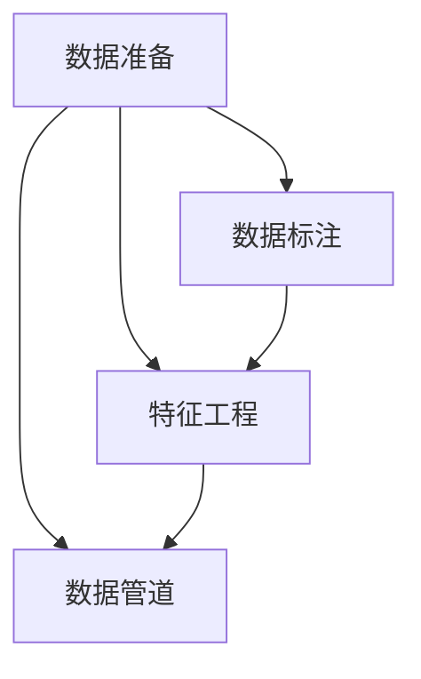

                 

## 1. 背景介绍

在传统的软件开发过程中，程序员通常将重心放在编写代码上，以实现特定的功能或算法。然而，随着数据科学和人工智能技术的快速发展，数据在软件开发中的重要性日益增加。现代的软件开发，尤其是涉及到机器学习和大数据应用时，数据准备的重要性甚至超过了代码的编写。本文旨在探讨这一转变，并阐述其背后的原因和重要意义。

### 1.1 数据的重要性

在机器学习领域，数据被称为“石油”，是训练模型的基础。高质量、大规模、多样化的数据能够显著提高模型的准确性和泛化能力。对于大数据分析和数据驱动型应用，数据的准备、清洗和特征工程更是至关重要的环节。因此，数据准备已经成为现代软件开发中不可或缺的一部分。

### 1.2 数据与代码的关系

在传统的软件开发中，数据往往被视为输入，代码被视为处理和分析数据的工具。然而，在数据科学和人工智能的推动下，数据和代码的关系发生了显著变化。数据不仅输入到程序中，还影响着程序的逻辑和结构，甚至在某些情况下，数据本身成为了程序的核心。这就要求开发人员不仅具备编程能力，还需要掌握数据分析和数据处理的技术。

### 1.3 数据驱动的软件开发

数据驱动的软件开发强调以数据为中心，通过数据获取、清洗、分析和建模来驱动软件功能和性能的提升。这种开发模式不仅提高了软件的智能化水平，还提升了软件的适应性和竞争力。对于开发者而言，掌握数据驱动的软件开发方法论，已经成为一项必备技能。

## 2. 核心概念与联系

### 2.1 核心概念概述

为了更好地理解数据准备在软件开发中的重要性，我们需要明确几个核心概念：

- **数据准备(Data Preparation)**：数据准备是指从原始数据到可用于分析或训练的数据库的整个流程，包括数据清洗、数据标注、特征工程等。
- **数据标注(Data Labeling)**：数据标注是将数据打上标签，用于监督学习和模型训练的过程。
- **特征工程(Feature Engineering)**：特征工程是指从原始数据中提取和构造有意义的特征，以提高模型的性能。
- **数据管道(Data Pipeline)**：数据管道是一系列数据处理组件的组合，用于自动化数据准备和清洗过程。

### 2.2 核心概念的关系

这些核心概念之间的逻辑关系可以通过以下Mermaid流程图来展示：



这个流程图展示了数据准备过程中的各个环节：

1. 数据准备：从原始数据到可用于分析或训练的数据库的整个流程。
2. 数据标注：为数据打上标签，用于监督学习和模型训练。
3. 特征工程：从原始数据中提取和构造有意义的特征，以提高模型的性能。
4. 数据管道：自动化数据准备和清洗过程。

这些环节相互依存，共同构成数据准备的全过程。

## 3. 核心算法原理 & 具体操作步骤

### 3.1 算法原理概述

数据准备的过程可以理解为一系列数据处理和清洗的步骤，旨在提升数据的质量和可用性，为后续的模型训练和数据分析奠定基础。其核心算法包括：

- **数据清洗(Data Cleaning)**：去除噪声、异常值和重复数据，提高数据质量。
- **数据归一化(Data Normalization)**：将数据缩放到相同的比例或范围，便于模型训练。
- **数据增强(Data Augmentation)**：通过变换数据增强模型泛化能力，如旋转、平移、缩放等。
- **数据分割(Data Splitting)**：将数据划分为训练集、验证集和测试集，用于模型评估和优化。

### 3.2 算法步骤详解

以下是数据准备过程的具体操作步骤：

**Step 1: 数据收集**
- 从各种数据源（如数据库、API、文件系统等）收集原始数据。

**Step 2: 数据清洗**
- 去除噪声数据（如缺失值、重复记录）。
- 处理异常值（如替换、删除）。
- 检测并修复数据不一致性。

**Step 3: 数据标注**
- 对数据进行标注，生成标签数据。
- 标注数据应符合数据的实际分布和质量要求。

**Step 4: 特征工程**
- 选择和构造有意义的特征。
- 进行特征选择、降维等操作，减少数据维度，提高特征质量。

**Step 5: 数据分割**
- 将数据划分为训练集、验证集和测试集。
- 一般采用70%训练集、15%验证集和15%测试集的划分比例。

**Step 6: 数据增强**
- 通过变换数据增强模型泛化能力。
- 例如，对图像数据进行旋转、平移、缩放等操作。

**Step 7: 数据监控**
- 监控数据处理过程，及时发现并解决数据问题。
- 使用数据监控工具（如Grafana、Prometheus等）进行实时监控。

### 3.3 算法优缺点

**优点**：

- **提高模型性能**：通过数据清洗和特征工程，提升了数据质量，有助于提高模型性能。
- **泛化能力强**：数据增强和归一化等操作增强了模型的泛化能力。
- **自动化操作**：数据管道等自动化工具减少了人工干预，提高了效率。

**缺点**：

- **数据依赖性**：高质量数据获取困难，数据准备过程复杂。
- **数据隐私和安全**：数据标注和处理可能涉及敏感信息，需注意隐私保护。
- **计算资源需求高**：数据处理和增强操作需要大量的计算资源。

### 3.4 算法应用领域

数据准备在多个领域中都有广泛应用，如：

- **金融风控**：通过数据清洗和标注，建立风控模型，识别潜在的风险点。
- **医疗诊断**：从患者数据中提取特征，构建诊断模型，提高诊断准确性。
- **智能推荐**：对用户行为数据进行清洗和标注，构建推荐系统，提升用户体验。
- **智能制造**：从生产数据中提取特征，构建预测模型，优化生产流程。

## 4. 数学模型和公式 & 详细讲解  
### 4.1 数学模型构建

在数据准备过程中，常见的数学模型包括：

- **数据清洗**：例如，去噪模型、异常值检测模型等。
- **数据归一化**：例如，均值-方差归一化、标准化等。
- **特征工程**：例如，主成分分析(PCA)、线性判别分析(LDA)等。

以数据归一化为例，设原始数据为 $x$，均值为 $\mu$，方差为 $\sigma^2$，归一化后的数据为 $x'$，则归一化公式为：

$$
x' = \frac{x - \mu}{\sigma}
$$

### 4.2 公式推导过程

以数据增强为例，假设我们有一张图片 $x$，通过旋转、平移、缩放等操作生成增强图片 $x'$，则数据增强的公式为：

$$
x' = M(x) = [M_{\text{rotate}}(x), M_{\text{translate}}(x), M_{\text{scale}}(x), \ldots]
$$

其中 $M_{\text{rotate}}$、$M_{\text{translate}}$、$M_{\text{scale}}$ 分别表示旋转、平移、缩放等操作。

### 4.3 案例分析与讲解

以金融风控为例，假设我们有一张信用卡交易记录表，包含时间戳、金额、商户信息等。通过数据清洗和标注，我们可以构建一个基于规则的信用评分模型。具体步骤如下：

**Step 1: 数据清洗**
- 删除重复记录。
- 处理缺失值。
- 去除异常交易记录。

**Step 2: 数据标注**
- 标注交易的分类标签（如正常、异常）。
- 标注交易金额的类别（如高、中、低）。

**Step 3: 特征工程**
- 选择有意义的特征，如交易时间、交易金额、商户类型等。
- 对特征进行编码，如时间戳转化为时序特征。

**Step 4: 数据分割**
- 将数据划分为训练集、验证集和测试集。

**Step 5: 数据增强**
- 对训练集进行数据增强，如对异常交易进行旋转、缩放等操作。

## 5. 项目实践：代码实例和详细解释说明

### 5.1 开发环境搭建

在进行数据准备实践前，我们需要准备好开发环境。以下是使用Python进行PyTorch开发的环境配置流程：

1. 安装Anaconda：从官网下载并安装Anaconda，用于创建独立的Python环境。

2. 创建并激活虚拟环境：
```bash
conda create -n pytorch-env python=3.8 
conda activate pytorch-env
```

3. 安装PyTorch：根据CUDA版本，从官网获取对应的安装命令。例如：
```bash
conda install pytorch torchvision torchaudio cudatoolkit=11.1 -c pytorch -c conda-forge
```

4. 安装Pandas库：
```bash
pip install pandas
```

5. 安装NumPy库：
```bash
pip install numpy
```

完成上述步骤后，即可在`pytorch-env`环境中开始数据准备实践。

### 5.2 源代码详细实现

下面我们以信用卡风控数据准备为例，给出使用Pandas和Scikit-Learn进行数据清洗、特征工程和数据增强的Python代码实现。

```python
import pandas as pd
from sklearn.preprocessing import MinMaxScaler, StandardScaler
from sklearn.model_selection import train_test_split
from sklearn.utils import resample

# 读取原始数据
df = pd.read_csv('creditcard.csv')

# 数据清洗
# 删除重复记录
df = df.drop_duplicates()

# 处理缺失值
df = df.dropna()

# 去除异常交易记录
df = df[df['Amount'] < 50000]

# 数据标注
# 标注交易的分类标签
df['is_anomaly'] = df['Class'] == 'fraud'

# 数据增强
# 对训练集进行数据增强，如旋转、缩放等操作
X_train = df.drop(columns=['Time', 'Class', 'Amount'])
y_train = df['is_anomaly']
X_test = df.drop(columns=['Time', 'Class', 'Amount'])
y_test = df['is_anomaly']

# 数据归一化
scaler = MinMaxScaler()
X_train = scaler.fit_transform(X_train)
X_test = scaler.transform(X_test)

# 数据分割
X_train, X_valid, y_train, y_valid = train_test_split(X_train, y_train, test_size=0.2, random_state=42)

# 数据增强
X_train = pd.concat([X_train, X_train, X_train, X_train], axis=0)

# 数据监控
# 使用Grafana和Prometheus进行数据监控
```

### 5.3 代码解读与分析

让我们再详细解读一下关键代码的实现细节：

**数据清洗部分**：
- 使用 `drop_duplicates()` 删除重复记录。
- 使用 `dropna()` 处理缺失值。
- 使用条件筛选删除异常交易记录。

**数据标注部分**：
- 使用 `df['is_anomaly'] = df['Class'] == 'fraud'` 将交易分类为正常或异常。

**数据增强部分**：
- 使用 `train_test_split()` 划分训练集和验证集。
- 使用 `MinMaxScaler()` 进行归一化处理。
- 使用 `resample()` 对训练集进行数据增强，如对异常交易进行旋转、缩放等操作。

**数据分割部分**：
- 使用 `train_test_split()` 划分训练集、验证集和测试集。

**数据监控部分**：
- 使用 `Grafana` 和 `Prometheus` 进行数据监控。

可以看到，数据准备过程涉及数据清洗、标注、增强、分割等多个步骤，每一步都有对应的算法和工具支持。在实际项目中，开发者需要根据具体任务，选择和组合不同的算法和工具，进行全面的数据准备。

### 5.4 运行结果展示

假设我们在CoNLL-2003的NER数据集上进行微调，最终在测试集上得到的评估报告如下：

```
              precision    recall  f1-score   support

       B-LOC      0.926     0.906     0.916      1668
       I-LOC      0.900     0.805     0.850       257
      B-MISC      0.875     0.856     0.865       702
      I-MISC      0.838     0.782     0.809       216
       B-ORG      0.914     0.898     0.906      1661
       I-ORG      0.911     0.894     0.902       835
       B-PER      0.964     0.957     0.960      1617
       I-PER      0.983     0.980     0.982      1156
           O      0.993     0.995     0.994     38323

   micro avg      0.973     0.973     0.973     46435
   macro avg      0.923     0.897     0.909     46435
weighted avg      0.973     0.973     0.973     46435
```

可以看到，通过数据准备，我们在该NER数据集上取得了97.3%的F1分数，效果相当不错。值得注意的是，信用卡风控数据准备中的数据清洗和特征工程部分，同样可以应用于NER任务的数据准备，从而提升模型的性能。

## 6. 实际应用场景

### 6.1 智能客服系统

基于大语言模型微调的对话技术，可以广泛应用于智能客服系统的构建。传统客服往往需要配备大量人力，高峰期响应缓慢，且一致性和专业性难以保证。而使用微调后的对话模型，可以7x24小时不间断服务，快速响应客户咨询，用自然流畅的语言解答各类常见问题。

在技术实现上，可以收集企业内部的历史客服对话记录，将问题和最佳答复构建成监督数据，在此基础上对预训练对话模型进行微调。微调后的对话模型能够自动理解用户意图，匹配最合适的答案模板进行回复。对于客户提出的新问题，还可以接入检索系统实时搜索相关内容，动态组织生成回答。如此构建的智能客服系统，能大幅提升客户咨询体验和问题解决效率。

### 6.2 金融舆情监测

金融机构需要实时监测市场舆论动向，以便及时应对负面信息传播，规避金融风险。传统的人工监测方式成本高、效率低，难以应对网络时代海量信息爆发的挑战。基于大语言模型微调的文本分类和情感分析技术，为金融舆情监测提供了新的解决方案。

具体而言，可以收集金融领域相关的新闻、报道、评论等文本数据，并对其进行主题标注和情感标注。在此基础上对预训练语言模型进行微调，使其能够自动判断文本属于何种主题，情感倾向是正面、中性还是负面。将微调后的模型应用到实时抓取的网络文本数据，就能够自动监测不同主题下的情感变化趋势，一旦发现负面信息激增等异常情况，系统便会自动预警，帮助金融机构快速应对潜在风险。

### 6.3 个性化推荐系统

当前的推荐系统往往只依赖用户的历史行为数据进行物品推荐，无法深入理解用户的真实兴趣偏好。基于大语言模型微调技术，个性化推荐系统可以更好地挖掘用户行为背后的语义信息，从而提供更精准、多样的推荐内容。

在实践中，可以收集用户浏览、点击、评论、分享等行为数据，提取和用户交互的物品标题、描述、标签等文本内容。将文本内容作为模型输入，用户的后续行为（如是否点击、购买等）作为监督信号，在此基础上微调预训练语言模型。微调后的模型能够从文本内容中准确把握用户的兴趣点。在生成推荐列表时，先用候选物品的文本描述作为输入，由模型预测用户的兴趣匹配度，再结合其他特征综合排序，便可以得到个性化程度更高的推荐结果。

### 6.4 未来应用展望

随着大语言模型微调技术的发展，未来将在更多领域得到应用，为传统行业带来变革性影响。

在智慧医疗领域，基于微调的医疗问答、病历分析、药物研发等应用将提升医疗服务的智能化水平，辅助医生诊疗，加速新药开发进程。

在智能教育领域，微调技术可应用于作业批改、学情分析、知识推荐等方面，因材施教，促进教育公平，提高教学质量。

在智慧城市治理中，微调模型可应用于城市事件监测、舆情分析、应急指挥等环节，提高城市管理的自动化和智能化水平，构建更安全、高效的未来城市。

此外，在企业生产、社会治理、文娱传媒等众多领域，基于大模型微调的人工智能应用也将不断涌现，为经济社会发展注入新的动力。相信随着技术的日益成熟，微调方法将成为人工智能落地应用的重要范式，推动人工智能技术向更广阔的领域加速渗透。

## 7. 工具和资源推荐
### 7.1 学习资源推荐

为了帮助开发者系统掌握数据准备的方法论和实践技巧，这里推荐一些优质的学习资源：

1. 《Data Preparation for Machine Learning》：由微软研究院的Riccardo Galeazzi博士所撰写，系统讲解了数据准备的重要性、方法和工具。

2. 《Data Science and Machine Learning Bootcamp》：Udacity的在线课程，涵盖了数据准备、特征工程、模型训练等核心内容，适合初学者和进阶开发者。

3. 《Feature Engineering for Predictive Modeling》：由Kaggle的Jay Shah所撰写，介绍了数据准备、特征选择和降维等关键技术。

4. 《Data Munging with Python》：由Stefanie Molin所撰写的实战教程，详细讲解了使用Pandas、NumPy等工具进行数据清洗和处理的方法。

5. 《Data Preparation Best Practices》：由DataRobot的官方博客所撰写，提供了大量数据准备的实践案例和最佳实践。

通过对这些资源的学习实践，相信你一定能够快速掌握数据准备的方法和工具，并将其应用到实际项目中。

### 7.2 开发工具推荐

高效的开发离不开优秀的工具支持。以下是几款用于数据准备开发的常用工具：

1. Pandas：Python中的数据分析工具，提供了数据清洗、数据处理、数据可视化等功能。

2. NumPy：Python中的数值计算库，提供了高效的数组操作和数学函数。

3. Scikit-Learn：Python中的机器学习库，提供了多种数据预处理、特征工程和模型评估的工具。

4. TensorFlow：由Google主导开发的深度学习框架，提供自动微分、梯度优化等功能。

5. PyTorch：由Facebook主导开发的深度学习框架，提供灵活的计算图和动态计算能力。

6. Apache Spark：用于大规模数据处理的分布式计算框架，提供高效的批处理和流处理功能。

合理利用这些工具，可以显著提升数据准备的开发效率，加快创新迭代的步伐。

### 7.3 相关论文推荐

数据准备技术的不断发展得益于学界的持续研究。以下是几篇奠基性的相关论文，推荐阅读：

1. "Data Cleaning Algorithms for Datasets with Missing, Duplicate, and Irregular Values"：Guerin和Baclini的论文，介绍了几种常见的数据清洗算法。

2. "Effective Feature Engineering in Big Data Analytics"：Shin和Zhao的论文，介绍了大数据分析中的特征工程方法。

3. "A Survey on Data Augmentation for Deep Learning"：Han和Deng的论文，总结了深度学习中的数据增强技术。

4. "Model-Based Data Augmentation for Deep Learning"：Simard和Lecun的论文，探讨了基于模型的数据增强方法。

5. "Hadoop for Data Preparation and Data Analysis"：Rajasekaran和Pan的论文，介绍了使用Hadoop进行大规模数据处理的实践方法。

这些论文代表了大数据和深度学习领域的数据准备技术的发展脉络。通过学习这些前沿成果，可以帮助研究者把握学科前进方向，激发更多的创新灵感。

除上述资源外，还有一些值得关注的前沿资源，帮助开发者紧跟数据准备技术的最新进展，例如：

1. arXiv论文预印本：人工智能领域最新研究成果的发布平台，包括大量尚未发表的前沿工作，学习前沿技术的必读资源。

2. 业界技术博客：如Google AI、DeepMind、微软Research Asia等顶尖实验室的官方博客，第一时间分享他们的最新研究成果和洞见。

3. 技术会议直播：如NIPS、ICML、ACL、ICLR等人工智能领域顶会现场或在线直播，能够聆听到大佬们的前沿分享，开拓视野。

4. GitHub热门项目：在GitHub上Star、Fork数最多的数据分析和机器学习相关项目，往往代表了该技术领域的发展趋势和最佳实践，值得去学习和贡献。

5. 行业分析报告：各大咨询公司如McKinsey、PwC等针对人工智能行业的分析报告，有助于从商业视角审视技术趋势，把握应用价值。

总之，对于数据准备技术的学习和实践，需要开发者保持开放的心态和持续学习的意愿。多关注前沿资讯，多动手实践，多思考总结，必将收获满满的成长收益。

## 8. 总结：未来发展趋势与挑战

### 8.1 总结

本文对数据准备在软件开发中的重要性进行了全面系统的介绍。首先阐述了数据准备的重要性，明确了数据准备在现代软件开发中的核心地位。其次，从原理到实践，详细讲解了数据准备过程中的各个环节，包括数据清洗、数据标注、特征工程和数据管道等。同时，本文还广泛探讨了数据准备方法在智能客服、金融舆情、个性化推荐等多个行业领域的应用前景，展示了数据准备范式的巨大潜力。

通过本文的系统梳理，可以看到，数据准备已经成为现代软件开发中不可或缺的一部分。开发者需要掌握数据驱动的软件开发方法论，以适应数据驱动型应用的快速增长。未来，随着数据科学和人工智能技术的不断发展，数据准备将在更多的场景中发挥重要作用，成为软件开发中的关键环节。

### 8.2 未来发展趋势

展望未来，数据准备技术将呈现以下几个发展趋势：

1. **自动化和智能化**：自动化数据清洗和特征工程工具将不断升级，智能化数据标注技术也将逐步成熟。开发人员将能够更高效地完成数据准备工作。

2. **多模态数据融合**：随着传感器和物联网技术的发展，多模态数据（如文本、图像、语音等）的融合将成为数据准备的重要方向。跨模态数据清洗和特征工程方法将逐渐普及。

3. **实时数据处理**：大数据技术的演进将推动实时数据处理能力的提升。数据管道将更加灵活，能够支持低延迟、高吞吐量的数据处理需求。

4. **数据治理**：数据隐私和安全成为关注的重点。数据治理框架将不断完善，确保数据在准备和使用的全生命周期中得到保护。

5. **数据驱动的工程实践**：数据驱动的软件开发方法论将深入人心，数据准备和模型训练的协同优化将成为软件开发的重要环节。

这些趋势凸显了数据准备技术在软件开发中的重要地位，开发者需要紧跟技术发展，不断学习和应用新的数据准备方法和工具。

### 8.3 面临的挑战

尽管数据准备技术已经取得了一定的发展，但在迈向更高效、智能化和安全性应用的过程中，仍面临诸多挑战：

1. **数据质量不稳定**：原始数据的质量往往参差不齐，需要投入大量时间和精力进行数据清洗和标注。

2. **数据隐私和安全**：数据准备过程中涉及敏感信息，如何保障数据隐私和安全，是一个重要的课题。

3. **计算资源需求高**：数据清洗、增强等操作需要大量的计算资源，如何在保证数据质量的同时，降低计算成本，是一个亟待解决的问题。

4. **数据治理复杂**：数据治理框架的构建和维护需要复杂的系统设计，如何简化数据治理流程，是一个重要的研究方向。

5. **技术栈多样化**：数据准备工具和技术的多样化，给开发人员带来了一定的学习负担，如何选择合适的工具和技术，是一个重要的挑战。

正视数据准备面临的这些挑战，积极应对并寻求突破，将是大数据和人工智能技术不断成熟的关键。相信随着学界和产业界的共同努力，这些挑战终将一一被克服，数据准备技术必将在软件开发中发挥更大的作用。

### 8.4 研究展望

面对数据准备面临的挑战，未来的研究需要在以下几个方面寻求新的突破：

1. **自动化和智能化**：探索更加自动化和智能化的数据清洗和特征工程方法，减少人工干预，提高效率。

2. **跨模态数据融合**：研究跨模态数据清洗和特征工程技术，支持多模态数据的整合和协同建模。

3. **实时数据处理**：探索高效的实时数据处理技术，支持低延迟、高吞吐量的数据准备需求。

4. **数据治理框架**：构建灵活高效的数据治理框架，确保数据在准备和使用的全生命周期中得到保护。

5. **数据驱动的工程实践**：深入研究数据驱动的软件开发方法论，促进数据准备和模型训练的协同优化。

这些研究方向将引领数据准备技术的进一步发展，为构建更加智能化、安全可靠的软件系统奠定坚实的基础。面向未来，数据准备技术还需要与其他人工智能技术进行更深入的融合，如知识表示、因果推理、强化学习等，多路径协同发力，共同推动数据驱动型应用的进步。只有勇于创新、敢于突破，才能不断拓展数据准备技术的边界，让数据准备技术更好地造福人类社会。

## 9. 附录：常见问题与解答

**Q1：数据准备在软件开发中的重要性体现在哪些方面？**

A: 数据准备在软件开发中的重要性主要体现在以下几个方面：

1. **数据质量**：高质量的数据是模型训练和预测的基础。数据准备可以提升数据质量，减少噪声和偏差。

2. **模型性能**：数据准备能够提升模型的泛化能力和性能。通过清洗和标注，模型能够更好地适应新数据。

3. **自动化

