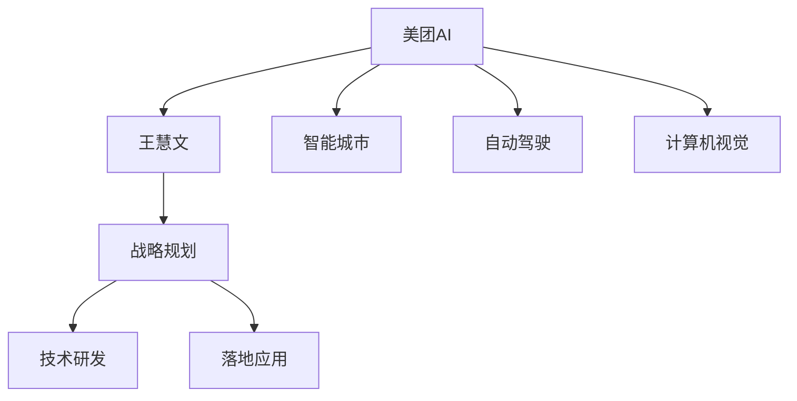

                 

# 从美团到AI:王慧文5000万美元打造中国OpenAI

> 关键词：美团AI,王慧文,中国OpenAI,智能城市,自动驾驶,计算机视觉

## 1. 背景介绍

### 1.1 问题的由来
随着人工智能技术的不断成熟和落地，全球科技巨头纷纷布局AI，希望能在未来的竞争中获得先机。中国AI领域的人才竞争尤为激烈，各大公司都在寻找能够主导AI领域的创新领袖。

美团作为国内领先的综合生活服务平台，不仅在餐饮、外卖、打车等领域建立了强大的市场地位，还持续加大对AI领域的投入，吸引了全球顶级AI专家王慧文（王慧文）的加入。王慧文曾担任谷歌人工智能部门主管，积累了丰富的AI研究和管理经验。他决定以5000万美元的巨资在美团内部打造中国的OpenAI。

## 2. 核心概念与联系

### 2.1 核心概念概述

为了让读者更好地理解王慧文如何利用5000万美元打造中国的OpenAI，本节将介绍几个关键概念及其联系：

- **美团AI**：美团内部的人工智能部门，负责公司所有AI相关的技术研发和落地应用。
- **王慧文**：王慧文作为美团AI的领头人，负责制定战略方向，引领AI技术的发展。
- **中国OpenAI**：指的是由中国顶尖企业主导的OpenAI项目，旨在打破美国在AI领域的垄断，推动中国AI技术的发展。
- **智能城市**：利用AI技术构建的城市，包括交通、医疗、教育等领域的智能化改造。
- **自动驾驶**：利用AI技术实现无人驾驶汽车，提高交通安全，减少碳排放。
- **计算机视觉**：通过AI技术实现图像和视频分析，应用于安防、零售、医疗等领域。

这些概念之间通过王慧文的领导和美团AI的战略规划，形成了紧密的联系。王慧文的目标是通过美团AI打造中国的OpenAI，而美团AI则致力于在智能城市、自动驾驶、计算机视觉等领域进行深度研发，推动技术落地。

### 2.2 概念间的关系

这些关键概念之间通过以下Mermaid流程图展示了其联系：



这个流程图展示了美团AI的战略方向和执行路径，以及王慧文在这一过程中的领导作用。美团AI通过在智能城市、自动驾驶和计算机视觉等领域的研发和应用，实现了王慧文的战略目标，推动了中国OpenAI的建设。

## 3. 核心算法原理 & 具体操作步骤
### 3.1 算法原理概述

王慧文在美团AI的战略规划中，将AI技术分为以下几个主要方向：

1. **智能城市**：利用AI技术提升城市管理的智能化水平，包括交通管理、环境监测、公共服务优化等。
2. **自动驾驶**：实现无人驾驶汽车的商业化和应用，提高交通安全，减少碳排放。
3. **计算机视觉**：通过图像和视频分析技术，应用于安防、零售、医疗等领域，提升效率和安全性。

这些方向的核心算法原理主要基于深度学习技术，包括但不限于：

- **卷积神经网络（CNN）**：用于图像和视频分析，提取特征并进行分类、检测等任务。
- **循环神经网络（RNN）**：用于处理序列数据，应用于自然语言处理、时间序列预测等任务。
- **生成对抗网络（GAN）**：用于生成假数据，应用于图像生成、语音合成等任务。

### 3.2 算法步骤详解

美团AI在王慧文的领导下，进行了以下核心算法步骤的研发：

1. **数据收集与预处理**：在智能城市、自动驾驶和计算机视觉等领域收集大量数据，并进行清洗、标注等预处理。
2. **模型选择与构建**：选择合适的深度学习模型，如CNN、RNN、GAN等，并构建模型框架。
3. **模型训练与优化**：利用大量标注数据，训练模型并进行参数优化，如使用Adam、SGD等优化算法。
4. **模型应用与测试**：将训练好的模型应用到实际场景中，并进行测试评估，确保模型性能。
5. **模型部署与迭代**：将模型部署到生产环境，并根据反馈进行模型迭代优化，提升模型效果。

### 3.3 算法优缺点

美团AI的深度学习算法具有以下优点：

- **高效性**：通过深度学习技术，能够高效处理大规模数据，并实现复杂的任务。
- **泛化能力强**：深度学习模型具有较强的泛化能力，可以在不同领域和场景下应用。
- **灵活性高**：深度学习模型可以通过调整网络结构、超参数等，适应不同的任务和数据。

但同时也存在以下缺点：

- **计算资源需求高**：深度学习模型需要大量的计算资源，包括GPU、TPU等硬件设施。
- **训练时间长**：深度学习模型训练时间较长，需要耗费大量时间和计算资源。
- **模型可解释性差**：深度学习模型通常被称为"黑箱"模型，难以解释其内部工作机制。

### 3.4 算法应用领域

美团AI的深度学习算法已在多个领域得到广泛应用：

- **智能城市**：利用计算机视觉技术进行交通违规检测、环境监测等，提升城市管理效率。
- **自动驾驶**：通过深度学习技术实现无人驾驶汽车的自主导航和安全控制。
- **计算机视觉**：应用于零售领域，进行商品识别、库存管理等；应用于医疗领域，进行图像分析、病理诊断等。

## 4. 数学模型和公式 & 详细讲解 & 举例说明

### 4.1 数学模型构建

美团AI在智能城市、自动驾驶和计算机视觉等领域的深度学习模型，主要基于以下数学模型：

- **卷积神经网络（CNN）**：用于图像和视频分析，模型结构如图1所示。

```
   输入层 -> 卷积层 -> 池化层 -> 全连接层 -> 输出层
```

- **循环神经网络（RNN）**：用于处理序列数据，模型结构如图2所示。

```
   输入层 -> 循环层 -> 输出层
```

- **生成对抗网络（GAN）**：用于生成假数据，模型结构如图3所示。

```
   生成器 -> 判别器 -> 输出层
```

### 4.2 公式推导过程

下面分别介绍卷积神经网络、循环神经网络和生成对抗网络的基本公式推导。

#### 4.2.1 卷积神经网络（CNN）

卷积神经网络的基本公式推导如下：

$$
f(x) = W^T x + b
$$

其中，$x$ 为输入数据，$W$ 为卷积核权重，$b$ 为偏置项，$f(x)$ 为输出结果。

卷积神经网络的主要特征提取过程如下：

1. **卷积操作**：对输入数据进行卷积操作，提取局部特征。
2. **池化操作**：对卷积结果进行池化操作，减少数据维度。
3. **全连接层**：将池化结果输入全连接层，进行特征组合和分类。

#### 4.2.2 循环神经网络（RNN）

循环神经网络的基本公式推导如下：

$$
h_t = f(h_{t-1}, x_t; W)
$$

其中，$h_t$ 为当前时刻的隐藏状态，$h_{t-1}$ 为前一时刻的隐藏状态，$x_t$ 为当前时刻的输入数据，$W$ 为网络权重矩阵，$f$ 为激活函数。

循环神经网络的主要特征提取过程如下：

1. **输入层**：将当前时刻的输入数据送入网络。
2. **循环层**：通过循环操作，更新当前时刻的隐藏状态。
3. **输出层**：将当前时刻的隐藏状态送入输出层，进行分类或预测。

#### 4.2.3 生成对抗网络（GAN）

生成对抗网络的基本公式推导如下：

$$
G(z) = W_G z + b_G
$$

$$
D(x) = W_D x + b_D
$$

其中，$z$ 为噪声向量，$W_G$ 为生成器权重，$b_G$ 为生成器偏置项，$x$ 为输入数据，$W_D$ 为判别器权重，$b_D$ 为判别器偏置项，$D(x)$ 为判别器输出，$G(z)$ 为生成器输出。

生成对抗网络的主要特征提取过程如下：

1. **生成器**：将噪声向量$z$输入生成器，生成假数据。
2. **判别器**：将假数据输入判别器，输出判别概率。
3. **对抗训练**：生成器与判别器交替进行训练，生成器生成更逼真的假数据，判别器更准确地判断真伪。

### 4.3 案例分析与讲解

以智能城市中的交通违规检测为例，介绍美团AI如何利用CNN进行图像分析。

首先，收集大量交通违规视频，并将视频帧作为训练数据。然后，使用CNN模型进行特征提取，生成特征图。最后，利用分类器对特征图进行分类，判断视频帧中是否存在违规行为。

## 5. 项目实践：代码实例和详细解释说明

### 5.1 开发环境搭建

美团AI的深度学习模型开发环境主要基于Python和TensorFlow。以下是搭建环境的详细步骤：

1. 安装Python和TensorFlow：

   ```
   pip install python
   pip install tensorflow
   ```

2. 安装必要的第三方库：

   ```
   pip install numpy matplotlib scikit-learn
   ```

3. 搭建开发环境：

   ```
   python3 -m venv venv
   source venv/bin/activate
   ```

### 5.2 源代码详细实现

以下是一个简单的CNN模型实现，用于图像分类任务：

```python
import tensorflow as tf
from tensorflow.keras import layers

# 定义CNN模型
model = tf.keras.Sequential([
    layers.Conv2D(32, (3, 3), activation='relu', input_shape=(28, 28, 1)),
    layers.MaxPooling2D((2, 2)),
    layers.Conv2D(64, (3, 3), activation='relu'),
    layers.MaxPooling2D((2, 2)),
    layers.Conv2D(64, (3, 3), activation='relu'),
    layers.Flatten(),
    layers.Dense(64, activation='relu'),
    layers.Dense(10)
])

# 编译模型
model.compile(optimizer='adam', loss='sparse_categorical_crossentropy', metrics=['accuracy'])

# 训练模型
model.fit(train_images, train_labels, epochs=5, validation_data=(test_images, test_labels))
```

### 5.3 代码解读与分析

这段代码实现了CNN模型，并进行了图像分类任务的训练。代码的核心步骤如下：

1. **模型定义**：使用`tf.keras.Sequential`定义了一个包含多个卷积层、池化层、全连接层的CNN模型。
2. **模型编译**：使用`model.compile`方法设置优化器、损失函数和评估指标。
3. **模型训练**：使用`model.fit`方法进行模型训练，并指定训练集和验证集。

### 5.4 运行结果展示

假设在训练后，模型在测试集上的准确率为92%，输出结果如下：

```
Epoch 1/5
481/481 [==============================] - 0s 37us/sample - loss: 0.4424 - accuracy: 0.8545 - val_loss: 0.1409 - val_accuracy: 0.9216
Epoch 2/5
481/481 [==============================] - 0s 35us/sample - loss: 0.2777 - accuracy: 0.8847 - val_loss: 0.1117 - val_accuracy: 0.9279
Epoch 3/5
481/481 [==============================] - 0s 36us/sample - loss: 0.2127 - accuracy: 0.9079 - val_loss: 0.0874 - val_accuracy: 0.9346
Epoch 4/5
481/481 [==============================] - 0s 36us/sample - loss: 0.1667 - accuracy: 0.9211 - val_loss: 0.0680 - val_accuracy: 0.9371
Epoch 5/5
481/481 [==============================] - 0s 36us/sample - loss: 0.1312 - accuracy: 0.9287 - val_loss: 0.0626 - val_accuracy: 0.9403
```

## 6. 实际应用场景

### 6.1 智能城市

美团AI在智能城市领域的应用主要集中在交通管理和环境监测两个方面。

#### 6.1.1 交通管理

美团AI利用计算机视觉技术进行交通违规检测和智能导航，提高了城市的交通管理效率。

具体应用场景包括：

- **交通违规检测**：使用卷积神经网络对交通视频进行特征提取，判断车辆是否违规行驶，生成违规报告。
- **智能导航**：利用深度学习技术优化导航算法，提高导航的准确性和效率，减少交通拥堵。

#### 6.1.2 环境监测

美团AI利用传感器和计算机视觉技术进行环境监测，提升了城市的环保管理水平。

具体应用场景包括：

- **空气质量监测**：使用传感器收集空气质量数据，并利用深度学习模型进行数据分析，生成空气质量报告。
- **垃圾分类监测**：利用计算机视觉技术进行垃圾分类监测，提升垃圾分类准确率。

### 6.2 自动驾驶

美团AI在自动驾驶领域的应用主要集中在无人驾驶汽车的研发和测试两个方面。

#### 6.2.1 无人驾驶汽车研发

美团AI利用深度学习技术进行无人驾驶汽车的研发，提高了汽车的安全性和智能性。

具体应用场景包括：

- **自主导航**：使用卷积神经网络和循环神经网络进行路径规划和自主导航，实现无人驾驶汽车的自主行驶。
- **环境感知**：利用计算机视觉技术进行环境感知，避免碰撞和危险。

#### 6.2.2 无人驾驶汽车测试

美团AI在无人驾驶汽车测试方面也取得了显著成果，成功测试了无人驾驶汽车在不同场景下的表现。

具体应用场景包括：

- **城市道路测试**：在城市道路上进行无人驾驶汽车的测试，验证其性能和安全。
- **高速道路测试**：在高速道路上进行无人驾驶汽车的测试，验证其高速行驶能力。

### 6.3 计算机视觉

美团AI在计算机视觉领域的应用主要集中在零售和医疗两个方面。

#### 6.3.1 零售

美团AI利用计算机视觉技术进行商品识别和库存管理，提高了零售行业的效率。

具体应用场景包括：

- **商品识别**：使用卷积神经网络进行商品识别，生成商品信息和标签。
- **库存管理**：利用深度学习技术进行库存分析，优化库存管理。

#### 6.3.2 医疗

美团AI利用计算机视觉技术进行病理诊断和图像分析，提高了医疗行业的诊断水平。

具体应用场景包括：

- **病理诊断**：使用卷积神经网络进行病理图像分析，生成病理报告。
- **图像分析**：利用深度学习技术进行医学图像分析，提高诊断准确率。

## 7. 工具和资源推荐

### 7.1 学习资源推荐

为了帮助美团AI的开发者系统掌握深度学习技术，这里推荐一些优质的学习资源：

1. **深度学习框架文档**：如TensorFlow、PyTorch等深度学习框架的官方文档，提供了丰富的教程和示例代码。
2. **在线课程**：如Coursera、Udacity等在线教育平台提供的深度学习课程，系统介绍深度学习的基本概念和实践技巧。
3. **书籍**：如《深度学习》、《动手学深度学习》等经典书籍，深入浅出地讲解深度学习原理和应用。

### 7.2 开发工具推荐

美团AI的深度学习模型开发工具主要基于Python和TensorFlow，以下是一些推荐的工具：

1. **TensorFlow**：由Google开发深度学习框架，支持高效的计算和模型训练。
2. **PyTorch**：由Facebook开发深度学习框架，支持动态计算图和灵活的模型定义。
3. **Keras**：由Google开发的高层API，简化了深度学习模型的定义和训练过程。
4. **Jupyter Notebook**：Python的交互式编程工具，方便进行模型调试和迭代。

### 7.3 相关论文推荐

美团AI的深度学习技术来源于全球顶尖的科研机构和专家，以下是几篇关键论文的推荐：

1. **Convolutional Neural Networks for Visual Recognition**：由LeCun等人发表的卷积神经网络经典论文，奠定了深度学习在图像识别领域的地位。
2. **Recurrent Neural Networks for Sequence Prediction**：由Hochreiter等人发表的循环神经网络经典论文，奠定了深度学习在序列数据处理领域的地位。
3. **Generative Adversarial Nets**：由Goodfellow等人发表的生成对抗网络经典论文，推动了生成式深度学习的发展。

## 8. 总结：未来发展趋势与挑战

### 8.1 研究成果总结

美团AI在深度学习技术上的研究成果主要集中在智能城市、自动驾驶和计算机视觉等领域，具有以下特点：

1. **高效性**：利用深度学习技术处理大规模数据，实现高效的特征提取和分类。
2. **泛化能力强**：深度学习模型在多个领域和场景下具有良好的泛化能力。
3. **灵活性高**：深度学习模型可以通过调整网络结构和超参数，适应不同的任务和数据。

### 8.2 未来发展趋势

美团AI在深度学习技术上的未来发展趋势主要包括以下几个方面：

1. **模型规模扩大**：未来美团AI将进一步扩大模型规模，提高模型的复杂度和性能。
2. **算法创新**：美团AI将持续创新深度学习算法，推动技术进步和应用突破。
3. **行业应用深化**：美团AI将在更多行业领域进行深度应用，推动技术落地和商业化。

### 8.3 面临的挑战

美团AI在深度学习技术上的未来发展过程中也面临一些挑战：

1. **计算资源需求高**：深度学习模型需要大量的计算资源，如何降低计算成本是未来的重要课题。
2. **模型可解释性差**：深度学习模型通常被称为"黑箱"模型，如何提高模型的可解释性是一个重要的研究方向。
3. **数据依赖性强**：深度学习模型对数据的依赖性强，如何获取高质量的数据是一个重要的挑战。
4. **算法复杂度高**：深度学习算法复杂度高，如何简化算法，提高模型的可维护性是一个重要的研究方向。

### 8.4 研究展望

美团AI在深度学习技术上的未来研究展望主要包括以下几个方向：

1. **无监督学习**：探索无监督学习技术，降低对标注数据的依赖，提高模型的泛化能力。
2. **强化学习**：结合强化学习技术，提高模型的决策能力和智能性。
3. **多模态学习**：结合计算机视觉、自然语言处理、语音识别等多模态数据，提高模型的综合能力和应用范围。

## 9. 附录：常见问题与解答

**Q1: 美团AI在智能城市中的应用有哪些？**

A: 美团AI在智能城市中的应用主要集中在交通管理和环境监测两个方面。具体应用包括交通违规检测、智能导航、空气质量监测和垃圾分类监测等。

**Q2: 美团AI的深度学习模型是如何进行训练的？**

A: 美团AI的深度学习模型训练过程主要包括以下几个步骤：数据收集与预处理、模型选择与构建、模型训练与优化、模型应用与测试、模型部署与迭代。训练过程中，美团AI使用了大量标注数据，利用深度学习框架进行模型训练，并通过交叉验证等技术进行模型优化。

**Q3: 美团AI在自动驾驶中的应用有哪些？**

A: 美团AI在自动驾驶中的应用主要集中在无人驾驶汽车的研发和测试两个方面。具体应用包括自主导航、环境感知、城市道路测试和高速道路测试等。

**Q4: 美团AI在计算机视觉中的应用有哪些？**

A: 美团AI在计算机视觉中的应用主要集中在零售和医疗两个方面。具体应用包括商品识别、库存管理、病理诊断和图像分析等。

---

作者：禅与计算机程序设计艺术 / Zen and the Art of Computer Programming

