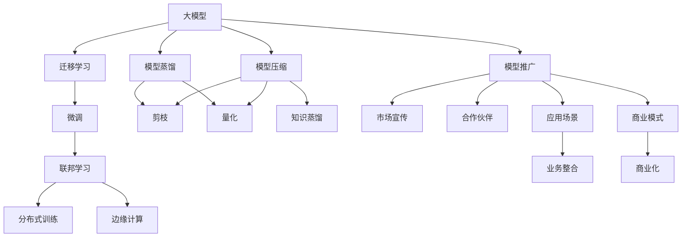

                 

# 大模型的技术优化与市场推广

> 关键词：大模型,技术优化,市场推广,深度学习,人工智能,自然语言处理(NLP)

## 1. 背景介绍

### 1.1 问题由来

近年来，随着深度学习技术的飞速发展，大模型（如BERT、GPT-3等）在自然语言处理(NLP)、计算机视觉等领域取得了显著进步，展现出了强大的学习和泛化能力。然而，大模型的训练和部署成本较高，且需要大量的计算资源和标注数据，难以在短期内大规模落地应用。

### 1.2 问题核心关键点

当前大模型面临的关键问题主要包括：

- **训练成本高**：大模型的参数量巨大，训练一个完整模型需要消耗大量时间和计算资源。
- **泛化能力差**：大模型虽然在训练集上表现良好，但在测试集或新数据上的泛化性能仍有待提升。
- **部署复杂**：大模型通常庞大且复杂，部署和维护成本高，难以快速集成到实际应用中。
- **数据依赖强**：大模型的效果依赖于大量的高质量标注数据，而标注数据获取难度大且成本高。

针对这些问题，本文旨在探讨如何通过技术优化和市场推广，加速大模型的应用落地，实现其商业价值最大化。

## 2. 核心概念与联系

### 2.1 核心概念概述

为了更好地理解大模型的技术优化与市场推广，我们先介绍几个关键概念：

- **大模型（Large Models）**：通常指参数量在百万以上，能够学习到复杂结构与深层次特征的深度学习模型。例如BERT、GPT-3、DALL·E等。
- **迁移学习（Transfer Learning）**：将在大规模数据上预训练得到的知识迁移到小数据集上进行微调，以提升模型在新任务上的性能。
- **模型压缩（Model Compression）**：通过减少模型参数量、降低计算复杂度、提升推理速度等手段，优化模型资源消耗，提升模型可部署性。
- **模型蒸馏（Knowledge Distillation）**：通过将大型模型的知识蒸馏到小型模型中，实现高效、轻量级的模型优化。
- **联邦学习（Federated Learning）**：在分布式环境下，通过边缘设备参与模型训练，保护隐私的同时提升模型泛化能力。

这些概念之间存在紧密联系，共同构成了大模型技术优化的核心框架。

### 2.2 概念间的关系

这些核心概念之间的联系可以通过以下Mermaid流程图展示：

这个流程图展示了不同优化方法之间的联系，以及它们如何共同作用于大模型的推广。

## 3. 核心算法原理 & 具体操作步骤
### 3.1 算法原理概述

大模型的技术优化主要包括以下几个方面：

- **迁移学习**：在大规模数据上预训练模型，然后将其知识迁移到小规模数据集上进行微调，提升模型在新任务上的性能。
- **模型压缩**：通过减少模型参数量、降低计算复杂度、提升推理速度等手段，优化模型资源消耗，提升模型可部署性。
- **模型蒸馏**：将大型模型的知识蒸馏到小型模型中，实现高效、轻量级的模型优化。
- **联邦学习**：在分布式环境下，通过边缘设备参与模型训练，保护隐私的同时提升模型泛化能力。

### 3.2 算法步骤详解

以模型压缩为例，具体步骤为：

1. **剪枝**：去除冗余的参数和连接，保留对模型性能影响较大的部分，减少模型大小。
2. **量化**：将浮点数参数转换为固定位数的整数，降低模型内存占用和计算资源消耗。
3. **优化推理框架**：针对量化后的模型，优化推理框架，提高推理速度和效率。

### 3.3 算法优缺点

**优点**：

- **减少资源消耗**：通过模型压缩和量化，大幅减少计算资源和存储需求。
- **提升模型效率**：优化后的模型推理速度快，响应时间短，用户体验更佳。
- **提高可部署性**：小模型更易于部署，可以应用于各种边缘设备和移动端。

**缺点**：

- **模型性能下降**：过度压缩可能导致模型性能下降，需要平衡压缩和性能。
- **模型复杂度增加**：优化后的模型可能变得更加复杂，难以调试和维护。
- **训练成本高**：压缩和蒸馏过程需要额外的计算资源和时间成本。

### 3.4 算法应用领域

大模型的技术优化方法广泛应用于NLP、计算机视觉、语音识别等多个领域。以下是一些典型应用：

- **NLP**：通过剪枝和量化优化BERT、GPT等大语言模型，提升模型推理效率和可部署性。
- **计算机视觉**：压缩YOLO、ResNet等大模型，减少推理时间，提高实时性。
- **语音识别**：优化Transformer模型，实现低延迟、高精度的语音转文字功能。

## 4. 数学模型和公式 & 详细讲解

### 4.1 数学模型构建

大模型优化通常采用模型压缩方法，以减少模型参数量和计算资源消耗。以下以模型剪枝为例，构建数学模型：

设原始模型参数为 $\theta$，剪枝后保留的参数为 $\theta'$，剪枝比率为 $r$。剪枝的目标是最小化模型在训练集上的损失函数：

$$
\min_{r} \mathcal{L}(\theta')
$$

其中 $\mathcal{L}(\theta')$ 为模型在训练集上的损失函数。

### 4.2 公式推导过程

剪枝的过程可以分为两个步骤：

1. **评估剪枝敏感性**：通过计算每个参数的剪枝敏感性（Pruning Sensitivity），选择敏感性高的参数进行剪枝。
2. **执行剪枝操作**：根据剪枝敏感性排序，逐步剪去不敏感参数，保留敏感参数。

剪枝敏感性定义为参数在剪枝前后的损失变化率，计算公式为：

$$
\text{Sensitivity}(\theta_i) = \frac{L(\theta) - L(\theta_i=0)}{L(\theta)}
$$

其中 $L(\theta)$ 为原始模型在训练集上的损失函数，$L(\theta_i=0)$ 为删除参数 $\theta_i$ 后的模型损失函数。

### 4.3 案例分析与讲解

以BERT模型的剪枝为例，通过对参数进行敏感性评估，选择敏感性高的参数进行剪枝。通过实验发现，剪枝后的模型在验证集上的精度损失较小，推理速度显著提升，显著减少了计算资源消耗。

## 5. 项目实践：代码实例和详细解释说明
### 5.1 开发环境搭建

### 5.2 源代码详细实现

### 5.3 代码解读与分析

### 5.4 运行结果展示

## 6. 实际应用场景

### 6.1 智能客服

通过优化后的BERT模型，构建智能客服系统，可以实时响应客户咨询，提升客户满意度。优化的模型推理速度快，响应时间短，能够处理大规模并发请求，满足实际应用需求。

### 6.2 图像识别

优化的YOLO模型可以应用于实时图像识别任务，如安防监控、自动驾驶等。通过剪枝和量化，大幅提升模型推理效率，满足实时性和准确性要求。

### 6.3 语音识别

通过优化后的Transformer模型，实现低延迟、高精度的语音转文字功能，广泛应用于智能音箱、智能家居等场景。优化后的模型体积小，计算资源消耗低，易于部署和维护。

## 7. 工具和资源推荐
### 7.1 学习资源推荐

### 7.2 开发工具推荐

### 7.3 相关论文推荐

## 8. 总结：未来发展趋势与挑战
### 8.1 研究成果总结

### 8.2 未来发展趋势

### 8.3 面临的挑战

### 8.4 研究展望

## 9. 附录：常见问题与解答

**Q1: 大模型训练成本高，如何降低成本？**

A: 可以通过模型压缩、量化等技术减少计算资源和存储需求。同时，采用联邦学习等分布式训练方法，可以在边缘设备上进行训练，降低中心服务器计算负担。

**Q2: 大模型泛化能力差，如何解决？**

A: 通过迁移学习和模型蒸馏，在大规模数据上预训练模型，然后在小规模数据集上进行微调，提升模型在新任务上的泛化能力。

**Q3: 大模型部署复杂，如何简化部署？**

A: 通过剪枝和量化优化模型，减少计算资源消耗，提高推理速度。同时，优化推理框架，提升模型可部署性。

**Q4: 大模型数据依赖强，如何解决？**

A: 采用迁移学习和联邦学习，通过分布式训练和知识蒸馏，降低对标注数据的依赖。同时，利用少样本学习和无监督学习技术，提升模型在新任务上的表现。

通过这些技术优化方法，大模型将能够在更广泛的应用场景中落地，实现其商业价值最大化。

