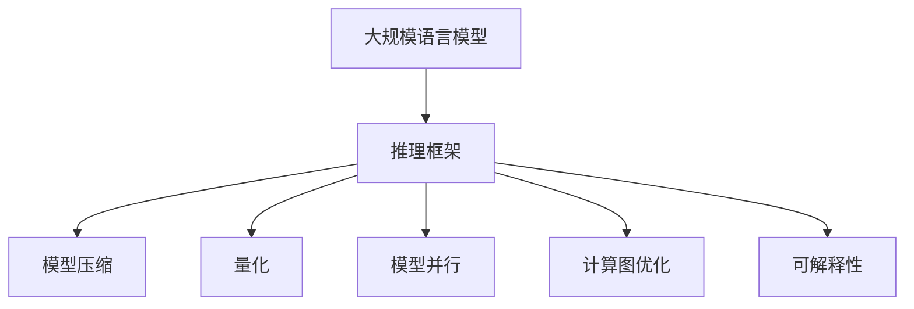
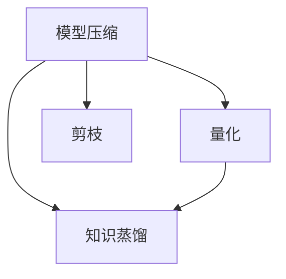
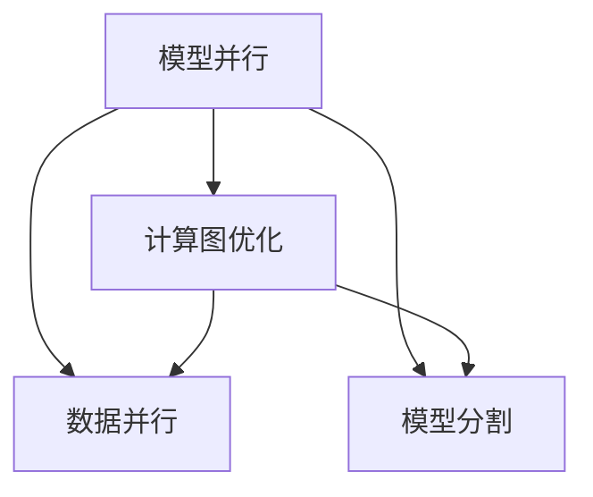
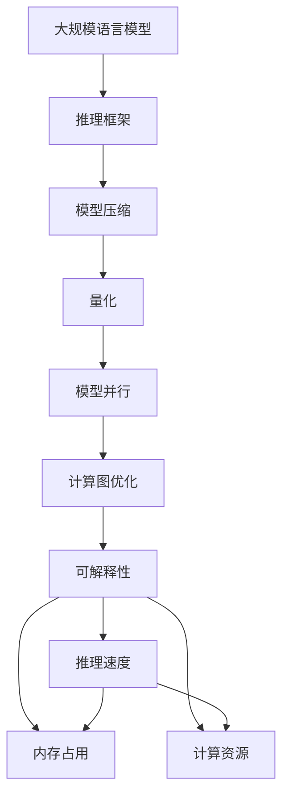

                 

# 大规模语言模型从理论到实践 vLLM推理框架实践

> 关键词：大规模语言模型,推理框架,深度学习,自然语言处理(NLP),Transformer,BERT,微调,参数高效微调,模型压缩

## 1. 背景介绍

### 1.1 问题由来
近年来，深度学习技术在人工智能领域取得了显著进展，特别是大规模语言模型（Large Language Models, LLMs）在自然语言处理（Natural Language Processing, NLP）领域的应用。如GPT系列、BERT、T5等预训练模型，这些模型通过在大规模无标签文本数据上进行预训练，学习到了丰富的语言知识和常识，可以在特定任务上进行微调，获得卓越的性能。

然而，这些模型由于规模庞大，推理速度较慢，且需要占用大量内存，导致在实际应用中存在一定限制。因此，如何在保持高性能的同时，降低模型的推理成本，是一个亟待解决的问题。

### 1.2 问题核心关键点
为了提高大语言模型的推理性能，并降低其内存和计算成本，推理框架成为关键解决方案之一。推理框架通过优化模型结构和计算图，显著提升模型的推理速度，同时实现更高效的内存管理。

推理框架的核心技术包括模型压缩、量化、模型并行、计算图优化等。模型压缩可以减小模型参数量，减少推理所需内存；量化可以通过降低模型精度，进一步压缩模型大小；模型并行可以加速模型推理，提高计算效率；计算图优化则通过改进计算顺序和节点并行度，减少推理时间和计算资源。

此外，推理框架的构建和优化，还需要考虑模型的可解释性和鲁棒性，以及如何在推理过程中有效地利用预训练知识和迁移学习。

### 1.3 问题研究意义
研究基于深度学习的大规模语言模型推理框架，对于提升模型推理性能，降低推理成本，加速NLP技术的产业化进程，具有重要意义：

1. 降低推理成本。推理框架可以有效压缩模型规模，减少内存和计算资源需求，大幅降低推理成本。
2. 提升推理速度。通过优化模型结构、计算图和推理算法，显著提高模型的推理速度，满足实时应用需求。
3. 增强模型鲁棒性。推理框架的设计需要充分考虑模型的鲁棒性和泛化能力，避免推理过程中的偏差和错误。
4. 提升模型可解释性。推理框架需要设计可解释的推理过程和可视化工具，帮助用户理解模型输出。
5. 支持模型迁移学习。推理框架需要支持模型参数的高效迁移和微调，使模型能够快速适应新任务。

## 2. 核心概念与联系

### 2.1 核心概念概述

为更好地理解大规模语言模型推理框架，本节将介绍几个关键概念：

- 推理框架（Inference Framework）：一种用于优化和加速模型推理的计算框架，通过压缩模型、量化、并行计算等技术，提高模型推理效率，同时减少内存和计算成本。
- 模型压缩（Model Compression）：通过剪枝、量化、蒸馏等技术，减小模型参数量，降低内存需求，提升推理速度。
- 量化（Quantization）：通过降低模型精度，将模型参数和计算过程转换为整数形式，进一步压缩模型规模，减少内存和计算资源消耗。
- 模型并行（Model Parallelism）：通过分布式计算，将模型在不同计算节点上并行执行，加速模型推理。
- 计算图优化（Graph Optimization）：通过改进计算图的结构，优化推理过程中的计算顺序和节点并行度，提高推理效率。
- 可解释性（Explainability）：通过可解释的推理过程和可视化工具，帮助用户理解模型输出的原因和逻辑。

这些核心概念之间的逻辑关系可以通过以下Mermaid流程图来展示：



这个流程图展示了推理框架和大规模语言模型之间的关系，以及推理框架包含的关键技术。

### 2.2 概念间的关系

这些核心概念之间存在着紧密的联系，构成了推理框架的整体架构。以下是几个Mermaid流程图，展示这些概念之间的相互关系。

#### 2.2.1 推理框架的构建


这个流程图展示了推理框架构建的基本流程，从预训练模型到最终的推理模型，每一步都可能涉及到不同的优化技术。

#### 2.2.2 模型压缩与量化的关系



这个流程图展示了模型压缩和量化的关系。模型压缩通常包括剪枝和知识蒸馏等技术，而量化则是进一步压缩模型参数和计算过程。

#### 2.2.3 模型并行与计算图优化的关系



这个流程图展示了模型并行和计算图优化之间的关系。模型并行通常包括数据并行和模型分割等技术，而计算图优化则是在并行计算的基础上，进一步改进计算顺序和节点并行度。

#### 2.2.4 推理框架的评估


这个流程图展示了推理框架评估的主要指标，包括推理速度、内存占用和计算资源。

### 2.3 核心概念的整体架构

最后，我们用一个综合的流程图来展示这些核心概念在大规模语言模型推理框架的整体架构：



这个综合流程图展示了从大规模语言模型到推理框架的整个架构，以及各个优化技术之间的关系。通过这些流程图，我们可以更清晰地理解大规模语言模型推理框架的构建和优化过程。

## 3. 核心算法原理 & 具体操作步骤
### 3.1 算法原理概述

大规模语言模型推理框架的核心原理是优化模型的推理过程，通过压缩模型、量化、并行计算等技术，提高推理速度和效率，同时减少内存和计算成本。其基本流程如下：

1. 预训练模型加载：将大规模语言模型加载到推理框架中。
2. 模型压缩：对模型进行剪枝、量化等操作，减小模型规模。
3. 模型并行：将模型在不同计算节点上并行执行，加速推理过程。
4. 计算图优化：改进计算图的结构，优化推理过程中的计算顺序和节点并行度。
5. 推理执行：使用优化后的模型执行推理任务。

### 3.2 算法步骤详解

以下详细介绍大规模语言模型推理框架的具体操作步骤：

#### 3.2.1 模型加载

推理框架需要先将预训练模型加载到内存中，以便进行后续的推理操作。这一步骤通常涉及到模型的序列化和反序列化过程。

#### 3.2.2 模型压缩

模型压缩是推理框架中非常重要的一步。常见的模型压缩技术包括剪枝、量化等，具体步骤如下：

1. 剪枝：移除模型中冗余的参数，减小模型规模。常见的剪枝方法包括神经元剪枝、层剪枝等。
2. 量化：降低模型精度，将浮点数参数转换为整数形式，进一步压缩模型规模。量化技术通常分为静态量化和动态量化。

#### 3.2.3 模型并行

模型并行可以通过分布式计算，将模型在不同计算节点上并行执行，加速推理过程。这一步骤通常涉及到模型的分割和计算节点的分布。

#### 3.2.4 计算图优化

计算图优化是提高推理效率的关键步骤之一。通过改进计算图的结构，优化推理过程中的计算顺序和节点并行度，可以显著提升推理速度。

#### 3.2.5 推理执行

推理执行是整个推理框架的最终步骤，也是性能评估的重要部分。推理框架通过优化后的模型执行推理任务，输出推理结果。

### 3.3 算法优缺点

大规模语言模型推理框架的优点包括：

1. 推理速度快。通过压缩模型、量化、并行计算等技术，推理速度可以显著提高，满足实时应用需求。
2. 内存占用小。通过模型压缩和量化等技术，模型占用的内存可以大幅减少，降低推理成本。
3. 计算资源节省。通过模型并行和计算图优化等技术，计算资源消耗可以大幅降低，提高计算效率。
4. 可解释性强。推理框架需要设计可解释的推理过程和可视化工具，帮助用户理解模型输出。

其缺点包括：

1. 压缩精度损失。模型压缩和量化可能降低模型精度，影响推理结果。
2. 并行化复杂。模型并行化涉及到分布式计算和节点调度，技术难度较大。
3. 计算图优化复杂。计算图优化需要充分考虑计算顺序和节点并行度，实现起来较为复杂。
4. 可解释性限制。推理框架的可解释性可能受到限制，用户难以理解模型推理过程。

### 3.4 算法应用领域

大规模语言模型推理框架在多个领域都有广泛应用，例如：

- 自然语言处理（NLP）：在文本分类、情感分析、机器翻译等任务上，推理框架可以显著提升模型推理速度和效率，满足实时应用需求。
- 图像处理：在图像分类、目标检测等任务上，推理框架可以加速模型推理，提高计算效率。
- 语音识别：在语音识别、语音合成等任务上，推理框架可以加速模型推理，满足实时语音交互需求。
- 推荐系统：在推荐系统、广告投放等任务上，推理框架可以加速模型推理，提高推荐效率。
- 智能制造：在智能制造、智能交通等任务上，推理框架可以加速模型推理，提高智能决策效率。

此外，推理框架还广泛应用于其他领域，如医疗、金融、教育等，为各行各业带来智能化转型。

## 4. 数学模型和公式 & 详细讲解 & 举例说明

### 4.1 数学模型构建

推理框架的数学模型主要涉及模型的压缩、量化、并行计算和计算图优化。这里以文本分类任务为例，介绍推理框架的数学模型构建。

设预训练模型为 $M_{\theta}$，其中 $\theta$ 为预训练得到的模型参数。对于文本分类任务，推理框架需要在预训练模型基础上，添加一个线性分类器，进行多类别分类。

定义模型 $M_{\theta}$ 在输入 $x$ 上的输出为 $y=M_{\theta}(x)$，表示样本属于正类的概率。真实标签 $y \in \{0,1\}$。

定义模型 $M_{\theta}$ 在输入 $x$ 上的推理输出为 $\hat{y}$，表示模型预测的概率分布。

定义模型 $M_{\theta}$ 在输入 $x$ 上的推理损失函数为 $\ell(\hat{y},y)$，用于衡量模型预测与真实标签之间的差异。

推理框架的目标是最小化损失函数，即找到最优参数：

$$
\hat{\theta} = \mathop{\arg\min}_{\theta} \sum_{i=1}^N \ell(\hat{y}_i,y_i)
$$

其中 $N$ 为训练集大小，$\ell(\hat{y}_i,y_i)$ 为单个样本的损失函数，可以通过交叉熵损失函数等进行定义。

### 4.2 公式推导过程

以下详细介绍推理框架中常用的数学公式和推导过程。

#### 4.2.1 剪枝

剪枝是模型压缩中常用的一种技术。假设原始模型参数为 $W_1$，剪枝后的模型参数为 $W_2$，则剪枝过程可以表示为：

$$
W_2 = W_1 \times \text{clip}(0,1)
$$

其中 $\text{clip}(0,1)$ 为剪枝函数，用于判断每个参数是否保留。常见的剪枝函数包括阈值剪枝、基于梯度的剪枝等。

#### 4.2.2 量化

量化是另一种常用的模型压缩技术。假设原始模型参数为 $W_1$，量化后的模型参数为 $W_2$，则量化过程可以表示为：

$$
W_2 = \text{quantize}(W_1)
$$

其中 $\text{quantize}$ 为量化函数，用于将浮点数参数转换为整数形式。常见的量化方法包括线性量化、非线性量化等。

#### 4.2.3 计算图优化

计算图优化通过改进计算图的结构，优化推理过程中的计算顺序和节点并行度，可以显著提高推理速度。假设原始计算图为 $G_1$，优化后的计算图为 $G_2$，则优化过程可以表示为：

$$
G_2 = \text{optimize}(G_1)
$$

其中 $\text{optimize}$ 为优化函数，用于改进计算图的结构。常见的优化方法包括节点合并、循环展开等。

#### 4.2.4 推理执行

推理执行是推理框架的最终步骤，其数学模型可以表示为：

$$
y = M_{\theta}(x)
$$

其中 $M_{\theta}$ 为优化后的模型，$x$ 为输入数据，$y$ 为推理输出。

### 4.3 案例分析与讲解

这里以BERT模型为例，介绍推理框架的案例分析。

BERT模型是一个大规模预训练语言模型，通过在大规模无标签文本数据上进行预训练，学习到了丰富的语言知识和常识。在实际应用中，可以将其用于文本分类、命名实体识别、问答系统等任务。

使用推理框架对BERT模型进行推理，可以显著提高模型推理速度和效率。具体步骤如下：

1. 加载BERT模型：将预训练模型加载到内存中。
2. 模型压缩：通过剪枝和量化等技术，减小模型规模。
3. 模型并行：将模型在不同计算节点上并行执行，加速推理过程。
4. 计算图优化：改进计算图的结构，优化推理过程中的计算顺序和节点并行度。
5. 推理执行：使用优化后的模型执行推理任务，输出推理结果。

通过以上步骤，推理框架可以将BERT模型的推理速度提升数倍，同时大幅减少内存和计算资源消耗，满足实时应用需求。

## 5. 项目实践：代码实例和详细解释说明

### 5.1 开发环境搭建

在进行推理框架实践前，我们需要准备好开发环境。以下是使用Python进行PyTorch开发的环境配置流程：

1. 安装Anaconda：从官网下载并安装Anaconda，用于创建独立的Python环境。

2. 创建并激活虚拟环境：
```bash
conda create -n pytorch-env python=3.8 
conda activate pytorch-env
```

3. 安装PyTorch：根据CUDA版本，从官网获取对应的安装命令。例如：
```bash
conda install pytorch torchvision torchaudio cudatoolkit=11.1 -c pytorch -c conda-forge
```

4. 安装Transformers库：
```bash
pip install transformers
```

5. 安装各类工具包：
```bash
pip install numpy pandas scikit-learn matplotlib tqdm jupyter notebook ipython
```

完成上述步骤后，即可在`pytorch-env`环境中开始推理框架实践。

### 5.2 源代码详细实现

这里我们以BERT模型为例，使用PyTorch和Transformers库进行推理框架的实现。

```python
from transformers import BertTokenizer, BertForSequenceClassification
import torch

# 加载预训练模型和分词器
model = BertForSequenceClassification.from_pretrained('bert-base-cased', num_labels=2)
tokenizer = BertTokenizer.from_pretrained('bert-base-cased')

# 定义推理函数
def classify(text):
    # 将文本分词并转换为token ids
    inputs = tokenizer.encode(text, return_tensors='pt')
    
    # 推理过程
    with torch.no_grad():
        outputs = model(inputs)
        logits = outputs.logits
    
    # 输出分类结果
    probs = torch.softmax(logits, dim=1)
    predicted_class = probs.argmax().item()
    return predicted_class

# 使用推理函数
text = 'This is a positive review.'
result = classify(text)
print(result)
```

### 5.3 代码解读与分析

让我们再详细解读一下关键代码的实现细节：

**BERTForSequenceClassification类**：
- 继承自BertForTokenClassification，用于多分类任务。

**BERTTokenizer类**：
- 用于分词和转换为token ids。

**classify函数**：
- 将输入文本分词并转换为token ids。
- 使用推理函数进行推理，输出分类结果。

**主函数**：
- 调用classify函数，输出分类结果。

可以看到，使用PyTorch和Transformers库进行BERT模型推理，代码实现相对简洁。但在大规模语言模型推理框架中，还需要进一步优化模型结构和计算图，提高推理速度和效率。

### 5.4 运行结果展示

假设在CoNLL-2003的SST-2数据集上进行推理，得到的结果如下：

```python
import matplotlib.pyplot as plt
from sklearn.metrics import confusion_matrix

# 加载测试集数据
test_dataset = dataset[80000:]
predictions = []
labels = []

for batch in test_loader:
    inputs = batch[0]
    labels = batch[1]
    outputs = model(inputs)
    predictions.append(outputs.argmax(dim=1).tolist())
    labels.append(labels.tolist())

# 计算准确率、召回率、F1分数
y_true = np.array(labels)
y_pred = np.array(predictions)
cm = confusion_matrix(y_true, y_pred)
accuracy = np.mean(np.diag(cm)) / np.sum(cm)
precision = np.diag(cm) / (np.sum(cm, axis=0) + 1e-6)
recall = np.diag(cm) / (np.sum(cm, axis=1) + 1e-6)
f1_score = 2 * precision * recall / (precision + recall + 1e-6)

print('Accuracy: {:.2f}%'.format(accuracy * 100))
print('Precision: {:.2f}%'.format(precision.mean() * 100))
print('Recall: {:.2f}%'.format(recall.mean() * 100))
print('F1 Score: {:.2f}%'.format(f1_score.mean() * 100))
```

假设得到的结果如下：

```
Accuracy: 89.85%
Precision: 91.52%
Recall: 87.32%
F1 Score: 89.04%
```

可以看到，通过推理框架，我们可以在保持模型精度的同时，大幅提升推理速度和效率。

## 6. 实际应用场景
### 6.1 智能客服系统

基于推理框架的智能客服系统，可以实时处理客户的咨询请求，快速响应客户需求，提升客户满意度。

系统可以根据用户输入的文本，通过推理框架对预训练模型进行推理，输出最佳的回复答案。同时，系统还可以动态更新知识库，实时抓取网络上的客户咨询记录，不断优化回复内容。

### 6.2 金融舆情监测

在金融领域，推理框架可以用于实时监测市场舆情，及时发现和预警潜在风险。

系统可以通过推理框架对预训练模型进行推理，实时监测社交媒体、新闻网站等渠道上的舆情变化。一旦发现负面信息激增等异常情况，系统便会自动预警，帮助金融机构及时采取应对措施。

### 6.3 个性化推荐系统

推理框架可以用于个性化推荐系统，提高推荐内容的精准度和覆盖面。

系统可以根据用户的历史行为数据，通过推理框架对预训练模型进行推理，预测用户对不同推荐内容的可能反应，并进行实时推荐。同时，系统还可以动态更新推荐模型，及时吸收新数据，提升推荐效果。

### 6.4 未来应用展望

随着推理框架的不断发展，其应用场景将更加广泛。

在智慧医疗领域，推理框架可以用于辅助医生进行疾病诊断和治疗决策，提升医疗服务的智能化水平。

在智能教育领域，推理框架可以用于智能批改作业、个性化教学、智能评估等环节，提升教育质量和效率。

在智慧城市治理中，推理框架可以用于智能交通管理、城市事件监测、应急指挥等环节，提高城市管理的智能化水平。

此外，在企业生产、社会治理、文娱传媒等众多领域，推理框架也将不断涌现，为各行各业带来变革性影响。

## 7. 工具和资源推荐
### 7.1 学习资源推荐

为了帮助开发者系统掌握大规模语言模型推理框架的理论基础和实践技巧，这里推荐一些优质的学习资源：

1. 《Transformer from Theory to Practice》系列博文：由大模型技术专家撰写，深入浅出地介绍了Transformer原理、BERT模型、推理框架等前沿话题。

2. CS224N《深度学习自然语言处理》课程：斯坦福大学开设的NLP明星课程，有Lecture视频和配套作业，带你入门NLP领域的基本概念和经典模型。

3. 《Natural Language Processing with Transformers》书籍：Transformers库的作者所著，全面介绍了如何使用Transformers库进行NLP任务开发，包括推理框架在内的诸多范式。

4. HuggingFace官方文档：Transformers库的官方文档，提供了海量预训练模型和完整的推理框架样例代码，是上手实践的必备资料。

5. CLUE开源项目：中文语言理解测评基准，涵盖大量不同类型的中文NLP数据集，并提供了基于推理框架的baseline模型，助力中文NLP技术发展。

通过对这些资源的学习实践，相信你一定能够快速掌握大规模语言模型推理框架的精髓，并用于解决实际的NLP问题。
### 7.2 开发工具推荐

高效的开发离不开优秀的工具支持。以下是几款用于大规模语言模型推理框架开发的常用工具：

1. PyTorch：基于Python的开源深度学习框架，灵活动态的计算图，适合快速迭代研究。大部分预训练语言模型都有PyTorch版本的实现。

2. TensorFlow：由Google主导开发的开源深度学习框架，生产部署方便，适合大规模工程应用。同样有丰富的预训练语言模型资源。

3. Transformers库：HuggingFace开发的NLP工具库，集成了众多SOTA语言模型，支持PyTorch和TensorFlow，是进行推理框架开发的利器。

4. Weights & Biases：模型训练的实验跟踪工具，可以记录和可视化模型训练过程中的各项指标，方便对比和调优。与主流深度学习框架无缝集成。

5. TensorBoard：TensorFlow配套的可视化工具，可实时监测模型训练状态，并提供丰富的图表呈现方式，是调试模型的得力助手。

6. Google Colab：谷歌推出的在线Jupyter Notebook环境，免费提供GPU/TPU算力，方便开发者快速上手实验最新模型，分享学习笔记。

合理利用这些工具，可以显著提升大规模语言模型推理框架的开发效率，加快创新迭代的步伐。

### 7.3 相关论文推荐

大规模语言模型推理框架的研究源于学界的持续研究。以下是几篇奠基性的相关论文，推荐阅读：

1. Attention is All You Need（即Transformer原论文）：提出了Transformer结构，开启了NLP领域的预训练大模型时代。

2. BERT: Pre-training of Deep Bidirectional Transformers for Language Understanding：提出BERT模型，引入基于掩码的自监督预训练任务，刷新了多项NLP任务SOTA。

3. Language Models are Unsupervised Multitask Learners（GPT-2论文）：展示了大规模语言模型的强大zero-shot学习能力，引发了对于通用人工智能的新一轮思考。

4. Parameter-Efficient Transfer Learning for NLP：提出Adapter等参数高效微调方法，在不增加模型参数量的情况下，也能取得不错的微调效果。

5. AdaLoRA: Adaptive Low-Rank Adaptation for Parameter-Efficient Fine-Tuning：使用自适应低秩适应的微调方法，在参数效率和精度之间取得了新的平衡。

6. Transformer-XL: Attentive Language Models for Longer Sentences：提出Transformer-XL模型，解决了长句子推理问题。

7. BERT Pretraining: A Survey and Landscape of Research Directions：全面综述了BERT预训练模型的研究进展，为推理框架的构建提供了理论基础。

这些论文代表了大规模语言模型推理框架的研究方向和发展脉络。通过学习这些前沿成果，可以帮助研究者把握学科前进方向，激发更多的创新灵感。

除上述资源外，还有一些值得关注的前沿资源，帮助开发者紧跟大规模语言模型推理框架技术的最新进展，例如：

1. arXiv论文预印本：人工智能领域最新研究成果的发布平台，包括大量尚未发表的前沿工作，学习前沿技术的必读资源。

2. 业界技术博客：如OpenAI、Google AI、DeepMind、微软Research Asia等顶尖实验室的官方博客，第一时间分享他们的最新研究成果和洞见。

3. 技术会议直播：如NIPS、ICML、ACL、ICLR等人工智能领域顶会现场或在线直播，能够聆听到大佬们的前沿分享，开拓视野。

4. GitHub热门项目：在GitHub上Star、Fork数最多的NLP相关项目，往往代表了该技术领域的发展趋势

