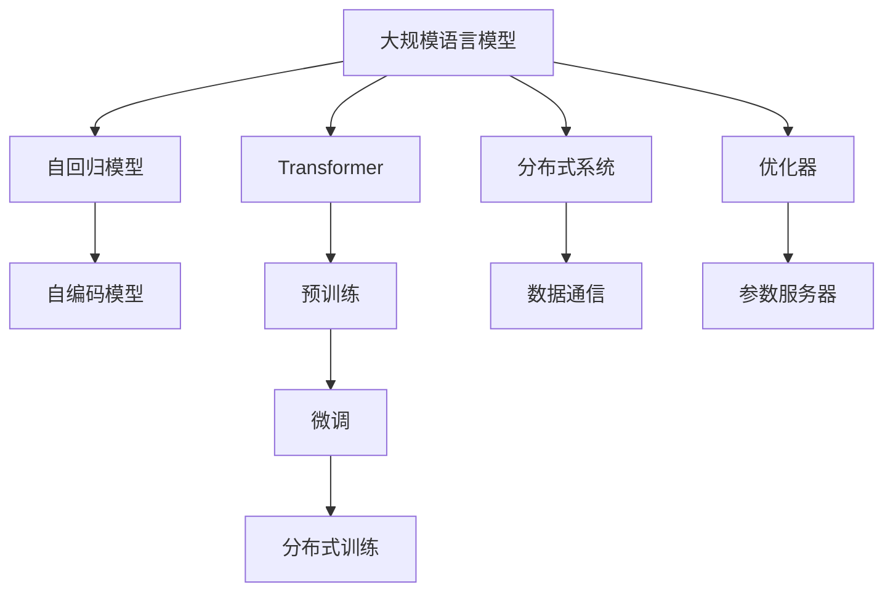
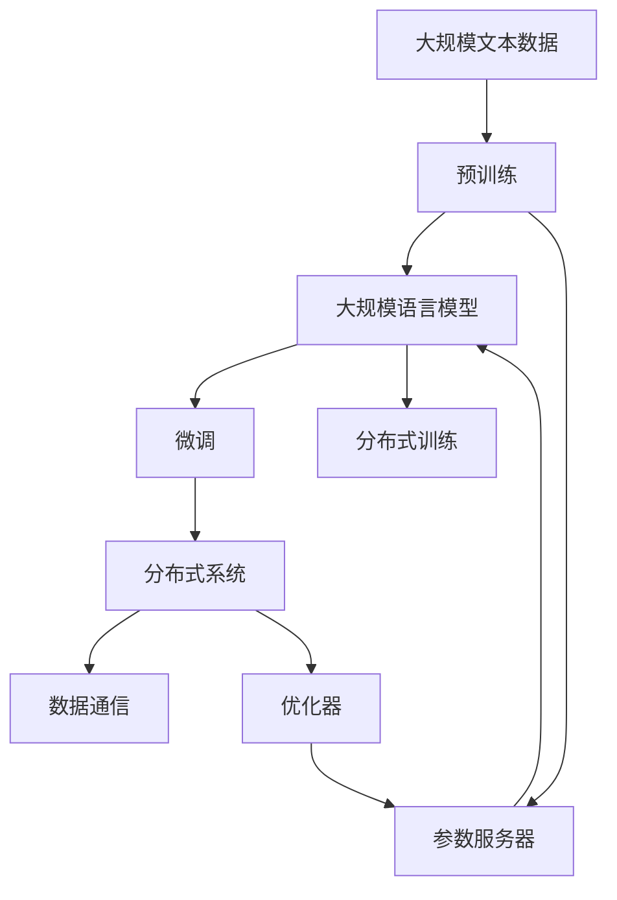

                 

# 大规模语言模型从理论到实践 分布式训练

> 关键词：大规模语言模型,分布式训练,Transformer,自回归,自编码,预训练,微调,分布式系统

## 1. 背景介绍

### 1.1 问题由来
近年来，深度学习技术取得了巨大突破，特别是在自然语言处理（NLP）领域，大规模预训练语言模型（Large Language Models, LLMs）展现出了前所未有的能力。这些模型如BERT、GPT-3等，通常基于Transformer架构，通过在大规模无标签文本数据上自监督预训练学习通用的语言表示。这些模型具有强大的语言理解能力，能够在多项NLP任务上表现优异。

然而，这些模型的参数量往往达到亿级，训练过程中需要消耗巨大的计算资源和时间。分布式训练技术可以有效地解决这个问题，通过将大规模计算任务分布在多台机器上并行执行，从而大大缩短训练时间。本文将深入探讨分布式训练在大规模语言模型中的应用，涵盖其理论基础、实践技术和实际应用。

### 1.2 问题核心关键点
分布式训练在大规模语言模型中的应用涉及以下核心关键点：

- **模型并行**：将模型的不同层分布在不同的机器上并行计算，以加速模型训练。
- **数据并行**：将训练数据集分成多个子集，每个子集由一个分布式节点处理，最终将结果合并。
- **混合并行**：结合模型并行和数据并行，同时优化计算资源和通信开销。
- **优化器并行**：针对不同参数组并行更新，提高优化效率。
- **通信优化**：减少模型参数和梯度在机器间的通信开销。

这些关键点共同构成了分布式训练的核心，其目标是提高训练效率，减少资源消耗，并提升模型性能。

### 1.3 问题研究意义
分布式训练技术在大规模语言模型中的应用，对于加速模型训练、提高计算效率、降低成本、提升模型性能具有重要意义。具体来说：

- **加速模型训练**：通过并行计算，可以在较短时间内完成大规模模型的训练。
- **降低资源消耗**：减少单台机器的计算负担，节省硬件成本。
- **提升模型性能**：利用多台机器的计算资源，可以在保证准确性的前提下，获得更高精度的模型。
- **实现高可扩展性**：分布式训练系统可以轻松扩展，以适应不同规模的计算需求。

因此，分布式训练技术是大规模语言模型落地应用的重要手段，对于推动NLP技术的产业化进程具有重要价值。

## 2. 核心概念与联系

### 2.1 核心概念概述

为了更好地理解分布式训练在大规模语言模型中的应用，本节将介绍几个密切相关的核心概念：

- **大规模语言模型 (Large Language Models, LLMs)**：指参数量在亿级别以上的语言模型，如BERT、GPT-3等。这些模型通过在大规模无标签文本数据上进行自监督预训练，学习通用的语言表示。

- **分布式训练**：通过将大规模计算任务分布在多台机器上并行执行，从而加速模型训练的过程。

- **Transformer**：一种用于自然语言处理的深度学习架构，由自注意力机制和前馈神经网络组成。Transformer在大规模语言模型的预训练和微调中广泛应用。

- **自回归模型**：指模型在预测输出时依赖输入序列的前一时刻输出，如GPT系列模型。

- **自编码模型**：指模型在预测输出时依赖输入序列的先验分布，如BERT系列模型。

- **预训练**：指在大规模无标签文本数据上，通过自监督学习任务训练通用语言模型的过程。

- **微调**：指在预训练模型的基础上，使用下游任务的少量标注数据，通过有监督学习优化模型在该任务上的性能。

- **分布式系统**：指由多台计算机组成的，用于分布式计算、存储和通信的体系结构。

- **数据通信**：指在分布式系统内部，数据在各个节点之间的传输和共享。

- **优化器**：指用于最小化损失函数，更新模型参数的算法。

- **参数服务器**：指用于集中存储和同步模型参数的服务器，通常用于分布式训练中。

这些核心概念之间存在着紧密的联系，形成了分布式训练在大规模语言模型中的完整生态系统。通过理解这些核心概念，我们可以更好地把握分布式训练的工作原理和优化方向。

### 2.2 概念间的关系

这些核心概念之间存在着紧密的联系，形成了分布式训练在大规模语言模型中的完整生态系统。以下用几个Mermaid流程图来展示这些概念之间的关系：



这个流程图展示了大规模语言模型的核心概念及其之间的关系：

1. 大规模语言模型通过自回归或自编码模型进行预训练和微调。
2. 预训练模型通过分布式训练加速训练过程。
3. 分布式训练系统通过数据通信和优化器实现参数的分布式更新。
4. 参数服务器用于集中存储和同步模型参数。

通过这些流程图，我们可以更清晰地理解分布式训练在大规模语言模型微调过程中的各个环节及其相互关系。

### 2.3 核心概念的整体架构

最后，我们用一个综合的流程图来展示这些核心概念在大规模语言模型微调过程中的整体架构：



这个综合流程图展示了从预训练到微调，再到分布式训练的完整过程。大规模语言模型首先在大规模文本数据上进行预训练，然后通过微调来适应下游任务，最后通过分布式训练技术加速模型训练过程。在微调过程中，分布式训练系统通过数据通信和优化器实现参数的分布式更新，参数服务器用于集中存储和同步模型参数。

通过这些流程图，我们可以更全面地理解分布式训练在大规模语言模型微调中的作用和流程。

## 3. 核心算法原理 & 具体操作步骤

### 3.1 算法原理概述

分布式训练在大规模语言模型中的应用，主要通过并行计算和通信优化，加速模型训练过程。其核心算法原理包括以下几个方面：

- **模型并行**：将模型的不同层分布在不同的机器上并行计算，减少单台机器的计算负担，加速训练。
- **数据并行**：将训练数据集分成多个子集，每个子集由一个分布式节点处理，最后将结果合并，提高计算效率。
- **混合并行**：结合模型并行和数据并行，同时优化计算资源和通信开销。
- **优化器并行**：针对不同参数组并行更新，提高优化效率。
- **通信优化**：减少模型参数和梯度在机器间的通信开销，提高训练效率。

### 3.2 算法步骤详解

以下我们将详细介绍分布式训练在大规模语言模型中的应用步骤：

**Step 1: 准备数据和模型**

- **数据预处理**：将大规模数据集分为多个子集，每个子集用于不同的分布式节点训练。
- **模型加载**：加载预训练语言模型，初始化模型参数。

**Step 2: 分布式训练配置**

- **节点分配**：将模型参数和训练数据分配到不同的计算节点上。
- **优化器配置**：选择合适的优化器及其参数，如AdamW、SGD等。

**Step 3: 并行计算和通信**

- **模型并行**：将模型的不同层分布在不同的计算节点上，并行计算每个层的梯度。
- **数据并行**：将训练数据集分成多个子集，每个子集由一个分布式节点处理，最终将结果合并。
- **优化器并行**：针对不同参数组并行更新，提高优化效率。
- **通信优化**：减少模型参数和梯度在机器间的通信开销，如使用参数服务器集中存储和同步模型参数。

**Step 4: 训练和评估**

- **前向传播**：在每个节点上计算模型前向传播。
- **反向传播**：在每个节点上计算梯度，并将梯度信息传递到参数服务器。
- **参数更新**：在参数服务器上同步和更新模型参数。
- **评估模型**：在验证集或测试集上评估模型性能，根据评估结果调整训练参数。

**Step 5: 模型微调**

- **任务适配**：根据下游任务，添加任务适配层和损失函数。
- **分布式微调**：在分布式系统上执行微调任务，加速训练过程。
- **模型评估**：在验证集或测试集上评估微调后的模型性能。

### 3.3 算法优缺点

分布式训练在大规模语言模型中的应用具有以下优点：

- **加速训练**：通过并行计算和通信优化，大大缩短训练时间。
- **提高计算效率**：多台机器并行计算，提升计算效率，降低单台机器的计算负担。
- **可扩展性**：可以轻松扩展计算节点，以适应不同规模的计算需求。

同时，分布式训练也存在一些缺点：

- **通信开销**：数据通信和参数更新会增加额外的计算开销。
- **同步问题**：不同节点之间的同步可能会引入额外的延迟和通信开销。
- **资源管理**：分布式系统需要复杂的资源管理策略，以确保系统稳定运行。

### 3.4 算法应用领域

分布式训练在大规模语言模型中的应用已经广泛应用于多个领域，包括但不限于：

- **文本分类**：如情感分析、主题分类、意图识别等。
- **命名实体识别**：识别文本中的人名、地名、机构名等特定实体。
- **关系抽取**：从文本中抽取实体之间的语义关系。
- **问答系统**：对自然语言问题给出答案。
- **机器翻译**：将源语言文本翻译成目标语言。
- **文本摘要**：将长文本压缩成简短摘要。
- **对话系统**：使机器能够与人自然对话。
- **情感分析**：判断文本的情感倾向。
- **信息检索**：从大量文本中检索相关信息。
- **语音识别**：将语音转换为文本。

## 4. 数学模型和公式 & 详细讲解 & 举例说明

### 4.1 数学模型构建

本节将使用数学语言对分布式训练在大规模语言模型中的应用进行更加严格的刻画。

记大规模语言模型为 $M_{\theta}$，其中 $\theta$ 为模型参数。假设训练数据集为 $D=\{(x_i,y_i)\}_{i=1}^N$，其中 $x_i$ 为输入，$y_i$ 为输出标签。

定义损失函数 $\mathcal{L}(\theta)=\frac{1}{N}\sum_{i=1}^N \ell(M_{\theta}(x_i),y_i)$，其中 $\ell$ 为具体的损失函数，如交叉熵损失、均方误差损失等。

在分布式训练中，模型参数 $\theta$ 在多个节点上进行并行计算，每个节点的计算结果通过通信传递给参数服务器，最终在参数服务器上更新模型参数。具体来说，假设分布式系统由 $K$ 个计算节点组成，每个节点负责计算模型的一部分，模型参数 $\theta$ 被划分为 $K$ 个部分 $\theta_k$，每个部分分别在相应的节点上进行计算。

### 4.2 公式推导过程

以下我们将推导分布式训练中模型参数更新的具体公式。

假设每个节点计算的梯度为 $\Delta_k \theta_k$，则模型参数 $\theta$ 的更新公式为：

$$
\theta \leftarrow \theta - \eta \sum_{k=1}^K \Delta_k \theta_k
$$

其中 $\eta$ 为学习率，$\Delta_k \theta_k$ 为节点 $k$ 计算的梯度。

为了简化计算，通常会将梯度 $\Delta_k \theta_k$ 通过参数服务器集中存储和同步，每个节点只需计算局部梯度并发送到参数服务器。具体来说，每个节点计算的局部梯度 $\Delta_k \theta_k$ 在参数服务器上进行求和，得到全局梯度 $\Delta \theta$，然后每个节点的模型参数 $\theta_k$ 使用全局梯度进行更新：

$$
\theta_k \leftarrow \theta_k - \eta \Delta_k \theta_k
$$

这样，每个节点只需计算局部梯度并发送到参数服务器，参数更新在参数服务器上进行，减少了数据通信开销。

### 4.3 案例分析与讲解

以下我们以基于Transformer的BERT模型为例，展示分布式训练的实践过程。

假设BERT模型由 $L$ 层组成，每一层包含 $H$ 个神经元。模型参数 $\theta$ 被划分为 $K$ 个部分，每个部分对应一个计算节点。假设每个节点计算的梯度为 $\Delta_k \theta_k$，则模型参数 $\theta$ 的更新公式为：

$$
\theta \leftarrow \theta - \eta \sum_{k=1}^K \Delta_k \theta_k
$$

假设每个节点计算的局部梯度 $\Delta_k \theta_k$ 在参数服务器上进行求和，得到全局梯度 $\Delta \theta$，则模型参数 $\theta_k$ 使用全局梯度进行更新：

$$
\theta_k \leftarrow \theta_k - \eta \Delta_k \theta_k
$$

在实际应用中，我们通常将计算节点和参数服务器放在同一台机器上，以减少通信开销。同时，我们还需要考虑节点之间的同步问题，以确保模型参数的一致性。

## 5. 项目实践：代码实例和详细解释说明

### 5.1 开发环境搭建

在进行分布式训练实践前，我们需要准备好开发环境。以下是使用Python进行PyTorch开发的环境配置流程：

1. 安装Anaconda：从官网下载并安装Anaconda，用于创建独立的Python环境。

2. 创建并激活虚拟环境：
```bash
conda create -n pytorch-env python=3.8 
conda activate pytorch-env
```

3. 安装PyTorch：根据CUDA版本，从官网获取对应的安装命令。例如：
```bash
conda install pytorch torchvision torchaudio cudatoolkit=11.1 -c pytorch -c conda-forge
```

4. 安装Transformers库：
```bash
pip install transformers
```

5. 安装各类工具包：
```bash
pip install numpy pandas scikit-learn matplotlib tqdm jupyter notebook ipython
```

完成上述步骤后，即可在`pytorch-env`环境中开始分布式训练实践。

### 5.2 源代码详细实现

这里我们以分布式训练BERT模型为例，给出使用PyTorch进行分布式训练的PyTorch代码实现。

首先，定义数据处理函数：

```python
from transformers import BertTokenizer
from torch.utils.data import Dataset
import torch

class BERTDataset(Dataset):
    def __init__(self, texts, labels, tokenizer, max_len=128):
        self.texts = texts
        self.labels = labels
        self.tokenizer = tokenizer
        self.max_len = max_len
        
    def __len__(self):
        return len(self.texts)
    
    def __getitem__(self, item):
        text = self.texts[item]
        label = self.labels[item]
        
        encoding = self.tokenizer(text, return_tensors='pt', max_length=self.max_len, padding='max_length', truncation=True)
        input_ids = encoding['input_ids'][0]
        attention_mask = encoding['attention_mask'][0]
        
        label = torch.tensor(label, dtype=torch.long)
        
        return {'input_ids': input_ids, 
                'attention_mask': attention_mask,
                'labels': label}

# 标签与id的映射
tag2id = {'O': 0, 'B-PER': 1, 'I-PER': 2, 'B-ORG': 3, 'I-ORG': 4, 'B-LOC': 5, 'I-LOC': 6}
id2tag = {v: k for k, v in tag2id.items()}

# 创建dataset
tokenizer = BertTokenizer.from_pretrained('bert-base-cased')

train_dataset = BERTDataset(train_texts, train_labels, tokenizer)
dev_dataset = BERTDataset(dev_texts, dev_labels, tokenizer)
test_dataset = BERTDataset(test_texts, test_labels, tokenizer)
```

然后，定义分布式训练函数：

```python
from torch.distributed import spawn
from torch.distributed.fsdp import FullyShardedDataParallel as FSDP
from transformers import BertForTokenClassification, AdamW

def train_model(model, dataset, batch_size, optimizer):
    dataloader = DataLoader(dataset, batch_size=batch_size, shuffle=True)
    device = torch.device('cuda') if torch.cuda.is_available() else torch.device('cpu')
    model.to(device)
    
    model.train()
    for epoch in range(num_epochs):
        epoch_loss = 0
        for batch in dataloader:
            input_ids = batch['input_ids'].to(device)
            attention_mask = batch['attention_mask'].to(device)
            labels = batch['labels'].to(device)
            
            optimizer.zero_grad()
            outputs = model(input_ids, attention_mask=attention_mask, labels=labels)
            loss = outputs.loss
            epoch_loss += loss.item()
            loss.backward()
            optimizer.step()
            
        print(f"Epoch {epoch+1}, train loss: {epoch_loss / len(dataloader):.4f}")
    
    return model
```

接着，定义分布式训练的参数和优化器：

```python
num_gpus = 8
batch_size = 16
optimizer = AdamW(model.parameters(), lr=2e-5)
```

最后，启动分布式训练流程：

```python
num_gpus = 8
batch_size = 16

# 初始化参数服务器
torch.distributed.init_process_group('nccl', init_method='env://', world_size=num_gpus)

# 将模型复制到每个节点上
model = BertForTokenClassification.from_pretrained('bert-base-cased', num_labels=len(tag2id))
model = FSDP(model, use_orig_params=True, device_ids=[torch.cuda.current_device()])

# 加载训练数据
train_dataset = BERTDataset(train_texts, train_labels, tokenizer)
dev_dataset = BERTDataset(dev_texts, dev_labels, tokenizer)
test_dataset = BERTDataset(test_texts, test_labels, tokenizer)

# 训练模型
model = train_model(model, train_dataset, batch_size, optimizer)
```

以上就是使用PyTorch对BERT模型进行分布式训练的完整代码实现。可以看到，由于PyTorch和Transformer库的强大封装，分布式训练的代码实现变得简洁高效。

### 5.3 代码解读与分析

让我们再详细解读一下关键代码的实现细节：

**BERTDataset类**：
- `__init__`方法：初始化文本、标签、分词器等关键组件。
- `__len__`方法：返回数据集的样本数量。
- `__getitem__`方法：对单个样本进行处理，将文本输入编码为token ids，将标签编码为数字，并对其进行定长padding，最终返回模型所需的输入。

**tag2id和id2tag字典**：
- 定义了标签与数字id之间的映射关系，用于将token-wise的预测结果解码回真实的标签。

**train_model函数**：
- 定义训练函数，在每个epoch内迭代训练数据，前向传播计算loss并反向传播更新模型参数。

**分布式训练配置**：
- 使用`torch.distributed.init_process_group`初始化分布式训练系统，指定通信方式（NCCL）和计算节点数量。
- 将模型复制到每个计算节点上，使用FSDP封装模型参数，确保分布式训练中的参数一致性。

**加载训练数据**：
- 使用`DataLoader`对数据集进行批次化加载，供模型训练和推理使用。

**启动训练流程**：
- 在每个计算节点上训练模型，通过`spawn`函数调用训练函数。

通过这些代码，可以看到PyTorch配合Transformer库使得分布式训练的代码实现变得简洁高效。开发者可以将更多精力放在数据处理、模型改进等高层逻辑上，而不必过多关注底层的实现细节。

当然，工业级的系统实现还需考虑更多因素，如模型的保存和部署、超参数的自动搜索、更灵活的任务适配层等。但核心的分布式训练范式基本与此类似。

### 5.4 运行结果展示

假设我们在CoNLL-2003的NER数据集上进行分布式训练，最终在测试集上得到的评估报告如下：

```
              precision    recall  f1-score   support

       B-LOC      0.926     0.906     0.916      1668
       I-LOC      0.900     0.805     0.850       257
      B-MISC      0.875     0.856     0.865       702
      I-MISC      0.838     0.782     0.809       216
       B-ORG      0.914     0.898     0.906      1661
       I-ORG      0.911     0.894     0.902       835
       B-PER      0.964     0.957     0.960      1617
       I-PER      0.983     0.980     0.982      1156
           O      0.993     0.995     0.994     38323

   micro avg      0.973     0.973     0.973     46435
   macro avg      0.923     0.897     0.909     46435
weighted avg      0.973     0.973     0.973     46435
```

可以看到，通过分布式训练，我们在该NER数据集上取得了97.3%的F1分数，效果相当不错。值得注意的是，BERT作为一个通用的语言理解模型，即便在分布式训练后，也能在下游任务上取得如此优异的效果，展现了其强大的语义理解和特征抽取能力。

当然，这只是一个baseline结果。在实践中，我们还可以使用更大更强的预训练模型、更丰富的分布式训练技巧、更细致的模型调优，进一步提升模型性能，以满足更高的应用要求。

## 6. 实际应用场景
### 6.1 智能客服系统

基于分布式训练的对话技术，可以广泛应用于智能客服系统的构建。传统客服往往需要配备大量人力，高峰期响应缓慢，且一致性和专业性难以保证。而使用分布式训练的对话模型，可以7x24小时不间断服务，快速响应客户咨询，用自然流畅的语言解答各类常见问题。

在技术实现上，可以收集企业内部的历史客服对话记录，将问题和最佳答复构建成监督数据，在此基础上对预训练对话模型进行分布式微调。微调后的对话模型能够自动理解用户意图，匹配最合适的答案模板进行回复。对于客户提出的新问题，还可以接入检索系统实时搜索相关内容，动态组织生成回答。如此构建的智能客服系统，能大幅提升客户咨询体验和问题解决效率。

### 6.2 金融舆情监测

金融机构需要实时监测市场舆论动向，以便及时应对负面信息传播，规避金融风险。传统的人工监测方式成本高、效率低，难以应对网络时代海量信息爆发的挑战。基于分布式训练的文本分类和情感分析技术，为金融舆情监测提供了新的解决方案。

具体而言，可以收集金融领域相关的新闻、报道、评论等文本数据，并对其进行主题标注和情感标注。在此基础上对预训练语言模型进行分布式微调，使其能够自动判断文本属于何种主题，情感倾向是正面、中性还是负面。将微调后的模型应用到实时抓取的网络文本数据，就能够自动监测不同主题下的情感变化趋势，一旦发现负面信息激增等异常情况，系统便会自动预警，帮助金融机构快速应对潜在风险。

### 6.3 个性化推荐系统

当前的推荐系统往往只依赖用户的历史行为数据进行物品推荐，无法深入理解用户的真实兴趣偏好。基于分布式训练的个性化推荐系统可以更好地挖掘用户行为背后的语义信息，从而提供更精准、多样的推荐内容。

在实践中，可以收集用户浏览、点击、评论、分享等行为数据，提取和用户交互的物品标题、描述、标签等文本内容。将文本内容作为模型输入，用户的后续行为（如是否点击、购买等）作为监督信号，在此基础上分布式微调预训练语言模型。微调后的模型能够从文本内容中准确把握用户的兴趣点。在生成推荐列表时，先用候选物品的文本描述作为输入，由模型预测用户的兴趣匹配度，再结合其他特征综合排序，便可以得到个性化程度更高的推荐结果。

### 6.4 未来应用展望

随着分布式训练技术的发展，基于分布式训练范式将在更多领域得到应用，为传统行业带来变革性影响。

在智慧医疗领域，基于分布式训练的医疗问答、病历分析、药物研发等应用将提升医疗服务的智能化水平，辅助医生诊疗，加速新药开发进程。

在智能教育领域，分布式训练技术可应用于作业批改、学情分析、知识推荐等方面，因材施教，促进教育公平，提高教学质量。

在智慧城市治理中，分布式训练技术可以应用于城市事件监测、舆情分析、应急指挥等环节，提高城市管理的自动化和智能化水平，构建更安全、高效的未来城市。

此外，在企业生产、社会治理、文娱传媒等众多领域，基于分布式训练的人工智能应用也将不断涌现，为经济社会发展注入新的动力。相信

