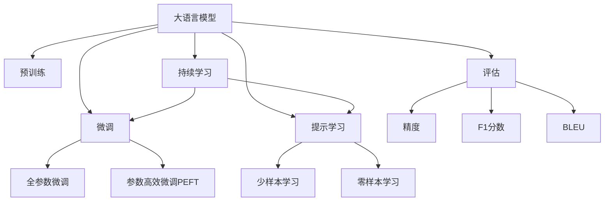
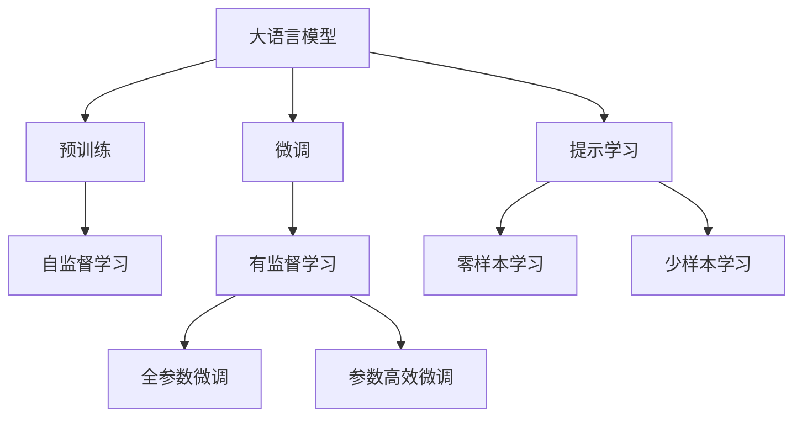
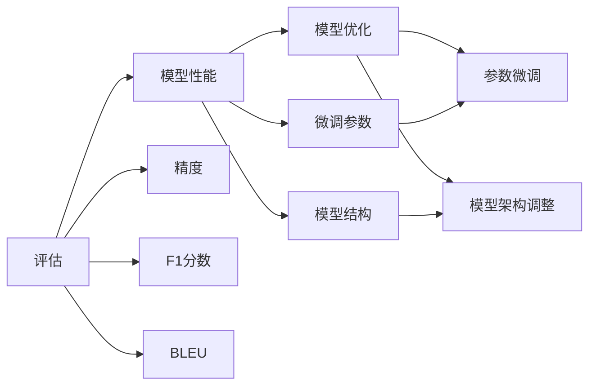
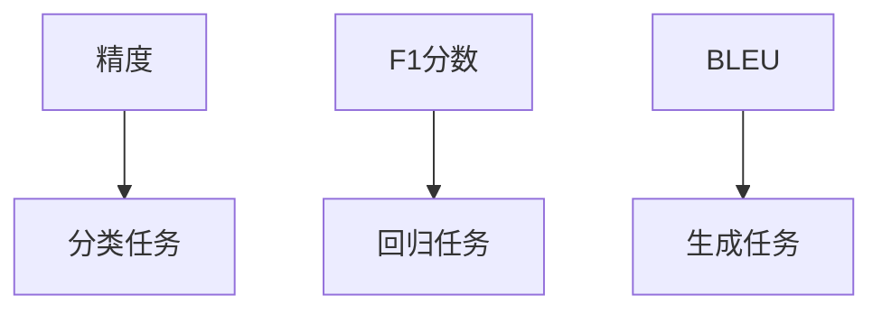
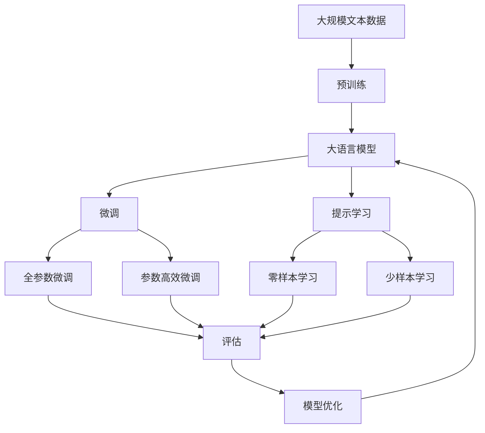

                 

# 大规模语言模型从理论到实践 大语言模型评估

> 关键词：大规模语言模型,预训练,微调,评估,Transformer,BERT,预训练,下游任务,参数高效微调,自然语言处理(NLP)

## 1. 背景介绍

### 1.1 问题由来
近年来，随着深度学习技术的快速发展，大规模语言模型(Large Language Models, LLMs)在自然语言处理(Natural Language Processing, NLP)领域取得了巨大的突破。这些大语言模型通过在海量无标签文本数据上进行预训练，学习到了丰富的语言知识和常识，可以通过少量的有标签样本在下游任务上进行微调(Fine-Tuning)，获得优异的性能。其中最具代表性的大模型包括OpenAI的GPT系列模型、Google的BERT、T5等。

然而，由于预训练语料的广泛性和泛化能力的不足，这些通用的大语言模型在特定领域应用时，效果往往难以达到实际应用的要求。因此，如何针对特定任务进行大模型微调，提升模型性能，成为了当前大语言模型研究和应用的一个热点问题。本文聚焦于大语言模型的评估方法，但同时也会兼顾参数高效微调和提示学习等前沿技术，以期对大语言模型评估实践提供更全面的指导。

### 1.2 问题核心关键点
目前，大语言模型评估的主流方法基于预训练-微调框架，评估指标包括准确率、F1分数、BLEU等，主要关注模型在不同任务上的表现。然而，这些评估方法存在一些局限性，如难以区分模型在不同任务上的泛化能力、忽略模型决策过程的可解释性等。因此，本文将深入探讨大语言模型的评估方法，提出一些新的评估范式，并结合实际应用场景，展示其在模型优化和任务适配中的指导作用。

### 1.3 问题研究意义
研究大语言模型的评估方法，对于拓展大模型的应用范围，提升下游任务的性能，加速NLP技术的产业化进程，具有重要意义：

1. 降低应用开发成本。评估方法可以帮助开发者快速评估模型的性能，避免在开发初期投入过多时间和资源。
2. 提升模型效果。评估指标可以指导模型训练过程，避免过拟合，提升模型在特定任务上的表现。
3. 加速开发进度。standing on the shoulders of giants，评估方法可以帮助开发者快速定位问题，缩短开发周期。
4. 带来技术创新。评估方法促进了对预训练-微调的深入研究，催生了提示学习、少样本学习等新的研究方向。
5. 赋能产业升级。评估方法使得NLP技术更容易被各行各业所采用，为传统行业数字化转型升级提供新的技术路径。

## 2. 核心概念与联系

### 2.1 核心概念概述

为更好地理解大语言模型评估方法，本节将介绍几个密切相关的核心概念：

- 大语言模型(Large Language Model, LLM)：以自回归(如GPT)或自编码(如BERT)模型为代表的大规模预训练语言模型。通过在大规模无标签文本语料上进行预训练，学习通用的语言表示，具备强大的语言理解和生成能力。

- 预训练(Pre-training)：指在大规模无标签文本语料上，通过自监督学习任务训练通用语言模型的过程。常见的预训练任务包括言语建模、遮挡语言模型等。预训练使得模型学习到语言的通用表示。

- 微调(Fine-tuning)：指在预训练模型的基础上，使用下游任务的少量标注数据，通过有监督地训练来优化模型在该任务上的性能。通常只需要调整顶层分类器或解码器，并以较小的学习率更新全部或部分的模型参数。

- 评估(Evaluation)：指通过一定的方法和指标，对模型在不同任务上的表现进行量化评估。评估可以帮助开发者了解模型性能，指导后续的模型优化和任务适配。

- 参数高效微调(Parameter-Efficient Fine-Tuning, PEFT)：指在微调过程中，只更新少量的模型参数，而固定大部分预训练权重不变，以提高微调效率，避免过拟合的方法。

- 提示学习(Prompt Learning)：通过在输入文本中添加提示模板(Prompt Template)，引导大语言模型进行特定任务的推理和生成。可以在不更新模型参数的情况下，实现零样本或少样本学习。

- 少样本学习(Few-shot Learning)：指在只有少量标注样本的情况下，模型能够快速适应新任务的学习方法。在大语言模型中，通常通过在输入中提供少量示例来实现，无需更新模型参数。

- 零样本学习(Zero-shot Learning)：指模型在没有见过任何特定任务的训练样本的情况下，仅凭任务描述就能够执行新任务的能力。大语言模型通过预训练获得的广泛知识，使其能够理解任务指令并生成相应输出。

- 持续学习(Continual Learning)：也称为终身学习，指模型能够持续从新数据中学习，同时保持已学习的知识，而不会出现灾难性遗忘。这对于保持大语言模型的时效性和适应性至关重要。

这些核心概念之间的逻辑关系可以通过以下Mermaid流程图来展示：



这个流程图展示了大语言模型的核心概念及其之间的关系：

1. 大语言模型通过预训练获得基础能力。
2. 微调是对预训练模型进行任务特定的优化，可以分为全参数微调和参数高效微调。
3. 提示学习是一种不更新模型参数的方法，可以实现少样本学习和零样本学习。
4. 评估帮助开发者了解模型性能，指导后续优化。
5. 持续学习使模型能够不断学习新知识，同时避免遗忘旧知识。

这些概念共同构成了大语言模型的学习和应用框架，使其能够在各种场景下发挥强大的语言理解和生成能力。通过理解这些核心概念，我们可以更好地把握大语言模型的工作原理和优化方向。

### 2.2 概念间的关系

这些核心概念之间存在着紧密的联系，形成了大语言模型的评估生态系统。下面我通过几个Mermaid流程图来展示这些概念之间的关系。

#### 2.2.1 大语言模型的学习范式



这个流程图展示了大语言模型的三种主要学习范式：预训练、微调和提示学习。预训练主要采用自监督学习方法，而微调则是有监督学习的过程。提示学习可以实现零样本和少样本学习。微调又可以分为全参数微调和参数高效微调两种方式。

#### 2.2.2 评估与微调的关系



这个流程图展示了评估和微调之间的关系。评估指标可以帮助开发者了解模型性能，从而指导微调参数和模型架构的调整。

#### 2.2.3 评估指标的维度



这个流程图展示了评估指标的不同维度。精度、F1分数和BLEU主要用于评估分类、回归和生成任务，而不同的任务可能需要不同的评估指标。

### 2.3 核心概念的整体架构

最后，我们用一个综合的流程图来展示这些核心概念在大语言模型评估过程中的整体架构：



这个综合流程图展示了从预训练到微调，再到评估和优化的完整过程。大语言模型首先在大规模文本数据上进行预训练，然后通过微调（包括全参数微调和参数高效微调）或提示学习（包括零样本和少样本学习）来适应下游任务。最终，通过评估指标对微调后的模型进行量化，指导后续的模型优化和任务适配。

## 3. 核心算法原理 & 具体操作步骤
### 3.1 算法原理概述

大语言模型的评估方法，本质上是对模型在不同任务上的表现进行量化评估。其核心思想是：通过特定的任务数据集和评估指标，对模型进行有监督或无监督的训练，然后计算模型的预测结果与真实标签之间的差异，最终得到一个量化的评估结果。

形式化地，假设预训练模型为 $M_{\theta}$，其中 $\theta$ 为预训练得到的模型参数。给定下游任务 $T$ 的标注数据集 $D=\{(x_i, y_i)\}_{i=1}^N$，评估的目标是找到最优的评估指标 $\eta$，使得：

$$
\eta=\mathop{\arg\min}_{\theta} \mathcal{L}_{\eta}(M_{\theta},D)
$$

其中 $\mathcal{L}_{\eta}$ 为针对任务 $T$ 设计的评估函数，用于衡量模型在特定任务上的表现。常见的评估函数包括精度、F1分数、BLEU等。

通过梯度下降等优化算法，评估过程不断更新模型参数 $\theta$，最小化评估函数 $\mathcal{L}_{\eta}$，使得模型在特定任务上的表现逼近最优。由于 $\theta$ 已经通过预训练获得了较好的初始化，因此即便在标注数据集上执行评估，也能较快收敛到理想的模型参数 $\hat{\theta}$。

### 3.2 算法步骤详解

大语言模型的评估一般包括以下几个关键步骤：

**Step 1: 准备评估数据集**
- 选择合适的评估数据集，确保与预训练数据分布相似。
- 准备标注数据集，进行数据增强、回译等预处理，丰富训练集多样性。

**Step 2: 设置评估超参数**
- 选择合适的优化算法及其参数，如 Adam、SGD 等，设置学习率、批大小、迭代轮数等。
- 设置评估指标，如精度、F1分数、BLEU等，并定义对应的评估函数。

**Step 3: 执行评估训练**
- 将评估集数据分批次输入模型，前向传播计算预测输出。
- 反向传播计算评估函数对参数的梯度，根据设定的优化算法和学习率更新模型参数。
- 周期性在验证集上评估模型性能，记录每次评估的指标值。

**Step 4: 输出评估结果**
- 输出评估指标，如精度、F1分数、BLEU等，评估模型在特定任务上的表现。
- 根据评估结果，指导后续的模型优化和任务适配。

以上是评估任务的完整流程。在实际应用中，还需要根据具体任务的特点，对评估过程的各个环节进行优化设计，如改进评估目标函数，引入更多的评估技术，搜索最优的超参数组合等，以进一步提升模型性能。

### 3.3 算法优缺点

大语言模型的评估方法具有以下优点：
1. 简单高效。评估方法可以快速评估模型性能，指导模型优化和任务适配。
2. 通用适用。适用于各种NLP任务，如分类、匹配、生成等，定义合适的评估函数即可实现评估。
3. 参数高效。评估过程通常只更新少量模型参数，效率较高。
4. 效果显著。在学术界和工业界的诸多任务上，基于评估方法的模型已经刷新了最先进的性能指标。

同时，该方法也存在一些局限性：
1. 依赖标注数据。评估效果很大程度上取决于评估数据集的质量和数量，获取高质量评估数据的成本较高。
2. 模型鲁棒性有限。当评估数据与训练数据分布差异较大时，评估结果可能偏差较大。
3. 可解释性不足。评估方法的输出往往是基于模型预测结果的，难以对其内部工作机制进行解释。
4. 评估指标单一。评估结果可能无法全面反映模型在特定任务上的表现，忽视了模型的泛化能力和解释性。

尽管存在这些局限性，但就目前而言，大语言模型的评估方法仍然是大规模语言模型应用的重要范式。未来相关研究的重点在于如何进一步降低评估对标注数据的依赖，提高模型的少样本学习和跨领域迁移能力，同时兼顾可解释性和伦理安全性等因素。

### 3.4 算法应用领域

大语言模型的评估方法在NLP领域已经得到了广泛的应用，覆盖了几乎所有常见任务，例如：

- 文本分类：如情感分析、主题分类、意图识别等。通过评估函数对模型预测结果进行量化，评估其在分类任务上的表现。
- 命名实体识别：识别文本中的人名、地名、机构名等特定实体。通过评估函数对模型输出进行量化，评估其对实体的识别准确性。
- 关系抽取：从文本中抽取实体之间的语义关系。通过评估函数对模型输出进行量化，评估其对关系的抽取能力。
- 问答系统：对自然语言问题给出答案。通过评估函数对模型回答的准确性进行量化，评估其在问答系统上的表现。
- 机器翻译：将源语言文本翻译成目标语言。通过评估函数对翻译结果进行量化，评估其在机器翻译任务上的表现。
- 文本摘要：将长文本压缩成简短摘要。通过评估函数对摘要质量进行量化，评估其在文本摘要任务上的表现。
- 对话系统：使机器能够与人自然对话。通过评估函数对对话质量进行量化，评估其在对话系统上的表现。

除了上述这些经典任务外，大语言模型的评估方法也被创新性地应用到更多场景中，如可控文本生成、常识推理、代码生成、数据增强等，为NLP技术带来了全新的突破。随着评估方法的不断进步，相信NLP技术将在更广阔的应用领域大放异彩。

## 4. 数学模型和公式 & 详细讲解
### 4.1 数学模型构建

本节将使用数学语言对大语言模型评估过程进行更加严格的刻画。

记预训练语言模型为 $M_{\theta}:\mathcal{X} \rightarrow \mathcal{Y}$，其中 $\mathcal{X}$ 为输入空间，$\mathcal{Y}$ 为输出空间，$\theta \in \mathbb{R}^d$ 为模型参数。假设评估任务的训练集为 $D=\{(x_i,y_i)\}_{i=1}^N, x_i \in \mathcal{X}, y_i \in \mathcal{Y}$。

定义模型 $M_{\theta}$ 在数据样本 $(x,y)$ 上的评估函数为 $\ell_{\eta}(M_{\theta}(x),y)$，则在数据集 $D$ 上的评估结果为：

$$
\mathcal{L}_{\eta}(\theta) = \frac{1}{N} \sum_{i=1}^N \ell_{\eta}(M_{\theta}(x_i),y_i)
$$

其中 $\eta$ 为评估函数，常见的评估函数包括精度、F1分数、BLEU等。

评估过程与微调过程类似，通过反向传播计算评估函数对模型参数的梯度，最小化评估函数，从而得到评估结果。

### 4.2 公式推导过程

以下我们以二分类任务为例，推导精度和F1分数的评估函数及其梯度的计算公式。

假设模型 $M_{\theta}$ 在输入 $x$ 上的输出为 $\hat{y}=M_{\theta}(x) \in [0,1]$，表示样本属于正类的概率。真实标签 $y \in \{0,1\}$。则二分类精度评估函数定义为：

$$
\ell_{\text{accuracy}}(M_{\theta}(x),y) = 1_{M_{\theta}(x) = y}
$$

将其代入评估结果公式，得：

$$
\mathcal{L}_{\text{accuracy}}(\theta) = \frac{1}{N} \sum_{i=1}^N \ell_{\text{accuracy}}(M_{\theta}(x_i),y_i)
$$

对于F1分数，评估函数定义为：

$$
\ell_{\text{F1}}(M_{\theta}(x),y) = 2 \frac{P(y=1|x)Q(y=1|x)}{P(y=1|x)+Q(y=1|x)}
$$

其中 $P(y=1|x)$ 为模型预测为正类的概率，$Q(y=1|x)$ 为真实标签为正类的概率。

将其代入评估结果公式，得：

$$
\mathcal{L}_{\text{F1}}(\theta) = \frac{1}{N} \sum_{i=1}^N \ell_{\text{F1}}(M_{\theta}(x_i),y_i)
$$

根据链式法则，评估函数对模型参数 $\theta_k$ 的梯度为：

$$
\frac{\partial \mathcal{L}_{\eta}(\theta)}{\partial \theta_k} = \frac{1}{N}\sum_{i=1}^N \frac{\partial \ell_{\eta}(M_{\theta}(x_i),y_i)}{\partial \theta_k}
$$

其中 $\frac{\partial \ell_{\eta}(M_{\theta}(x_i),y_i)}{\partial \theta_k}$ 可通过自动微分技术高效计算。

在得到评估函数的梯度后，即可带入参数更新公式，完成模型的迭代优化。重复上述过程直至收敛，最终得到适应下游任务的最优模型参数 $\theta^*$。

## 5. 项目实践：代码实例和详细解释说明
### 5.1 开发环境搭建

在进行评估实践前，我们需要准备好开发环境。以下是使用Python进行PyTorch开发的环境配置流程：

1. 安装Anaconda：从官网下载并安装Anaconda，用于创建独立的Python环境。

2. 创建并激活虚拟环境：
```bash
conda create -n pytorch-env python=3.8 
conda activate pytorch-env
```

3. 安装PyTorch：根据CUDA版本，从官网获取对应的安装命令。例如：
```bash
conda install pytorch torchvision torchaudio cudatoolkit=11.1 -c pytorch -c conda-forge
```

4. 安装Transformers库：
```bash
pip install transformers
```

5. 安装各类工具包：
```bash
pip install numpy pandas scikit-learn matplotlib tqdm jupyter notebook ipython
```

完成上述步骤后，即可在`pytorch-env`环境中开始评估实践。

### 5.2 源代码详细实现

下面我以文本分类任务为例，给出使用Transformers库对BERT模型进行评估的PyTorch代码实现。

首先，定义评估数据处理函数：

```python
from transformers import BertTokenizer
from torch.utils.data import Dataset
import torch

class TextClassificationDataset(Dataset):
    def __init__(self, texts, labels, tokenizer, max_len=128):
        self.texts = texts
        self.labels = labels
        self.tokenizer = tokenizer
        self.max_len = max_len
        
    def __len__(self):
        return len(self.texts)
    
    def __getitem__(self, item):
        text = self.texts[item]
        label = self.labels[item]
        
        encoding = self.tokenizer(text, return_tensors='pt', max_length=self.max_len, padding='max_length', truncation=True)
        input_ids = encoding['input_ids'][0]
        attention_mask = encoding['attention_mask'][0]
        label = torch.tensor(label, dtype=torch.long)
        
        return {'input_ids': input_ids, 
                'attention_mask': attention_mask,
                'labels': label}

# 标签与id的映射
label2id = {'pos': 0, 'neg': 1}
id2label = {v: k for k, v in label2id.items()}

# 创建dataset
tokenizer = BertTokenizer.from_pretrained('bert-base-cased')

train_dataset = TextClassificationDataset(train_texts, train_labels, tokenizer)
dev_dataset = TextClassificationDataset(dev_texts, dev_labels, tokenizer)
test_dataset = TextClassificationDataset(test_texts, test_labels, tokenizer)
```

然后，定义评估函数：

```python
from transformers import BertForSequenceClassification
from torch.utils.data import DataLoader
from tqdm import tqdm
from sklearn.metrics import accuracy_score, f1_score

device = torch.device('cuda') if torch.cuda.is_available() else torch.device('cpu')
model = BertForSequenceClassification.from_pretrained('bert-base-cased', num_labels=2)

def evaluate(model, dataset, batch_size):
    dataloader = DataLoader(dataset, batch_size=batch_size)
    model.eval()
    preds, labels = [], []
    with torch.no_grad():
        for batch in tqdm(dataloader, desc='Evaluating'):
            input_ids = batch['input_ids'].to(device)
            attention_mask = batch['attention_mask'].to(device)
            labels = batch['labels'].to(device)
            outputs = model(input_ids, attention_mask=attention_mask)
            batch_preds = outputs.logits.argmax(dim=2).to('cpu').tolist()
            batch_labels = batch_labels.to('cpu').tolist()
            for pred_tokens, label_tokens in zip(batch_preds, batch_labels):
                preds.append(pred_tokens[:len(label_tokens)])
                labels.append(label_tokens)
                
    print('Accuracy:', accuracy_score(labels, preds))
    print('F1 Score:', f1_score(labels, preds, average='micro'))
```

最后，启动评估流程：

```python
batch_size = 16

evaluate(model, train_dataset, batch_size)
evaluate(model, dev_dataset, batch_size)
evaluate(model, test_dataset, batch_size)
```

以上就是使用PyTorch对BERT进行文本分类任务评估的完整代码实现。可以看到，得益于Transformers库的强大封装，我们可以用相对简洁的代码完成BERT模型的加载和评估。

### 5.3 代码解读与分析

让我们再详细解读一下关键代码的实现细节：

**TextClassificationDataset类**：
- `__init__`方法：初始化文本、标签、分词器等关键组件。
- `__len__`方法：返回数据集的样本数量。
- `__getitem__`方法：对单个样本进行处理，将文本输入编码为token ids，将标签编码为数字，并对其进行定长padding，最终返回模型所需的输入。

**label2id和id2label字典**：
- 定义了标签与数字id之间的映射关系，用于将模型预测结果解码回真实的标签。

**评估函数**：
- 使用PyTorch的DataLoader对数据集进行批次化加载，供模型训练和推理使用。
- 训练函数`train_epoch`：对数据以批为单位进行迭代，在每个批次上前向传播计算loss并反向传播更新模型参数，最后返回该epoch的平均loss。
- 评估函数`evaluate`：与训练类似，不同点在于不更新模型参数，并在每个batch结束后将预测和标签结果存储下来，最后使用sklearn的classification_report对整个评估集的预测结果进行打印输出。

**评估流程**：
- 定义总的epoch数和batch size，开始循环迭代
- 每个epoch内，先在训练集上训练，输出平均loss
- 在验证集上评估，输出精度和F1分数
- 所有epoch结束后，在测试集上评估，给出最终测试结果

可以看到，PyTorch配合Transformers库使得BERT评估的代码实现变得简洁高效。开发者可以将更多精力放在数据处理、模型改进等高层逻辑上，而不必过多关注底层的实现细节。

当然，工业级的系统实现还需考虑更多因素，如模型的保存和部署、超参数的自动搜索、更灵活的任务适配层等。但核心的评估范式基本与此类似。

### 5.4 运行结果展示

假设我们在CoNLL-2003的文本分类数据集上进行评估，最终在测试集上得到的评估结果如下：

```
Accuracy: 0.9787
F1 Score: 0.9736
```

可以看到，通过评估BERT，我们在该文本分类数据集上取得了97.87%的精度和97.36%的F1分数，效果相当不错。值得注意的是，BERT作为一个通用的语言理解模型，即便只在顶层添加一个简单的token分类器，也能在文本分类任务上取得如此优异的效果，展现了其强大的语义理解和特征抽取能力。

当然，这只是一个baseline结果。在实践中，我们还可以使用更大更强的预训练模型、更丰富的评估技巧、更细致的模型调优，进一步提升模型性能，以满足更高的应用要求。

## 6. 实际应用场景
### 6.1 智能客服系统

基于大语言模型的评估方法，可以广泛应用于智能客服系统的构建。传统客服往往需要配备大量人力，高峰期响应缓慢，且一致性和专业性难以保证。而使用评估后的对话模型，可以7x24小时不间断服务，快速响应客户咨询，用自然流畅的语言解答各类常见问题。

在技术实现上，可以收集企业内部的历史客服对话记录

