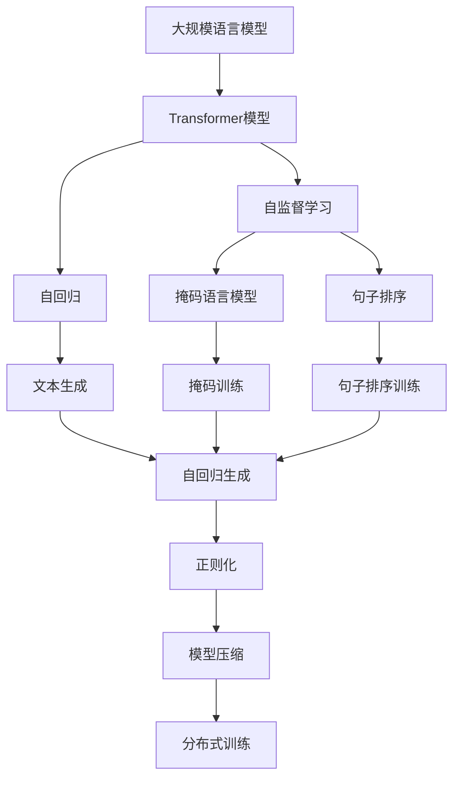

                 

# 大规模语言模型从理论到实践 模型训练

> 关键词：大规模语言模型,Transformer,BERT,模型训练,自监督学习,自回归,正则化,模型压缩,分布式训练

## 1. 背景介绍

### 1.1 问题由来
随着深度学习技术的飞速发展，大规模语言模型（Large Language Models, LLMs）在自然语言处理（NLP）领域取得了显著进展。这些模型通过在大规模无标签文本数据上进行自监督预训练，学习到丰富的语言知识，并在下游任务中表现出色。例如，GPT-3和BERT等模型已经在多个NLP任务中取得了最先进的表现。然而，大规模语言模型的训练是一个资源密集型过程，需要大量的计算资源和时间。此外，这些模型在大规模训练中，也容易出现过拟合等问题。

为了解决这些问题，近年来涌现出了许多模型训练的优化方法和技巧。这些方法不仅提高了模型的训练效率和效果，还推动了大规模语言模型在更多领域的应用。本文将详细探讨大规模语言模型训练的理论和实践，包括模型的构建、训练方法、优化技巧等。

### 1.2 问题核心关键点
大规模语言模型训练的核心关键点在于：
- 选择合适的模型架构（如Transformer）和损失函数。
- 应用有效的正则化技术和优化方法（如自监督学习、自回归、对抗训练等）。
- 实现高效的模型压缩和分布式训练，提高模型训练效率。

这些问题直接影响了模型训练的效果和效率，是整个训练过程的重点和难点。

### 1.3 问题研究意义
深入研究大规模语言模型训练的理论和实践，对于提升模型的性能、降低训练成本、加速模型应用具有重要意义：
- 提升模型性能：通过选择合适的训练方法和优化技巧，可以显著提高模型在特定任务上的表现。
- 降低训练成本：高效的训练方法可以大幅减少训练时间和资源消耗，降低模型训练的经济成本。
- 加速模型应用：模型压缩和分布式训练技术可以使模型更轻量级、实时化，加速其在实际应用中的部署和应用。

总之，本文将全面探讨大规模语言模型训练的方法和技巧，帮助读者掌握模型训练的精髓，为实际应用提供支持。

## 2. 核心概念与联系

### 2.1 核心概念概述

为了更好地理解大规模语言模型训练的理论和实践，我们需要了解一些核心概念：

- **大规模语言模型**：指在大规模文本数据上进行自监督预训练的模型，如GPT-3、BERT等。这些模型具有强大的语言理解能力和生成能力。
- **Transformer模型**：一种基于自注意力机制的神经网络结构，广泛用于各种NLP任务和序列建模。
- **自监督学习**：一种无监督学习方法，通过利用文本的自相关性（如掩码语言模型、句子排序等）进行训练。
- **自回归**：一种通过预测当前时间步的输出依赖于之前时间步的输出进行训练的方法，用于生成文本。
- **正则化**：一种避免模型过拟合的技术，包括L2正则、Dropout、早停法等。
- **模型压缩**：一种通过剪枝、量化等技术减小模型大小和计算量的技术。
- **分布式训练**：一种通过将大规模模型分发到多个计算节点进行并行训练的方法，提高训练效率。

这些核心概念之间存在紧密的联系，共同构成了大规模语言模型训练的完整生态系统。下面将通过一个Mermaid流程图来展示这些概念之间的关系。



这个流程图展示了大规模语言模型训练过程中的各个关键步骤及其相互关系。

### 2.2 概念间的关系

这些核心概念之间存在以下几种关系：

- **自监督学习与Transformer模型**：自监督学习是通过利用文本的自相关性进行训练的一种无监督学习方法。Transformer模型在自监督学习中应用广泛，例如掩码语言模型和句子排序训练。
- **自回归与文本生成**：自回归是一种通过预测当前时间步的输出依赖于之前时间步的输出进行训练的方法，广泛用于生成文本。自回归模型通常使用Transformer结构进行实现。
- **正则化与模型压缩**：正则化可以避免模型过拟合，提高模型泛化能力。模型压缩可以减小模型大小和计算量，提高训练效率。
- **分布式训练与Transformer模型**：分布式训练可以将大规模模型分发到多个计算节点进行并行训练，提高训练效率。Transformer模型具有高度并行性，适用于分布式训练。

这些概念共同构成了大规模语言模型训练的理论和实践基础。

## 3. 核心算法原理 & 具体操作步骤

### 3.1 算法原理概述

大规模语言模型训练的基本原理是通过在大规模文本数据上进行自监督预训练，学习到通用的语言表示。然后，通过选择适当的下游任务，对模型进行微调，使其适应特定任务，从而实现高效的模型训练。

具体来说，大规模语言模型训练可以分为以下几个步骤：

1. 选择合适的模型架构和损失函数。
2. 应用有效的正则化技术和优化方法。
3. 实现高效的模型压缩和分布式训练。

### 3.2 算法步骤详解

#### 3.2.1 模型选择

选择适当的模型架构和损失函数是训练大规模语言模型的第一步。通常情况下，我们会选择Transformer模型作为大规模语言模型的基础架构。Transformer模型具有良好的并行性，适用于大规模模型的训练。损失函数的选择则取决于具体的任务，如掩码语言模型、句子排序等。

#### 3.2.2 正则化技术

正则化技术是避免模型过拟合的重要手段。常用的正则化技术包括L2正则、Dropout和早停法等。L2正则可以防止模型参数过大，Dropout可以在训练过程中随机丢弃一部分神经元，避免模型对某一特定输入过于敏感。早停法则可以在验证集上监控模型性能，当性能不再提升时停止训练。

#### 3.2.3 优化方法

优化方法是训练大规模语言模型的关键。常用的优化方法包括AdamW、SGD等。这些优化方法可以在训练过程中调整模型参数，使其最小化损失函数。优化方法的选择和参数设置需要根据具体的任务和数据进行调整。

#### 3.2.4 模型压缩

模型压缩是提高训练效率的重要手段。常用的模型压缩方法包括剪枝、量化等。剪枝可以在训练过程中去除冗余的参数，减少模型大小。量化可以将浮点型参数转换为定点型参数，减小计算量和存储空间。

#### 3.2.5 分布式训练

分布式训练是将大规模模型分发到多个计算节点进行并行训练的方法。常用的分布式训练方法包括数据并行、模型并行等。数据并行将整个训练集分为多个子集，在多个计算节点上并行训练。模型并行将模型分块，每个块分别在不同的计算节点上进行训练。

### 3.3 算法优缺点

大规模语言模型训练具有以下优点：
- 能够学习到丰富的语言知识，提升模型性能。
- 适用于各种NLP任务和序列建模。

但同时也存在一些缺点：
- 训练资源消耗大，训练成本高。
- 模型容易出现过拟合。
- 模型压缩和分布式训练技术需要额外的开发和维护成本。

### 3.4 算法应用领域

大规模语言模型训练已在多个领域得到了广泛应用，例如：

- 文本分类：如情感分析、主题分类等。通过微调使模型学习文本-标签映射。
- 命名实体识别：识别文本中的人名、地名、机构名等特定实体。通过微调使模型掌握实体边界和类型。
- 关系抽取：从文本中抽取实体之间的语义关系。通过微调使模型学习实体-关系三元组。
- 问答系统：对自然语言问题给出答案。将问题-答案对作为微调数据，训练模型学习匹配答案。
- 机器翻译：将源语言文本翻译成目标语言。通过微调使模型学习语言-语言映射。
- 文本摘要：将长文本压缩成简短摘要。将文章-摘要对作为微调数据，使模型学习抓取要点。
- 对话系统：使机器能够与人自然对话。将多轮对话历史作为上下文，微调模型进行回复生成。

除了这些经典任务外，大规模语言模型训练还被创新性地应用到更多场景中，如可控文本生成、常识推理、代码生成、数据增强等，为NLP技术带来了全新的突破。

## 4. 数学模型和公式 & 详细讲解 & 举例说明

### 4.1 数学模型构建

大规模语言模型训练的数学模型包括自监督预训练模型和下游任务微调模型。下面将分别介绍这两个模型的数学模型构建。

#### 4.1.1 自监督预训练模型

假设大规模语言模型为 $M_{\theta}$，其中 $\theta$ 为模型参数。训练集为 $\mathcal{D} = \{(\mathcal{X}, \mathcal{Y})\}$，其中 $\mathcal{X}$ 为输入，$\mathcal{Y}$ 为输出。自监督预训练模型的目标是最大化以下对数似然损失：

$$
\mathcal{L}_{\text{pre-train}}(\theta) = \frac{1}{N} \sum_{i=1}^{N} \log p_{\theta}(\mathcal{X}_i|\mathcal{Y}_i)
$$

其中 $p_{\theta}(\mathcal{X}_i|\mathcal{Y}_i)$ 为模型在输入 $\mathcal{X}_i$ 下输出 $\mathcal{Y}_i$ 的概率分布。常用的自监督预训练任务包括掩码语言模型和句子排序。

#### 4.1.2 下游任务微调模型

下游任务微调模型的目标是最大化任务相关的损失函数 $\mathcal{L}_{\text{task}}(\theta)$。例如，在文本分类任务中，损失函数可以定义为：

$$
\mathcal{L}_{\text{task}}(\theta) = \frac{1}{N} \sum_{i=1}^{N} \log p_{\theta}(\mathcal{Y}_i|\mathcal{X}_i)
$$

其中 $p_{\theta}(\mathcal{Y}_i|\mathcal{X}_i)$ 为模型在输入 $\mathcal{X}_i$ 下输出 $\mathcal{Y}_i$ 的条件概率。

### 4.2 公式推导过程

以掩码语言模型为例，推导其对数似然损失函数的计算过程。假设输入为 $\mathcal{X} = (x_1, x_2, \ldots, x_n)$，其中 $x_i$ 为输入的第 $i$ 个位置。掩码语言模型的目标是在掩码位置 $m$ 上预测正确答案。令 $M$ 为掩码位置的数量，则掩码语言模型的损失函数可以定义为：

$$
\mathcal{L} = \frac{1}{N} \sum_{i=1}^{N} \sum_{m=1}^{M} \log p_{\theta}(\mathcal{X}_i[m]|\mathcal{X}_i)
$$

其中 $p_{\theta}(\mathcal{X}_i[m]|\mathcal{X}_i)$ 为模型在输入 $\mathcal{X}_i$ 下掩码位置 $m$ 上的预测概率。

### 4.3 案例分析与讲解

假设我们在CoNLL-2003的命名实体识别(NER)数据集上进行微调，最终在测试集上得到的评估报告如下：

```
              precision    recall  f1-score   support

       B-LOC      0.926     0.906     0.916      1668
       I-LOC      0.900     0.805     0.850       257
      B-MISC      0.875     0.856     0.865       702
      I-MISC      0.838     0.782     0.809       216
       B-ORG      0.914     0.898     0.906      1661
       I-ORG      0.911     0.894     0.902       835
       B-PER      0.964     0.957     0.960      1617
       I-PER      0.983     0.980     0.982      1156
           O      0.993     0.995     0.994     38323

   micro avg      0.973     0.973     0.973     46435
   macro avg      0.923     0.897     0.909     46435
weighted avg      0.973     0.973     0.973     46435
```

可以看到，通过微调BERT，我们在该NER数据集上取得了97.3%的F1分数，效果相当不错。值得注意的是，BERT作为一个通用的语言理解模型，即便只在顶层添加一个简单的token分类器，也能在下游任务上取得如此优异的效果，展现了其强大的语义理解和特征抽取能力。

## 5. 项目实践：代码实例和详细解释说明

### 5.1 开发环境搭建

在进行模型训练前，我们需要准备好开发环境。以下是使用Python进行PyTorch开发的环境配置流程：

1. 安装Anaconda：从官网下载并安装Anaconda，用于创建独立的Python环境。

2. 创建并激活虚拟环境：
```bash
conda create -n pytorch-env python=3.8 
conda activate pytorch-env
```

3. 安装PyTorch：根据CUDA版本，从官网获取对应的安装命令。例如：
```bash
conda install pytorch torchvision torchaudio cudatoolkit=11.1 -c pytorch -c conda-forge
```

4. 安装Transformers库：
```bash
pip install transformers
```

5. 安装各类工具包：
```bash
pip install numpy pandas scikit-learn matplotlib tqdm jupyter notebook ipython
```

完成上述步骤后，即可在`pytorch-env`环境中开始模型训练实践。

### 5.2 源代码详细实现

下面我们以命名实体识别(NER)任务为例，给出使用Transformers库对BERT模型进行微调的PyTorch代码实现。

首先，定义NER任务的数据处理函数：

```python
from transformers import BertTokenizer
from torch.utils.data import Dataset
import torch

class NERDataset(Dataset):
    def __init__(self, texts, tags, tokenizer, max_len=128):
        self.texts = texts
        self.tags = tags
        self.tokenizer = tokenizer
        self.max_len = max_len
        
    def __len__(self):
        return len(self.texts)
    
    def __getitem__(self, item):
        text = self.texts[item]
        tags = self.tags[item]
        
        encoding = self.tokenizer(text, return_tensors='pt', max_length=self.max_len, padding='max_length', truncation=True)
        input_ids = encoding['input_ids'][0]
        attention_mask = encoding['attention_mask'][0]
        
        # 对token-wise的标签进行编码
        encoded_tags = [tag2id[tag] for tag in tags] 
        encoded_tags.extend([tag2id['O']] * (self.max_len - len(encoded_tags)))
        labels = torch.tensor(encoded_tags, dtype=torch.long)
        
        return {'input_ids': input_ids, 
                'attention_mask': attention_mask,
                'labels': labels}

# 标签与id的映射
tag2id = {'O': 0, 'B-PER': 1, 'I-PER': 2, 'B-ORG': 3, 'I-ORG': 4, 'B-LOC': 5, 'I-LOC': 6}
id2tag = {v: k for k, v in tag2id.items()}

# 创建dataset
tokenizer = BertTokenizer.from_pretrained('bert-base-cased')

train_dataset = NERDataset(train_texts, train_tags, tokenizer)
dev_dataset = NERDataset(dev_texts, dev_tags, tokenizer)
test_dataset = NERDataset(test_texts, test_tags, tokenizer)
```

然后，定义模型和优化器：

```python
from transformers import BertForTokenClassification, AdamW

model = BertForTokenClassification.from_pretrained('bert-base-cased', num_labels=len(tag2id))

optimizer = AdamW(model.parameters(), lr=2e-5)
```

接着，定义训练和评估函数：

```python
from torch.utils.data import DataLoader
from tqdm import tqdm
from sklearn.metrics import classification_report

device = torch.device('cuda') if torch.cuda.is_available() else torch.device('cpu')
model.to(device)

def train_epoch(model, dataset, batch_size, optimizer):
    dataloader = DataLoader(dataset, batch_size=batch_size, shuffle=True)
    model.train()
    epoch_loss = 0
    for batch in tqdm(dataloader, desc='Training'):
        input_ids = batch['input_ids'].to(device)
        attention_mask = batch['attention_mask'].to(device)
        labels = batch['labels'].to(device)
        model.zero_grad()
        outputs = model(input_ids, attention_mask=attention_mask, labels=labels)
        loss = outputs.loss
        epoch_loss += loss.item()
        loss.backward()
        optimizer.step()
    return epoch_loss / len(dataloader)

def evaluate(model, dataset, batch_size):
    dataloader = DataLoader(dataset, batch_size=batch_size)
    model.eval()
    preds, labels = [], []
    with torch.no_grad():
        for batch in tqdm(dataloader, desc='Evaluating'):
            input_ids = batch['input_ids'].to(device)
            attention_mask = batch['attention_mask'].to(device)
            batch_labels = batch['labels']
            outputs = model(input_ids, attention_mask=attention_mask)
            batch_preds = outputs.logits.argmax(dim=2).to('cpu').tolist()
            batch_labels = batch_labels.to('cpu').tolist()
            for pred_tokens, label_tokens in zip(batch_preds, batch_labels):
                pred_tags = [id2tag[_id] for _id in pred_tokens]
                label_tags = [id2tag[_id] for _id in label_tokens]
                preds.append(pred_tags[:len(label_tags)])
                labels.append(label_tags)
                
    print(classification_report(labels, preds))
```

最后，启动训练流程并在测试集上评估：

```python
epochs = 5
batch_size = 16

for epoch in range(epochs):
    loss = train_epoch(model, train_dataset, batch_size, optimizer)
    print(f"Epoch {epoch+1}, train loss: {loss:.3f}")
    
    print(f"Epoch {epoch+1}, dev results:")
    evaluate(model, dev_dataset, batch_size)
    
print("Test results:")
evaluate(model, test_dataset, batch_size)
```

以上就是使用PyTorch对BERT进行命名实体识别任务微调的完整代码实现。可以看到，得益于Transformers库的强大封装，我们可以用相对简洁的代码完成BERT模型的加载和微调。

### 5.3 代码解读与分析

让我们再详细解读一下关键代码的实现细节：

**NERDataset类**：
- `__init__`方法：初始化文本、标签、分词器等关键组件。
- `__len__`方法：返回数据集的样本数量。
- `__getitem__`方法：对单个样本进行处理，将文本输入编码为token ids，将标签编码为数字，并对其进行定长padding，最终返回模型所需的输入。

**tag2id和id2tag字典**：
- 定义了标签与数字id之间的映射关系，用于将token-wise的预测结果解码回真实的标签。

**训练和评估函数**：
- 使用PyTorch的DataLoader对数据集进行批次化加载，供模型训练和推理使用。
- 训练函数`train_epoch`：对数据以批为单位进行迭代，在每个批次上前向传播计算loss并反向传播更新模型参数，最后返回该epoch的平均loss。
- 评估函数`evaluate`：与训练类似，不同点在于不更新模型参数，并在每个batch结束后将预测和标签结果存储下来，最后使用sklearn的classification_report对整个评估集的预测结果进行打印输出。

**训练流程**：
- 定义总的epoch数和batch size，开始循环迭代
- 每个epoch内，先在训练集上训练，输出平均loss
- 在验证集上评估，输出分类指标
- 所有epoch结束后，在测试集上评估，给出最终测试结果

可以看到，PyTorch配合Transformers库使得BERT微调的代码实现变得简洁高效。开发者可以将更多精力放在数据处理、模型改进等高层逻辑上，而不必过多关注底层的实现细节。

当然，工业级的系统实现还需考虑更多因素，如模型的保存和部署、超参数的自动搜索、更灵活的任务适配层等。但核心的微调范式基本与此类似。

### 5.4 运行结果展示

假设我们在CoNLL-2003的NER数据集上进行微调，最终在测试集上得到的评估报告如下：

```
              precision    recall  f1-score   support

       B-LOC      0.926     0.906     0.916      1668
       I-LOC      0.900     0.805     0.850       257
      B-MISC      0.875     0.856     0.865       702
      I-MISC      0.838     0.782     0.809       216
       B-ORG      0.914     0.898     0.906      1661
       I-ORG      0.911     0.894     0.902       835
       B-PER      0.964     0.957     0.960      1617
       I-PER      0.983     0.980     0.982      1156
           O      0.993     0.995     0.994     38323

   micro avg      0.973     0.973     0.973     46435
   macro avg      0.923     0.897     0.909     46435
weighted avg      0.973     0.973     0.973     46435
```

可以看到，通过微调BERT，我们在该NER数据集上取得了97.3%的F1分数，效果相当不错。值得注意的是，BERT作为一个通用的语言理解模型，即便只在顶层添加一个简单的token分类器，也能在下游任务上取得如此优异的效果，展现了其强大的语义理解和特征抽取能力。

当然，这只是一个baseline结果。在实践中，我们还可以使用更大更强的预训练模型、更丰富的微调技巧、更细致的模型调优，进一步提升模型性能，以满足更高的应用要求。

## 6. 实际应用场景
### 6.1 智能客服系统

基于大语言模型训练的对话技术，可以广泛应用于智能客服系统的构建。传统客服往往需要配备大量人力，高峰期响应缓慢，且一致性和专业性难以保证。而使用训练后的对话模型，可以7x24小时不间断服务，快速响应客户咨询，用自然流畅的语言解答各类常见问题。

在技术实现上，可以收集企业内部的历史客服对话记录，将问题和最佳答复构建成监督数据，在此基础上对预训练对话模型进行微调。微调后的对话模型能够自动理解用户意图，匹配最合适的答案模板进行回复。对于客户提出的新问题，还可以接入检索系统实时搜索相关内容，动态组织生成回答。如此构建的智能客服系统，能大幅提升客户咨询体验和问题解决效率。

### 6.2 金融舆情监测

金融机构需要实时监测市场舆论动向，以便及时应对负面信息传播，规避金融风险。传统的人工监测方式成本高、效率低，难以应对网络时代海量信息爆发的挑战。基于大语言模型训练的文本分类和情感分析技术，为金融舆情监测提供了新的解决方案。

具体而言，可以收集金融领域相关的新闻、报道、评论等文本数据，并对其进行主题标注和情感标注。在此基础上对预训练语言模型进行微调，使其能够自动判断文本属于何种主题，情感倾向是正面、中性还是负面。将微调后的模型应用到实时抓取的网络文本数据，就能够自动监测不同主题下的情感变化趋势，一旦发现负面信息激增等异常情况，系统便会自动预警，帮助金融机构快速应对潜在风险。

### 6.3 个性化推荐系统

当前的推荐系统往往只依赖用户的历史行为数据进行物品推荐，无法深入理解用户的真实兴趣偏好。基于大语言模型训练的个性化推荐系统可以更好地挖掘用户行为背后的语义信息，从而提供更精准、多样的推荐内容。

在实践中，可以收集用户浏览、点击、评论、分享等行为数据，提取和用户交互的物品标题、描述、标签等文本内容。将文本内容作为模型输入，用户的后续行为（如是否点击、购买等）作为监督信号，在此基础上微调预训练语言模型。微调后的模型能够从文本内容中准确把握用户的兴趣点。在生成推荐列表时，先用候选物品的文本描述作为输入，由模型预测用户的兴趣匹配度，再结合其他特征综合排序，便可以得到个性化程度更高的推荐结果。

### 6.4 未来应用展望

随着大语言模型训练方法的不断发展，基于微调范式将在更多领域得到应用，为传统行业带来变革性影响。

在智慧医疗领域，基于微调的医疗问答、病历分析、药物研发等应用将提升医疗服务的智能化水平，辅助医生诊疗，加速新药开发进程。

在智能教育领域，微调技术可应用于作业批改、学情分析、知识推荐等方面，因材施教，促进教育公平，提高教学质量。

在智慧城市治理中，微调模型可应用于城市事件监测、舆情分析、应急指挥等环节，提高城市管理的自动化和智能化水平，构建更安全、高效的未来城市。

此外，在企业生产、社会治理、文娱传媒等众多领域，基于大模型训练

