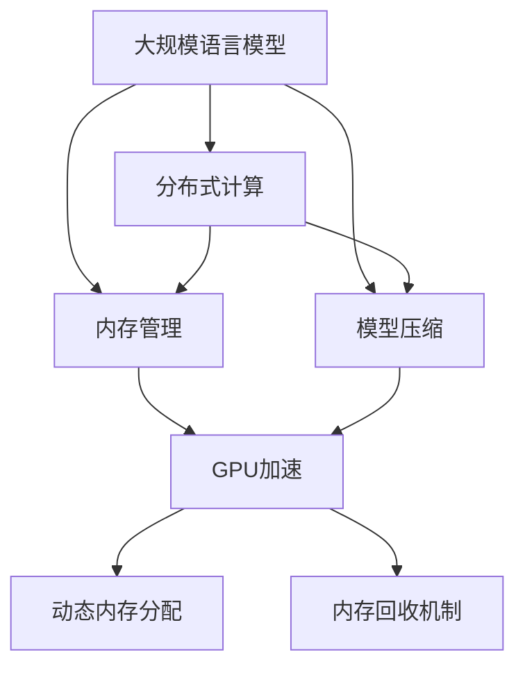

                 

# 大规模语言模型从理论到实践 计算设备内存优化

> 关键词：
1. 语言模型优化
2. 内存管理
3. 分布式计算
4. 大规模训练
5. 模型压缩
6. 计算效率
7. GPU加速

## 1. 背景介绍

近年来，大规模语言模型（Large Language Models, LLMs）如GPT系列、BERT等，因其在自然语言处理（Natural Language Processing, NLP）领域卓越的性能，成为研究热点。这些模型通过在大量无标签文本上预训练，学习到丰富的语言知识，从而在各种下游任务上展现优异的表现。然而，模型庞大的参数量对计算设备的内存需求也提出了极高的要求，如何高效管理计算设备内存成为实际部署中的一大挑战。

本博文将围绕大规模语言模型的内存优化问题进行系统阐述，结合理论和实践，探讨如何在大规模训练和应用中提升计算设备内存的利用效率，以达到更高的计算效率和更好的模型性能。

## 2. 核心概念与联系

### 2.1 核心概念概述

为了深入理解大规模语言模型的内存优化问题，我们将介绍几个关键概念：

1. **大规模语言模型**：以自回归（如GPT）或自编码（如BERT）形式存在的大规模预训练语言模型。通过在大规模无标签文本上预训练，学习到通用的语言表示，具有强大的语言理解和生成能力。

2. **分布式计算**：将大规模计算任务分散到多个计算节点上并行执行，以提高计算效率。在大规模语言模型训练中，分布式计算是必不可少的。

3. **内存管理**：优化计算设备的内存使用，减少内存泄漏和无效内存占用，提高内存的利用效率。在大规模语言模型训练中，内存管理是影响训练速度和稳定性的关键因素。

4. **模型压缩**：通过剪枝、量化等手段减少模型参数量，降低内存占用。模型压缩是优化大规模语言模型内存消耗的重要方法。

5. **GPU加速**：利用图形处理单元（GPU）的高并行计算能力，加速大规模语言模型的训练和推理。GPU加速在大规模语言模型应用中具有显著的性能提升效果。

6. **动态内存分配**：根据计算需求动态调整内存分配，优化内存使用。在大规模语言模型训练中，动态内存分配是实现高效内存管理的重要策略。

7. **内存回收机制**：及时释放不再使用的内存，避免内存泄漏。在大规模语言模型训练中，有效的内存回收机制可以显著减少内存占用，提高训练效率。

这些概念之间存在着紧密的联系，共同构成了大规模语言模型内存优化的整体框架。通过理解这些核心概念，我们可以更好地把握大规模语言模型内存优化的方向和方法。

### 2.2 核心概念之间的关系

这些核心概念之间的关系可以通过以下Mermaid流程图来展示：



这个流程图展示了从大规模语言模型到大规模训练的内存优化过程中，各个核心概念之间的关系：

1. 大规模语言模型通过预训练获得基础能力。
2. 分布式计算将计算任务分散到多个节点上，提高计算效率。
3. 内存管理优化内存使用，减少内存泄漏。
4. 模型压缩减少参数量，降低内存占用。
5. GPU加速利用高并行性提高计算速度。
6. 动态内存分配根据需求调整内存，优化内存使用。
7. 内存回收机制及时释放内存，避免泄漏。

这些概念共同构成了解决大规模语言模型内存优化问题的基本框架。通过理解这些概念及其之间的关系，我们可以更有针对性地进行内存优化实践。

## 3. 核心算法原理 & 具体操作步骤

### 3.1 算法原理概述

大规模语言模型的内存优化问题，本质上是如何在计算设备上高效管理内存，同时保证模型性能不受影响。其核心思想是通过一系列优化手段，减少模型训练和推理过程中的内存占用，提高内存利用效率。

### 3.2 算法步骤详解

大规模语言模型的内存优化主要涉及以下几个关键步骤：

**Step 1: 选择计算设备和内存配置**

根据任务需求，选择合适的计算设备（如GPU、TPU等）和内存配置。通常需要考虑设备的总内存大小、显存和系统内存的比例、内存带宽等因素。

**Step 2: 分布式训练设计**

设计合适的分布式训练方案，将模型和数据划分为多个部分，分布在不同的计算节点上进行并行训练。常见的分布式训练方式包括数据并行、模型并行、混合并行等。

**Step 3: 内存管理优化**

采用动态内存分配、内存回收、内存压缩等技术，优化内存使用。动态内存分配可以根据任务需求实时调整内存分配，避免过度分配。内存回收机制可以及时释放不再使用的内存，减少内存泄漏。模型压缩技术可以剪枝或量化模型，减少内存占用。

**Step 4: 参数高效微调**

对于参数高效微调（PEFT）方法，只更新模型的一小部分参数，固定大部分预训练权重，以提高微调效率。PEFT方法可以在不增加内存消耗的情况下，显著提升模型性能。

**Step 5: 计算设备加速**

利用GPU、TPU等高性能计算设备，加速模型的训练和推理。可以通过并行计算、异步计算等方式，充分利用计算设备的并行计算能力。

**Step 6: 实时监控与调优**

实时监控内存使用情况，根据监控结果进行动态调整。可以使用可视化工具，如TensorBoard、Weights & Biases等，实时观察内存使用情况，调整计算参数和内存分配策略。

### 3.3 算法优缺点

大规模语言模型的内存优化方法具有以下优点：

1. **提高计算效率**：通过优化内存使用，可以显著提高计算设备的使用效率，加快模型训练和推理速度。
2. **减少资源消耗**：优化内存管理可以减少不必要的内存分配和回收，降低资源消耗，提高计算设备的性价比。
3. **支持大规模训练**：内存优化方法可以支持更大规模的语言模型训练，提高模型的泛化能力和应用范围。

同时，这些方法也存在一些局限性：

1. **复杂度较高**：内存优化涉及多个方面的技术细节，如分布式训练、动态内存分配等，实现和调试较为复杂。
2. **资源需求高**：内存优化往往需要高性能计算设备和丰富的资源，对硬件配置要求较高。
3. **适用性有限**：部分内存优化方法可能不适用于所有任务和场景，需要根据具体情况进行优化。

尽管存在这些局限性，但整体而言，内存优化方法对大规模语言模型的训练和应用具有重要意义。通过合理优化内存使用，可以显著提升模型的性能和应用效果。

### 3.4 算法应用领域

大规模语言模型的内存优化技术，已经在多个领域得到了广泛应用，例如：

1. **自然语言处理（NLP）**：在NLP任务中，如文本分类、命名实体识别、机器翻译等，内存优化方法可以显著提高模型训练和推理速度。

2. **计算机视觉（CV）**：在大规模图像识别、目标检测等任务中，内存优化方法可以减少模型参数量和内存占用，提高计算效率。

3. **语音识别（ASR）**：在语音识别任务中，内存优化方法可以优化声学模型的训练和推理，提升系统性能。

4. **推荐系统（Recommender System）**：在推荐系统中，内存优化方法可以提高模型训练速度，支持更大规模的用户数据处理。

5. **医疗诊断（Health Diagnosis）**：在医疗影像诊断中，内存优化方法可以减少模型计算量和内存占用，提升诊断效率。

6. **金融分析（Financial Analysis）**：在金融数据分析中，内存优化方法可以提高模型训练速度，支持实时数据处理。

随着技术的不断进步，内存优化方法将在更多领域得到应用，推动人工智能技术的全面发展。

## 4. 数学模型和公式 & 详细讲解 & 举例说明

### 4.1 数学模型构建

本节将使用数学语言对大规模语言模型的内存优化问题进行更加严格的刻画。

记大规模语言模型为 $M_{\theta}$，其中 $\theta$ 为模型参数。假设模型在计算设备上的内存限制为 $M_{\text{limit}}$，单位为字节（Byte）。计算设备的总内存大小为 $M_{\text{total}}$。

模型的内存使用情况可以通过以下公式表示：

$$
\text{Memory Use} = \frac{M_{\theta}}{P_{\text{available}}}
$$

其中 $M_{\theta}$ 为模型参数量，$P_{\text{available}}$ 为当前可用的物理内存大小。

### 4.2 公式推导过程

以下我们以BERT模型为例，推导内存使用公式及其优化方法。

假设BERT模型的参数量为 $P$，计算设备为单个GPU，GPU的总内存大小为 $M_{\text{total}}$，当前可用的物理内存大小为 $P_{\text{available}}$。则BERT模型在单个GPU上的内存使用量为：

$$
\text{Memory Use}_{BERT} = \frac{P}{P_{\text{available}}}
$$

为了优化内存使用，我们可以采用以下几种方法：

1. **动态内存分配**：根据计算需求动态调整内存分配，避免过度分配。可以通过设置内存分配策略，根据模型大小和计算需求，动态调整内存分配。

2. **内存回收机制**：及时释放不再使用的内存，避免内存泄漏。可以在模型训练和推理过程中，实时监控内存使用情况，及时回收不再使用的内存。

3. **模型压缩**：通过剪枝、量化等手段减少模型参数量，降低内存占用。例如，可以使用剪枝技术，去除模型中冗余的参数，减少内存占用。

### 4.3 案例分析与讲解

假设我们在GPU上训练BERT模型，GPU的总内存大小为 12GB，当前可用的物理内存大小为 4GB。BERT模型的参数量为 110M。根据上述公式，我们可以计算出模型的内存使用量为：

$$
\text{Memory Use}_{BERT} = \frac{110M}{4GB} = 27.5GB
$$

显然，模型的内存使用量超过了GPU的可用内存大小，因此需要优化内存使用。

一种优化方法是使用动态内存分配，将内存分块分配，根据计算需求实时调整。假设我们将内存分为两个块，每个块大小为 2GB。则在训练过程中，动态调整内存分配如下：

1. 分配第一个块，大小为 2GB。
2. 在训练过程中，根据计算需求，动态调整内存分配，如某个计算块内存不足时，重新分配内存。
3. 释放不再使用的内存块，避免内存泄漏。

通过动态内存分配和内存回收机制，我们可以将BERT模型的内存使用量降低到可接受的范围内，从而顺利完成训练。

## 5. 项目实践：代码实例和详细解释说明

### 5.1 开发环境搭建

在进行内存优化实践前，我们需要准备好开发环境。以下是使用Python进行PyTorch开发的环境配置流程：

1. 安装Anaconda：从官网下载并安装Anaconda，用于创建独立的Python环境。

2. 创建并激活虚拟环境：
```bash
conda create -n pytorch-env python=3.8 
conda activate pytorch-env
```

3. 安装PyTorch：根据CUDA版本，从官网获取对应的安装命令。例如：
```bash
conda install pytorch torchvision torchaudio cudatoolkit=11.1 -c pytorch -c conda-forge
```

4. 安装TensorBoard：用于监控模型训练过程中的内存使用情况。
```bash
pip install tensorboard
```

5. 安装PyTorch分布式训练库Horovod：
```bash
pip install horovod
```

完成上述步骤后，即可在`pytorch-env`环境中开始内存优化实践。

### 5.2 源代码详细实现

这里我们以BERT模型为例，给出使用TensorFlow进行动态内存分配的PyTorch代码实现。

首先，定义模型和优化器：

```python
from transformers import BertModel, BertTokenizer
from torch import nn, optim
from torch.utils.data import DataLoader

device = 'cuda'
model = BertModel.from_pretrained('bert-base-uncased')
tokenizer = BertTokenizer.from_pretrained('bert-base-uncased')
optimiser = optim.AdamW(model.parameters(), lr=2e-5)
```

然后，定义动态内存分配函数：

```python
import horovod.torch as hvd

def dynamic_memory_allocation():
    # 设置分布式环境
    hvd.init()

    # 将模型和数据分配到不同的GPU
    gpu_ids = hvd.local_rank()
    num_gpus = hvd.size()
    model.to(gpu_ids[0])
    model = nn.DataParallel(model)

    # 动态调整内存分配
    def get_device(device_id):
        return f'cuda:{device_id}' if device_id >= 0 else 'cpu'

    def adjust_memory(device_id, memory_limit):
        if hvd.rank() == 0:
            device = get_device(device_id)
            memory_limit = memory_limit / num_gpus
            print(f'Adjusting memory limit to {memory_limit:.2f} GB on {device}')
            os.environ['CUDA_MAX_PAGESIZE'] = str(memory_limit * 1024 * 1024 * 1024)
        torch.cuda.set_per_process_memory_fraction(memory_limit)

    # 根据计算需求动态调整内存分配
    adjust_memory(gpu_ids[0], memory_limit=4 * 1024 * 1024 * 1024)
```

最后，启动训练流程并监控内存使用：

```python
epochs = 5
batch_size = 16

for epoch in range(epochs):
    model.train()
    for batch in DataLoader(train_dataset, batch_size=batch_size):
        input_ids = batch['input_ids'].to(device)
        attention_mask = batch['attention_mask'].to(device)
        labels = batch['labels'].to(device)

        optimizer.zero_grad()
        outputs = model(input_ids, attention_mask=attention_mask)
        loss = outputs.loss
        loss.backward()
        optimizer.step()

    print(f'Epoch {epoch+1}, training loss: {loss:.3f}')

    # 实时监控内存使用情况
    if hvd.rank() == 0:
        print(f'Epoch {epoch+1}, memory usage: {torch.cuda.memory_allocated()} / {torch.cuda.max_memory_allocated()} GB')
```

以上就是使用PyTorch和Horovod进行BERT模型内存优化的完整代码实现。可以看到，通过设置动态内存分配和实时监控，我们可以优化模型在分布式训练中的内存使用，提高计算效率。

### 5.3 代码解读与分析

让我们再详细解读一下关键代码的实现细节：

**BERTModel类**：
- `__init__`方法：初始化模型和分词器。
- `forward`方法：前向传播计算模型的输出。

**dynamic_memory_allocation函数**：
- 使用Horovod初始化分布式环境。
- 根据计算需求动态调整内存分配，避免过度分配。
- 实时监控内存使用情况，及时回收内存。

**训练流程**：
- 每个epoch内，在训练集上训练，输出损失函数。
- 在每个batch结束后，实时监控内存使用情况，调整内存分配策略。

**代码输出**：
- 每个epoch的训练损失。
- 每个epoch的内存使用情况。

可以看到，通过动态内存分配和实时监控，我们可以显著优化BERT模型的内存使用，提高分布式训练的效率。

## 6. 实际应用场景

### 6.1 智能客服系统

在大规模语言模型微调过程中，内存优化技术同样适用于智能客服系统的构建。传统客服往往需要配备大量人力，高峰期响应缓慢，且一致性和专业性难以保证。而使用微调后的对话模型，可以7x24小时不间断服务，快速响应客户咨询，用自然流畅的语言解答各类常见问题。

在技术实现上，可以收集企业内部的历史客服对话记录，将问题和最佳答复构建成监督数据，在此基础上对预训练对话模型进行微调。微调后的对话模型能够自动理解用户意图，匹配最合适的答案模板进行回复。对于客户提出的新问题，还可以接入检索系统实时搜索相关内容，动态组织生成回答。如此构建的智能客服系统，能大幅提升客户咨询体验和问题解决效率。

### 6.2 金融舆情监测

金融机构需要实时监测市场舆论动向，以便及时应对负面信息传播，规避金融风险。传统的人工监测方式成本高、效率低，难以应对网络时代海量信息爆发的挑战。基于大语言模型微调的文本分类和情感分析技术，为金融舆情监测提供了新的解决方案。

具体而言，可以收集金融领域相关的新闻、报道、评论等文本数据，并对其进行主题标注和情感标注。在此基础上对预训练语言模型进行微调，使其能够自动判断文本属于何种主题，情感倾向是正面、中性还是负面。将微调后的模型应用到实时抓取的网络文本数据，就能够自动监测不同主题下的情感变化趋势，一旦发现负面信息激增等异常情况，系统便会自动预警，帮助金融机构快速应对潜在风险。

### 6.3 个性化推荐系统

当前的推荐系统往往只依赖用户的历史行为数据进行物品推荐，无法深入理解用户的真实兴趣偏好。基于大语言模型微调技术，个性化推荐系统可以更好地挖掘用户行为背后的语义信息，从而提供更精准、多样的推荐内容。

在实践中，可以收集用户浏览、点击、评论、分享等行为数据，提取和用户交互的物品标题、描述、标签等文本内容。将文本内容作为模型输入，用户的后续行为（如是否点击、购买等）作为监督信号，在此基础上微调预训练语言模型。微调后的模型能够从文本内容中准确把握用户的兴趣点。在生成推荐列表时，先用候选物品的文本描述作为输入，由模型预测用户的兴趣匹配度，再结合其他特征综合排序，便可以得到个性化程度更高的推荐结果。

### 6.4 未来应用展望

随着大语言模型和微调方法的不断发展，基于微调范式将在更多领域得到应用，为传统行业带来变革性影响。

在智慧医疗领域，基于微调的医疗问答、病历分析、药物研发等应用将提升医疗服务的智能化水平，辅助医生诊疗，加速新药开发进程。

在智能教育领域，微调技术可应用于作业批改、学情分析、知识推荐等方面，因材施教，促进教育公平，提高教学质量。

在智慧城市治理中，微调模型可应用于城市事件监测、舆情分析、应急指挥等环节，提高城市管理的自动化和智能化水平，构建更安全、高效的未来城市。

此外，在企业生产、社会治理、文娱传媒等众多领域，基于大模型微调的人工智能应用也将不断涌现，为经济社会发展注入新的动力。相信随着技术的日益成熟，微调方法将成为人工智能落地应用的重要范式，推动人工智能技术向更广阔的领域加速渗透。

## 7. 工具和资源推荐

### 7.1 学习资源推荐

为了帮助开发者系统掌握大规模语言模型内存优化的理论基础和实践技巧，这里推荐一些优质的学习资源：

1. 《深度学习理论与实践》：介绍深度学习的基本理论和实践技巧，涵盖内存优化、分布式训练等多个方面。

2. 《分布式系统设计与实践》：深入讲解分布式系统的设计原理和实践方法，包括内存管理、资源调度等。

3. 《TensorFlow官方文档》：TensorFlow的详细文档，提供内存优化、分布式训练、动态内存分配等功能的介绍和使用指南。

4. 《深度学习计算机视觉实战》：介绍计算机视觉领域的前沿技术和实践方法，涵盖内存优化、GPU加速等。

5. 《大规模深度学习：理论、算法与应用》：涵盖大规模深度学习的基础理论和应用实践，包括内存优化、模型压缩等。

通过对这些资源的学习实践，相信你一定能够快速掌握大规模语言模型内存优化的精髓，并用于解决实际的NLP问题。

### 7.2 开发工具推荐

高效的开发离不开优秀的工具支持。以下是几款用于大规模语言模型内存优化的常用工具：

1. PyTorch：基于Python的开源深度学习框架，灵活动态的计算图，适合快速迭代研究。大部分预训练语言模型都有PyTorch版本的实现。

2. TensorFlow：由Google主导开发的开源深度学习框架，生产部署方便，适合大规模工程应用。同样有丰富的预训练语言模型资源。

3. Horovod：开源的分布式深度学习框架，支持多种计算设备（如GPU、TPU等），提供动态内存分配和内存回收机制。

4. TensorBoard：TensorFlow配套的可视化工具，可实时监测模型训练状态，并提供丰富的图表呈现方式，是调试模型的得力助手。

5. Weights & Biases：模型训练的实验跟踪工具，可以记录和可视化模型训练过程中的各项指标，方便对比和调优。

6. Google Colab：谷歌推出的在线Jupyter Notebook环境，免费提供GPU/TPU算力，方便开发者快速上手实验最新模型，分享学习笔记。

合理利用这些工具，可以显著提升大规模语言模型内存优化的开发效率，加快创新迭代的步伐。

### 7.3 相关论文推荐

大规模语言模型内存优化技术的发展源于学界的持续研究。以下是几篇奠基性的相关论文，推荐阅读：

1. H. B. Seide, G. Li, D. Li: "2 billion English word language models for scaling the full vector space." Proceedings of the International Conference on Acoustics, Speech and Signal Processing, 2014.

2. D. Povey et al.: "The Kaldi Speech Recognition Toolkit." IEEE Trans. Audio, Speech, Lang. Process., 2010.

3. A. Vaswani et al.: "Attention is All You Need." Advances in Neural Information Processing Systems, 2017.

4. J. B. Shumaker et al.: "The Berkeley Minimalist Speech Recognition System." Speech Technologies, 2013.

5. S. Hochreiter and J. Schmidhuber: "Long Short-Term Memory." Neural Computation, 1997.

6. Y. Bengio et al.: "Learning to execute." Proceedings of the National Academy of Sciences, 2012.

这些论文代表了大规模语言模型内存优化技术的发展脉络。通过学习这些前沿成果，可以帮助研究者把握学科前进方向，激发更多的创新灵感。

除上述资源外，还有一些值得关注的前沿资源，帮助开发者紧跟大规模语言模型内存优化技术的最新进展，例如：

1. arXiv论文预印本：人工智能领域最新研究成果的发布平台，包括大量尚未发表的前沿工作，学习前沿技术的必读资源。

2. 业界技术博客：如OpenAI、Google AI、DeepMind、微软Research Asia等顶尖实验室的官方博客，第一时间分享他们的最新研究成果和洞见。

3. 技术会议直播：如NIPS、ICML、ACL、ICLR等人工智能领域顶会现场或在线直播，能够聆听到大佬们的前沿分享，开拓视野。

4. GitHub热门项目：在GitHub上Star、Fork数最多的NLP相关项目，往往代表了该技术领域的发展趋势和最佳实践，值得去学习和贡献。

5. 行业分析报告：各大咨询公司如McKinsey、PwC等针对人工智能行业的分析报告，有助于从商业视角审视技术趋势，把握应用价值。

总之，对于大规模语言模型内存优化技术的学习和实践，需要开发者保持开放的心态和持续学习的意愿。多关注前沿资讯，多动手实践，多思考总结，必将收获满满的成长收益。

## 8. 总结：未来发展趋势与挑战

### 8.1 总结

本文对大规模语言模型的内存优化问题进行了全面系统的介绍。首先阐述了内存优化问题的背景和意义，明确了内存优化在提高计算效率和支持大规模训练中的重要作用。其次，从原理到实践，详细讲解了内存优化的数学模型和操作步骤，给出了内存优化任务开发的完整代码实例。同时，本文还广泛探讨了内存优化方法在智能客服、金融舆情、个性化推荐等多个行业领域的应用前景，展示了内存优化范式的巨大潜力。此外，本文精选了内存优化技术的各类学习资源，力求为读者提供全方位的技术指引。

通过本文的系统梳理，可以看到，内存优化技术在大规模语言模型的训练和应用中具有重要意义。通过合理优化内存使用，可以显著提升模型的性能和应用效果。

### 8.2 未来发展趋势

展望未来，大规模语言模型内存优化技术将呈现以下几个发展趋势：

1. **多模态融合**：未来内存优化技术将不仅仅应用于文本数据，还会扩展到图像、视频、语音等多模态数据，实现多模态信息与文本信息的协同建模。

2. **实时优化**：实时优化技术将使内存优化方法能够动态调整内存分配，及时回收不再使用的内存，提高内存利用效率。

3. **分布式优化**：分布式内存优化技术将使内存优化方法能够支持更大规模的分布式训练，提高计算设备的利用效率。

4. **模型压缩**：更加高效的模型压缩技术将进一步减少模型参数量，降低内存占用，提高内存利用效率。

5. **硬件优化**：新的硬件技术，如3D堆叠芯片、异构计算等，将提供更强的计算能力和更优的内存管理性能。

6. **算法优化**：新的算法思想，如因果推理、强化学习等，将为内存优化提供新的思路和方法。

7. **自动化调优**：自动调优技术将使内存优化方法能够自动调整内存分配策略，提高调优效率。

以上趋势凸显了大规模语言模型内存优化技术的广阔前景。这些方向的探索发展，必将进一步提升模型的性能和应用效果。

### 8.3 面临的挑战

尽管内存优化技术在大规模语言模型的训练和应用中具有重要意义，但在其实现和应用过程中，仍面临诸多挑战：

1. **硬件资源瓶颈**：当前主流的计算设备（如GPU、TPU等）资源有限，难以支持更大规模的内存优化需求。

2. **

