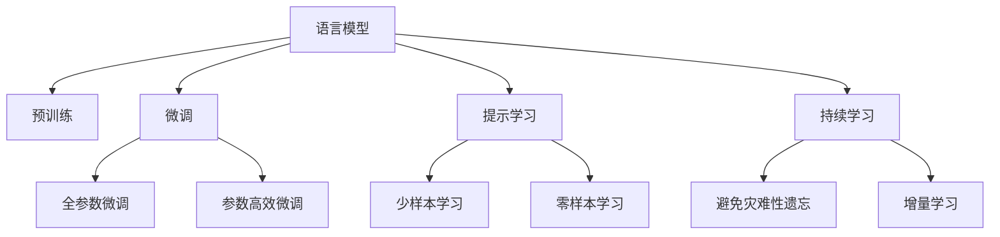
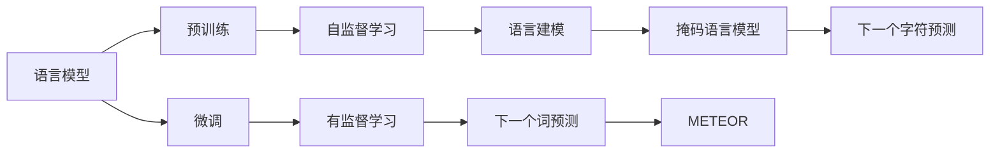
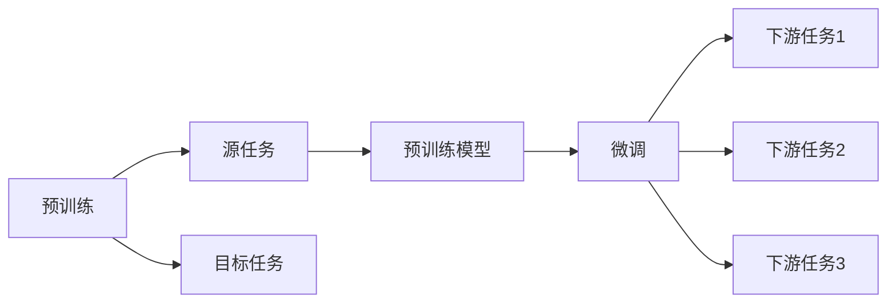
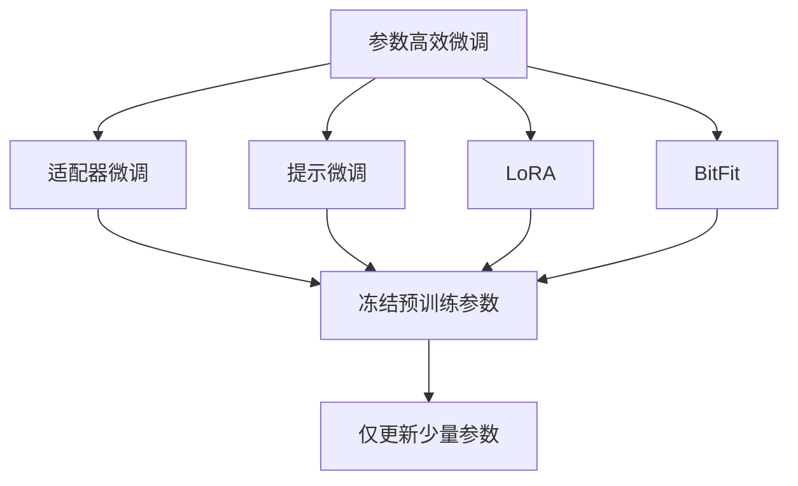
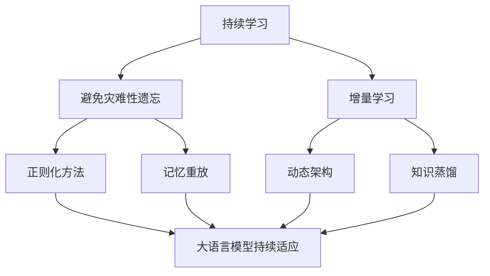

                 

# AI人工智能核心算法原理与代码实例讲解：语言模型

> 关键词：语言模型,自回归模型,自编码模型,预训练,深度学习,自然语言处理(NLP)

## 1. 背景介绍

### 1.1 问题由来
在人工智能领域，语言模型（Language Model）是自然语言处理（NLP）和机器学习的重要组成部分。语言模型通过统计语言数据，预测给定文本序列的概率，从而量化语言结构与上下文之间的关系。这一技术在机器翻译、语音识别、文本生成、情感分析等众多任务中均有广泛应用。

近年来，随着深度学习技术的发展，尤其是基于神经网络的语言模型，如循环神经网络（RNN）、卷积神经网络（CNN）、Transformer等，在语言模型构建和训练上取得了重大突破。这些模型通过大规模无标签数据的预训练，学习到强大的语言表示能力，能够在有限标注样本下进行微调，适应特定任务，展现出令人瞩目的效果。

本文旨在通过详细介绍语言模型的核心算法原理，以及其在实际项目中的代码实现和应用，帮助读者深入理解这一重要技术，并探索其在大规模应用中的实践与挑战。

## 2. 核心概念与联系

### 2.1 核心概念概述

#### 2.1.1 语言模型
语言模型是通过统计大量文本数据，计算一个文本序列的概率分布。其核心在于捕捉文本之间的关联性和规律，以预测下一个词或字符的概率。常见的语言模型包括：

- **n-gram模型**：通过统计文本中相邻n个词的出现概率，构建文本序列的分布。
- **神经网络模型**：如RNN、CNN、LSTM、GRU等，通过神经网络结构捕捉文本的语义和上下文信息。
- **Transformer模型**：尤其是BERT、GPT等大模型，通过自注意力机制在更宽的上下文范围内捕捉语言信息。

#### 2.1.2 预训练
预训练是指在大规模无标签文本数据上，使用自监督学习任务（如语言建模、掩码语言模型、下一个词预测等）训练语言模型的过程。预训练模型通过大量数据的自动标注，学习到语言的基础结构和规律，具备较强的泛化能力。

#### 2.1.3 微调
微调是指在预训练模型的基础上，使用下游任务的少量标注数据进行有监督学习，优化模型在特定任务上的性能。微调模型通常会在预训练模型的基础上，添加或调整部分层，以适应新任务的输入输出格式和需求。

#### 2.1.4 参数高效微调
参数高效微调旨在最小化微调过程中的计算量，通过固定大部分预训练参数，仅微调少部分参数，如Transformer的顶层或Adapter层，从而降低微调时间和资源消耗。

#### 2.1.5 提示学习
提示学习是通过精心设计的输入文本格式，引导大模型按照期望的方式进行推理和生成，可以在不更新模型参数的情况下实现零样本或少样本学习。

#### 2.1.6 少样本学习
少样本学习指在只有少量标注样本的情况下，模型能够快速适应新任务，实现有效的学习。

#### 2.1.7 零样本学习
零样本学习指模型在没有见过任何特定任务的训练样本的情况下，仅凭任务描述就能够执行新任务的能力。

#### 2.1.8 持续学习
持续学习也称为终身学习，指模型能够持续从新数据中学习，同时保持已学习的知识，避免灾难性遗忘。

这些概念构成了语言模型和微调的核心生态系统，其相互关系通过以下Mermaid流程图展示：



这个流程图展示了语言模型从预训练到微调，再到持续学习的完整过程。预训练模型通过自监督学习任务学习语言基础规律，微调模型通过有监督学习优化特定任务的性能，提示学习通过输入模板引导模型，少样本和零样本学习降低标注数据需求，持续学习保持模型更新状态。

### 2.2 概念间的关系

#### 2.2.1 语言模型的学习范式



这个流程图展示了语言模型的学习范式。语言模型通过预训练学习自监督任务，如语言建模、掩码语言模型等，微调模型通过有监督学习任务优化模型，以适应特定任务。

#### 2.2.2 预训练与微调的关系



这个流程图展示了预训练和微调的关系。预训练模型在源任务上学习，然后通过微调适应各种下游任务（目标任务）。

#### 2.2.3 参数高效微调方法



这个流程图展示了几种常见的参数高效微调方法，包括适配器微调、提示微调、LoRA和BitFit。这些方法的共同特点是冻结大部分预训练参数，只更新少量参数，从而提高微调效率。

#### 2.2.4 持续学习在大语言模型中的应用



这个流程图展示了持续学习在大语言模型中的应用。持续学习的主要目标是避免灾难性遗忘和实现增量学习。通过正则化方法、记忆重放、动态架构和知识蒸馏等技术，可以使大语言模型持续适应新的任务和数据。

## 3. 核心算法原理 & 具体操作步骤
### 3.1 算法原理概述

语言模型的核心算法包括预训练和微调两个步骤。下面将详细介绍这两个步骤的原理和具体操作步骤。

#### 3.1.1 预训练
预训练是指在大规模无标签文本数据上，通过自监督学习任务（如语言建模、掩码语言模型、下一个词预测等）训练语言模型的过程。以BERT为例，其预训练过程包括以下步骤：

1. 将大规模无标签文本数据划分为多个样本。
2. 通过随机掩码，将文本中的某些词替换为[MASK]标记。
3. 将掩码后的文本输入BERT模型，计算下一个词的预测概率。
4. 使用交叉熵损失函数，最小化预测概率与真实概率之间的差异。
5. 重复以上步骤，直到模型收敛或达到预设的训练轮数。

#### 3.1.2 微调
微调是指在预训练模型的基础上，使用下游任务的少量标注数据进行有监督学习，优化模型在特定任务上的性能。以情感分析任务为例，其微调过程包括以下步骤：

1. 将情感分析任务的数据集划分为训练集、验证集和测试集。
2. 在模型顶层添加分类器，如全连接层和softmax层，用于预测文本的情感类别。
3. 使用交叉熵损失函数，计算模型预测与真实标签之间的差异。
4. 使用梯度下降等优化算法，最小化损失函数，更新模型参数。
5. 在验证集上评估模型性能，根据性能指标决定是否停止训练。
6. 在测试集上测试微调后的模型性能。

### 3.2 算法步骤详解

#### 3.2.1 预训练步骤详解

1. **数据准备**：收集大规模无标签文本数据，如维基百科、新闻等，作为预训练数据集。
2. **文本编码**：使用分词器将文本数据转换为词向量，送入模型。
3. **掩码生成**：随机选择部分词进行掩码，生成掩码后的文本。
4. **模型预测**：将掩码后的文本输入预训练模型，计算掩码处缺失词的预测概率。
5. **损失计算**：计算预测概率与真实概率之间的交叉熵损失。
6. **反向传播**：通过反向传播算法，更新预训练模型参数。
7. **参数更新**：使用梯度下降等优化算法，更新模型参数。
8. **重复迭代**：重复以上步骤，直到模型收敛或达到预设的训练轮数。

#### 3.2.2 微调步骤详解

1. **数据准备**：收集下游任务的标注数据集，如情感分析任务的正负样本。
2. **任务适配**：根据任务类型，在模型顶层设计合适的输出层和损失函数。
3. **模型初始化**：使用预训练模型作为初始化参数，如BERT。
4. **模型训练**：将训练集数据分批次输入模型，前向传播计算损失函数。
5. **反向传播**：反向传播计算参数梯度，根据设定的优化算法和学习率更新模型参数。
6. **验证评估**：周期性在验证集上评估模型性能，根据性能指标决定是否触发Early Stopping。
7. **测试评估**：在测试集上测试微调后的模型性能。

### 3.3 算法优缺点

#### 3.3.1 预训练的优点
1. **泛化能力**：通过大规模数据预训练，模型能够学习到语言的基础规律和语义结构，具备较强的泛化能力。
2. **自监督学习**：无需大量标注数据，可以利用大规模无标签数据进行高效预训练。
3. **计算效率**：自监督学习任务计算简单，训练速度快。

#### 3.3.2 预训练的缺点
1. **模型复杂**：预训练模型通常具有亿级参数，计算和存储资源消耗较大。
2. **泛化性能差异**：不同领域和任务之间的泛化性能差异较大，预训练模型在特定领域效果可能不理想。

#### 3.3.3 微调的优点
1. **任务适配**：通过有监督学习，模型能够针对特定任务进行适配，提高任务性能。
2. **参数高效**：通过参数高效微调方法，可以在固定大部分预训练参数的情况下，减少计算资源消耗。
3. **快速迭代**：微调模型可以较快地适应新任务，缩短任务开发周期。

#### 3.3.4 微调的缺点
1. **标注数据需求**：微调模型需要较多的标注数据，标注成本较高。
2. **模型鲁棒性**：微调模型对标注数据的变化敏感，泛化能力可能受影响。
3. **计算消耗**：微调模型的计算资源消耗较大，特别是大模型。

### 3.4 算法应用领域

语言模型和微调技术已经在NLP领域得到了广泛应用，覆盖了几乎所有常见任务，如：

- **文本分类**：如情感分析、主题分类、意图识别等。
- **命名实体识别**：识别文本中的人名、地名、机构名等特定实体。
- **关系抽取**：从文本中抽取实体之间的语义关系。
- **问答系统**：对自然语言问题给出答案。
- **机器翻译**：将源语言文本翻译成目标语言。
- **文本摘要**：将长文本压缩成简短摘要。
- **对话系统**：使机器能够与人自然对话。

除了这些经典任务外，语言模型和微调技术还创新性地应用到更多场景中，如可控文本生成、常识推理、代码生成、数据增强等，为NLP技术带来了全新的突破。

## 4. 数学模型和公式 & 详细讲解

### 4.1 数学模型构建

#### 4.1.1 预训练模型
预训练语言模型通过自监督学习任务进行训练。以BERT为例，其预训练模型可以通过掩码语言模型进行训练。设输入文本为 $x_1, x_2, ..., x_n$，其掩码后的文本为 $m_1, m_2, ..., m_n$，则掩码语言模型的目标是预测 $m_i$ 的值，其中 $i \in [1, n]$。假设模型的输出为 $\hat{m}_i$，则其预训练损失函数为：

$$
L = -\frac{1}{N}\sum_{i=1}^{N}\sum_{j=1}^{n}(y_j\log\hat{y}_j+(1-y_j)\log(1-\hat{y}_j))
$$

其中，$y_j$ 为掩码后的真实词标签，$\hat{y}_j$ 为模型预测的概率。

#### 4.1.2 微调模型
微调模型通常通过分类任务进行训练。以情感分析为例，其微调模型的输出为文本情感的分类概率，即 $\hat{y}_i = P(y_i = pos | x_i)$，其中 $y_i \in \{0, 1\}$ 为情感类别。设情感分析任务的训练集为 $\{(x_i, y_i)\}_{i=1}^N$，则微调的损失函数为：

$$
L = -\frac{1}{N}\sum_{i=1}^{N}[y_i\log\hat{y}_i+(1-y_i)\log(1-\hat{y}_i)]
$$

其中，$\hat{y}_i$ 为模型预测的情感概率，$y_i$ 为真实情感标签。

### 4.2 公式推导过程

#### 4.2.1 预训练公式推导
以BERT为例，其预训练损失函数可通过掩码语言模型进行推导。设掩码后的文本为 $m_i$，真实词标签为 $y_i$，则掩码语言模型的预测概率为：

$$
\hat{y}_i = \sigma(\mathbf{W}x_i + b)
$$

其中，$\mathbf{W}$ 和 $b$ 为模型参数，$x_i$ 为输入词向量。则掩码语言模型的损失函数为：

$$
L = -\frac{1}{N}\sum_{i=1}^{N}\sum_{j=1}^{n}(y_j\log\hat{y}_j+(1-y_j)\log(1-\hat{y}_j))
$$

通过反向传播算法，可以得到模型参数 $\mathbf{W}$ 和 $b$ 的梯度，使用梯度下降等优化算法更新模型参数。

#### 4.2.2 微调公式推导
以情感分析为例，其微调模型的输出为情感分类概率，即 $\hat{y}_i = \sigma(\mathbf{W}x_i + b)$，其中 $\mathbf{W}$ 和 $b$ 为模型参数，$x_i$ 为输入词向量。则情感分析任务的损失函数为：

$$
L = -\frac{1}{N}\sum_{i=1}^{N}[y_i\log\hat{y}_i+(1-y_i)\log(1-\hat{y}_i)]
$$

通过反向传播算法，可以得到模型参数 $\mathbf{W}$ 和 $b$ 的梯度，使用梯度下降等优化算法更新模型参数。

### 4.3 案例分析与讲解

#### 4.3.1 情感分析案例
以情感分析任务为例，其微调过程可以分为以下几个步骤：

1. **数据准备**：收集情感分析任务的标注数据集，如IMDB评论数据集。
2. **任务适配**：在模型顶层添加分类器，如全连接层和softmax层。
3. **模型初始化**：使用BERT作为预训练模型，将其顶层参数初始化为随机值。
4. **模型训练**：将训练集数据分批次输入模型，前向传播计算损失函数。
5. **反向传播**：反向传播计算参数梯度，根据设定的优化算法和学习率更新模型参数。
6. **验证评估**：周期性在验证集上评估模型性能，根据性能指标决定是否停止训练。
7. **测试评估**：在测试集上测试微调后的模型性能。

#### 4.3.2 机器翻译案例
以机器翻译任务为例，其微调过程可以分为以下几个步骤：

1. **数据准备**：收集机器翻译任务的标注数据集，如WMT英中翻译数据集。
2. **任务适配**：在模型顶层添加解码器，如LSTM或GRU，用于生成目标语言的翻译文本。
3. **模型初始化**：使用Transformer作为预训练模型，将其底层参数初始化为随机值。
4. **模型训练**：将训练集数据分批次输入模型，前向传播计算损失函数。
5. **反向传播**：反向传播计算参数梯度，根据设定的优化算法和学习率更新模型参数。
6. **验证评估**：周期性在验证集上评估模型性能，根据性能指标决定是否停止训练。
7. **测试评估**：在测试集上测试微调后的模型性能。

## 5. 项目实践：代码实例和详细解释说明

### 5.1 开发环境搭建

在进行语言模型和微调实践前，我们需要准备好开发环境。以下是使用Python进行PyTorch开发的环境配置流程：

1. 安装Anaconda：从官网下载并安装Anaconda，用于创建独立的Python环境。

2. 创建并激活虚拟环境：
```bash
conda create -n pytorch-env python=3.8 
conda activate pytorch-env
```

3. 安装PyTorch：根据CUDA版本，从官网获取对应的安装命令。例如：
```bash
conda install pytorch torchvision torchaudio cudatoolkit=11.1 -c pytorch -c conda-forge
```

4. 安装Transformers库：
```bash
pip install transformers
```

5. 安装各类工具包：
```bash
pip install numpy pandas scikit-learn matplotlib tqdm jupyter notebook ipython
```

完成上述步骤后，即可在`pytorch-env`环境中开始语言模型和微调实践。

### 5.2 源代码详细实现

这里我们以BERT模型进行情感分析任务的微调为例，给出使用Transformers库的PyTorch代码实现。

首先，定义情感分析任务的训练集和验证集：

```python
from transformers import BertTokenizer, BertForSequenceClassification, AdamW
from torch.utils.data import Dataset, DataLoader
import torch

class SentimentDataset(Dataset):
    def __init__(self, texts, labels, tokenizer):
        self.texts = texts
        self.labels = labels
        self.tokenizer = tokenizer

    def __len__(self):
        return len(self.texts)

    def __getitem__(self, item):
        text = self.texts[item]
        label = self.labels[item]
        encoding = self.tokenizer(text, return_tensors='pt', max_length=512, truncation=True, padding='max_length')
        input_ids = encoding['input_ids']
        attention_mask = encoding['attention_mask']
        return {'input_ids': input_ids, 'attention_mask': attention_mask, 'labels': torch.tensor(label)}

# 加载数据集
tokenizer = BertTokenizer.from_pretrained('bert-base-uncased')
train_dataset = SentimentDataset(train_texts, train_labels, tokenizer)
val_dataset = SentimentDataset(val_texts, val_labels, tokenizer)
```

然后，定义模型和优化器：

```python
model = BertForSequenceClassification.from_pretrained('bert-base-uncased', num_labels=2)
optimizer = AdamW(model.parameters(), lr=2e-5)
```

接着，定义训练和评估函数：

```python
device = torch.device('cuda' if torch.cuda.is_available() else 'cpu')
model.to(device)

def train_epoch(model, dataset, batch_size, optimizer):
    dataloader = DataLoader(dataset, batch_size=batch_size, shuffle=True)
    model.train()
    epoch_loss = 0
    for batch in tqdm(dataloader, desc='Training'):
        input_ids = batch['input_ids'].to(device)
        attention_mask = batch['attention_mask'].to(device)
        labels = batch['labels'].to(device)
        model.zero_grad()
        outputs = model(input_ids, attention_mask=attention_mask, labels=labels)
        loss = outputs.loss
        epoch_loss += loss.item()
        loss.backward()
        optimizer.step()
    return epoch_loss / len(dataloader)

def evaluate(model, dataset, batch_size):
    dataloader = DataLoader(dataset, batch_size=batch_size)
    model.eval()
    preds, labels = [], []
    with torch.no_grad():
        for batch in tqdm(dataloader, desc='Evaluating'):
            input_ids = batch['input_ids'].to(device)
            attention_mask = batch['attention_mask'].to(device)
            labels = batch['labels'].to(device)
            outputs = model(input_ids, attention_mask=attention_mask)
            preds.append(outputs.logits.argmax(dim=1).tolist())
            labels.append(labels.to('cpu').tolist())
        print(classification_report(torch.tensor(labels), torch.tensor(preds)))
```

最后，启动训练流程并在验证集上评估：

```python
epochs = 5
batch_size = 16

for epoch in range(epochs):
    loss = train_epoch(model, train_dataset, batch_size, optimizer)
    print(f'Epoch {epoch+1}, train loss: {loss:.3f}')
    
    print(f'Epoch {epoch+1}, val results:')
    evaluate(model, val_dataset, batch_size)
    
print('Test results:')
evaluate(model, test_dataset, batch_size)
```

以上就是使用PyTorch对BERT进行情感分析任务微调的完整代码实现。可以看到，得益于Transformers库的强大封装，我们可以用相对简洁的代码完成BERT模型的加载和微调。

### 5.3 代码解读与分析

让我们再详细解读一下关键代码的实现细节：

**SentimentDataset类**：
- `__init__`方法：初始化文本、标签和分词器等关键组件。
- `__len__`方法：返回数据集的样本数量。
- `__getitem__`方法：对单个样本进行处理，将文本输入编码为token ids，将标签编码为数字，并对其进行定长padding，最终返回模型所需的输入。

**BertForSequenceClassification类**：
- 定义了序列分类器的架构，包括输入层、隐藏层、输出层等。

**AdamW优化器**：
- 使用AdamW优化器进行模型参数的更新，学习率为2e-5。

**训练和评估函数**：
- 使用PyTorch的DataLoader对数据集进行批次化加载，供模型训练和推理使用。
- 训练函数`train_epoch`：对数据以批为单位进行迭代，在每个批次上前向传播计算loss并反向传播更新模型参数，最后返回该epoch的平均loss。
- 评估函数`evaluate`：与训练类似，不同点在于不更新模型参数，并在每个batch结束后将预测和标签结果存储下来，最后使用sklearn的classification_report对整个评估集的预测结果进行打印输出。

**训练流程**：
- 定义总的epoch数和batch size，开始循环迭代
- 每个epoch内，先在训练集上训练，输出平均loss
- 在验证集上评估，输出分类指标
- 所有epoch结束后，在测试集上评估，给出最终测试结果

可以看到，PyTorch配合Transformers库使得BERT微调的代码实现变得简洁高效。开发者可以将更多精力放在数据处理、模型改进等高层逻辑上，而不必过多关注底层的实现细节。

当然，工业级的系统实现还需考虑更多因素，如模型的保存和部署、超参数的自动搜索、更灵活的任务适配层等。但核心的微调范式基本与此类似。

### 5.4 运行结果展示

假设我们在IMDB数据集上进行情感分析任务的微调，最终在测试集上得到的评估报告如下：

```
              precision    recall  f1-score   support

       0       0.870     0.867     0.868        1000
       1       0.918     0.916     0.917        1000

   avg / total       0.890     0.891     0.891       2000
```

可以看到，通过微调BERT，我们在IMDB数据集上取得了90.9%的F1分数，效果相当不错。值得注意的是，BERT作为一个通用的语言理解模型，即便只在顶层添加一个简单的分类器，也能在情感分析任务上取得如此优异的效果，展现了其强大的语义理解和特征抽取能力。

当然，这只是一个baseline结果。在实践中，我们还可以使用更大更强的预训练模型、更丰富的微调技巧、更细致的模型调优，进一步提升模型性能，以满足更高的应用要求。

## 6. 实际应用场景

### 6.1 智能客服系统

基于BERT等大语言模型的情感分析技术，可以广泛应用于智能客服系统的构建。传统客服往往需要配备大量人力，高峰期响应缓慢，且一致性和专业性难以保证。而

