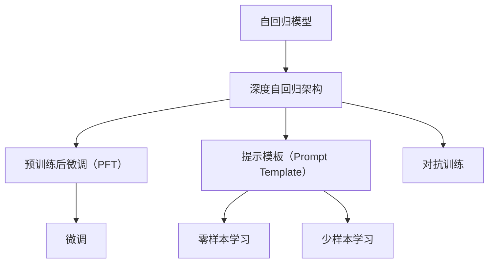
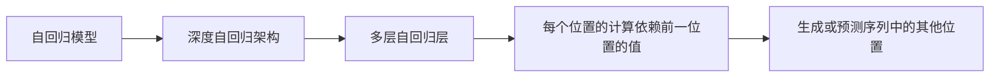
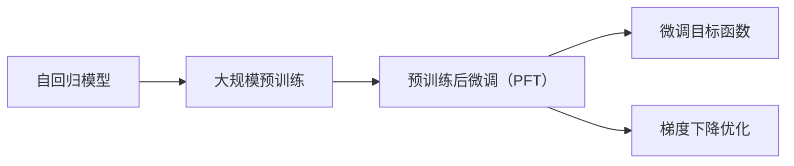
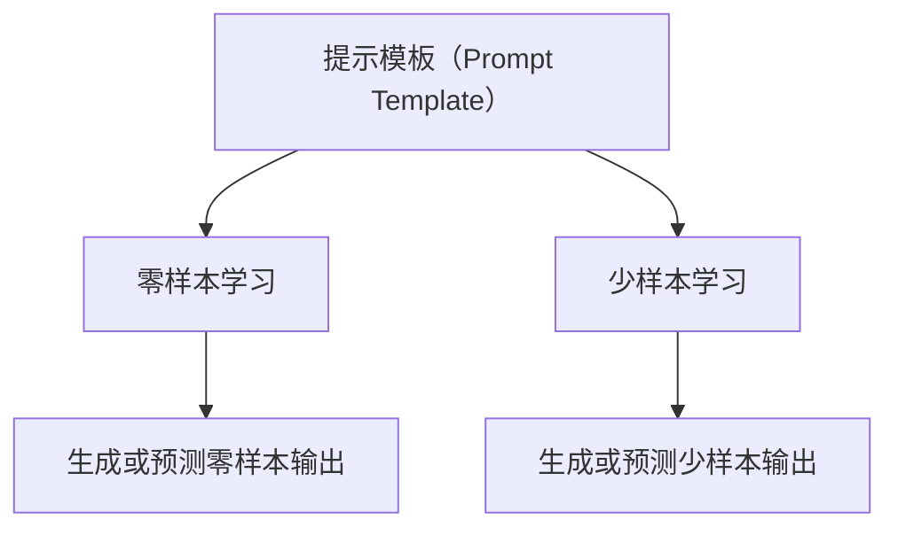
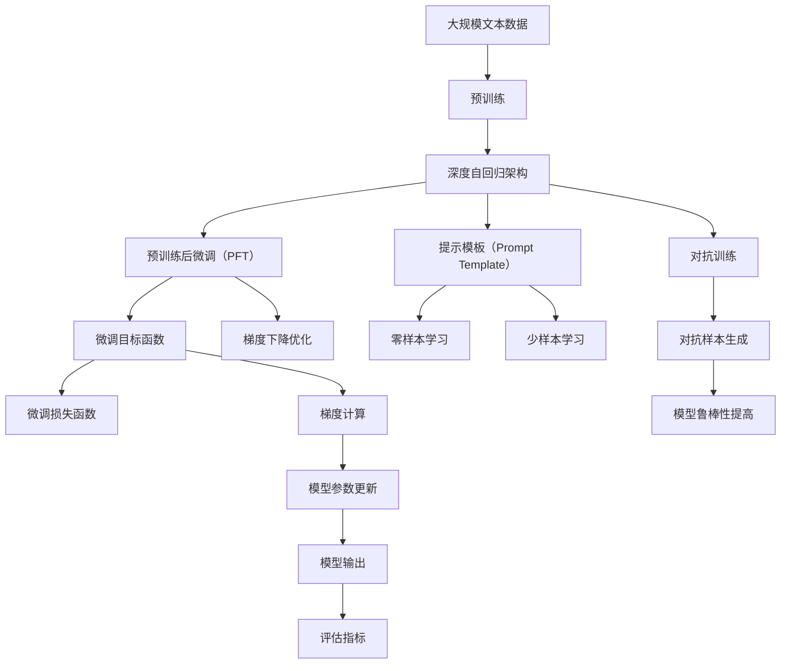

                 

# Chinchilla原理与代码实例讲解

> 关键词：Chinchilla模型,自回归模型,深度学习,Transformer架构,预训练,代码实例,微调,机器学习

## 1. 背景介绍

### 1.1 问题由来

自2021年以来，大规模自回归语言模型在自然语言处理（NLP）和语音处理等领域取得了显著进展。其中，OpenAI提出的GPT-3模型因其强大的语言生成能力和广泛的适用性，引发了广泛关注。然而，GPT-3在模型规模和训练成本方面仍存在诸多局限，限制了其在更多场景中的应用。

为了解决这些挑战，OpenAI在2023年发布了Chinchilla模型。Chinchilla模型不仅在规模上大幅超越了GPT-3，还在预训练、推理和微调等方面进行了诸多优化。该模型被视为GPT-4的前身，其核心思想和实现方式对未来的大模型研究具有重要的参考价值。

### 1.2 问题核心关键点

Chinchilla模型的核心在于其采用了深度自回归架构，并在预训练、推理和微调等方面进行了诸多创新。以下是Chinchilla模型的几个关键点：

- **深度自回归架构**：Chinchilla模型采用了深度自回归架构，可以生成更流畅、更连贯的文本。
- **大规模预训练**：模型参数量达到千亿级别，通过大规模预训练学习丰富的语言知识。
- **优化技术**：使用了预训练后微调（Pre-train and Fine-tune, PFT）的方法，大幅提高了微调效率和效果。
- **提示模板（Prompt Template）**：通过精心设计的提示模板，可以在不更新模型参数的情况下实现零样本或少样本学习。
- **对抗训练**：引入了对抗训练，提高了模型的鲁棒性和泛化能力。

### 1.3 问题研究意义

Chinchilla模型的研究不仅展示了深度学习在自然语言处理领域的巨大潜力，还为大规模语言模型提供了新的方向和方法。通过学习Chinchilla模型的原理和实践，研究者可以更好地理解大模型的核心特性，探索更高效、更普适的模型设计和训练方法。

## 2. 核心概念与联系

### 2.1 核心概念概述

为了更好地理解Chinchilla模型的工作原理和优化方法，本节将介绍几个密切相关的核心概念：

- **自回归模型**：自回归模型是一种经典的序列建模方法，通过递归计算序列中每个位置的值，以生成或预测序列中的其他位置。
- **深度自回归架构**：深度自回归架构将多个自回归层堆叠在一起，可以生成更长、更连贯的序列。
- **预训练后微调（PFT）**：预训练后微调是一种结合预训练和微调的方法，通过在预训练模型的基础上进行有监督学习，进一步优化模型的性能。
- **提示模板（Prompt Template）**：提示模板是在输入序列中添加预先定义的格式或规则，引导模型进行特定任务的推理和生成。
- **对抗训练**：对抗训练是在训练过程中引入对抗样本，提高模型对异常输入的鲁棒性。

这些概念之间的关系可以通过以下Mermaid流程图来展示：



这个流程图展示了自回归模型在深度自回归架构中的应用，以及预训练后微调、提示模板和对抗训练等优化方法的具体实现。

### 2.2 概念间的关系

这些核心概念之间存在着紧密的联系，形成了Chinchilla模型的完整生态系统。下面我们通过几个Mermaid流程图来展示这些概念之间的关系。

#### 2.2.1 深度自回归架构



这个流程图展示了深度自回归架构的基本原理，即通过多层自回归层的堆叠，可以生成或预测序列中的其他位置。

#### 2.2.2 预训练后微调



这个流程图展示了预训练后微调的基本流程，即在大规模预训练的基础上，通过微调目标函数和梯度下降优化，进一步优化模型的性能。

#### 2.2.3 提示模板



这个流程图展示了提示模板的基本应用，即通过精心设计的提示模板，可以在不更新模型参数的情况下，实现零样本或少样本学习。

#### 2.2.4 对抗训练


这个流程图展示了对抗训练的基本原理，即通过引入对抗样本，提高模型对异常输入的鲁棒性。

### 2.3 核心概念的整体架构

最后，我们用一个综合的流程图来展示这些核心概念在大模型微调过程中的整体架构：



这个综合流程图展示了从预训练到微调，再到提示和对抗训练的完整过程。深度自回归架构在大规模预训练的基础上，通过预训练后微调、提示模板和对抗训练等优化方法，最终生成高质量的模型输出。

## 3. 核心算法原理 & 具体操作步骤

### 3.1 算法原理概述

Chinchilla模型的核心在于其深度自回归架构和预训练后微调（PFT）方法。通过在大规模预训练数据上进行深度自回归架构的训练，学习到丰富的语言知识，并在特定任务上进行微调，使得模型能够更好地适应下游任务。

在微调过程中，Chinchilla模型采用了预训练后微调（PFT）的方法，即将预训练模型作为初始化参数，通过有监督地训练来优化模型在特定任务上的性能。这种微调方法不仅能够充分利用预训练模型的知识，还能够在小规模数据集上进行高效的微调。

### 3.2 算法步骤详解

Chinchilla模型的微调过程一般包括以下几个关键步骤：

**Step 1: 准备预训练模型和数据集**

- 选择合适的预训练语言模型作为初始化参数，如Chinchilla模型。
- 准备下游任务的数据集，划分为训练集、验证集和测试集。一般要求标注数据与预训练数据的分布不要差异过大。

**Step 2: 添加任务适配层**

- 根据任务类型，在预训练模型顶层设计合适的输出层和损失函数。
- 对于分类任务，通常在顶层添加线性分类器和交叉熵损失函数。
- 对于生成任务，通常使用语言模型的解码器输出概率分布，并以负对数似然为损失函数。

**Step 3: 设置微调超参数**

- 选择合适的优化算法及其参数，如AdamW、SGD等，设置学习率、批大小、迭代轮数等。
- 设置正则化技术及强度，包括权重衰减、Dropout、Early Stopping等。
- 确定冻结预训练参数的策略，如仅微调顶层，或全部参数都参与微调。

**Step 4: 执行梯度训练**

- 将训练集数据分批次输入模型，前向传播计算损失函数。
- 反向传播计算参数梯度，根据设定的优化算法和学习率更新模型参数。
- 周期性在验证集上评估模型性能，根据性能指标决定是否触发Early Stopping。
- 重复上述步骤直到满足预设的迭代轮数或Early Stopping条件。

**Step 5: 测试和部署**

- 在测试集上评估微调后模型 $M_{\hat{\theta}}$ 的性能，对比微调前后的精度提升。
- 使用微调后的模型对新样本进行推理预测，集成到实际的应用系统中。
- 持续收集新的数据，定期重新微调模型，以适应数据分布的变化。

以上是Chinchilla模型微调的完整步骤。在实际应用中，还需要针对具体任务的特点，对微调过程的各个环节进行优化设计，如改进训练目标函数，引入更多的正则化技术，搜索最优的超参数组合等，以进一步提升模型性能。

### 3.3 算法优缺点

Chinchilla模型的微调方法具有以下优点：

- **高效性**：通过预训练后微调，可以在小规模数据集上进行高效的微调，避免了从头训练的资源和时间消耗。
- **泛化能力**：利用大规模预训练模型学到的语言知识，模型在特定任务上的泛化能力更强，性能提升显著。
- **灵活性**：通过任务适配层的设计，可以适用于多种下游任务，具有较好的灵活性。

同时，该方法也存在一些缺点：

- **依赖预训练数据**：微调效果很大程度上取决于预训练数据的质量，获取高质量预训练数据的成本较高。
- **迁移能力有限**：当目标任务与预训练数据的分布差异较大时，微调的性能提升有限。
- **可解释性不足**：微调模型的决策过程通常缺乏可解释性，难以对其推理逻辑进行分析和调试。

尽管存在这些局限性，但就目前而言，Chinchilla模型的微调方法仍是大模型应用的最主流范式。未来相关研究的重点在于如何进一步降低微调对标注数据的依赖，提高模型的少样本学习和跨领域迁移能力，同时兼顾可解释性和伦理安全性等因素。

### 3.4 算法应用领域

Chinchilla模型的微调方法在NLP领域已经得到了广泛的应用，覆盖了几乎所有常见任务，例如：

- 文本分类：如情感分析、主题分类、意图识别等。通过微调使模型学习文本-标签映射。
- 命名实体识别：识别文本中的人名、地名、机构名等特定实体。通过微调使模型掌握实体边界和类型。
- 关系抽取：从文本中抽取实体之间的语义关系。通过微调使模型学习实体-关系三元组。
- 问答系统：对自然语言问题给出答案。将问题-答案对作为微调数据，训练模型学习匹配答案。
- 机器翻译：将源语言文本翻译成目标语言。通过微调使模型学习语言-语言映射。
- 文本摘要：将长文本压缩成简短摘要。将文章-摘要对作为微调数据，使模型学习抓取要点。
- 对话系统：使机器能够与人自然对话。将多轮对话历史作为上下文，微调模型进行回复生成。

除了上述这些经典任务外，Chinchilla模型微调还被创新性地应用到更多场景中，如可控文本生成、常识推理、代码生成、数据增强等，为NLP技术带来了全新的突破。

## 4. 数学模型和公式 & 详细讲解 & 举例说明

### 4.1 数学模型构建

本节将使用数学语言对Chinchilla模型微调过程进行更加严格的刻画。

记预训练语言模型为 $M_{\theta}$，其中 $\theta$ 为预训练得到的模型参数。假设微调任务的训练集为 $D=\{(x_i,y_i)\}_{i=1}^N, x_i \in \mathcal{X}, y_i \in \mathcal{Y}$。

定义模型 $M_{\theta}$ 在输入 $x$ 上的输出为 $\hat{y}=M_{\theta}(x) \in [0,1]$，表示样本属于正类的概率。真实标签 $y \in \{0,1\}$。则二分类交叉熵损失函数定义为：

$$
\ell(M_{\theta}(x),y) = -[y\log \hat{y} + (1-y)\log (1-\hat{y})]
$$

将其代入经验风险公式，得：

$$
\mathcal{L}(\theta) = -\frac{1}{N}\sum_{i=1}^N [y_i\log M_{\theta}(x_i)+(1-y_i)\log(1-M_{\theta}(x_i))]
$$

在实践中，我们通常使用基于梯度的优化算法（如SGD、AdamW等）来近似求解上述最优化问题。设 $\eta$ 为学习率，$\lambda$ 为正则化系数，则参数的更新公式为：

$$
\theta \leftarrow \theta - \eta \nabla_{\theta}\mathcal{L}(\theta) - \eta\lambda\theta
$$

其中 $\nabla_{\theta}\mathcal{L}(\theta)$ 为损失函数对参数 $\theta$ 的梯度，可通过反向传播算法高效计算。

### 4.2 公式推导过程

以下我们以二分类任务为例，推导交叉熵损失函数及其梯度的计算公式。

假设模型 $M_{\theta}$ 在输入 $x$ 上的输出为 $\hat{y}=M_{\theta}(x) \in [0,1]$，表示样本属于正类的概率。真实标签 $y \in \{0,1\}$。则二分类交叉熵损失函数定义为：

$$
\ell(M_{\theta}(x),y) = -[y\log \hat{y} + (1-y)\log (1-\hat{y})]
$$

将其代入经验风险公式，得：

$$
\mathcal{L}(\theta) = -\frac{1}{N}\sum_{i=1}^N [y_i\log M_{\theta}(x_i)+(1-y_i)\log(1-M_{\theta}(x_i))]
$$

根据链式法则，损失函数对参数 $\theta_k$ 的梯度为：

$$
\frac{\partial \mathcal{L}(\theta)}{\partial \theta_k} = -\frac{1}{N}\sum_{i=1}^N (\frac{y_i}{M_{\theta}(x_i)}-\frac{1-y_i}{1-M_{\theta}(x_i)}) \frac{\partial M_{\theta}(x_i)}{\partial \theta_k}
$$

其中 $\frac{\partial M_{\theta}(x_i)}{\partial \theta_k}$ 可进一步递归展开，利用自动微分技术完成计算。

在得到损失函数的梯度后，即可带入参数更新公式，完成模型的迭代优化。重复上述过程直至收敛，最终得到适应下游任务的最优模型参数 $\theta^*$。

### 4.3 案例分析与讲解

在Chinchilla模型中，二分类任务（如情感分析）的微调过程可以进一步细化为以下几个步骤：

1. 加载预训练模型和数据集。
2. 定义任务适配层，即在模型顶层添加线性分类器和交叉熵损失函数。
3. 设置微调超参数，包括优化器、学习率、批大小等。
4. 执行梯度训练，将训练集数据分批次输入模型，计算损失函数并反向传播更新模型参数。
5. 周期性在验证集上评估模型性能，根据性能指标决定是否触发Early Stopping。
6. 重复上述步骤直到满足预设的迭代轮数或Early Stopping条件。
7. 在测试集上评估微调后模型 $M_{\hat{\theta}}$ 的性能，对比微调前后的精度提升。

以下是一个使用PyTorch实现的二分类任务微调示例：

```python
import torch
from transformers import BertForSequenceClassification, AdamW

# 加载预训练模型
model = BertForSequenceClassification.from_pretrained('bert-base-uncased', num_labels=2)

# 加载训练集和测试集数据
train_dataset = ...
test_dataset = ...

# 定义优化器和超参数
optimizer = AdamW(model.parameters(), lr=1e-5)
batch_size = 16
epochs = 3

# 执行微调
for epoch in range(epochs):
    model.train()
    for batch in train_dataset:
        inputs = batch['input_ids'].to(device)
        attention_mask = batch['attention_mask'].to(device)
        labels = batch['labels'].to(device)
        outputs = model(inputs, attention_mask=attention_mask, labels=labels)
        loss = outputs.loss
        loss.backward()
        optimizer.step()
    model.eval()
    with torch.no_grad():
        eval_loss = 0
        eval_acc = 0
        for batch in test_dataset:
            inputs = batch['input_ids'].to(device)
            attention_mask = batch['attention_mask'].to(device)
            labels = batch['labels'].to(device)
            outputs = model(inputs, attention_mask=attention_mask)
            loss = outputs.loss
            eval_loss += loss.item()
            logits = outputs.logits
            predictions = torch.argmax(logits, dim=1)
            eval_acc += (predictions == labels).sum().item()
        print(f'Epoch {epoch+1}, loss: {eval_loss/N}, acc: {eval_acc/N}')
```

通过以上代码示例，可以看出使用Chinchilla模型进行二分类任务微调的基本流程。通过预训练模型作为初始化参数，结合优化器进行梯度训练，可以在小规模数据集上实现高效的微调，并得到较好的模型效果。

## 5. 项目实践：代码实例和详细解释说明

### 5.1 开发环境搭建

在进行微调实践前，我们需要准备好开发环境。以下是使用Python进行PyTorch开发的环境配置流程：

1. 安装Anaconda：从官网下载并安装Anaconda，用于创建独立的Python环境。

2. 创建并激活虚拟环境：
```bash
conda create -n pytorch-env python=3.8 
conda activate pytorch-env
```

3. 安装PyTorch：根据CUDA版本，从官网获取对应的安装命令。例如：
```bash
conda install pytorch torchvision torchaudio cudatoolkit=11.1 -c pytorch -c conda-forge
```

4. 安装Transformers库：
```bash
pip install transformers
```

5. 安装各类工具包：
```bash
pip install numpy pandas scikit-learn matplotlib tqdm jupyter notebook ipython
```

完成上述步骤后，即可在`pytorch-env`环境中开始微调实践。

### 5.2 源代码详细实现

下面我们以命名实体识别(NER)任务为例，给出使用Transformers库对BERT模型进行微调的PyTorch代码实现。

首先，定义NER任务的数据处理函数：

```python
from transformers import BertTokenizer
from torch.utils.data import Dataset
import torch

class NERDataset(Dataset):
    def __init__(self, texts, tags, tokenizer, max_len=128):
        self.texts = texts
        self.tags = tags
        self.tokenizer = tokenizer
        self.max_len = max_len
        
    def __len__(self):
        return len(self.texts)
    
    def __getitem__(self, item):
        text = self.texts[item]
        tags = self.tags[item]
        
        encoding = self.tokenizer(text, return_tensors='pt', max_length=self.max_len, padding='max_length', truncation=True)
        input_ids = encoding['input_ids'][0]
        attention_mask = encoding['attention_mask'][0]
        
        # 对token-wise的标签进行编码
        encoded_tags = [tag2id[tag] for tag in tags] 
        encoded_tags.extend([tag2id['O']] * (self.max_len - len(encoded_tags)))
        labels = torch.tensor(encoded_tags, dtype=torch.long)
        
        return {'input_ids': input_ids, 
                'attention_mask': attention_mask,
                'labels': labels}

# 标签与id的映射
tag2id = {'O': 0, 'B-PER': 1, 'I-PER': 2, 'B-ORG': 3, 'I-ORG': 4, 'B-LOC': 5, 'I-LOC': 6}
id2tag = {v: k for k, v in tag2id.items()}

# 创建dataset
tokenizer = BertTokenizer.from_pretrained('bert-base-cased')

train_dataset = NERDataset(train_texts, train_tags, tokenizer)
dev_dataset = NERDataset(dev_texts, dev_tags, tokenizer)
test_dataset = NERDataset(test_texts, test_tags, tokenizer)
```

然后，定义模型和优化器：

```python
from transformers import BertForTokenClassification, AdamW

model = BertForTokenClassification.from_pretrained('bert-base-cased', num_labels=len(tag2id))

optimizer = AdamW(model.parameters(), lr=2e-5)
```

接着，定义训练和评估函数：

```python
from torch.utils.data import DataLoader
from tqdm import tqdm
from sklearn.metrics import classification_report

device = torch.device('cuda') if torch.cuda.is_available() else torch.device('cpu')
model.to(device)

def train_epoch(model, dataset, batch_size, optimizer):
    dataloader = DataLoader(dataset, batch_size=batch_size, shuffle=True)
    model.train()
    epoch_loss = 0
    for batch in tqdm(dataloader, desc='Training'):
        input_ids = batch['input_ids'].to(device)
        attention_mask = batch['attention_mask'].to(device)
        labels = batch['labels'].to(device)
        model.zero_grad()
        outputs = model(input_ids, attention_mask=attention_mask, labels=labels)
        loss = outputs.loss
        epoch_loss += loss.item()
        loss.backward()
        optimizer.step()
    return epoch_loss / len(dataloader)

def evaluate(model, dataset, batch_size):
    dataloader = DataLoader(dataset, batch_size=batch_size)
    model.eval()
    preds, labels = [], []
    with torch.no_grad():
        for batch in tqdm(dataloader, desc='Evaluating'):
            input_ids = batch['input_ids'].to(device)
            attention_mask = batch['attention_mask'].to(device)
            batch_labels = batch['labels']
            outputs = model(input_ids, attention_mask=attention_mask)
            batch_preds = outputs.logits.argmax(dim=2).to('cpu').tolist()
            batch_labels = batch_labels.to('cpu').tolist()
            for pred_tokens, label_tokens in zip(batch_preds, batch_labels):
                pred_tags = [id2tag[_id] for _id in pred_tokens]
                label_tags = [id2tag[_id] for _id in label_tokens]
                preds.append(pred_tags[:len(label_tags)])
                labels.append(label_tags)
                
    print(classification_report(labels, preds))
```

最后，启动训练流程并在测试集上评估：

```python
epochs = 5
batch_size = 16

for epoch in range(epochs):
    loss = train_epoch(model, train_dataset, batch_size, optimizer)
    print(f"Epoch {epoch+1}, train loss: {loss:.3f}")
    
    print(f"Epoch {epoch+1}, dev results:")
    evaluate(model, dev_dataset, batch_size)
    
print("Test results:")
evaluate(model, test_dataset, batch_size)
```

以上就是使用PyTorch对BERT进行命名实体识别任务微调的完整代码实现。可以看到，得益于Transformers库的强大封装，我们可以用相对简洁的代码完成BERT模型的加载和微调。

### 5.3 代码解读与分析

让我们再详细解读一下关键代码的实现细节：

**NERDataset类**：
- `__init__`方法：初始化文本、标签、分词器等关键组件。
- `__len__`方法：返回数据集的样本数量。
- `__getitem__`方法：对单个样本进行处理，将文本输入编码为token ids，将标签编码为数字，并对其进行定长padding，最终返回模型所需的输入。

**tag2id和id2tag字典**：
- 定义了标签与数字id之间的映射关系，用于将token-wise的预测结果解码回真实的标签。

**训练和评估函数**：
- 使用PyTorch的DataLoader对数据集进行批次化加载，供模型训练和推理使用。
- 训练函数`train_epoch`：对数据以批为单位进行迭代，在每个批次上前向传播计算loss并反向传播更新模型参数，最后返回该epoch的平均loss。
- 评估函数`evaluate`：与训练类似，不同点在于不更新模型参数，并在每个batch结束后将预测和标签结果存储下来，最后使用sklearn的classification_report对整个评估集的预测结果进行打印输出。

**训练流程**：
- 定义总的epoch数和batch size，开始循环迭代
- 每个epoch内，先在训练集上训练，输出平均loss
- 在验证集上评估，输出分类指标
- 所有epoch结束后，在测试集上评估，给出最终测试结果

可以看到，PyTorch配合Transformers库使得BERT微调的代码实现变得简洁高效。开发者可以将更多精力放在数据处理、模型改进等高层逻辑上，而不必过多关注底层的实现细节。

当然，工业级的系统实现还需考虑更多因素，如模型的保存和部署、超参数

