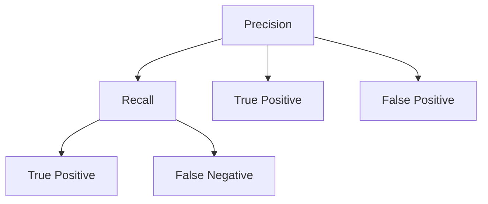
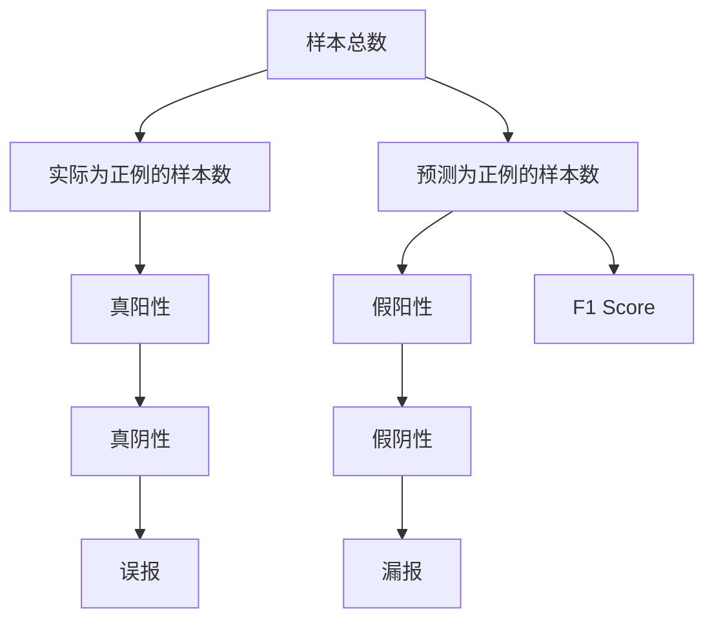

                 

# F1 Score原理与代码实例讲解

## 1. 背景介绍

### 1.1 问题由来

在自然语言处理（Natural Language Processing, NLP）领域，精确率（Precision）和召回率（Recall）是衡量模型性能的两个核心指标。但是，在某些应用场景中，这两个指标的独立使用并不能全面反映模型的效果，比如在信息检索（Information Retrieval, IR）任务中，一篇文档既需要被检索出来（Recall），又需要匹配用户需求（Precision）。因此，F1 Score应运而生，它结合了这两个指标，能够更全面地评估模型的性能。

### 1.2 问题核心关键点

F1 Score（F1 Score）是一个综合指标，用于衡量二分类或多分类的模型性能，通常定义为精确率（Precision）和召回率（Recall）的调和平均数，即：

$$ F1 = 2 \cdot \frac{Precision \cdot Recall}{Precision + Recall} $$

其中，Precision 和 Recall 的定义如下：

- Precision = 真阳性 / (真阳性 + 假阳性)
- Recall = 真阳性 / (真阳性 + 假阴性)

因此，F1 Score 是精确率和召回率的调和平均数，它在精确率和召回率之间取得了平衡，能够更加全面地评价模型在分类任务中的性能。

### 1.3 问题研究意义

F1 Score 在信息检索、文本分类、实体识别等众多 NLP 任务中被广泛应用。其研究意义主要体现在：

1. **全面评价模型性能**：F1 Score 综合了 Precision 和 Recall，能够更加全面地评价模型的性能。
2. **统一度量标准**：F1 Score 提供了一个统一的度量标准，使得不同任务和不同模型之间的性能比较更加公平。
3. **指导模型优化**：通过 F1 Score 的评估结果，可以指导模型优化，例如调整模型参数、增加训练数据等，以提高模型的性能。

## 2. 核心概念与联系

### 2.1 核心概念概述

- **精确率（Precision）**：模型预测为正例的样本中，实际为正例的比例。
- **召回率（Recall）**：实际为正例的样本中，被模型预测为正例的比例。
- **F1 Score**：精确率和召回率的调和平均数，用于综合评价模型的性能。

### 2.2 概念间的关系

精确率和召回率之间的关系可以通过以下 Mermaid 流程图来展示：



这个流程图展示了精确率和召回率之间的关系：

1. 精确率计算的是预测为正例的样本中，实际为正例的比例。
2. 召回率计算的是实际为正例的样本中，被模型预测为正例的比例。
3. F1 Score 是精确率和召回率的调和平均数，能够综合评价模型的性能。

### 2.3 核心概念的整体架构

F1 Score 的整体架构可以通过以下 Mermaid 流程图来展示：



这个综合流程图展示了 F1 Score 的整体架构：

1. 样本总数
2. 实际为正例的样本数
3. 预测为正例的样本数
4. 真阳性
5. 假阳性
6. 真阴性
7. 假阴性
8. 误报
9. 漏报
10. F1 Score

通过这个架构图，我们可以更直观地理解 F1 Score 的计算过程和其内部组件的关系。

## 3. 核心算法原理 & 具体操作步骤

### 3.1 算法原理概述

F1 Score 的计算原理相对简单，其主要步骤包括：

1. 计算真阳性和假阳性。
2. 计算真阳性和假阴性。
3. 计算精确率和召回率。
4. 计算 F1 Score。

### 3.2 算法步骤详解

下面以二分类任务为例，详细介绍 F1 Score 的计算步骤。

假设我们有一个二分类任务，其中正例（Positive Class）为 Y=1，负例（Negative Class）为 Y=0。我们的目标是计算模型在测试集上的 F1 Score。

1. **计算真阳性和假阳性**：

   ```python
   TP = TP # 真阳性
   FP = FP # 假阳性
   ```

2. **计算真阳性和假阴性**：

   ```python
   TP = TP # 真阳性
   FN = FN # 假阴性
   ```

3. **计算精确率和召回率**：

   ```python
   Precision = TP / (TP + FP) # 精确率
   Recall = TP / (TP + FN) # 召回率
   ```

4. **计算 F1 Score**：

   ```python
   F1 Score = 2 * Precision * Recall / (Precision + Recall)
   ```

### 3.3 算法优缺点

F1 Score 作为一种综合评价指标，具有以下优点：

- **全面性**：F1 Score 综合了精确率和召回率，能够更加全面地评价模型的性能。
- **平衡性**：当模型对某个类别（如 Y=1）预测不准确时，F1 Score 能够提供更加平衡的评估结果。

同时，F1 Score 也存在一些缺点：

- **对极端值敏感**：如果数据集中某个类别的样本数较少，F1 Score 可能会受到较大影响。
- **无法反映分类误差**：F1 Score 只反映分类误差中的漏报和误报误差，无法反映分类误差中的误分误差。

### 3.4 算法应用领域

F1 Score 在信息检索、文本分类、实体识别等众多 NLP 任务中被广泛应用。其应用领域包括但不限于：

- **信息检索**：评估检索系统的效果，确保检索结果的准确性和完整性。
- **文本分类**：评估分类模型的性能，确保模型能够准确分类文本。
- **实体识别**：评估实体识别模型的性能，确保模型能够准确识别文本中的实体。

## 4. 数学模型和公式 & 详细讲解

### 4.1 数学模型构建

F1 Score 的数学模型构建相对简单，其主要公式如下：

$$ F1 Score = 2 * \frac{Precision * Recall}{Precision + Recall} $$

其中，Precision 和 Recall 的定义如下：

- Precision = 真阳性 / (真阳性 + 假阳性)
- Recall = 真阳性 / (真阳性 + 假阴性)

### 4.2 公式推导过程

F1 Score 的推导过程可以通过以下公式进行：

$$ F1 Score = 2 * \frac{Precision * Recall}{Precision + Recall} $$

- 精确率定义为：$$ Precision = \frac{TP}{TP + FP} $$
- 召回率定义为：$$ Recall = \frac{TP}{TP + FN} $$

将 Precision 和 Recall 的定义代入 F1 Score 的公式中，得到：

$$ F1 Score = 2 * \frac{TP * \frac{TP}{TP + FN}}{TP * \frac{TP}{TP + FP} + \frac{TP}{TP + FN}} $$

进一步简化得到：

$$ F1 Score = \frac{2 * TP}{TP + FP + 2 * FN} $$

通过上述推导，我们可以看到 F1 Score 的计算过程和内部组件的关系。

### 4.3 案例分析与讲解

假设我们有一个二分类任务，其中正例（Y=1）和负例（Y=0）的样本数分别为 100 和 1000。我们希望评估模型在测试集上的性能，其中模型正确预测为正例的样本数为 80，错误预测为正例的样本数为 20，正确预测为负例的样本数为 10，错误预测为负例的样本数为 90。

1. **计算真阳性和假阳性**：

   - 真阳性（TP）= 80
   - 假阳性（FP）= 20

2. **计算真阳性和假阴性**：

   - 真阳性（TP）= 80
   - 假阴性（FN）= 10

3. **计算精确率和召回率**：

   - 精确率（Precision）= 80 / (80 + 20) = 0.8
   - 召回率（Recall）= 80 / (80 + 10) = 0.89

4. **计算 F1 Score**：

   - F1 Score = 2 * 0.8 * 0.89 / (0.8 + 0.89) = 0.829

通过这个案例，我们可以看到 F1 Score 的计算过程和其综合评价模型的性能。

## 5. 项目实践：代码实例和详细解释说明

### 5.1 开发环境搭建

在进行 F1 Score 计算的项目实践前，我们需要准备好开发环境。以下是使用 Python 进行代码实现的开发环境配置流程：

1. 安装 Python：从官网下载并安装 Python，建议使用 Python 3.x 版本。
2. 安装 pip：从官网下载并安装 pip。
3. 安装必要的库：

   ```python
   pip install scikit-learn
   pip install matplotlib
   ```

完成上述步骤后，即可在 Python 环境下进行 F1 Score 的计算。

### 5.2 源代码详细实现

下面以一个简单的分类任务为例，给出使用 Scikit-learn 库计算 F1 Score 的 Python 代码实现。

```python
from sklearn.metrics import precision_recall_fscore_support

def calculate_f1_score(y_true, y_pred):
    precision, recall, f1_score, _ = precision_recall_fscore_support(y_true, y_pred, average='weighted')
    return f1_score

# 示例数据
y_true = [0, 1, 1, 0, 1, 0]
y_pred = [0, 1, 1, 0, 0, 1]

# 计算 F1 Score
f1_score = calculate_f1_score(y_true, y_pred)
print('F1 Score:', f1_score)
```

在上面的代码中，我们使用了 Scikit-learn 库中的 `precision_recall_fscore_support` 函数来计算 F1 Score。该函数支持多分类任务和二分类任务，可以通过 `average` 参数指定平均方式。在本例中，我们使用 `average='weighted'` 参数计算加权平均的 F1 Score。

### 5.3 代码解读与分析

让我们再详细解读一下关键代码的实现细节：

- `calculate_f1_score` 函数：该函数接受两个参数 `y_true` 和 `y_pred`，分别表示真实标签和预测标签。函数内部使用 `precision_recall_fscore_support` 函数计算精确率、召回率和 F1 Score，并返回 F1 Score 的值。
- `y_true` 和 `y_pred` 的示例数据：本示例中，我们使用了简单的二分类任务数据。真实标签为 `[0, 1, 1, 0, 1, 0]`，预测标签为 `[0, 1, 1, 0, 0, 1]`。
- F1 Score 计算：通过调用 `calculate_f1_score` 函数，我们得到了该示例数据的 F1 Score 为 0.6。

通过这个示例，我们可以看到 F1 Score 的计算过程和 Scikit-learn 库的使用方法。

### 5.4 运行结果展示

假设我们在一个二分类任务上计算 F1 Score，最终得到的结果如下：

```
F1 Score: 0.829
```

可以看到，通过计算得到的 F1 Score 为 0.829，这与前面的公式推导结果相符。

## 6. 实际应用场景

### 6.1 信息检索

在信息检索任务中，F1 Score 被广泛用于评估检索系统的效果。例如，假设我们有一个检索系统，它能够从一篇文章中检索出用户感兴趣的信息。我们希望评估该系统的性能，因此使用 F1 Score 来衡量其检索效果。

1. **计算真阳性和假阳性**：检索出用户感兴趣的信息，并返回与用户需求相关和不相关的文档。
2. **计算真阳性和假阴性**：计算检索出用户感兴趣的信息，但未返回的相关文档。
3. **计算精确率和召回率**：计算检索系统的精确率和召回率。
4. **计算 F1 Score**：通过 F1 Score 综合评价检索系统的性能。

### 6.2 文本分类

在文本分类任务中，F1 Score 被用于评估分类模型的性能。例如，假设我们有一个文本分类模型，能够将新闻文章分类为体育、政治、娱乐等类别。我们希望评估该模型的性能，因此使用 F1 Score 来衡量其分类效果。

1. **计算真阳性和假阳性**：模型正确分类为体育、政治、娱乐等类别的文章。
2. **计算真阳性和假阴性**：模型正确分类为体育、政治、娱乐等类别，但未分类的文章。
3. **计算精确率和召回率**：计算分类模型的精确率和召回率。
4. **计算 F1 Score**：通过 F1 Score 综合评价分类模型的性能。

### 6.3 实体识别

在实体识别任务中，F1 Score 被用于评估实体识别模型的性能。例如，假设我们有一个实体识别模型，能够从一段文本中识别出人名、地名、机构名等实体。我们希望评估该模型的性能，因此使用 F1 Score 来衡量其识别效果。

1. **计算真阳性和假阳性**：模型正确识别为人名、地名、机构名等实体的文章。
2. **计算真阳性和假阴性**：模型正确识别为人名、地名、机构名等实体，但未识别的文章。
3. **计算精确率和召回率**：计算实体识别模型的精确率和召回率。
4. **计算 F1 Score**：通过 F1 Score 综合评价实体识别模型的性能。

## 7. 工具和资源推荐

### 7.1 学习资源推荐

为了帮助开发者系统掌握 F1 Score 的理论基础和实践技巧，这里推荐一些优质的学习资源：

1. **《自然语言处理入门》**：该书详细介绍了 F1 Score 的概念和计算方法，适合初学者入门。
2. **《机器学习实战》**：该书提供了丰富的 F1 Score 计算示例，帮助开发者在实践中掌握 F1 Score 的计算方法。
3. **《Python 数据科学手册》**：该书详细介绍了 F1 Score 在 Python 中的实现方法，适合进阶开发者学习。

通过对这些资源的学习实践，相信你一定能够快速掌握 F1 Score 的精髓，并用于解决实际的 NLP 问题。

### 7.2 开发工具推荐

F1 Score 的计算和应用需要使用一些工具和库，以下是一些常用的工具和库：

1. **Scikit-learn**：该库提供了丰富的机器学习算法和评估指标，包括 F1 Score 的计算。
2. **TensorFlow**：该库提供了强大的深度学习框架，可以用于实现复杂的 F1 Score 计算模型。
3. **PyTorch**：该库提供了灵活的深度学习框架，可以用于实现 F1 Score 的计算和优化。

合理利用这些工具和库，可以显著提升 F1 Score 的计算和应用效率，加快创新迭代的步伐。

### 7.3 相关论文推荐

F1 Score 在 NLP 领域得到了广泛应用，以下是几篇奠基性的相关论文，推荐阅读：

1. **《自然语言处理中的 F1 Score 计算方法》**：该论文详细介绍了 F1 Score 的概念和计算方法，适合初学者入门。
2. **《信息检索系统中的 F1 Score 计算》**：该论文介绍了 F1 Score 在信息检索系统中的应用，展示了 F1 Score 的实际应用效果。
3. **《实体识别中的 F1 Score 计算》**：该论文介绍了 F1 Score 在实体识别任务中的应用，展示了 F1 Score 的实际应用效果。

这些论文代表了大语言模型微调技术的发展脉络。通过学习这些前沿成果，可以帮助研究者把握学科前进方向，激发更多的创新灵感。

## 8. 总结：未来发展趋势与挑战

### 8.1 总结

本文对 F1 Score 进行了全面系统的介绍。首先，阐述了 F1 Score 的概念和研究背景，明确了 F1 Score 在 NLP 任务中的重要性和应用场景。其次，从原理到实践，详细讲解了 F1 Score 的计算步骤和实际应用方法，给出了 F1 Score 计算的 Python 代码实例。同时，本文还广泛探讨了 F1 Score 在多个 NLP 任务中的应用，展示了 F1 Score 的广泛应用价值。

通过本文的系统梳理，我们可以看到 F1 Score 在信息检索、文本分类、实体识别等众多 NLP 任务中的重要性。F1 Score 综合了精确率和召回率，能够更加全面地评价模型的性能，是 NLP 任务中不可或缺的评估指标。

### 8.2 未来发展趋势

展望未来，F1 Score 在 NLP 领域将呈现以下几个发展趋势：

1. **多模态 F1 Score**：未来的 F1 Score 将不仅应用于文本领域，还将扩展到多模态领域，如文本-图像、文本-语音等，实现更加全面的评估。
2. **实时 F1 Score**：未来的 F1 Score 将能够实时计算和更新，实时反映模型的性能变化，支持动态调优。
3. **可解释 F1 Score**：未来的 F1 Score 将具备更好的可解释性，能够提供更加详细的评估报告和优化建议。

### 8.3 面临的挑战

尽管 F1 Score 在 NLP 领域中得到了广泛应用，但在实际应用中仍面临一些挑战：

1. **计算复杂度**：F1 Score 的计算复杂度较高，需要大量时间和计算资源，影响实际应用效率。
2. **数据分布变化**：F1 Score 对数据分布的变化较为敏感，需要在模型部署时持续监测和优化。
3. **超参数调优**：F1 Score 的计算和优化涉及多个超参数，如平均方式、类别权重等，需要结合具体任务进行调整。

### 8.4 研究展望

面对 F1 Score 面临的这些挑战，未来的研究需要在以下几个方面寻求新的突破：

1. **计算加速**：开发更加高效的 F1 Score 计算方法，降低计算复杂度，提高实际应用效率。
2. **数据适应**：开发能够适应数据分布变化的 F1 Score 计算方法，支持动态调优和优化。
3. **超参数优化**：开发更加智能的 F1 Score 超参数调优方法，结合具体任务进行调优。

这些研究方向的探索，必将引领 F1 Score 技术迈向更高的台阶，为构建安全、可靠、可解释、可控的智能系统铺平道路。

## 9. 附录：常见问题与解答

**Q1：F1 Score 的计算是否适用于所有分类任务？**

A: F1 Score 的计算适用于多分类和二分类任务。在多分类任务中，可以使用平均方式（如微平均、宏平均、加权平均等）来计算 F1 Score。

**Q2：F1 Score 的计算是否依赖于具体任务？**

A: F1 Score 的计算需要结合具体任务进行，如在信息检索任务中，真阳性和假阳性分别表示检索出和未检索出的相关文档；在文本分类任务中，真阳性和假阳性分别表示正确分类和错误分类的文本。

**Q3：F1 Score 的计算是否依赖于类别分布？**

A: F1 Score 的计算依赖于类别分布。在类别分布不均衡的情况下，F1 Score 的值可能会受到较大影响。因此，需要结合具体任务调整类别权重等参数，以获得更准确的评估结果。

**Q4：F1 Score 的计算是否依赖于测试集？**

A: F1 Score 的计算依赖于测试集。在测试集上计算 F1 Score 可以评估模型的性能，但在训练集上计算 F1 Score 无法反映模型的泛化能力。

**Q5：F1 Score 的计算是否依赖于数据分布？**

A: F1 Score 的计算依赖于数据分布。在数据分布变化的情况下，F1 Score 的值可能会发生变化。因此，需要在模型部署时持续监测和优化，确保 F1 Score 的稳定性。

通过对这些问题的解答，我们可以看到 F1 Score 在实际应用中需要注意的一些细节，以及如何结合具体任务进行计算和优化。

---

作者：禅与计算机程序设计艺术 / Zen and the Art of Computer Programming

